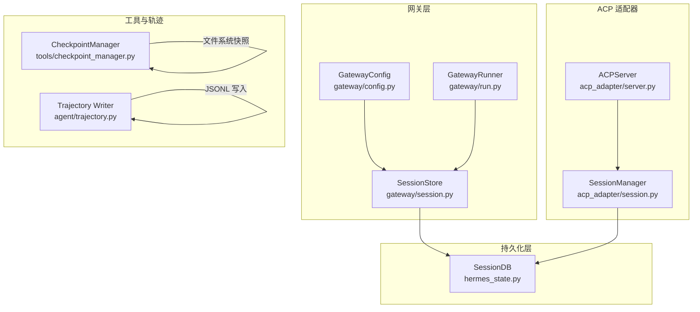
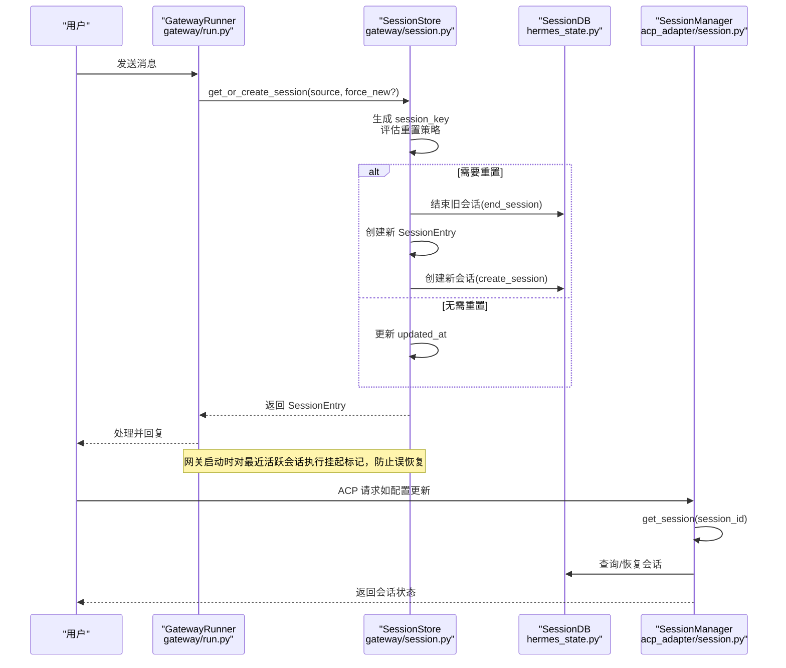
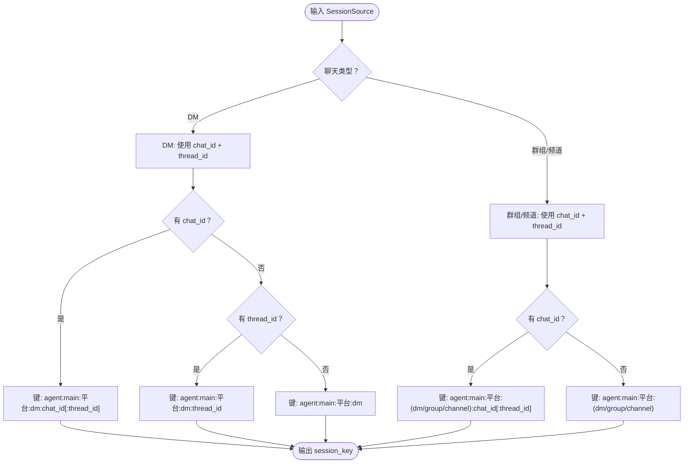
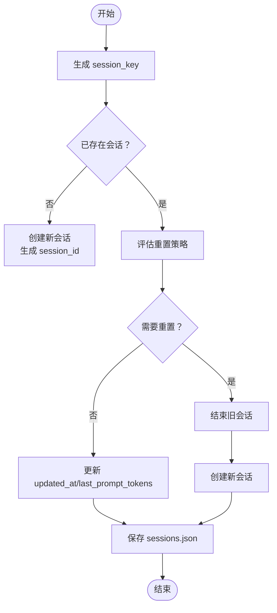
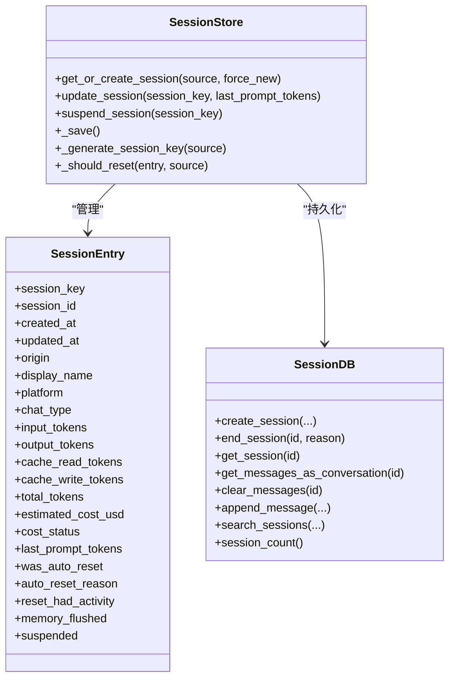
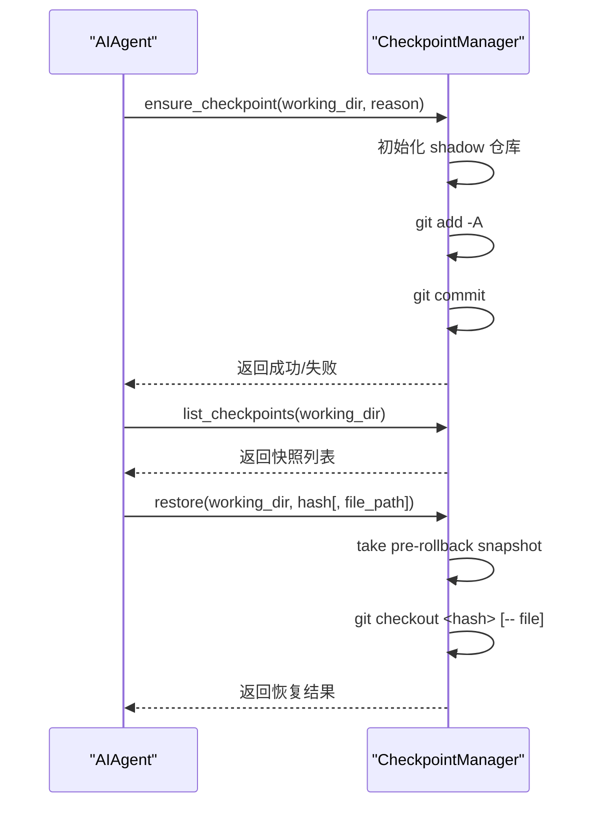
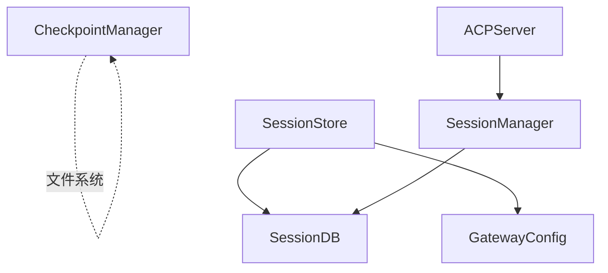

# 会话管理系统

<cite>
**本文档引用的文件**
- [gateway/session.py](file://gateway/session.py)
- [gateway/config.py](file://gateway/config.py)
- [hermes_state.py](file://hermes_state.py)
- [tools/checkpoint_manager.py](file://tools/checkpoint_manager.py)
- [agent/trajectory.py](file://agent/trajectory.py)
- [acp_adapter/session.py](file://acp_adapter/session.py)
- [acp_adapter/server.py](file://acp_adapter/server.py)
- [gateway/run.py](file://gateway/run.py)
- [website/docs/user-guide/messaging/index.md](file://website/docs/user-guide/messaging/index.md)
- [website/docs/user-guide/security.md](file://website/docs/user-guide/security.md)
- [website/docs/developer-guide/gateway-internals.md](file://website/docs/developer-guide/gateway-internals.md)
</cite>

## 目录
1. [简介](#简介)
2. [项目结构](#项目结构)
3. [核心组件](#核心组件)
4. [架构总览](#架构总览)
5. [详细组件分析](#详细组件分析)
6. [依赖关系分析](#依赖关系分析)
7. [性能考虑](#性能考虑)
8. [故障排查指南](#故障排查指南)
9. [结论](#结论)
10. [附录](#附录)

## 简介
本文件系统性阐述 Hermes Agent 的会话管理系统，覆盖会话状态管理、生命周期与持久化策略；解释会话标识符生成规则、会话隔离与恢复机制；详述轨迹保存、检查点管理与回滚能力；提供会话配置选项与性能调优建议；说明多平台会话同步与一致性保障；并给出会话安全、权限控制与数据保护措施，以及会话与消息网关的集成关系。

## 项目结构
围绕会话管理的关键模块分布如下：
- 网关层会话存储：gateway/session.py 提供会话键生成、过期判断、自动重置、轻量元数据更新与挂起标记等能力，并通过 hermes_state.py 的 SessionDB 实现 SQLite 持久化。
- 配置层：gateway/config.py 定义会话重置策略（按日/空闲/两者）及平台级覆盖。
- ACP 适配器：acp_adapter/session.py 将 ACP 会话映射到 Hermes AIAgent 实例，持久化至共享 SessionDB，支持创建、fork、列表、清理与恢复。
- 文件系统检查点：tools/checkpoint_manager.py 基于 shadow git 仓库实现透明快照与回滚，用于文件变更保护。
- 轨迹保存：agent/trajectory.py 提供对话轨迹的 JSONL 追加写入。
- 网关运行时：gateway/run.py 中包含内存刷新与失败重试逻辑，确保会话状态在重启后一致。
- 文档参考：website/docs/user-guide/messaging/index.md 与 website/docs/user-guide/security.md 提供用户侧配置与安全边界说明。

**图表来源**
- [gateway/session.py:495-800](file://gateway/session.py#L495-L800)
- [gateway/config.py:100-140](file://gateway/config.py#L100-L140)
- [hermes_state.py:115-200](file://hermes_state.py#L115-L200)
- [acp_adapter/session.py:70-250](file://acp_adapter/session.py#L70-L250)
- [acp_adapter/server.py:715-728](file://acp_adapter/server.py#L715-L728)
- [tools/checkpoint_manager.py:246-320](file://tools/checkpoint_manager.py#L246-L320)
- [agent/trajectory.py:30-57](file://agent/trajectory.py#L30-L57)
- [gateway/run.py:1817-1840](file://gateway/run.py#L1817-L1840)

**章节来源**
- [gateway/session.py:1-1081](file://gateway/session.py#L1-L1081)
- [gateway/config.py:1-200](file://gateway/config.py#L1-L200)
- [hermes_state.py:1-200](file://hermes_state.py#L1-L200)
- [acp_adapter/session.py:1-200](file://acp_adapter/session.py#L1-L200)
- [tools/checkpoint_manager.py:1-200](file://tools/checkpoint_manager.py#L1-L200)
- [agent/trajectory.py:1-57](file://agent/trajectory.py#L1-L57)
- [gateway/run.py:1817-1840](file://gateway/run.py#L1817-L1840)
- [website/docs/user-guide/messaging/index.md:149-193](file://website/docs/user-guide/messaging/index.md#L149-L193)
- [website/docs/developer-guide/gateway-internals.md:26-50](file://website/docs/developer-guide/gateway-internals.md#L26-L50)

## 核心组件
- 会话键生成与隔离规则：基于来源平台、聊天类型、聊天标识、线程标识与参与者标识构建确定性键，支持 DM、群组、频道与线程的细粒度隔离。
- 会话存储与持久化：SessionStore 维护 sessions.json 映射表，同时通过 SessionDB 记录会话元数据与消息历史，支持 WAL 模式与 FTS5 全文检索。
- 会话重置策略：按日/空闲/两者组合策略评估是否需要自动重置，支持平台级覆盖与通知策略。
- ACP 会话管理：将 ACP 会话映射到 AIAgent 实例，持久化至共享数据库，支持 fork、列表、清理与恢复。
- 文件系统检查点：基于 shadow git 仓库的自动快照与回滚，限制目录规模与路径遍历风险。
- 轨迹保存：以 JSONL 追加方式保存对话样本或失败轨迹，便于离线分析与复盘。
- 内存刷新与失败重试：网关启动时对最近活跃会话进行挂起标记，避免重启后误恢复；内存刷新失败具备重试上限与防死循环保护。

**章节来源**
- [gateway/session.py:436-493](file://gateway/session.py#L436-L493)
- [gateway/session.py:495-800](file://gateway/session.py#L495-L800)
- [gateway/config.py:100-140](file://gateway/config.py#L100-L140)
- [hermes_state.py:115-200](file://hermes_state.py#L115-L200)
- [acp_adapter/session.py:70-250](file://acp_adapter/session.py#L70-L250)
- [tools/checkpoint_manager.py:246-320](file://tools/checkpoint_manager.py#L246-L320)
- [agent/trajectory.py:30-57](file://agent/trajectory.py#L30-L57)
- [gateway/run.py:1817-1840](file://gateway/run.py#L1817-L1840)

## 架构总览
下图展示会话管理在网关与 ACP 适配器中的整体交互，包括会话键生成、持久化、重置策略与恢复流程。

**图表来源**
- [gateway/run.py:1817-1840](file://gateway/run.py#L1817-L1840)
- [gateway/session.py:683-768](file://gateway/session.py#L683-L768)
- [hermes_state.py:115-200](file://hermes_state.py#L115-L200)
- [acp_adapter/session.py:114-126](file://acp_adapter/session.py#L114-L126)

**章节来源**
- [website/docs/developer-guide/gateway-internals.md:26-50](file://website/docs/developer-guide/gateway-internals.md#L26-L50)
- [gateway/session.py:683-768](file://gateway/session.py#L683-L768)
- [gateway/run.py:1817-1840](file://gateway/run.py#L1817-L1840)
- [acp_adapter/session.py:114-126](file://acp_adapter/session.py#L114-L126)

## 详细组件分析

### 会话键生成与会话隔离
- 键生成规则：
  - DM：优先使用 chat_id 区分私聊；若存在 thread_id 则进一步区分线程；均不存在时可退化为单一会话。
  - 群组/频道：以 chat_id 作为父级标识；thread_id 区分线程；默认线程内跨用户共享会话（可通过配置开启 per-user 隔离）。
- 隔离策略：
  - 支持按用户 ID 或备用 ID（user_id_alt）进行 per-user 隔离。
  - 线程场景默认共享，除非显式启用 per-user 线程隔离。
- 作用：
  - 确保不同平台、不同聊天、不同线程、不同用户之间的会话相互独立，避免上下文污染。

**图表来源**
- [gateway/session.py:436-493](file://gateway/session.py#L436-L493)

**章节来源**
- [gateway/session.py:436-493](file://gateway/session.py#L436-L493)

### 会话生命周期与自动重置
- 生命周期阶段：
  - 创建：首次访问生成 session_id，记录来源与显示名、平台、聊天类型等元数据。
  - 更新：每次交互后更新 updated_at 与 last_prompt_tokens 等轻量字段。
  - 重置：根据策略（空闲/按日/两者）判定是否需要重置；重置时结束旧会话并创建新会话。
  - 挂起：/stop 等操作可标记 suspended，下次访问时强制重置。
- 重置策略：
  - 默认模式为“两者”，空闲阈值与每日重置小时可配置；支持平台级覆盖与通知策略。
- 启动恢复保护：
  - 网关启动时对最近活跃会话（默认 120 秒内）标记 suspended，避免重启后误恢复。

**图表来源**
- [gateway/session.py:683-768](file://gateway/session.py#L683-L768)
- [gateway/session.py:579-659](file://gateway/session.py#L579-L659)
- [gateway/session.py:801-822](file://gateway/session.py#L801-L822)

**章节来源**
- [gateway/session.py:579-659](file://gateway/session.py#L579-L659)
- [gateway/session.py:683-768](file://gateway/session.py#L683-L768)
- [gateway/session.py:801-822](file://gateway/session.py#L801-L822)
- [gateway/config.py:100-140](file://gateway/config.py#L100-L140)
- [website/docs/user-guide/messaging/index.md:149-193](file://website/docs/user-guide/messaging/index.md#L149-L193)

### 会话持久化与一致性
- 网关侧：
  - sessions.json：维护 session_key -> SessionEntry 的映射，采用临时文件 + 原子替换写入，保证落盘一致性。
  - SessionDB：SQLite 存储会话元数据与消息历史，支持 WAL 模式与 FTS5 全文检索；写入采用短超时 + 应用层抖动重试，避免写锁拥堵。
- ACP 侧：
  - SessionDB 同步存储 ACP 会话，支持模型配置、工作目录、消息历史的持久化与恢复；提供 fork、列表、清理等操作。
- 一致性保障：
  - 写入前持有锁，写入后 fsync；应用层重试与随机抖动降低写锁竞争；重启后通过挂起标记避免误恢复。

**图表来源**
- [gateway/session.py:495-800](file://gateway/session.py#L495-L800)
- [hermes_state.py:115-200](file://hermes_state.py#L115-L200)

**章节来源**
- [gateway/session.py:548-570](file://gateway/session.py#L548-L570)
- [gateway/session.py:495-547](file://gateway/session.py#L495-L547)
- [hermes_state.py:115-200](file://hermes_state.py#L115-L200)
- [gateway/run.py:1817-1840](file://gateway/run.py#L1817-L1840)

### 会话标识符生成与会话隔离
- 会话标识符由 session_key 与 session_id 共同构成：
  - session_key：基于来源构建的确定性键，决定会话隔离边界。
  - session_id：每次重置或新建时生成的新标识，用于区分不同轮次的会话。
- 隔离边界：
  - 平台、聊天类型、聊天标识、线程标识、用户标识共同决定 session_key，从而实现跨平台、跨群组、跨线程的严格隔离。

**章节来源**
- [gateway/session.py:436-493](file://gateway/session.py#L436-L493)
- [gateway/session.py:731-745](file://gateway/session.py#L731-L745)

### 会话恢复机制
- 网关侧：
  - 启动时对最近活跃会话标记 suspended，避免重启后误恢复。
  - 会话过期检测与内存刷新失败重试，确保状态稳定。
- ACP 侧：
  - 从 SessionDB 加载会话元数据与消息历史，重建 AIAgent 实例，恢复工作目录与模型配置。

**章节来源**
- [gateway/session.py:801-822](file://gateway/session.py#L801-L822)
- [gateway/run.py:1817-1840](file://gateway/run.py#L1817-L1840)
- [acp_adapter/session.py:333-405](file://acp_adapter/session.py#L333-L405)

### 轨迹保存与检查点管理
- 轨迹保存：
  - 以 JSONL 追加写入，包含对话样本与失败轨迹，便于后续分析。
- 检查点管理：
  - 基于 shadow git 仓库的自动快照与回滚，限制目录规模与路径遍历风险，支持单文件或整目录恢复。

**图表来源**
- [tools/checkpoint_manager.py:280-320](file://tools/checkpoint_manager.py#L280-L320)
- [tools/checkpoint_manager.py:424-490](file://tools/checkpoint_manager.py#L424-L490)

**章节来源**
- [agent/trajectory.py:30-57](file://agent/trajectory.py#L30-L57)
- [tools/checkpoint_manager.py:246-320](file://tools/checkpoint_manager.py#L246-L320)
- [tools/checkpoint_manager.py:424-490](file://tools/checkpoint_manager.py#L424-L490)

### 会话与消息网关的集成关系
- 网关运行时：
  - 在消息处理链路中，先通过 SessionStore 获取或创建会话，再交由 AIAgent 处理。
  - 支持按平台配置 HomeChannel 与回复模式，统一交付策略。
- ACP 集成：
  - ACP 服务器通过 SessionManager 管理会话，持久化至 SessionDB，支持配置项更新与会话状态查询。

**章节来源**
- [website/docs/developer-guide/gateway-internals.md:26-50](file://website/docs/developer-guide/gateway-internals.md#L26-L50)
- [acp_adapter/server.py:715-728](file://acp_adapter/server.py#L715-L728)
- [acp_adapter/session.py:238-248](file://acp_adapter/session.py#L238-L248)

## 依赖关系分析
- 组件耦合：
  - SessionStore 依赖 GatewayConfig 的重置策略与平台配置；依赖 SessionDB 进行持久化。
  - ACP SessionManager 依赖 SessionDB 进行跨进程会话持久化与恢复。
  - CheckpointManager 与 ACP SessionManager 解耦，仅在文件系统层面提供快照能力。
- 外部依赖：
  - SQLite（WAL + FTS5）、git 可执行文件（用于检查点）、平台适配器（Telegram/Discord/Slack 等）。

**图表来源**
- [gateway/session.py:495-520](file://gateway/session.py#L495-L520)
- [hermes_state.py:115-200](file://hermes_state.py#L115-L200)
- [acp_adapter/session.py:251-272](file://acp_adapter/session.py#L251-L272)
- [tools/checkpoint_manager.py:1-100](file://tools/checkpoint_manager.py#L1-L100)

**章节来源**
- [gateway/session.py:495-520](file://gateway/session.py#L495-L520)
- [hermes_state.py:115-200](file://hermes_state.py#L115-L200)
- [acp_adapter/session.py:251-272](file://acp_adapter/session.py#L251-L272)
- [tools/checkpoint_manager.py:1-100](file://tools/checkpoint_manager.py#L1-L100)

## 性能考虑
- 写入竞争与锁等待：
  - SessionDB 采用 WAL 模式与短超时 + 应用层抖动重试，避免 SQLite 内建忙等待导致的队头阻塞。
  - 定期执行 WAL checkpoint，减少日志膨胀。
- I/O 与序列化：
  - sessions.json 使用临时文件 + 原子替换写入，减少部分写入风险；fsync 确保落盘。
- 目录规模与检查点：
  - CheckpointManager 对目录文件数量设限，避免大目录快照带来的性能问题。
- 会话重置频率：
  - 合理设置 idle_minutes 与 at_hour，平衡上下文连续性与资源占用。

**章节来源**
- [hermes_state.py:115-200](file://hermes_state.py#L115-L200)
- [gateway/session.py:548-570](file://gateway/session.py#L548-L570)
- [tools/checkpoint_manager.py:229-240](file://tools/checkpoint_manager.py#L229-L240)

## 故障排查指南
- 会话未按预期重置：
  - 检查 GatewayConfig 的重置策略与平台覆盖；确认 has_active_processes_fn 是否阻止了重置。
- 重启后会话被误恢复：
  - 确认网关启动时的 suspend_recently_active 行为是否生效；必要时手动标记 suspended。
- 内存刷新失败：
  - 查看失败计数与重试上限；确认磁盘空间与权限；必要时手动标记 memory_flushed。
- ACP 会话无法恢复：
  - 检查 SessionDB 是否可用；确认 session_id 对应的 source 是否为 "acp"；核对模型配置与工作目录。
- 检查点不可用：
  - 确认 git 可执行文件存在；检查目录是否过大或路径不合法；查看 shadow 仓库初始化日志。

**章节来源**
- [gateway/session.py:579-659](file://gateway/session.py#L579-L659)
- [gateway/session.py:801-822](file://gateway/session.py#L801-L822)
- [gateway/run.py:1817-1840](file://gateway/run.py#L1817-L1840)
- [acp_adapter/session.py:333-405](file://acp_adapter/session.py#L333-L405)
- [tools/checkpoint_manager.py:201-227](file://tools/checkpoint_manager.py#L201-L227)

## 结论
Hermes Agent 的会话管理系统通过明确的键生成规则实现强隔离，结合 SQLite 持久化与 WAL/FTS5 提升一致性与检索效率；网关侧提供灵活的重置策略与启动恢复保护，ACP 侧实现跨进程会话持久化与恢复；文件系统检查点与轨迹保存为开发与运维提供可观测性与回滚能力。配合安全与权限控制，系统在多平台环境下实现了高可靠、高性能且可审计的会话管理。

## 附录
- 会话配置选项（节选）：
  - 重置策略：mode（daily/idle/both/none）、at_hour、idle_minutes、notify、notify_exclude_platforms。
  - 平台级覆盖：通过环境变量或配置文件为特定平台设置不同的重置策略。
- 安全与权限：
  - 网关默认仅允许白名单用户或通过 DM 配对的用户；危险命令需人工审批；容器沙箱与 MCP 凭证过滤进一步降低风险。
- 多平台同步与一致性：
  - 通过共享 SessionDB 与确定性 session_key，确保跨平台、跨进程的一致性；会话键规则保证不同来源不会互相干扰。

**章节来源**
- [gateway/config.py:100-140](file://gateway/config.py#L100-L140)
- [website/docs/user-guide/messaging/index.md:149-193](file://website/docs/user-guide/messaging/index.md#L149-L193)
- [website/docs/user-guide/security.md:1-200](file://website/docs/user-guide/security.md#L1-L200)