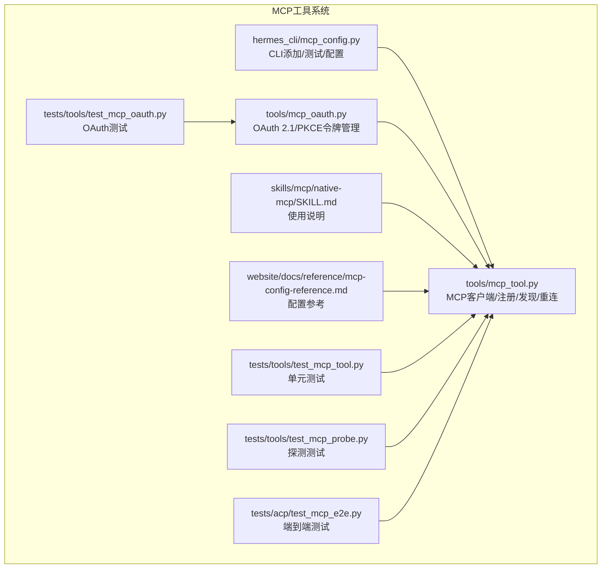
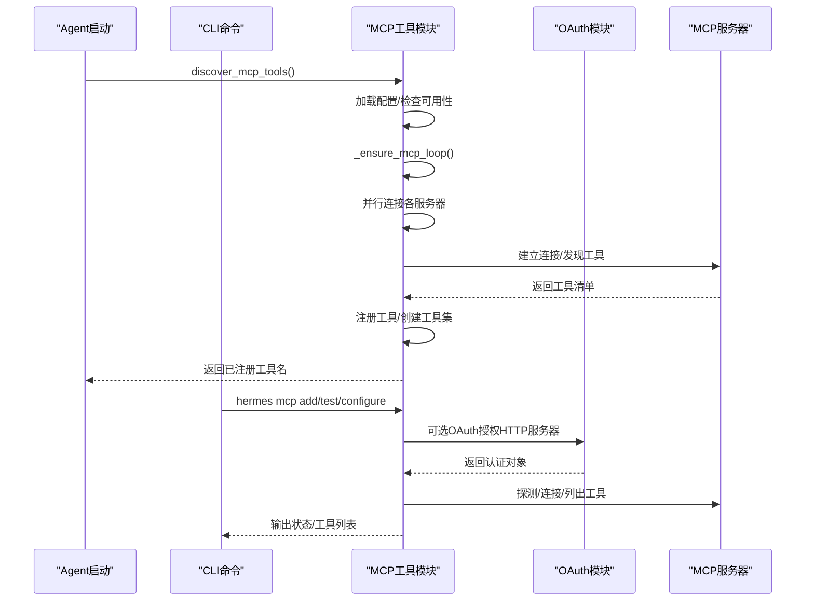
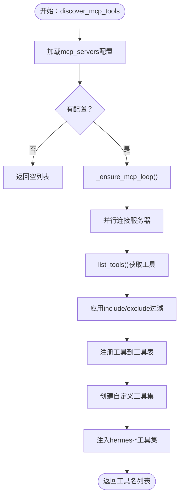
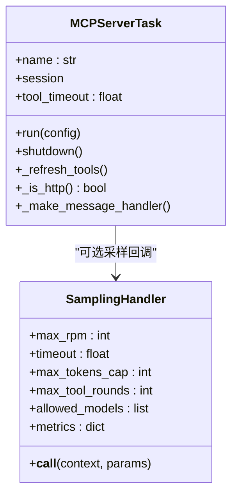
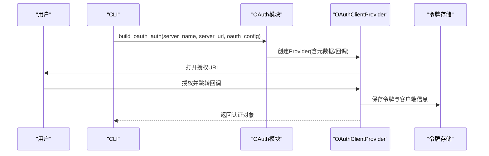
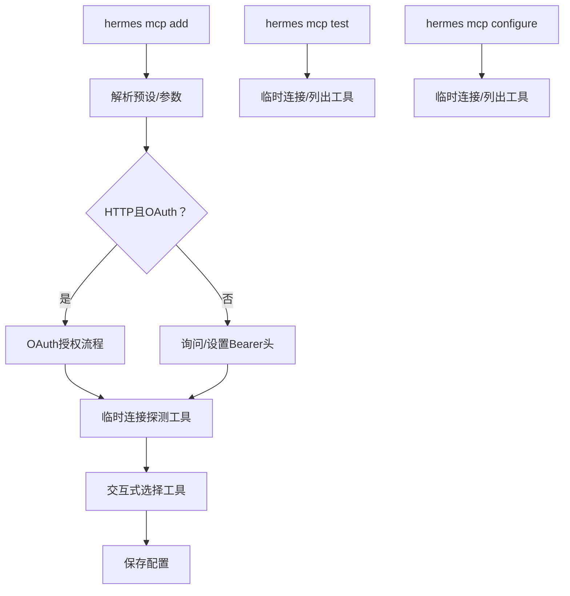
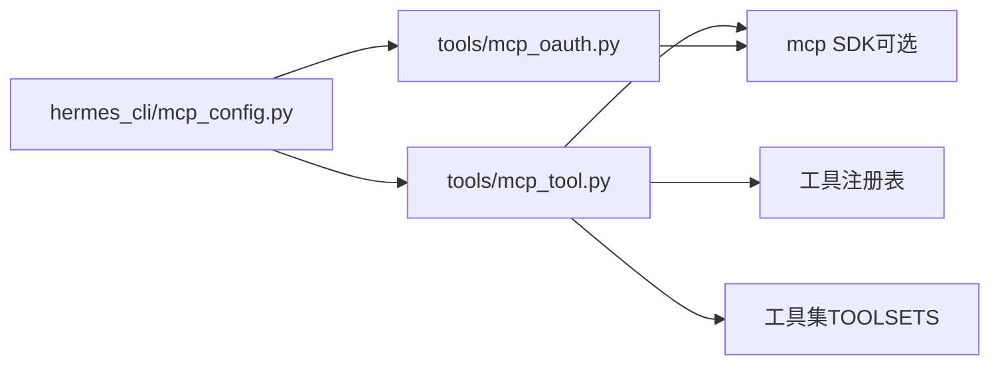

# MCP工具

<cite>
**本文引用的文件**
- [tools/mcp_tool.py](file://tools/mcp_tool.py)
- [tools/mcp_oauth.py](file://tools/mcp_oauth.py)
- [hermes_cli/mcp_config.py](file://hermes_cli/mcp_config.py)
- [skills/mcp/native-mcp/SKILL.md](file://skills/mcp/native-mcp/SKILL.md)
- [website/docs/reference/mcp-config-reference.md](file://website/docs/reference/mcp-config-reference.md)
- [tests/tools/test_mcp_tool.py](file://tests/tools/test_mcp_tool.py)
- [tests/tools/test_mcp_oauth.py](file://tests/tools/test_mcp_oauth.py)
- [tests/tools/test_mcp_probe.py](file://tests/tools/test_mcp_probe.py)
- [tests/acp/test_mcp_e2e.py](file://tests/acp/test_mcp_e2e.py)
</cite>

## 目录
1. [简介](#简介)
2. [项目结构](#项目结构)
3. [核心组件](#核心组件)
4. [架构总览](#架构总览)
5. [详细组件分析](#详细组件分析)
6. [依赖分析](#依赖分析)
7. [性能考虑](#性能考虑)
8. [故障排查指南](#故障排查指南)
9. [结论](#结论)
10. [附录](#附录)

## 简介
本文件面向Hermes Agent的MCP（Model Context Protocol）工具系统，系统化阐述其协议实现机制、工具表面更新与外部服务器集成方式；详解MCP工具的发现流程、认证机制与安全策略；覆盖动态加载、版本管理与兼容性处理；解释OAuth认证流程、令牌管理与权限控制；并提供配置方法、调试技巧与性能优化建议，以及错误处理、重连机制与监控指标。

## 项目结构
围绕MCP工具系统的关键代码分布在以下模块：
- 工具客户端与注册：tools/mcp_tool.py
- OAuth认证支持：tools/mcp_oauth.py
- CLI配置管理：hermes_cli/mcp_config.py
- 使用说明与参考：skills/mcp/native-mcp/SKILL.md、website/docs/reference/mcp-config-reference.md
- 测试用例：tests/tools/test_mcp_tool.py、tests/tools/test_mcp_oauth.py、tests/tools/test_mcp_probe.py、tests/acp/test_mcp_e2e.py

**图表来源**
- [tools/mcp_tool.py:1-2196](file://tools/mcp_tool.py#L1-L2196)
- [tools/mcp_oauth.py:1-483](file://tools/mcp_oauth.py#L1-L483)
- [hermes_cli/mcp_config.py:1-717](file://hermes_cli/mcp_config.py#L1-L717)
- [skills/mcp/native-mcp/SKILL.md:1-357](file://skills/mcp/native-mcp/SKILL.md#L1-L357)
- [website/docs/reference/mcp-config-reference.md:1-248](file://website/docs/reference/mcp-config-reference.md#L1-L248)
- [tests/tools/test_mcp_tool.py:1-3064](file://tests/tools/test_mcp_tool.py#L1-L3064)
- [tests/tools/test_mcp_oauth.py:1-483](file://tests/tools/test_mcp_oauth.py#L1-L483)
- [tests/tools/test_mcp_probe.py:129-215](file://tests/tools/test_mcp_probe.py#L129-L215)
- [tests/acp/test_mcp_e2e.py:79-109](file://tests/acp/test_mcp_e2e.py#L79-L109)

**章节来源**
- [tools/mcp_tool.py:1-2196](file://tools/mcp_tool.py#L1-L2196)
- [tools/mcp_oauth.py:1-483](file://tools/mcp_oauth.py#L1-L483)
- [hermes_cli/mcp_config.py:1-717](file://hermes_cli/mcp_config.py#L1-L717)
- [skills/mcp/native-mcp/SKILL.md:1-357](file://skills/mcp/native-mcp/SKILL.md#L1-L357)
- [website/docs/reference/mcp-config-reference.md:1-248](file://website/docs/reference/mcp-config-reference.md#L1-L248)

## 核心组件
- MCP客户端与会话管理：负责连接外部MCP服务器（stdio或HTTP/StreamableHTTP）、工具发现、工具注册、动态刷新与持久化连接。
- 工具注册与命名：将MCP工具转换为Hermes工具注册表项，并按“mcp_{server}_{tool}”前缀命名，自动注入到平台工具集。
- 过滤与工具集同步：支持include/exclude白名单/黑名单过滤、资源与提示工具的条件注册、工具集同步。
- 重连与生命周期：指数回退重连（最多5次，最大60秒），优雅关闭与孤儿进程清理。
- 安全与凭证：stdio环境变量过滤、错误消息中的凭据脱敏、HTTP头与OAuth令牌存储。
- OAuth 2.1/PKCE：浏览器授权码流程、动态客户端注册、令牌持久化与刷新。
- CLI配置管理：交互式添加/测试/配置MCP服务器，临时探测工具列表，保存配置并支持重载。

**章节来源**
- [tools/mcp_tool.py:1540-1846](file://tools/mcp_tool.py#L1540-L1846)
- [tools/mcp_tool.py:1878-2004](file://tools/mcp_tool.py#L1878-L2004)
- [tools/mcp_tool.py:2007-2110](file://tools/mcp_tool.py#L2007-L2110)
- [tools/mcp_oauth.py:378-483](file://tools/mcp_oauth.py#L378-L483)
- [hermes_cli/mcp_config.py:219-408](file://hermes_cli/mcp_config.py#L219-L408)

## 架构总览
MCP工具系统采用“后台事件循环 + 长连接任务”的架构：
- 后台事件循环在守护线程中运行，每个MCP服务器以独立asyncio任务保持长连接。
- 工具发现与注册在首次连接后完成，并支持服务端通知触发的动态刷新。
- 工具调用通过同步包装器调度到事件循环，返回JSON结果。
- HTTP传输需要mcp包具备HTTP客户端能力；stdio传输通过子进程启动服务器。

**图表来源**
- [tools/mcp_tool.py:1958-2004](file://tools/mcp_tool.py#L1958-L2004)
- [hermes_cli/mcp_config.py:219-408](file://hermes_cli/mcp_config.py#L219-L408)
- [tools/mcp_oauth.py:378-483](file://tools/mcp_oauth.py#L378-L483)

**章节来源**
- [tools/mcp_tool.py:1958-2004](file://tools/mcp_tool.py#L1958-L2004)
- [hermes_cli/mcp_config.py:219-408](file://hermes_cli/mcp_config.py#L219-L408)

## 详细组件分析

### 组件A：MCP工具发现与注册
- 发现流程：加载配置→并行连接→list_tools→注册工具→创建自定义工具集→注入hermes-*工具集。
- 过滤策略：支持include（白名单）优先于exclude（黑名单），默认注册全部；工具集同步时避免与内置工具集冲突。
- 动态刷新：监听工具列表变更通知，加锁防止并发刷新，原子更新工具集合。
- 工具命名：mcp_{server}_{tool}，连字符与点号替换为下划线，确保LLM函数调用兼容。
- 资源与提示工具：仅在服务器实际支持相应能力时注册list_resources/read_resource与list_prompts/get_prompt。

**图表来源**
- [tools/mcp_tool.py:1958-2004](file://tools/mcp_tool.py#L1958-L2004)
- [tools/mcp_tool.py:1746-1846](file://tools/mcp_tool.py#L1746-L1846)

**章节来源**
- [tools/mcp_tool.py:1746-1846](file://tools/mcp_tool.py#L1746-L1846)
- [tools/mcp_tool.py:1878-2004](file://tools/mcp_tool.py#L1878-L2004)
- [website/docs/reference/mcp-config-reference.md:54-145](file://website/docs/reference/mcp-config-reference.md#L54-L145)

### 组件B：MCP服务器任务与重连机制
- 每个服务器在独立asyncio任务中运行，确保取消作用域在同一任务上下文内进入/退出。
- 初始连接失败立即报告；后续断开按指数回退重连（最多5次，上限60秒），shutdown时并行关闭。
- 子进程stdio服务器在事件循环停止后可能遗留，系统提供强制清理逻辑。
- 采样回调（sampling/createMessage）支持速率限制、模型白名单、令牌用量统计与审计日志。

**图表来源**
- [tools/mcp_tool.py:720-785](file://tools/mcp_tool.py#L720-L785)
- [tools/mcp_tool.py:349-714](file://tools/mcp_tool.py#L349-L714)

**章节来源**
- [tools/mcp_tool.py:720-785](file://tools/mcp_tool.py#L720-L785)
- [tools/mcp_tool.py:349-714](file://tools/mcp_tool.py#L349-L714)
- [tests/tools/test_mcp_tool.py:934-1008](file://tests/tools/test_mcp_tool.py#L934-L1008)

### 组件C：OAuth 2.1认证与令牌管理
- 流程：浏览器打开授权页→本地回调服务器接收授权码→SDK交换令牌→持久化存储（HERMES_HOME/mcp-tokens）→自动刷新。
- 支持动态客户端注册、PKCE、scope定制、客户端名称与端口配置。
- 交互模式检测：非交互环境且无缓存令牌时发出警告，避免静默失败。
- 提供移除令牌接口，便于清理与重新授权。

**图表来源**
- [tools/mcp_oauth.py:378-483](file://tools/mcp_oauth.py#L378-L483)
- [hermes_cli/mcp_config.py:277-300](file://hermes_cli/mcp_config.py#L277-L300)

**章节来源**
- [tools/mcp_oauth.py:1-483](file://tools/mcp_oauth.py#L1-L483)
- [hermes_cli/mcp_config.py:277-300](file://hermes_cli/mcp_config.py#L277-L300)
- [website/docs/reference/mcp-config-reference.md:231-248](file://website/docs/reference/mcp-config-reference.md#L231-L248)

### 组件D：CLI配置与工具选择
- hermes mcp add：交互式添加服务器，支持preset、env参数（仅stdio）、OAuth配置；连接探测工具并允许选择启用工具。
- hermes mcp test：临时连接测试服务器，显示传输/认证/工具列表。
- hermes mcp configure：交互式调整工具白/黑名单。
- 探测工具：不注册工具，仅用于UI选择；失败服务器不会被记录。

**图表来源**
- [hermes_cli/mcp_config.py:219-408](file://hermes_cli/mcp_config.py#L219-L408)
- [hermes_cli/mcp_config.py:511-571](file://hermes_cli/mcp_config.py#L511-L571)
- [hermes_cli/mcp_config.py:582-676](file://hermes_cli/mcp_config.py#L582-L676)

**章节来源**
- [hermes_cli/mcp_config.py:219-408](file://hermes_cli/mcp_config.py#L219-L408)
- [hermes_cli/mcp_config.py:511-571](file://hermes_cli/mcp_config.py#L511-L571)
- [hermes_cli/mcp_config.py:582-676](file://hermes_cli/mcp_config.py#L582-L676)

## 依赖分析
- 外部SDK依赖：mcp（可选），包含ClientSession、stdio_client、streamable_http_client、types与notification类型等；当不可用时，MCP功能降级为空操作。
- 线程与异步：后台事件循环与守护线程，工具调用通过run_coroutine_threadsafe调度，保证线程安全。
- 工具注册：依赖工具注册表与工具集（TOOLSETS）进行注入与同步。

**图表来源**
- [tools/mcp_tool.py:90-137](file://tools/mcp_tool.py#L90-L137)
- [tools/mcp_oauth.py:55-67](file://tools/mcp_oauth.py#L55-L67)
- [hermes_cli/mcp_config.py:1-717](file://hermes_cli/mcp_config.py#L1-L717)

**章节来源**
- [tools/mcp_tool.py:90-137](file://tools/mcp_tool.py#L90-L137)
- [tools/mcp_oauth.py:55-67](file://tools/mcp_oauth.py#L55-L67)

## 性能考虑
- 并行发现：多服务器并行连接，缩短整体初始化时间。
- 采样限流：每分钟请求数限制、令牌上限与超时控制，避免过载。
- 事件循环复用：所有MCP操作在单一后台事件循环中执行，减少上下文切换。
- 调用超时：工具调用与连接超时可配置，默认值平衡稳定性与响应速度。
- 日志与审计：采样回调支持不同级别审计日志，便于性能与行为追踪。

[本节为通用指导，无需特定文件引用]

## 故障排查指南
- “MCP SDK不可用”：安装mcp包；若未安装，MCP功能将被禁用。
- “无MCP服务器配置”：确认~/.hermes/config.yaml中存在mcp_servers键。
- “连接失败”：检查命令是否存在、npx/uvx是否可用、HTTP端点可达、超时设置是否合理。
- “HTTP传输不可用”：升级mcp包以获得HTTP客户端支持。
- “工具未出现”：确认服务器位于mcp_servers下、缩进正确、查看启动日志、注意工具名前缀格式。
- “连接频繁断开”：检查网络与服务器稳定性；客户端会进行指数回退重连（最多5次）。
- “OAuth无法完成”：确保交互终端可用、浏览器可打开授权页；非交互环境需先在交互环境中完成授权。

**章节来源**
- [skills/mcp/native-mcp/SKILL.md:204-243](file://skills/mcp/native-mcp/SKILL.md#L204-L243)
- [website/docs/reference/mcp-config-reference.md:231-248](file://website/docs/reference/mcp-config-reference.md#L231-L248)
- [hermes_cli/mcp_config.py:219-408](file://hermes_cli/mcp_config.py#L219-L408)

## 结论
Hermes Agent的MCP工具系统通过清晰的模块划分与稳健的架构设计，实现了对MCP服务器的动态发现、安全认证与工具注册，并提供了完善的CLI管理与可观测性支持。其过滤与工具集同步机制、OAuth 2.1流程与令牌持久化、指数回退重连与孤儿进程清理，共同保障了生产环境下的可靠性与易用性。

[本节为总结，无需特定文件引用]

## 附录

### 配置要点速查
- 服务器类型：stdio（command/args/env）或HTTP（url/headers）。
- 认证：静态Bearer头或OAuth 2.1（auth: oauth）。
- 工具过滤：tools.include（白名单优先）、tools.exclude（黑名单）、tools.resources/prompts布尔开关。
- 采样：sampling.enabled/max_rpm/max_tokens_cap/timeout/allowed_models/max_tool_rounds/log_level。
- 重载：/reload-mcp。

**章节来源**
- [website/docs/reference/mcp-config-reference.md:15-198](file://website/docs/reference/mcp-config-reference.md#L15-L198)
- [skills/mcp/native-mcp/SKILL.md:61-101](file://skills/mcp/native-mcp/SKILL.md#L61-L101)

### 端到端集成验证
- ACP端到端测试展示了从配置转换、服务器连接、工具发现到代理工具面刷新的完整链路。

**章节来源**
- [tests/acp/test_mcp_e2e.py:79-109](file://tests/acp/test_mcp_e2e.py#L79-L109)