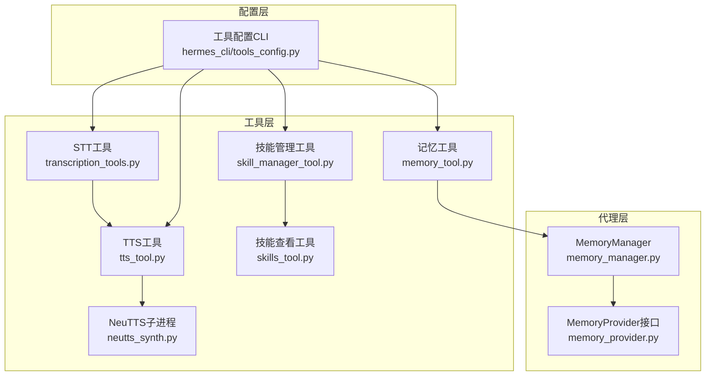
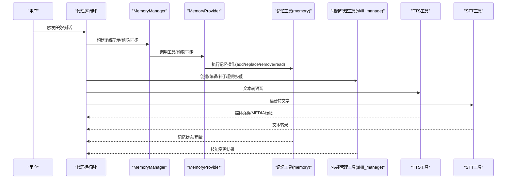
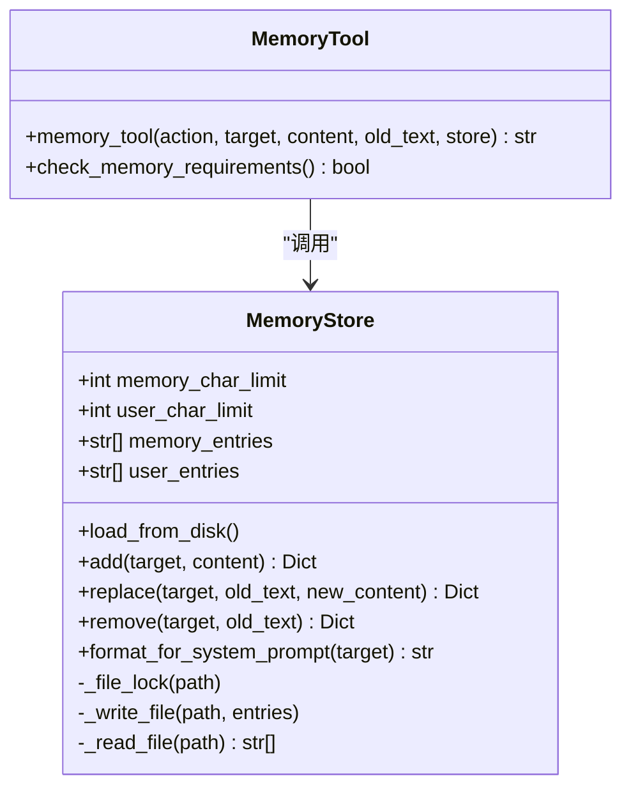
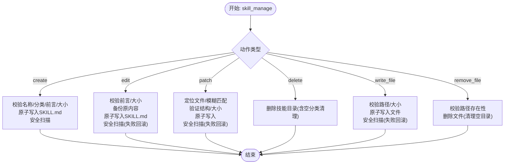
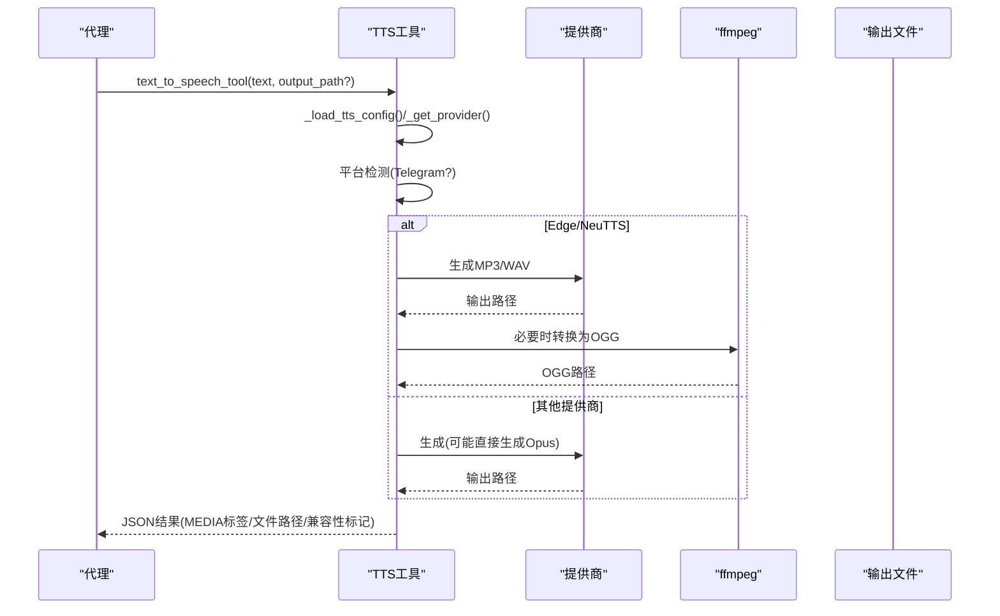
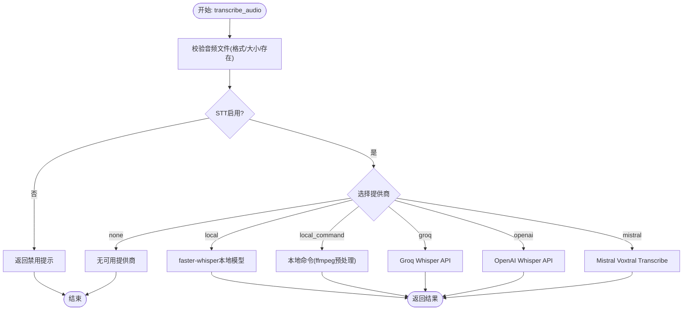
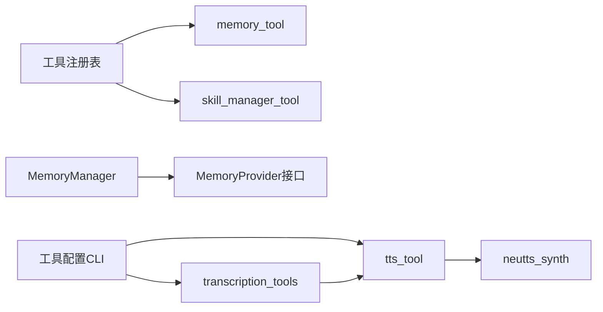

# 专用工具

<cite>
**本文引用的文件**
- [tools/memory_tool.py](file://tools/memory_tool.py)
- [tools/skill_manager_tool.py](file://tools/skill_manager_tool.py)
- [tools/tts_tool.py](file://tools/tts_tool.py)
- [tools/transcription_tools.py](file://tools/transcription_tools.py)
- [agent/memory_manager.py](file://agent/memory_manager.py)
- [agent/memory_provider.py](file://agent/memory_provider.py)
- [tools/skills_tool.py](file://tools/skills_tool.py)
- [tools/neutts_synth.py](file://tools/neutts_synth.py)
- [hermes_cli/tools_config.py](file://hermes_cli/tools_config.py)
</cite>

## 目录
1. [简介](#简介)
2. [项目结构](#项目结构)
3. [核心组件](#核心组件)
4. [架构总览](#架构总览)
5. [详细组件分析](#详细组件分析)
6. [依赖关系分析](#依赖关系分析)
7. [性能考虑](#性能考虑)
8. [故障排除指南](#故障排除指南)
9. [结论](#结论)
10. [附录](#附录)

## 简介
本文件面向Hermes Agent的专用工具集合，聚焦以下能力：
- 记忆工具：持久化、分段、安全扫描与系统提示注入
- 技能管理工具：技能创建、编辑、补丁、文件写入与删除
- 文本转语音（TTS）：多提供商支持、格式适配与平台兼容
- 语音转文字（STT）：本地/云端多后端自动选择与输入校验

文档将从架构、数据流、处理逻辑、集成方式、配置项、性能优化、扩展方法、协作与状态同步等方面进行系统化说明，并提供使用示例、最佳实践与故障排除建议。

## 项目结构
专用工具主要分布在tools目录下，同时与agent层的记忆管理器、内存提供者接口以及CLI工具配置模块协同工作：
- tools/memory_tool.py：内置记忆存储与工具注册
- tools/skill_manager_tool.py：技能生命周期管理与安全扫描
- tools/tts_tool.py：多提供商TTS合成与输出格式转换
- tools/transcription_tools.py：多提供商语音转文字
- agent/memory_manager.py：统一编排多个内存提供者
- agent/memory_provider.py：内存提供者抽象接口
- tools/skills_tool.py：技能列表与查看工具
- tools/neutts_synth.py：NeuTTS子进程合成辅助
- hermes_cli/tools_config.py：工具集与提供商配置入口

图表来源
- [tools/memory_tool.py:1-561](file://tools/memory_tool.py#L1-L561)
- [agent/memory_manager.py:1-363](file://agent/memory_manager.py#L1-L363)
- [agent/memory_provider.py:1-232](file://agent/memory_provider.py#L1-L232)
- [tools/skill_manager_tool.py:1-762](file://tools/skill_manager_tool.py#L1-L762)
- [tools/skills_tool.py:1-800](file://tools/skills_tool.py#L1-L800)
- [tools/tts_tool.py:1-800](file://tools/tts_tool.py#L1-L800)
- [tools/transcription_tools.py:1-709](file://tools/transcription_tools.py#L1-L709)
- [tools/neutts_synth.py:1-105](file://tools/neutts_synth.py#L1-L105)
- [hermes_cli/tools_config.py:1-800](file://hermes_cli/tools_config.py#L1-L800)

章节来源
- [tools/memory_tool.py:1-561](file://tools/memory_tool.py#L1-L561)
- [agent/memory_manager.py:1-363](file://agent/memory_manager.py#L1-L363)
- [agent/memory_provider.py:1-232](file://agent/memory_provider.py#L1-L232)
- [tools/skill_manager_tool.py:1-762](file://tools/skill_manager_tool.py#L1-L762)
- [tools/skills_tool.py:1-800](file://tools/skills_tool.py#L1-L800)
- [tools/tts_tool.py:1-800](file://tools/tts_tool.py#L1-L800)
- [tools/transcription_tools.py:1-709](file://tools/transcription_tools.py#L1-L709)
- [tools/neutts_synth.py:1-105](file://tools/neutts_synth.py#L1-L105)
- [hermes_cli/tools_config.py:1-800](file://hermes_cli/tools_config.py#L1-L800)

## 核心组件
- 记忆工具（memory_tool）
  - 提供“个人笔记”和“用户画像”两类有界持久化存储
  - 支持添加、替换、删除、读取操作
  - 内置威胁扫描与内容安全检查
  - 通过冻结快照注入系统提示，保持前缀缓存稳定
- 技能管理工具（skill_manager_tool）
  - 支持创建、编辑、补丁、删除技能
  - 支持在技能内写入/删除参考文件
  - 引入安全扫描与回滚机制
  - 更新后清理技能系统提示缓存
- 文本转语音（tts_tool）
  - 多提供商：Edge TTS、ElevenLabs、OpenAI TTS、MiniMax TTS、Mistral Voxtral、NeuTTS
  - 自动格式选择与平台适配（Telegram需Opus）
  - 依赖懒加载与可用性检测
- 语音转文字（transcription_tools）
  - 多提供商：本地faster-whisper、Groq Whisper、OpenAI Whisper、Mistral Voxtral
  - 输入格式校验与大小限制
  - 自动降级与错误处理

章节来源
- [tools/memory_tool.py:439-561](file://tools/memory_tool.py#L439-L561)
- [tools/skill_manager_tool.py:588-762](file://tools/skill_manager_tool.py#L588-L762)
- [tools/tts_tool.py:515-800](file://tools/tts_tool.py#L515-L800)
- [tools/transcription_tools.py:593-709](file://tools/transcription_tools.py#L593-L709)

## 架构总览
专用工具在系统中的位置与交互如下：

图表来源
- [agent/memory_manager.py:146-363](file://agent/memory_manager.py#L146-L363)
- [agent/memory_provider.py:42-232](file://agent/memory_provider.py#L42-L232)
- [tools/memory_tool.py:439-561](file://tools/memory_tool.py#L439-L561)
- [tools/skill_manager_tool.py:588-762](file://tools/skill_manager_tool.py#L588-L762)
- [tools/tts_tool.py:515-800](file://tools/tts_tool.py#L515-L800)
- [tools/transcription_tools.py:593-709](file://tools/transcription_tools.py#L593-L709)

## 详细组件分析

### 记忆工具（MemoryStore 与 memory_tool）
- 设计要点
  - 双存储：MEMORY.md（个人笔记）、USER.md（用户画像）
  - 有界字符限制，去重与原子写入
  - 冻结快照注入系统提示，避免每次会话重复加载
  - 文件锁与原子重命名，保证并发安全
  - 危险模式扫描（提示注入、外泄、持久化后门等）
- 关键流程
  - 加载：从磁盘读取并生成冻结快照
  - 写入：加锁重载、预算检查、写入磁盘、返回成功信息
  - 替换/删除：基于子串匹配，唯一性校验，预算检查
  - 输出：渲染块头（包含用量百分比与字符数）

图表来源
- [tools/memory_tool.py:100-561](file://tools/memory_tool.py#L100-L561)

章节来源
- [tools/memory_tool.py:100-561](file://tools/memory_tool.py#L100-L561)
- [agent/memory_manager.py:72-363](file://agent/memory_manager.py#L72-L363)
- [agent/memory_provider.py:42-232](file://agent/memory_provider.py#L42-L232)

### 技能管理工具（skill_manage）
- 设计要点
  - 支持创建、编辑、补丁、删除、写文件、删文件
  - 前言校验（YAML frontmatter）、大小限制、路径安全检查
  - 安全扫描与回滚（失败则恢复原内容）
  - 更新后清理技能系统提示缓存，确保模型感知最新技能
- 关键流程
  - 创建：校验名称/分类/前言/大小 → 原子写入 → 安全扫描 → 成功/回滚
  - 补丁：模糊匹配定位目标 → 验证结构/大小 → 原子写入 → 安全扫描
  - 写文件：路径合法性与大小限制 → 原子写入 → 安全扫描
  - 删除：删除目录并清理空分类

图表来源
- [tools/skill_manager_tool.py:292-762](file://tools/skill_manager_tool.py#L292-L762)

章节来源
- [tools/skill_manager_tool.py:292-762](file://tools/skill_manager_tool.py#L292-L762)
- [tools/skills_tool.py:711-800](file://tools/skills_tool.py#L711-L800)

### 文本转语音（TTS）
- 设计要点
  - 多提供商：Edge TTS（默认免费）、ElevenLabs、OpenAI TTS、MiniMax TTS、Mistral Voxtral、NeuTTS（本地）
  - 自动格式选择：Telegram语音气泡需要Opus；其他平台MP3
  - 懒加载依赖，可用性检测，失败时回退策略
  - 对Edge TTS/MiniMax输出进行ffmpeg转换以适配Telegram
- 关键流程
  - 配置加载：读取~/.hermes/config.yaml中tts节
  - 选择提供商：按可用性与平台需求决定
  - 合成：根据提供商调用对应生成函数
  - 转换：必要时将MP3/WAV转换为Telegram兼容的OGG Opus
  - 返回：MEDIA标签用于平台投递，或保存到默认目录

图表来源
- [tools/tts_tool.py:515-800](file://tools/tts_tool.py#L515-L800)

章节来源
- [tools/tts_tool.py:515-800](file://tools/tts_tool.py#L515-L800)
- [tools/neutts_synth.py:51-105](file://tools/neutts_synth.py#L51-L105)

### 语音转文字（STT）
- 设计要点
  - 多提供商：本地faster-whisper、Groq Whisper、OpenAI Whisper、Mistral Voxtral
  - 输入校验：格式支持、大小限制、存在性检查
  - 自动降级：优先本地，其次Groq，再OpenAI，最后Mistral
  - 错误处理：连接/超时/权限/模型不匹配等
- 关键流程
  - 配置解析：读取stt节，确定提供商与模型
  - 选择后端：按可用性与配置决定
  - 转录：调用对应提供商API/本地模型
  - 结果：统一返回文本与提供商标识

图表来源
- [tools/transcription_tools.py:593-709](file://tools/transcription_tools.py#L593-L709)

章节来源
- [tools/transcription_tools.py:593-709](file://tools/transcription_tools.py#L593-L709)

## 依赖关系分析
- 工具注册与发现
  - memory_tool与skill_manager_tool通过工具注册表注册，暴露给模型的函数式调用Schema
- 记忆提供者编排
  - MemoryManager统一编排内置与外部内存提供者，路由工具调用、预取、同步与生命周期钩子
- 配置与环境
  - hermes_cli/tools_config.py集中管理工具集与提供商配置，包括TTS/STT提供商选择、密钥与后端参数
- 子进程与外部依赖
  - TTS工具对NeuTTS采用子进程合成，避免主进程长期占用大模型资源
  - STT工具对本地命令模式依赖ffmpeg进行格式转换

图表来源
- [tools/memory_tool.py:542-561](file://tools/memory_tool.py#L542-L561)
- [tools/skill_manager_tool.py:744-762](file://tools/skill_manager_tool.py#L744-L762)
- [agent/memory_manager.py:72-363](file://agent/memory_manager.py#L72-L363)
- [agent/memory_provider.py:42-232](file://agent/memory_provider.py#L42-L232)
- [hermes_cli/tools_config.py:117-332](file://hermes_cli/tools_config.py#L117-L332)
- [tools/tts_tool.py:515-800](file://tools/tts_tool.py#L515-L800)
- [tools/transcription_tools.py:593-709](file://tools/transcription_tools.py#L593-L709)
- [tools/neutts_synth.py:51-105](file://tools/neutts_synth.py#L51-L105)

章节来源
- [tools/memory_tool.py:542-561](file://tools/memory_tool.py#L542-L561)
- [tools/skill_manager_tool.py:744-762](file://tools/skill_manager_tool.py#L744-L762)
- [agent/memory_manager.py:72-363](file://agent/memory_manager.py#L72-L363)
- [agent/memory_provider.py:42-232](file://agent/memory_provider.py#L42-L232)
- [hermes_cli/tools_config.py:117-332](file://hermes_cli/tools_config.py#L117-L332)
- [tools/tts_tool.py:515-800](file://tools/tts_tool.py#L515-L800)
- [tools/transcription_tools.py:593-709](file://tools/transcription_tools.py#L593-L709)
- [tools/neutts_synth.py:51-105](file://tools/neutts_synth.py#L51-L105)

## 性能考虑
- 记忆工具
  - 字符预算控制与去重，减少系统提示长度
  - 原子写入与文件锁，避免并发冲突与部分写入
  - 冻结快照注入系统提示，提升前缀缓存命中率
- 技能管理
  - 前言与大小限制，降低模型上下文开销
  - 安全扫描与回滚，避免无效更新导致的上下文污染
- TTS/STT
  - 懒加载与可用性检测，避免在无依赖环境中阻塞
  - ffmpeg转换仅在必要时执行，减少IO与CPU消耗
  - 本地faster-whisper优先，降低网络延迟与成本
- 缓存与提示
  - 技能系统提示缓存在技能变更后主动清理，确保模型使用最新技能

章节来源
- [tools/memory_tool.py:119-196](file://tools/memory_tool.py#L119-L196)
- [tools/skill_manager_tool.py:328-380](file://tools/skill_manager_tool.py#L328-L380)
- [tools/tts_tool.py:706-743](file://tools/tts_tool.py#L706-L743)
- [tools/transcription_tools.py:260-274](file://tools/transcription_tools.py#L260-L274)

## 故障排除指南
- 记忆工具
  - “内容包含不可见字符/威胁模式”：检查输入是否包含隐藏字符或潜在注入/外泄模式
  - “超出字符预算”：缩短新条目或删除旧条目后再试
  - “替换/删除匹配不唯一”：提供更精确的old_text以唯一定位
- 技能管理
  - “安全扫描阻止”：根据报告修正潜在风险内容或调整文件内容
  - “文件路径非法/越界”：确保路径位于允许子目录且不包含“..”
  - “找不到技能/文件”：确认技能名与文件路径正确，或先创建技能
- TTS
  - “无可用提供商”：安装所需依赖或切换到免费提供商（如Edge TTS）
  - “ffmpeg缺失/转换失败”：安装ffmpeg或将平台切换为非Telegram
  - “API密钥未设置”：按提供商要求配置相应环境变量
- STT
  - “文件过大/格式不支持”：检查文件大小与扩展名，必要时用ffmpeg转换
  - “提供商不可用”：确认密钥与网络连通性，或切换到本地faster-whisper

章节来源
- [tools/memory_tool.py:85-98](file://tools/memory_tool.py#L85-L98)
- [tools/memory_tool.py:243-333](file://tools/memory_tool.py#L243-L333)
- [tools/skill_manager_tool.py:526-581](file://tools/skill_manager_tool.py#L526-L581)
- [tools/tts_tool.py:613-650](file://tools/tts_tool.py#L613-L650)
- [tools/transcription_tools.py:281-306](file://tools/transcription_tools.py#L281-L306)

## 结论
专用工具围绕“可复用的程序性知识（技能）”“跨会话的持久记忆”“高质量语音交互（TTS/STT）”三大能力构建，既保证了安全性与稳定性，又提供了灵活的扩展与配置空间。通过MemoryManager统一编排与工具注册表的标准化Schema，这些工具在不同平台与后端间实现了平滑集成与高效协作。

## 附录
- 使用示例（路径指引）
  - 记忆工具：参见[tools/memory_tool.py:439-477](file://tools/memory_tool.py#L439-L477)
  - 技能管理：参见[tools/skill_manager_tool.py:588-646](file://tools/skill_manager_tool.py#L588-L646)
  - TTS：参见[tools/tts_tool.py:515-700](file://tools/tts_tool.py#L515-L700)
  - STT：参见[tools/transcription_tools.py:593-665](file://tools/transcription_tools.py#L593-L665)
- 最佳实践
  - 记忆：优先保存用户偏好、环境事实与可复用流程；避免临时任务日志进入持久记忆
  - 技能：复杂多次成功的任务才创建技能；及时修复过时步骤；使用补丁而非整篇重写
  - TTS/STT：优先本地faster-whisper；Telegram平台尽量使用原生Opus输出；合理配置API密钥与后端
- 集成与扩展
  - 新增内存提供者：实现MemoryProvider接口并通过MemoryManager注册
  - 新增TTS提供商：在tts_tool中新增生成函数并在可用性检测中加入判断
  - 新增STT提供商：在transcription_tools中新增转录函数并在提供商选择逻辑中加入