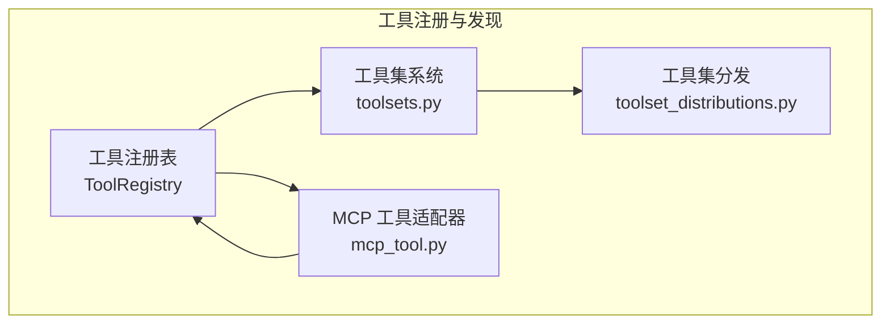
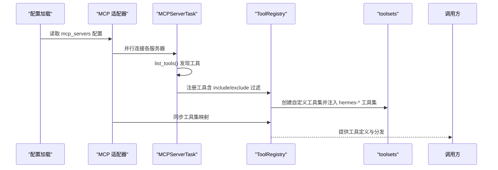
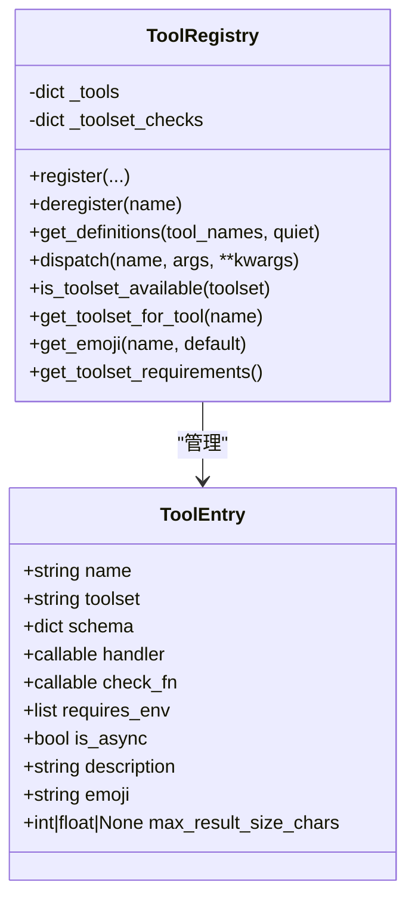
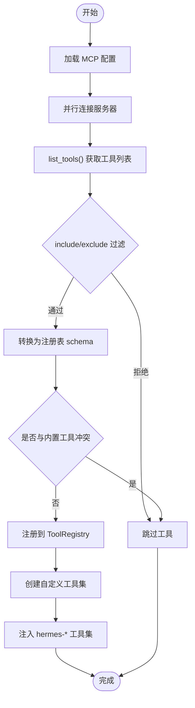
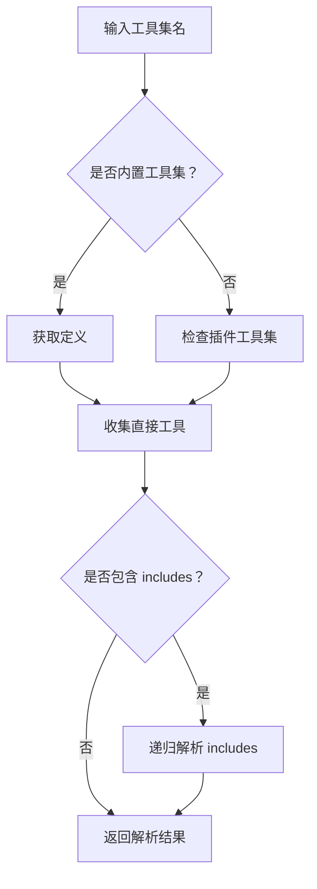
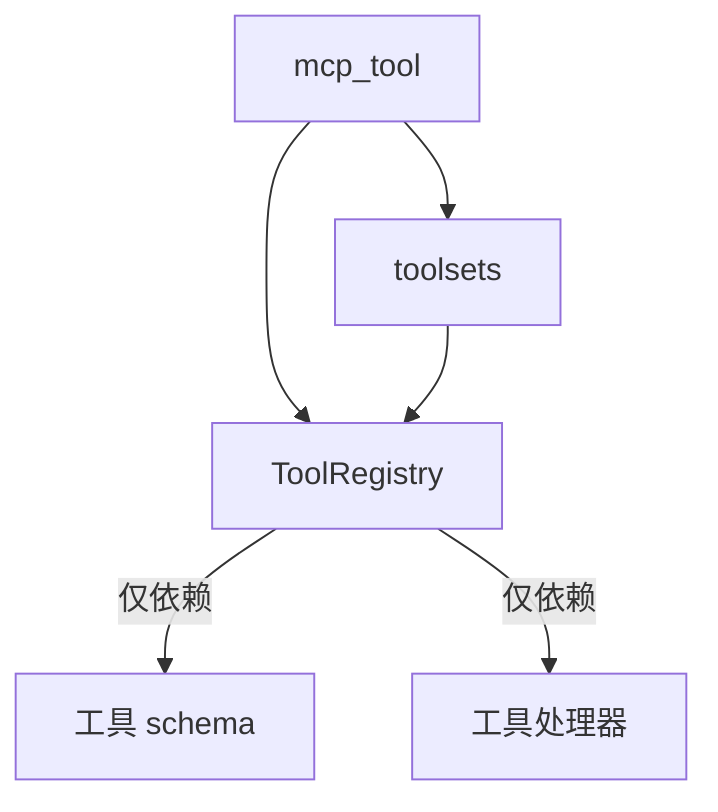

# 工具注册与发现机制

<cite>
**本文档引用的文件**
- [tools/registry.py](file://tools/registry.py)
- [tools/mcp_tool.py](file://tools/mcp_tool.py)
- [toolsets.py](file://toolsets.py)
- [toolset_distributions.py](file://toolset_distributions.py)
- [tests/tools/test_registry.py](file://tests/tools/test_registry.py)
- [tests/tools/test_mcp_tool.py](file://tests/tools/test_mcp_tool.py)
- [tests/tools/test_mcp_dynamic_discovery.py](file://tests/tools/test_mcp_dynamic_discovery.py)
- [tests/test_toolsets.py](file://tests/test_toolsets.py)
</cite>

## 目录
1. [简介](#简介)
2. [项目结构](#项目结构)
3. [核心组件](#核心组件)
4. [架构总览](#架构总览)
5. [详细组件分析](#详细组件分析)
6. [依赖分析](#依赖分析)
7. [性能考虑](#性能考虑)
8. [故障排除指南](#故障排除指南)
9. [结论](#结论)
10. [附录](#附录)

## 简介
本文件系统化阐述 Hermes Agent 的工具注册与发现机制，重点覆盖以下方面：
- 工具注册表（ToolRegistry）的工作原理与数据结构
- 工具元数据管理与动态加载流程
- 工具定义格式、参数校验与生命周期管理
- 工具发现算法、依赖解析与版本兼容性检查
- 线程安全、缓存策略与性能优化
- 工具分类体系与搜索机制实现
- 最佳实践与常见陷阱

## 项目结构
围绕工具注册与发现的核心模块包括：
- 工具注册表：集中管理所有工具的元数据、可用性检查与分发
- MCP 工具适配器：连接外部 MCP 服务器并动态注册其工具
- 工具集（toolsets）：对工具进行分组、组合与别名管理
- 分发策略：基于概率的工具集采样与组合

**图表来源**
- [tools/registry.py:1-336](file://tools/registry.py#L1-L336)
- [toolsets.py:1-656](file://toolsets.py#L1-L656)
- [toolset_distributions.py:214-290](file://toolset_distributions.py#L214-L290)
- [tools/mcp_tool.py:1-800](file://tools/mcp_tool.py#L1-L800)

**章节来源**
- [tools/registry.py:1-336](file://tools/registry.py#L1-L336)
- [toolsets.py:1-656](file://toolsets.py#L1-L656)
- [toolset_distributions.py:214-290](file://toolset_distributions.py#L214-L290)
- [tools/mcp_tool.py:1-800](file://tools/mcp_tool.py#L1-L800)

## 核心组件
- 工具注册表（ToolRegistry）
  - 单例模式，维护工具名称到 ToolEntry 的映射
  - 提供注册、反注册、定义导出、分发执行、可用性检查等能力
- 工具条目（ToolEntry）
  - 封装工具 schema、处理器、工具集归属、环境要求、异步标记、描述、表情符号、最大结果大小等元数据
- 工具集系统（toolsets）
  - 定义工具集的静态集合与组合规则，支持递归解析与插件扩展
- MCP 工具适配器（mcp_tool）
  - 连接外部 MCP 服务器，动态发现工具，转换为注册表可识别的 schema 并注册
  - 支持 include/exclude 过滤、资源/提示工具选择、动态刷新与线程安全

**章节来源**
- [tools/registry.py:24-94](file://tools/registry.py#L24-L94)
- [tools/registry.py:48-287](file://tools/registry.py#L48-L287)
- [toolsets.py:66-391](file://toolsets.py#L66-L391)
- [tools/mcp_tool.py:1734-1846](file://tools/mcp_tool.py#L1734-L1846)

## 架构总览
工具注册与发现的整体流程如下：

**图表来源**
- [tools/mcp_tool.py:1878-2004](file://tools/mcp_tool.py#L1878-L2004)
- [tools/mcp_tool.py:1734-1846](file://tools/mcp_tool.py#L1734-L1846)
- [tools/registry.py:59-111](file://tools/registry.py#L59-L111)
- [toolsets.py:409-467](file://toolsets.py#L409-L467)

## 详细组件分析

### 工具注册表（ToolRegistry）
- 数据结构
  - 工具字典：name -> ToolEntry
  - 工具集检查函数字典：toolset -> check_fn
- 关键方法
  - register：注册工具，处理同名冲突（不同工具集时警告）
  - deregister：移除工具，必要时清理工具集检查函数
  - get_definitions：按工具名集合返回 OpenAI 兼容的工具定义，自动应用 check_fn 过滤
  - dispatch：根据名称分发到具体处理器，统一异常捕获与错误格式化
  - 可用性与元数据查询：is_toolset_available、get_toolset_for_tool、get_emoji、get_toolset_requirements 等

**图表来源**
- [tools/registry.py:24-94](file://tools/registry.py#L24-L94)
- [tools/registry.py:48-287](file://tools/registry.py#L48-L287)

**章节来源**
- [tools/registry.py:24-94](file://tools/registry.py#L24-L94)
- [tools/registry.py:48-287](file://tools/registry.py#L48-L287)
- [tests/tools/test_registry.py:20-110](file://tests/tools/test_registry.py#L20-L110)

### 工具定义格式与参数校验
- 定义格式
  - OpenAI function 格式：type="function"，function.name、function.description、function.parameters
  - ToolRegistry 在导出时确保 schema 包含 name 字段（优先使用 entry.name）
- 参数校验
  - 通过 check_fn 控制工具可用性；get_definitions 会复用已计算结果以避免重复调用
  - 异常处理：check_fn 抛出异常时视为不可用，dispatch 捕获处理器异常并返回统一错误格式

**章节来源**
- [tools/registry.py:116-143](file://tools/registry.py#L116-L143)
- [tools/registry.py:149-166](file://tools/registry.py#L149-L166)
- [tests/tools/test_registry.py:184-260](file://tests/tools/test_registry.py#L184-L260)

### 工具生命周期管理
- 注册阶段：mcp_tool 在连接成功后调用 _register_server_tools，生成带前缀的工具名，注册到 ToolRegistry，并创建自定义工具集
- 运行阶段：dispatch 根据名称查找处理器，同步工具自动桥接为异步执行
- 反注册阶段：deregister 清理工具，若该工具集不再有其他工具则移除工具集检查函数

**章节来源**
- [tools/mcp_tool.py:1734-1846](file://tools/mcp_tool.py#L1734-L1846)
- [tools/registry.py:95-111](file://tools/registry.py#L95-L111)
- [tests/tools/test_mcp_dynamic_discovery.py:157-170](file://tests/tools/test_mcp_dynamic_discovery.py#L157-L170)

### 工具发现算法与过滤
- MCP 工具发现
  - _discover_and_register_server：连接服务器、列出工具、转换 schema、注册工具
  - _register_server_tools：include/exclude 过滤、资源/提示工具选择、冲突保护（内置工具优先）
- 过滤规则
  - include 白名单优先于 exclude 黑名单
  - 资源/提示工具可通过配置显式禁用
- 动态刷新
  - 基于通知（tools/list_changed）触发刷新，原子性更新工具集并同步 hermes-* 工具集

**图表来源**
- [tools/mcp_tool.py:1849-1955](file://tools/mcp_tool.py#L1849-L1955)
- [tools/mcp_tool.py:1734-1846](file://tools/mcp_tool.py#L1734-L1846)
- [tools/mcp_tool.py:1656-1718](file://tools/mcp_tool.py#L1656-L1718)

**章节来源**
- [tools/mcp_tool.py:1656-1718](file://tools/mcp_tool.py#L1656-L1718)
- [tools/mcp_tool.py:1734-1846](file://tools/mcp_tool.py#L1734-L1846)
- [tests/tools/test_mcp_tool.py:2561-2635](file://tests/tools/test_mcp_tool.py#L2561-L2635)

### 工具集系统与搜索机制
- 工具集定义
  - 静态工具集（如 web、terminal、file、browser 等）与平台工具集（hermes-*）
  - 支持 includes 组合，递归解析，循环检测
- 解析与组合
  - resolve_toolset：递归展开 includes，去重合并
  - resolve_multiple_toolsets：多工具集合并
  - get_toolset_info：返回工具集详情（直接工具、包含工具集、解析后工具总数）
- 插件扩展
  - 从 ToolRegistry 中识别插件注册的工具集（不在静态 TOOLSETS 中）

**图表来源**
- [toolsets.py:409-467](file://toolsets.py#L409-L467)
- [toolsets.py:470-486](file://toolsets.py#L470-L486)
- [toolsets.py:506-542](file://toolsets.py#L506-L542)

**章节来源**
- [toolsets.py:66-391](file://toolsets.py#L66-L391)
- [toolsets.py:409-467](file://toolsets.py#L409-L467)
- [toolsets.py:470-486](file://toolsets.py#L470-L486)
- [tests/test_toolsets.py:18-45](file://tests/test_toolsets.py#L18-L45)

### 工具集分发与采样
- 分发策略
  - 基于概率的工具集采样，确保低概率工具仍有机会被选中
  - 若未选中任何工具，则强制选择最高概率工具集
- 使用场景
  - 用于动态构建工具集组合，满足不同任务场景的需求

**章节来源**
- [toolset_distributions.py:214-290](file://toolset_distributions.py#L214-L290)

### 线程安全与并发控制
- MCP 事件循环
  - 独立后台事件循环线程，所有 MCP 操作通过 run_coroutine_threadsafe 调度
  - _lock 保护全局状态（_servers、_mcp_loop、_mcp_thread、_stdio_pids）
- 并发连接
  - register_mcp_servers 并行连接多个服务器，失败独立记录
- 刷新与注销
  - _refresh_tools 使用 asyncio.Lock 防止并发刷新
  - deregister 在工具集最后一条工具移除时清理工具集检查函数

**章节来源**
- [tools/mcp_tool.py:1064-1150](file://tools/mcp_tool.py#L1064-L1150)
- [tools/mcp_tool.py:1141-1150](file://tools/mcp_tool.py#L1141-L1150)
- [tools/mcp_tool.py:787-822](file://tools/mcp_tool.py#L787-L822)
- [tests/tools/test_mcp_dynamic_discovery.py:157-170](file://tests/tools/test_mcp_dynamic_discovery.py#L157-L170)

## 依赖分析
- 模块耦合
  - ToolRegistry 仅依赖工具 schema 与处理器，不依赖具体工具模块，避免循环导入
  - mcp_tool 通过工具集系统创建自定义工具集，但不直接修改静态定义
- 外部依赖
  - MCP SDK 可选依赖，未安装时工具发现退化为空操作
  - 工具集系统支持插件扩展，运行时从 ToolRegistry 识别新增工具集

**图表来源**
- [tools/registry.py:1-15](file://tools/registry.py#L1-L15)
- [tools/mcp_tool.py:1-120](file://tools/mcp_tool.py#L1-L120)
- [toolsets.py:1-26](file://toolsets.py#L1-L26)

**章节来源**
- [tools/registry.py:1-15](file://tools/registry.py#L1-L15)
- [tools/mcp_tool.py:1-120](file://tools/mcp_tool.py#L1-L120)
- [toolsets.py:1-26](file://toolsets.py#L1-L26)

## 性能考虑
- 缓存与复用
  - get_definitions 对 check_fn 结果进行缓存，避免重复调用
  - _toolset_checks 仅在首次注册时建立，减少查询开销
- 并发与异步
  - MCP 服务器连接与工具发现采用 asyncio.gather 并行执行
  - 工具调用通过 run_coroutine_threadsafe 调度到事件循环，避免阻塞
- 过滤与预处理
  - include/exclude 过滤在注册前完成，减少后续查询成本
  - 资源/提示工具按需启用，降低不必要的注册

**章节来源**
- [tools/registry.py:116-143](file://tools/registry.py#L116-L143)
- [tools/mcp_tool.py:1918-1940](file://tools/mcp_tool.py#L1918-L1940)
- [tools/mcp_tool.py:1656-1718](file://tools/mcp_tool.py#L1656-L1718)

## 故障排除指南
- MCP 工具不可用
  - 检查服务器连接状态与工具列表变更通知
  - 确认 include/exclude 配置是否正确
  - 查看日志中的“工具被过滤”或“工具冲突”提示
- 工具集检查函数异常
  - ToolRegistry 的 is_toolset_available 会捕获异常并返回 False
  - get_definitions 会跳过抛出异常的 check_fn 对应工具
- 线程安全问题
  - 确保通过 _run_on_mcp_loop 调度 MCP 操作
  - 避免在 MCP 事件循环外直接访问共享状态
- 冲突与覆盖
  - MCP 工具名与内置工具冲突会被跳过，避免覆盖内置功能

**章节来源**
- [tools/mcp_tool.py:1656-1718](file://tools/mcp_tool.py#L1656-L1718)
- [tools/registry.py:109-111](file://tools/registry.py#L109-L111)
- [tests/tools/test_registry.py:184-260](file://tests/tools/test_registry.py#L184-L260)
- [tests/tools/test_mcp_tool.py:2759-2794](file://tests/tools/test_mcp_tool.py#L2759-L2794)

## 结论
Hermes Agent 的工具注册与发现机制通过 ToolRegistry 实现统一的工具元数据管理，结合 MCP 适配器实现外部工具的动态发现与注册，并通过工具集系统提供灵活的组合与别名能力。系统在保证线程安全与性能的同时，提供了完善的过滤、冲突保护与错误处理机制，适合在复杂多变的工具生态中稳定运行。

## 附录
- 最佳实践
  - 明确工具集边界，避免与内置工具集命名冲突
  - 使用 include/exclude 精准控制工具暴露范围
  - 为工具集提供 check_fn，确保在不可用时优雅降级
  - 合理设置工具超时与重连策略，提升稳定性
- 常见陷阱
  - 忽视工具名冲突导致内置工具被覆盖
  - 过度依赖 MCP 工具而忽略本地工具集
  - 未正确处理 MCP 服务器断连与重连逻辑
  - 在工具处理器中抛出未捕获异常影响整体稳定性