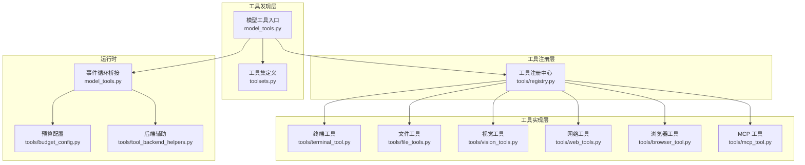
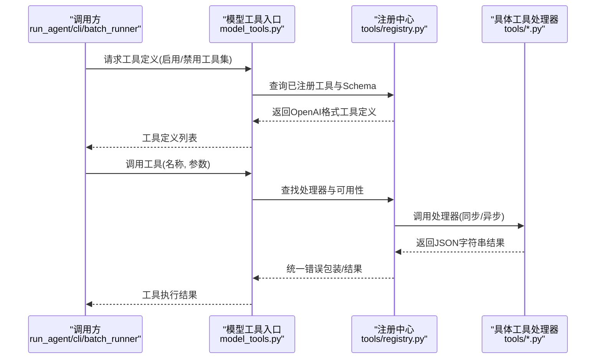
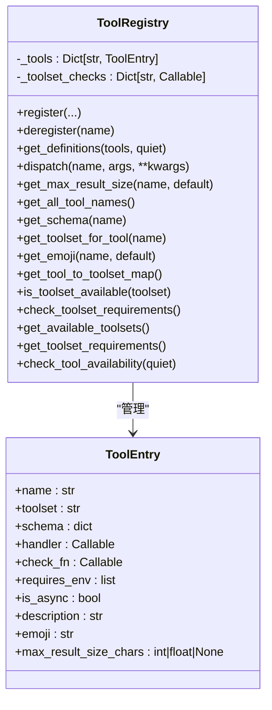
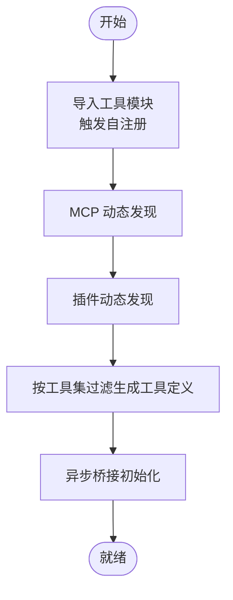
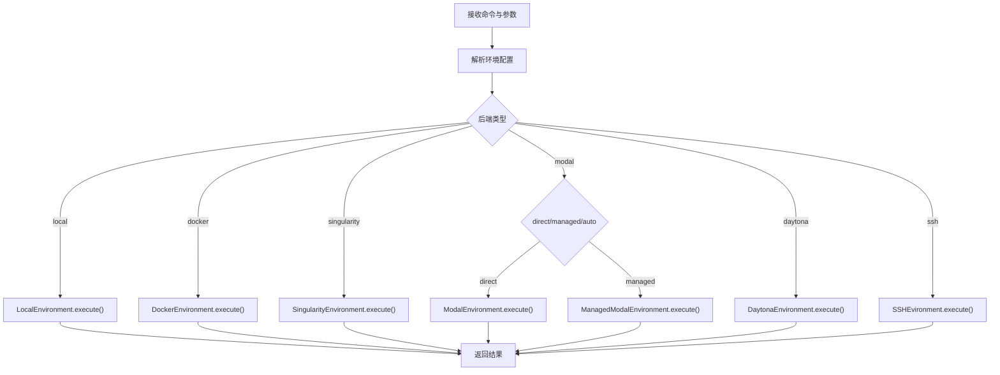
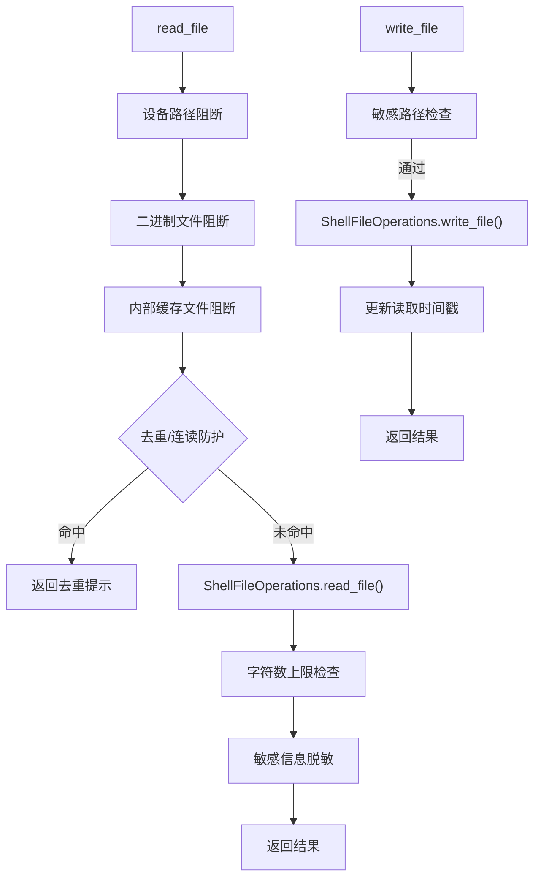
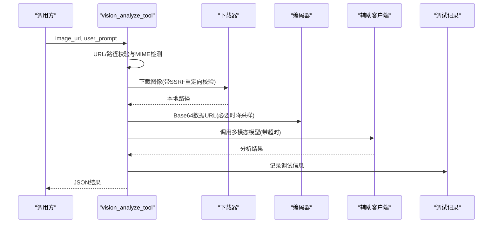
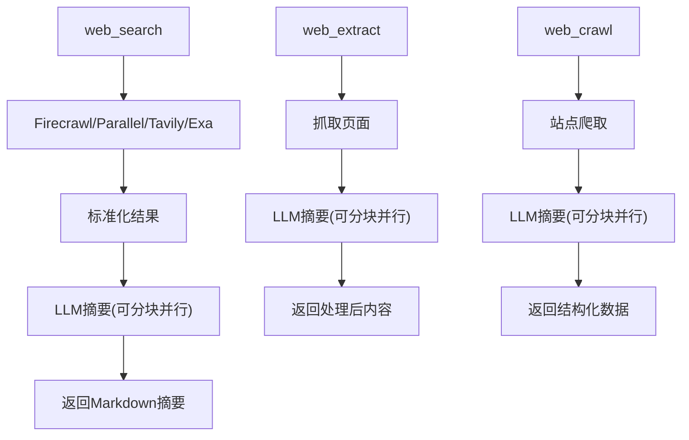
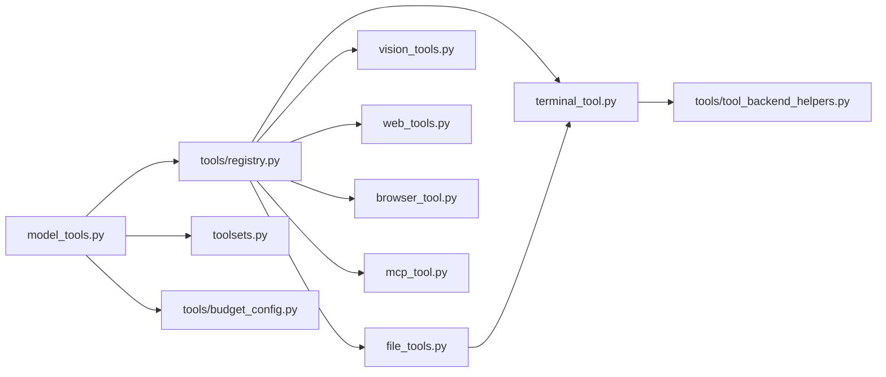

# 工具系统

<cite>
**本文档引用的文件**
- [tools/__init__.py](file://tools/__init__.py)
- [tools/registry.py](file://tools/registry.py)
- [model_tools.py](file://model_tools.py)
- [tools/tool_backend_helpers.py](file://tools/tool_backend_helpers.py)
- [tools/budget_config.py](file://tools/budget_config.py)
- [toolsets.py](file://toolsets.py)
- [tools/terminal_tool.py](file://tools/terminal_tool.py)
- [tools/file_tools.py](file://tools/file_tools.py)
- [tools/vision_tools.py](file://tools/vision_tools.py)
- [tools/web_tools.py](file://tools/web_tools.py)
- [tools/mcp_tool.py](file://tools/mcp_tool.py)
- [tools/browser_tool.py](file://tools/browser_tool.py)
</cite>

## 目录
1. [简介](#简介)
2. [项目结构](#项目结构)
3. [核心组件](#核心组件)
4. [架构总览](#架构总览)
5. [详细组件分析](#详细组件分析)
6. [依赖分析](#依赖分析)
7. [性能考虑](#性能考虑)
8. [故障排除指南](#故障排除指南)
9. [结论](#结论)
10. [附录](#附录)

## 简介
本文件系统性阐述 Hermes Agent 的工具系统：从工具注册机制、工具集分类到工具生命周期管理；解释工具定义格式、参数校验与结果处理；覆盖终端工具、网络工具、文件工具、视觉工具、浏览器工具以及 MCP 工具等实现细节；详述并发执行、安全限制与资源管理；提供工具开发指南（自定义工具创建、测试与集成）、与代理系统的交互模式与最佳实践，并给出性能优化与故障排除建议。

## 项目结构
工具系统围绕“注册中心 + 工具发现 + 调度分发”的三层架构组织：
- 注册中心：集中登记工具元数据、Schema、处理器与可用性检查函数
- 工具发现：按需导入各工具模块，触发其自注册
- 调度分发：根据工具名路由至对应处理器，支持同步/异步桥接

图表来源
- [model_tools.py:132-185](file://model_tools.py#L132-L185)
- [tools/registry.py:48-290](file://tools/registry.py#L48-L290)
- [toolsets.py:66-200](file://toolsets.py#L66-L200)

章节来源
- [model_tools.py:132-185](file://model_tools.py#L132-L185)
- [tools/registry.py:1-336](file://tools/registry.py#L1-L336)
- [toolsets.py:1-200](file://toolsets.py#L1-L200)

## 核心组件
- 工具注册中心（ToolRegistry）：统一收集工具 Schema、处理器、可用性检查、工具集映射与工具级最大结果长度等元信息，提供查询、分发与可用性检查能力
- 模型工具入口（model_tools）：负责工具发现、构建工具定义、异步桥接、持久化预算控制
- 工具集（toolsets）：以可组合的方式定义工具集合，支持启用/禁用工具集
- 后端辅助（tool_backend_helpers）：统一 Modal、浏览器云提供商等后端选择逻辑
- 预算配置（budget_config）：对工具结果大小阈值、单轮预算与预览大小进行集中配置

章节来源
- [tools/registry.py:48-290](file://tools/registry.py#L48-L290)
- [model_tools.py:132-300](file://model_tools.py#L132-L300)
- [toolsets.py:66-200](file://toolsets.py#L66-L200)
- [tools/tool_backend_helpers.py:1-90](file://tools/tool_backend_helpers.py#L1-L90)
- [tools/budget_config.py:1-53](file://tools/budget_config.py#L1-L53)

## 架构总览
工具系统通过“注册中心 + 发现 + 分发”实现解耦与扩展：
- 注册阶段：每个工具模块在导入时调用注册中心完成自注册
- 定义阶段：模型工具入口按工具集过滤生成 OpenAI 兼容的工具定义
- 执行阶段：调度器根据工具名查找处理器，自动桥接异步调用并捕获异常

图表来源
- [model_tools.py:234-300](file://model_tools.py#L234-L300)
- [tools/registry.py:116-167](file://tools/registry.py#L116-L167)

## 详细组件分析

### 工具注册中心（ToolRegistry）
- 职责
  - 接收工具模块自注册，记录工具名、Schema、处理器、可用性检查函数、工具集归属、是否异步、描述、Emoji、最大结果长度等
  - 提供工具定义查询（按可用性过滤）、处理器分发（含异步桥接）、工具集可用性检查、工具集元信息聚合
- 关键能力
  - get_definitions：按工具集过滤返回 OpenAI 兼容 Schema 列表，内部会调用 check_fn 过滤不可用工具
  - dispatch：按名称分发到处理器，自动桥接异步调用，统一异常捕获与错误格式化
  - 工具集可用性：基于工具集的 check_fn 进行一次性判定，失败时记录调试日志
  - 结果大小控制：支持每工具最大结果字符数，回退到全局默认或配置项
- 设计要点
  - 使用 ToolEntry 数据类承载元信息，字段严格限定，避免误用
  - 注册时若同名不同工具集冲突，发出警告并覆盖旧条目
  - 提供工具级错误与结果序列化辅助函数，减少重复样板代码

图表来源
- [tools/registry.py:24-290](file://tools/registry.py#L24-L290)

章节来源
- [tools/registry.py:48-290](file://tools/registry.py#L48-L290)

### 模型工具入口（model_tools）
- 职责
  - 工具发现：导入各工具模块触发自注册，支持 MCP 与插件动态发现
  - 工具定义：按启用/禁用工具集过滤，生成 OpenAI 兼容 Schema 列表
  - 异步桥接：维护主线程与工作线程的长驻事件循环，避免“事件循环已关闭”问题
  - 预算控制：读取预算配置，结合注册中心阈值决定结果持久化策略
- 并发与安全
  - _run_async：根据当前线程是否已有运行中事件循环，选择线程内新建循环或复用持久循环
  - 工作线程独立循环：避免与主循环竞争与“循环关闭”导致的客户端 GC 异常
- 工具集映射
  - 提供 TOOL_TO_TOOLSET_MAP、TOOLSET_REQUIREMENTS 等常量，供上层组件使用

图表来源
- [model_tools.py:132-185](file://model_tools.py#L132-L185)
- [model_tools.py:81-126](file://model_tools.py#L81-L126)

章节来源
- [model_tools.py:132-300](file://model_tools.py#L132-L300)

### 工具集（toolsets）
- 职责
  - 定义可组合的工具集，支持直接列出工具或包含其他工具集
  - 提供解析工具集为具体工具名、获取所有工具集、校验工具集名称等能力
- 常见工具集
  - web、terminal、file、vision、image_gen、browser、cronjob、messaging、rl、skills、tts、todo、memory、session_search、clarify、code_execution、delegation、homeassistant 等

章节来源
- [toolsets.py:66-200](file://toolsets.py#L66-L200)

### 终端工具（terminal_tool）
- 能力
  - 多后端执行：local、docker、singularity、modal、daytona、ssh
  - 环境生命周期管理：按任务 ID 复用环境、空闲清理、超时控制
  - 安全与合规：危险命令检测与审批、sudo 密码缓存与提示、路径白名单校验
  - 进程管理：前台/后台执行、进程状态轮询与等待
- 关键机制
  - 环境配置解析：从环境变量读取默认镜像、CPU/内存/磁盘、持久化开关、容器卷等
  - Modal 后端选择：支持 direct/managed/auto 模式，结合凭证与网关可用性
  - 磁盘用量告警：扫描临时目录总大小超过阈值时发出警告
  - sudo 自动注入：将裸 sudo 替换为 -S -p '' 并在子进程 stdin 前缀密码

图表来源
- [tools/terminal_tool.py:690-800](file://tools/terminal_tool.py#L690-L800)

章节来源
- [tools/terminal_tool.py:1-800](file://tools/terminal_tool.py#L1-L800)

### 文件工具（file_tools）
- 能力
  - 文件读取：带行号、分页、字符数上限、敏感路径阻断、二进制文件阻断、设备路径阻断
  - 文件写入：敏感路径阻断、权限异常分类记录、写后时间戳更新
  - 文件补丁：替换模式与 V4A 多文件补丁，模糊匹配策略，语法检查
  - 搜索：内容搜索与文件名搜索，支持上下文输出与分页提示
  - 读取去重与连读防护：同一文件区域连续读取次数上限，防止循环与冗余
- 关键机制
  - 通过终端工具创建/复用环境，保证文件操作一致性
  - 读取跟踪器：记录最近读取历史、连续次数、去重缓存与外部修改检测
  - 敏感路径保护：禁止写入 /etc/、/boot/、/usr/lib/systemd/ 及 sock 文件
  - 大文件提示：当文件过大且未指定窄窗口时给出分段读取建议

图表来源
- [tools/file_tools.py:280-448](file://tools/file_tools.py#L280-L448)
- [tools/file_tools.py:571-649](file://tools/file_tools.py#L571-L649)

章节来源
- [tools/file_tools.py:1-800](file://tools/file_tools.py#L1-L800)

### 视觉工具（vision_tools）
- 能力
  - 图像下载：URL 校验、SSRF 防护、重定向二次校验、大小限制、重试机制
  - 图像编码：Base64 数据 URL，自动尺寸估算与 Pillow 可选降采样
  - API 调用：通过中央辅助客户端路由，支持多供应商（OpenRouter、Nous、Codex、Anthropic、自定义）
  - 错误处理：针对额度不足、不支持视觉、请求非法等场景给出清晰提示
- 关键机制
  - 下载超时与最大字节限制：避免大文件与慢响应
  - MIME 类型检测：支持常见格式并拒绝 SVG（除非显式允许）
  - 自动降采样：当供应商拒绝大尺寸时，尝试降采样后重试
  - 临时文件清理：分析完成后删除本地缓存文件

图表来源
- [tools/vision_tools.py:405-679](file://tools/vision_tools.py#L405-L679)

章节来源
- [tools/vision_tools.py:1-799](file://tools/vision_tools.py#L1-L799)

### 网络工具（web_tools）
- 能力
  - 多后端：Exa、Firecrawl、Parallel、Tavily，支持直连与 Nous 工具网关
  - 内容提取：网页搜索、页面提取、站点爬取，结合 LLM 生成摘要与关键摘录
  - 大内容处理：超大文本分块并行摘要，再合成统一摘要，控制输出长度
  - 安全与合规：URL 安全检查、网站访问策略、调试日志
- 关键机制
  - 后端选择：优先直连配置，否则尝试工具网关（受功能标志与令牌控制）
  - LLM 摘要：使用 Gemini 3 Flash Preview 或指定模型，控制最大输出长度
  - 分块并行：超过阈值的内容拆分为固定大小块，异步并行摘要后再合成

图表来源
- [tools/web_tools.py:1-800](file://tools/web_tools.py#L1-L800)

章节来源
- [tools/web_tools.py:1-800](file://tools/web_tools.py#L1-L800)

### 浏览器工具（browser_tool）
- 能力
  - 多后端：Browser Use（云，Nous 订阅者默认）、Browserbase（云直连）、本地 Chromium
  - 无障碍树快照：基于 ariaSnapshot 的文本表示，适合无视觉能力的代理
  - 元素交互：通过 ref 选择器（@e1）点击、输入、滚动、截图分析
  - 任务隔离：按 task_id 隔离会话，自动清理
- 关键机制
  - 后端自动探测：依据配置与凭证自动选择 Browser Use/Browserbase/本地
  - 命令超时与摘要阈值：避免长时间阻塞，对大文本进行摘要
  - 代理与安全：支持住宅代理、高级隐身模式、会话保活与超时设置

章节来源
- [tools/browser_tool.py:1-200](file://tools/browser_tool.py#L1-L200)

### MCP 工具（mcp_tool）
- 能力
  - 支持 stdio 与 HTTP/StreamableHTTP 两种传输方式
  - 自动重连与指数退避、环境变量过滤、凭据清洗
  - 采样能力：MCP 服务器可向 LLM 发起请求（文本与工具调用）
  - 线程安全：专用后台事件循环，工具调用通过线程安全方式调度
- 关键机制
  - 服务端连接参数：命令行参数、URL、头部、超时、采样配置
  - 动态工具发现：监听 tools/list_changed 通知，支持热更新
  - 凭据清洗：在错误消息中隐藏令牌、密钥等敏感信息

章节来源
- [tools/mcp_tool.py:1-200](file://tools/mcp_tool.py#L1-L200)

## 依赖分析
- 模块耦合
  - model_tools 依赖 tools/registry 与 toolsets，间接依赖各工具模块
  - 各工具模块依赖注册中心进行自注册，部分模块共享后端辅助与预算配置
- 外部依赖
  - 视觉工具依赖 httpx、可选 Pillow 用于降采样
  - 网络工具依赖 firecrawl、parallel、httpx、tavily 等第三方 SDK
  - 终端工具依赖 docker/singularity/modal/daytona/ssh 等后端 SDK（按需）

图表来源
- [model_tools.py:132-185](file://model_tools.py#L132-L185)
- [tools/registry.py:48-290](file://tools/registry.py#L48-L290)
- [tools/budget_config.py:1-53](file://tools/budget_config.py#L1-L53)
- [tools/tool_backend_helpers.py:1-90](file://tools/tool_backend_helpers.py#L1-L90)

章节来源
- [model_tools.py:132-185](file://model_tools.py#L132-L185)
- [tools/registry.py:48-290](file://tools/registry.py#L48-L290)

## 性能考虑
- 异步桥接
  - 使用持久事件循环避免“事件循环已关闭”异常，提升缓存客户端稳定性
  - 工作线程独立循环，降低主线程竞争与 GC 影响
- 结果大小控制
  - 通过预算配置与注册中心阈值限制单次工具结果大小，避免上下文爆炸
  - 对超大内容采用分块并行摘要与合成，控制最终输出长度
- 环境复用
  - 终端工具按任务 ID 复用环境，减少沙箱创建开销
  - 文件工具复用 ShellFileOperations 实例，避免重复初始化
- I/O 与网络
  - 视觉工具与网络工具设置合理超时与重试，避免长时间阻塞
  - 下载前先检查 Content-Length，超限直接拒绝，减少无效传输

## 故障排除指南
- 工具不可用
  - 检查工具集可用性：通过注册中心的 is_toolset_available 与 check_tool_availability 获取详细信息
  - 确认环境变量：如 FIRECRAWL_API_KEY、PARALLEL_API_KEY、TAVILY_API_KEY、EXA_API_KEY、FIRECRAWL_API_URL 等
- 视觉工具失败
  - 检查图像 URL 是否被网站策略拦截、是否为真实图像格式、是否超过最大尺寸
  - 若 API 报错“图像过大”，安装 Pillow 后自动降采样重试
- 文件工具报错
  - 权限错误：确认目标路径非敏感系统路径，必要时使用终端工具 + sudo
  - 连续读取循环：工具内置连读防护，适当调整 offset/limit 或改用其他工具
- 终端工具卡顿
  - 检查后端选择与 Modal/容器配置，确认 CPU/内存/磁盘配额充足
  - 若 sudo 需求，确保 SUDO_PASSWORD 设置或交互式输入
- 网络工具超时
  - 调整 auxiliary.web_extract.timeout 或切换更快的辅助模型
  - 对超大内容使用分块策略或缩小范围

章节来源
- [tools/registry.py:209-286](file://tools/registry.py#L209-L286)
- [tools/vision_tools.py:620-667](file://tools/vision_tools.py#L620-L667)
- [tools/file_tools.py:571-649](file://tools/file_tools.py#L571-L649)
- [tools/terminal_tool.py:788-792](file://tools/terminal_tool.py#L788-L792)
- [tools/web_tools.py:577-690](file://tools/web_tools.py#L577-L690)

## 结论
Hermes Agent 的工具系统以注册中心为核心，通过工具发现与调度分发实现高内聚、低耦合的扩展架构。借助统一的异步桥接、预算控制与安全机制，系统在保证稳定性的同时提供了强大的工具生态。开发者可通过自定义工具快速接入新能力，并遵循现有规范（Schema、错误格式、可用性检查）实现无缝集成。

## 附录

### 工具开发指南
- 自定义工具创建
  - 在 tools/ 目录下新增模块，定义处理器函数与 Schema
  - 在模块末尾调用注册中心的 register 完成自注册，声明工具集、描述、Emoji、是否异步、最大结果长度等
  - 如需动态可用性，提供 check_fn 并在注册时传入
- 参数验证与结果处理
  - 使用注册中心提供的 tool_error/tool_result 统一错误与结果格式
  - 对外部输入进行最小化校验（如 URL、路径、数值范围），并在异常时返回标准错误 JSON
- 测试与集成
  - 单元测试中可直接调用注册中心的 get_definitions 与 dispatch 验证工具行为
  - 将工具纳入工具集，通过 enabled_toolsets/disabled_toolsets 控制可见性
- 与代理系统的交互
  - 保持处理器幂等与可重入，避免副作用
  - 对长耗时操作支持中断信号（如 is_interrupted），及时退出
  - 合理设置超时与重试，避免阻塞主流程

章节来源
- [tools/registry.py:309-336](file://tools/registry.py#L309-L336)
- [model_tools.py:234-300](file://model_tools.py#L234-L300)