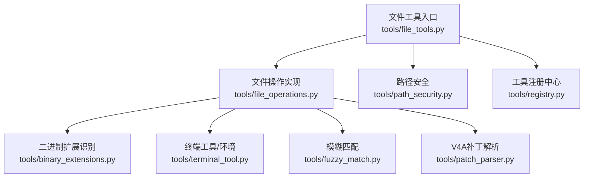
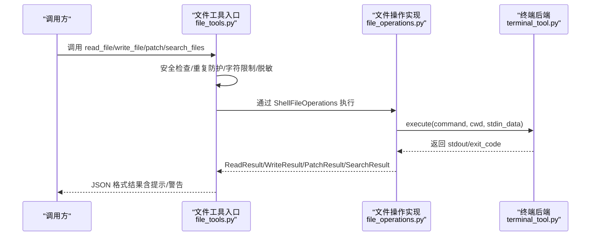
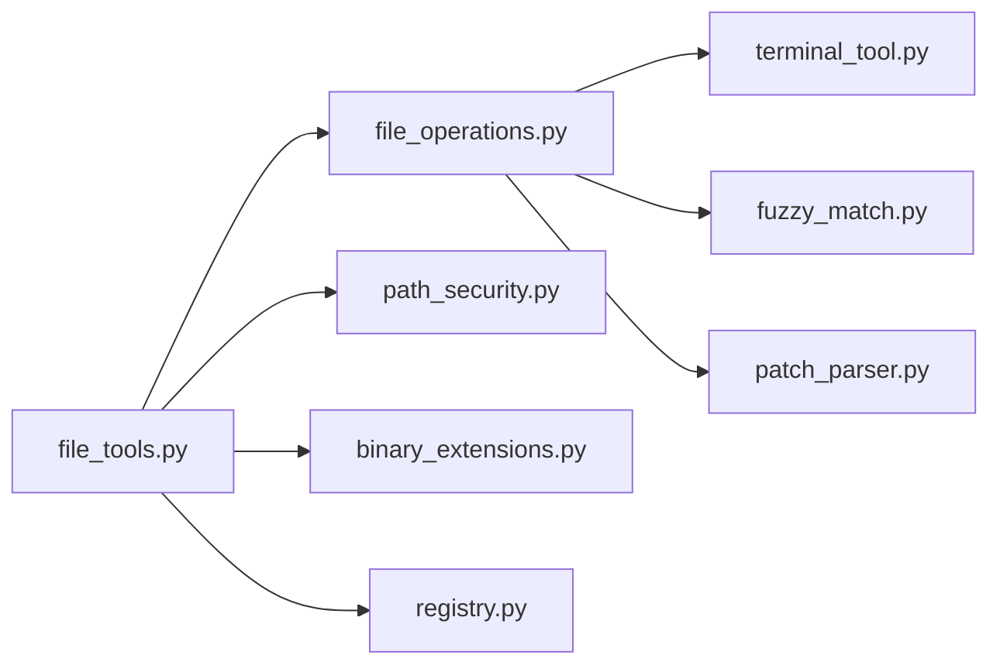

# 文件工具

<cite>
**本文引用的文件列表**
- [tools/file_tools.py](file://tools/file_tools.py)
- [tools/file_operations.py](file://tools/file_operations.py)
- [tools/path_security.py](file://tools/path_security.py)
- [tools/binary_extensions.py](file://tools/binary_extensions.py)
- [tools/fuzzy_match.py](file://tools/fuzzy_match.py)
- [tools/patch_parser.py](file://tools/patch_parser.py)
- [tools/terminal_tool.py](file://tools/terminal_tool.py)
- [tools/registry.py](file://tools/registry.py)
- [tests/tools/test_file_write_safety.py](file://tests/tools/test_file_write_safety.py)
- [tests/tools/test_watch_patterns.py](file://tests/tools/test_watch_patterns.py)
- [environments/tool_context.py](file://environments/tool_context.py)
- [gateway/run.py](file://gateway/run.py)
</cite>

## 目录
1. [简介](#简介)
2. [项目结构](#项目结构)
3. [核心组件](#核心组件)
4. [架构总览](#架构总览)
5. [详细组件分析](#详细组件分析)
6. [依赖关系分析](#依赖关系分析)
7. [性能考量](#性能考量)
8. [故障排除指南](#故障排除指南)
9. [结论](#结论)
10. [附录：使用示例与最佳实践](#附录使用示例与最佳实践)

## 简介
本文件工具系统为 Hermes Agent 提供统一的文件读取、写入、补丁（替换/多文件V4A补丁）与搜索能力，并在多后端（本地、Docker、Modal、SSH、Singularity、Daytona）环境中安全执行。系统通过“终端工具”抽象出不同运行环境的命令执行接口，文件工具在此之上实现跨环境一致的文件操作API；同时内置多重安全策略，包括敏感路径阻断、路径规范化与恶意路径检测、写入沙箱限制、重复读取/搜索防护、内容脱敏等，确保在开放交互场景下的安全与稳定。

## 项目结构
文件工具相关模块分布如下：
- 工具入口与注册：tools/file_tools.py
- 跨后端文件操作实现：tools/file_operations.py
- 路径安全与规范化：tools/path_security.py
- 二进制文件识别：tools/binary_extensions.py
- 模糊匹配与补丁应用：tools/fuzzy_match.py、tools/patch_parser.py
- 终端后端与环境管理：tools/terminal_tool.py
- 工具注册中心：tools/registry.py
- 安全测试与监控测试：tests/tools/test_file_write_safety.py、tests/tools/test_watch_patterns.py
- 远程批量下载与传输参考：environments/tool_context.py
- 进度展示与节流：gateway/run.py

图表来源
- [tools/file_tools.py:1-836](file://tools/file_tools.py#L1-L836)
- [tools/file_operations.py:1-1153](file://tools/file_operations.py#L1-L1153)
- [tools/path_security.py:1-44](file://tools/path_security.py#L1-L44)
- [tools/binary_extensions.py:1-43](file://tools/binary_extensions.py#L1-L43)
- [tools/fuzzy_match.py:1-567](file://tools/fuzzy_match.py#L1-L567)
- [tools/patch_parser.py:1-581](file://tools/patch_parser.py#L1-L581)
- [tools/terminal_tool.py:1-200](file://tools/terminal_tool.py#L1-L200)
- [tools/registry.py:1-200](file://tools/registry.py#L1-L200)

章节来源
- [tools/file_tools.py:1-836](file://tools/file_tools.py#L1-L836)
- [tools/file_operations.py:1-1153](file://tools/file_operations.py#L1-L1153)
- [tools/terminal_tool.py:1-200](file://tools/terminal_tool.py#L1-L200)
- [tools/registry.py:1-200](file://tools/registry.py#L1-L200)

## 核心组件
- 文件工具入口与调度：提供 read_file、write_file、patch、search_files 四类工具，封装参数校验、安全检查、并发控制、重复读取/搜索防护、结果脱敏与提示信息。
- 跨后端文件操作实现：ShellFileOperations 将文件操作抽象为 shell 命令，支持本地与容器/云沙箱环境；内置命令可用性缓存、路径展开与转义、二进制/图片检测、行号添加、分页读取、统一 diff 生成、自动语法检查等。
- 路径安全与规范化：validate_within_dir 与 has_traversal_component 提供路径规范化与“..”遍历检测；write deny 列表与可选 safe-root 沙箱限制写入范围。
- 模糊匹配与补丁：fuzzy_match 提供九种策略的文本匹配与替换；patch_parser 解析并应用 V4A 多文件补丁，两阶段验证-应用，避免误改。
- 终端后端与环境：terminal_tool 抽象多后端执行、工作目录校验、危险命令审批、磁盘用量告警、后台任务与清理等。
- 工具注册中心：registry 统一收集工具 schema 与处理器，支持按工具集可用性过滤与动态发现。

章节来源
- [tools/file_tools.py:280-836](file://tools/file_tools.py#L280-L836)
- [tools/file_operations.py:322-800](file://tools/file_operations.py#L322-L800)
- [tools/path_security.py:15-44](file://tools/path_security.py#L15-L44)
- [tools/fuzzy_match.py:50-102](file://tools/fuzzy_match.py#L50-L102)
- [tools/patch_parser.py:69-225](file://tools/patch_parser.py#L69-L225)
- [tools/terminal_tool.py:148-200](file://tools/terminal_tool.py#L148-L200)
- [tools/registry.py:48-200](file://tools/registry.py#L48-L200)

## 架构总览
文件工具以“工具层-操作层-后端层”的三层结构组织：
- 工具层：file_tools.py 对外暴露 read/write/patch/search 接口，负责安全前置检查、重复读取/搜索防护、字符数限制、敏感信息脱敏、错误格式化与提示。
- 操作层：file_operations.py 的 ShellFileOperations 实现具体文件操作，统一通过终端后端 execute 接口执行命令，支持路径展开/转义、二进制/图片检测、分页读取、diff 生成、自动语法检查。
- 后端层：terminal_tool.py 提供多后端执行器（local/docker/modal/ssh/singularity/daytona），并维护环境生命周期、清理与磁盘用量告警。

图表来源
- [tools/file_tools.py:280-836](file://tools/file_tools.py#L280-L836)
- [tools/file_operations.py:322-800](file://tools/file_operations.py#L322-L800)
- [tools/terminal_tool.py:1-200](file://tools/terminal_tool.py#L1-L200)

## 详细组件分析

### 文件工具入口与调度（file_tools.py）
- 安全前置检查
  - 设备路径阻断：禁止读取 /dev/zero、/dev/random、/dev/tty、/proc/self/fd/* 等可能挂起或产生无限输出的设备文件。
  - 敏感路径阻断：禁止写入 /etc/、/boot/、/usr/lib/systemd/ 及特定敏感文件（如 /var/run/docker.sock）。
  - 内部缓存与会话隔离：基于 task_id 缓存 ShellFileOperations，避免重复沙箱创建；结合终端后端的环境生命周期管理。
- 重复读取/搜索防护
  - 使用读取追踪器记录最近一次调用键、连续次数、已读历史、去重缓存与最后读取时间戳，防止循环读取与重复搜索。
  - 当连续相同调用达到阈值时，返回警告或直接阻止，避免模型陷入重复读取。
- 字符数限制与大文件提示
  - 读取结果字符数超过配置上限（默认约 10 万字符）时拒绝并建议使用 offset/limit 分段读取。
  - 对超大文件给出“仅读取所需区域”的提示。
- 敏感信息脱敏
  - 在字符数限制检查之后对内容进行脱敏处理，降低泄露风险。
- 工具注册与最大结果大小
  - 通过 registry.register 注册 read/write/patch/search_files，设置最大结果字符数与表情符号，便于前端展示与令牌估算。

章节来源
- [tools/file_tools.py:280-836](file://tools/file_tools.py#L280-L836)
- [tools/registry.py:48-200](file://tools/registry.py#L48-L200)

### 跨后端文件操作实现（file_operations.py）
- 写入安全与沙箱
  - 静态写入阻断清单：禁止写入 ~/.ssh/*、~/.aws/*、~/.gnupg/*、~/.kube/*、/etc/sudoers*、/etc/systemd/*、~/.docker/*、~/.azure/*、~/.config/gh/*、/etc/passwd、/etc/shadow、~/.bashrc、~/.zshrc 等。
  - 可选 safe-root 沙箱：HERMES_WRITE_SAFE_ROOT 环境变量限定写入根目录，未在该树内则拒绝写入。
- ShellFileOperations 关键能力
  - 路径展开与转义：支持 ~ 与 ~user 展开，避免 shell 注入；对参数进行单引号转义。
  - 二进制/图片检测：根据扩展名与内容采样判断是否为二进制或图片，图片走视觉工具链。
  - 分页读取与行号添加：sed 分页读取，行号前缀格式化，长行截断，统计总行数与截断标记。
  - 写入与补丁：cat 管道写入（绕过 ARG_MAX），diff 生成，自动语法检查（py/js/ts/go/rs）。
  - V4A 补丁：解析并应用多文件补丁，两阶段验证-应用，失败时保留原状态。
- 结果数据结构
  - ReadResult、WriteResult、PatchResult、SearchResult、LintResult、ExecuteResult，统一 to_dict 序列化。

章节来源
- [tools/file_operations.py:39-117](file://tools/file_operations.py#L39-L117)
- [tools/file_operations.py:322-800](file://tools/file_operations.py#L322-L800)

### 路径安全与规范化（path_security.py）
- validate_within_dir：使用 Path.resolve() 与 relative_to() 校验路径是否位于允许根目录内，规避符号链接与 “..” 遍历逃逸。
- has_traversal_component：快速检测路径中是否存在 “..” 组件，作为前置过滤。

章节来源
- [tools/path_security.py:15-44](file://tools/path_security.py#L15-L44)

### 二进制文件识别（binary_extensions.py）
- BINARY_EXTENSIONS：预定义大量二进制/大体积文件扩展名，用于跳过文本读取与减少上下文膨胀。
- has_binary_extension：纯字符串检查，无需 I/O。

章节来源
- [tools/binary_extensions.py:1-43](file://tools/binary_extensions.py#L1-L43)

### 模糊匹配与补丁应用（fuzzy_match.py、patch_parser.py）
- fuzzy_find_and_replace：九步策略链（精确、逐行去空白、空白归一、忽略缩进、转义归一、边界去空白、Unicode 归一、锚定块、上下文感知），支持唯一匹配或全部替换。
- patch_parser：解析 V4A 补丁，两阶段验证-应用，支持 Add/Update/Delete/Move 操作，自动生成 diff 并对修改/新增文件进行语法检查。

章节来源
- [tools/fuzzy_match.py:50-102](file://tools/fuzzy_match.py#L50-L102)
- [tools/patch_parser.py:69-225](file://tools/patch_parser.py#L69-L225)

### 终端后端与环境管理（terminal_tool.py）
- 多后端执行：local、docker、modal、ssh、singularity、daytona，统一 execute 接口。
- 危险命令审批与工作目录校验：allowlist 字符集校验，防止 shell 注入。
- 磁盘用量告警：扫描沙箱目录总大小，超过阈值发出告警。
- 环境生命周期：后台清理线程、空闲超时回收、持久化文件系统与沙箱重建的注意事项。

章节来源
- [tools/terminal_tool.py:148-200](file://tools/terminal_tool.py#L148-L200)

### 工具注册中心（registry.py）
- 统一收集工具 schema 与处理器，支持按工具集可用性过滤、动态注销与重新注册、最大结果大小查询、错误格式化等。

章节来源
- [tools/registry.py:48-200](file://tools/registry.py#L48-L200)

## 依赖关系分析
- file_tools.py 依赖 file_operations.py（ShellFileOperations）、path_security.py（路径安全）、binary_extensions.py（二进制识别）、registry.py（注册与错误格式化）。
- file_operations.py 依赖 terminal_tool.py（execute 接口）、fuzzy_match.py（模糊匹配）、patch_parser.py（V4A 解析）、binary_extensions.py（二进制识别）。
- registry.py 为所有工具模块提供注册与调度服务，避免循环导入。

图表来源
- [tools/file_tools.py:1-836](file://tools/file_tools.py#L1-L836)
- [tools/file_operations.py:1-1153](file://tools/file_operations.py#L1-L1153)
- [tools/terminal_tool.py:1-200](file://tools/terminal_tool.py#L1-L200)
- [tools/registry.py:1-200](file://tools/registry.py#L1-L200)

章节来源
- [tools/file_tools.py:1-836](file://tools/file_tools.py#L1-L836)
- [tools/file_operations.py:1-1153](file://tools/file_operations.py#L1-L1153)
- [tools/terminal_tool.py:1-200](file://tools/terminal_tool.py#L1-L200)
- [tools/registry.py:1-200](file://tools/registry.py#L1-L200)

## 性能考量
- ARG_MAX 绕过：写入与补丁应用通过 stdin 管道传递内容，避免命令行参数长度限制，支持大文件写入。
- 命令可用性缓存：ShellFileOperations 缓存命令存在性，减少重复探测。
- 分页读取与字符数限制：避免一次性加载大文件到上下文，降低内存与令牌消耗。
- 重复读取/搜索去重：基于 mtime 与键值去重，避免重复发送相同内容。
- 自动语法检查：仅对受支持语言执行轻量级语法检查，避免昂贵的外部工具链。
- 线程安全与缓存：文件操作与读取追踪器使用锁保护，避免并发竞争。

[本节为通用性能讨论，不直接分析具体文件]

## 故障排除指南
- 写入被拒
  - 检查是否命中静态写入阻断清单或 safe-root 沙箱限制。
  - 参考测试用例：[tests/tools/test_file_write_safety.py:1-42](file://tests/tools/test_file_write_safety.py#L1-L42)。
- 设备文件读取失败
  - 系统会阻断 /dev/*、/proc/self/fd/* 等可能导致挂起或无限输出的路径。
- 二进制/图片无法读取
  - 系统会检测二进制与图片扩展名并提示使用视觉工具或跳过。
- 重复读取/搜索被阻止
  - 连续相同调用达到阈值会被警告或阻止，建议切换任务或使用其他工具。
- V4A 补丁应用失败
  - 两阶段验证失败会返回错误信息，检查上下文提示、唯一性与目标文件状态。
- 进度更新节流
  - 平台侧对消息编辑有频率限制，系统会自动节流合并更新，避免触发限流。

章节来源
- [tests/tools/test_file_write_safety.py:1-42](file://tests/tools/test_file_write_safety.py#L1-L42)
- [tools/file_tools.py:280-836](file://tools/file_tools.py#L280-L836)
- [tools/file_operations.py:322-800](file://tools/file_operations.py#L322-L800)
- [tests/tools/test_watch_patterns.py:135-190](file://tests/tools/test_watch_patterns.py#L135-L190)
- [gateway/run.py:7485-7533](file://gateway/run.py#L7485-L7533)

## 结论
Hermes Agent 的文件工具系统通过“工具层-操作层-后端层”的清晰分层，实现了跨环境一致且安全的文件操作能力。系统在安全性方面构建了多层次防线：路径规范化与遍历检测、敏感路径阻断、写入沙箱、重复读取/搜索防护、字符数限制与内容脱敏；在可用性方面提供了分页读取、模糊匹配、V4A 补丁、自动语法检查与统一结果格式。配合终端后端的环境管理与平台侧的进度节流，整体具备良好的稳定性与可运维性。

[本节为总结性内容，不直接分析具体文件]

## 附录：使用示例与最佳实践

### 使用示例
- 读取文件
  - 参数：path、offset（默认 1）、limit（默认 500，最大 2000）
  - 建议：大文件使用 offset/limit 分段读取，避免超过字符数限制。
  - 参考：[tools/file_tools.py:280-448](file://tools/file_tools.py#L280-L448)
- 写入文件
  - 参数：path、content
  - 注意：会覆盖整个文件；涉及敏感路径会触发阻断。
  - 参考：[tools/file_tools.py:571-593](file://tools/file_tools.py#L571-L593)
- 补丁编辑
  - 替换模式：指定 old_string 与 new_string，支持唯一匹配或 replace_all。
  - V4A 模式：传入多文件补丁内容，系统自动解析并两阶段验证-应用。
  - 参考：[tools/file_tools.py:595-649](file://tools/file_tools.py#L595-L649)
- 搜索文件/内容
  - 参数：pattern、target（content/files）、path、file_glob、limit、offset、output_mode、context
  - 参考：[tools/file_tools.py:652-717](file://tools/file_tools.py#L652-L717)

### 安全最佳实践
- 严格限制写入范围
  - 使用 HERMES_WRITE_SAFE_ROOT 将写入限制在工作区根目录。
  - 避免写入系统关键路径与凭证目录。
  - 参考：[tools/file_operations.py:82-117](file://tools/file_operations.py#L82-L117)
- 路径规范化与遍历检测
  - 使用 validate_within_dir 与 has_traversal_component 过滤潜在遍历攻击。
  - 参考：[tools/path_security.py:15-44](file://tools/path_security.py#L15-L44)
- 二进制/图片文件处理
  - 通过 binary_extensions 与图片扩展检测，避免将二进制内容送入上下文。
  - 参考：[tools/binary_extensions.py:1-43](file://tools/binary_extensions.py#L1-L43)
- 重复读取/搜索防护
  - 利用内置去重与连续调用计数，避免模型陷入循环。
  - 参考：[tools/file_tools.py:128-148](file://tools/file_tools.py#L128-L148)
- 内容脱敏
  - 在字符数限制检查后对结果进行脱敏，降低敏感信息泄露风险。
  - 参考：[tools/file_tools.py:386-389](file://tools/file_tools.py#L386-L389)

### 批量操作与进度跟踪
- 批量文件传输（参考实现）
  - environments/tool_context.py 提供远程目录遍历与批量下载示例，可借鉴其目录结构保留与父目录创建逻辑。
  - 参考：[environments/tool_context.py:283-319](file://environments/tool_context.py#L283-L319)
- 进度节流与展示
  - gateway/run.py 展示了平台侧对消息编辑的节流与合并策略，避免触发限流。
  - 参考：[gateway/run.py:7485-7533](file://gateway/run.py#L7485-L7533)