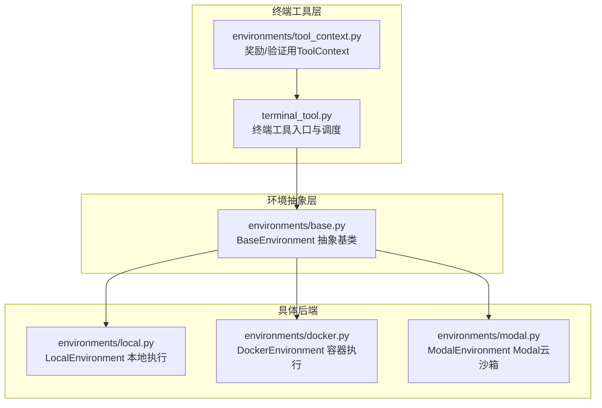
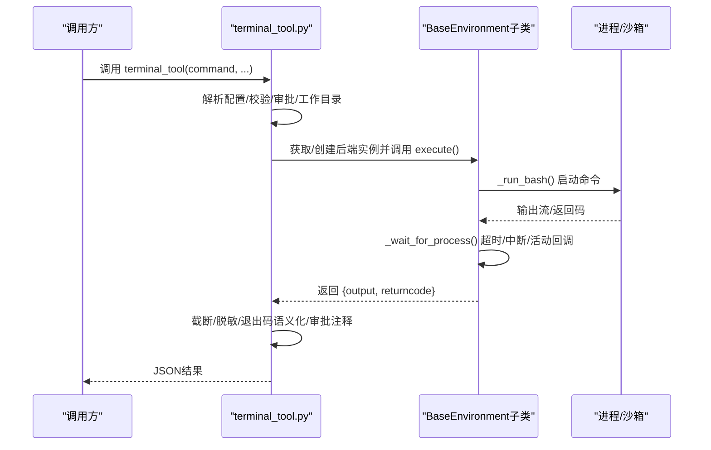
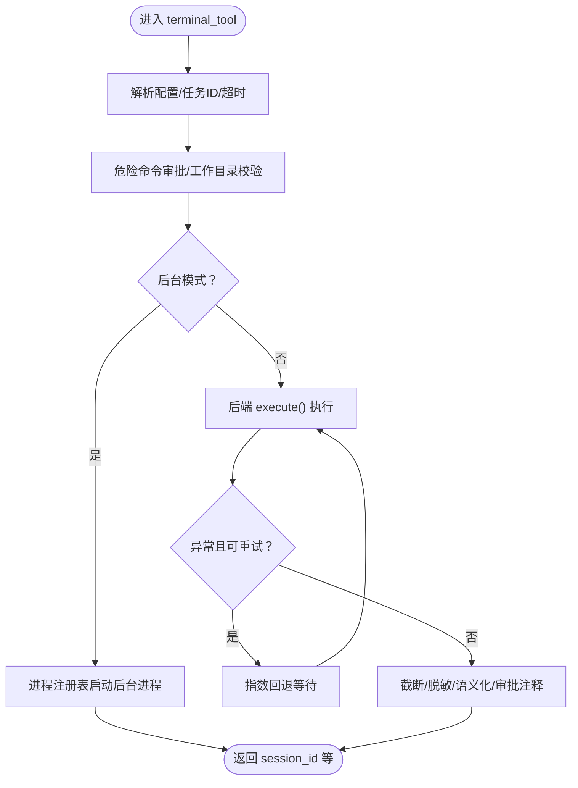
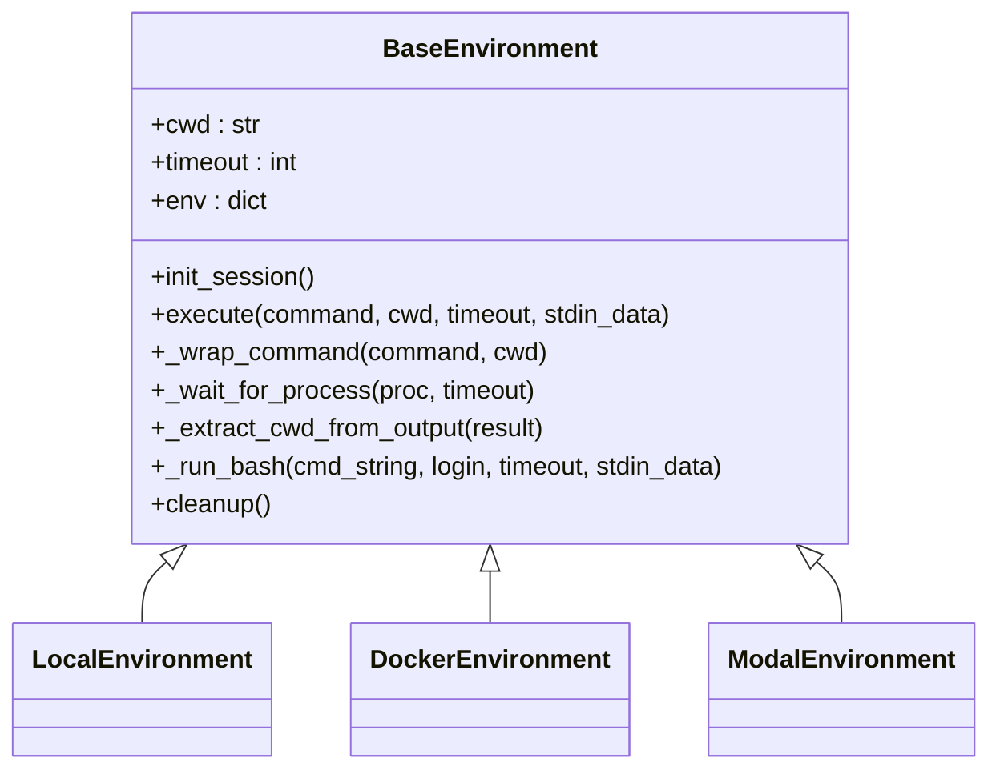
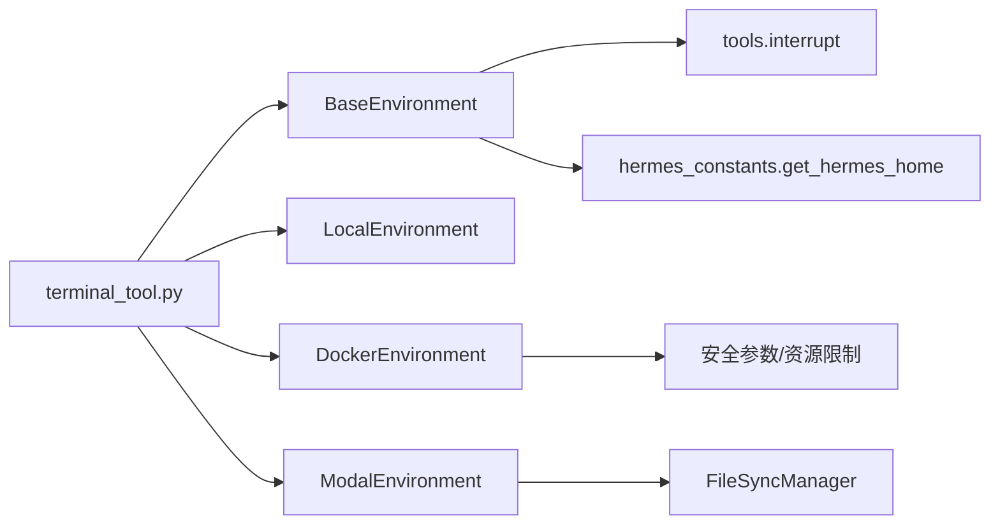

# 终端工具

<cite>
**本文引用的文件**
- [tools/terminal_tool.py](file://tools/terminal_tool.py)
- [tools/environments/base.py](file://tools/environments/base.py)
- [tools/environments/local.py](file://tools/environments/local.py)
- [tools/environments/docker.py](file://tools/environments/docker.py)
- [tools/environments/modal.py](file://tools/environments/modal.py)
- [environments/tool_context.py](file://environments/tool_context.py)
- [website/docs/user-guide/security.md](file://website/docs/user-guide/security.md)
- [website/docs/developer-guide/tools-runtime.md](file://website/docs/developer-guide/tools-runtime.md)
- [tests/tools/test_terminal_timeout_output.py](file://tests/tools/test_terminal_timeout_output.py)
- [tests/tools/test_terminal_foreground_timeout_cap.py](file://tests/tools/test_terminal_foreground_timeout_cap.py)
</cite>

## 目录
1. [简介](#简介)
2. [项目结构](#项目结构)
3. [核心组件](#核心组件)
4. [架构总览](#架构总览)
5. [详细组件分析](#详细组件分析)
6. [依赖分析](#依赖分析)
7. [性能考虑](#性能考虑)
8. [故障排查指南](#故障排查指南)
9. [结论](#结论)
10. [附录](#附录)

## 简介
本文件面向Hermes Agent的“终端工具”子系统，系统性阐述其架构设计、命令执行机制、安全沙箱策略、并发与超时管理、错误恢复、环境配置与路径管理、权限控制、使用示例、调试技巧与性能优化建议，并说明与代理系统的集成模式与最佳实践。目标是帮助开发者与使用者在理解实现细节的同时，安全高效地使用终端工具完成各类任务。

## 项目结构
终端工具由“入口工具函数 + 多后端执行环境 + 基类抽象 + 工具上下文”构成，支持本地、Docker、Modal等多种执行后端；通过统一的BaseEnvironment接口屏蔽差异，提供一致的命令执行体验。

图示来源
- [tools/terminal_tool.py:1133-1556](file://tools/terminal_tool.py#L1133-L1556)
- [tools/environments/base.py:226-580](file://tools/environments/base.py#L226-L580)
- [tools/environments/local.py:216-315](file://tools/environments/local.py#L216-L315)
- [tools/environments/docker.py:217-561](file://tools/environments/docker.py#L217-L561)
- [tools/environments/modal.py:147-435](file://tools/environments/modal.py#L147-L435)
- [environments/tool_context.py:67-108](file://environments/tool_context.py#L67-L108)

章节来源
- [tools/terminal_tool.py:1133-1556](file://tools/terminal_tool.py#L1133-L1556)
- [tools/environments/base.py:226-580](file://tools/environments/base.py#L226-L580)

## 核心组件
- 终端工具入口：terminal_tool()负责参数解析、环境选择、前置校验（危险命令审批、工作目录校验）、后台/前台执行、超时与重试、输出截断与脱敏、退出码语义化提示等。
- 环境抽象：BaseEnvironment定义统一的会话快照、命令包装、进程等待、CWD跟踪、stdin注入、超时与中断处理等通用流程。
- 具体后端：Local/Docker/Modal分别实现各自spawn/exec逻辑，提供安全边界、资源限制、持久化与文件同步能力。
- 工具上下文：ToolContext为奖励/验证场景提供对终端等工具的直接访问，确保同一回合内复用相同会话状态。

章节来源
- [tools/terminal_tool.py:1133-1556](file://tools/terminal_tool.py#L1133-L1556)
- [tools/environments/base.py:226-580](file://tools/environments/base.py#L226-L580)
- [environments/tool_context.py:67-108](file://environments/tool_context.py#L67-L108)

## 架构总览
终端工具采用“入口调度 + 抽象基类 + 多后端实现”的分层架构。入口根据环境变量与任务ID选择或创建后端实例，调用后端execute()执行命令；后端通过BaseEnvironment封装会话快照、CWD、stdin、超时与中断处理；不同后端在spawn/exec层面实现差异化。

图示来源
- [tools/terminal_tool.py:1133-1556](file://tools/terminal_tool.py#L1133-L1556)
- [tools/environments/base.py:382-451](file://tools/environments/base.py#L382-L451)

## 详细组件分析

### 组件A：终端工具入口（terminal_tool）
- 功能要点
  - 环境选择与配置：从环境变量读取后端类型、镜像、默认工作目录、超时、生命周期、容器资源、SSH连接等；支持按任务ID覆盖镜像与工作目录。
  - 前置校验：危险命令审批（含网关/CLI交互）、工作目录白名单校验、PTD stdin兼容性判断。
  - 执行模式：前台即时返回（带重试）与后台进程（注册到进程注册表），支持通知完成与输出监控模式。
  - 超时与重试：前台命令最大前台超时受常量限制，超出则拒绝；内部重试最多3次；后台通过进程注册表管理。
  - 输出处理：超长输出截断（保留头尾）、ANSI转义清理、敏感信息脱敏、常见非错误退出码语义化提示。
  - 清理与生命周期：后台清理线程定期回收空闲后端；手动清理与退出清理钩子。
- 关键流程图（前台执行+重试+超时）

图示来源
- [tools/terminal_tool.py:1133-1556](file://tools/terminal_tool.py#L1133-L1556)
- [tests/tools/test_terminal_timeout_output.py:1-27](file://tests/tools/test_terminal_timeout_output.py#L1-L27)
- [tests/tools/test_terminal_foreground_timeout_cap.py:64-176](file://tests/tools/test_terminal_foreground_timeout_cap.py#L64-L176)

章节来源
- [tools/terminal_tool.py:1133-1556](file://tools/terminal_tool.py#L1133-L1556)
- [tests/tools/test_terminal_timeout_output.py:1-27](file://tests/tools/test_terminal_timeout_output.py#L1-L27)
- [tests/tools/test_terminal_foreground_timeout_cap.py:64-176](file://tests/tools/test_terminal_foreground_timeout_cap.py#L64-L176)

### 组件B：环境抽象（BaseEnvironment）
- 功能要点
  - 会话快照：init_session捕获登录shell环境（变量、函数、别名、选项），后续命令source该快照以保持状态。
  - 命令包装：_wrap_command拼装“切换工作目录 → 执行命令 → 重新导出快照 → 写入CWD标记”的脚本。
  - 进程生命周期：_wait_for_process轮询进程，支持用户中断（130）、超时（124）、活动回调上报、输出流收集与二进制检测。
  - CWD跟踪：远程后端通过stdout标记提取当前工作目录，本地后端通过临时文件读取。
  - stdin处理：支持管道注入与heredoc嵌入两种模式，适配不同后端。
- 类关系图

图示来源
- [tools/environments/base.py:226-580](file://tools/environments/base.py#L226-L580)
- [tools/environments/local.py:216-315](file://tools/environments/local.py#L216-L315)
- [tools/environments/docker.py:217-561](file://tools/environments/docker.py#L217-L561)
- [tools/environments/modal.py:147-435](file://tools/environments/modal.py#L147-L435)

章节来源
- [tools/environments/base.py:226-580](file://tools/environments/base.py#L226-L580)

### 组件C：本地后端（LocalEnvironment）
- 特性
  - 直接spawn bash进程，每调用一次即spawn一次新bash。
  - 会话快照保存于临时文件，CWD通过文件读取更新。
  - 环境变量过滤：移除大量Provider/工具/网关相关敏感变量，仅允许显式透传项；支持按Profile隔离HOME。
  - 进程组管理：非Windows下通过进程组终止子进程，避免孤儿进程。
- 安全与隔离
  - 通过最小化环境变量与阻断敏感键，降低宿主泄露风险。
  - 未引入额外容器/VM隔离，依赖宿主安全策略。

章节来源
- [tools/environments/local.py:1-315](file://tools/environments/local.py#L1-L315)

### 组件D：Docker后端（DockerEnvironment）
- 特性
  - 使用hardened参数（capabilities drop、no-new-priv、PID限制、tmpfs限制）启动容器。
  - 支持CPU/内存/磁盘限制、网络开关、只读挂载凭据与缓存目录、可选持久化绑定目录。
  - 初始化时注入显式允许的环境变量，后续命令通过快照继承。
  - 文件系统：持久化模式绑定宿主目录，非持久化模式使用tmpfs。
- 安全与隔离
  - 容器作为安全边界，具备严格的capabilities与资源限制。
  - 通过只读挂载与最小化环境变量进一步降低风险。

章节来源
- [tools/environments/docker.py:1-561](file://tools/environments/docker.py#L1-L561)
- [website/docs/user-guide/security.md:271-306](file://website/docs/user-guide/security.md#L271-L306)

### 组件E：Modal后端（ModalEnvironment）
- 特性
  - 基于Modal SDK的Sandbox，支持快照持久化与文件同步管理。
  - stdin通过heredoc嵌入，避免SDK参数长度限制；批量上传使用tar+base64管道。
  - 异步工作线程承载SDK调用，支持取消与超时。
- 持久化与文件同步
  - 可将文件系统快照为Image ID并按任务ID存储，下次创建时优先恢复。
  - 执行前触发文件同步，减少跨轮次数据不一致。

章节来源
- [tools/environments/modal.py:1-435](file://tools/environments/modal.py#L1-L435)

### 组件F：工具上下文（ToolContext）
- 特性
  - 面向奖励/验证场景，提供对terminal/read_file/write_file等工具的直接访问。
  - 通过任务ID确保与模型回合内的终端会话一致，便于复现测试与评估。
  - 在异步后端（Modal/Docker/Daytona）中通过线程池避免事件循环冲突。
- 集成点
  - 在奖励函数中直接调用ctx.terminal(...)执行测试或检查。

章节来源
- [environments/tool_context.py:67-108](file://environments/tool_context.py#L67-L108)

## 依赖分析
- 组件耦合
  - terminal_tool依赖各后端类与审批/进程注册/清理模块；通过统一的BaseEnvironment接口解耦。
  - BaseEnvironment依赖工具中断信号、hermes_home等基础设施。
  - 后端间共享的工具包括：文件同步、会话快照、临时文件管理等。
- 外部依赖
  - Docker CLI、Modal SDK、SSH客户端等；入口提供可用性检查与错误提示。

图示来源
- [tools/terminal_tool.py:1133-1556](file://tools/terminal_tool.py#L1133-L1556)
- [tools/environments/base.py:21-52](file://tools/environments/base.py#L21-L52)
- [tools/environments/docker.py:128-146](file://tools/environments/docker.py#L128-L146)
- [tools/environments/modal.py:24-31](file://tools/environments/modal.py#L24-L31)

章节来源
- [tools/terminal_tool.py:1133-1556](file://tools/terminal_tool.py#L1133-L1556)
- [tools/environments/base.py:21-52](file://tools/environments/base.py#L21-L52)

## 性能考虑
- 并发与资源
  - 后台进程通过进程注册表统一管理，避免重复创建后端实例；清理线程周期回收空闲后端。
  - Docker/Modal后端在冷启动阶段可能较慢，可通过会话快照与文件同步减少重复初始化成本。
- I/O与输出
  - 超长输出自动截断并保留头尾，避免大文本影响传输与显示；ANSI清理防止格式污染。
- 超时与重试
  - 前台命令存在最大前台超时上限，避免阻塞；后台任务适合长时间运行；内部重试降低瞬时失败概率。
- 磁盘与持久化
  - Docker持久化模式可跨轮次保留/workspace与/root；Modal快照提升冷启动效率；需关注磁盘用量阈值告警。

章节来源
- [tools/terminal_tool.py:819-916](file://tools/terminal_tool.py#L819-L916)
- [tools/environments/docker.py:280-343](file://tools/environments/docker.py#L280-L343)
- [tools/environments/modal.py:177-274](file://tools/environments/modal.py#L177-L274)

## 故障排查指南
- 常见问题与定位
  - Docker不可用：检查docker可执行文件与守护进程状态，确认权限与驱动支持。
  - Modal凭证缺失：根据后端模式选择直连或托管模式，确保凭证或网关可用。
  - SSH配置错误：核对主机/用户/端口/密钥是否正确。
  - 前台超时被拒：调整为后台执行并开启完成通知，或缩短命令复杂度。
  - 输出截断：适当拆分命令或使用文件落盘，结合ToolContext下载。
  - sudo失败：在消息通道场景下，可在Agent机器上配置SUDO_PASSWORD并按提示操作。
- 调试技巧
  - 开启活动回调以便网关感知长任务进度。
  - 使用ToolContext在奖励函数中复现与验证命令行为。
  - 查看清理线程日志与磁盘用量统计，识别资源泄漏或堆积。
- 相关测试参考
  - 超时保留部分输出、前台超时上限、后台不受限等行为均有单元测试覆盖。

章节来源
- [tools/terminal_tool.py:1558-1599](file://tools/terminal_tool.py#L1558-L1599)
- [tests/tools/test_terminal_timeout_output.py:1-27](file://tests/tools/test_terminal_timeout_output.py#L1-L27)
- [tests/tools/test_terminal_foreground_timeout_cap.py:64-176](file://tests/tools/test_terminal_foreground_timeout_cap.py#L64-L176)

## 结论
Hermes终端工具通过统一抽象与多后端实现，在保证安全性与隔离性的前提下，提供了灵活、可扩展、可观测的命令执行能力。前台/后台模式互补、超时与重试策略完善、输出与安全处理到位，配合工具上下文与清理机制，能够满足从日常开发到评测验证的多样化需求。建议在生产环境中合理配置后端、资源与持久化策略，并结合测试用例持续验证行为一致性。

## 附录

### 使用示例与最佳实践
- 前台执行短命令：设置合理timeout，避免超过前台最大限制；若需要长时间运行，改为后台并开启完成通知。
- 后台执行长任务：使用watch_patterns监控关键输出，结合notify_on_complete自动提醒。
- 安全与合规：避免危险命令或明确审批；严格控制环境变量透传；必要时启用Docker/Modal隔离。
- 路径与权限：遵循工作目录白名单规则；在容器后端避免使用相对路径或宿主绝对路径；如需绑定宿主目录，谨慎配置并注意权限。
- 集成模式：在奖励/验证场景使用ToolContext复现模型回合内的终端状态，确保结果可重现。

章节来源
- [tools/terminal_tool.py:1133-1556](file://tools/terminal_tool.py#L1133-L1556)
- [environments/tool_context.py:67-108](file://environments/tool_context.py#L67-L108)
- [website/docs/developer-guide/tools-runtime.md:196-236](file://website/docs/developer-guide/tools-runtime.md#L196-L236)