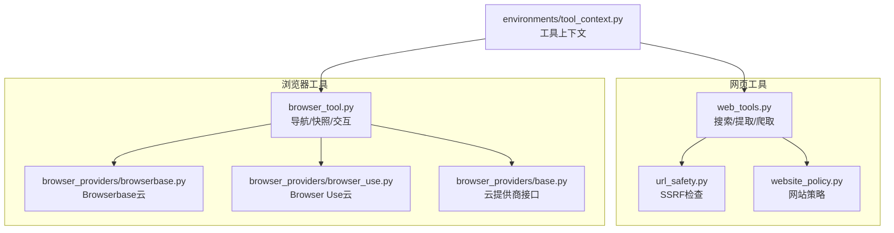
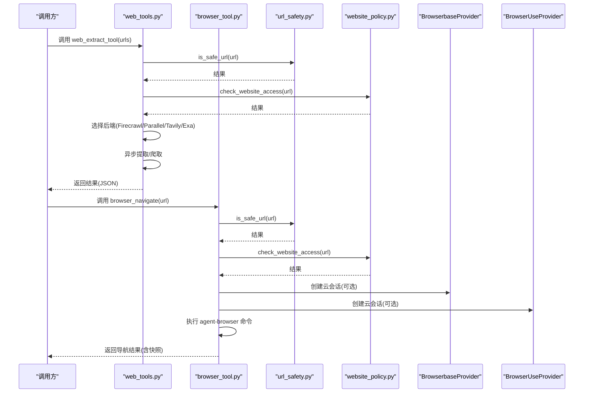
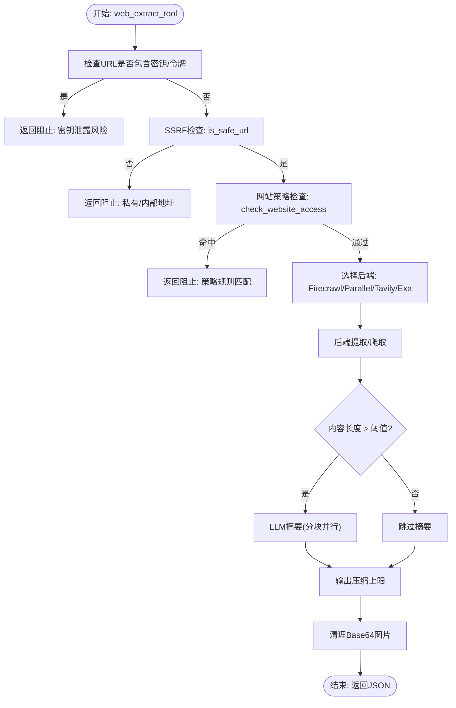
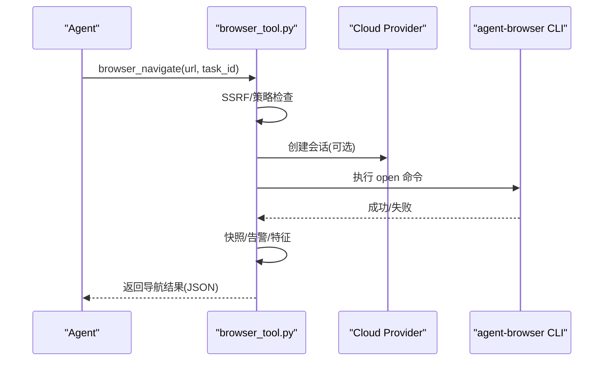
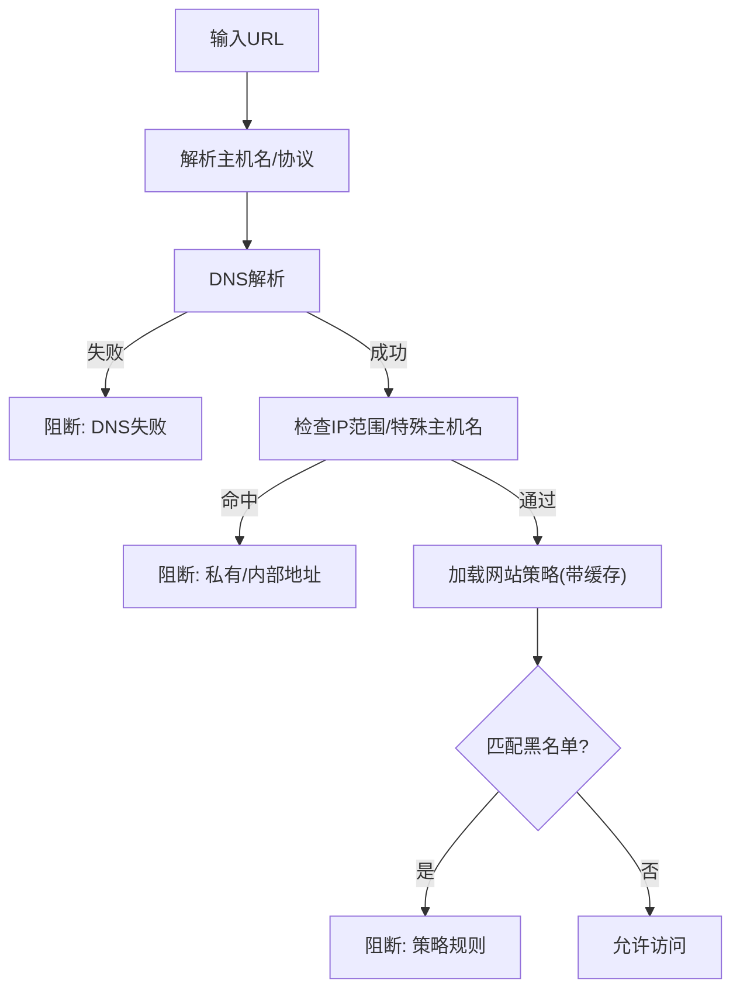
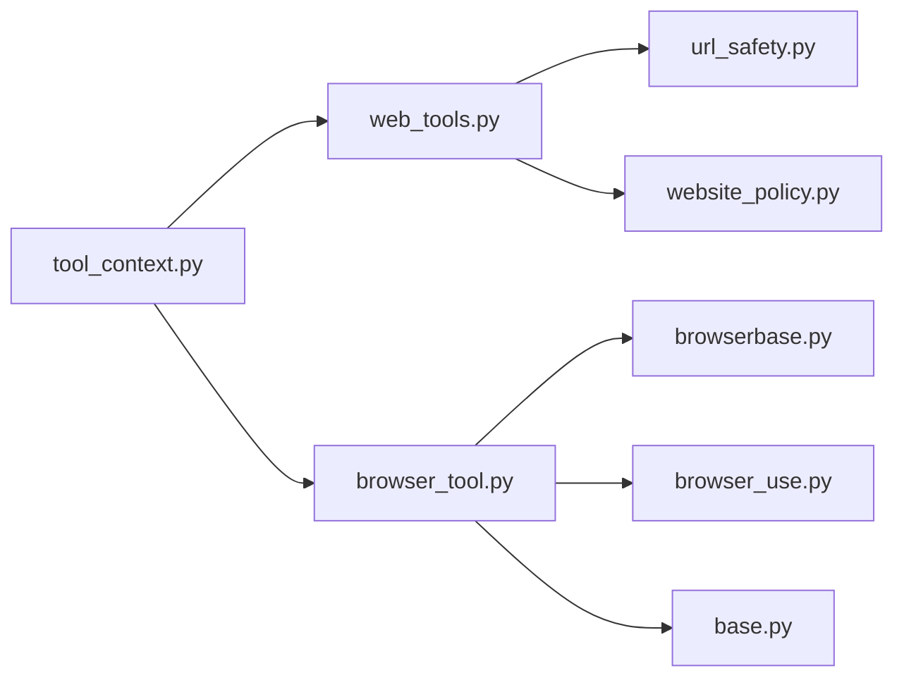

# 网络工具

<cite>
**本文引用的文件**
- [tools/web_tools.py](file://tools/web_tools.py)
- [tools/browser_tool.py](file://tools/browser_tool.py)
- [tools/url_safety.py](file://tools/url_safety.py)
- [tools/website_policy.py](file://tools/website_policy.py)
- [tools/browser_providers/browserbase.py](file://tools/browser_providers/browserbase.py)
- [tools/browser_providers/browser_use.py](file://tools/browser_providers/browser_use.py)
- [tools/browser_providers/base.py](file://tools/browser_providers/base.py)
- [environments/tool_context.py](file://environments/tool_context.py)
- [website/docs/user-guide/features/browser.md](file://website/docs/user-guide/features/browser.md)
</cite>

## 目录
1. [简介](#简介)
2. [项目结构](#项目结构)
3. [核心组件](#核心组件)
4. [架构总览](#架构总览)
5. [详细组件分析](#详细组件分析)
6. [依赖分析](#依赖分析)
7. [性能考虑](#性能考虑)
8. [故障排查指南](#故障排查指南)
9. [结论](#结论)
10. [附录](#附录)

## 简介
本文件面向Hermes Agent的网络工具系统，围绕网页抓取、URL处理与网络请求展开，系统性阐述浏览器工具的自动化能力（会话管理、页面渲染、内容提取）、安全防护（URL验证、网站策略、SSRF防护）、并发与性能优化（异步处理、并行压缩、超时控制）、配置与认证（后端选择、代理与隐身模式、调试日志）以及错误处理与可观测性（重试、清理、监控指标）。目标是帮助开发者与使用者在理解实现细节的同时，高效、安全地使用网络工具。

## 项目结构
网络工具由两大子系统构成：
- 网页搜索/提取/爬取工具：统一抽象多后端（Firecrawl、Parallel、Tavily、Exa），支持异步内容处理与LLM摘要。
- 浏览器自动化工具：通过agent-browser CLI或云提供商（Browserbase、Browser Use）实现页面导航、快照、交互、截图与视觉分析，并内置会话生命周期管理与安全防护。

图示来源
- [tools/web_tools.py:1-2104](file://tools/web_tools.py#L1-L2104)
- [tools/browser_tool.py:1-2388](file://tools/browser_tool.py#L1-L2388)
- [tools/url_safety.py:1-98](file://tools/url_safety.py#L1-L98)
- [tools/website_policy.py:1-283](file://tools/website_policy.py#L1-L283)
- [tools/browser_providers/browserbase.py:1-218](file://tools/browser_providers/browserbase.py#L1-L218)
- [tools/browser_providers/browser_use.py:1-216](file://tools/browser_providers/browser_use.py#L1-L216)
- [tools/browser_providers/base.py:1-60](file://tools/browser_providers/base.py#L1-L60)
- [environments/tool_context.py:358-402](file://environments/tool_context.py#L358-L402)

章节来源
- [tools/web_tools.py:1-2104](file://tools/web_tools.py#L1-L2104)
- [tools/browser_tool.py:1-2388](file://tools/browser_tool.py#L1-L2388)
- [tools/url_safety.py:1-98](file://tools/url_safety.py#L1-L98)
- [tools/website_policy.py:1-283](file://tools/website_policy.py#L1-L283)
- [tools/browser_providers/browserbase.py:1-218](file://tools/browser_providers/browserbase.py#L1-L218)
- [tools/browser_providers/browser_use.py:1-216](file://tools/browser_providers/browser_use.py#L1-L216)
- [tools/browser_providers/base.py:1-60](file://tools/browser_providers/base.py#L1-L60)
- [environments/tool_context.py:358-402](file://environments/tool_context.py#L358-L402)

## 核心组件
- 网页工具（web_tools）
  - 后端选择与可用性检测：自动从配置与环境变量中选择后端（Firecrawl、Parallel、Tavily、Exa），并进行可用性校验。
  - 搜索/提取/爬取：统一返回格式，支持异步提取与LLM摘要；对大文本采用分块并行处理与合成摘要。
  - 内容处理：基于LLM生成摘要与关键摘录，限制输出长度，移除Base64图片以降低token消耗。
  - 安全与策略：在调用前进行SSRF检查与网站策略检查，拦截私有地址与黑名单域名。
- 浏览器工具（browser_tool）
  - 会话管理：本地（agent-browser）与云（Browserbase、Browser Use、Camofox）三类后端，统一会话隔离与任务ID绑定。
  - 页面自动化：导航、快照（可紧凑/完整）、点击、输入、滚动、回退、按键、控制台与JS求值、截图与视觉分析。
  - 安全防护：URL安全检查、网站策略检查、隐藏敏感信息（密钥、令牌）、重定向后二次检查。
  - 生命周期：后台清理线程、孤儿进程收割、录制与截图清理、退出清理等。
- 安全模块
  - URL安全：阻断私有/内部IP与特定主机名，DNS失败即阻断。
  - 网站策略：加载用户配置的域名黑名单，带缓存与TTL，支持共享文件列表。
- 云提供商适配
  - 统一接口CloudBrowserProvider，具体实现负责会话创建、关闭与紧急清理。

章节来源
- [tools/web_tools.py:70-121](file://tools/web_tools.py#L70-L121)
- [tools/web_tools.py:1034-1162](file://tools/web_tools.py#L1034-L1162)
- [tools/web_tools.py:1164-1490](file://tools/web_tools.py#L1164-L1490)
- [tools/web_tools.py:1492-1892](file://tools/web_tools.py#L1492-L1892)
- [tools/browser_tool.py:126-144](file://tools/browser_tool.py#L126-L144)
- [tools/browser_tool.py:1271-1407](file://tools/browser_tool.py#L1271-L1407)
- [tools/browser_tool.py:1410-1461](file://tools/browser_tool.py#L1410-L1461)
- [tools/browser_tool.py:1600-1642](file://tools/browser_tool.py#L1600-L1642)
- [tools/url_safety.py:51-98](file://tools/url_safety.py#L51-L98)
- [tools/website_policy.py:131-199](file://tools/website_policy.py#L131-L199)
- [tools/browser_providers/base.py:7-60](file://tools/browser_providers/base.py#L7-L60)

## 架构总览
下图展示网页工具与浏览器工具的运行时交互、安全检查与云提供商集成：

图示来源
- [tools/web_tools.py:1164-1490](file://tools/web_tools.py#L1164-L1490)
- [tools/browser_tool.py:1271-1407](file://tools/browser_tool.py#L1271-L1407)
- [tools/url_safety.py:51-98](file://tools/url_safety.py#L51-L98)
- [tools/website_policy.py:232-282](file://tools/website_policy.py#L232-L282)
- [tools/browser_providers/browserbase.py:53-161](file://tools/browser_providers/browserbase.py#L53-L161)
- [tools/browser_providers/browser_use.py:120-171](file://tools/browser_providers/browser_use.py#L120-L171)

## 详细组件分析

### 网页工具（web_tools）
- 后端选择与可用性
  - 优先读取配置中的web.backend，否则根据环境变量自动选择可用后端；支持Firecrawl直连、自托管、工具网关（Nous订阅）与第三方（Parallel/Tavily/Exa）。
  - 提供可用性检查函数，避免在未配置时误用。
- 搜索工具
  - 统一返回标准格式，兼容不同后端响应差异；对Tavily进行结果归一化。
- 提取工具
  - 先进行SSRF与网站策略检查，再按后端提取；对Firecrawl支持markdown/html双格式，优先markdown。
  - 对每个页面内容进行LLM摘要（>阈值字符），并记录压缩率与模型使用情况；超过上限直接拒绝处理。
  - 并行处理多个URL的结果，支持中断检测。
- 爬取工具
  - Tavily支持crawl端点；Firecrawl使用v2 crawl，自动等待完成并聚合结果。
  - 支持LLM摘要与策略检查，输出最小字段集并清理Base64图片。
- 内容处理与LLM摘要
  - 大文本分块并行摘要，再合成最终摘要；失败时回退到拼接或截断。
  - 输出严格控制大小，避免上下文溢出。
- 调试与可观测性
  - 支持WEB_TOOLS_DEBUG开关，记录调用参数、原始响应、压缩指标与最终结果至日志文件。

图示来源
- [tools/web_tools.py:1193-1204](file://tools/web_tools.py#L1193-L1204)
- [tools/web_tools.py:1225-1236](file://tools/web_tools.py#L1225-L1236)
- [tools/web_tools.py:1241-1254](file://tools/web_tools.py#L1241-L1254)
- [tools/web_tools.py:1276-1285](file://tools/web_tools.py#L1276-L1285)
- [tools/web_tools.py:1374-1421](file://tools/web_tools.py#L1374-L1421)
- [tools/web_tools.py:1492-1599](file://tools/web_tools.py#L1492-L1599)
- [tools/web_tools.py:1600-1627](file://tools/web_tools.py#L1600-L1627)

章节来源
- [tools/web_tools.py:70-121](file://tools/web_tools.py#L70-L121)
- [tools/web_tools.py:1034-1162](file://tools/web_tools.py#L1034-L1162)
- [tools/web_tools.py:1164-1490](file://tools/web_tools.py#L1164-L1490)
- [tools/web_tools.py:1492-1892](file://tools/web_tools.py#L1492-L1892)
- [tools/web_tools.py:1905-1933](file://tools/web_tools.py#L1905-L1933)
- [tools/web_tools.py:2045-2104](file://tools/web_tools.py#L2045-L2104)

### 浏览器工具（browser_tool）
- 会话与后端
  - 自动识别本地agent-browser、云Browserbase、云Browser Use或CDP覆盖；支持Camofox反检测模式。
  - 会话隔离基于task_id，支持keep-alive、代理、隐身模式等特性开关。
- 导航与快照
  - 导航前进行SSRF与网站策略检查；重定向后再次检查，防止内网泄漏。
  - 自动获取紧凑快照，必要时截断或LLM抽取与总结。
- 交互与分析
  - 点击、输入、滚动、回退、按键、控制台与JS求值；截图并结合视觉模型分析（验证码、布局等）。
- 生命周期与清理
  - 后台线程定期清理不活跃会话；进程退出时紧急清理；录制与截图自动清理。
- 工具注册与上下文
  - 工具在注册表中声明，配合工具上下文封装调用。

图示来源
- [tools/browser_tool.py:1271-1407](file://tools/browser_tool.py#L1271-L1407)
- [tools/browser_tool.py:967-1177](file://tools/browser_tool.py#L967-L1177)
- [tools/browser_providers/browserbase.py:53-161](file://tools/browser_providers/browserbase.py#L53-L161)
- [tools/browser_providers/browser_use.py:120-171](file://tools/browser_providers/browser_use.py#L120-L171)

章节来源
- [tools/browser_tool.py:126-144](file://tools/browser_tool.py#L126-L144)
- [tools/browser_tool.py:1271-1407](file://tools/browser_tool.py#L1271-L1407)
- [tools/browser_tool.py:1410-1461](file://tools/browser_tool.py#L1410-L1461)
- [tools/browser_tool.py:1600-1642](file://tools/browser_tool.py#L1600-L1642)
- [tools/browser_tool.py:2112-2213](file://tools/browser_tool.py#L2112-L2213)
- [tools/browser_providers/browserbase.py:53-161](file://tools/browser_providers/browserbase.py#L53-L161)
- [tools/browser_providers/browser_use.py:120-171](file://tools/browser_providers/browser_use.py#L120-L171)
- [tools/browser_providers/base.py:7-60](file://tools/browser_providers/base.py#L7-L60)

### 安全与内容过滤
- URL安全（SSRF）
  - 解析主机名并解析IP，阻断私有/环回/链路本地/保留/组播/未指定/CGNAT等范围；阻断特定内部主机名；DNS失败即阻断。
- 网站策略
  - 从~/.hermes/config.yaml加载启用标志、域名列表与共享文件；带缓存与TTL；支持通配符与注释过滤。
- 内容过滤
  - 提取工具在返回前清理Base64图片；浏览器工具在LLM摘要前后进行敏感信息脱敏。

图示来源
- [tools/url_safety.py:51-98](file://tools/url_safety.py#L51-L98)
- [tools/website_policy.py:131-199](file://tools/website_policy.py#L131-L199)
- [tools/web_tools.py:840-870](file://tools/web_tools.py#L840-L870)
- [tools/browser_tool.py:1218-1233](file://tools/browser_tool.py#L1218-L1233)

章节来源
- [tools/url_safety.py:1-98](file://tools/url_safety.py#L1-L98)
- [tools/website_policy.py:1-283](file://tools/website_policy.py#L1-L283)
- [tools/web_tools.py:840-870](file://tools/web_tools.py#L840-L870)
- [tools/browser_tool.py:1218-1233](file://tools/browser_tool.py#L1218-L1233)

### 并发处理、缓存与性能优化
- 并发与异步
  - 提取与爬取工具对多个URL采用异步并行处理；分块摘要支持并行汇总后再合成。
  - 浏览器命令通过子进程执行，使用临时文件收集输出，避免管道阻塞。
- 缓存策略
  - 网站策略缓存带TTL，减少频繁读取配置文件。
  - LLM摘要结果按URL与模型维度进行压缩率统计，便于后续优化。
- 性能优化
  - 大文本阈值控制与硬上限（>2M拒绝），避免OOM与长耗时。
  - Base64图片清理降低token与传输成本。
  - 截图与录制文件定期清理，防止磁盘膨胀。

章节来源
- [tools/web_tools.py:444-474](file://tools/web_tools.py#L444-L474)
- [tools/web_tools.py:693-837](file://tools/web_tools.py#L693-L837)
- [tools/web_tools.py:840-870](file://tools/web_tools.py#L840-L870)
- [tools/browser_tool.py:2065-2087](file://tools/browser_tool.py#L2065-L2087)

### 配置选项、代理与认证
- 网页工具
  - 后端选择：web.backend；环境变量要求包括各后端API Key与Firecrawl直连/网关参数。
  - Firecrawl：支持直连（API Key/URL）与工具网关（Nous订阅）。
  - LLM辅助：通过auxiliary后端模型进行摘要，可配置模型与超时。
- 浏览器工具
  - 云提供商：Browserbase（API Key/Project ID/Base URL）、Browser Use（API Key或工具网关）。
  - 本地模式：agent-browser CLI安装与路径发现；Termux需显式安装。
  - 隐身与代理：Browserbase支持代理、高级隐身、keepAlive与自定义会话超时。
  - 环境变量：BROWSER_INACTIVITY_TIMEOUT、BROWSER_CDP_URL等。
- 工具上下文
  - environments/tool_context.py提供web_search/web_extract与browser_*工具的封装调用。

章节来源
- [tools/web_tools.py:75-107](file://tools/web_tools.py#L75-L107)
- [tools/web_tools.py:184-202](file://tools/web_tools.py#L184-L202)
- [tools/web_tools.py:205-240](file://tools/web_tools.py#L205-L240)
- [tools/browser_providers/browserbase.py:26-51](file://tools/browser_providers/browserbase.py#L26-L51)
- [tools/browser_providers/browser_use.py:76-107](file://tools/browser_providers/browser_use.py#L76-L107)
- [tools/browser_tool.py:27-94](file://tools/browser_tool.py#L27-L94)
- [website/docs/user-guide/features/browser.md:161-214](file://website/docs/user-guide/features/browser.md#L161-L214)
- [environments/tool_context.py:363-402](file://environments/tool_context.py#L363-L402)

### 错误处理、重试与监控
- 错误处理
  - 网页工具：捕获异常并返回结构化错误；对Firecrawl抓取设置超时；对Tavily失败结果与URL失败分别记录。
  - 浏览器工具：命令超时、非JSON输出、空输出、子进程失败均进行降级与错误提示；对截图场景尝试从stderr恢复文件路径。
- 重试机制
  - LLM摘要：最多2次重试，指数退避；摘要合成失败时回退到拼接。
  - 会话创建：Browserbase对付费功能（如keepAlive、代理）在402时自动降级重试。
- 监控与调试
  - 网页工具：WEB_TOOLS_DEBUG开启时记录调用、原始响应、压缩指标与最终结果。
  - 浏览器工具：后台清理线程、孤儿进程收割、录制与截图清理、退出清理；日志包含命令、返回码与stderr。

章节来源
- [tools/web_tools.py:1153-1161](file://tools/web_tools.py#L1153-L1161)
- [tools/web_tools.py:1290-1306](file://tools/web_tools.py#L1290-L1306)
- [tools/web_tools.py:639-690](file://tools/web_tools.py#L639-L690)
- [tools/browser_providers/browserbase.py:105-133](file://tools/browser_providers/browserbase.py#L105-L133)
- [tools/browser_tool.py:1090-1177](file://tools/browser_tool.py#L1090-L1177)
- [tools/browser_tool.py:448-474](file://tools/browser_tool.py#L448-L474)
- [tools/browser_tool.py:2065-2106](file://tools/browser_tool.py#L2065-L2106)

## 依赖分析
- 组件耦合
  - web_tools依赖url_safety与website_policy进行前置安全检查；浏览器工具依赖CloudBrowserProvider接口与具体实现。
  - 两者均通过注册表对外暴露工具，environments/tool_context.py提供统一调用入口。
- 外部依赖
  - 网页工具：httpx、第三方SDK（Firecrawl、Parallel、Tavily、Exa）。
  - 浏览器工具：requests、agent-browser CLI、云提供商API。
- 循环依赖
  - 未见循环导入；模块职责清晰，接口抽象明确。

图示来源
- [tools/web_tools.py:63-64](file://tools/web_tools.py#L63-L64)
- [tools/browser_tool.py:80-84](file://tools/browser_tool.py#L80-L84)
- [tools/browser_providers/base.py:7-60](file://tools/browser_providers/base.py#L7-L60)
- [environments/tool_context.py:358-402](file://environments/tool_context.py#L358-L402)

章节来源
- [tools/web_tools.py:63-64](file://tools/web_tools.py#L63-L64)
- [tools/browser_tool.py:80-84](file://tools/browser_tool.py#L80-L84)
- [tools/browser_providers/base.py:7-60](file://tools/browser_providers/base.py#L7-L60)
- [environments/tool_context.py:358-402](file://environments/tool_context.py#L358-L402)

## 性能考虑
- I/O与并发
  - 使用异步与并行处理提升多URL场景吞吐；对单个页面内容进行阈值判断，避免不必要的LLM调用。
- 上下文与内存
  - 控制摘要输出上限，避免上下文溢出；定期清理截图与录制文件，防止磁盘压力。
- 网络与超时
  - Firecrawl抓取设置超时；浏览器命令超时与临时文件输出避免阻塞；云提供商会话超时可配置。
- 模型与成本
  - 可配置摘要模型与超时；仅对大文本触发摘要，平衡质量与成本。

## 故障排查指南
- 网页工具
  - 无后端可用：检查API Key与后端配置；确认WEB_TOOLS_DEBUG日志。
  - 提取失败：查看原始响应与错误字段；对超大页面考虑使用浏览器工具。
  - LLM处理失败：检查auxiliary模型可用性与超时配置。
- 浏览器工具
  - agent-browser未找到：安装CLI并确保PATH正确；Termux需显式安装。
  - 云会话创建失败：检查Browserbase/Browser Use凭据与付费功能状态。
  - 截图/录制问题：检查socket目录权限、Chromium安装与旧进程残留；查看清理日志。
  - 会话泄漏：确认后台清理线程与退出清理是否生效。

章节来源
- [tools/web_tools.py:1153-1161](file://tools/web_tools.py#L1153-L1161)
- [tools/browser_tool.py:936-943](file://tools/browser_tool.py#L936-L943)
- [tools/browser_tool.py:1090-1177](file://tools/browser_tool.py#L1090-L1177)
- [tools/browser_tool.py:2194-2213](file://tools/browser_tool.py#L2194-L2213)

## 结论
Hermes Agent的网络工具体系在“易用、安全、可控”之间取得平衡：通过统一的工具接口与后端抽象，简化了多源数据获取；通过SSRF与网站策略双重防护，降低了安全风险；通过并发与LLM摘要优化，提升了大文本处理效率。浏览器工具进一步提供了动态页面与可视化内容的自动化能力，并辅以完善的生命周期管理与可观测性。建议在生产环境中启用调试日志、合理配置超时与摘要阈值，并遵循安全策略与代理隐身设置。

## 附录
- 工具上下文封装
  - environments/tool_context.py提供web_search/web_extract与browser_*工具的便捷调用，适合在环境中直接使用。

章节来源
- [environments/tool_context.py:363-402](file://environments/tool_context.py#L363-L402)