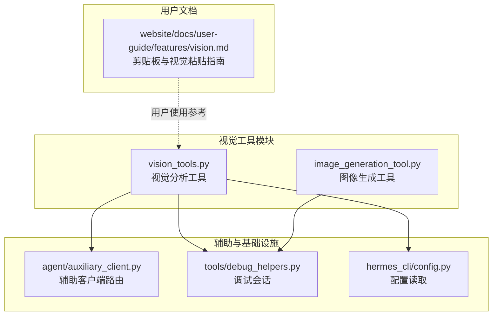
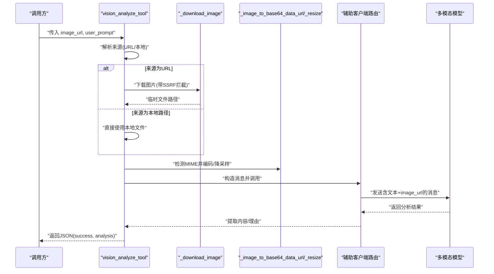
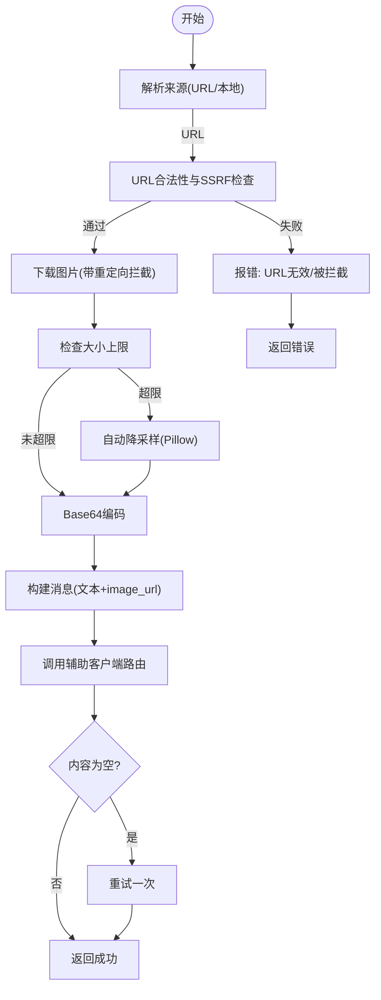
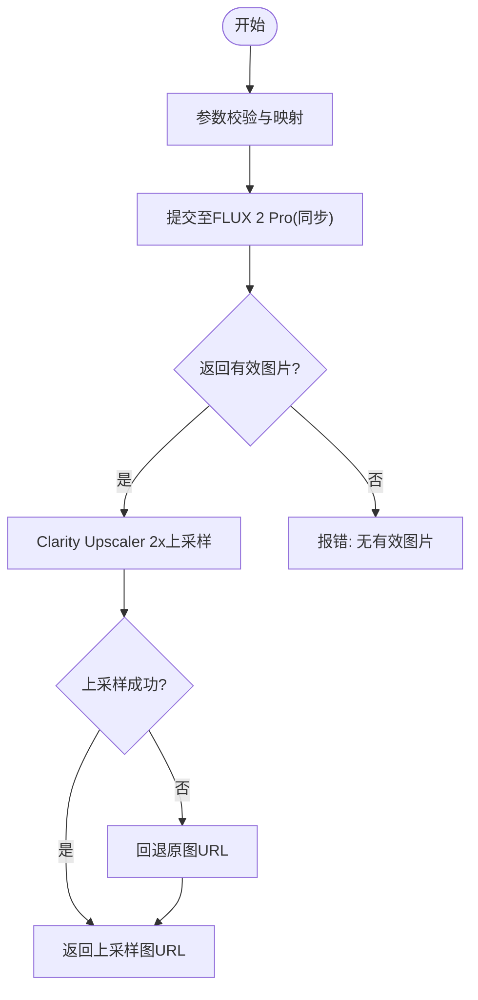
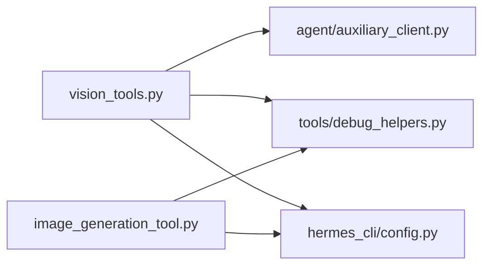

# 视觉工具

<cite>
**本文引用的文件**
- [tools/vision_tools.py](file://tools/vision_tools.py)
- [tools/image_generation_tool.py](file://tools/image_generation_tool.py)
- [agent/auxiliary_client.py](file://agent/auxiliary_client.py)
- [tools/debug_helpers.py](file://tools/debug_helpers.py)
- [website/docs/user-guide/features/vision.md](file://website/docs/user-guide/features/vision.md)
- [hermes_cli/config.py](file://hermes_cli/config.py)
- [tests/tools/test_vision_tools.py](file://tests/tools/test_vision_tools.py)
- [tests/tools/test_clipboard.py](file://tests/tools/test_clipboard.py)
</cite>

## 目录
1. [简介](#简介)
2. [项目结构](#项目结构)
3. [核心组件](#核心组件)
4. [架构总览](#架构总览)
5. [详细组件分析](#详细组件分析)
6. [依赖分析](#依赖分析)
7. [性能考量](#性能考量)
8. [故障排查指南](#故障排查指南)
9. [结论](#结论)
10. [附录](#附录)

## 简介
本文件面向Hermes Agent的视觉工具系统，围绕图像处理、计算机视觉与图像生成展开，系统化说明以下内容：
- 输入格式（URL/本地路径）、处理流程与输出规范
- 图像识别、OCR相关能力现状与建议
- 性能优化、内存管理与并发处理策略
- 配置项、质量控制与效果调优方法
- 错误处理、兼容性与最佳实践

## 项目结构
视觉工具主要由两部分组成：
- 视觉分析工具：支持从URL或本地路径加载图片，进行多模态分析并返回JSON结果
- 图像生成工具：基于FAL.ai FLUX 2 Pro模型生成图像，并自动使用Clarity Upscaler进行2倍上采样

**图表来源**
- [tools/vision_tools.py:1-799](file://tools/vision_tools.py#L1-L799)
- [tools/image_generation_tool.py:1-704](file://tools/image_generation_tool.py#L1-L704)
- [agent/auxiliary_client.py:1-200](file://agent/auxiliary_client.py#L1-L200)
- [tools/debug_helpers.py:1-106](file://tools/debug_helpers.py#L1-L106)
- [hermes_cli/config.py:1-200](file://hermes_cli/config.py#L1-L200)
- [website/docs/user-guide/features/vision.md:1-188](file://website/docs/user-guide/features/vision.md#L1-L188)

**章节来源**
- [tools/vision_tools.py:1-799](file://tools/vision_tools.py#L1-L799)
- [tools/image_generation_tool.py:1-704](file://tools/image_generation_tool.py#L1-L704)
- [agent/auxiliary_client.py:1-200](file://agent/auxiliary_client.py#L1-L200)
- [tools/debug_helpers.py:1-106](file://tools/debug_helpers.py#L1-L106)
- [hermes_cli/config.py:1-200](file://hermes_cli/config.py#L1-L200)
- [website/docs/user-guide/features/vision.md:1-188](file://website/docs/user-guide/features/vision.md#L1-L188)

## 核心组件
- 视觉分析工具（vision_analyze_tool）
  - 支持HTTP/HTTPS URL与本地文件路径；自动下载、SSRF防护、大小限制、MIME检测、Base64编码、自动重试与降采样
  - 通过辅助客户端路由调用多模态模型，统一错误分类与提示
  - 输出JSON，包含success、analysis等字段
- 图像生成工具（image_generate_tool）
  - 基于FAL.ai FLUX 2 Pro生成图像，参数校验与安全检查
  - 自动2倍上采样增强细节，失败时回退到原图
  - 输出JSON，包含success与image字段
- 调试与配置
  - DebugSession统一记录调用日志，按工具启用环境变量
  - 配置读取优先级：环境变量 > config.yaml > 默认值

**章节来源**
- [tools/vision_tools.py:405-668](file://tools/vision_tools.py#L405-L668)
- [tools/image_generation_tool.py:352-534](file://tools/image_generation_tool.py#L352-L534)
- [tools/debug_helpers.py:36-106](file://tools/debug_helpers.py#L36-L106)
- [hermes_cli/config.py:2663-2698](file://hermes_cli/config.py#L2663-L2698)

## 架构总览
视觉工具通过“输入解析—资源准备—编码传输—模型调用—结果回传”的链路完成端到端处理。关键特性包括：
- 安全性：URL验证、SSRF拦截、网站访问策略检查、文件大小上限
- 兼容性：多种图像格式、自动MIME推断、Base64数据URL封装
- 可靠性：指数回退重试、空内容二次尝试、尺寸超限自动降采样
- 可观测性：调试日志、会话追踪、错误分类提示

**图表来源**
- [tools/vision_tools.py:405-668](file://tools/vision_tools.py#L405-L668)
- [agent/auxiliary_client.py:17-28](file://agent/auxiliary_client.py#L17-L28)

## 详细组件分析

### 视觉分析工具（vision_analyze_tool）
- 输入格式
  - 支持HTTP/HTTPS URL与本地文件路径（含file://前缀）
  - 用户提示需预格式化，包含完整描述与具体问题
- 处理流程
  - URL校验与SSRF拦截（重定向链路再次校验）
  - 下载限制（Content-Length与实际字节上限）
  - MIME类型检测与格式校验
  - Base64数据URL构建；若过大则自动降采样（Pillow可选依赖）
  - 通过辅助客户端路由调用模型，支持超时与模型覆盖
  - 对空内容进行一次重试
- 输出规范
  - JSON字符串，包含success与analysis字段
  - 失败时包含error与可读提示
- 错误处理
  - 明确区分计费不足、模型不支持、请求非法、尺寸过大等场景
  - 统一包装为清晰的用户提示
- 并发与清理
  - 异步下载与事件钩子；仅删除临时文件，不清理缓存/本地文件
- 配置与调试
  - 下载超时：环境变量优先，其次config.yaml，最后默认值
  - 调试：开启后记录会话与调用明细

**图表来源**
- [tools/vision_tools.py:128-228](file://tools/vision_tools.py#L128-L228)
- [tools/vision_tools.py:299-403](file://tools/vision_tools.py#L299-L403)
- [tools/vision_tools.py:405-668](file://tools/vision_tools.py#L405-L668)

**章节来源**
- [tools/vision_tools.py:75-103](file://tools/vision_tools.py#L75-L103)
- [tools/vision_tools.py:128-228](file://tools/vision_tools.py#L128-L228)
- [tools/vision_tools.py:299-403](file://tools/vision_tools.py#L299-L403)
- [tools/vision_tools.py:405-668](file://tools/vision_tools.py#L405-L668)
- [tests/tools/test_vision_tools.py:174-206](file://tests/tools/test_vision_tools.py#L174-L206)
- [tests/tools/test_clipboard.py:782-864](file://tests/tools/test_clipboard.py#L782-L864)

### 图像生成工具（image_generate_tool）
- 输入参数
  - prompt、aspect_ratio（映射为image_size）、num_inference_steps、guidance_scale、num_images、output_format、seed
- 处理流程
  - 参数校验与映射（含自定义宽高校验）
  - 提交至FAL.ai FLUX 2 Pro（同步模式避免事件循环生命周期问题）
  - 成功后对首张图执行Clarity Upscaler 2倍上采样，失败则回退原图
- 输出规范
  - JSON字符串，包含success与image（首张上采样图URL）
- 安全与稳定性
  - 启用安全检查开关与容忍度
  - 同步客户端复用，避免全局缓存导致的事件循环问题

**图表来源**
- [tools/image_generation_tool.py:218-288](file://tools/image_generation_tool.py#L218-L288)
- [tools/image_generation_tool.py:352-534](file://tools/image_generation_tool.py#L352-L534)

**章节来源**
- [tools/image_generation_tool.py:218-288](file://tools/image_generation_tool.py#L218-L288)
- [tools/image_generation_tool.py:352-534](file://tools/image_generation_tool.py#L352-L534)

### OCR与视觉分析能力说明
- 当前视觉分析工具聚焦通用多模态理解，不包含专用OCR模型或训练脚本
- 若需OCR能力，可在外部集成（如DeepSeek-OCR）并在上层工作流中调用；本仓库未内置OCR工具

**章节来源**
- [skills/mlops/training/unsloth/references/llms-txt.md:10687-10784](file://skills/mlops/training/unsloth/references/llms-txt.md#L10687-L10784)

## 依赖分析
- 视觉分析工具依赖
  - 辅助客户端路由：统一多模态模型调用链路
  - HTTP下载：异步客户端、事件钩子、重试与SSRF拦截
  - 调试：DebugSession统一日志
  - 配置：环境变量与config.yaml读取
- 图像生成工具依赖
  - fal_client同步接口，避免事件循环生命周期问题
  - 管理网关（可选）以支持无密钥直连队列模式

**图表来源**
- [tools/vision_tools.py:40-42](file://tools/vision_tools.py#L40-L42)
- [agent/auxiliary_client.py:17-28](file://agent/auxiliary_client.py#L17-L28)
- [tools/debug_helpers.py:36-106](file://tools/debug_helpers.py#L36-L106)
- [hermes_cli/config.py:1-200](file://hermes_cli/config.py#L1-L200)
- [tools/image_generation_tool.py:39-42](file://tools/image_generation_tool.py#L39-L42)

**章节来源**
- [tools/vision_tools.py:40-42](file://tools/vision_tools.py#L40-L42)
- [agent/auxiliary_client.py:17-28](file://agent/auxiliary_client.py#L17-L28)
- [tools/debug_helpers.py:36-106](file://tools/debug_helpers.py#L36-L106)
- [hermes_cli/config.py:1-200](file://hermes_cli/config.py#L1-L200)
- [tools/image_generation_tool.py:39-42](file://tools/image_generation_tool.py#L39-L42)

## 性能考量
- 下载与网络
  - 下载超时可配置，默认值来自环境变量或config.yaml；过小可能导致频繁超时
  - 重定向链路二次校验，防止SSRF；CDN重定向场景需确保最终URL仍受控
- 编码与尺寸
  - Base64扩增约4/3，头部开销；超过20MB硬上限时自动降采样至5MB目标
  - Pillow降采样采用等比缩放与JPEG质量阶梯，兼顾体积与质量
- 模型调用
  - 读超时来自config.yaml（默认120s），本地模型可能更慢
  - 尺寸超限自动重试一次降采样版本
- 生成侧
  - 同步模式避免事件循环问题；上采样为额外开销，建议在需要高清输出时启用
- 内存与磁盘
  - 临时文件仅在URL来源时创建并清理；本地/缓存文件不删除
  - 严格的内容长度与文件大小上限，防止OOM

**章节来源**
- [tools/vision_tools.py:51-68](file://tools/vision_tools.py#L51-L68)
- [tools/vision_tools.py:280-287](file://tools/vision_tools.py#L280-L287)
- [tools/vision_tools.py:299-403](file://tools/vision_tools.py#L299-L403)
- [tools/vision_tools.py:555-570](file://tools/vision_tools.py#L555-L570)
- [tools/image_generation_tool.py:321-350](file://tools/image_generation_tool.py#L321-L350)

## 故障排查指南
- 常见错误与定位
  - 计费不足/支付限制：明确提示充值或绑定账户
  - 模型不支持视觉或多模态：提示更换模型或服务端支持
  - 请求非法/图像过大：建议压缩或改用较小JPEG/PNG
  - 下载失败/超时：检查网络、URL有效性、代理与重定向链路
- 调试与日志
  - 开启对应工具的DEBUG环境变量，查看会话ID与日志文件位置
  - 使用get_debug_session_info()获取当前调试会话摘要
- 剪贴板与图像粘贴
  - 不同平台的粘贴方式与可用性不同，详见用户文档
  - 远程/SSH会话下剪贴板不可用，可通过上传文件或使用URL

**章节来源**
- [tools/vision_tools.py:620-668](file://tools/vision_tools.py#L620-L668)
- [tools/debug_helpers.py:91-106](file://tools/debug_helpers.py#L91-L106)
- [website/docs/user-guide/features/vision.md:60-158](file://website/docs/user-guide/features/vision.md#L60-L158)

## 结论
Hermes视觉工具体系以“安全、可靠、可观测”为核心设计原则：
- 视觉分析工具提供通用多模态理解能力，具备完善的输入校验、尺寸控制与错误分类
- 图像生成工具提供高质量生成与上采样能力，兼顾稳定性与易用性
- 通过统一的辅助客户端路由与调试机制，便于扩展与运维

## 附录

### 配置与环境变量速查
- 视觉分析
  - HERMES_VISION_DOWNLOAD_TIMEOUT：下载超时（秒）
  - VISION_TOOLS_DEBUG：启用调试日志
  - AUXILIARY_VISION_MODEL：指定视觉模型
  - config.yaml auxiliary.vision.timeout：模型调用读超时
  - config.yaml auxiliary.vision.download_timeout：下载超时
- 图像生成
  - FAL_KEY：FAL.ai API密钥
  - IMAGE_TOOLS_DEBUG：启用调试日志
  - managed_nous_tools_enabled：在无密钥时使用管理网关
- 剪贴板与图像粘贴
  - 平台差异与粘贴方式参见用户文档

**章节来源**
- [tools/vision_tools.py:51-68](file://tools/vision_tools.py#L51-L68)
- [tools/vision_tools.py:555-570](file://tools/vision_tools.py#L555-L570)
- [tools/image_generation_tool.py:84](file://tools/image_generation_tool.py#L84)
- [hermes_cli/config.py:2663-2698](file://hermes_cli/config.py#L2663-L2698)
- [website/docs/user-guide/features/vision.md:60-158](file://website/docs/user-guide/features/vision.md#L60-L158)