# 通信工具

<cite>
**本文引用的文件**
- [gateway/__init__.py](file://gateway/__init__.py)
- [gateway/config.py](file://gateway/config.py)
- [gateway/platforms/base.py](file://gateway/platforms/base.py)
- [gateway/platforms/telegram.py](file://gateway/platforms/telegram.py)
- [gateway/platforms/discord.py](file://gateway/platforms/discord.py)
- [gateway/platforms/whatsapp.py](file://gateway/platforms/whatsapp.py)
- [gateway/session.py](file://gateway/session.py)
- [gateway/delivery.py](file://gateway/delivery.py)
- [gateway/run.py](file://gateway/run.py)
- [tests/gateway/test_feishu.py](file://tests/gateway/test_feishu.py)
- [tests/gateway/test_retry_replacement.py](file://tests/gateway/test_retry_replacement.py)
- [tests/gateway/test_unauthorized_dm_behavior.py](file://tests/gateway/test_unauthorized_dm_behavior.py)
- [website/docs/user-guide/messaging/weixin.md](file://website/docs/user-guide/messaging/weixin.md)
</cite>

## 目录
1. [简介](#简介)
2. [项目结构](#项目结构)
3. [核心组件](#核心组件)
4. [架构总览](#架构总览)
5. [详细组件分析](#详细组件分析)
6. [依赖分析](#依赖分析)
7. [性能考量](#性能考量)
8. [故障排除指南](#故障排除指南)
9. [结论](#结论)
10. [附录](#附录)

## 简介
本文件系统性阐述 Hermes Agent 的“通信工具”体系：消息发送、设备控制与远程通信的实现机制；协议适配、认证与授权、连接管理；消息队列与异步通信、错误重试策略；设备集成、状态同步与事件通知；以及配置方法、性能调优与故障排除。目标是帮助开发者与运维人员快速理解并高效使用该系统。

## 项目结构
通信工具围绕“网关（Gateway）”组织，统一接入多平台（Telegram、Discord、WhatsApp 等），通过平台适配器抽象不同协议差异，结合会话管理、投递路由与运行时生命周期管理，形成端到端的消息处理链路。

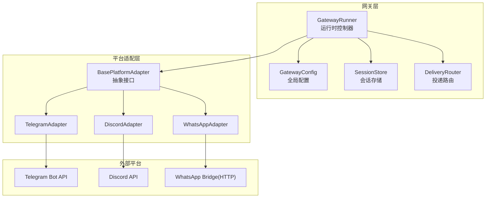

图示来源
- [gateway/run.py:512-635](file://gateway/run.py#L512-L635)
- [gateway/config.py:221-417](file://gateway/config.py#L221-L417)
- [gateway/platforms/base.py:779-800](file://gateway/platforms/base.py#L779-L800)
- [gateway/platforms/telegram.py:114-138](file://gateway/platforms/telegram.py#L114-L138)
- [gateway/platforms/discord.py:114-138](file://gateway/platforms/discord.py#L114-L138)
- [gateway/platforms/whatsapp.py:103-147](file://gateway/platforms/whatsapp.py#L103-L147)

章节来源
- [gateway/__init__.py:1-36](file://gateway/__init__.py#L1-L36)
- [gateway/config.py:1-1126](file://gateway/config.py#L1-L1126)
- [gateway/platforms/base.py:1-800](file://gateway/platforms/base.py#L1-L800)
- [gateway/session.py:1-800](file://gateway/session.py#L1-L800)
- [gateway/delivery.py:1-257](file://gateway/delivery.py#L1-L257)
- [gateway/run.py:1-800](file://gateway/run.py#L1-L800)

## 核心组件
- 配置与发现
  - GatewayConfig：集中管理平台启用、令牌、Home 渠道、会话重置策略、流式传输等。
  - 平台配置 PlatformConfig：每平台独立配置，含 token/api_key、回复线程模式、扩展参数等。
- 适配器与协议
  - BasePlatformAdapter：定义统一接口（connect/send/disconnect）、消息事件模型、发送结果、媒体缓存与长度限制等。
  - TelegramAdapter/DiscordAdapter/WhatsAppAdapter：分别对接 Telegram、Discord、WhatsApp 桥接。
- 会话与上下文
  - SessionStore/SessionSource/SessionContext：会话键生成、持久化、重置策略、动态系统提示注入。
- 投递与路由
  - DeliveryRouter/DeliveryTarget：解析目标（origin/local/平台:chat_id/thread_id），路由到对应适配器或本地文件。
- 运行时生命周期
  - GatewayRunner：启动/停止、适配器管理、后台任务、重启与退出、钩子系统、语音模式等。

章节来源
- [gateway/config.py:48-417](file://gateway/config.py#L48-L417)
- [gateway/platforms/base.py:634-727](file://gateway/platforms/base.py#L634-L727)
- [gateway/platforms/telegram.py:114-164](file://gateway/platforms/telegram.py#L114-L164)
- [gateway/platforms/discord.py:114-138](file://gateway/platforms/discord.py#L114-L138)
- [gateway/platforms/whatsapp.py:103-147](file://gateway/platforms/whatsapp.py#L103-L147)
- [gateway/session.py:66-325](file://gateway/session.py#L66-L325)
- [gateway/delivery.py:28-167](file://gateway/delivery.py#L28-L167)
- [gateway/run.py:512-635](file://gateway/run.py#L512-L635)

## 架构总览
下图展示从“消息输入”到“响应输出”的全链路：平台适配器接收消息，经运行时处理后进入会话管理与投递路由，最终通过适配器发送回平台或保存至本地。

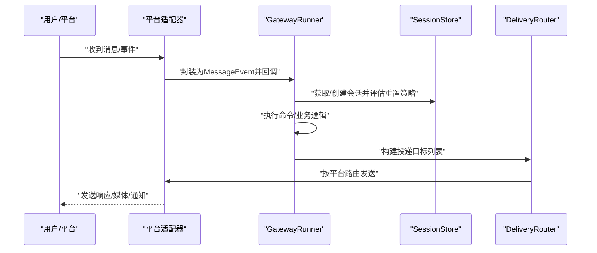

图示来源
- [gateway/platforms/base.py:655-717](file://gateway/platforms/base.py#L655-L717)
- [gateway/run.py:512-635](file://gateway/run.py#L512-L635)
- [gateway/session.py:495-768](file://gateway/session.py#L495-L768)
- [gateway/delivery.py:107-167](file://gateway/delivery.py#L107-L167)

## 详细组件分析

### 基础适配器与消息模型
- 统一接口
  - connect/disconnect：建立/断开平台连接。
  - send：发送消息，返回 SendResult（success/message_id/error/retryable）。
  - handle_message：入口回调，触发消息处理流程。
- 消息与发送结果
  - MessageEvent：标准化消息载体，包含文本、类型、来源、媒体、回复上下文、时间戳等。
  - SendResult：标准化发送结果，支持 retryable 标记以驱动自动重试。
- 媒体与长度限制
  - 提供图片/音频/文档缓存工具，避免平台临时链接失效。
  - 不同平台消息长度限制（如 Telegram UTF-16 单位），提供截断与前缀安全计算。
- 错误与重试
  - 定义可重试错误模式（连接类错误），在 send 失败时自动重试并记录日志。
  - 支持幂等场景下的“立即重试”与非幂等场景的“降级回退”。

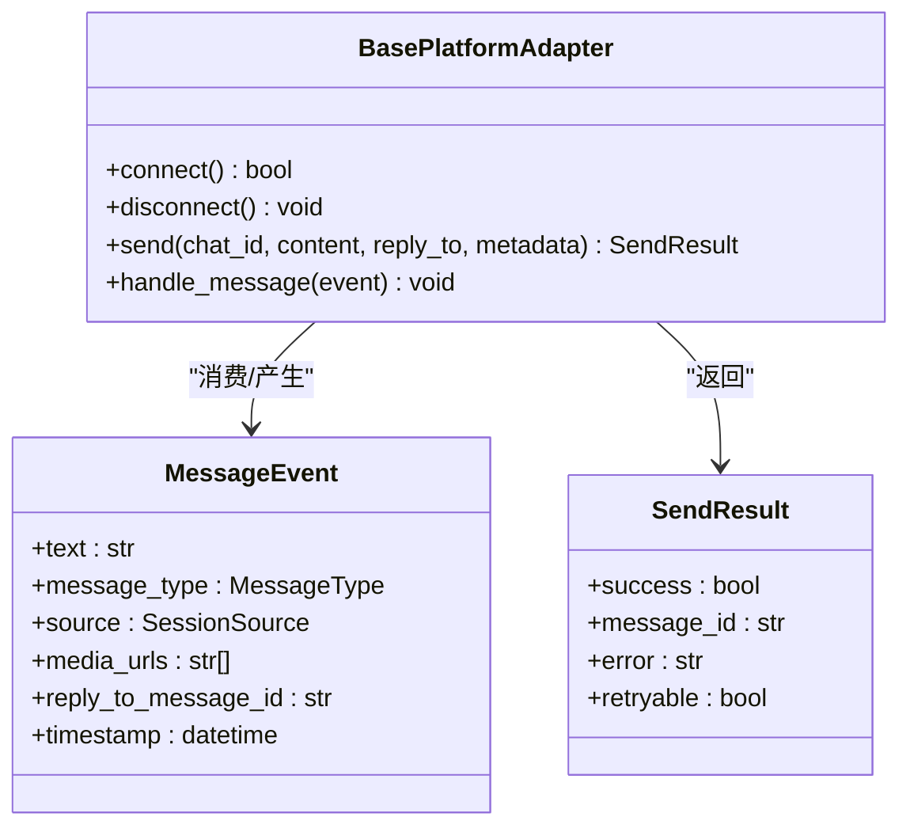

图示来源
- [gateway/platforms/base.py:634-727](file://gateway/platforms/base.py#L634-L727)
- [gateway/platforms/base.py:655-717](file://gateway/platforms/base.py#L655-L717)

章节来源
- [gateway/platforms/base.py:1-800](file://gateway/platforms/base.py#L1-L800)

### 平台适配器：Telegram
- 能力要点
  - 使用 python-telegram-bot，支持论坛主题（thread_id）、MarkdownV2 转义、媒体组合并、长文本分片聚合。
  - 支持回复线程模式（off/first/all），可配置回复到原始消息。
  - 内置网络错误与轮询冲突的自恢复逻辑。
- 关键实现
  - MAX_MESSAGE_LENGTH 与 _SPLIT_THRESHOLD 控制长文本处理。
  - _pending_photo_batches/_pending_text_batches 缓冲批量/分片消息，避免重复处理与自我中断。
  - _media_batch_delay_seconds/_text_batch_delay_seconds 可通过环境变量调节。

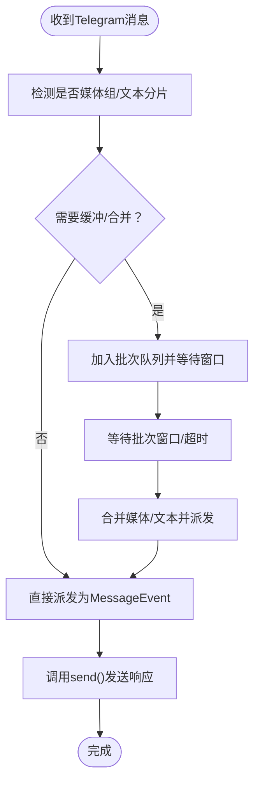

图示来源
- [gateway/platforms/telegram.py:114-164](file://gateway/platforms/telegram.py#L114-L164)

章节来源
- [gateway/platforms/telegram.py:1-200](file://gateway/platforms/telegram.py#L1-L200)

### 平台适配器：Discord
- 能力要点
  - 使用 discord.py，支持服务器/频道/私聊、线程归档、语音接收（E2EE 解密、Opus 解码、静音检测）。
  - 提供线程参与追踪与去重工具，支持消息去重与线程归档分钟数校验。
- 关键实现
  - VoiceReceiver：捕获 RTP 包，解密并解码，按用户缓冲，静音阈值触发交付。
  - ThreadParticipationTracker：跟踪线程参与度，避免重复处理。

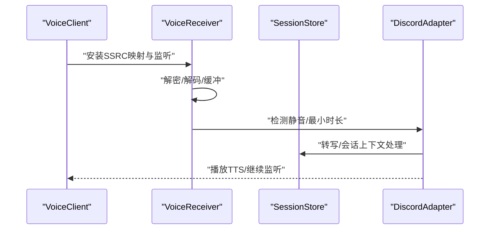

图示来源
- [gateway/platforms/discord.py:85-200](file://gateway/platforms/discord.py#L85-L200)
- [gateway/platforms/discord.py:1-200](file://gateway/platforms/discord.py#L1-L200)

章节来源
- [gateway/platforms/discord.py:1-200](file://gateway/platforms/discord.py#L1-L200)

### 平台适配器：WhatsApp
- 能力要点
  - 通过 Node.js 桥接（whatsapp-web.js/Baileys/Business API）实现 HTTP/IPC 通信。
  - 支持提及模式、自由回复聊天白名单、提及模式正则编译。
- 关键实现
  - 默认桥接脚本路径与会话目录，支持自定义端口与脚本。
  - 消息队列与轮询任务，桥接进程日志与端口占用清理。

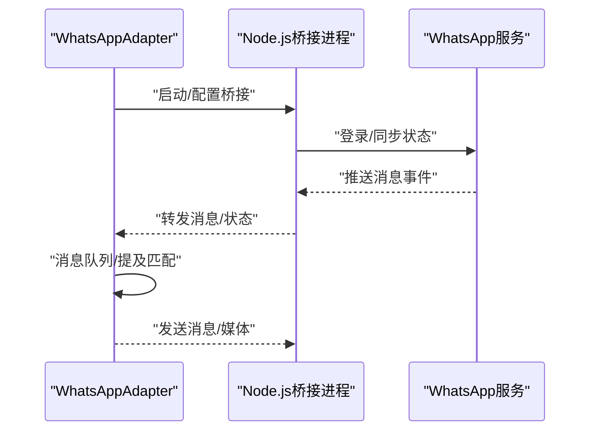

图示来源
- [gateway/platforms/whatsapp.py:103-147](file://gateway/platforms/whatsapp.py#L103-L147)

章节来源
- [gateway/platforms/whatsapp.py:1-200](file://gateway/platforms/whatsapp.py#L1-L200)

### 会话管理与上下文注入
- 会话键生成规则
  - DM：优先 chat_id，其次 thread_id，再其次按平台维度共享。
  - 群组/频道：chat_id + thread_id，必要时按用户隔离（可配置）。
- 重置策略
  - 支持“每日边界/空闲超时/两者皆有/不重置”，并支持自动通知。
- 动态系统提示
  - build_session_context_prompt 注入来源平台、会话类型、Home 渠道、交付选项等上下文信息，支持 PII 脱敏。

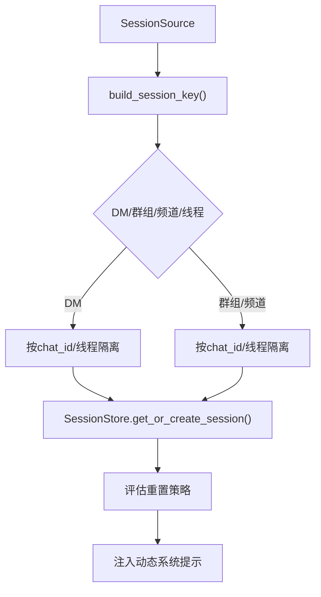

图示来源
- [gateway/session.py:436-492](file://gateway/session.py#L436-L492)
- [gateway/session.py:579-660](file://gateway/session.py#L579-L660)
- [gateway/session.py:187-325](file://gateway/session.py#L187-L325)

章节来源
- [gateway/session.py:1-800](file://gateway/session.py#L1-L800)

### 投递路由与多目标发送
- 目标解析
  - origin/local/平台名/平台:chat_id[/thread_id]，支持显式与隐式目标。
- 本地落盘
  - 将输出保存为 Markdown 文件，包含作业元数据与时间戳。
- 平台投递
  - 截断超长输出，保留可见部分并指向完整文件；线程 ID 透传给适配器。

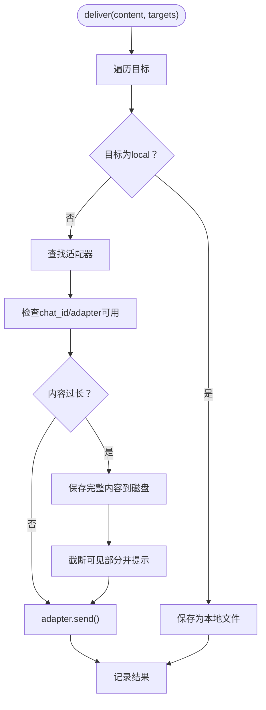

图示来源
- [gateway/delivery.py:107-167](file://gateway/delivery.py#L107-L167)
- [gateway/delivery.py:169-252](file://gateway/delivery.py#L169-L252)

章节来源
- [gateway/delivery.py:1-257](file://gateway/delivery.py#L1-L257)

### 运行时生命周期与钩子
- 启动阶段
  - 加载配置、初始化会话数据库、构建投递路由、注册平台适配器。
  - 启动后台任务（内存刷新、会话过期观察者、钩子系统）。
- 连接与重连
  - 记录失败平台与重试时间，支持后台重连与致命错误处理。
- 退出与重启
  - 支持优雅停机、重启排空、服务重启退出码等。

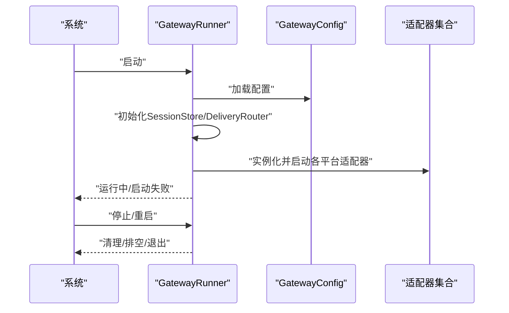

图示来源
- [gateway/run.py:512-635](file://gateway/run.py#L512-L635)
- [gateway/run.py:1667-1697](file://gateway/run.py#L1667-L1697)

章节来源
- [gateway/run.py:1-800](file://gateway/run.py#L1-L800)

## 依赖分析
- 组件耦合
  - GatewayRunner 对适配器、会话存储、投递路由存在强依赖；适配器对平台库强依赖。
  - SessionStore 与 SessionDB（SQLite）耦合，回退到 JSONL 存储。
- 外部依赖
  - Telegram：python-telegram-bot
  - Discord：discord.py
  - WhatsApp：Node.js 桥接（whatsapp-web.js/Baileys）
  - 网络代理：aiohttp/aiohttp_socks（可选）

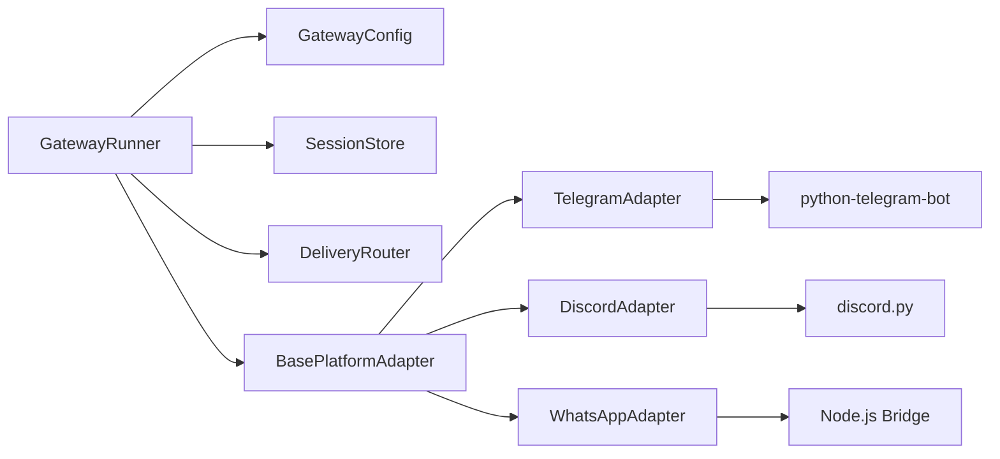

图示来源
- [gateway/run.py:512-635](file://gateway/run.py#L512-L635)
- [gateway/platforms/telegram.py:19-56](file://gateway/platforms/telegram.py#L19-L56)
- [gateway/platforms/discord.py:29-43](file://gateway/platforms/discord.py#L29-L43)
- [gateway/platforms/whatsapp.py:84-101](file://gateway/platforms/whatsapp.py#L84-L101)

章节来源
- [gateway/platforms/telegram.py:1-200](file://gateway/platforms/telegram.py#L1-L200)
- [gateway/platforms/discord.py:1-200](file://gateway/platforms/discord.py#L1-L200)
- [gateway/platforms/whatsapp.py:1-200](file://gateway/platforms/whatsapp.py#L1-L200)

## 性能考量
- 异步与并发
  - 适配器内部广泛使用 asyncio，批处理与缓冲窗口减少重复处理与自我中断。
  - Telegram 文本/媒体批处理延迟可通过环境变量调节，平衡吞吐与实时性。
- 媒体缓存
  - 图片/音频/文档缓存避免平台临时链接失效，降低重复下载成本。
- 会话与提示注入
  - 动态系统提示仅注入必要上下文，避免冗余 token 消耗。
- 投递限流
  - 平台侧消息长度限制与截断策略，防止超限导致失败重试风暴。

章节来源
- [gateway/platforms/telegram.py:146-151](file://gateway/platforms/telegram.py#L146-L151)
- [gateway/platforms/base.py:315-453](file://gateway/platforms/base.py#L315-L453)
- [gateway/delivery.py:21-252](file://gateway/delivery.py#L21-L252)

## 故障排除指南
- 发送失败与重试
  - 可重试错误（连接类）自动指数退避重试，超过最大次数后记录失败并提示用户。
  - 幂等场景可立即重试，非幂等场景避免重复投递。
- 典型场景验证
  - Feishu：首次临时失败后重试成功，确定性错误（4xx）不再重试。
  - 重试替换：/retry 命令正确回放原始问题并更新对话历史。
  - 未授权 DM：默认触发配对流程，可配置忽略策略。
- 平台特定行为
  - 微信：瞬时错误重试、多次错误退避、会话过期暂停、消息去重与锁机制。

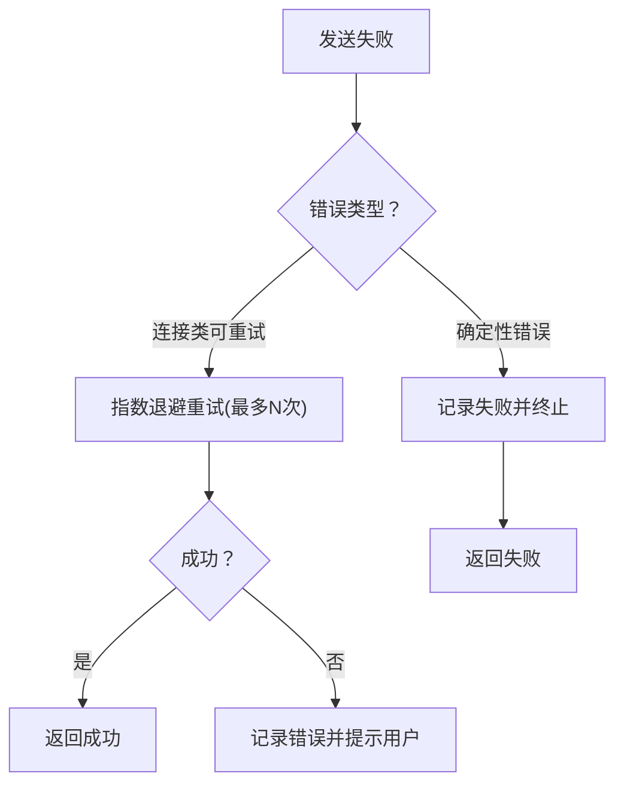

图示来源
- [gateway/platforms/base.py:1423-1448](file://gateway/platforms/base.py#L1423-L1448)
- [tests/gateway/test_feishu.py:1935-2009](file://tests/gateway/test_feishu.py#L1935-L2009)
- [tests/gateway/test_retry_replacement.py:38-74](file://tests/gateway/test_retry_replacement.py#L38-L74)
- [tests/gateway/test_unauthorized_dm_behavior.py:133-195](file://tests/gateway/test_unauthorized_dm_behavior.py#L133-L195)
- [website/docs/user-guide/messaging/weixin.md:247-264](file://website/docs/user-guide/messaging/weixin.md#L247-L264)

章节来源
- [gateway/platforms/base.py:755-772](file://gateway/platforms/base.py#L755-L772)
- [tests/gateway/test_feishu.py:1935-2009](file://tests/gateway/test_feishu.py#L1935-L2009)
- [tests/gateway/test_retry_replacement.py:38-74](file://tests/gateway/test_retry_replacement.py#L38-L74)
- [tests/gateway/test_unauthorized_dm_behavior.py:133-195](file://tests/gateway/test_unauthorized_dm_behavior.py#L133-L195)
- [website/docs/user-guide/messaging/weixin.md:247-264](file://website/docs/user-guide/messaging/weixin.md#L247-L264)

## 结论
Hermes Agent 的通信工具以“统一适配器 + 会话上下文 + 投递路由 + 运行时生命周期”为核心，实现了跨平台、可扩展、可观测且具备健壮重试与安全控制的消息系统。通过合理的配置与调优，可在多平台环境中稳定地完成消息收发、设备控制与远程通信任务。

## 附录

### 配置方法与最佳实践
- 全局配置
  - 平台启用与令牌：在 GatewayConfig 中设置各平台 token/api_key/extra。
  - 会话重置策略：按平台/类型定制，支持每日边界与空闲超时。
  - 流式传输：针对 Telegram 等平台的增量编辑策略。
- 平台配置
  - Telegram：回复线程模式、备用 IP、DM 主题映射。
  - Discord：线程归档分钟数、语音接收、消息去重与线程追踪。
  - WhatsApp：桥接脚本、端口、会话目录、提及模式与自由回复白名单。
- 安全与合规
  - 未授权 DM 行为：默认配对，可改为忽略。
  - PII 脱敏：动态系统提示中对敏感标识进行哈希脱敏。
  - SSRF 保护：媒体下载严格校验 URL 安全性。

章节来源
- [gateway/config.py:48-417](file://gateway/config.py#L48-L417)
- [gateway/platforms/telegram.py:165-171](file://gateway/platforms/telegram.py#L165-L171)
- [gateway/platforms/discord.py:63-77](file://gateway/platforms/discord.py#L63-L77)
- [gateway/platforms/whatsapp.py:129-147](file://gateway/platforms/whatsapp.py#L129-L147)
- [gateway/session.py:187-325](file://gateway/session.py#L187-L325)