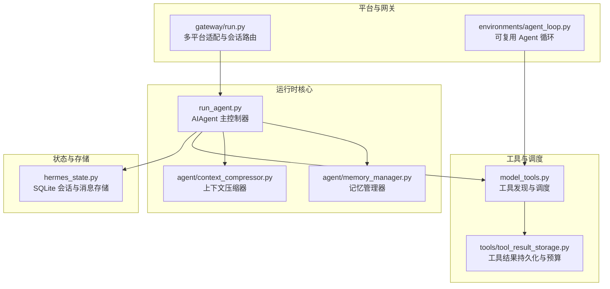
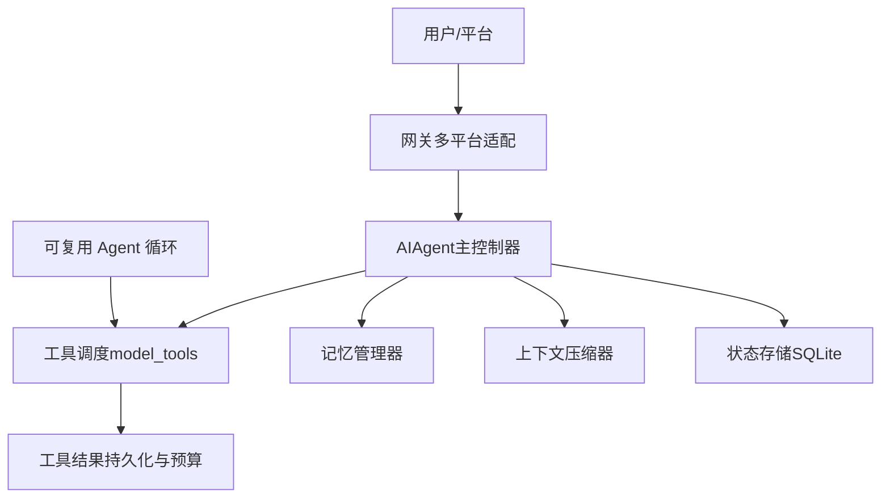
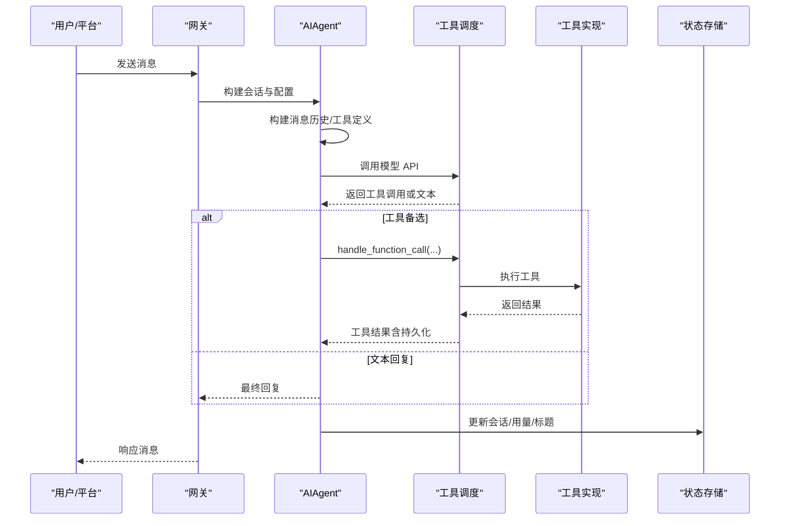
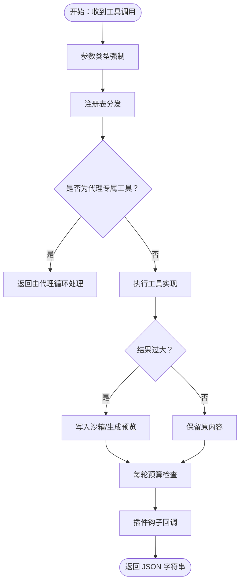
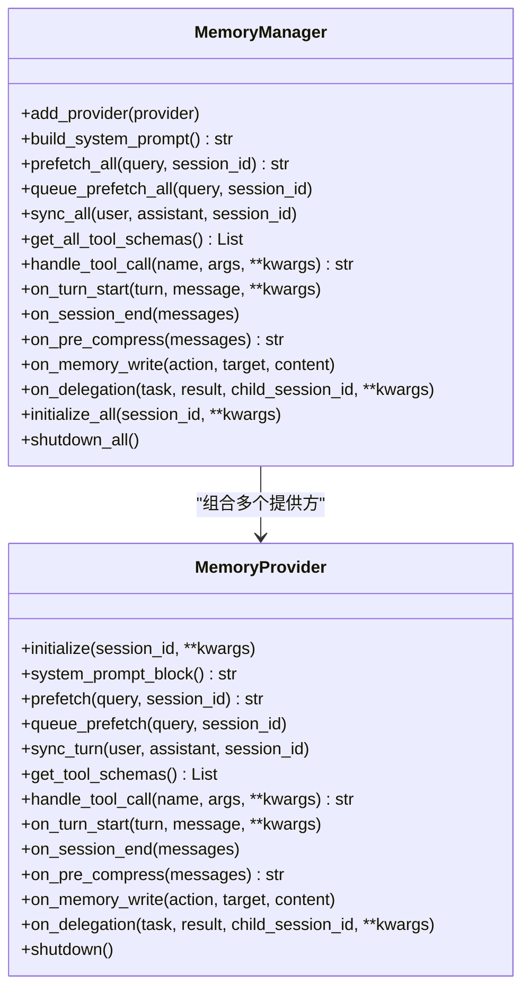
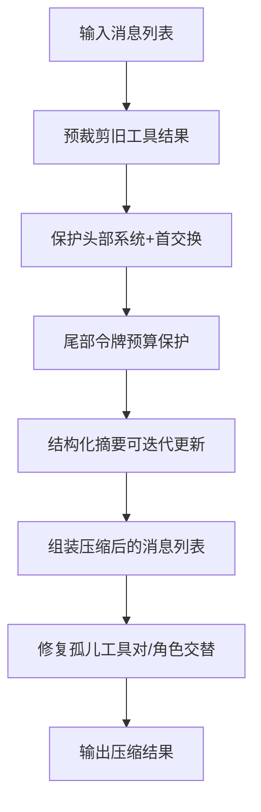
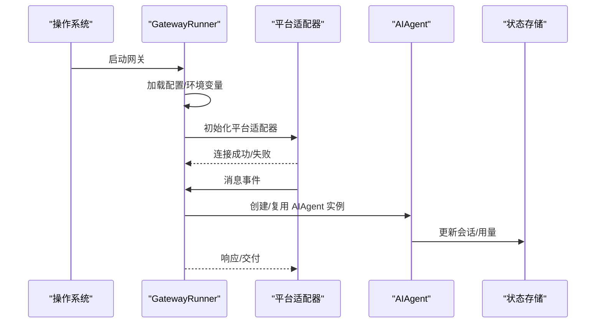
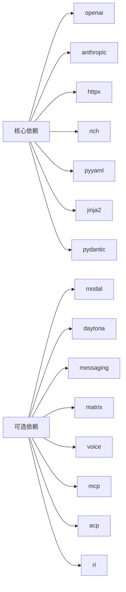

# 核心架构

<cite>
**本文引用的文件**
- [run_agent.py](file://run_agent.py)
- [agent/__init__.py](file://agent/__init__.py)
- [environments/agent_loop.py](file://environments/agent_loop.py)
- [gateway/run.py](file://gateway/run.py)
- [hermes_state.py](file://hermes_state.py)
- [agent/memory_manager.py](file://agent/memory_manager.py)
- [agent/context_compressor.py](file://agent/context_compressor.py)
- [model_tools.py](file://model_tools.py)
- [tools/tool_result_storage.py](file://tools/tool_result_storage.py)
- [pyproject.toml](file://pyproject.toml)
</cite>

## 目录
1. [引言](#引言)
2. [项目结构](#项目结构)
3. [核心组件](#核心组件)
4. [架构总览](#架构总览)
5. [详细组件分析](#详细组件分析)
6. [依赖分析](#依赖分析)
7. [性能考量](#性能考量)
8. [故障排查指南](#故障排查指南)
9. [结论](#结论)
10. [附录](#附录)

## 引言
本文件面向架构师与高级开发者，系统化阐述 Hermes Agent 的核心架构：高层设计、架构模式与组件边界；深入解析代理循环、对话管理、工具调用与记忆管理的交互关系与数据流；总结技术决策、权衡与约束；给出基础设施需求、可扩展性与部署拓扑建议；覆盖安全、监控与灾难恢复等横切关注点；并记录技术栈、第三方依赖与版本兼容性。

## 项目结构
Hermes Agent 采用“分层+模块化”的组织方式：
- 运行时核心：run_agent.py 提供 AIAgent 主控制器，负责对话循环、工具调度、上下文压缩、内存与状态持久化等。
- 能力子系统：agent/ 子包抽取了记忆管理、上下文压缩、提示词构建、定价与用量统计、错误分类等内核能力。
- 工具体系：tools/ 模块化注册工具，model_tools.py 作为统一调度入口；工具结果持久化与预算控制在 tools/tool_result_storage.py。
- 网关与平台：gateway/ 提供多平台适配（Telegram、Discord、Slack 等）与会话管理；environments/ 提供可复用的 Agent 循环环境。
- 状态存储：hermes_state.py 基于 SQLite 的会话与消息持久化，支持全文检索与并发写入优化。
- 配置与依赖：pyproject.toml 定义核心依赖、可选生态与脚本入口。

图表来源
- [run_agent.py](file://run_agent.py)
- [agent/memory_manager.py](file://agent/memory_manager.py)
- [agent/context_compressor.py](file://agent/context_compressor.py)
- [model_tools.py](file://model_tools.py)
- [tools/tool_result_storage.py](file://tools/tool_result_storage.py)
- [gateway/run.py](file://gateway/run.py)
- [environments/agent_loop.py](file://environments/agent_loop.py)
- [hermes_state.py](file://hermes_state.py)

章节来源
- [run_agent.py](file://run_agent.py)
- [agent/__init__.py](file://agent/__init__.py)
- [pyproject.toml](file://pyproject.toml)

## 核心组件
- AIAgent（run_agent.py）
  - 负责一次完整对话的生命周期：初始化、参数解析、模型选择、工具定义注入、迭代对话、上下文压缩、记忆同步、状态持久化与轨迹保存。
  - 支持多种 API 模式（Chat Completions、Codex Responses、Anthropic Messages），自动探测与切换。
  - 内置迭代预算、速率限制跟踪、超时与中断机制、安全输出写入器等。
- 记忆管理器（agent/memory_manager.py）
  - 统一编排内置与外部插件记忆提供方，按需预取、同步、生成系统提示、路由工具调用。
- 上下文压缩器（agent/context_compressor.py）
  - 基于辅助模型进行结构化摘要，保护头尾上下文，对工具结果进行廉价裁剪，支持聚焦主题压缩与迭代更新。
- 工具系统（model_tools.py + tools/*）
  - 工具发现与动态 schema 构建，类型强制与参数校正，异步桥接与线程池事件循环管理，MCP/插件工具发现。
  - 工具结果持久化与每轮预算控制，避免上下文溢出。
- 网关（gateway/run.py）
  - 多平台适配、会话缓存、权限与配对、重启与停机策略、语音模式、钩子系统、进程注册与安全扫描集成。
- 可复用 Agent 循环（environments/agent_loop.py）
  - 与任意兼容 OpenAI 规范的服务器协作，统一处理工具调用、回退解析、线程池执行与预算控制。
- 状态存储（hermes_state.py）
  - SQLite + WAL + FTS5，支持并发读写、全文检索、会话链路拆分与标题管理。

章节来源
- [run_agent.py](file://run_agent.py)
- [agent/memory_manager.py](file://agent/memory_manager.py)
- [agent/context_compressor.py](file://agent/context_compressor.py)
- [model_tools.py](file://model_tools.py)
- [tools/tool_result_storage.py](file://tools/tool_result_storage.py)
- [gateway/run.py](file://gateway/run.py)
- [environments/agent_loop.py](file://environments/agent_loop.py)
- [hermes_state.py](file://hermes_state.py)

## 架构总览
Hermes Agent 采用“主控制器 + 子系统 + 工具调度 + 平台网关 + 状态存储”的分层架构。AIAgent 作为主控制器贯穿一次对话的全生命周期；记忆与上下文压缩作为横切能力被多处复用；工具系统通过统一调度层对接内部与外部工具；网关负责平台接入与会话治理；状态存储提供可靠的历史与指标持久化。

图表来源
- [gateway/run.py](file://gateway/run.py)
- [run_agent.py](file://run_agent.py)
- [model_tools.py](file://model_tools.py)
- [tools/tool_result_storage.py](file://tools/tool_result_storage.py)
- [agent/memory_manager.py](file://agent/memory_manager.py)
- [agent/context_compressor.py](file://agent/context_compressor.py)
- [hermes_state.py](file://hermes_state.py)
- [environments/agent_loop.py](file://environments/agent_loop.py)

## 详细组件分析

### 代理循环与对话管理
- 流程要点
  - 初始化阶段：解析 base_url/api_key/provider/api_mode，标准化模型名，预热元数据缓存，设置日志与静默模式。
  - 对话阶段：构建消息历史，注入工具定义，调用模型 API；若返回工具调用则调度执行；否则结束回合。
  - 工具执行：统一通过 handle_function_call 分发，支持类型强制、参数校正、插件钩子、线程池与事件循环桥接。
  - 结果处理：工具结果持久化与预算控制，上下文压力检测与警告，迭代预算与中断机制。
  - 结束阶段：保存轨迹、更新计费与用量、刷新内存与会话标题、关闭资源。
- 关键机制
  - 迭代预算：线程安全计数器，支持父子代理独立预算与退款。
  - 并发工具批处理：基于工具集合与路径隔离规则的安全并行。
  - 输出安全：管道异常捕获、代理字符替换、ASCII 回退清理。
  - 上下文压力：分级阈值预警，避免过早放弃复杂任务。
  - 超时与中断：活动追踪、超时通知、优雅中断传播至子代理。

图表来源
- [run_agent.py](file://run_agent.py)
- [model_tools.py](file://model_tools.py)
- [tools/tool_result_storage.py](file://tools/tool_result_storage.py)
- [gateway/run.py](file://gateway/run.py)
- [hermes_state.py](file://hermes_state.py)

章节来源
- [run_agent.py](file://run_agent.py)
- [model_tools.py](file://model_tools.py)
- [tools/tool_result_storage.py](file://tools/tool_result_storage.py)
- [gateway/run.py](file://gateway/run.py)

### 工具调用与调度
- 工具发现与过滤
  - 通过工具集（toolset）启用/禁用工具，动态构建 schema，屏蔽不可用工具描述中的交叉引用。
- 类型强制与参数校正
  - 将字符串类型的数字/布尔转换为期望类型，提升模型输出的可用性。
- 异步桥接与线程池
  - 为不同线程维护长期事件循环，避免“事件循环已关闭”问题；为需要 asyncio.run() 的后端提供独立线程池。
- 结果持久化与预算
  - 单工具阈值持久化、每轮聚合预算控制、Herderoc 写盘与预览拼装，确保大结果不溢出上下文。
- 插件与 MCP
  - 插件与 MCP 工具发现，统一注册到工具注册表，参与同一调度流程。

图表来源
- [model_tools.py](file://model_tools.py)
- [tools/tool_result_storage.py](file://tools/tool_result_storage.py)

章节来源
- [model_tools.py](file://model_tools.py)
- [tools/tool_result_storage.py](file://tools/tool_result_storage.py)

### 记忆管理与系统提示
- 注册与路由
  - 内置提供方优先注册，最多允许一个外部提供方；按工具名路由到对应提供方。
- 生命周期钩子
  - 预取/队列预取、回合同步、会话结束、压缩前汇总、委托完成通知、写入外部提供方。
- 系统提示与上下文围栏
  - 合并各提供方系统提示块；对召回上下文使用围栏标签，避免模型误判为用户输入。

图表来源
- [agent/memory_manager.py](file://agent/memory_manager.py)

章节来源
- [agent/memory_manager.py](file://agent/memory_manager.py)

### 上下文压缩与摘要
- 压缩策略
  - 先行裁剪旧工具结果（廉价预处理）、保护头尾（系统提示+首尾若干轮）、基于令牌预算的尾部保护、结构化摘要与迭代更新。
- 摘要模板
  - Goal/Progress/Decisions/Resolved/Pending Questions/Relevant Files/Remaining Work/Critical Context/Tools & Patterns。
- 边界对齐与完整性
  - 避免分割工具调用/结果组，修复孤儿对，保证 API 接受的消息列表合法。
- 失败降级
  - 摘要生成失败时插入静态占位，避免空摘要导致模型困惑。

图表来源
- [agent/context_compressor.py](file://agent/context_compressor.py)

章节来源
- [agent/context_compressor.py](file://agent/context_compressor.py)

### 网关与平台适配
- 生命周期与会话
  - 加载配置与环境变量、桥接 config.yaml 到环境、会话缓存与重连、重启与停机策略。
- 平台适配
  - Telegram、Discord、Slack、Matrix、钉钉、飞书等，统一消息事件、交付路由与状态回调。
- 安全与合规
  - SSL 证书自动检测、PII 敏感信息脱敏、危险命令交互审批、安全扫描集成。
- 语音与显示
  - 自动 TTS 控制、语音模式持久化、钩子系统扩展。

图表来源
- [gateway/run.py](file://gateway/run.py)
- [hermes_state.py](file://hermes_state.py)

章节来源
- [gateway/run.py](file://gateway/run.py)
- [hermes_state.py](file://hermes_state.py)

### 可复用 Agent 循环
- 与任意兼容 OpenAI 规范的服务协同，支持工具 schema 注入、工具调用解析、回退解析（ManagedServer 缺失时）。
- 线程池执行后端内部使用 asyncio.run() 的工具，避免事件循环死锁。
- 每轮预算与工具错误记录，便于诊断与审计。

章节来源
- [environments/agent_loop.py](file://environments/agent_loop.py)

## 依赖分析
- 技术栈与版本
  - Python 3.11+，核心依赖包括 openai、anthropic、httpx、rich、pyyaml、jinja2、pydantic 等。
  - 可选生态覆盖 modal、daytona、messaging、matrix、voice、mcp、acp、rl 等。
- 第三方集成
  - 平台：python-telegram-bot、discord.py、slack-bolt、aiohttp、mautrix 等。
  - 工具：exa-py、firecrawl-py、fal-client、edge-tts、PyJWT 等。
- 依赖关系可视化

图表来源
- [pyproject.toml](file://pyproject.toml)

章节来源
- [pyproject.toml](file://pyproject.toml)

## 性能考量
- 并发与线程池
  - 工具执行线程池大小可调，避免线程饥饿；为需要 asyncio.run() 的后端提供独立线程池。
- SQLite 写入优化
  - WAL 模式 + 短超时 + 应用层随机抖动重试，避免写竞争导致 UI 冻结；定期 PASSIVE checkpoint。
- 上下文压缩
  - 先行裁剪工具结果、令牌预算尾部保护、结构化摘要与迭代更新，降低长对话成本。
- 日志与 I/O
  - 安全输出写入器避免管道异常导致崩溃；ASCII 回退清理与代理字符替换保障稳定性。

## 故障排查指南
- 常见问题定位
  - 工具执行失败：查看工具错误记录与 JSON 结果中的 error/exit_code；确认参数类型与 schema 匹配。
  - 上下文溢出：检查工具结果持久化与每轮预算；必要时调整摘要比例或保护尾部令牌预算。
  - 平台连接失败：检查 SSL 证书、网络代理与平台凭据；查看失败平台重连队列。
  - SQLite 写入冲突：观察 WAL checkpoint 日志；确认并发写入策略与重试配置。
- 关键日志与指标
  - 会话/用量/标题更新、上下文压力预警、工具执行耗时、线程池队列长度。
- 中断与重启
  - 支持优雅中断与重启停机；重启前进行流量排空与状态落盘。

章节来源
- [run_agent.py](file://run_agent.py)
- [tools/tool_result_storage.py](file://tools/tool_result_storage.py)
- [hermes_state.py](file://hermes_state.py)
- [gateway/run.py](file://gateway/run.py)

## 结论
Hermes Agent 以 AIAgent 为核心控制器，结合记忆管理、上下文压缩、统一工具调度与多平台网关，形成高内聚、低耦合的模块化架构。通过严格的上下文预算与持久化策略、完善的并发与线程池管理、以及 SQLite 的高并发写入优化，系统在长对话与多平台场景下保持稳定与高效。可选生态与插件机制进一步增强了扩展性与可移植性。

## 附录
- 部署拓扑建议
  - 单机部署：CLI/网关/工具后端在同一主机，SQLite 存储于用户目录。
  - 多实例部署：共享存储（NFS/S3）用于工具结果持久化；SQLite 使用 WAL + 远程文件系统；或改用远程数据库。
  - 容器化：容器内挂载临时目录用于工具结果持久化；平台适配器通过环境变量注入凭据。
- 安全与合规
  - 启用 SSL 证书自动检测；PII 脱敏与交互审批；安全扫描集成；最小权限原则配置 API 凭据。
- 监控与可观测性
  - 会话/用量/标题指标；上下文压力与压缩次数；工具执行耗时与错误率；平台连接状态与重试统计。
- 灾难恢复
  - 会话链路拆分与标题管理；定期备份 SQLite；工具结果持久化文件的跨节点同步策略。