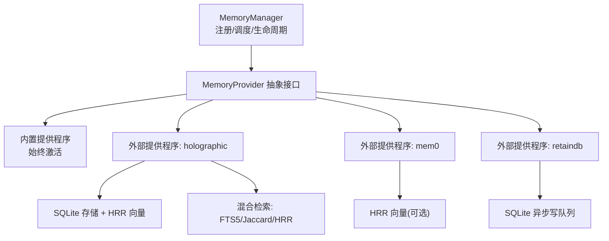
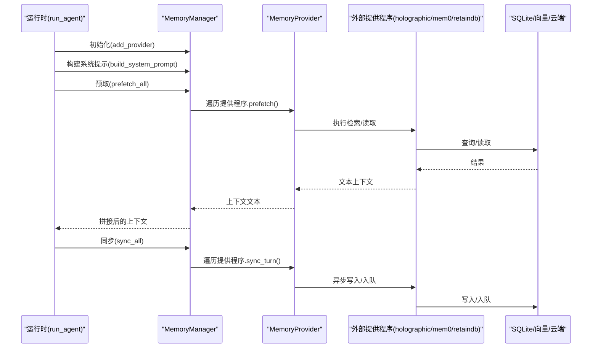
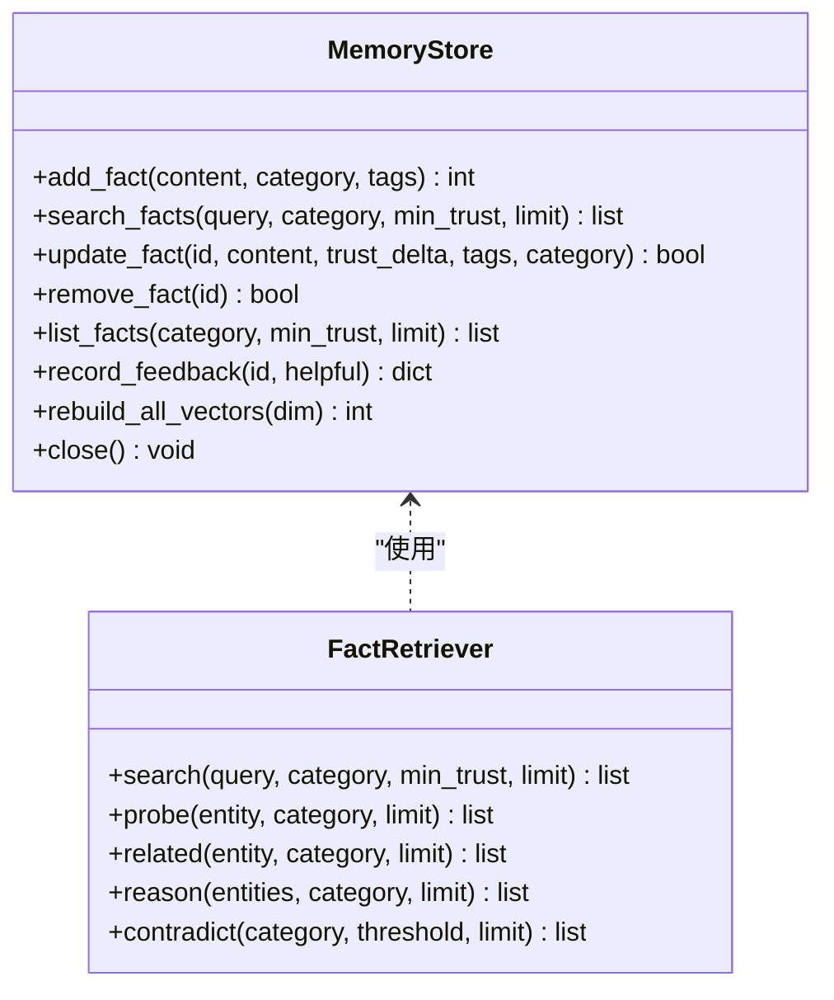
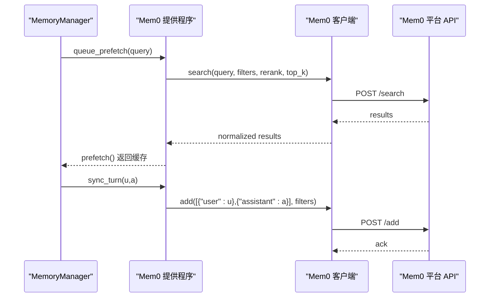
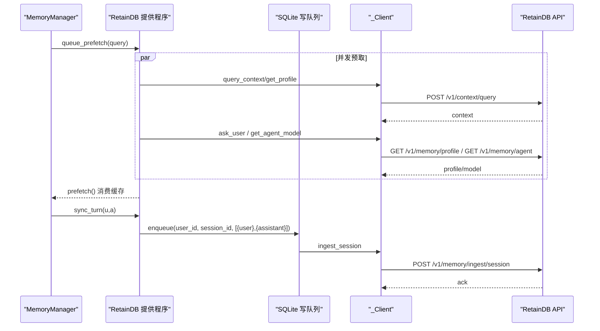
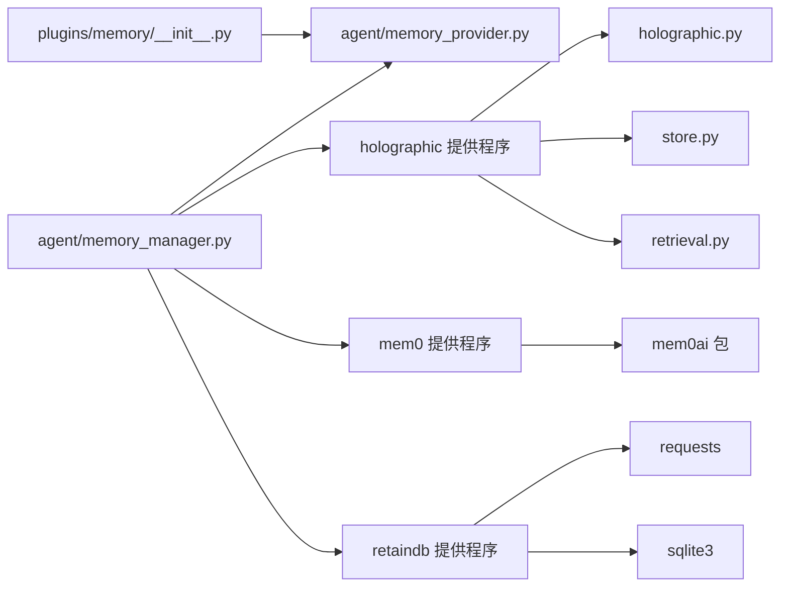
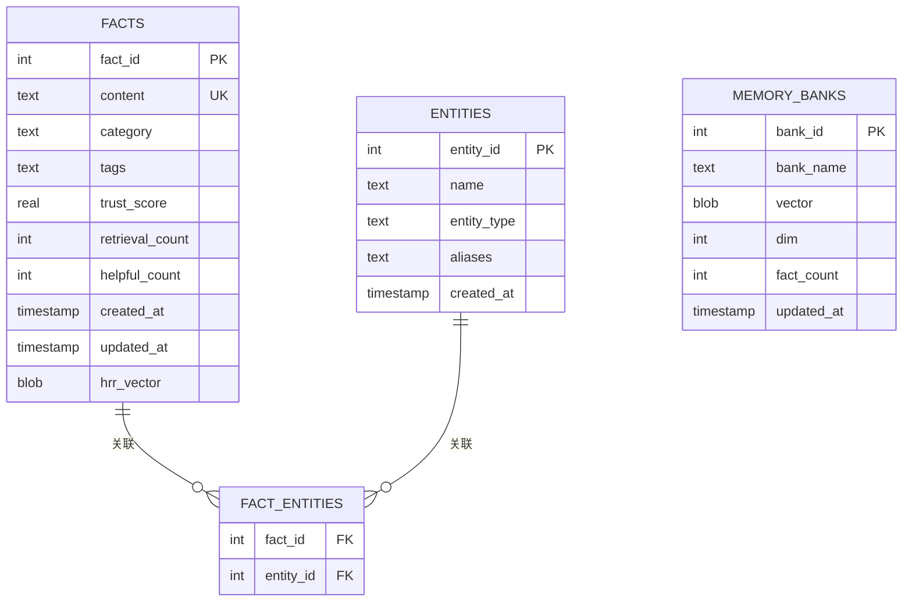
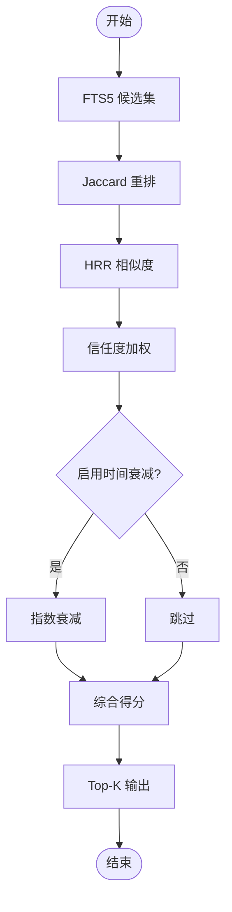

# 存储机制

<cite>
**本文引用的文件**
- [plugins/memory/__init__.py](file://plugins/memory/__init__.py)
- [agent/memory_provider.py](file://agent/memory_provider.py)
- [agent/memory_manager.py](file://agent/memory_manager.py)
- [plugins/memory/holographic/holographic.py](file://plugins/memory/holographic/holographic.py)
- [plugins/memory/holographic/store.py](file://plugins/memory/holographic/store.py)
- [plugins/memory/holographic/retrieval.py](file://plugins/memory/holographic/retrieval.py)
- [plugins/memory/mem0/__init__.py](file://plugins/memory/mem0/__init__.py)
- [plugins/memory/retaindb/__init__.py](file://plugins/memory/retaindb/__init__.py)
</cite>

## 目录
1. [简介](#简介)
2. [项目结构](#项目结构)
3. [核心组件](#核心组件)
4. [架构总览](#架构总览)
5. [详细组件分析](#详细组件分析)
6. [依赖分析](#依赖分析)
7. [性能考量](#性能考量)
8. [故障排查指南](#故障排查指南)
9. [结论](#结论)
10. [附录](#附录)

## 简介
本文件系统性阐述 Hermes Agent 的记忆存储机制，覆盖内置与外部存储提供程序的架构、数据结构、检索与持久化策略、配置与性能优化、容量管理、故障恢复与数据迁移、以及安全与备份策略。重点包括：
- 内置存储提供程序基础架构与数据模型
- 外部提供程序（holographic、mem0、retaindb）的技术实现差异与适用场景
- 存储配置项、性能参数与容量管理
- 故障恢复与数据迁移流程
- 安全、加密与备份建议

## 项目结构
Hermes 将“可插拔记忆提供程序”作为独立模块管理，位于 plugins/memory/<name>/，通过统一的 MemoryProvider 抽象接口对接到运行时的 MemoryManager。MemoryManager 负责注册、调度与生命周期管理，确保内置提供程序始终可用且最多仅有一个外部提供程序生效。

图示来源
- [agent/memory_manager.py:72-363](file://agent/memory_manager.py#L72-L363)
- [agent/memory_provider.py:42-232](file://agent/memory_provider.py#L42-L232)
- [plugins/memory/holographic/store.py:98-575](file://plugins/memory/holographic/store.py#L98-L575)
- [plugins/memory/holographic/retrieval.py:22-594](file://plugins/memory/holographic/retrieval.py#L22-L594)
- [plugins/memory/mem0/__init__.py:119-374](file://plugins/memory/mem0/__init__.py#L119-L374)
- [plugins/memory/retaindb/__init__.py:452-767](file://plugins/memory/retaindb/__init__.py#L452-L767)

章节来源
- [agent/memory_manager.py:1-363](file://agent/memory_manager.py#L1-L363)
- [agent/memory_provider.py:1-232](file://agent/memory_provider.py#L1-L232)
- [plugins/memory/__init__.py:1-318](file://plugins/memory/__init__.py#L1-L318)

## 核心组件
- MemoryProvider 抽象接口：定义提供程序的生命周期钩子、工具模式、同步/预取行为与可选配置模式。
- MemoryManager：集中编排内置与外部提供程序，负责注册、系统提示拼接、预取/同步、工具路由与生命周期管理。
- 插件发现与加载：扫描 plugins/memory/<name>/ 目录，按需加载外部提供程序，支持 CLI 命令注册与可用性检查。

章节来源
- [agent/memory_provider.py:42-232](file://agent/memory_provider.py#L42-L232)
- [agent/memory_manager.py:72-363](file://agent/memory_manager.py#L72-L363)
- [plugins/memory/__init__.py:32-318](file://plugins/memory/__init__.py#L32-L318)

## 架构总览
下图展示从运行时到各提供程序的调用链与数据流：

图示来源
- [agent/memory_manager.py:146-210](file://agent/memory_manager.py#L146-L210)
- [agent/memory_provider.py:92-120](file://agent/memory_provider.py#L92-L120)
- [plugins/memory/holographic/store.py:142-186](file://plugins/memory/holographic/store.py#L142-L186)
- [plugins/memory/mem0/__init__.py:237-296](file://plugins/memory/mem0/__init__.py#L237-L296)
- [plugins/memory/retaindb/__init__.py:542-640](file://plugins/memory/retaindb/__init__.py#L542-L640)

## 详细组件分析

### 内置提供程序（始终激活）
- 角色：作为“基线”提供程序，不可移除；在 MemoryManager 中优先注册。
- 行为：提供系统提示片段、参与预取/同步、暴露工具模式（如内置记忆工具），并与外部提供程序协同工作。
- 注意：本文聚焦于外部提供程序的实现细节；内置提供程序的具体实现不在本仓库中直接可见，但其与外部提供程序的交互由 MemoryManager 统一编排。

章节来源
- [agent/memory_manager.py:72-131](file://agent/memory_manager.py#L72-L131)
- [agent/memory_provider.py:6-11](file://agent/memory_provider.py#L6-L11)

### 外部提供程序：holographic
- 技术要点
  - HRR（相位向量编码）：使用确定性哈希生成原子向量，支持绑定、解绑、合并与相似度计算，具备数值稳定与跨平台一致性。
  - SQLite 存储：事实表、实体表、事实-实体关联表、FTS5 全文索引与触发器；支持信任度评分、检索计数、帮助计数与时间戳。
  - 记忆库（Memory Banks）：按类别聚合事实向量，形成类别级向量以提升检索效率。
  - 检索策略：FTS5 候选 + Jaccard 重排 + HRR 相似度 + 信任加权 + 可选时间衰减。
- 数据结构
  - facts：唯一内容、类别、标签、信任度、检索/帮助计数、创建/更新时间、HRR 向量字节。
  - entities：实体名、类型、别名列表。
  - fact_entities：多对多关联。
  - memory_banks：类别名、向量、维度、事实数量、更新时间。
- 持久化与容量
  - WAL 模式、FTS5 触发器自动维护；SNR 估计用于容量预警。
  - 支持重建所有向量与记忆库，便于迁移与恢复。
- 性能与优化
  - HRR 维度默认 1024；SNR 近阈值会警告，建议增大维度或减少存储项。
  - 混合权重可按环境调整；无 numpy 时自动降低 HRR 权重。
- 适用场景
  - 需要结构化检索、实体解析、信任度反馈与组合推理的场景。

图示来源
- [plugins/memory/holographic/store.py:98-575](file://plugins/memory/holographic/store.py#L98-L575)
- [plugins/memory/holographic/retrieval.py:22-594](file://plugins/memory/holographic/retrieval.py#L22-L594)

章节来源
- [plugins/memory/holographic/holographic.py:43-204](file://plugins/memory/holographic/holographic.py#L43-L204)
- [plugins/memory/holographic/store.py:16-76](file://plugins/memory/holographic/store.py#L16-L76)
- [plugins/memory/holographic/store.py:142-557](file://plugins/memory/holographic/store.py#L142-L557)
- [plugins/memory/holographic/retrieval.py:48-113](file://plugins/memory/holographic/retrieval.py#L48-L113)

### 外部提供程序：mem0
- 技术要点
  - 服务端事实抽取与语义检索，支持重排序与去重。
  - 配置：API Key、用户标识、代理标识；支持 JSON 文件覆盖。
  - 回路保护：连续失败达到阈值后冷却暂停，避免雪崩。
  - 工具：profile、search、conclude；非阻塞后台预取与同步。
- 数据流
  - 预取：后台线程发起搜索，结果缓存至下一轮消费。
  - 同步：回合结束后异步写入，等待前一次同步完成。
  - 工具调用：封装客户端调用，返回 JSON 结果。
- 适用场景
  - 需要云端托管、高召回与事实抽取能力的对话型应用。

图示来源
- [plugins/memory/mem0/__init__.py:237-296](file://plugins/memory/mem0/__init__.py#L237-L296)
- [plugins/memory/mem0/__init__.py:300-361](file://plugins/memory/mem0/__init__.py#L300-L361)

章节来源
- [plugins/memory/mem0/__init__.py:1-374](file://plugins/memory/mem0/__init__.py#L1-L374)

### 外部提供程序：retaindb
- 技术要点
  - 云端 API：语义检索、用户画像、任务上下文合成、代理自我模型、共享文件存储与处理。
  - 写入队列：SQLite 持久化后台写队列，崩溃安全、断点续传。
  - 预取：并发执行上下文查询、用户思辨合成、代理模型拉取，下轮消费。
  - 工具集：profile、search、context、remember、forget、文件上传/列举/读取/索引/删除。
- 数据流
  - 预取：三路后台线程，结果叠加为上下文块。
  - 同步：回合消息入队，后台线程批量写入。
  - 工具：统一分发到 _Client，支持错误包装与降级。
- 适用场景
  - 需要跨会话长期记忆、用户画像与代理自我模型、文件知识注入与合成的复杂应用。

图示来源
- [plugins/memory/retaindb/__init__.py:542-640](file://plugins/memory/retaindb/__init__.py#L542-L640)
- [plugins/memory/retaindb/__init__.py:329-408](file://plugins/memory/retaindb/__init__.py#L329-L408)

章节来源
- [plugins/memory/retaindb/__init__.py:1-767](file://plugins/memory/retaindb/__init__.py#L1-L767)

## 依赖分析
- 提供程序发现与加载
  - plugins/memory/__init__.py 扫描目录、读取元信息、执行 is_available 快检、动态导入模块并提取提供程序实例。
  - 仅允许一个外部提供程序激活，避免工具模式冲突。
- 生命周期耦合
  - MemoryManager 在初始化时注入 hermes_home，确保提供程序可定位本地存储路径。
  - 提供程序间相互独立，单个失败不影响其他提供程序。
- 外部依赖
  - holographic：numpy（可选，无则降低 HRR 权重）。
  - mem0：mem0ai 包（未安装时报错引导安装）。
  - retaindb：requests、sqlite3（写队列）、本地 SOUL.md 种子。

图示来源
- [plugins/memory/__init__.py:32-196](file://plugins/memory/__init__.py#L32-L196)
- [agent/memory_manager.py:345-363](file://agent/memory_manager.py#L345-L363)
- [plugins/memory/holographic/holographic.py:27-32](file://plugins/memory/holographic/holographic.py#L27-L32)
- [plugins/memory/mem0/__init__.py:174-178](file://plugins/memory/mem0/__init__.py#L174-L178)
- [plugins/memory/retaindb/__init__.py:196-205](file://plugins/memory/retaindb/__init__.py#L196-L205)

章节来源
- [plugins/memory/__init__.py:32-196](file://plugins/memory/__init__.py#L32-L196)
- [agent/memory_manager.py:345-363](file://agent/memory_manager.py#L345-L363)

## 性能考量
- Holographic
  - HRR 维度与存储项数影响 SNR；当 n_items 接近 dim/4 时建议扩容维度或降载。
  - 混合检索权重可调；无 numpy 时自动降低 HRR 权重，保证检索可用性。
  - FTS5 + 触发器 + 索引提升检索吞吐；WAL 模式改善并发写入。
- Mem0
  - 回路保护阈值与冷却时间避免服务过载；后台线程避免阻塞主流程。
  - 重排序与 top_k 控制召回质量与延迟。
- RetainDB
  - 写队列采用 SQLite 本地持久化，崩溃安全；后台线程批量写入，降低 API 压力。
  - 并发预取三路线程，避免快速回合导致线程堆积。

章节来源
- [plugins/memory/holographic/holographic.py:179-204](file://plugins/memory/holographic/holographic.py#L179-L204)
- [plugins/memory/holographic/retrieval.py:25-47](file://plugins/memory/holographic/retrieval.py#L25-L47)
- [plugins/memory/mem0/__init__.py:30-34](file://plugins/memory/mem0/__init__.py#L30-L34)
- [plugins/memory/retaindb/__init__.py:330-408](file://plugins/memory/retaindb/__init__.py#L330-L408)

## 故障排查指南
- 提供程序不可用
  - 检查 is_available 与配置：holographic 依赖 sqlite3；mem0 依赖 mem0ai 包；retaindb 依赖 requests/sqlite3。
  - 查看日志中的“Failed to load”“register() failed”“Failed to exec_module”等信息。
- 检索异常
  - Holographic：FTS5 MATCH 失败会回退空结果；检查查询语法与索引状态。
  - RetainDB：网络错误会被包装为 JSON 错误；检查 API Key、Base URL、Project。
- 写入失败
  - Mem0：连续失败触发回路保护，稍后自动重试；查看冷却日志。
  - RetainDB：写队列失败会记录 last_error，重启后继续重放；检查数据库连接与磁盘空间。
- 数据迁移与恢复
  - Holographic：支持重建所有向量与记忆库；可指定新维度进行迁移。
  - RetainDB：写队列断点续传；必要时可清理队列表并重新入队。

章节来源
- [plugins/memory/__init__.py:62-96](file://plugins/memory/__init__.py#L62-L96)
- [plugins/memory/holographic/retrieval.py:520-527](file://plugins/memory/holographic/retrieval.py#L520-L527)
- [plugins/memory/mem0/__init__.py:180-202](file://plugins/memory/mem0/__init__.py#L180-L202)
- [plugins/memory/retaindb/__init__.py:380-404](file://plugins/memory/retaindb/__init__.py#L380-L404)
- [plugins/memory/holographic/store.py:532-557](file://plugins/memory/holographic/store.py#L532-L557)

## 结论
Hermes 的记忆存储体系通过统一抽象与集中编排，实现了“内置基线 + 多种外部提供程序”的灵活组合。holographic 提供结构化检索与 HRR 推理能力；mem0 提供云端抽取与语义检索；retaindb 提供跨会话长期记忆、用户画像与文件知识注入。通过合理的配置、性能参数与容量管理，可在不同场景下取得最佳效果。

## 附录

### 存储配置与参数
- holographic
  - 默认信任度、HRR 维度、FTS5/索引/触发器、WAL 模式、SNR 警告阈值。
- mem0
  - API Key、用户 ID、代理 ID、是否启用重排序；保存到 $HERMES_HOME/mem0.json。
- retaindb
  - API Key、Base URL、Project；写队列 SQLite 路径位于 $HERMES_HOME/retaindb_queue.db。

章节来源
- [plugins/memory/holographic/store.py:101-137](file://plugins/memory/holographic/store.py#L101-L137)
- [plugins/memory/mem0/__init__.py:40-66](file://plugins/memory/mem0/__init__.py#L40-L66)
- [plugins/memory/retaindb/__init__.py:489-512](file://plugins/memory/retaindb/__init__.py#L489-L512)

### 数据结构与索引（holographic）

图示来源
- [plugins/memory/holographic/store.py:16-76](file://plugins/memory/holographic/store.py#L16-L76)

### 检索流程（holographic）

图示来源
- [plugins/memory/holographic/retrieval.py:48-113](file://plugins/memory/holographic/retrieval.py#L48-L113)