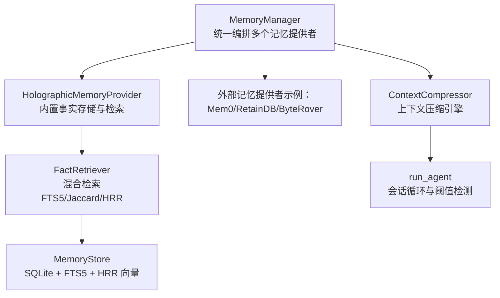
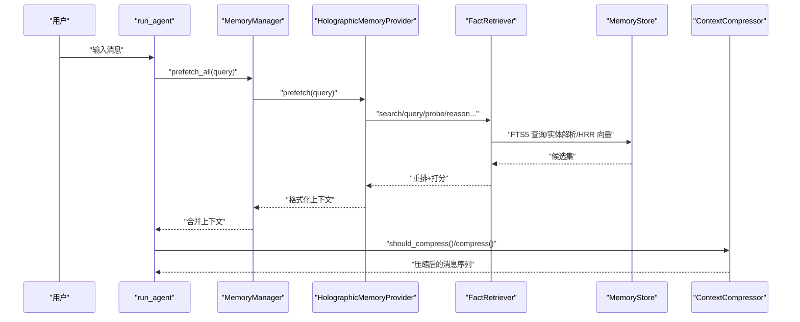
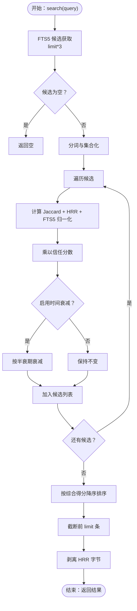
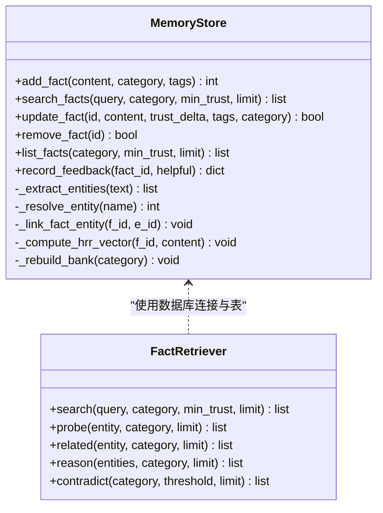
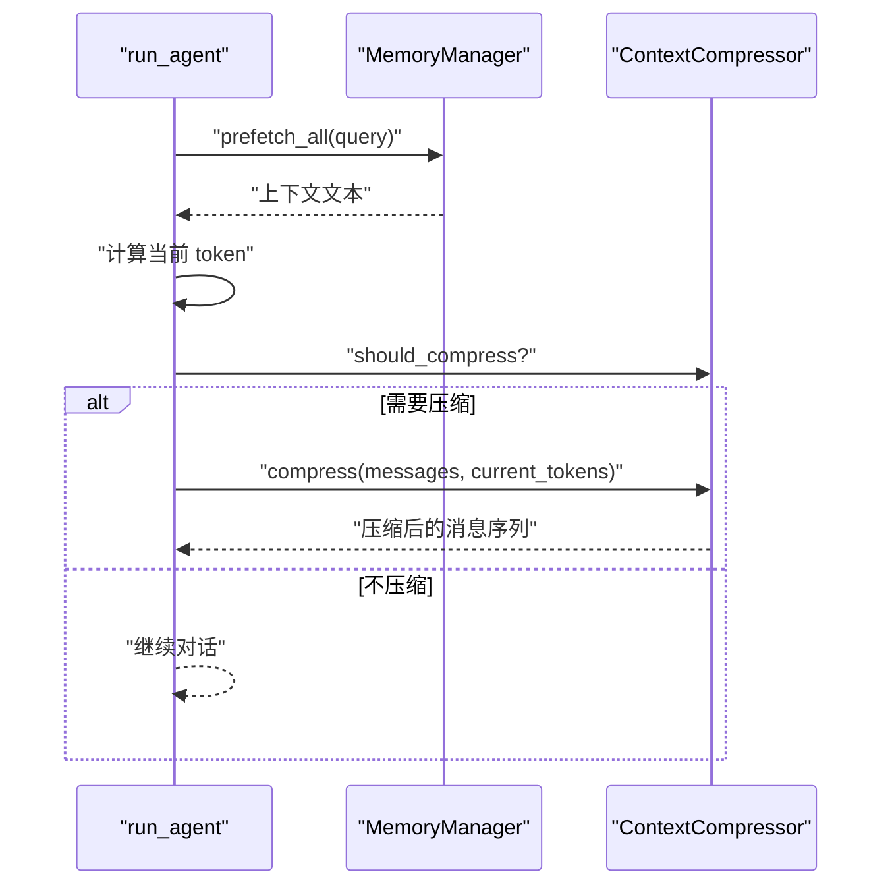
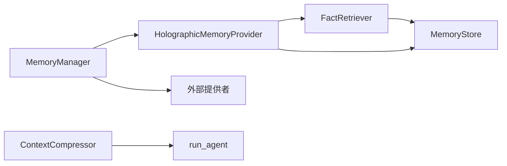

# 检索算法

<cite>
**本文引用的文件**
- [retrieval.py](file://plugins/memory/holographic/retrieval.py)
- [store.py](file://plugins/memory/holographic/store.py)
- [__init__.py（holographic 插件）](file://plugins/memory/holographic/__init__.py)
- [memory_manager.py](file://agent/memory_manager.py)
- [memory_provider.py](file://agent/memory_provider.py)
- [context_engine.py](file://agent/context_engine.py)
- [context_compressor.py](file://agent/context_compressor.py)
- [run_agent.py](file://run_agent.py)
- [__init__.py（mem0 插件）](file://plugins/memory/mem0/__init__.py)
- [SKILL.md（chroma）](file://optional-skills/mlops/chroma/SKILL.md)
- [SKILL.md（pinecone）](file://optional-skills/mlops/pinecone/SKILL.md)
- [SKILL.md（faiss）](file://optional-skills/mlops/faiss/SKILL.md)
- [SKILL.md（qmd）](file://optional-skills/research/qmd/SKILL.md)
</cite>

## 目录
1. [简介](#简介)
2. [项目结构](#项目结构)
3. [核心组件](#核心组件)
4. [架构总览](#架构总览)
5. [详细组件分析](#详细组件分析)
6. [依赖分析](#依赖分析)
7. [性能考虑](#性能考虑)
8. [故障排查指南](#故障排查指南)
9. [结论](#结论)
10. [附录](#附录)

## 简介
本文件系统化阐述 Hermes Agent 的记忆检索算法，覆盖检索查询处理、相似度计算与相关性排序机制；详解向量检索、关键词匹配与语义搜索的实现原理；总结检索优化策略（索引构建、缓存机制、查询加速）；说明检索结果的过滤、排序与去重算法；提供检索性能调优指南与查询优化技巧；解释检索与上下文压缩的协同工作机制，并给出检索准确性评估与质量控制方法。

## 项目结构
Hermes 的检索能力由“内置内存插件（Holographic）+ 外部记忆提供者”共同构成，检索流程贯穿 MemoryManager 的预取阶段，最终注入到模型提示词中。上下文压缩在接近上下文阈值时触发，与检索形成“召回—压缩”的协同闭环。

图示来源
- [memory_manager.py:72-363](file://agent/memory_manager.py#L72-L363)
- [__init__.py（holographic 插件）:114-255](file://plugins/memory/holographic/__init__.py#L114-L255)
- [retrieval.py:22-113](file://plugins/memory/holographic/retrieval.py#L22-L113)
- [store.py:98-185](file://plugins/memory/holographic/store.py#L98-L185)
- [context_engine.py:32-185](file://agent/context_engine.py#L32-L185)
- [context_compressor.py:60-171](file://agent/context_compressor.py#L60-L171)
- [run_agent.py:9848-9866](file://run_agent.py#L9848-L9866)

章节来源
- [memory_manager.py:72-363](file://agent/memory_manager.py#L72-L363)
- [__init__.py（holographic 插件）:114-255](file://plugins/memory/holographic/__init__.py#L114-L255)

## 核心组件
- 内置检索器（FactRetriever）
  - 聚合 FTS5 关键词匹配、Jaccard 重排、信任权重与可选时间衰减，支持实体探测（probe）、关联发现（related）、组合推理（reason）与矛盾检测（contradict）。
- 存储层（MemoryStore）
  - 基于 SQLite 的事实表、实体表、FTS5 虚表与内存库（memory_banks），支持实体抽取、链接、HRR 向量编码与银行重建。
- 提供者接口（MemoryProvider）
  - 统一生命周期与工具接口，MemoryManager 负责注册、调度与错误隔离。
- 上下文压缩（ContextCompressor）
  - 在接近阈值时对中间对话进行结构化摘要，保护首尾消息，避免工具调用对齐问题。
- 外部检索方案（参考）
  - Chroma/Pinecone/FAISS/QMD 等作为可选的向量数据库或混合检索方案，用于更大规模或更高吞吐的场景。

章节来源
- [retrieval.py:22-113](file://plugins/memory/holographic/retrieval.py#L22-L113)
- [store.py:98-185](file://plugins/memory/holographic/store.py#L98-L185)
- [memory_provider.py:42-232](file://agent/memory_provider.py#L42-L232)
- [context_engine.py:32-185](file://agent/context_engine.py#L32-L185)
- [context_compressor.py:60-171](file://agent/context_compressor.py#L60-L171)
- [SKILL.md（chroma）:1-50](file://optional-skills/mlops/chroma/SKILL.md#L1-L50)
- [SKILL.md（pinecone）:1-45](file://optional-skills/mlops/pinecone/SKILL.md#L1-L45)
- [SKILL.md（faiss）:1-48](file://optional-skills/mlops/faiss/SKILL.md#L1-L48)
- [SKILL.md（qmd）:165-387](file://optional-skills/research/qmd/SKILL.md#L165-L387)

## 架构总览
检索在每轮对话前由 MemoryManager 触发 prefetch，内置提供者使用 FactRetriever 执行混合检索，结果经上下文围栏包装后注入系统提示词。当上下文压力接近阈值时，ContextCompressor 对中间消息进行结构化压缩，减少 token 使用。

图示来源
- [memory_manager.py:167-184](file://agent/memory_manager.py#L167-L184)
- [__init__.py（holographic 插件）:205-224](file://plugins/memory/holographic/__init__.py#L205-L224)
- [retrieval.py:48-112](file://plugins/memory/holographic/retrieval.py#L48-L112)
- [store.py:187-236](file://plugins/memory/holographic/store.py#L187-L236)
- [context_engine.py:72-89](file://agent/context_engine.py#L72-L89)
- [context_compressor.py:177-181](file://agent/context_compressor.py#L177-L181)

## 详细组件分析

### 组件A：FactRetriever（混合检索与重排）
- 查询处理
  - 先通过 FTS5 获取候选（limit*3 以留重排空间），再基于 Jaccard 与 HRR 相似度进行重排，最后乘以信任权重与可选的时间衰减。
- 相似度与排序
  - FTS5 排名归一化至 [0,1]；Jaccard 计算查询与内容/标签的交并比；HRR 使用相位向量相似度并映射到 [0,1]；综合得分 = 归一化 FTS5×w1 + Jaccard×w2 + HRR×w3，再乘以信任分数；可选按半衰期做指数时间衰减。
- 实体与组合检索
  - probe：针对单个实体，解绑实体角色得到残差，再与内容角色比较相似度，返回与该实体相关的事实。
  - related：寻找与实体在结构上存在连接的事实（实体或内容角色任一匹配即可）。
  - reason：多实体组合，求最小相似度（AND 语义），仅当所有实体都在结构上出现时才高分。
  - contradict：基于实体重叠与内容向量相似度的矛盾评分，自动发现潜在冲突。
- 过滤与去重
  - 默认最小信任阈值（min_trust），类别过滤（category），返回前 limit 条；内部对 HRR 向量字节进行剥离，保证 JSON 可序列化。

图示来源
- [retrieval.py:48-112](file://plugins/memory/holographic/retrieval.py#L48-L112)
- [retrieval.py:544-594](file://plugins/memory/holographic/retrieval.py#L544-L594)

章节来源
- [retrieval.py:22-113](file://plugins/memory/holographic/retrieval.py#L22-L113)
- [retrieval.py:114-190](file://plugins/memory/holographic/retrieval.py#L114-L190)
- [retrieval.py:192-336](file://plugins/memory/holographic/retrieval.py#L192-L336)
- [retrieval.py:338-442](file://plugins/memory/holographic/retrieval.py#L338-L442)
- [retrieval.py:444-479](file://plugins/memory/holographic/retrieval.py#L444-L479)
- [retrieval.py:481-542](file://plugins/memory/holographic/retrieval.py#L481-L542)
- [retrieval.py:544-594](file://plugins/memory/holographic/retrieval.py#L544-L594)

### 组件B：MemoryStore（索引与向量）
- 数据结构
  - facts 表：内容、类别、标签、信任度、检索计数、帮助计数、时间戳、可选 HRR 向量。
  - entities/fact_entities：实体抽取与链接。
  - facts_fts：FTS5 虚表，自动维护全文索引。
  - memory_banks：按类别的 HRR 向量“银行”，用于快速实体探测。
- 索引与触发器
  - FTS5 触发器：插入/删除/更新时同步写入/删除 FTS5 行。
  - 内存库：当某类别有向量事实时，聚合为 bank 向量并记录维度与数量。
- 实体抽取与链接
  - 支持多模式实体提取（大写短语、引号、AKA），并建立 fact_entities 链接。
- HRR 向量
  - 当 numpy 可用时，对每个事实计算向量并写回；同时重建对应类别的 bank。

图示来源
- [store.py:98-185](file://plugins/memory/holographic/store.py#L98-L185)
- [store.py:187-347](file://plugins/memory/holographic/store.py#L187-L347)
- [store.py:349-388](file://plugins/memory/holographic/store.py#L349-L388)
- [store.py:394-427](file://plugins/memory/holographic/store.py#L394-L427)
- [store.py:470-492](file://plugins/memory/holographic/store.py#L470-L492)
- [store.py:494-530](file://plugins/memory/holographic/store.py#L494-L530)
- [retrieval.py:22-113](file://plugins/memory/holographic/retrieval.py#L22-L113)

章节来源
- [store.py:16-76](file://plugins/memory/holographic/store.py#L16-L76)
- [store.py:98-185](file://plugins/memory/holographic/store.py#L98-L185)
- [store.py:187-347](file://plugins/memory/holographic/store.py#L187-L347)
- [store.py:349-388](file://plugins/memory/holographic/store.py#L349-L388)
- [store.py:394-427](file://plugins/memory/holographic/store.py#L394-L427)
- [store.py:470-492](file://plugins/memory/holographic/store.py#L470-L492)
- [store.py:494-530](file://plugins/memory/holographic/store.py#L494-L530)

### 组件C：检索与上下文压缩协同
- 预取与注入
  - MemoryManager.prefetch_all 汇总各提供者的预取结果，构建带围栏的上下文块，注入到系统提示词中。
- 压缩触发
  - run_agent 在每轮后根据阈值检测是否需要压缩；ContextCompressor 采用“工具输出修剪 + 尾部 token 预算保护 + 结构化摘要”的方式，避免工具调用对齐问题。
- 协同效果
  - 检索提供高质量、低噪声的背景信息；压缩确保长对话不越界，二者共同保障模型输入的有效性与稳定性。

图示来源
- [memory_manager.py:167-184](file://agent/memory_manager.py#L167-L184)
- [context_engine.py:72-89](file://agent/context_engine.py#L72-L89)
- [context_compressor.py:177-181](file://agent/context_compressor.py#L177-L181)
- [run_agent.py:9848-9866](file://run_agent.py#L9848-L9866)

章节来源
- [memory_manager.py:54-69](file://agent/memory_manager.py#L54-L69)
- [memory_manager.py:167-184](file://agent/memory_manager.py#L167-L184)
- [context_engine.py:72-89](file://agent/context_engine.py#L72-L89)
- [context_compressor.py:666-800](file://agent/context_compressor.py#L666-L800)
- [run_agent.py:9848-9866](file://run_agent.py#L9848-L9866)

### 组件D：外部检索方案（对比与选型）
- Chroma：开源嵌入数据库，适合本地开发与自托管；支持向量与全文检索、元数据过滤。
- Pinecone：托管向量数据库，具备混合检索（稠密+稀疏）、命名空间与自动扩展，适合生产级 RAG。
- FAISS：高效相似度搜索库，支持 GPU 加速与多种索引类型，适合纯向量相似度场景。
- QMD：研究型混合检索（BM25/向量并行 + RRF 融合 + LLM 重排），强调查询扩展与位置感知混合。

章节来源
- [SKILL.md（chroma）:1-50](file://optional-skills/mlops/chroma/SKILL.md#L1-L50)
- [SKILL.md（pinecone）:1-45](file://optional-skills/mlops/pinecone/SKILL.md#L1-L45)
- [SKILL.md（faiss）:1-48](file://optional-skills/mlops/faiss/SKILL.md#L1-L48)
- [SKILL.md（qmd）:165-387](file://optional-skills/research/qmd/SKILL.md#L165-L387)

## 依赖分析
- 组件耦合
  - FactRetriever 强依赖 MemoryStore 的数据库连接与表结构；当 numpy 不可用时，HRR 分支退化为关键词搜索。
  - MemoryManager 作为编排器，对各提供者只暴露工具 schema 与回调接口，降低耦合。
- 外部依赖
  - HRR 向量依赖 numpy；FTS5 依赖 SQLite；外部向量库（如 Chroma/Pinecone/FAISS/QMD）需按需安装与配置。
- 循环依赖
  - 未见循环导入；提供者接口抽象清晰，避免相互依赖。

图示来源
- [memory_provider.py:42-232](file://agent/memory_provider.py#L42-L232)
- [memory_manager.py:72-131](file://agent/memory_manager.py#L72-L131)
- [__init__.py（holographic 插件）:114-179](file://plugins/memory/holographic/__init__.py#L114-L179)
- [retrieval.py:22-47](file://plugins/memory/holographic/retrieval.py#L22-L47)
- [store.py:98-122](file://plugins/memory/holographic/store.py#L98-L122)
- [context_engine.py:32-185](file://agent/context_engine.py#L32-L185)
- [context_compressor.py:60-171](file://agent/context_compressor.py#L60-L171)

章节来源
- [memory_provider.py:42-232](file://agent/memory_provider.py#L42-L232)
- [memory_manager.py:72-131](file://agent/memory_manager.py#L72-L131)
- [__init__.py（holographic 插件）:114-179](file://plugins/memory/holographic/__init__.py#L114-L179)
- [retrieval.py:22-47](file://plugins/memory/holographic/retrieval.py#L22-L47)
- [store.py:98-122](file://plugins/memory/holographic/store.py#L98-L122)
- [context_engine.py:32-185](file://agent/context_engine.py#L32-L185)
- [context_compressor.py:60-171](file://agent/context_compressor.py#L60-L171)

## 性能考虑
- 索引与查询加速
  - FTS5 虚表自动维护，配合触发器确保一致性；建议合理设置类别与最小信任阈值，缩小候选集。
  - HRR 向量按类别重建“银行”，在实体探测时可直接对 bank 向量进行解绑与相似度计算，避免全表扫描。
- 缓存与预取
  - MemoryManager.prefetch_all 串行汇总各提供者结果；外部提供者可实现后台队列与消费机制（如 RetainDB 的线程池）。
- 排序与截断
  - 混合打分后按综合得分降序，限制返回条目；注意剥离 HRR 向量字节，避免 JSON 序列化开销。
- 压缩与阈值
  - ContextCompressor 采用“工具输出修剪 + 尾部 token 预算保护 + 结构化摘要”，避免频繁压缩带来的信息损失。
- 外部向量库
  - 对于大规模向量检索，优先考虑 Chroma/Pinecone/FAISS/QMD 等方案，结合查询扩展与重排提升召回质量。

## 故障排查指南
- FTS5 匹配失败
  - 当查询语法异常时，候选集为空，返回空结果。建议检查查询字符串与标点处理。
- HRR 不可用
  - 若 numpy 不可用，HRR 分支退化为关键词搜索；可通过配置调整权重或启用其他检索分支。
- 工具调用对齐问题
  - 压缩前后需保证工具调用与结果成对；ContextCompressor 提供“孤儿结果/调用修复”逻辑，必要时启用日志定位。
- 信任度与反馈
  - 通过 record_feedback 调整事实信任度；若反馈未生效，检查数据库事务与提交逻辑。

章节来源
- [retrieval.py:520-525](file://plugins/memory/holographic/retrieval.py#L520-L525)
- [store.py:349-388](file://plugins/memory/holographic/store.py#L349-L388)
- [context_compressor.py:506-564](file://agent/context_compressor.py#L506-L564)

## 结论
Hermes 的检索体系以内置 Holographic 插件为核心，融合关键词、结构化与语义三种能力，通过信任度与时间衰减实现动态排序，并在上下文压力下与压缩引擎协同工作。对于更大规模或更复杂的检索需求，可结合 Chroma/Pinecone/FAISS/QMD 等外部方案，进一步提升召回质量与吞吐性能。

## 附录
- 检索准确性评估与质量控制
  - 可参考人类评估方法（标注指南、注意力检查、一致性指标等），在检索结果层面设计人工评估任务，关注相关性、完整性与矛盾识别等指标。
- 查询优化技巧
  - 合理设置类别与最小信任阈值；利用实体探测与组合推理提升复杂查询的召回；在外部向量库中引入查询扩展与重排策略，提高语义匹配精度。

章节来源
- [skills/research/research-paper-writing/references/human-evaluation.md:181-268](file://skills/research/research-paper-writing/references/human-evaluation.md#L181-L268)
- [SKILL.md（qmd）:165-387](file://optional-skills/research/qmd/SKILL.md#L165-L387)