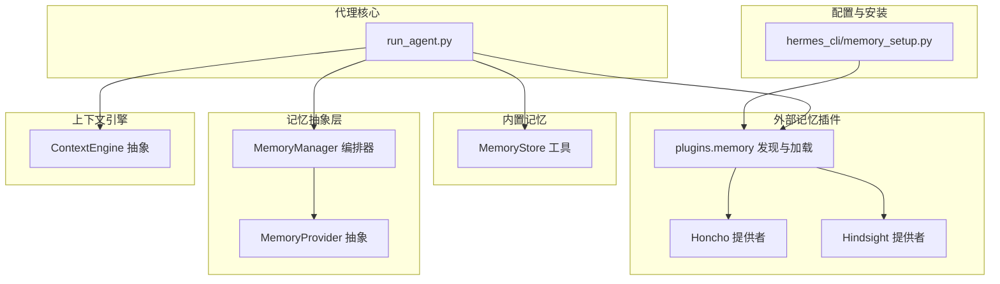
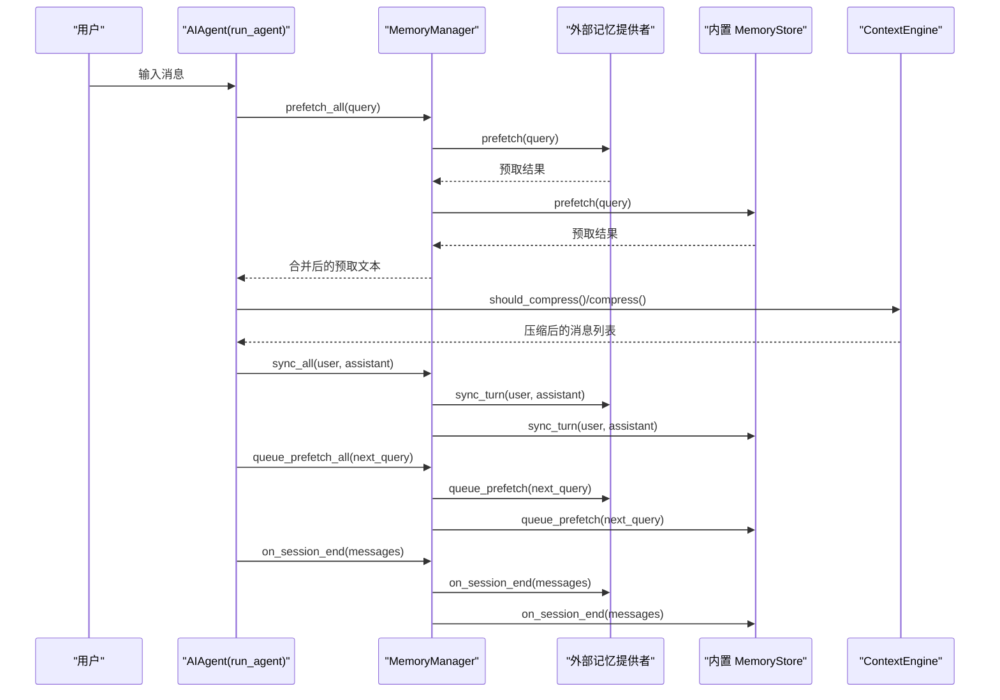
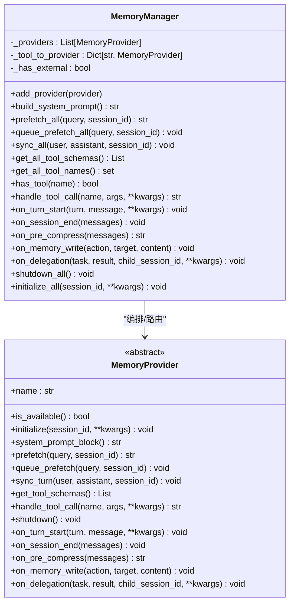
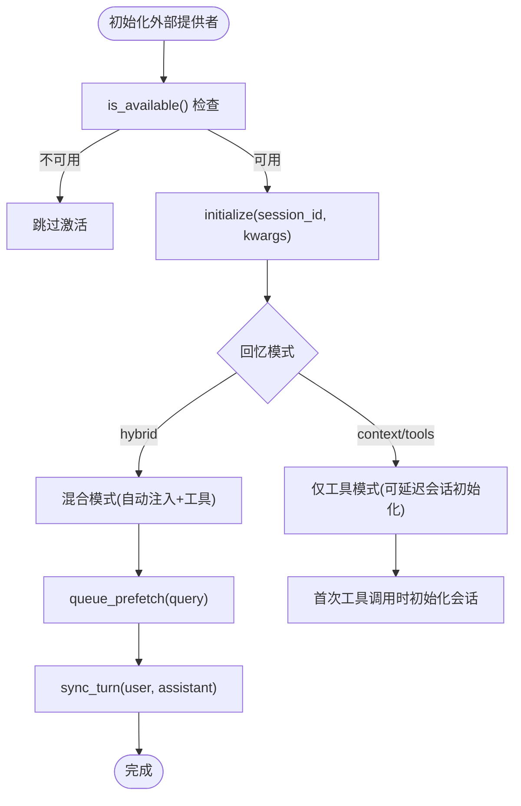
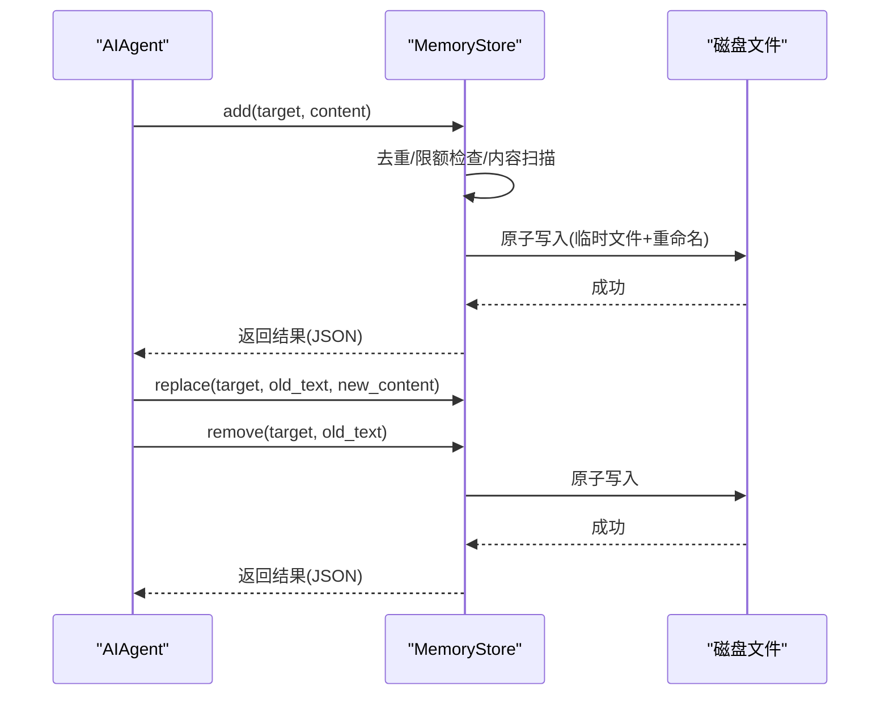
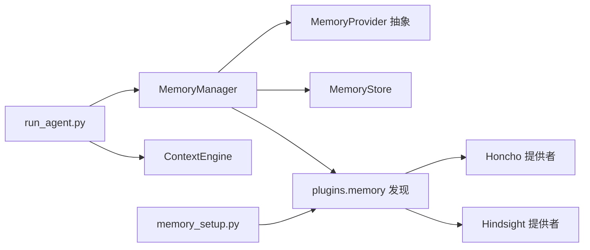

# 系统集成

<cite>
**本文引用的文件**
- [agent/memory_manager.py](file://agent/memory_manager.py)
- [agent/memory_provider.py](file://agent/memory_provider.py)
- [agent/context_engine.py](file://agent/context_engine.py)
- [run_agent.py](file://run_agent.py)
- [hermes_cli/memory_setup.py](file://hermes_cli/memory_setup.py)
- [plugins/memory/__init__.py](file://plugins/memory/__init__.py)
- [plugins/memory/honcho/__init__.py](file://plugins/memory/honcho/__init__.py)
- [plugins/memory/hindsight/__init__.py](file://plugins/memory/hindsight/__init__.py)
- [tools/memory_tool.py](file://tools/memory_tool.py)
</cite>

## 目录
1. [简介](#简介)
2. [项目结构](#项目结构)
3. [核心组件](#核心组件)
4. [架构总览](#架构总览)
5. [详细组件分析](#详细组件分析)
6. [依赖分析](#依赖分析)
7. [性能考虑](#性能考虑)
8. [故障排查指南](#故障排查指南)
9. [结论](#结论)
10. [附录](#附录)

## 简介
本文件面向Hermes Agent的记忆系统集成，系统性阐述记忆管理器与代理核心的集成方式、生命周期管理与事件协调机制；详解记忆在对话循环中的预取、同步与清理流程；说明记忆系统与上下文引擎、工具系统、会话管理的交互模式；覆盖记忆状态管理、并发控制与一致性保障；并提供配置指南、调试技巧、内存泄漏防护与资源清理策略，以及在不同运行环境下的行为差异说明。

## 项目结构
围绕记忆系统的相关模块分布如下：
- 代理核心：run_agent.py 负责加载内置记忆存储与外部记忆提供者，驱动对话循环中的预取、同步与清理。
- 记忆抽象层：agent/memory_provider.py 定义记忆提供者的统一接口；agent/memory_manager.py 提供多提供者编排与事件分发。
- 内置记忆工具：tools/memory_tool.py 提供本地文件持久化的“记忆”工具，支持添加/替换/删除条目，并以冻结快照注入系统提示。
- 外部记忆插件：plugins/memory/* 下提供多种插件（如 Honcho、Hindsight 等），通过插件发现与加载机制接入。
- 上下文引擎：agent/context_engine.py 提供上下文压缩与工具扩展能力，与记忆系统协同进行长上下文管理。
- 配置与安装：hermes_cli/memory_setup.py 提供交互式记忆提供者选择与配置写入。

图表来源
- [run_agent.py](file://run_agent.py)
- [agent/memory_manager.py](file://agent/memory_manager.py)
- [agent/memory_provider.py](file://agent/memory_provider.py)
- [tools/memory_tool.py](file://tools/memory_tool.py)
- [plugins/memory/__init__.py](file://plugins/memory/__init__.py)
- [plugins/memory/honcho/__init__.py](file://plugins/memory/honcho/__init__.py)
- [plugins/memory/hindsight/__init__.py](file://plugins/memory/hindsight/__init__.py)
- [agent/context_engine.py](file://agent/context_engine.py)
- [hermes_cli/memory_setup.py](file://hermes_cli/memory_setup.py)

章节来源
- [run_agent.py](file://run_agent.py)
- [agent/memory_manager.py](file://agent/memory_manager.py)
- [agent/memory_provider.py](file://agent/memory_provider.py)
- [tools/memory_tool.py](file://tools/memory_tool.py)
- [plugins/memory/__init__.py](file://plugins/memory/__init__.py)
- [plugins/memory/honcho/__init__.py](file://plugins/memory/honcho/__init__.py)
- [plugins/memory/hindsight/__init__.py](file://plugins/memory/hindsight/__init__.py)
- [agent/context_engine.py](file://agent/context_engine.py)
- [hermes_cli/memory_setup.py](file://hermes_cli/memory_setup.py)

## 核心组件
- MemoryProvider 抽象：定义记忆提供者生命周期钩子（初始化、系统提示块、预取、队列预取、回合同步、工具模式、关闭等），以及可选钩子（每回合开始、会话结束、压缩前抽取、镜像内置写入、委托完成通知）。
- MemoryManager 编排器：注册最多一个外部提供者与内置提供者，负责按顺序调用各提供者的生命周期钩子，合并系统提示块，聚合预取结果，广播工具调用，以及在会话结束或模型切换时进行清理。
- 内置 MemoryStore 工具：提供本地文件持久化的能力，支持字符数限制、去重、原子写入、文件锁、内容扫描与冻结快照注入系统提示。
- 外部提供者插件：通过 plugins.memory 发现与加载，如 Honcho、Hindsight 等，各自实现 MemoryProvider 接口并暴露工具模式。
- 上下文引擎：ContextEngine 抽象负责上下文压缩阈值、保护首尾消息、工具模式与状态展示，与记忆系统在预取/同步阶段协同。

章节来源
- [agent/memory_provider.py](file://agent/memory_provider.py)
- [agent/memory_manager.py](file://agent/memory_manager.py)
- [tools/memory_tool.py](file://tools/memory_tool.py)
- [plugins/memory/__init__.py](file://plugins/memory/__init__.py)
- [agent/context_engine.py](file://agent/context_engine.py)

## 架构总览
记忆系统在代理中的位置与交互如下：

图表来源
- [run_agent.py](file://run_agent.py)
- [agent/memory_manager.py](file://agent/memory_manager.py)
- [agent/context_engine.py](file://agent/context_engine.py)
- [tools/memory_tool.py](file://tools/memory_tool.py)
- [plugins/memory/honcho/__init__.py](file://plugins/memory/honcho/__init__.py)
- [plugins/memory/hindsight/__init__.py](file://plugins/memory/hindsight/__init__.py)

## 详细组件分析

### MemoryManager 组件分析
- 注册与路由：仅允许一个外部提供者，内置提供者始终存在且不可移除；工具名冲突时记录警告并忽略重复项；按注册顺序调用生命周期钩子。
- 系统提示块：收集所有提供者的静态提示块，用于构建系统提示。
- 预取与队列预取：聚合各提供者的预取结果；对下一轮回合发起后台预取任务。
- 回合同步：在每次对话回合结束后，异步写入各提供者。
- 工具调度：根据工具名路由到对应提供者，异常时返回统一错误格式。
- 生命周期钩子：turn 开始、会话结束、压缩前抽取、内置写入镜像、委托完成通知等。
- 关闭与初始化：逆序关闭提供者；初始化时自动注入 hermes_home 等参数。

图表来源
- [agent/memory_manager.py](file://agent/memory_manager.py)
- [agent/memory_provider.py](file://agent/memory_provider.py)

章节来源
- [agent/memory_manager.py](file://agent/memory_manager.py)
- [agent/memory_provider.py](file://agent/memory_provider.py)

### MemoryProvider 抽象与外部提供者
- 抽象接口：定义了可用性检查、初始化、系统提示块、预取、队列预取、回合同步、工具模式、关闭与一系列可选钩子。
- 插件发现与加载：plugins.memory 通过扫描目录、读取 plugin.yaml、动态导入模块，支持 register(ctx) 或类实例两种方式注册提供者。
- Honcho 提供者：支持三种回忆模式（context、tools、hybrid），带成本感知的注入频率与轮询节流，首次回合烘焙上下文，后台线程进行预取与同步，支持镜像内置用户画像写入。
- Hindsight 提供者：支持云/本地嵌入/本地外部三种模式，异步事件循环复用，后台线程进行预取与保留，支持标签过滤与批量保留。

图表来源
- [plugins/memory/honcho/__init__.py](file://plugins/memory/honcho/__init__.py)
- [plugins/memory/hindsight/__init__.py](file://plugins/memory/hindsight/__init__.py)
- [plugins/memory/__init__.py](file://plugins/memory/__init__.py)

章节来源
- [plugins/memory/honcho/__init__.py](file://plugins/memory/honcho/__init__.py)
- [plugins/memory/hindsight/__init__.py](file://plugins/memory/hindsight/__init__.py)
- [plugins/memory/__init__.py](file://plugins/memory/__init__.py)

### 内置 MemoryStore 工具
- 存储与快照：两份独立内存状态（实时与冻结快照），分别对应 MEMORY.md 与 USER.md；冻结快照用于系统提示注入，保持前缀缓存稳定。
- 并发与一致性：使用独立 .lock 文件进行排他锁，采用临时文件 + 原子重命名写入，避免竞态与部分写入。
- 内容安全：在写入前扫描潜在注入/窃取模式，拒绝高风险内容。
- 工具模式：单工具“memory”，支持 add/replace/remove，返回 JSON 结果；字符数限制基于字符而非 token，便于跨模型一致性。

图表来源
- [tools/memory_tool.py](file://tools/memory_tool.py)

章节来源
- [tools/memory_tool.py](file://tools/memory_tool.py)

### 与上下文引擎的交互
- ContextEngine 抽象：维护令牌计数与阈值、保护首尾消息、工具模式、状态展示与模型切换更新。
- 协作点：在对话循环中，MemoryManager 的预取结果会被注入到系统提示或消息上下文中；ContextEngine 在接近阈值时触发压缩，可能影响后续预取与同步的输入规模。

章节来源
- [agent/context_engine.py](file://agent/context_engine.py)
- [run_agent.py](file://run_agent.py)

### 与工具系统的集成
- MemoryManager 将所有提供者的工具模式合并注入到代理工具表面；工具调用由 MemoryManager 路由至对应提供者。
- 内置 memory 工具直接注册到工具表，不依赖外部提供者即可使用。

章节来源
- [agent/memory_manager.py](file://agent/memory_manager.py)
- [tools/memory_tool.py](file://tools/memory_tool.py)

### 与会话管理的集成
- 会话边界：MemoryManager 在 on_session_end 时通知所有提供者进行最终刷新或清理；外部提供者通常在会话结束时进行批量落盘。
- 用户标识：在网关场景下，可通过 user_id 与 agent_identity 等参数为提供者提供用户/身份作用域，确保多用户或多身份隔离。

章节来源
- [run_agent.py](file://run_agent.py)
- [agent/memory_manager.py](file://agent/memory_manager.py)
- [plugins/memory/honcho/__init__.py](file://plugins/memory/honcho/__init__.py)
- [plugins/memory/hindsight/__init__.py](file://plugins/memory/hindsight/__init__.py)

## 依赖分析
- 运行期依赖
  - run_agent.py 依赖 MemoryManager、MemoryStore、ContextEngine 与插件发现模块。
  - MemoryManager 依赖 MemoryProvider 抽象与工具注册映射。
  - 外部提供者依赖各自 SDK/客户端与线程池/事件循环。
- 配置与发现
  - hermes_cli/memory_setup.py 与 plugins.memory/__init__.py 共同完成提供者发现、依赖安装与配置写入。
- 耦合与内聚
  - MemoryManager 对外暴露统一接口，内部对提供者进行解耦编排；提供者之间互不影响，失败不阻塞。
  - 内置 MemoryStore 与外部提供者并行存在，彼此通过工具模式互补。

图表来源
- [run_agent.py](file://run_agent.py)
- [agent/memory_manager.py](file://agent/memory_manager.py)
- [agent/memory_provider.py](file://agent/memory_provider.py)
- [tools/memory_tool.py](file://tools/memory_tool.py)
- [plugins/memory/__init__.py](file://plugins/memory/__init__.py)
- [plugins/memory/honcho/__init__.py](file://plugins/memory/honcho/__init__.py)
- [plugins/memory/hindsight/__init__.py](file://plugins/memory/hindsight/__init__.py)
- [agent/context_engine.py](file://agent/context_engine.py)
- [hermes_cli/memory_setup.py](file://hermes_cli/memory_setup.py)

章节来源
- [run_agent.py](file://run_agent.py)
- [agent/memory_manager.py](file://agent/memory_manager.py)
- [plugins/memory/__init__.py](file://plugins/memory/__init__.py)
- [hermes_cli/memory_setup.py](file://hermes_cli/memory_setup.py)

## 性能考虑
- 异步与后台线程
  - 外部提供者普遍使用后台线程执行预取与同步，避免阻塞主对话循环。
  - Hindsight 使用共享事件循环线程，减少 aiohttp 会话泄露风险。
- 预取与节流
  - Honcho 支持注入频率与对话轮次节流，降低 LLM 调用成本。
  - Hindsight 支持批量保留与保留间隔，减少频繁写入。
- 上下文压缩
  - ContextEngine 在接近阈值时进行压缩，减少后续预取与同步的输入规模，提升整体吞吐。
- 字符预算与截断
  - Honcho 支持按字符预算截断，避免超出上下文限制。

章节来源
- [plugins/memory/honcho/__init__.py](file://plugins/memory/honcho/__init__.py)
- [plugins/memory/hindsight/__init__.py](file://plugins/memory/hindsight/__init__.py)
- [agent/context_engine.py](file://agent/context_engine.py)

## 故障排查指南
- 提供者未激活
  - 检查 memory.provider 配置是否正确；确认 is_available() 返回可用；查看日志中“provider not found or not available”的提示。
- 工具冲突
  - MemoryManager 会对重复工具名发出警告；请调整外部提供者工具名或仅启用单一外部提供者。
- 写入失败
  - 内置 MemoryStore 在写入前进行内容扫描，若命中威胁模式会拒绝写入；检查内容是否包含隐藏字符或注入模式。
- 资源清理
  - 外部提供者在 shutdown() 中应等待后台线程结束并刷新待处理数据；如出现长时间退出，检查线程 join 超时设置。
- 环境差异
  - Cron/flush 上下文下外部提供者可能被跳过；确认 agent_context/platform 参数是否为 cron。

章节来源
- [agent/memory_manager.py](file://agent/memory_manager.py)
- [tools/memory_tool.py](file://tools/memory_tool.py)
- [plugins/memory/honcho/__init__.py](file://plugins/memory/honcho/__init__.py)
- [plugins/memory/hindsight/__init__.py](file://plugins/memory/hindsight/__init__.py)

## 结论
Hermes Agent 的记忆系统通过 MemoryManager 实现统一编排，内置 MemoryStore 与外部提供者并行工作，既保证了本地持久化与冻结快照的稳定性，又提供了云端/本地长记忆能力。配合 ContextEngine 的上下文压缩与工具模式，系统在性能、一致性与可扩展性方面取得平衡。通过合理的配置与调试策略，可在不同运行环境下稳定地提供跨会话的记忆服务。

## 附录

### 集成配置指南
- 选择外部提供者
  - 使用 hermes memory setup 进行交互式选择；系统会安装所需依赖并将激活键写入 config.yaml。
- 内置记忆开关
  - 在 config.yaml 的 memory 段落开启 memory_enabled 与 user_profile_enabled，并设置字符上限与提醒间隔。
- 外部提供者配置
  - Honcho/Hindsight 等提供者通过各自的 get_config_schema/save_config/post_setup 流程完成配置写入与连接测试。

章节来源
- [hermes_cli/memory_setup.py](file://hermes_cli/memory_setup.py)
- [plugins/memory/honcho/__init__.py](file://plugins/memory/honcho/__init__.py)
- [plugins/memory/hindsight/__init__.py](file://plugins/memory/hindsight/__init__.py)
- [run_agent.py](file://run_agent.py)