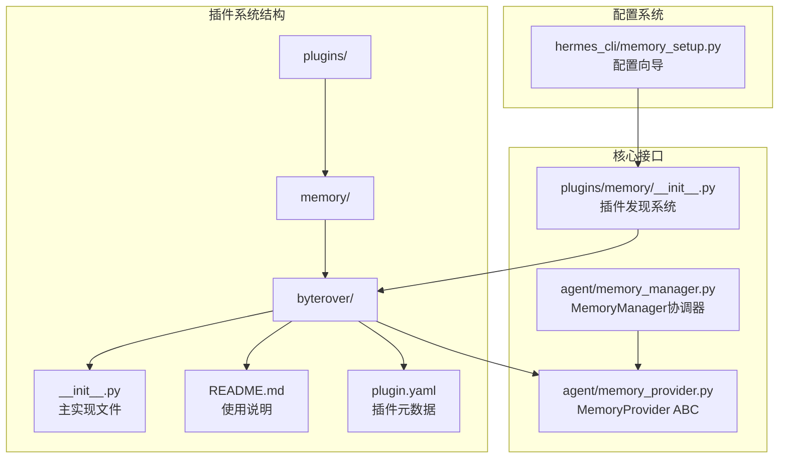
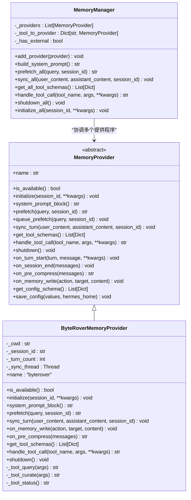
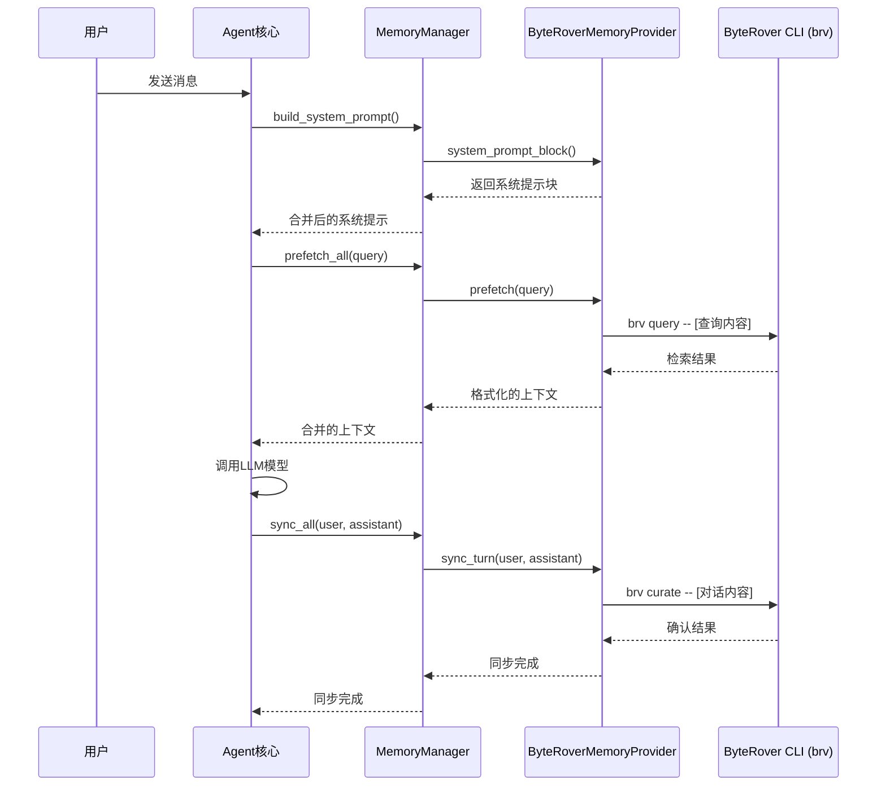
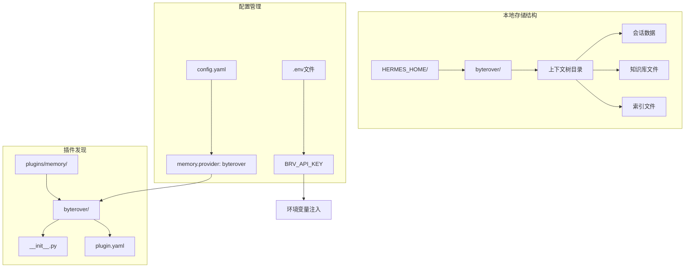
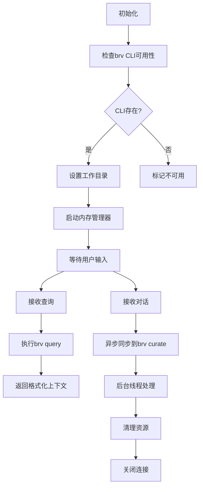
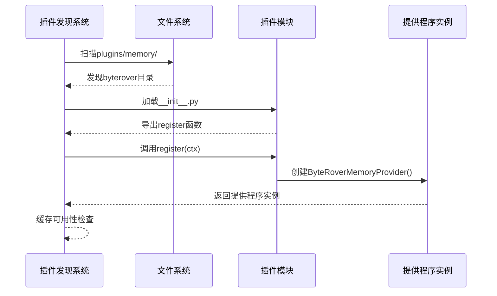
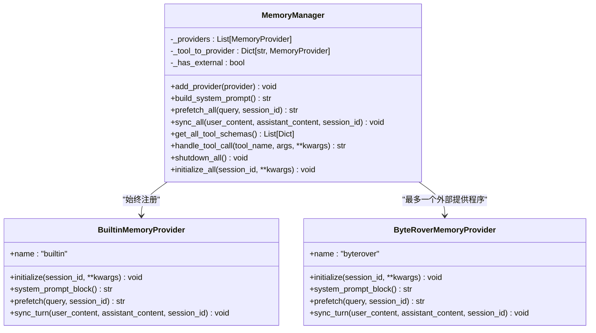
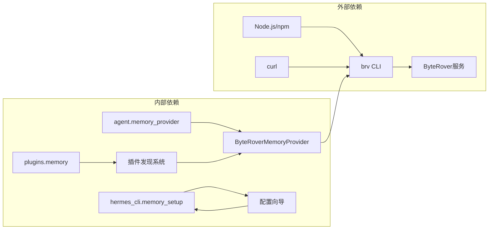
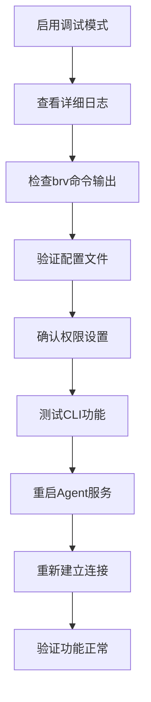

# Byterover记忆提供程序

<cite>
**本文档引用的文件**
- [plugins/memory/byterover/__init__.py](file://plugins/memory/byterover/__init__.py)
- [plugins/memory/byterover/README.md](file://plugins/memory/byterover/README.md)
- [plugins/memory/byterover/plugin.yaml](file://plugins/memory/byterover/plugin.yaml)
- [plugins/memory/__init__.py](file://plugins/memory/__init__.py)
- [agent/memory_provider.py](file://agent/memory_provider.py)
- [agent/memory_manager.py](file://agent/memory_manager.py)
- [hermes_cli/memory_setup.py](file://hermes_cli/memory_setup.py)
</cite>

## 目录
1. [简介](#简介)
2. [项目结构](#项目结构)
3. [核心组件](#核心组件)
4. [架构概览](#架构概览)
5. [详细组件分析](#详细组件分析)
6. [依赖关系分析](#依赖关系分析)
7. [性能考虑](#性能考虑)
8. [故障排除指南](#故障排除指南)
9. [结论](#结论)
10. [附录](#附录)

## 简介

Byterover记忆提供程序是Hermes Agent框架中的一个内存提供程序插件，它通过ByteRover CLI（brv）实现持久化记忆功能。该提供程序采用分层知识树结构，支持分级检索（模糊文本→基于LLM的搜索），具有本地优先特性，并可选地与云端同步。

该提供程序的核心特点包括：
- 基于ByteRover CLI的持久化记忆存储
- 分层上下文树组织知识
- 级联检索机制（先模糊匹配，后LLM驱动搜索）
- 本地优先的存储策略
- 可选的云同步功能
- 非阻塞的后台同步机制

## 项目结构

Byterover记忆提供程序位于Hermes Agent项目的插件系统中，采用标准的插件目录结构：



**图表来源**
- [plugins/memory/byterover/__init__.py:1-384](file://plugins/memory/byterover/__init__.py#L1-L384)
- [plugins/memory/__init__.py:1-318](file://plugins/memory/__init__.py#L1-L318)
- [agent/memory_provider.py:1-232](file://agent/memory_provider.py#L1-L232)

**章节来源**
- [plugins/memory/byterover/__init__.py:1-16](file://plugins/memory/byterover/__init__.py#L1-L16)
- [plugins/memory/byterover/README.md:1-42](file://plugins/memory/byterover/README.md#L1-L42)

## 核心组件

Byterover记忆提供程序由以下核心组件构成：

### 主要类结构



**图表来源**
- [agent/memory_provider.py:42-232](file://agent/memory_provider.py#L42-L232)
- [agent/memory_manager.py:72-363](file://agent/memory_manager.py#L72-L363)
- [plugins/memory/byterover/__init__.py:171-384](file://plugins/memory/byterover/__init__.py#L171-L384)

### 关键配置参数

| 参数名称 | 类型 | 默认值 | 描述 |
|---------|------|--------|------|
| api_key | 字符串 | 无 | ByteRover API密钥（可选，用于云同步） |
| BRV_API_KEY | 环境变量 | 无 | 通过环境变量配置API密钥 |

**章节来源**
- [plugins/memory/byterover/__init__.py:188-197](file://plugins/memory/byterover/__init__.py#L188-L197)
- [plugins/memory/byterover/README.md:27-31](file://plugins/memory/byterover/README.md#L27-L31)

## 架构概览

Byterover记忆提供程序采用插件化架构，与Hermes Agent的核心内存管理系统深度集成：



**图表来源**
- [agent/memory_manager.py:146-209](file://agent/memory_manager.py#L146-L209)
- [plugins/memory/byterover/__init__.py:215-262](file://plugins/memory/byterover/__init__.py#L215-L262)

### 存储架构



**图表来源**
- [plugins/memory/byterover/__init__.py:116-119](file://plugins/memory/byterover/__init__.py#L116-L119)
- [plugins/memory/byterover/plugin.yaml:1-10](file://plugins/memory/byterover/plugin.yaml#L1-L10)

**章节来源**
- [plugins/memory/byterover/__init__.py:116-119](file://plugins/memory/byterover/__init__.py#L116-L119)
- [plugins/memory/byterover/plugin.yaml:1-10](file://plugins/memory/byterover/plugin.yaml#L1-L10)

## 详细组件分析

### ByteRoverMemoryProvider类详解

ByteRoverMemoryProvider是Byterover记忆提供程序的核心实现，继承自MemoryProvider抽象基类。

#### 生命周期管理



**图表来源**
- [plugins/memory/byterover/__init__.py:199-203](file://plugins/memory/byterover/__init__.py#L199-L203)
- [plugins/memory/byterover/__init__.py:237-262](file://plugins/memory/byterover/__init__.py#L237-L262)

#### 工具调用实现

| 工具名称 | 功能描述 | 输入参数 | 输出格式 |
|---------|----------|----------|----------|
| brv_query | 搜索知识树中的相关内容 | query: 查询字符串 | JSON格式的结果对象 |
| brv_curate | 将重要信息存储到知识树 | content: 要记住的内容 | 成功/失败状态 |
| brv_status | 检查ByteRover状态 | 无 | CLI版本、树统计、同步状态 |

**章节来源**
- [plugins/memory/byterover/__init__.py:126-164](file://plugins/memory/byterover/__init__.py#L126-L164)
- [plugins/memory/byterover/__init__.py:314-324](file://plugins/memory/byterover/__init__.py#L314-L324)

### 插件发现和加载机制



**图表来源**
- [plugins/memory/__init__.py:32-75](file://plugins/memory/__init__.py#L32-L75)
- [plugins/memory/__init__.py:99-196](file://plugins/memory/__init__.py#L99-L196)

**章节来源**
- [plugins/memory/__init__.py:32-75](file://plugins/memory/__init__.py#L32-L75)
- [plugins/memory/__init__.py:99-196](file://plugins/memory/__init__.py#L99-L196)

### 内存管理器集成

MemoryManager负责协调内置内存提供程序和外部插件提供程序：



**图表来源**
- [agent/memory_manager.py:72-131](file://agent/memory_manager.py#L72-L131)
- [agent/memory_manager.py:345-363](file://agent/memory_manager.py#L345-L363)

**章节来源**
- [agent/memory_manager.py:72-131](file://agent/memory_manager.py#L72-L131)
- [agent/memory_manager.py:345-363](file://agent/memory_manager.py#L345-L363)

## 依赖关系分析

### 外部依赖

Byterover记忆提供程序的主要外部依赖是ByteRover CLI（brv）：



**图表来源**
- [plugins/memory/byterover/README.md:5-12](file://plugins/memory/byterover/README.md#L5-L12)
- [plugins/memory/byterover/plugin.yaml:4-7](file://plugins/memory/byterover/plugin.yaml#L4-L7)

### 环境变量配置

| 环境变量 | 必需性 | 描述 | 默认值 |
|---------|--------|------|--------|
| BRV_API_KEY | 可选 | ByteRover API密钥 | 无 |
| PATH | 必需 | 包含brv可执行文件的路径 | 系统PATH |

**章节来源**
- [plugins/memory/byterover/README.md:27-31](file://plugins/memory/byterover/README.md#L27-L31)
- [plugins/memory/byterover/__init__.py:12-15](file://plugins/memory/byterover/__init__.py#L12-L15)

## 性能考虑

### 时间复杂度分析

Byterover记忆提供程序的性能特征主要取决于以下因素：

1. **查询性能**：O(log n) 到 O(n) 取决于知识树大小和查询复杂度
2. **同步性能**：O(m) 其中m是对话内容长度
3. **内存占用**：O(k) 其中k是存储的知识条目数量

### 优化策略

#### 后台同步机制
- 使用守护线程处理brv curate操作
- 实现线程安全的同步队列
- 支持超时控制和错误恢复

#### 缓存策略
- 实现brv路径解析缓存
- 使用最小长度过滤减少噪声
- 结果截断防止过度内存使用

#### 并发控制
- 线程锁保护共享资源
- 同步线程生命周期管理
- 异常处理确保稳定性

**章节来源**
- [plugins/memory/byterover/__init__.py:47-75](file://plugins/memory/byterover/__init__.py#L47-L75)
- [plugins/memory/byterover/__init__.py:245-262](file://plugins/memory/byterover/__init__.py#L245-L262)

## 故障排除指南

### 常见问题及解决方案

#### 1. brv CLI未找到
**症状**：`brv CLI not found. Install: npm install -g byterover-cli`
**解决方案**：
- 安装ByteRover CLI：`curl -fsSL https://byterover.dev/install.sh | sh`
- 或者：`npm install -g byterover-cli`
- 验证安装：`brv --version`

#### 2. 权限问题
**症状**：`Permission denied` 或 `Operation not permitted`
**解决方案**：
- 确保用户对HERMES_HOME目录有写权限
- 检查防火墙设置
- 验证API密钥有效性

#### 3. 网络连接问题
**症状**：查询超时或同步失败
**解决方案**：
- 检查网络连接状态
- 配置代理设置（如需要）
- 增加超时时间

#### 4. 存储空间不足
**症状**：`No space left on device`
**解决方案**：
- 清理不必要的历史数据
- 扩展磁盘空间
- 配置自动清理策略

**章节来源**
- [plugins/memory/byterover/__init__.py:80-113](file://plugins/memory/byterover/__init__.py#L80-L113)
- [plugins/memory/byterover/README.md:5-12](file://plugins/memory/byterover/README.md#L5-L12)

### 日志和调试

Byterover记忆提供程序提供了详细的日志记录机制：



**章节来源**
- [plugins/memory/byterover/__init__.py:32-33](file://plugins/memory/byterover/__init__.py#L32-L33)

## 结论

Byterover记忆提供程序为Hermes Agent框架提供了一个强大而灵活的记忆解决方案。其核心优势包括：

### 主要优势
1. **持久化存储**：基于ByteRover CLI的可靠持久化机制
2. **智能检索**：分层知识树支持高效的模糊匹配和LLM驱动搜索
3. **本地优先**：默认本地存储，确保数据隐私和访问速度
4. **云同步**：可选的云端同步功能，支持多设备访问
5. **非阻塞设计**：后台线程处理确保用户体验流畅

### 适用场景
- 需要长期记忆的AI助手应用
- 需要跨会话保持上下文的复杂对话系统
- 对数据隐私要求较高的企业级应用
- 需要智能知识管理的开发团队

### 局限性
- 依赖外部CLI工具，增加了部署复杂度
- 网络同步可能影响响应时间
- 存储空间需求随时间增长
- 需要定期维护和备份

## 附录

### 安装和配置指南

#### 快速安装
```bash
# 安装ByteRover CLI
curl -fsSL https://byterover.dev/install.sh | sh
# 或者
npm install -g byterover-cli

# 设置Hermes配置
hermes memory setup    # 选择"byterover"
```

#### 手动配置
```bash
# 设置内存提供程序
hermes config set memory.provider byterover

# 可选：配置API密钥
echo "BRV_API_KEY=your-key" >> ~/.hermes/.env
```

#### 验证安装
```bash
# 检查状态
hermes memory status

# 测试功能
hermes memory byterover status
```

**章节来源**
- [plugins/memory/byterover/README.md:14-25](file://plugins/memory/byterover/README.md#L14-L25)
- [hermes_cli/memory_setup.py:219-250](file://hermes_cli/memory_setup.py#L219-L250)

### API参考

#### 工具调用API

| 工具名称 | HTTP方法 | 请求体 | 响应示例 |
|---------|----------|--------|----------|
| brv_query | POST | `{"query": "string"}` | `{"result": "检索结果"}` |
| brv_curate | POST | `{"content": "string"}` | `{"result": "存储成功"}` |
| brv_status | GET | 无 | `{"status": "状态信息"}` |

#### 配置选项

| 选项名称 | 类型 | 默认值 | 描述 |
|---------|------|--------|------|
| api_key | string | 无 | ByteRover API密钥 |
| hermes_home | string | `$HOME/.hermes` | Heremes主目录 |
| session_id | string | 无 | 会话标识符 |
| platform | string | `"cli"` | 运行平台类型 |

**章节来源**
- [plugins/memory/byterover/__init__.py:188-197](file://plugins/memory/byterover/__init__.py#L188-L197)
- [plugins/memory/byterover/__init__.py:314-324](file://plugins/memory/byterover/__init__.py#L314-L324)