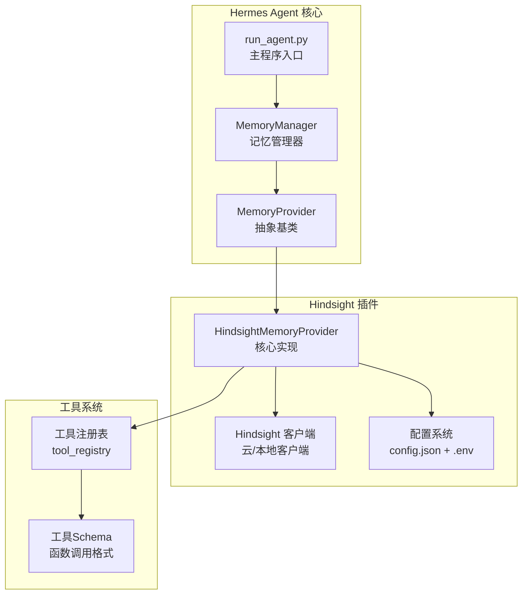
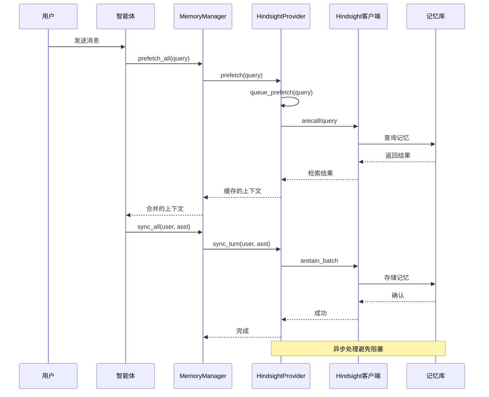
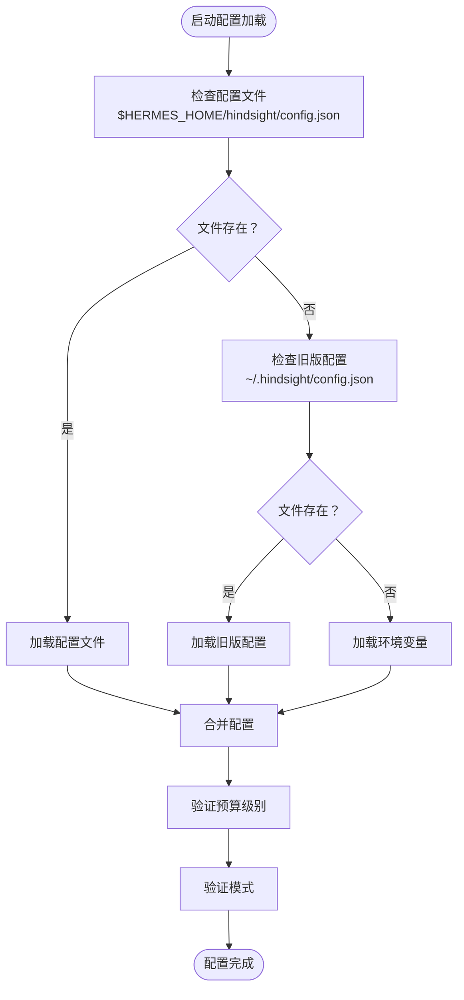
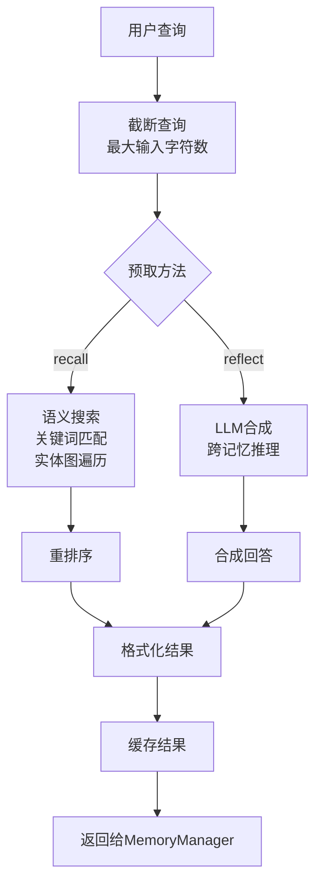
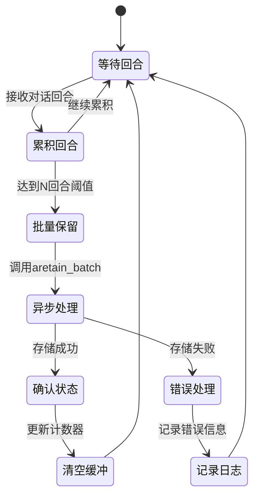
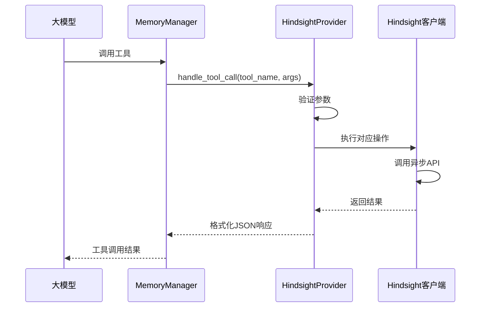
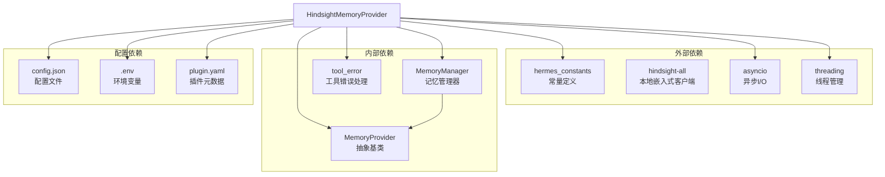
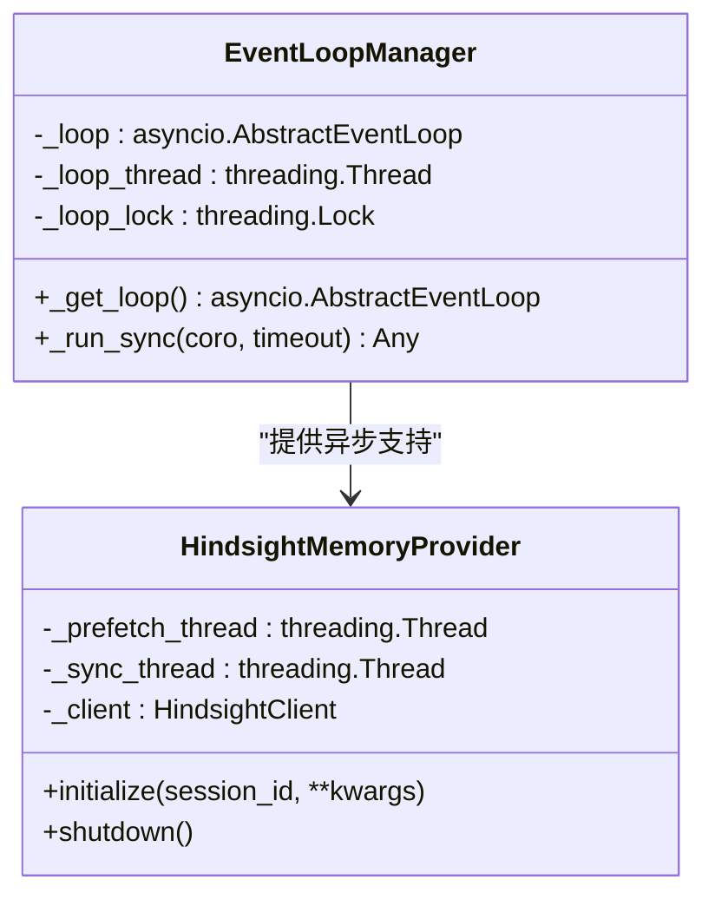

# Hindsight记忆提供程序

<cite>
**本文档引用的文件**
- [README.md](file://plugins/memory/hindsight/README.md)
- [__init__.py](file://plugins/memory/hindsight/__init__.py)
- [plugin.yaml](file://plugins/memory/hindsight/plugin.yaml)
- [memory_manager.py](file://agent/memory_manager.py)
- [memory_provider.py](file://agent/memory_provider.py)
- [run_agent.py](file://run_agent.py)
- [__init__.py](file://plugins/memory/__init__.py)
- [memory_setup.py](file://hermes_cli/memory_setup.py)
- [test_hindsight_provider.py](file://tests/plugins/memory/test_hindsight_provider.py)
</cite>

## 目录
1. [简介](#简介)
2. [项目结构](#项目结构)
3. [核心组件](#核心组件)
4. [架构概览](#架构概览)
5. [详细组件分析](#详细组件分析)
6. [依赖关系分析](#依赖关系分析)
7. [性能考虑](#性能考虑)
8. [故障排除指南](#故障排除指南)
9. [结论](#结论)
10. [附录](#附录)

## 简介

Hindsight记忆提供程序是Hermes Agent框架中的一个强大长期记忆解决方案，基于知识图谱、实体解析和多策略检索技术。该提供程序支持云服务、本地嵌入式和本地外部三种部署模式，为智能体提供了跨会话的持久记忆能力。

Hindsight的核心特性包括：
- **多策略检索**：结合语义搜索、关键词匹配、实体图遍历和重排序
- **知识图谱**：自动提取结构化事实，解析实体关系
- **因果分析**：支持历史事件记录和经验学习机制
- **模式识别**：从记忆中提取模式和知识
- **智能决策支持**：为决策提供历史背景和经验参考

## 项目结构

Hindsight记忆提供程序位于Hermes Agent项目的插件系统中，采用模块化设计：



**图表来源**
- [memory_manager.py:72-131](file://agent/memory_manager.py#L72-L131)
- [memory_provider.py:42-82](file://agent/memory_provider.py#L42-L82)
- [run_agent.py:1148-1182](file://run_agent.py#L1148-L1182)

**章节来源**
- [plugin.yaml:1-9](file://plugins/memory/hindsight/plugin.yaml#L1-L9)
- [__init__.py:1-884](file://plugins/memory/hindsight/__init__.py#L1-L884)

## 核心组件

### HindsightMemoryProvider 类

这是Hindsight记忆提供程序的核心实现，继承自MemoryProvider抽象基类。主要功能包括：

#### 配置管理
- 支持多种配置源：配置文件、环境变量、命令行参数
- 自动版本检查和升级
- 多模式支持（云、本地嵌入式、本地外部）

#### 记忆检索
- **自动预取**：在每轮对话前自动检索相关记忆
- **多策略搜索**：语义搜索、关键词匹配、实体图遍历
- **结果重排序**：提高检索质量

#### 记忆存储
- **批量保留**：支持批量存储对话回合
- **异步处理**：后台异步处理减少延迟
- **去重机制**：基于文档ID确保数据完整性

#### 工具集成
- **hindsight_retain**：存储信息到长期记忆
- **hindsight_recall**：多策略搜索记忆
- **hindsight_reflect**：跨记忆合成

**章节来源**
- [__init__.py:185-232](file://plugins/memory/hindsight/__init__.py#L185-L232)
- [__init__.py:439-467](file://plugins/memory/hindsight/__init__.py#L439-L467)

## 架构概览

Hindsight记忆提供程序采用分层架构设计，与Hermes Agent框架深度集成：



**图表来源**
- [memory_manager.py:167-209](file://agent/memory_manager.py#L167-L209)
- [__init__.py:654-714](file://plugins/memory/hindsight/__init__.py#L654-L714)
- [__init__.py:715-773](file://plugins/memory/hindsight/__init__.py#L715-L773)

## 详细组件分析

### 配置系统

Hindsight提供程序实现了灵活的配置系统，支持多种配置源：



**图表来源**
- [__init__.py:142-179](file://plugins/memory/hindsight/__init__.py#L142-L179)

配置选项包括：

| 分类 | 键名 | 默认值 | 描述 |
|------|------|--------|------|
| 连接 | mode | cloud | 连接模式：cloud/local_embedded/local_external |
| 连接 | api_url | https://api.hindsight.vectorize.io | API端点URL |
| 内存库 | bank_id | hermes | 记忆库标识符 |
| 内存库 | bank_mission | - | 记忆库使命描述 |
| 检索 | recall_budget | mid | 检索彻底性：low/mid/high |
| 检索 | recall_prefetch_method | recall | 预取方法：recall/reflect |
| 检索 | auto_recall | true | 自动检索 |
| 保留 | auto_retain | true | 自动保留 |
| 保留 | retain_async | true | 异步保留 |
| 集成 | memory_mode | hybrid | 集成模式：hybrid/context/tools |

**章节来源**
- [README.md:47-135](file://plugins/memory/hindsight/README.md#L47-L135)
- [__init__.py:406-437](file://plugins/memory/hindsight/__init__.py#L406-L437)

### 记忆检索机制

Hindsight实现了多策略的记忆检索机制：



**图表来源**
- [__init__.py:654-714](file://plugins/memory/hindsight/__init__.py#L654-L714)
- [__init__.py:683-713](file://plugins/memory/hindsight/__init__.py#L683-L713)

检索流程的关键特性：
- **自动预取**：每轮对话前自动执行
- **查询截断**：防止过长查询影响性能
- **多策略融合**：根据配置选择最佳策略
- **结果缓存**：避免重复检索

**章节来源**
- [__init__.py:672-714](file://plugins/memory/hindsight/__init__.py#L672-L714)

### 记忆保留机制

Hindsight提供了智能的记忆保留机制：



**图表来源**
- [__init__.py:715-773](file://plugins/memory/hindsight/__init__.py#L715-L773)

保留机制的关键特性：
- **批量处理**：支持批量存储多个回合
- **异步处理**：避免阻塞主线程
- **去重机制**：基于会话ID确保唯一性
- **错误恢复**：非阻塞设计，失败不影响主流程

**章节来源**
- [__init__.py:715-773](file://plugins/memory/hindsight/__init__.py#L715-L773)

### 工具接口

Hindsight提供了三个核心工具接口：

| 工具名称 | 功能描述 | 参数 | 返回值 |
|----------|----------|------|--------|
| hindsight_retain | 存储信息到长期记忆 | content(必需), context(可选) | JSON字符串，包含存储结果 |
| hindsight_recall | 多策略搜索记忆 | query(必需) | JSON字符串，包含检索结果列表 |
| hindsight_reflect | 跨记忆合成 | query(必需) | JSON字符串，包含合成答案 |

工具调用流程：



**图表来源**
- [memory_manager.py:238-257](file://agent/memory_manager.py#L238-L257)
- [__init__.py:779-849](file://plugins/memory/hindsight/__init__.py#L779-L849)

**章节来源**
- [__init__.py:91-135](file://plugins/memory/hindsight/__init__.py#L91-L135)
- [__init__.py:779-849](file://plugins/memory/hindsight/__init__.py#L779-L849)

## 依赖关系分析

Hindsight记忆提供程序的依赖关系如下：



**图表来源**
- [plugin.yaml:4-6](file://plugins/memory/hindsight/plugin.yaml#L4-L6)
- [__init__.py:27-34](file://plugins/memory/hindsight/__init__.py#L27-L34)

**章节来源**
- [plugin.yaml:1-9](file://plugins/memory/hindsight/plugin.yaml#L1-L9)
- [__init__.py:1-884](file://plugins/memory/hindsight/__init__.py#L1-L884)

## 性能考虑

### 异步事件循环管理

Hindsight实现了专用的异步事件循环管理，避免资源泄漏：



**图表来源**
- [__init__.py:63-84](file://plugins/memory/hindsight/__init__.py#L63-L84)
- [__init__.py:58-78](file://plugins/memory/hindsight/__init__.py#L58-L78)

### 线程安全设计

Hindsight采用了多线程安全的设计模式：

- **全局事件循环**：单例模式确保资源复用
- **线程锁保护**：防止竞态条件
- **异步客户端**：避免阻塞主线程
- **后台线程**：独立处理网络请求

### 内存优化

- **结果缓存**：避免重复检索相同内容
- **批量处理**：减少网络往返次数
- **异步写入**：不阻塞对话流程
- **资源清理**：优雅关闭连接和线程

## 故障排除指南

### 常见问题及解决方案

#### 1. 客户端版本兼容性问题

**症状**：启动时出现版本警告或功能异常

**解决方案**：
- 使用uv自动升级到最低版本要求
- 检查网络连接和代理设置
- 验证Python环境和包管理器

#### 2. 认证失败

**症状**：无法连接到Hindsight服务

**解决方案**：
- 验证API密钥的有效性
- 检查网络连接和防火墙设置
- 确认服务端点URL正确性
- 对于本地模式，检查LLM提供商配置

#### 3. 记忆检索无结果

**症状**：hindsight_recall返回空结果

**解决方案**：
- 检查检索预算设置（low/mid/high）
- 验证标签过滤条件
- 确认记忆库已正确初始化
- 检查网络连接状态

#### 4. 工具调用错误

**症状**：工具返回错误信息

**解决方案**：
- 验证必需参数是否提供
- 检查工具名称拼写
- 确认工具在当前模式下可用
- 查看详细的错误日志

**章节来源**
- [__init__.py:472-496](file://plugins/memory/hindsight/__init__.py#L472-L496)
- [test_hindsight_provider.py:298-312](file://tests/plugins/memory/test_hindsight_provider.py#L298-L312)

### 日志和调试

Hindsight提供了详细的日志记录机制：

- **初始化日志**：记录配置加载和客户端创建
- **检索日志**：记录查询参数和结果数量
- **错误日志**：记录异常和故障信息
- **性能日志**：记录处理时间和资源使用

## 结论

Hindsight记忆提供程序为Hermes Agent框架提供了强大的长期记忆能力。通过多策略检索、智能预取和批量保留机制，它能够有效支持智能体的持续学习和决策制定。

### 主要优势

1. **多模式支持**：灵活的部署选项适应不同需求
2. **高性能设计**：异步处理和缓存机制确保流畅体验
3. **智能集成**：与Hermes Agent框架深度集成
4. **可扩展性**：模块化设计便于功能扩展

### 应用场景

- **智能客服**：记住客户历史和偏好
- **教育助手**：跟踪学习进度和知识点掌握情况
- **研究助理**：积累领域知识和文献信息
- **创意写作**：维护角色设定和故事背景

### 未来发展方向

- **增强学习**：集成更先进的机器学习算法
- **多模态支持**：扩展到图像、音频等多模态数据
- **隐私保护**：加强数据安全和隐私保护机制
- **性能优化**：进一步提升检索和存储性能

## 附录

### 配置示例

#### 云模式配置
```json
{
  "mode": "cloud",
  "apiKey": "your-api-key",
  "api_url": "https://api.hindsight.vectorize.io",
  "bank_id": "hermes",
  "recall_budget": "mid"
}
```

#### 本地嵌入式配置
```json
{
  "mode": "local_embedded",
  "llm_provider": "openai",
  "llm_model": "gpt-4o-mini",
  "llm_api_key": "your-llm-key",
  "bank_id": "hermes"
}
```

#### 本地外部配置
```json
{
  "mode": "local_external",
  "api_url": "http://localhost:8888",
  "bank_id": "hermes"
}
```

### 集成步骤

1. **安装依赖**：运行 `hermes memory setup`
2. **选择模式**：在交互式界面中选择部署模式
3. **配置参数**：根据提示输入必要的配置信息
4. **验证连接**：测试与Hindsight服务的连接
5. **开始使用**：在智能体中启用记忆功能

### 最佳实践

- **合理设置预算**：根据性能需求调整检索预算
- **使用标签**：为记忆添加有意义的标签便于检索
- **定期维护**：清理不需要的记忆数据
- **监控性能**：关注检索延迟和存储使用情况