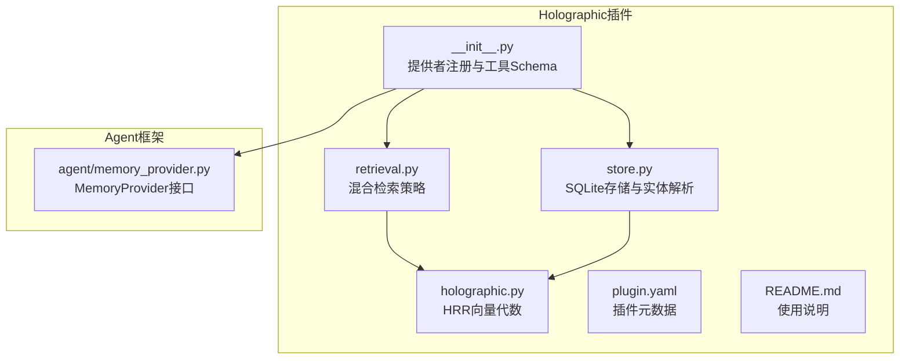
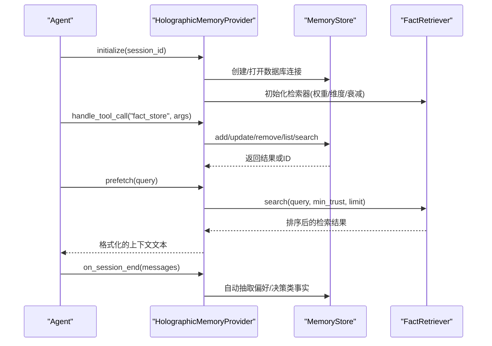
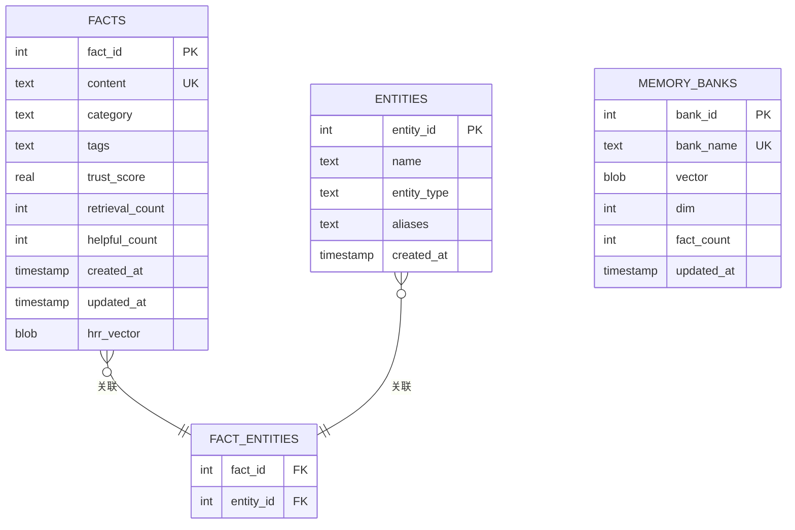
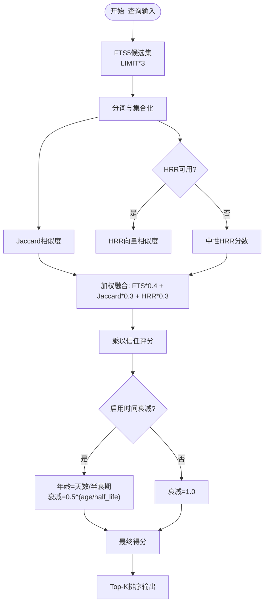
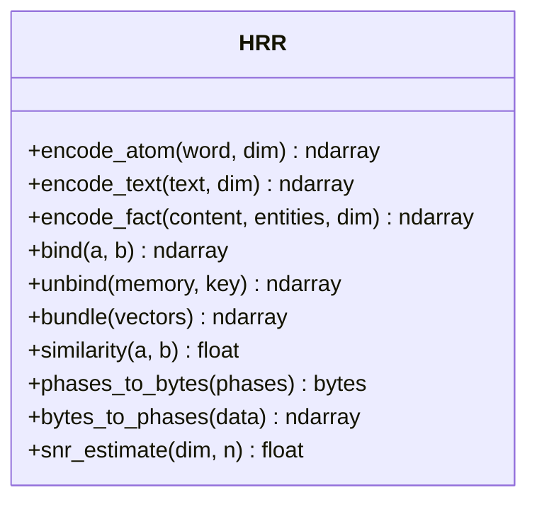
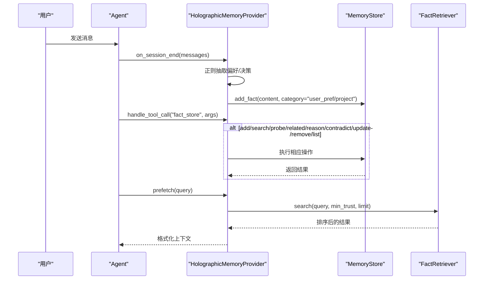
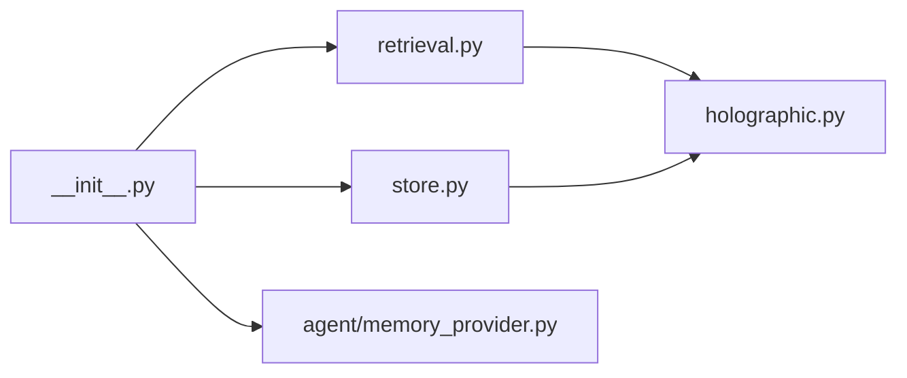

# Holographic记忆提供程序

<cite>
**本文档引用的文件**
- [plugins/memory/holographic/__init__.py](file://plugins/memory/holographic/__init__.py)
- [plugins/memory/holographic/holographic.py](file://plugins/memory/holographic/holographic.py)
- [plugins/memory/holographic/retrieval.py](file://plugins/memory/holographic/retrieval.py)
- [plugins/memory/holographic/store.py](file://plugins/memory/holographic/store.py)
- [plugins/memory/holographic/plugin.yaml](file://plugins/memory/holographic/plugin.yaml)
- [plugins/memory/holographic/README.md](file://plugins/memory/holographic/README.md)
- [agent/memory_provider.py](file://agent/memory_provider.py)
- [plugins/memory/honcho/__init__.py](file://plugins/memory/honcho/__init__.py)
- [plugins/memory/hindsight/__init__.py](file://plugins/memory/hindsight/__init__.py)
</cite>

## 目录
1. [简介](#简介)
2. [项目结构](#项目结构)
3. [核心组件](#核心组件)
4. [架构总览](#架构总览)
5. [详细组件分析](#详细组件分析)
6. [依赖关系分析](#依赖关系分析)
7. [性能考虑](#性能考虑)
8. [故障排除指南](#故障排除指南)
9. [结论](#结论)
10. [附录](#附录)

## 简介
本文件为Holographic记忆提供程序的技术文档，面向需要在Hermes Agent中集成本地化、可组合、可推理的记忆系统的工程师与使用者。该插件以SQLite为后端，结合FTS5全文检索、实体解析、信任评分机制以及HRR（Holographic Reduced Representation）向量空间检索，提供结构化事实存储与多策略检索能力。

- 本地持久：SQLite数据库，无需网络依赖
- 结构化检索：关键词+Jaccard重排+信任加权+可选时间衰减
- 组合推理：基于相量代数的HRR，支持实体探测、邻接发现、多实体合取推理
- 可信度学习：用户反馈驱动的信任评分更新
- 自动抽取：会话结束时按规则自动提取偏好与决策类事实

## 项目结构
Holographic插件位于plugins/memory/holographic目录，核心文件如下：
- 插件入口与提供者实现：__init__.py
- HRR向量代数与序列化：holographic.py
- 检索器：retrieval.py（FTS5 + Jaccard + HRR + 信任加权）
- 存储层：store.py（SQLite建表、触发器、实体解析、HRR向量计算与记忆仓）
- 插件元数据：plugin.yaml
- 使用说明：README.md
- 与通用MemoryProvider接口对接：agent/memory_provider.py
- 对比参考：Honcho与Hindsight插件实现

**图表来源**
- [plugins/memory/holographic/__init__.py:114-180](file://plugins/memory/holographic/__init__.py#L114-L180)
- [plugins/memory/holographic/holographic.py:43-161](file://plugins/memory/holographic/holographic.py#L43-L161)
- [plugins/memory/holographic/retrieval.py:22-113](file://plugins/memory/holographic/retrieval.py#L22-L113)
- [plugins/memory/holographic/store.py:98-185](file://plugins/memory/holographic/store.py#L98-L185)
- [agent/memory_provider.py:42-141](file://agent/memory_provider.py#L42-L141)

**章节来源**
- [plugins/memory/holographic/__init__.py:1-408](file://plugins/memory/holographic/__init__.py#L1-L408)
- [plugins/memory/holographic/holographic.py:1-204](file://plugins/memory/holographic/holographic.py#L1-L204)
- [plugins/memory/holographic/retrieval.py:1-594](file://plugins/memory/holographic/retrieval.py#L1-L594)
- [plugins/memory/holographic/store.py:1-575](file://plugins/memory/holographic/store.py#L1-L575)
- [plugins/memory/holographic/plugin.yaml:1-6](file://plugins/memory/holographic/plugin.yaml#L1-L6)
- [plugins/memory/holographic/README.md:1-37](file://plugins/memory/holographic/README.md#L1-L37)
- [agent/memory_provider.py:1-232](file://agent/memory_provider.py#L1-L232)

## 核心组件
- HolographicMemoryProvider：实现MemoryProvider接口，负责生命周期管理、工具Schema暴露、工具调用分发、会话结束自动抽取等
- MemoryStore：SQLite存储层，负责事实写入、实体解析与链接、HRR向量计算与记忆仓重建、信任评分更新
- FactRetriever：检索器，融合FTS5、Jaccard相似度、HRR向量相似度与信任评分，并支持时间衰减
- HRR向量代数：基于相位向量的绑定、解绑、合并与相似度计算，提供组合式推理能力

**章节来源**
- [plugins/memory/holographic/__init__.py:114-355](file://plugins/memory/holographic/__init__.py#L114-L355)
- [plugins/memory/holographic/store.py:98-557](file://plugins/memory/holographic/store.py#L98-L557)
- [plugins/memory/holographic/retrieval.py:22-594](file://plugins/memory/holographic/retrieval.py#L22-L594)
- [plugins/memory/holographic/holographic.py:43-204](file://plugins/memory/holographic/holographic.py#L43-L204)

## 架构总览
Holographic提供程序通过MemoryProvider接口接入Agent，内部由存储层与检索层协作完成事实的持久化、实体解析、向量化与检索。其核心流程包括：
- 初始化：加载配置，建立SQLite连接，初始化WAL模式与FTS5触发器
- 写入：add_fact去重插入，提取实体并建立fact_entities关联，计算HRR向量，重建对应分类的记忆仓
- 检索：search/probe/related/reason/contradict多策略组合，FTS5候选+Jaccard重排+HRR相似度+信任加权
- 反馈：record_feedback根据用户反馈调整信任评分
- 自动抽取：on_session_end按正则规则从对话中抽取偏好与决策类内容

**图表来源**
- [plugins/memory/holographic/__init__.py:157-254](file://plugins/memory/holographic/__init__.py#L157-L254)
- [plugins/memory/holographic/store.py:142-347](file://plugins/memory/holographic/store.py#L142-L347)
- [plugins/memory/holographic/retrieval.py:48-113](file://plugins/memory/holographic/retrieval.py#L48-L113)

## 详细组件分析

### 存储层（MemoryStore）
- 数据模型
  - facts：事实表，含content唯一约束、category、tags、trust_score、计数字段、时间戳、HRR向量BLOB
  - entities：实体表，含别名列表
  - fact_entities：事实-实体多对多关联
  - facts_fts：FTS5虚拟表，自动同步facts内容
  - memory_banks：分类级记忆仓，存储该分类下所有事实向量的合并结果
- 实体解析
  - 通过正则提取“人名”“引号短语”“aka”等候选实体，支持别名匹配
  - 去重并建立fact_entities关联
- HRR向量
  - 为每个事实生成content绑定ROLE_CONTENT与各实体绑定ROLE_ENTITY的复合向量
  - 分类重建memory_banks，用于快速实体探测与相关性评分
- 信任评分
  - 初始默认值可配置；record_feedback按规则提升/降低信任，限制在[0,1]
- FTS5触发器
  - 自动维护FTS5索引，保证全文检索一致性

**图表来源**
- [plugins/memory/holographic/store.py:16-76](file://plugins/memory/holographic/store.py#L16-L76)

**章节来源**
- [plugins/memory/holographic/store.py:16-76](file://plugins/memory/holographic/store.py#L16-L76)
- [plugins/memory/holographic/store.py:98-557](file://plugins/memory/holographic/store.py#L98-L557)

### 检索层（FactRetriever）
- 混合检索管线
  - FTS5候选：LIMIT*3获取候选集，利用SQLite内置rank排序
  - Jaccard重排：基于查询词与内容/标签的词集交并比
  - HRR相似度：当可用时，将查询编码为向量并与事实向量计算相位余弦相似度
  - 信任加权：最终得分乘以trust_score
  - 时间衰减：可选指数衰减因子，半衰期可配置
- 多策略检索
  - search：关键词+重排+信任+衰减
  - probe：针对实体的组合式探测，解绑实体角色得到内容信号
  - related：发现与实体共享结构连接的事实（邻接发现）
  - reason：多实体合取推理（AND），要求每个实体都在结构上存在
  - contradict：基于实体重叠与内容向量相似度的潜在矛盾检测
- 权重分配
  - 默认权重：FTS5 0.4、Jaccard 0.3、HRR 0.3；若无NumPy则自动调整为FTS5 0.6、Jaccard 0.4、HRR 0.0

**图表来源**
- [plugins/memory/holographic/retrieval.py:48-113](file://plugins/memory/holographic/retrieval.py#L48-L113)
- [plugins/memory/holographic/retrieval.py:114-191](file://plugins/memory/holographic/retrieval.py#L114-L191)
- [plugins/memory/holographic/retrieval.py:192-337](file://plugins/memory/holographic/retrieval.py#L192-L337)
- [plugins/memory/holographic/retrieval.py:338-443](file://plugins/memory/holographic/retrieval.py#L338-L443)

**章节来源**
- [plugins/memory/holographic/retrieval.py:22-594](file://plugins/memory/holographic/retrieval.py#L22-L594)

### HRR向量代数（holographic.py）
- 相位向量编码：以SHA-256块生成确定性相位，避免随机性导致的不一致
- 向量运算
  - bind：两向量相位相加，实现概念绑定
  - unbind：两向量相位相减，实现概念解绑
  - bundle：多个向量的复指数平均，实现概念合并
  - similarity：相位余弦相似度，范围[-1,1]
- 文本与事实编码
  - encode_text：词袋模型，对每个token进行原子编码并bundle
  - encode_fact：content绑定到ROLE_CONTENT，每个实体绑定到ROLE_ENTITY，再bundle
- 序列化
  - phases_to_bytes/bytes_to_phases：向量与字节串互转，便于存入SQLite BLOB

**图表来源**
- [plugins/memory/holographic/holographic.py:43-204](file://plugins/memory/holographic/holographic.py#L43-L204)

**章节来源**
- [plugins/memory/holographic/holographic.py:1-204](file://plugins/memory/holographic/holographic.py#L1-L204)

### 提供者实现（HolographicMemoryProvider）
- 生命周期
  - initialize：解析配置，创建MemoryStore与FactRetriever实例
  - system_prompt_block：动态提示块，显示当前事实总数与功能指引
  - prefetch：基于检索器返回前几轮的高可信度事实摘要
  - on_session_end：按正则抽取偏好与决策类内容，自动添加为事实
  - on_memory_write：镜像内置记忆写入为user_pref类事实
- 工具Schema
  - fact_store：add/search/probe/related/reason/contradict/update/remove/list
  - fact_feedback：rate helpful/unhelpful，训练信任评分
- 配置项
  - db_path、auto_extract、default_trust、hrr_dim、hrr_weight、temporal_decay_half_life

**图表来源**
- [plugins/memory/holographic/__init__.py:226-355](file://plugins/memory/holographic/__init__.py#L226-L355)
- [plugins/memory/holographic/__init__.py:358-397](file://plugins/memory/holographic/__init__.py#L358-L397)

**章节来源**
- [plugins/memory/holographic/__init__.py:96-255](file://plugins/memory/holographic/__init__.py#L96-L255)

## 依赖关系分析
- 内部依赖
  - __init__.py依赖store与retrieval模块
  - retrieval依赖holographic进行向量运算
  - store依赖holographic进行向量计算与记忆仓重建
- 外部依赖
  - SQLite（内置）、FTS5（SQLite扩展）、可选NumPy（HRR向量运算）
- 与Agent框架的耦合
  - 实现MemoryProvider接口，遵循统一生命周期与钩子约定

**图表来源**
- [plugins/memory/holographic/__init__.py:25-28](file://plugins/memory/holographic/__init__.py#L25-L28)
- [plugins/memory/holographic/retrieval.py:16-20](file://plugins/memory/holographic/retrieval.py#L16-L20)
- [plugins/memory/holographic/store.py:11-14](file://plugins/memory/holographic/store.py#L11-L14)

**章节来源**
- [plugins/memory/holographic/__init__.py:1-408](file://plugins/memory/holographic/__init__.py#L1-L408)
- [agent/memory_provider.py:42-141](file://agent/memory_provider.py#L42-L141)

## 性能考虑
- SQLite与WAL
  - 启用WAL模式，提高并发读写性能
  - 事务采用BEGIN IMMEDIATE，配合抖动重试减少锁竞争
- FTS5全文检索
  - 通过MATCH与rank排序，候选集LIMIT*3，再经Jaccard与HRR重排，平衡召回与效率
- HRR向量
  - 维度hrr_dim影响存储与检索精度；SNR估计用于容量预警
  - 当无NumPy时，自动降级为纯FTS5+Jaccard策略
- 记忆仓
  - 按分类重建memory_banks，加速实体探测与相关性评分
- 时间衰减
  - 可选半衰期参数，避免过旧事实干扰当前检索

[本节为通用性能讨论，不直接分析具体文件]

## 故障排除指南
- 无法导入NumPy
  - 现象：HRR相关检索退化为FTS5+Jaccard
  - 处理：安装NumPy或忽略HRR特性
- FTS5查询异常
  - 现象：检索返回空或报错
  - 处理：检查查询语法，确认FTS5触发器正常工作
- HRR存储接近容量
  - 现象：日志警告SNR下降
  - 处理：增大hrr_dim或清理历史事实
- 信任评分异常
  - 现象：反馈无效或越界
  - 处理：确认fact_id存在且在有效范围内
- 自动抽取未生效
  - 现象：会话结束未新增事实
  - 处理：检查auto_extract开关与正则匹配

**章节来源**
- [plugins/memory/holographic/retrieval.py:38-46](file://plugins/memory/holographic/retrieval.py#L38-L46)
- [plugins/memory/holographic/holographic.py:179-204](file://plugins/memory/holographic/holographic.py#L179-L204)
- [plugins/memory/holographic/store.py:349-389](file://plugins/memory/holographic/store.py#L349-L389)
- [plugins/memory/holographic/__init__.py:358-397](file://plugins/memory/holographic/__init__.py#L358-L397)

## 结论
Holographic记忆提供程序以SQLite为底座，结合FTS5、实体解析、信任评分与HRR向量代数，实现了结构化、可组合、可解释的记忆系统。它适合需要本地化、可控性与推理能力的场景，尤其在需要跨实体合取推理与潜在矛盾检测时具有独特优势。对于大规模向量检索需求，可考虑Honcho或Hindsight等云端/本地嵌入式方案。

[本节为总结性内容，不直接分析具体文件]

## 附录

### 安装与配置
- 选择提供程序
  - CLI：hermes memory setup，选择holographic
  - 或手动设置：hermes config set memory.provider holographic
- 配置文件位置：$HERMES_HOME/config.yaml中的plugins.hermes-memory-store
- 关键配置
  - db_path：SQLite路径，默认$HERMES_HOME/memory_store.db
  - auto_extract：会话结束自动抽取偏好/决策类事实
  - default_trust：新事实初始信任分
  - hrr_dim：HRR向量维度
  - hrr_weight/temporal_decay_half_life：HRR权重与时间衰减半衰期

**章节来源**
- [plugins/memory/holographic/README.md:9-37](file://plugins/memory/holographic/README.md#L9-L37)
- [plugins/memory/holographic/__init__.py:96-156](file://plugins/memory/holographic/__init__.py#L96-L156)

### API与工具
- fact_store（动作：add/search/probe/related/reason/contradict/update/remove/list）
- fact_feedback（动作：helpful/unhelpful）
- 系统提示块：显示当前事实数量与使用指引
- 预取：prefetch(query)返回高可信度事实摘要

**章节来源**
- [plugins/memory/holographic/__init__.py:37-90](file://plugins/memory/holographic/__init__.py#L37-L90)
- [plugins/memory/holographic/__init__.py:182-228](file://plugins/memory/holographic/__init__.py#L182-L228)
- [plugins/memory/holographic/__init__.py:205-220](file://plugins/memory/holographic/__init__.py#L205-L220)

### 与其他记忆提供程序的差异
- 与Honcho对比
  - Honcho强调用户画像与对话式推理，支持上下文注入与工具调用；Holographic强调结构化事实与组合式检索
- 与Hindsight对比
  - Hindsight提供知识图谱与多策略检索，支持云/本地两种模式；Holographic以SQLite轻量部署，HRR提供独特的代数推理能力

**章节来源**
- [plugins/memory/honcho/__init__.py:1-723](file://plugins/memory/honcho/__init__.py#L1-L723)
- [plugins/memory/hindsight/__init__.py:1-884](file://plugins/memory/hindsight/__init__.py#L1-L884)