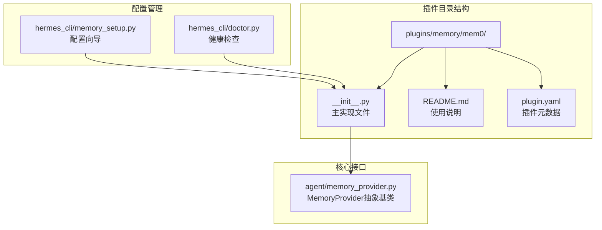
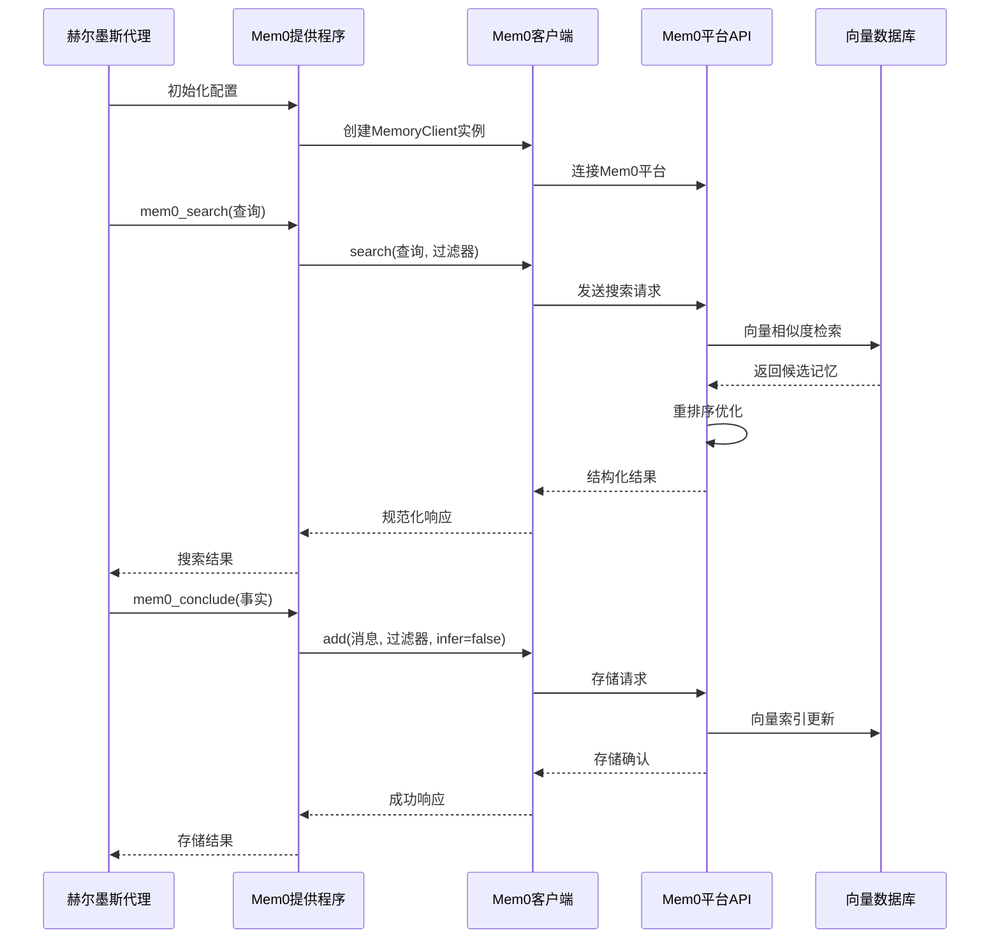
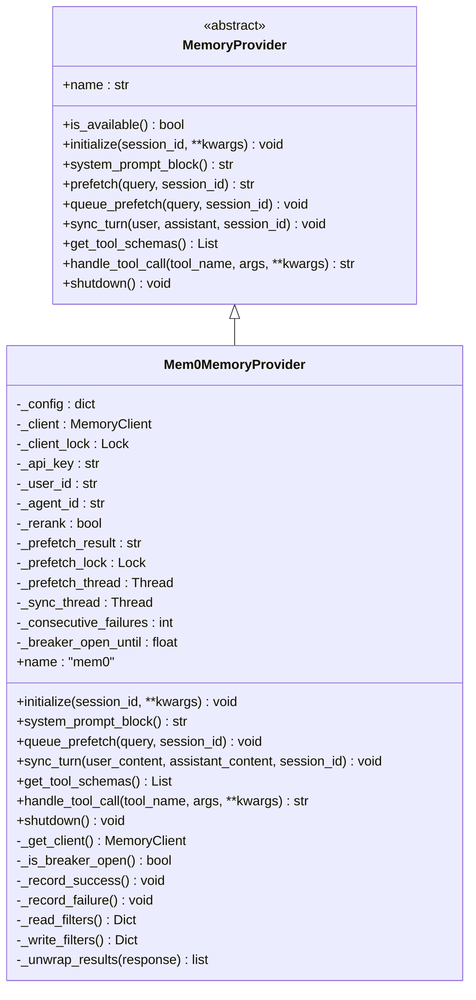
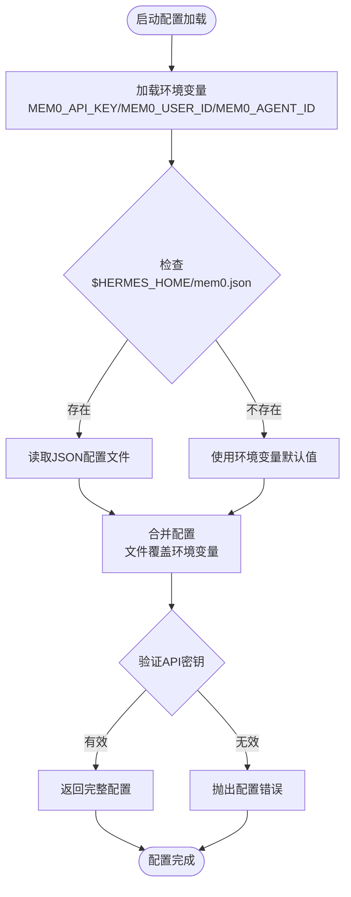
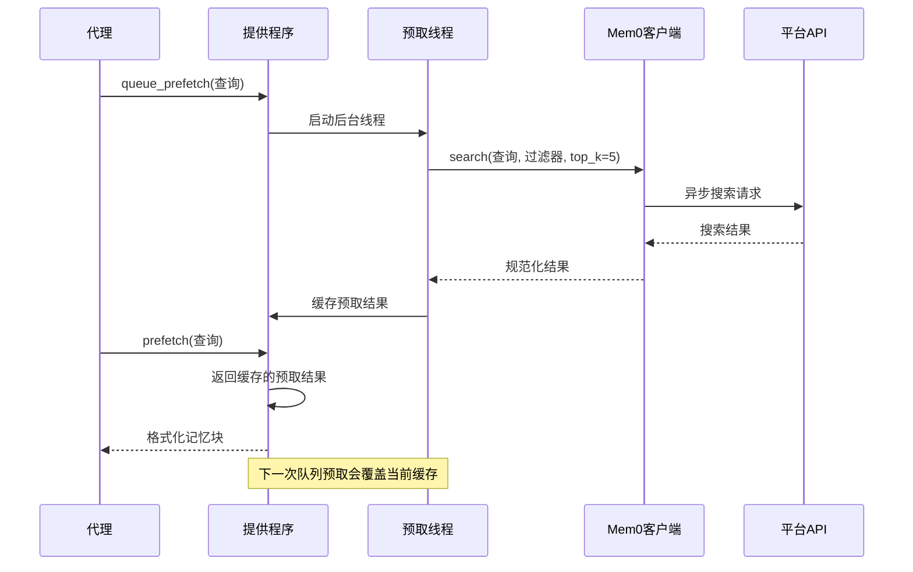
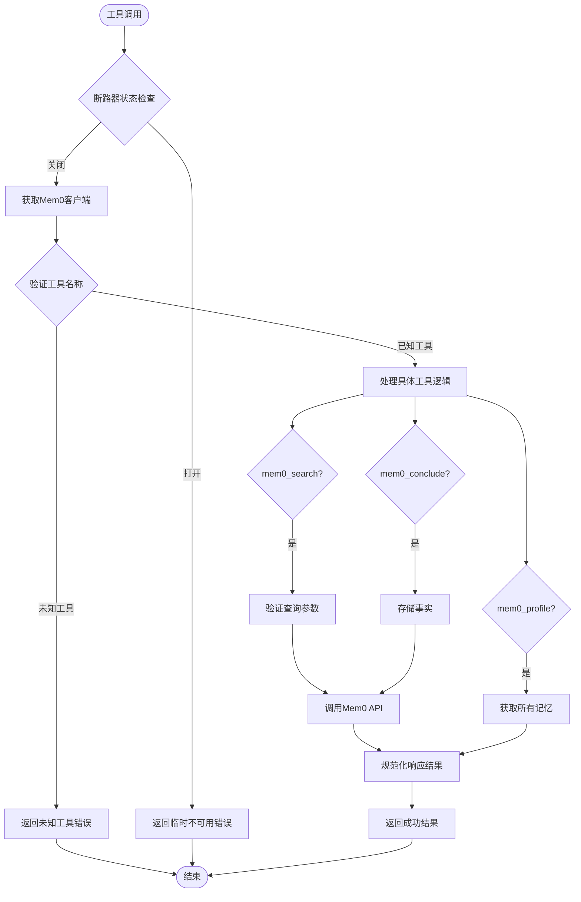
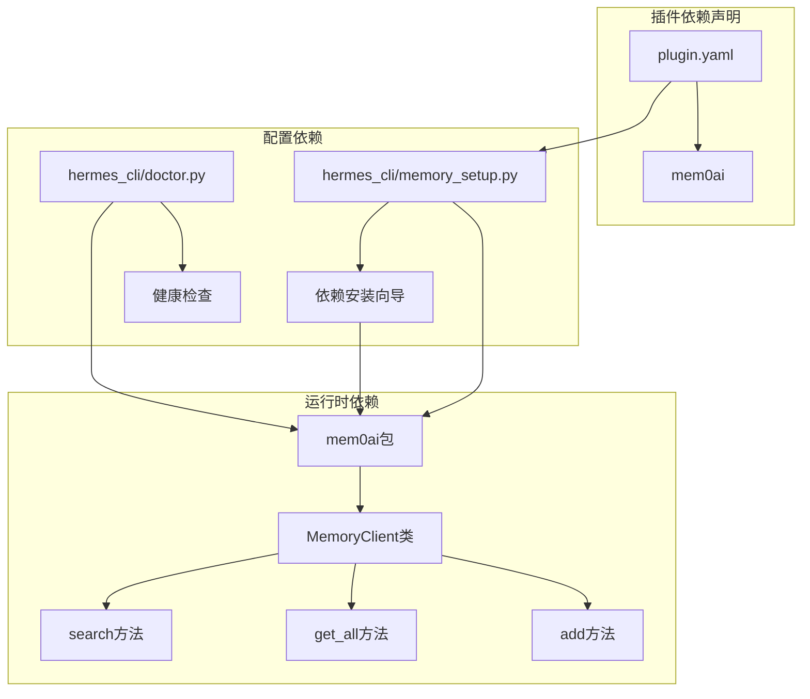
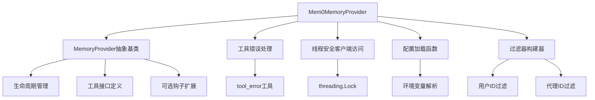
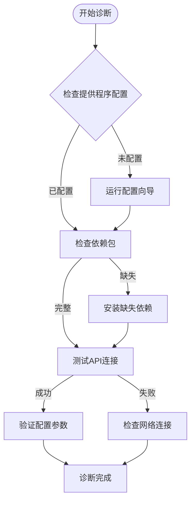

# Mem0记忆提供程序

<cite>
**本文档引用的文件**
- [plugins/memory/mem0/__init__.py](file://plugins/memory/mem0/__init__.py)
- [plugins/memory/mem0/README.md](file://plugins/memory/mem0/README.md)
- [plugins/memory/mem0/plugin.yaml](file://plugins/memory/mem0/plugin.yaml)
- [agent/memory_provider.py](file://agent/memory_provider.py)
- [tests/plugins/memory/test_mem0_v2.py](file://tests/plugins/memory/test_mem0_v2.py)
- [tests/agent/test_memory_user_id.py](file://tests/agent/test_memory_user_id.py)
- [hermes_cli/memory_setup.py](file://hermes_cli/memory_setup.py)
- [hermes_cli/doctor.py](file://hermes_cli/doctor.py)
- [website/docs/user-guide/features/memory-providers.md](file://website/docs/user-guide/features/memory-providers.md)
</cite>

## 目录
1. [简介](#简介)
2. [项目结构](#项目结构)
3. [核心组件](#核心组件)
4. [架构概览](#架构概览)
5. [详细组件分析](#详细组件分析)
6. [依赖关系分析](#依赖关系分析)
7. [性能考虑](#性能考虑)
8. [故障排除指南](#故障排除指南)
9. [结论](#结论)
10. [附录](#附录)

## 简介

Mem0记忆提供程序是基于向量数据库的智能记忆系统，通过服务器端的大语言模型事实提取、语义搜索、重排序和自动去重功能，为Hermes代理提供持久化的上下文记忆能力。

该提供程序的核心优势在于：
- **服务器端事实提取**：利用Mem0平台的LLM能力自动从对话中抽取关键事实
- **向量相似度检索**：基于语义理解而非关键词匹配的智能搜索
- **自动去重机制**：避免重复记忆的存储和检索
- **重排序优化**：提高检索结果的相关性和准确性
- **多会话跨域记忆**：支持用户在不同会话间的记忆共享

## 项目结构

Mem0记忆提供程序位于插件系统中的独立模块，采用标准的Hermes插件架构：



**图表来源**
- [plugins/memory/mem0/__init__.py:1-374](file://plugins/memory/mem0/__init__.py#L1-L374)
- [agent/memory_provider.py:1-232](file://agent/memory_provider.py#L1-L232)

**章节来源**
- [plugins/memory/mem0/__init__.py:1-374](file://plugins/memory/mem0/__init__.py#L1-L374)
- [plugins/memory/mem0/README.md:1-39](file://plugins/memory/mem0/README.md#L1-L39)

## 核心组件

### 配置管理系统

Mem0提供程序实现了完整的配置管理机制，支持环境变量和本地配置文件两种配置方式：

| 配置项 | 默认值 | 描述 | 环境变量 |
|--------|--------|------|----------|
| api_key | 必需 | Mem0平台API密钥 | MEM0_API_KEY |
| user_id | hermes-user | 用户标识符 | MEM0_USER_ID |
| agent_id | hermes | 代理标识符 | MEM0_AGENT_ID |
| rerank | true | 启用重排序以提升召回率 | - |

### 工具接口定义

提供三个核心工具接口供模型调用：

1. **mem0_profile** - 获取用户的完整记忆概览
2. **mem0_search** - 基于语义的智能搜索
3. **mem0_conclude** - 存储明确的事实（不进行LLM提取）

**章节来源**
- [plugins/memory/mem0/__init__.py:40-66](file://plugins/memory/mem0/__init__.py#L40-L66)
- [plugins/memory/mem0/__init__.py:73-112](file://plugins/memory/mem0/__init__.py#L73-L112)

## 架构概览

Mem0记忆提供程序采用客户端-服务器架构，通过Mem0平台API实现云端记忆服务：



**图表来源**
- [plugins/memory/mem0/__init__.py:168-178](file://plugins/memory/mem0/__init__.py#L168-L178)
- [plugins/memory/mem0/__init__.py:323-361](file://plugins/memory/mem0/__init__.py#L323-L361)

## 详细组件分析

### Mem0MemoryProvider类设计



**图表来源**
- [agent/memory_provider.py:42-232](file://agent/memory_provider.py#L42-L232)
- [plugins/memory/mem0/__init__.py:119-374](file://plugins/memory/mem0/__init__.py#L119-L374)

### 配置加载机制

配置系统采用分层优先级设计：



**图表来源**
- [plugins/memory/mem0/__init__.py:40-66](file://plugins/memory/mem0/__init__.py#L40-L66)

### 智能预取机制

Mem0提供程序实现了高效的预取机制，通过后台线程提前检索相关记忆：



**图表来源**
- [plugins/memory/mem0/__init__.py:237-271](file://plugins/memory/mem0/__init__.py#L237-L271)

**章节来源**
- [plugins/memory/mem0/__init__.py:119-374](file://plugins/memory/mem0/__init__.py#L119-L374)

### 工具调用处理流程

每个工具调用都经过统一的处理流程：



**图表来源**
- [plugins/memory/mem0/__init__.py:300-361](file://plugins/memory/mem0/__init__.py#L300-L361)

**章节来源**
- [plugins/memory/mem0/__init__.py:300-361](file://plugins/memory/mem0/__init__.py#L300-L361)

## 依赖关系分析

### 外部依赖管理

Mem0提供程序通过插件系统管理外部依赖：



**图表来源**
- [plugins/memory/mem0/plugin.yaml:1-6](file://plugins/memory/mem0/plugin.yaml#L1-L6)
- [hermes_cli/memory_setup.py:58-125](file://hermes_cli/memory_setup.py#L58-L125)

### 内部依赖关系



**图表来源**
- [agent/memory_provider.py:42-232](file://agent/memory_provider.py#L42-L232)
- [plugins/memory/mem0/__init__.py:25-26](file://plugins/memory/mem0/__init__.py#L25-L26)

**章节来源**
- [plugins/memory/mem0/plugin.yaml:4-5](file://plugins/memory/mem0/plugin.yaml#L4-L5)
- [hermes_cli/memory_setup.py:80-85](file://hermes_cli/memory_setup.py#L80-L85)

## 性能考虑

### 断路器机制

为了防止API服务不可用时的级联故障，Mem0提供程序实现了智能断路器：

- **触发条件**：连续5次失败
- **冷却时间**：120秒
- **保护机制**：在冷却期间拒绝所有API调用
- **自动恢复**：冷却期结束后重置计数器

### 线程安全设计

系统采用多线程架构确保高性能：

- **客户端锁**：保护MemoryClient实例的线程安全访问
- **预取线程**：异步执行记忆检索，避免阻塞主线程
- **同步线程**：非阻塞地处理记忆写入操作
- **结果缓存**：避免重复的API调用

### 内存优化策略

- **延迟初始化**：仅在需要时创建Mem0客户端
- **连接复用**：单个客户端实例在整个会话中复用
- **结果规范化**：统一处理API响应格式，减少内存碎片

## 故障排除指南

### 常见问题诊断

1. **API密钥配置错误**
   - 检查MEM0_API_KEY环境变量是否正确设置
   - 使用`hermes memory status`命令验证配置状态
   - 运行`hermes doctor`进行全面健康检查

2. **依赖包缺失**
   - 确认mem0ai包已正确安装
   - 检查Python包导入路径
   - 验证虚拟环境配置

3. **网络连接问题**
   - 测试Mem0平台API可达性
   - 检查防火墙和代理设置
   - 验证API密钥的有效性

### 配置验证流程



**图表来源**
- [hermes_cli/doctor.py:920-942](file://hermes_cli/doctor.py#L920-L942)
- [hermes_cli/memory_setup.py:382-436](file://hermes_cli/memory_setup.py#L382-L436)

**章节来源**
- [hermes_cli/doctor.py:920-1022](file://hermes_cli/doctor.py#L920-L1022)
- [hermes_cli/memory_setup.py:382-452](file://hermes_cli/memory_setup.py#L382-L452)

## 结论

Mem0记忆提供程序为Hermes代理生态系统提供了强大而可靠的向量记忆解决方案。其核心优势包括：

**技术优势**：
- 基于服务器端的事实提取，确保记忆质量
- 智能的向量相似度检索和重排序机制
- 完善的断路器和错误处理机制
- 灵活的配置管理和插件架构

**适用场景**：
- 需要高质量记忆保持的应用
- 对语义理解要求较高的对话系统
- 需要跨会话记忆共享的多轮交互

**选择建议**：
与其他记忆提供程序相比，Mem0在以下方面具有独特优势：
- 更好的语义搜索准确性
- 自动的事实提取和去重
- 更完善的云端服务支持
- 更强的可扩展性

对于预算充足且对记忆质量有高要求的用户，Mem0是理想的选择；而对于资源受限或需要完全自托管的场景，可以考虑其他本地化方案。

## 附录

### 安装和配置步骤

1. **安装依赖包**
   ```bash
   pip install mem0ai
   ```

2. **获取API密钥**
   - 访问[app.mem0.ai](https://app.mem0.ai)
   - 注册账户并创建API密钥

3. **配置环境变量**
   ```bash
   hermes config set memory.provider mem0
   echo "MEM0_API_KEY=your-key" >> ~/.hermes/.env
   ```

4. **验证配置**
   ```bash
   hermes memory status
   hermes doctor
   ```

### API使用示例

**基本搜索**
```json
{
  "name": "mem0_search",
  "arguments": {
    "query": "用户偏好设置",
    "rerank": true,
    "top_k": 10
  }
}
```

**存储事实**
```json
{
  "name": "mem0_conclude",
  "arguments": {
    "conclusion": "用户偏好深色主题"
  }
}
```

**获取概览**
```json
{
  "name": "mem0_profile",
  "arguments": {}
}
```

### 最佳实践

1. **配置优化**
   - 合理设置`top_k`参数以平衡准确性和性能
   - 在重要查询中启用`rerank`选项
   - 定期清理过期的记忆条目

2. **性能监控**
   - 监控API响应时间和成功率
   - 设置适当的超时和重试机制
   - 关注断路器状态变化

3. **安全考虑**
   - 保护API密钥的安全存储
   - 定期轮换API密钥
   - 实施访问控制和审计日志