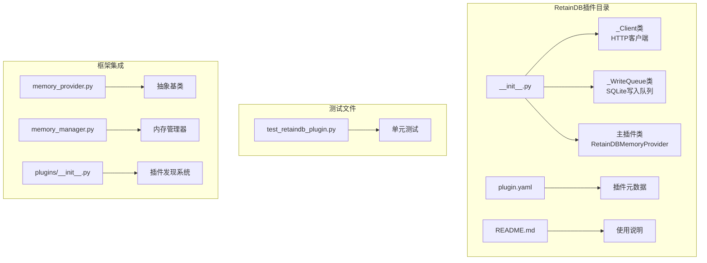
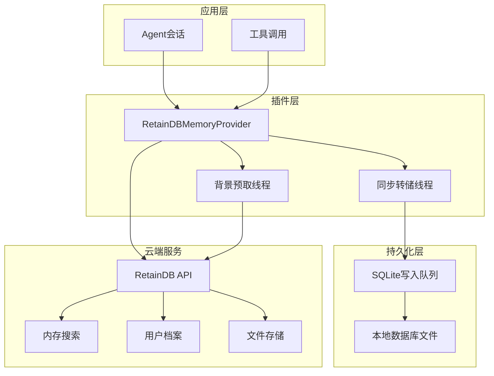
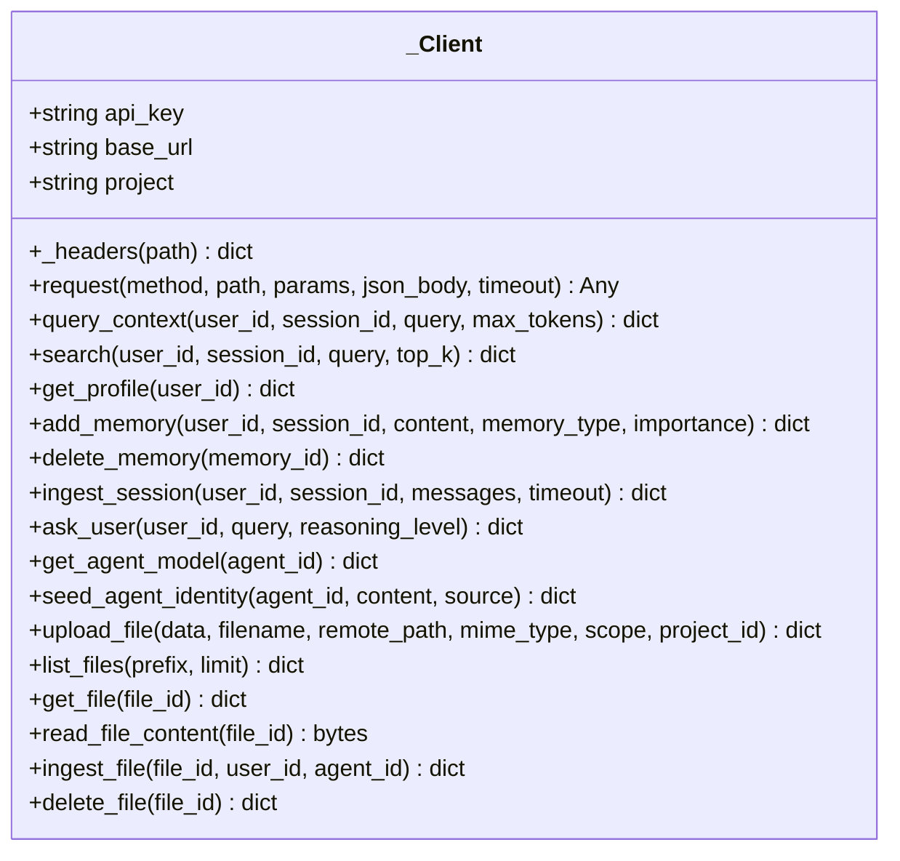
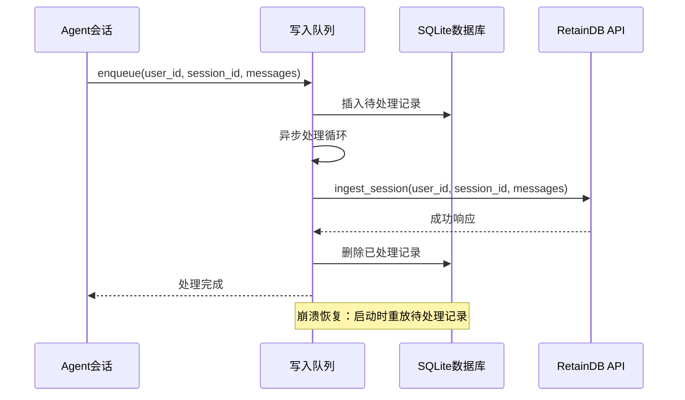
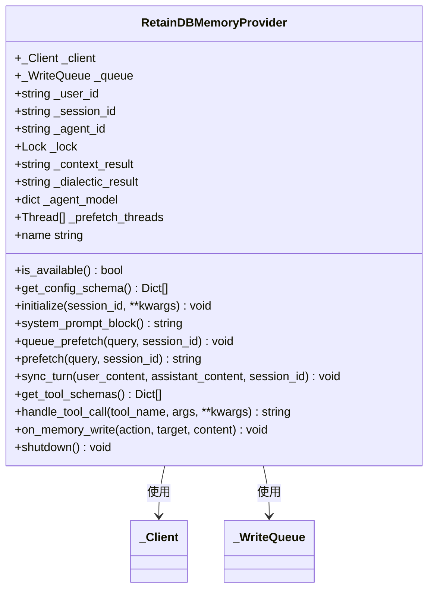
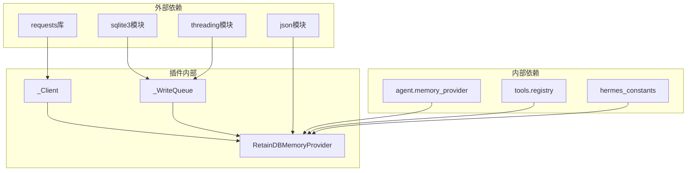
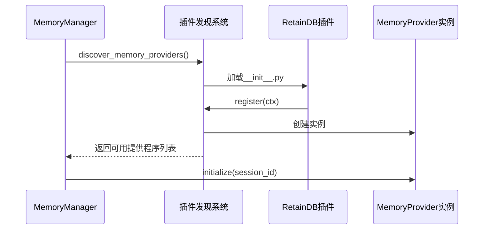
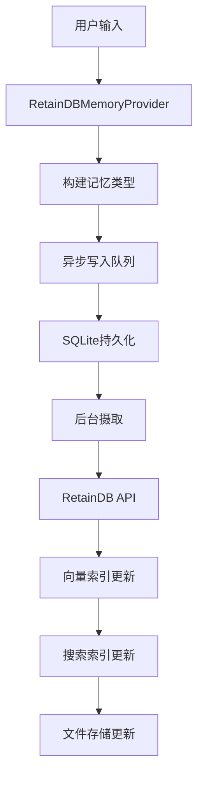

# RetainDB记忆提供程序

<cite>
**本文档引用的文件**
- [plugins/memory/retaindb/__init__.py](file://plugins/memory/retaindb/__init__.py)
- [plugins/memory/retaindb/plugin.yaml](file://plugins/memory/retaindb/plugin.yaml)
- [plugins/memory/retaindb/README.md](file://plugins/memory/retaindb/README.md)
- [tests/plugins/test_retaindb_plugin.py](file://tests/plugins/test_retaindb_plugin.py)
- [plugins/memory/__init__.py](file://plugins/memory/__init__.py)
- [agent/memory_provider.py](file://agent/memory_provider.py)
- [agent/memory_manager.py](file://agent/memory_manager.py)
- [hermes_cli/memory_setup.py](file://hermes_cli/memory_setup.py)
- [website/docs/developer-guide/memory-provider-plugin.md](file://website/docs/developer-guide/memory-provider-plugin.md)
</cite>

## 目录
1. [简介](#简介)
2. [项目结构](#项目结构)
3. [核心组件](#核心组件)
4. [架构概览](#架构概览)
5. [详细组件分析](#详细组件分析)
6. [依赖关系分析](#依赖关系分析)
7. [性能考量](#性能考量)
8. [故障排除指南](#故障排除指南)
9. [结论](#结论)
10. [附录](#附录)

## 简介
RetainDB记忆提供程序是Hermes Agent框架中的一个内置内存插件，通过RetainDB云API实现跨会话的持久化记忆管理。该插件提供了以下核心能力：
- 基于SQLite的持久化写入队列（崩溃安全、异步摄取）
- 语义搜索与用户档案检索
- 带去重覆盖层的上下文查询
- 对话式综合（LLM驱动的用户理解）
- 代理自我模型（来自SOUL.md的人格和指令）
- 共享文件存储工具（上传、列出、读取、摄取、删除）

## 项目结构
RetainDB插件位于`plugins/memory/retaindb/`目录下，包含核心实现文件和配置元数据：



**图表来源**
- [plugins/memory/retaindb/__init__.py:1-767](file://plugins/memory/retaindb/__init__.py#L1-L767)
- [plugins/memory/retaindb/plugin.yaml:1-8](file://plugins/memory/retaindb/plugin.yaml#L1-L8)

**章节来源**
- [plugins/memory/retaindb/__init__.py:1-50](file://plugins/memory/retaindb/__init__.py#L1-L50)
- [plugins/memory/retaindb/plugin.yaml:1-8](file://plugins/memory/retaindb/plugin.yaml#L1-L8)

## 核心组件
RetainDB插件由三个主要组件构成：

### 1. HTTP客户端（_Client）
负责与RetainDB云API进行通信，支持多种内存操作和文件管理功能。

### 2. 持久化写入队列（_WriteQueue）
基于SQLite的异步写入队列，确保消息摄取的可靠性。

### 3. 主插件类（RetainDBMemoryProvider）
实现MemoryProvider抽象基类，提供完整的记忆管理功能。

**章节来源**
- [plugins/memory/retaindb/__init__.py:179-408](file://plugins/memory/retaindb/__init__.py#L179-L408)
- [plugins/memory/retaindb/__init__.py:452-767](file://plugins/memory/retaindb/__init__.py#L452-L767)

## 架构概览
RetainDB插件采用分层架构设计，实现了高可用性和容错能力：



**图表来源**
- [plugins/memory/retaindb/__init__.py:452-530](file://plugins/memory/retaindb/__init__.py#L452-L530)
- [plugins/memory/retaindb/__init__.py:330-408](file://plugins/memory/retaindb/__init__.py#L330-L408)

## 详细组件分析

### HTTP客户端（_Client）分析
_HTTP客户端实现了完整的API通信逻辑，包括请求头管理、错误处理和API路由映射。_



**图表来源**
- [plugins/memory/retaindb/__init__.py:179-324](file://plugins/memory/retaindb/__init__.py#L179-L324)

#### 请求头管理机制
客户端根据API路径动态设置认证头信息：
- 所有请求：包含Authorization和Content-Type
- 内存和上下文相关路径：额外包含X-API-Key头
- 文件操作：使用不同的认证策略

**章节来源**
- [plugins/memory/retaindb/__init__.py:185-194](file://plugins/memory/retaindb/__init__.py#L185-L194)
- [plugins/memory/retaindb/__init__.py:196-215](file://plugins/memory/retaindb/__init__.py#L196-L215)

### 持久化写入队列（_WriteQueue）分析
_写入队列确保消息摄取的可靠性和持久性，采用SQLite作为本地存储后端。_



**图表来源**
- [plugins/memory/retaindb/__init__.py:330-408](file://plugins/memory/retaindb/__init__.py#L330-L408)

#### 数据库设计特点
- 使用SQLite本地存储待处理消息
- 支持崩溃恢复和重放机制
- 线程本地连接缓存提高性能
- 自动清理机制防止数据库膨胀

**章节来源**
- [plugins/memory/retaindb/__init__.py:356-391](file://plugins/memory/retaindb/__init__.py#L356-L391)

### 主插件类（RetainDBMemoryProvider）分析
_主插件类实现了完整的MemoryProvider接口，提供所有记忆管理功能。_



**图表来源**
- [plugins/memory/retaindb/__init__.py:452-767](file://plugins/memory/retaindb/__init__.py#L452-L767)

#### 背景预取机制
插件实现了多线程背景预取，提升用户体验：
- 上下文查询预取
- 用户对话综合预取  
- 代理自我模型预取
- 防止线程累积的保护机制

**章节来源**
- [plugins/memory/retaindb/__init__.py:542-596](file://plugins/memory/retaindb/__init__.py#L542-L596)
- [plugins/memory/retaindb/__init__.py:597-624](file://plugins/memory/retaindb/__init__.py#L597-L624)

### 工具集分析
RetainDB插件提供了丰富的工具集，支持各种记忆操作：

| 工具名称 | 功能描述 | 参数 |
|---------|----------|------|
| retaindb_profile | 获取用户稳定档案 | 无参数 |
| retaindb_search | 语义搜索记忆 | query, top_k |
| retaindb_context | 当前任务相关上下文 | query |
| retaindb_remember | 存储事实到长期记忆 | content, memory_type, importance |
| retaindb_forget | 删除特定记忆 | memory_id |
| retaindb_upload_file | 上传文件到共享存储 | local_path, remote_path, scope, ingest |
| retaindb_list_files | 列出存储文件 | prefix, limit |
| retaindb_read_file | 读取文件内容 | file_id |
| retaindb_ingest_file | 从文件提取记忆 | file_id |
| retaindb_delete_file | 删除存储文件 | file_id |

**章节来源**
- [plugins/memory/retaindb/__init__.py:49-173](file://plugins/memory/retaindb/__init__.py#L49-L173)

## 依赖关系分析
RetainDB插件的依赖关系体现了清晰的分层架构：



**图表来源**
- [plugins/memory/retaindb/__init__.py:23-38](file://plugins/memory/retaindb/__init__.py#L23-L38)
- [plugins/memory/retaindb/plugin.yaml:4-5](file://plugins/memory/retaindb/plugin.yaml#L4-L5)

### 插件发现和注册机制
RetainDB插件通过标准的插件发现系统集成到Hermes框架中：



**图表来源**
- [plugins/memory/__init__.py:32-75](file://plugins/memory/__init__.py#L32-L75)
- [plugins/memory/__init__.py:175-196](file://plugins/memory/__init__.py#L175-L196)

**章节来源**
- [plugins/memory/__init__.py:78-96](file://plugins/memory/__init__.py#L78-L96)
- [plugins/memory/__init__.py:199-217](file://plugins/memory/__init__.py#L199-L217)

## 性能考量
RetainDB插件在设计时充分考虑了性能优化：

### 1. 异步处理机制
- 写入操作完全异步，不阻塞主会话线程
- 背景预取线程池管理，防止资源耗尽
- SQLite连接复用减少数据库开销

### 2. 缓存策略
- 上下文结果缓存避免重复API调用
- 代理模型缓存提升响应速度
- 线程本地存储优化并发访问

### 3. 错误处理和重试
- 写入失败自动重试机制
- 崩溃恢复确保数据完整性
- 超时控制防止资源泄漏

**章节来源**
- [plugins/memory/retaindb/__init__.py:542-558](file://plugins/memory/retaindb/__init__.py#L542-L558)
- [plugins/memory/retaindb/__init__.py:380-404](file://plugins/memory/retaindb/__init__.py#L380-L404)

## 故障排除指南

### 常见问题诊断
1. **API密钥配置错误**
   - 检查RETAINDB_API_KEY环境变量
   - 验证API密钥格式和权限范围

2. **网络连接问题**
   - 测试RetainDB API可达性
   - 检查防火墙和代理设置
   - 验证base_url配置

3. **SQLite写入队列异常**
   - 检查数据库文件权限
   - 验证磁盘空间充足
   - 监控队列长度防止溢出

### 调试方法
- 启用详细日志记录
- 使用测试套件验证功能
- 监控API响应时间和错误率

**章节来源**
- [tests/plugins/test_retaindb_plugin.py:54-176](file://tests/plugins/test_retaindb_plugin.py#L54-L176)
- [tests/plugins/test_retaindb_plugin.py:182-272](file://tests/plugins/test_retaindb_plugin.py#L182-L272)

## 结论
RetainDB记忆提供程序是一个功能完整、设计精良的记忆管理解决方案。其关键优势包括：

1. **可靠性**：基于SQLite的持久化设计确保数据安全
2. **性能**：异步处理和缓存机制提供流畅的用户体验
3. **易用性**：简洁的API设计和完善的错误处理
4. **可扩展性**：模块化架构支持未来功能扩展

该插件为Hermes Agent框架提供了强大的跨会话记忆能力，是构建智能代理的重要基础设施。

## 附录

### 安装配置指南
1. **基础安装**
   ```bash
   pip install requests
   hermes memory setup  # 选择"retaindb"
   ```

2. **手动配置**
   ```bash
   hermes config set memory.provider retaindb
   echo "RETAINDB_API_KEY=your-key" >> ~/.hermes/.env
   ```

3. **环境变量配置**
   - RETAINDB_API_KEY：必需的API密钥
   - RETAINDB_BASE_URL：API端点，默认`https://api.retaindb.com`
   - RETAINDB_PROJECT：项目标识符，默认自动解析

### SQL查询示例
由于RetainDB使用云API而非本地SQL，以下是典型的数据操作模式：



**图表来源**
- [plugins/memory/retaindb/__init__.py:627-640](file://plugins/memory/retaindb/__init__.py#L627-L640)
- [plugins/memory/retaindb/__init__.py:245-267](file://plugins/memory/retaindb/__init__.py#L245-L267)

### 性能调优建议
1. **监控指标**
   - API响应时间
   - 写入队列长度
   - SQLite数据库大小
   - 背景线程数量

2. **优化策略**
   - 调整预取频率
   - 优化记忆类型分类
   - 监控缓存命中率
   - 定期清理过期数据

3. **容量规划**
   - 评估API配额使用情况
   - 监控存储空间增长
   - 规划备份策略
   - 设计灾难恢复方案