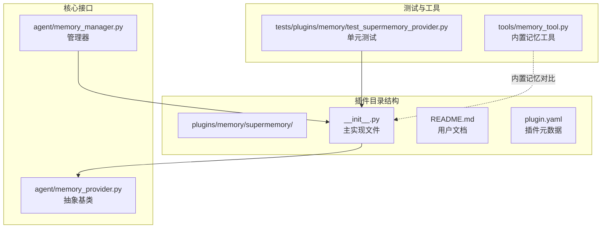
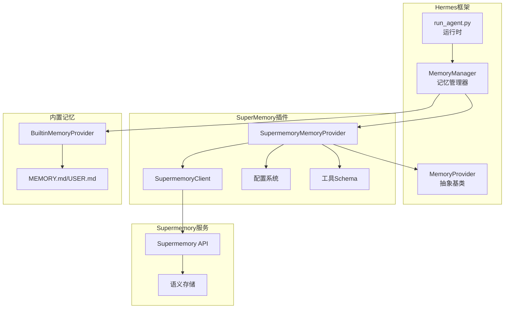
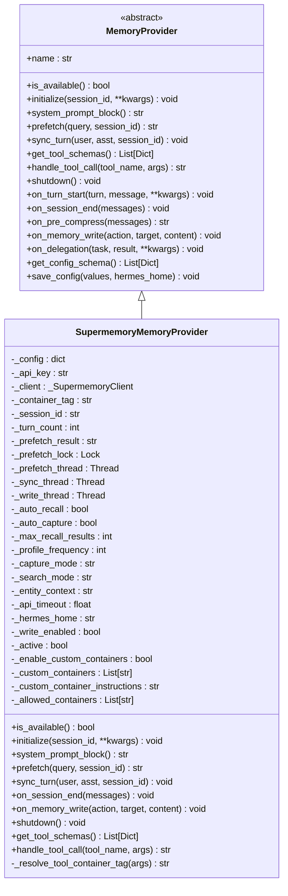
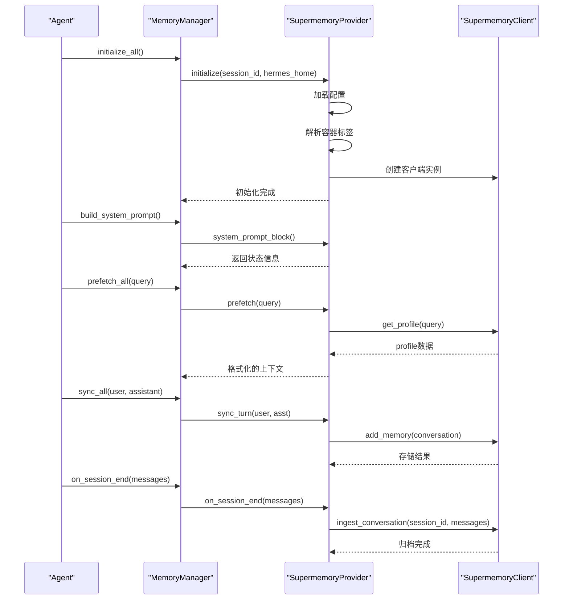
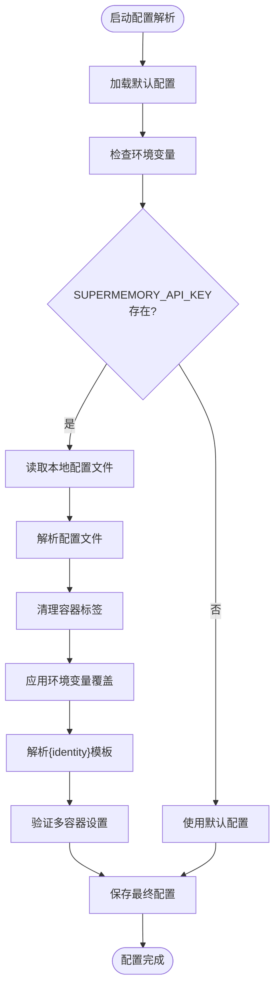
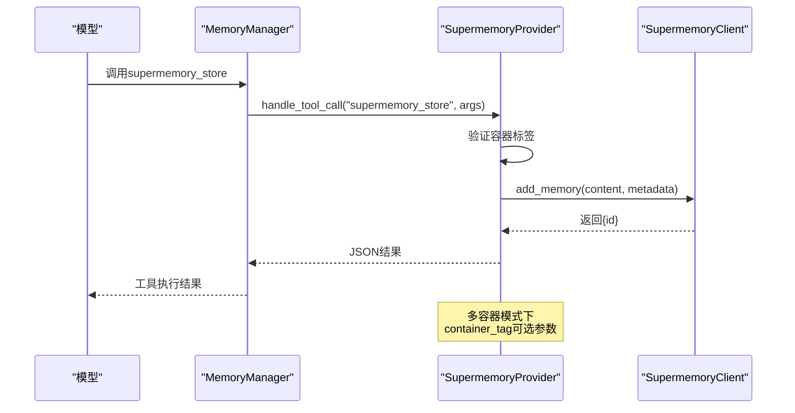
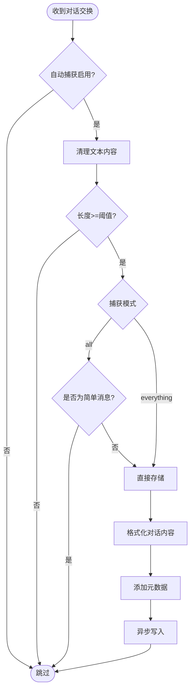
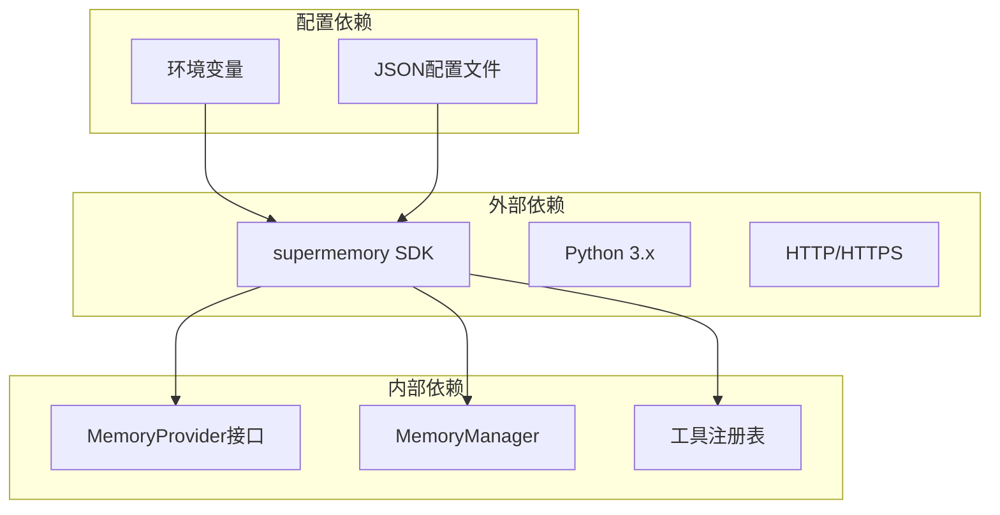

# SuperMemory记忆提供程序

<cite>
**本文档引用的文件**
- [plugins/memory/supermemory/__init__.py](file://plugins/memory/supermemory/__init__.py)
- [plugins/memory/supermemory/README.md](file://plugins/memory/supermemory/README.md)
- [plugins/memory/supermemory/plugin.yaml](file://plugins/memory/supermemory/plugin.yaml)
- [agent/memory_provider.py](file://agent/memory_provider.py)
- [agent/memory_manager.py](file://agent/memory_manager.py)
- [tests/plugins/memory/test_supermemory_provider.py](file://tests/plugins/memory/test_supermemory_provider.py)
- [tools/memory_tool.py](file://tools/memory_tool.py)
- [hermes_cli/memory_setup.py](file://hermes_cli/memory_setup.py)
</cite>

## 目录
1. [简介](#简介)
2. [项目结构](#项目结构)
3. [核心组件](#核心组件)
4. [架构总览](#架构总览)
5. [详细组件分析](#详细组件分析)
6. [依赖关系分析](#依赖关系分析)
7. [性能考量](#性能考量)
8. [故障排除指南](#故障排除指南)
9. [结论](#结论)
10. [附录](#附录)

## 简介
SuperMemory记忆提供程序是Hermes框架的一个插件式外部记忆后端，基于Supermemory.ai提供的语义长时记忆能力。该提供程序通过以下方式增强Agent的记忆能力：
- 语义检索：支持基于相似度的语义搜索
- 持久化存储：将对话和事实写入云端语义存储
- 主动回忆：在每轮对话前自动注入相关记忆上下文
- 显式工具：提供存储、搜索、遗忘、个人资料查询等显式操作
- 会话归档：在会话结束时将完整对话历史进行语义图更新

该提供程序与内置的短期记忆（MEMORY.md/USER.md）并行工作，共同构成完整的记忆体系。内置记忆负责会话内短期记忆，SuperMemory负责跨会话的语义长时记忆。

## 项目结构
SuperMemory提供程序位于插件目录中，采用标准的插件结构：



**图表来源**
- [plugins/memory/supermemory/__init__.py:1-792](file://plugins/memory/supermemory/__init__.py#L1-L792)
- [agent/memory_provider.py:1-232](file://agent/memory_provider.py#L1-L232)
- [agent/memory_manager.py:1-363](file://agent/memory_manager.py#L1-L363)

**章节来源**
- [plugins/memory/supermemory/README.md:1-100](file://plugins/memory/supermemory/README.md#L1-L100)
- [plugins/memory/supermemory/plugin.yaml:1-6](file://plugins/memory/supermemory/plugin.yaml#L1-L6)

## 核心组件
SuperMemory提供程序的核心由以下关键组件构成：

### 1. SupermemoryMemoryProvider类
这是主要的提供程序实现，继承自MemoryProvider抽象基类。它实现了所有必需的生命周期钩子：
- 初始化：建立连接、加载配置、创建资源
- 系统提示：提供静态状态信息
- 预取：在每轮对话前获取相关记忆
- 同步：在每轮结束后持久化对话
- 工具：提供显式的记忆操作工具

### 2. _SupermemoryClient封装器
对Supermemory SDK的轻量封装，提供：
- 记忆存储：add_memory
- 语义搜索：search_memories  
- 个人资料：get_profile
- 忘记功能：forget_memory/forget_by_query
- 会话归档：ingest_conversation

### 3. 配置系统
支持环境变量和本地配置文件两种方式：
- 环境变量：SUPERMEMORY_API_KEY、SUPERMEMORY_CONTAINER_TAG
- 本地配置：$HERMES_HOME/supermemory.json
- 运行时模板：{identity}支持按身份配置容器标签

### 4. 工具Schema
提供四个标准化的工具接口：
- supermemory_store：显式存储记忆
- supermemory_search：语义搜索
- supermemory_forget：删除记忆
- supermemory_profile：获取个人资料

**章节来源**
- [plugins/memory/supermemory/__init__.py:420-792](file://plugins/memory/supermemory/__init__.py#L420-L792)
- [agent/memory_provider.py:42-232](file://agent/memory_provider.py#L42-L232)

## 架构总览
SuperMemory提供程序采用插件化架构，与Hermes框架深度集成：



**图表来源**
- [agent/memory_manager.py:72-363](file://agent/memory_manager.py#L72-L363)
- [plugins/memory/supermemory/__init__.py:420-792](file://plugins/memory/supermemory/__init__.py#L420-L792)

## 详细组件分析

### SupermemoryMemoryProvider类分析

#### 类层次结构


**图表来源**
- [agent/memory_provider.py:42-232](file://agent/memory_provider.py#L42-L232)
- [plugins/memory/supermemory/__init__.py:420-792](file://plugins/memory/supermemory/__init__.py#L420-L792)

#### 生命周期管理流程


**图表来源**
- [agent/memory_manager.py:146-284](file://agent/memory_manager.py#L146-L284)
- [plugins/memory/supermemory/__init__.py:480-644](file://plugins/memory/supermemory/__init__.py#L480-L644)

### 配置系统分析

#### 配置优先级和解析顺序


**图表来源**
- [plugins/memory/supermemory/__init__.py:98-141](file://plugins/memory/supermemory/__init__.py#L98-L141)
- [plugins/memory/supermemory/__init__.py:480-526](file://plugins/memory/supermemory/__init__.py#L480-L526)

#### 配置参数详解
| 参数名 | 默认值 | 描述 | 环境变量 |
|--------|--------|------|----------|
| container_tag | hermes | 容器标签，用于搜索和写入 | SUPERMEMORY_CONTAINER_TAG |
| auto_recall | true | 是否在每轮前自动注入相关记忆 | 无 |
| auto_capture | true | 是否自动捕获对话转存 | 无 |
| max_recall_results | 10 | 最大召回结果数量（1-20） | 无 |
| profile_frequency | 50 | 首轮和每隔N轮包含个人资料 | 无 |
| capture_mode | all | 捕获模式：all/everything | 无 |
| search_mode | hybrid | 搜索模式：hybrid/memories/documents | 无 |
| entity_context | 内置默认 | 实体提取指导语 | 无 |
| api_timeout | 5.0 | SDK和归档请求超时时间 | 无 |

**章节来源**
- [plugins/memory/supermemory/README.md:23-45](file://plugins/memory/supermemory/README.md#L23-L45)
- [plugins/memory/supermemory/__init__.py:56-141](file://plugins/memory/supermemory/__init__.py#L56-L141)

### 工具系统分析

#### 工具调用流程


**图表来源**
- [agent/memory_manager.py:238-257](file://agent/memory_manager.py#L238-L257)
- [plugins/memory/supermemory/__init__.py:776-788](file://plugins/memory/supermemory/__init__.py#L776-L788)

#### 工具Schema定义
每个工具都遵循OpenAI函数调用格式，包含：
- 名称：工具标识符
- 描述：工具用途说明
- 参数：类型、描述、必填字段
- 必填参数：确保工具正确调用

**章节来源**
- [plugins/memory/supermemory/__init__.py:370-418](file://plugins/memory/supermemory/__init__.py#L370-L418)

### 记忆管理机制

#### 自动捕获机制


**图表来源**
- [plugins/memory/supermemory/__init__.py:563-594](file://plugins/memory/supermemory/__init__.py#L563-L594)

#### 预取上下文生成
预取机制在每轮对话前自动获取相关记忆，包含三个层次：
1. **个人资料**：持久性用户画像和近期上下文
2. **动态上下文**：最近的交互和状态变化
3. **语义搜索**：基于查询的相关记忆片段

**章节来源**
- [plugins/memory/supermemory/__init__.py:546-562](file://plugins/memory/supermemory/__init__.py#L546-L562)
- [plugins/memory/supermemory/__init__.py:208-251](file://plugins/memory/supermemory/__init__.py#L208-L251)

## 依赖关系分析

### 外部依赖
SuperMemory提供程序依赖于以下外部组件：



**图表来源**
- [plugins/memory/supermemory/plugin.yaml:4-6](file://plugins/memory/supermemory/plugin.yaml#L4-L6)
- [plugins/memory/supermemory/__init__.py:20-22](file://plugins/memory/supermemory/__init__.py#L20-L22)

### 内部耦合关系
- **高内聚低耦合**：提供程序专注于记忆功能，不依赖具体实现细节
- **接口契约**：严格遵循MemoryProvider接口规范
- **线程安全**：使用锁和异步线程处理并发访问
- **错误隔离**：各组件独立处理异常，不影响整体系统稳定性

**章节来源**
- [agent/memory_provider.py:16-31](file://agent/memory_provider.py#L16-L31)
- [plugins/memory/supermemory/__init__.py:420-453](file://plugins/memory/supermemory/__init__.py#L420-L453)

## 性能考量

### 异步处理策略
SuperMemory提供程序采用多线程异步处理来提升性能：

1. **预取线程**：后台获取相关记忆，避免阻塞主对话流程
2. **同步线程**：异步写入对话内容，减少响应延迟
3. **写入线程**：独立处理显式记忆写入操作
4. **线程池管理**：合理控制并发数量，避免资源争用

### 缓存和去重机制
- **重复检测**：在预取阶段对记忆内容进行去重
- **时间戳格式化**：显示相对时间，提升用户体验
- **结果限制**：控制最大召回结果数量，平衡精度和性能

### 网络优化
- **超时控制**：合理的API调用超时设置
- **错误重试**：网络异常时的容错处理
- **连接复用**：SDK层面对连接进行优化

## 故障排除指南

### 常见问题诊断

#### 1. 提供程序不可用
**症状**：`is_available()`返回False
**可能原因**：
- 缺少SUPERMEMORY_API_KEY环境变量
- 未安装supermemory Python包
- 网络连接问题

**解决方法**：
```bash
# 检查API密钥
echo $SUPERMEMORY_API_KEY

# 安装依赖
pip install supermemory

# 验证网络连接
ping api.supermemory.ai
```

#### 2. 记忆无法写入
**症状**：对话内容没有被存储
**可能原因**：
- auto_capture设置为False
- 写入上下文限制（cron、flush、subagent）
- 内容过短或过于简单

**解决方法**：
检查配置文件中的auto_capture设置，确认内容长度超过最小阈值。

#### 3. 搜索结果不准确
**症状**：语义搜索返回相关性较低的结果
**可能原因**：
- search_mode配置不当
- entity_context不够具体
- 查询词过于宽泛

**解决方法**：
调整search_mode为'memories'或'documents'，优化entity_context内容，使用更具体的查询词。

#### 4. 多容器模式问题
**症状**：工具调用返回"容器标签不允许"
**可能原因**：
- 使用了未授权的容器标签
- 容器标签不在白名单中
- 未正确配置多容器设置

**解决方法**：
检查custom_containers列表，确保使用已授权的容器标签。

**章节来源**
- [tests/plugins/memory/test_supermemory_provider.py:64-84](file://tests/plugins/memory/test_supermemory_provider.py#L64-L84)
- [tests/plugins/memory/test_supermemory_provider.py:370-386](file://tests/plugins/memory/test_supermemory_provider.py#L370-L386)

## 结论
SuperMemory记忆提供程序为Hermes框架提供了强大的语义长时记忆能力。其设计特点包括：

### 优势
1. **插件化架构**：易于集成和替换，不影响核心框架
2. **语义智能**：基于相似度的语义搜索，超越关键词匹配
3. **自动化程度高**：自动捕获、预取、归档，减少人工干预
4. **多容器支持**：支持多工作空间和多身份场景
5. **线程安全**：异步处理保证系统响应性

### 适用场景
- 需要跨会话保持知识的复杂AI助手
- 需要语义理解的客户服务系统
- 需要长期学习和适应的智能代理
- 多用户、多身份的协作平台

### 局限性
- 依赖外部API服务，需要稳定的网络连接
- 成本考虑：按使用量计费
- 数据隐私：敏感信息上传到第三方服务
- 配置复杂度：多容器和高级功能需要额外配置

## 附录

### API接口参考

#### 工具调用格式
所有工具都遵循统一的OpenAI函数调用格式：
```json
{
  "name": "supermemory_store",
  "arguments": {
    "content": "记忆内容",
    "metadata": {
      "type": "fact",
      "source": "hermes_tool"
    }
  }
}
```

#### 配置文件示例
```json
{
  "container_tag": "hermes-{identity}",
  "auto_recall": true,
  "auto_capture": true,
  "max_recall_results": 10,
  "profile_frequency": 50,
  "capture_mode": "all",
  "search_mode": "hybrid",
  "entity_context": "用户助手对话...",
  "api_timeout": 5.0,
  "enable_custom_container_tags": false,
  "custom_containers": [],
  "custom_container_instructions": ""
}
```

### 使用示例

#### 基础配置
```bash
# 通过CLI设置
hermes memory setup
# 选择"supermemory"
# 输入API密钥

# 或手动配置
hermes config set memory.provider supermemory
echo 'SUPERMEMORY_API_KEY=your_api_key_here' >> ~/.hermes/.env
```

#### 多容器配置
```json
{
  "container_tag": "hermes",
  "enable_custom_container_tags": true,
  "custom_containers": ["project-alpha", "project-beta", "shared-knowledge"],
  "custom_container_instructions": "使用project-alpha处理编码任务，project-beta处理研究工作"
}
```

#### 在代码中使用
```python
# 获取工具Schema
provider = SupermemoryMemoryProvider()
schemas = provider.get_tool_schemas()

# 手动调用工具
result = provider.handle_tool_call("supermemory_store", {
    "content": "用户偏好：喜欢简洁明了的回复",
    "metadata": {"type": "preference"}
})
```

**章节来源**
- [plugins/memory/supermemory/README.md:10-100](file://plugins/memory/supermemory/README.md#L10-L100)
- [hermes_cli/memory_setup.py:219-398](file://hermes_cli/memory_setup.py#L219-L398)