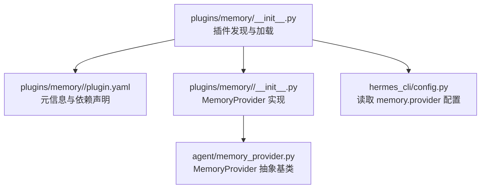
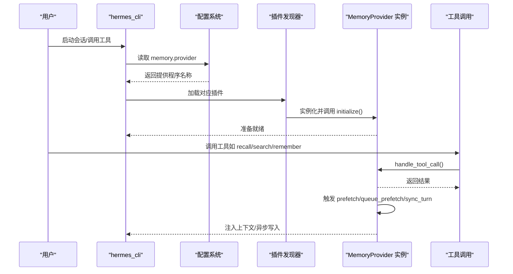
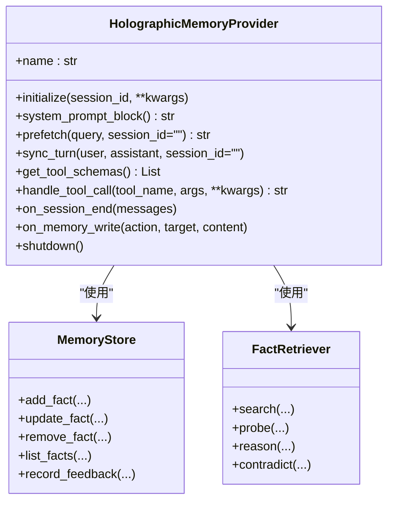
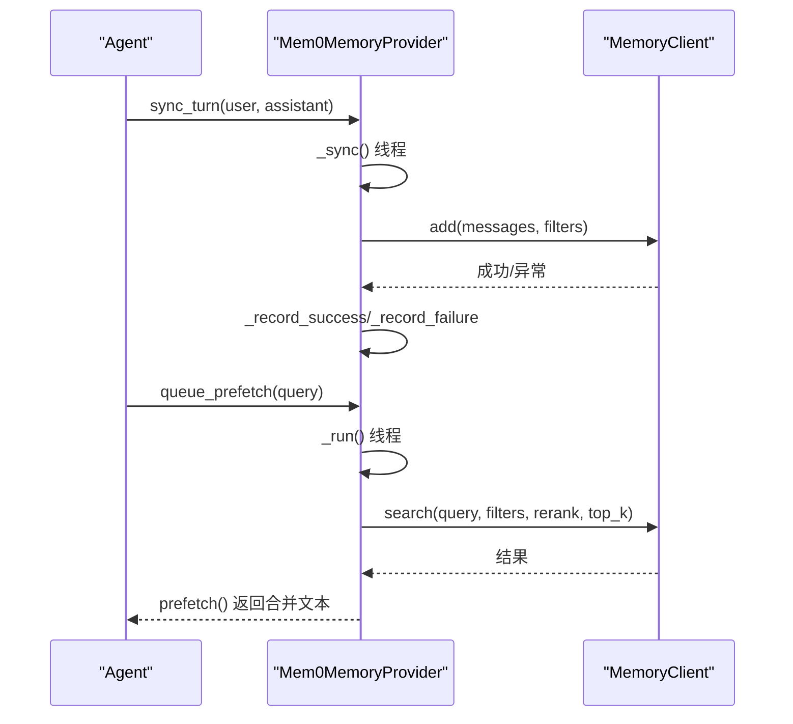
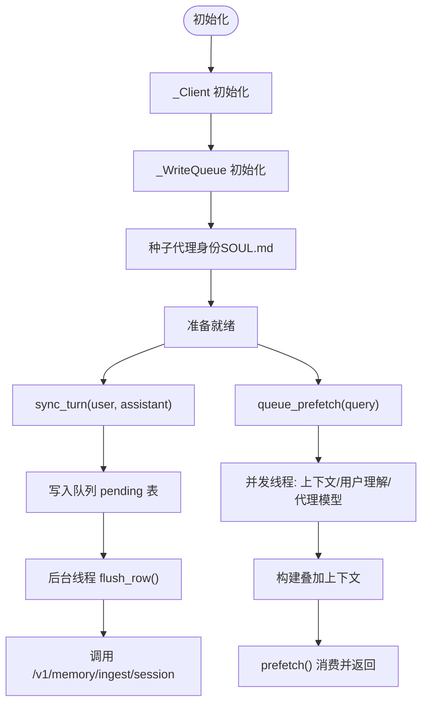
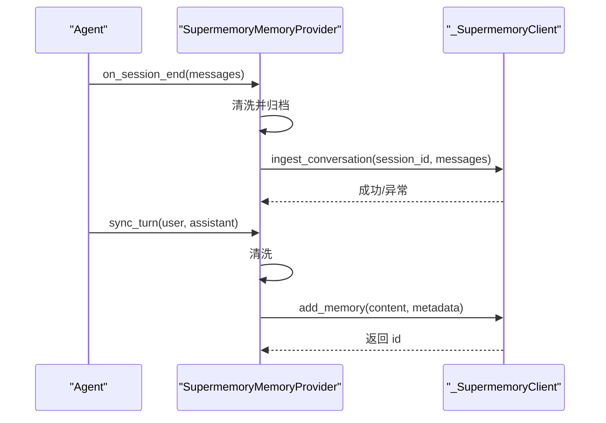
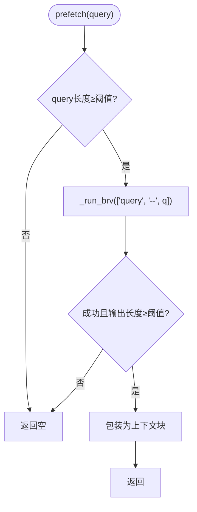
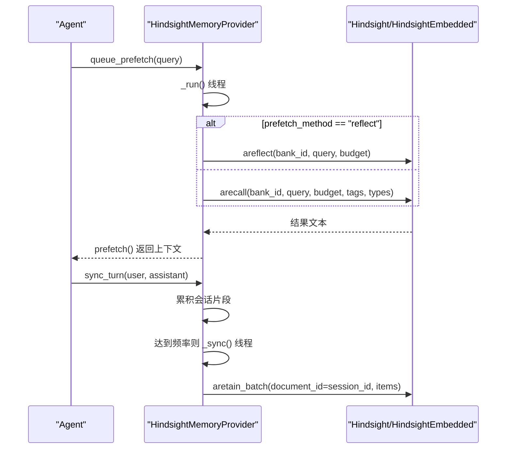
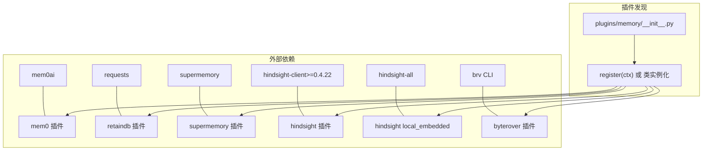

# 记忆提供程序

<cite>
**本文引用的文件**
- [plugins/memory/__init__.py](file://plugins/memory/__init__.py)
- [plugins/memory/holographic/__init__.py](file://plugins/memory/holographic/__init__.py)
- [plugins/memory/holographic/plugin.yaml](file://plugins/memory/holographic/plugin.yaml)
- [plugins/memory/mem0/__init__.py](file://plugins/memory/mem0/__init__.py)
- [plugins/memory/mem0/plugin.yaml](file://plugins/memory/mem0/plugin.yaml)
- [plugins/memory/retaindb/__init__.py](file://plugins/memory/retaindb/__init__.py)
- [plugins/memory/retaindb/plugin.yaml](file://plugins/memory/retaindb/plugin.yaml)
- [plugins/memory/supermemory/__init__.py](file://plugins/memory/supermemory/__init__.py)
- [plugins/memory/supermemory/plugin.yaml](file://plugins/memory/supermemory/plugin.yaml)
- [plugins/memory/byterover/__init__.py](file://plugins/memory/byterover/__init__.py)
- [plugins/memory/byterover/plugin.yaml](file://plugins/memory/byterover/plugin.yaml)
- [plugins/memory/hindsight/__init__.py](file://plugins/memory/hindsight/__init__.py)
- [plugins/memory/hindsight/plugin.yaml](file://plugins/memory/hindsight/plugin.yaml)
</cite>

## 目录
1. [简介](#简介)
2. [项目结构](#项目结构)
3. [核心组件](#核心组件)
4. [架构总览](#架构总览)
5. [详细组件分析](#详细组件分析)
6. [依赖关系分析](#依赖关系分析)
7. [性能考量](#性能考量)
8. [故障排查指南](#故障排查指南)
9. [结论](#结论)
10. [附录](#附录)

## 简介
本文件系统化梳理 Hermes Agent 的记忆提供程序体系，覆盖以下提供程序：holographic（本地结构化事实与HRR检索）、mem0（云端向量/语义检索与去重）、retaindb（云API驱动的跨会话记忆与文件工具）、supermemory（容器化长程记忆与会话归档）、byterover（本地CLI驱动的层级知识树）、hindsight（知识图谱与多策略检索）。文档从架构、数据流、处理逻辑、集成点、错误处理与性能特征等维度进行深入解析，并提供选择指南、最佳实践与迁移策略。

## 项目结构
记忆提供程序采用“插件式发现与加载”机制：
- 插件目录：plugins/memory/<name> 每个子目录代表一个提供程序插件
- 发现机制：plugins/memory/__init__.py 扫描并读取各插件的 plugin.yaml 元信息，动态导入并实例化 MemoryProvider 实现
- 配置入口：通过 hermes 配置中的 memory.provider 指定当前激活的提供程序；仅允许同时启用一个

图表来源
- [plugins/memory/__init__.py:32-75](file://plugins/memory/__init__.py#L32-L75)
- [plugins/memory/__init__.py:78-96](file://plugins/memory/__init__.py#L78-L96)
- [plugins/memory/__init__.py:219-231](file://plugins/memory/__init__.py#L219-L231)

章节来源
- [plugins/memory/__init__.py:32-96](file://plugins/memory/__init__.py#L32-L96)
- [plugins/memory/__init__.py:219-318](file://plugins/memory/__init__.py#L219-L318)

## 核心组件
- MemoryProvider 抽象：定义统一生命周期与接口（initialize、system_prompt_block、prefetch/queue_prefetch、sync_turn、get_tool_schemas、handle_tool_call、on_session_end/on_memory_write 等）
- 提供程序实现：各插件在自身 __init__.py 中实现 MemoryProvider 接口，并通过 register(ctx) 注册到系统
- 插件发现器：扫描 plugins/memory 下的子目录，读取 plugin.yaml 并调用插件的 is_available 进行可用性检查
- CLI 命令：仅对当前激活的提供程序暴露 CLI 子命令（通过 discover_plugin_cli_commands）

章节来源
- [plugins/memory/__init__.py:114-196](file://plugins/memory/__init__.py#L114-L196)
- [plugins/memory/__init__.py:303-318](file://plugins/memory/__init__.py#L303-L318)

## 架构总览
下图展示记忆提供程序的整体交互：配置解析、插件发现、实例化、生命周期钩子与工具调用。

图表来源
- [plugins/memory/__init__.py:219-231](file://plugins/memory/__init__.py#L219-L231)
- [plugins/memory/__init__.py:78-96](file://plugins/memory/__init__.py#L78-L96)
- [plugins/memory/__init__.py:303-318](file://plugins/memory/__init__.py#L303-L318)

## 详细组件分析

### Holographic（分布式事实存储与HRR检索）
- 特点
  - 本地 SQLite 存储，支持 FTS5 搜索与信任评分
  - HRR（四元数旋转表示）用于组合式检索与实体解析
  - 支持自动提取与手动工具操作（fact_store、fact_feedback）
- 配置
  - 通过 hermes_home/config.yaml under plugins.hermes-memory-store
  - 关键项：db_path、auto_extract、default_trust、hrr_dim、hrr_weight、temporal_decay_half_life
- 生命周期与钩子
  - initialize：初始化 MemoryStore 与 FactRetriever
  - prefetch：按查询返回高可信度事实列表
  - on_session_end：可选自动提取用户偏好/决策
  - on_memory_write：镜像内置记忆写入为事实
- 工具接口
  - fact_store：add/search/probe/reason/contradict/update/remove/list
  - fact_feedback：rate fact 帮助/无帮助以训练信任

图表来源
- [plugins/memory/holographic/__init__.py:114-180](file://plugins/memory/holographic/__init__.py#L114-L180)
- [plugins/memory/holographic/__init__.py:258-355](file://plugins/memory/holographic/__init__.py#L258-L355)

章节来源
- [plugins/memory/holographic/__init__.py:8-16](file://plugins/memory/holographic/__init__.py#L8-L16)
- [plugins/memory/holographic/__init__.py:96-108](file://plugins/memory/holographic/__init__.py#L96-L108)
- [plugins/memory/holographic/__init__.py:157-180](file://plugins/memory/holographic/__init__.py#L157-L180)
- [plugins/memory/holographic/__init__.py:205-251](file://plugins/memory/holographic/__init__.py#L205-L251)
- [plugins/memory/holographic/__init__.py:226-235](file://plugins/memory/holographic/__init__.py#L226-L235)
- [plugins/memory/holographic/__init__.py:236-242](file://plugins/memory/holographic/__init__.py#L236-L242)
- [plugins/memory/holographic/__init__.py:243-251](file://plugins/memory/holographic/__init__.py#L243-L251)
- [plugins/memory/holographic/__init__.py:358-397](file://plugins/memory/holographic/__init__.py#L358-L397)
- [plugins/memory/holographic/plugin.yaml:1-6](file://plugins/memory/holographic/plugin.yaml#L1-L6)

### Mem0（基于向量的云端存储与检索）
- 特点
  - 服务端抽取事实，支持语义搜索与重排序
  - 自动去重与断路器保护（连续失败后冷却）
  - 支持 profile、search、conclude 三类工具
- 配置
  - 环境变量：MEM0_API_KEY、MEM0_USER_ID、MEM0_AGENT_ID
  - 或通过 hermes_home/mem0.json 覆盖
- 生命周期与钩子
  - initialize：读取配置，设置 user_id/agent_id/rerank
  - prefetch：后台线程预取，结果在下一轮消费
  - sync_turn：非阻塞地提交对话，触发服务端抽取
  - 断路器：连续失败超过阈值进入冷却期，避免雪崩

图表来源
- [plugins/memory/mem0/__init__.py:203-211](file://plugins/memory/mem0/__init__.py#L203-L211)
- [plugins/memory/mem0/__init__.py:247-271](file://plugins/memory/mem0/__init__.py#L247-L271)
- [plugins/memory/mem0/__init__.py:272-296](file://plugins/memory/mem0/__init__.py#L272-L296)
- [plugins/memory/mem0/__init__.py:300-362](file://plugins/memory/mem0/__init__.py#L300-L362)

章节来源
- [plugins/memory/mem0/__init__.py:8-14](file://plugins/memory/mem0/__init__.py#L8-L14)
- [plugins/memory/mem0/__init__.py:40-67](file://plugins/memory/mem0/__init__.py#L40-L67)
- [plugins/memory/mem0/__init__.py:142-145](file://plugins/memory/mem0/__init__.py#L142-L145)
- [plugins/memory/mem0/__init__.py:168-202](file://plugins/memory/mem0/__init__.py#L168-L202)
- [plugins/memory/mem0/__init__.py:237-271](file://plugins/memory/mem0/__init__.py#L237-L271)
- [plugins/memory/mem0/__init__.py:272-296](file://plugins/memory/mem0/__init__.py#L272-L296)
- [plugins/memory/mem0/__init__.py:297-362](file://plugins/memory/mem0/__init__.py#L297-L362)
- [plugins/memory/mem0/plugin.yaml:1-6](file://plugins/memory/mem0/plugin.yaml#L1-L6)

### RetainDB（数据库集成与共享文件）
- 特点
  - 云 API 驱动，支持语义检索、用户画像、任务上下文合成
  - 写入队列：SQLite 异步写入，崩溃安全，启动重放
  - 文件工具：上传/列出/读取/索引/删除
  - 多线程预取：用户理解、代理自模型、上下文叠加
- 配置
  - 环境变量：RETAINDB_API_KEY、RETAINDB_BASE_URL、RETAINDB_PROJECT
  - 或通过 hermes_home/config.yaml under retaindb:
- 生命周期与钩子
  - initialize：构建 _Client、_WriteQueue，种子代理身份（SOUL.md）
  - queue_prefetch：并发预取上下文/用户理解/代理模型
  - sync_turn：将对话入队异步写入
  - on_memory_write：镜像内置记忆写入

图表来源
- [plugins/memory/retaindb/__init__.py:489-512](file://plugins/memory/retaindb/__init__.py#L489-L512)
- [plugins/memory/retaindb/__init__.py:542-558](file://plugins/memory/retaindb/__init__.py#L542-L558)
- [plugins/memory/retaindb/__init__.py:627-640](file://plugins/memory/retaindb/__init__.py#L627-L640)
- [plugins/memory/retaindb/__init__.py:747-756](file://plugins/memory/retaindb/__init__.py#L747-L756)

章节来源
- [plugins/memory/retaindb/__init__.py:15-19](file://plugins/memory/retaindb/__init__.py#L15-L19)
- [plugins/memory/retaindb/__init__.py:480-512](file://plugins/memory/retaindb/__init__.py#L480-L512)
- [plugins/memory/retaindb/__init__.py:542-624](file://plugins/memory/retaindb/__init__.py#L542-L624)
- [plugins/memory/retaindb/__init__.py:627-640](file://plugins/memory/retaindb/__init__.py#L627-L640)
- [plugins/memory/retaindb/__init__.py:643-744](file://plugins/memory/retaindb/__init__.py#L643-L744)
- [plugins/memory/retaindb/plugin.yaml:1-8](file://plugins/memory/retaindb/plugin.yaml#L1-L8)

### Supermemory（容器化长期记忆与会话归档）
- 特点
  - 容器标签化组织记忆，支持多容器模式
  - profile recall + 语义搜索 + 显式存储/遗忘
  - 清洗对话后批量归档至 conversations
  - 可配置 recall/budget/capture 模式
- 配置
  - 环境变量：SUPERMEMORY_API_KEY、可选 SUPERMEMORY_CONTAINER_TAG
  - hermes_home/supermemory.json：容器标签、召回/捕获策略、实体上下文等
- 生命周期与钩子
  - initialize：加载配置、解析容器标签、决定是否启用
  - prefetch：周期性或首次调用时拉取 profile + 搜索结果
  - sync_turn：清洗并异步添加单轮记忆
  - on_session_end：清洗并批量归档整次会话
  - on_memory_write：镜像内置记忆写入

图表来源
- [plugins/memory/supermemory/__init__.py:595-616](file://plugins/memory/supermemory/__init__.py#L595-L616)
- [plugins/memory/supermemory/__init__.py:563-594](file://plugins/memory/supermemory/__init__.py#L563-L594)
- [plugins/memory/supermemory/__init__.py:617-638](file://plugins/memory/supermemory/__init__.py#L617-L638)

章节来源
- [plugins/memory/supermemory/__init__.py:1-5](file://plugins/memory/supermemory/__init__.py#L1-L5)
- [plugins/memory/supermemory/__init__.py:98-141](file://plugins/memory/supermemory/__init__.py#L98-L141)
- [plugins/memory/supermemory/__init__.py:420-526](file://plugins/memory/supermemory/__init__.py#L420-L526)
- [plugins/memory/supermemory/__init__.py:546-562](file://plugins/memory/supermemory/__init__.py#L546-L562)
- [plugins/memory/supermemory/__init__.py:595-638](file://plugins/memory/supermemory/__init__.py#L595-L638)
- [plugins/memory/supermemory/plugin.yaml:1-6](file://plugins/memory/supermemory/plugin.yaml#L1-L6)

### ByteRover（二进制CLI驱动的层级知识树）
- 特点
  - 本地 brv CLI 驱动，持久化知识树，分层检索
  - 查询阻塞式（prefetch 同步），Curate 异步
  - 支持 on_pre_compress 提前提炼压缩前上下文
- 配置
  - 环境变量：BRV_API_KEY（可选，用于云同步）
  - 工作目录：hermes_home/byterover/
- 生命周期与钩子
  - initialize：创建工作目录
  - prefetch：同步执行 brv query，返回上下文
  - sync_turn：异步 brv curate 组合对话内容
  - on_memory_write：镜像内置写入
  - on_pre_compress：将即将丢弃的回合摘要写入知识树

图表来源
- [plugins/memory/byterover/__init__.py:215-232](file://plugins/memory/byterover/__init__.py#L215-L232)
- [plugins/memory/byterover/__init__.py:237-263](file://plugins/memory/byterover/__init__.py#L237-L263)
- [plugins/memory/byterover/__init__.py:282-313](file://plugins/memory/byterover/__init__.py#L282-L313)

章节来源
- [plugins/memory/byterover/__init__.py:8-16](file://plugins/memory/byterover/__init__.py#L8-L16)
- [plugins/memory/byterover/__init__.py:184-187](file://plugins/memory/byterover/__init__.py#L184-L187)
- [plugins/memory/byterover/__init__.py:205-214](file://plugins/memory/byterover/__init__.py#L205-L214)
- [plugins/memory/byterover/__init__.py:215-232](file://plugins/memory/byterover/__init__.py#L215-L232)
- [plugins/memory/byterover/__init__.py:237-263](file://plugins/memory/byterover/__init__.py#L237-L263)
- [plugins/memory/byterover/__init__.py:264-281](file://plugins/memory/byterover/__init__.py#L264-L281)
- [plugins/memory/byterover/__init__.py:282-313](file://plugins/memory/byterover/__init__.py#L282-L313)
- [plugins/memory/byterover/plugin.yaml:1-10](file://plugins/memory/byterover/plugin.yaml#L1-L10)

### Hindsight（知识图谱与多策略检索）
- 特点
  - 支持 cloud/local_embedded/local_external 三种模式
  - 多策略检索：语义/关键词/实体图遍历/重排
  - 支持 tags/类型过滤、预算控制、反射合成
- 配置
  - hermes_home/hindsight/config.json（优先）或 ~/.hindsight/config.json（兼容）
  - 环境变量：HINDSIGHT_API_KEY、HINDSIGHT_BANK_ID、HINDSIGHT_BUDGET、HINDSIGHT_API_URL、HINDSIGHT_MODE
- 生命周期与钩子
  - initialize：根据模式创建客户端，必要时启动本地嵌入式守护
  - queue_prefetch：异步 recall/reflect，结果在 prefetch 消费
  - sync_turn：按保留频率批量保留会话片段
  - 工具：hindsight_retain、hindsight_recall、hindsight_reflect

图表来源
- [plugins/memory/hindsight/__init__.py:672-714](file://plugins/memory/hindsight/__init__.py#L672-L714)
- [plugins/memory/hindsight/__init__.py:715-773](file://plugins/memory/hindsight/__init__.py#L715-L773)
- [plugins/memory/hindsight/__init__.py:779-800](file://plugins/memory/hindsight/__init__.py#L779-L800)

章节来源
- [plugins/memory/hindsight/__init__.py:8-17](file://plugins/memory/hindsight/__init__.py#L8-L17)
- [plugins/memory/hindsight/__init__.py:142-179](file://plugins/memory/hindsight/__init__.py#L142-L179)
- [plugins/memory/hindsight/__init__.py:439-468](file://plugins/memory/hindsight/__init__.py#L439-L468)
- [plugins/memory/hindsight/__init__.py:672-714](file://plugins/memory/hindsight/__init__.py#L672-L714)
- [plugins/memory/hindsight/__init__.py:715-773](file://plugins/memory/hindsight/__init__.py#L715-L773)
- [plugins/memory/hindsight/__init__.py:779-800](file://plugins/memory/hindsight/__init__.py#L779-L800)
- [plugins/memory/hindsight/plugin.yaml:1-9](file://plugins/memory/hindsight/plugin.yaml#L1-L9)

## 依赖关系分析
- 插件发现与加载
  - 通过 plugins/memory/__init__.py 动态导入各插件模块，优先查找 register(ctx) 注册函数，否则实例化类本身
  - 仅加载当前激活的提供程序的 CLI 子命令
- 外部依赖
  - mem0：需要 mem0ai 包
  - retaindb：需要 requests
  - supermemory：需要 supermemory 包
  - hindsight：cloud 模式需要 hindsight-client（版本≥0.4.22），local_embedded 需要 hindsight-all
  - byterover：需要 brv CLI（外部二进制）
- 配置来源
  - holographic：hermes_home/config.yaml under plugins.hermes-memory-store
  - mem0：环境变量或 hermes_home/mem0.json
  - retaindb：环境变量或 hermes_home/config.yaml under retaindb:
  - supermemory：环境变量或 hermes_home/supermemory.json
  - byterover：环境变量 BRV_API_KEY（可选）
  - hindsight：hermes_home/hindsight/config.json 或 ~/.hindsight/config.json，或环境变量

图表来源
- [plugins/memory/__init__.py:175-196](file://plugins/memory/__init__.py#L175-L196)
- [plugins/memory/mem0/plugin.yaml:4-5](file://plugins/memory/mem0/plugin.yaml#L4-L5)
- [plugins/memory/retaindb/plugin.yaml:4-7](file://plugins/memory/retaindb/plugin.yaml#L4-L7)
- [plugins/memory/supermemory/plugin.yaml:4-5](file://plugins/memory/supermemory/plugin.yaml#L4-L5)
- [plugins/memory/hindsight/plugin.yaml:4-5](file://plugins/memory/hindsight/plugin.yaml#L4-L5)
- [plugins/memory/byterover/plugin.yaml:4-7](file://plugins/memory/byterover/plugin.yaml#L4-L7)

章节来源
- [plugins/memory/__init__.py:175-196](file://plugins/memory/__init__.py#L175-L196)
- [plugins/memory/mem0/plugin.yaml:4-5](file://plugins/memory/mem0/plugin.yaml#L4-L5)
- [plugins/memory/retaindb/plugin.yaml:4-7](file://plugins/memory/retaindb/plugin.yaml#L4-L7)
- [plugins/memory/supermemory/plugin.yaml:4-5](file://plugins/memory/supermemory/plugin.yaml#L4-L5)
- [plugins/memory/hindsight/plugin.yaml:4-5](file://plugins/memory/hindsight/plugin.yaml#L4-L5)
- [plugins/memory/byterover/plugin.yaml:4-7](file://plugins/memory/byterover/plugin.yaml#L4-L7)

## 性能考量
- I/O 与延迟
  - holographic：本地 SQLite，FTS5 查询；适合中小规模事实检索与信任评分
  - mem0：网络请求，断路器保护；预取与同步均使用线程池，避免阻塞主线程
  - retaindb：写入队列异步，崩溃安全；预取并发线程，结果合并后一次性消费
  - supermemory：批量归档，单轮写入异步；预取/同步线程复用
  - byterover：prefetch 同步阻塞，确保模型调用前上下文可用；curate 异步
  - hindsight：cloud 模式异步回调；local_embedded 需要守护进程启动开销
- 资源占用
  - mem0/retaindb/supermemory/hindsight：网络与线程资源
  - byterover：CLI 进程与文件系统
  - holographic：SQLite 文件大小与 FTS5 索引维护
- 可靠性
  - mem0/retaindb/hindsight：具备重试/冷却/守护线程；hindsight local_embedded 有日志文件
  - byterover：超时控制与缓存 brv 路径

## 故障排查指南
- 插件不可用
  - 检查 is_available 返回值与外部依赖是否满足
  - 确认环境变量/配置文件路径正确
- 网络相关
  - mem0：查看断路器状态与冷却时间；确认 API key 有效
  - retaindb：检查 API key、base_url、project；关注写队列 pending 表错误
  - hindsight：cloud 模式确认 API key/url；local 模式确认守护进程状态
- 本地工具
  - byterover：确认 brv CLI 可执行；检查工作目录权限
  - holographic：确认 SQLite 文件可写；检查 HRR 参数与信任阈值
- 日志定位
  - 各插件在关键路径记录调试日志（如 prefetch 失败、写入失败、守护启动失败）

章节来源
- [plugins/memory/mem0/__init__.py:180-202](file://plugins/memory/mem0/__init__.py#L180-L202)
- [plugins/memory/retaindb/__init__.py:380-404](file://plugins/memory/retaindb/__init__.py#L380-L404)
- [plugins/memory/hindsight/__init__.py:560-631](file://plugins/memory/hindsight/__init__.py#L560-L631)
- [plugins/memory/byterover/__init__.py:105-114](file://plugins/memory/byterover/__init__.py#L105-L114)

## 结论
- 若追求本地可控与结构化检索：选择 holographic
- 若需要云端向量化检索与自动抽取：选择 mem0
- 若需要跨会话云记忆与文件工具：选择 retaindb
- 若需要容器化长期记忆与会话归档：选择 supermemory
- 若偏好本地 CLI 与层级知识树：选择 byterover
- 若需要知识图谱与多策略检索：选择 hindsight

## 附录

### 提供程序选择指南
- 数据隐私与离线需求：holographic、byterover、hindsight local_embedded
- 云端能力与易用性：mem0、retaindb、supermemory、hindsight cloud
- 检索质量与复杂度：hindsight（知识图谱/多策略）> retaindb > supermemory > mem0 > holographic
- 配置复杂度：hindsight（多模式/多参数）> retaindb > supermemory > mem0 > byterover > holographic

### 安装与配置要点
- mem0：安装 mem0ai；设置 MEM0_API_KEY；可选 mem0.json 覆盖
- retaindb：设置 RETAINDB_API_KEY；可选 RETAINDB_BASE_URL/RETAINDB_PROJECT；配置在 hermes_home/config.yaml under retaindb:
- supermemory：设置 SUPERMEMORY_API_KEY；可选 SUPERMEMORY_CONTAINER_TAG；配置在 hermes_home/supermemory.json
- byterover：安装 brv CLI；可选 BRV_API_KEY；工作目录 hermes_home/byterover/
- hindsight：cloud 模式需 hindsight-client；local_embedded 需 hindsight-all；配置在 hermes_home/hindsight/config.json 或 ~/.hindsight/config.json

### 兼容性与迁移策略
- 同一时间仅启用一个提供程序（由 memory.provider 指定）
- 迁移步骤建议：
  - 备份当前配置与数据（各插件的配置文件与工作目录）
  - 在新提供程序中导入历史数据（如 retaindb 的 profile/search 结果、holographic 的 facts、byterover 的知识树）
  - 更新 hermes_home/config.yaml 的 memory.provider 与新提供程序的配置
  - 逐步验证工具调用与上下文注入效果
- 注意事项：
  - 不同提供程序的工具集不同，迁移后需调整技能/提示词
  - 云端提供程序存在 API 限额与网络延迟差异
  - 本地提供程序需关注磁盘空间与进程稳定性