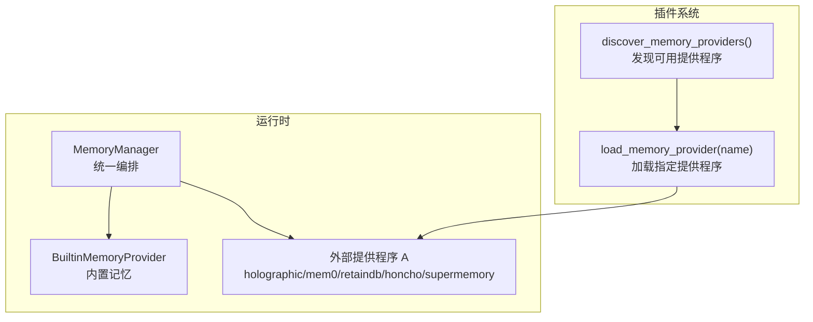
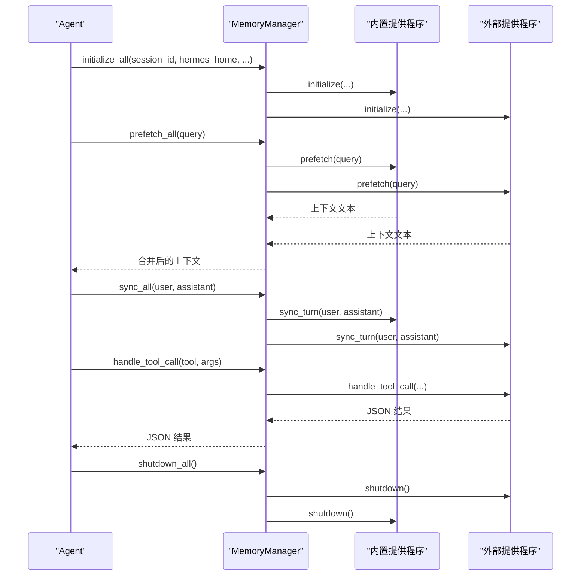
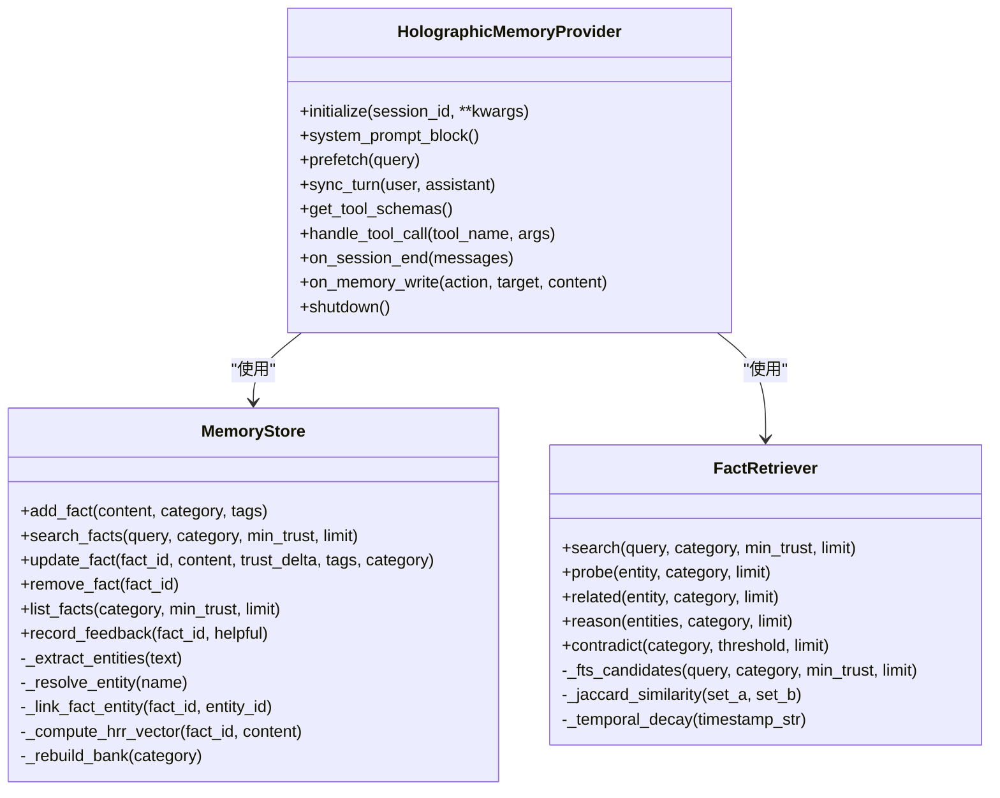
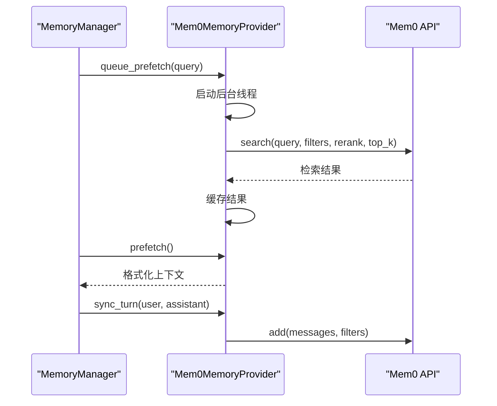
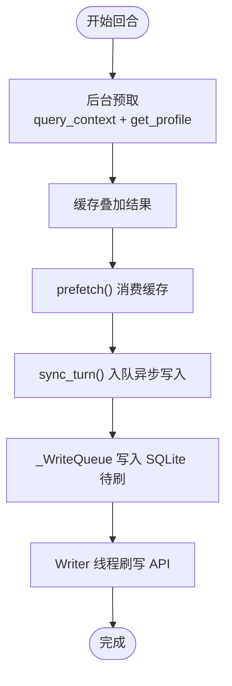
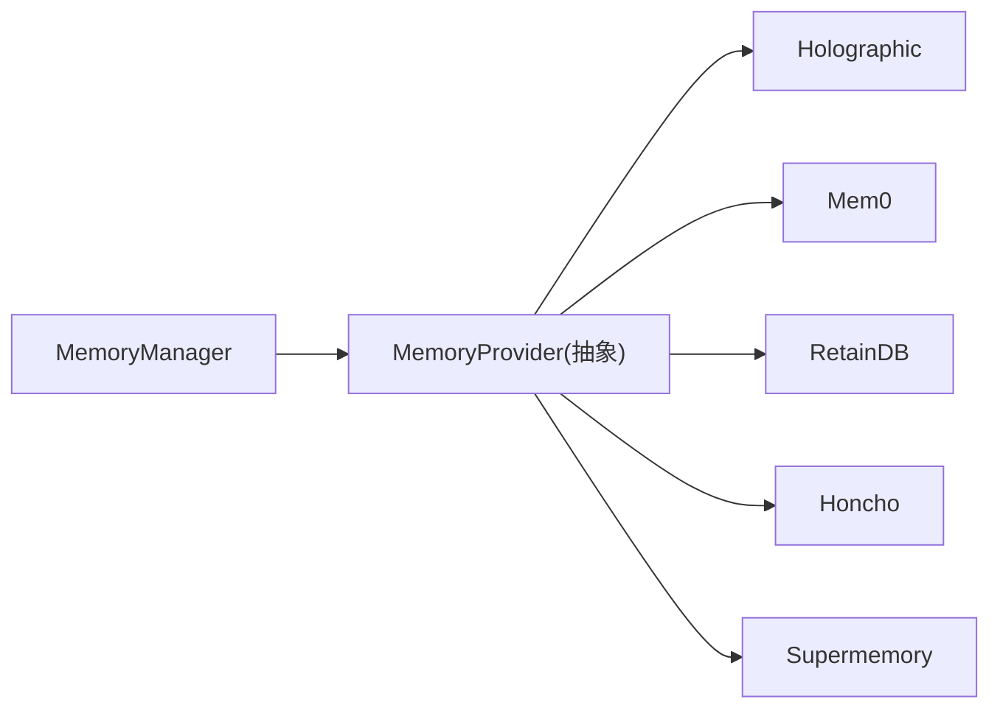

# 记忆系统

<cite>
**本文引用的文件**
- [agent/memory_manager.py](file://agent/memory_manager.py)
- [agent/memory_provider.py](file://agent/memory_provider.py)
- [plugins/memory/__init__.py](file://plugins/memory/__init__.py)
- [plugins/memory/holographic/__init__.py](file://plugins/memory/holographic/__init__.py)
- [plugins/memory/holographic/store.py](file://plugins/memory/holographic/store.py)
- [plugins/memory/holographic/retrieval.py](file://plugins/memory/holographic/retrieval.py)
- [plugins/memory/mem0/__init__.py](file://plugins/memory/mem0/__init__.py)
- [plugins/memory/retaindb/__init__.py](file://plugins/memory/retaindb/__init__.py)
- [plugins/memory/honcho/__init__.py](file://plugins/memory/honcho/__init__.py)
- [plugins/memory/supermemory/__init__.py](file://plugins/memory/supermemory/__init__.py)
- [hermes_cli/memory_setup.py](file://hermes_cli/memory_setup.py)
</cite>

## 目录
1. [简介](#简介)
2. [项目结构](#项目结构)
3. [核心组件](#核心组件)
4. [架构总览](#架构总览)
5. [详细组件分析](#详细组件分析)
6. [依赖关系分析](#依赖关系分析)
7. [性能考量](#性能考量)
8. [故障排查指南](#故障排查指南)
9. [结论](#结论)
10. [附录](#附录)

## 简介
本文件系统性阐述 Hermes Agent 的记忆系统：包括记忆管理器的架构设计、持久化机制、检索算法、不同记忆提供程序（holographic、mem0、retaindb、honcho、supermemory）的特性与差异、记忆压缩与去重策略、配置与性能调优、以及与代理对话循环的集成方式。目标是帮助开发者与使用者在不深入源码的前提下，理解并高效使用该记忆体系。

## 项目结构
Hermes 将“内置记忆”与“外部插件记忆提供程序”解耦：
- 内置记忆始终激活，负责跨会话的持久化（如 MEMORY.md / USER.md），作为第一个提供程序注册。
- 外部提供程序（如 holographic、mem0、retaindb、honcho、supermemory）通过插件系统按需启用，且同一时间仅允许一个外部提供程序生效，以避免工具 schema 混乱与后端冲突。

图示来源
- [agent/memory_manager.py:72-131](file://agent/memory_manager.py#L72-L131)
- [plugins/memory/__init__.py:32-96](file://plugins/memory/__init__.py#L32-L96)

章节来源
- [agent/memory_manager.py:1-363](file://agent/memory_manager.py#L1-L363)
- [agent/memory_provider.py:1-232](file://agent/memory_provider.py#L1-L232)
- [plugins/memory/__init__.py:1-317](file://plugins/memory/__init__.py#L1-L317)

## 核心组件
- MemoryManager：统一编排内置与最多一个外部记忆提供程序；负责系统提示拼装、预取上下文、回合同步、工具路由、生命周期钩子与优雅关闭。
- MemoryProvider 抽象基类：定义提供程序必须实现的生命周期方法（initialize、system_prompt_block、prefetch、sync_turn、get_tool_schemas、handle_tool_call 等）与可选钩子（on_turn_start、on_session_end、on_pre_compress、on_memory_write、on_delegation 等）。
- 插件发现与加载：扫描 plugins/memory/<name>/ 目录，自动发现并加载提供程序，支持交互式配置向导。

章节来源
- [agent/memory_manager.py:72-363](file://agent/memory_manager.py#L72-L363)
- [agent/memory_provider.py:42-232](file://agent/memory_provider.py#L42-L232)
- [plugins/memory/__init__.py:32-96](file://plugins/memory/__init__.py#L32-L96)

## 架构总览
记忆系统的运行时流程如下：
- 初始化阶段：MemoryManager.initialize_all 注入 hermes_home 并依次调用各提供程序 initialize。
- 对话前：prefetch_all 收集所有提供程序的预取上下文，构建注入到模型的上下文块。
- 回合后：sync_all 将用户与助手的对话写入后端（异步非阻塞）。
- 工具调用：MemoryManager.handle_tool_call 将工具名路由至对应提供程序。
- 生命周期：on_turn_start/on_session_end/on_pre_compress/on_memory_write/on_delegation 提供细粒度控制点。
- 关闭：shutdown_all 逆序关闭，确保资源有序释放。

图示来源
- [agent/memory_manager.py:146-363](file://agent/memory_manager.py#L146-L363)

章节来源
- [agent/memory_manager.py:146-363](file://agent/memory_manager.py#L146-L363)

## 详细组件分析

### MemoryManager 组件
- 职责边界清晰：只负责编排与路由，不直接处理具体存储细节。
- 容错与隔离：单个提供程序异常不影响其他提供程序；工具冲突通过名称去重与警告处理。
- 预取与队列：prefetch_all 返回合并上下文；queue_prefetch 在当前回合结束后为下一回合预取，避免阻塞。
- 生命周期钩子：提供 turn 级、会话级、压缩前、镜像写入、委托完成等扩展点。
- 配置注入：自动注入 hermes_home，便于提供程序解析个人化路径。

章节来源
- [agent/memory_manager.py:72-363](file://agent/memory_manager.py#L72-L363)

### MemoryProvider 抽象基类
- 必须实现：name、is_available、initialize、get_tool_schemas、handle_tool_call（部分提供程序可覆盖）。
- 可选钩子：system_prompt_block、prefetch、queue_prefetch、sync_turn、on_turn_start、on_session_end、on_pre_compress、on_memory_write、on_delegation、get_config_schema、save_config。
- 设计要点：通过 get_config_schema/save_config 实现“环境变量 + 原生配置文件”的双通道配置；通过 get_tool_schemas/handle_tool_call 暴露工具接口给模型。

章节来源
- [agent/memory_provider.py:42-232](file://agent/memory_provider.py#L42-L232)

### 插件发现与加载
- discover_memory_providers：扫描 plugins/memory/<name>/，读取 plugin.yaml 获取元信息，判断可用性。
- load_memory_provider：动态导入模块并提取提供程序实例（优先 register(ctx) 或顶层类）。
- hermes_cli/memory_setup：提供交互式选择与配置向导，安装依赖、写入 .env 与 config.yaml，并保存激活的 provider。

章节来源
- [plugins/memory/__init__.py:32-96](file://plugins/memory/__init__.py#L32-L96)
- [hermes_cli/memory_setup.py:183-351](file://hermes_cli/memory_setup.py#L183-L351)

### Holographic 记忆提供程序
- 特性：结构化事实存储、实体解析、信任评分、HRR 向量检索与组合推理（probe/reason/related/contradict）。
- 存储：SQLite + FTS5 全文索引 + 触发器维护；支持 HRR 向量计算与“记忆仓”聚合。
- 检索：FTS5 候选 + Jaccard 重排 + 信任加权 + 可选时间衰减；支持基于 HRR 的代数查询。
- 工具：fact_store（增删改查、反馈）、fact_feedback（训练信任）。
- 自动抽取：会话结束时根据正则抽取偏好与决策类内容。

图示来源
- [plugins/memory/holographic/store.py:98-575](file://plugins/memory/holographic/store.py#L98-L575)
- [plugins/memory/holographic/retrieval.py:22-594](file://plugins/memory/holographic/retrieval.py#L22-L594)
- [plugins/memory/holographic/__init__.py:114-408](file://plugins/memory/holographic/__init__.py#L114-L408)

章节来源
- [plugins/memory/holographic/store.py:98-575](file://plugins/memory/holographic/store.py#L98-L575)
- [plugins/memory/holographic/retrieval.py:22-594](file://plugins/memory/holographic/retrieval.py#L22-L594)
- [plugins/memory/holographic/__init__.py:114-408](file://plugins/memory/holographic/__init__.py#L114-L408)

### Mem0 记忆提供程序
- 特性：服务端事实抽取、语义搜索 + 重排序、自动去重；带断路器防止连续失败时的雪崩。
- 检索：后台线程预取，返回简洁列表；支持 rerank 开关。
- 工具：mem0_profile（快速概览）、mem0_search（语义检索）、mem0_conclude（显式存储）。
- 作用域：按 user_id + agent_id 过滤写入；按 user_id 过滤读取。

图示来源
- [plugins/memory/mem0/__init__.py:237-296](file://plugins/memory/mem0/__init__.py#L237-L296)
- [plugins/memory/mem0/__init__.py:272-296](file://plugins/memory/mem0/__init__.py#L272-L296)

章节来源
- [plugins/memory/mem0/__init__.py:119-374](file://plugins/memory/mem0/__init__.py#L119-L374)

### RetainDB 记忆提供程序
- 特性：云端 API + 本地 SQLite 异步写入队列（崩溃容错）；语义搜索 + 用户画像 + 任务相关上下文叠加；Dialectic 合成与 Agent 自我模型；共享文件工具链。
- 持久化：_WriteQueue 使用 SQLite 存储待写入消息，启动时重放，线程安全。
- 检索：query_context + get_profile 叠加去重输出；后台线程预取上下文、对话合成与自我模型。
- 工具：profile/search/context/remember/forget + 文件上传/列举/读取/索引/删除。

图示来源
- [plugins/memory/retaindb/__init__.py:542-640](file://plugins/memory/retaindb/__init__.py#L542-L640)
- [plugins/memory/retaindb/__init__.py:330-408](file://plugins/memory/retaindb/__init__.py#L330-L408)

章节来源
- [plugins/memory/retaindb/__init__.py:452-767](file://plugins/memory/retaindb/__init__.py#L452-L767)

### Honcho 记忆提供程序
- 特性：AI 原生用户建模，对话式问答（Dialectic）、语义搜索、Peer Card、结论持久化。
- 模式：context/tools/hybrid 三种召回模式；成本感知的频率与节流控制；首次回合烘焙上下文。
- 工具：profile（Peer Card）、search（原始片段）、context（合成回答）、conclude（持久化结论）。
- 会话管理：HonchoSessionManager 管理会话、迁移旧内存文件、预热与刷新。

章节来源
- [plugins/memory/honcho/__init__.py:119-723](file://plugins/memory/honcho/__init__.py#L119-L723)

### Supermemory 记忆提供程序
- 特性：容器化长期记忆、自动/显式捕获、会话末尾整段摄入、多容器标签、实体上下文指导。
- 捕获策略：清理上下文标记、过滤 trivial 消息、按长度阈值与模式判定是否捕获。
- 检索：profile（静态+动态+搜索结果）+ 搜索 + 忘记（精确或最佳匹配）。
- 工具：store/search/forget/profile；支持可选容器标签参数。

章节来源
- [plugins/memory/supermemory/__init__.py:420-792](file://plugins/memory/supermemory/__init__.py#L420-L792)

## 依赖关系分析
- MemoryManager 依赖 MemoryProvider 接口，不关心具体实现；通过工具 schema 名称路由到对应提供程序。
- 各外部提供程序各自封装网络/数据库客户端与本地缓存，遵循统一生命周期。
- 插件发现与加载独立于运行时，通过插件目录与 plugin.yaml 元数据驱动。

图示来源
- [agent/memory_manager.py:72-131](file://agent/memory_manager.py#L72-L131)
- [agent/memory_provider.py:42-131](file://agent/memory_provider.py#L42-L131)
- [plugins/memory/__init__.py:32-96](file://plugins/memory/__init__.py#L32-L96)

章节来源
- [agent/memory_manager.py:72-131](file://agent/memory_manager.py#L72-L131)
- [agent/memory_provider.py:42-131](file://agent/memory_provider.py#L42-L131)
- [plugins/memory/__init__.py:32-96](file://plugins/memory/__init__.py#L32-L96)

## 性能考量
- 异步与后台线程
  - Mem0/RetainDB/Honcho/Supermemory 均采用后台线程执行检索与写入，避免阻塞主对话循环。
  - RetainDB 的 _WriteQueue 使用 SQLite 保证崩溃后恢复与重放。
- 预取与缓存
  - MemoryManager.prefetch_all 合并多个提供程序的结果；queue_prefetch 为下一回合提前准备。
  - RetainDB/Honcho 通过锁与线程池限制并发，避免频繁触发导致的资源争用。
- 检索权重与降本
  - Holographic 的检索权重可随 numpy 可用性自动调整；Mem0/RetainDB 支持 rerank 控制精度与成本。
  - Honcho 支持 injectionFrequency、cadence、reasoningLevelCap 等成本控制参数。
- 去重与压缩
  - RetainDB 的上下文叠加去重；Supermemory 的检索结果去重；Holographic 的 FTS5 + Jaccard + 信任加权天然抑制噪声。
- I/O 与持久化
  - Holographic 使用 WAL 模式提升并发；RetainDB 的 SQLite 队列持久化；Mem0/RetainDB/Honcho/Suppermemory 的网络调用均具备超时与断路器保护。

章节来源
- [plugins/memory/mem0/__init__.py:237-296](file://plugins/memory/mem0/__init__.py#L237-L296)
- [plugins/memory/retaindb/__init__.py:330-408](file://plugins/memory/retaindb/__init__.py#L330-L408)
- [plugins/memory/honcho/__init__.py:477-523](file://plugins/memory/honcho/__init__.py#L477-L523)
- [plugins/memory/supermemory/__init__.py:189-206](file://plugins/memory/supermemory/__init__.py#L189-L206)
- [plugins/memory/holographic/store.py:129-136](file://plugins/memory/holographic/store.py#L129-L136)

## 故障排查指南
- 提供程序不可用
  - 检查 is_available 与依赖安装；查看 hermes memory status 输出的缺失密钥与状态。
- 工具调用错误
  - MemoryManager.handle_tool_call 会捕获异常并返回工具错误 JSON；检查 required 参数与 provider 是否已初始化。
- 网络与限流
  - Mem0/RetainDB/Honcho/Suppermemory 的网络调用可能因超时或限流失败；关注断路器日志与重试策略。
- 配置问题
  - 使用 hermes_cli/memory_setup 重新配置 provider；确认 .env 与 config.yaml 中的键值正确。
- 生命周期异常
  - 若某提供程序抛出异常，MemoryManager 会记录警告但不会阻塞其他提供程序；必要时重启会话或调用 shutdown_all 后重新初始化。

章节来源
- [hermes_cli/memory_setup.py:382-437](file://hermes_cli/memory_setup.py#L382-L437)
- [agent/memory_manager.py:238-257](file://agent/memory_manager.py#L238-L257)
- [plugins/memory/mem0/__init__.py:180-202](file://plugins/memory/mem0/__init__.py#L180-L202)

## 结论
Hermes 的记忆系统通过 MemoryManager 将“内置记忆”与“外部插件提供程序”解耦，既保证了默认可用性，又提供了强大的可扩展性。不同提供程序在检索算法、持久化策略与工具能力上各有侧重：Holographic 强在结构化事实与代数检索；Mem0 强在服务端抽取与去重；RetainDB 强在云端协同与文件工具链；Honcho 强在 AI 原生用户建模；Supermemory 强在容器化与会话摄入。结合异步线程、断路器、成本控制与去重策略，可在不同场景下取得平衡的准确性与性能。

## 附录

### 记忆系统与代理对话循环的集成
- 系统提示：MemoryManager.build_system_prompt 汇聚各提供程序的静态提示块。
- 预取上下文：prefetch_all 在每次对话前注入相关背景；queue_prefetch 为下一回合做准备。
- 回合同步：sync_all 在每轮结束后异步写入后端。
- 工具调用：handle_tool_call 将模型函数调用路由到对应提供程序。
- 生命周期：on_turn_start/on_session_end/on_pre_compress/on_memory_write/on_delegation 提供细粒度控制。

章节来源
- [agent/memory_manager.py:146-303](file://agent/memory_manager.py#L146-L303)

### 记忆提供程序对比表
- Holographic：结构化事实 + HRR 代数检索 + 信任评分 + 自动抽取
- Mem0：服务端抽取 + 语义检索 + 重排序 + 断路器
- RetainDB：云端 API + 本地异步队列 + 语义搜索 + 用户画像 + 文件工具
- Honcho：AI 原生用户建模 + Dialectic 合成 + Peer Card + 成本控制
- Supermemory：容器化长期记忆 + 自动/显式捕获 + 多容器标签

章节来源
- [plugins/memory/holographic/__init__.py:114-408](file://plugins/memory/holographic/__init__.py#L114-L408)
- [plugins/memory/mem0/__init__.py:119-374](file://plugins/memory/mem0/__init__.py#L119-L374)
- [plugins/memory/retaindb/__init__.py:452-767](file://plugins/memory/retaindb/__init__.py#L452-L767)
- [plugins/memory/honcho/__init__.py:119-723](file://plugins/memory/honcho/__init__.py#L119-L723)
- [plugins/memory/supermemory/__init__.py:420-792](file://plugins/memory/supermemory/__init__.py#L420-L792)