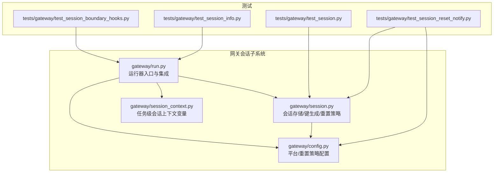
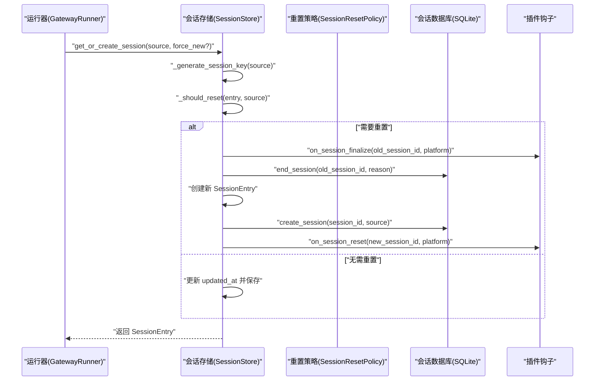
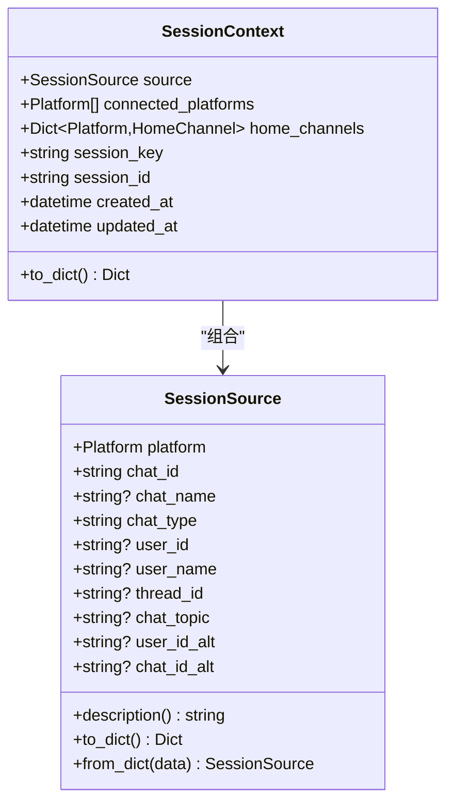
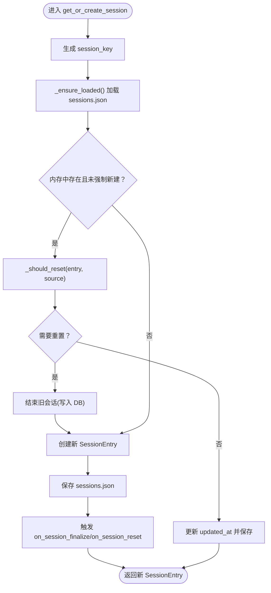
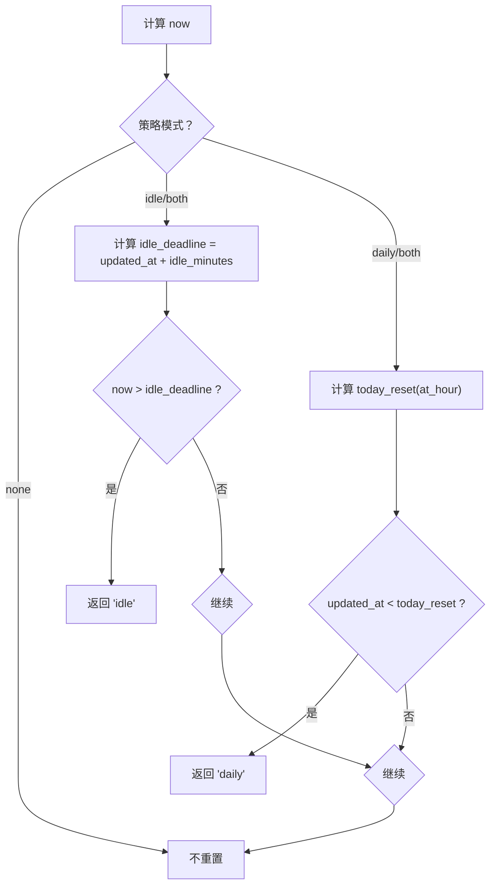
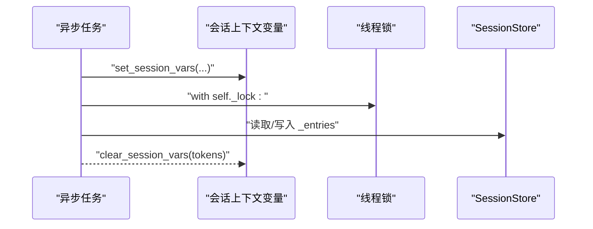
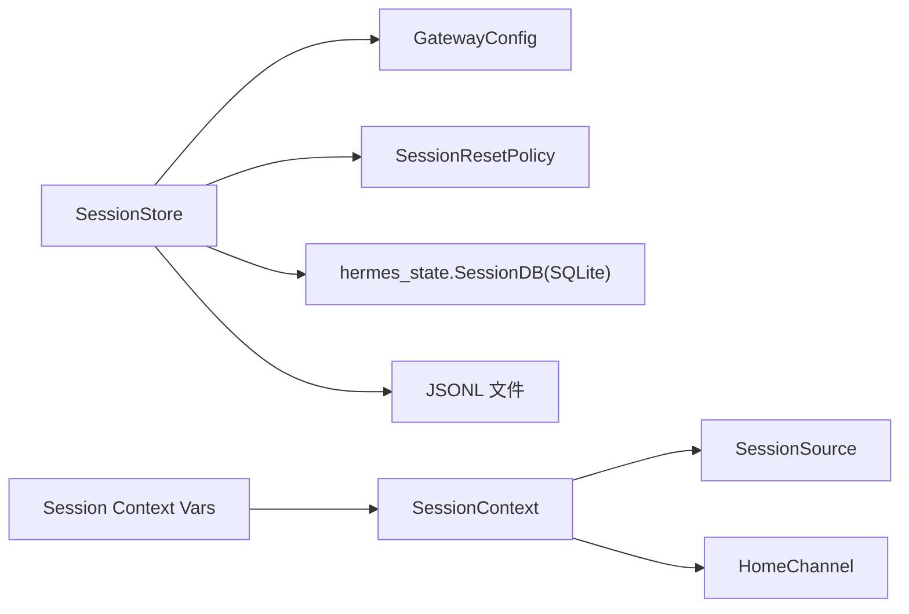

# 会话管理

<cite>
**本文引用的文件**
- [gateway/session.py](file://gateway/session.py)
- [gateway/session_context.py](file://gateway/session_context.py)
- [gateway/config.py](file://gateway/config.py)
- [tests/gateway/test_session.py](file://tests/gateway/test_session.py)
- [tests/gateway/test_session_reset_notify.py](file://tests/gateway/test_session_reset_notify.py)
- [tests/gateway/test_session_boundary_hooks.py](file://tests/gateway/test_session_boundary_hooks.py)
- [tests/gateway/test_session_info.py](file://tests/gateway/test_session_info.py)
- [gateway/run.py](file://gateway/run.py)
</cite>

## 目录
1. [简介](#简介)
2. [项目结构](#项目结构)
3. [核心组件](#核心组件)
4. [架构总览](#架构总览)
5. [详细组件分析](#详细组件分析)
6. [依赖分析](#依赖分析)
7. [性能考量](#性能考量)
8. [故障排除指南](#故障排除指南)
9. [结论](#结论)
10. [附录](#附录)

## 简介
本文件系统性阐述 Hermes Agent 消息网关的会话管理系统，覆盖会话生命周期（创建、维护、重置与清理）、数据结构与作用、持久化实现、重置策略、状态跟踪与超时处理、并发访问控制、会话边界钩子、会话信息查询与重置通知等主题，并提供最佳实践与故障排除建议。目标是帮助开发者与运维人员在复杂多平台并发场景下，稳定地管理会话上下文与状态。

## 项目结构
围绕会话管理的相关代码主要位于 gateway 子模块中，核心文件如下：
- 会话核心逻辑：gateway/session.py
- 会话上下文变量：gateway/session_context.py
- 配置与重置策略：gateway/config.py
- 运行入口与集成点：gateway/run.py
- 测试用例：tests/gateway 下的若干测试文件

图表来源
- [gateway/session.py:1-1081](file://gateway/session.py#L1-L1081)
- [gateway/session_context.py:1-129](file://gateway/session_context.py#L1-L129)
- [gateway/config.py:1-200](file://gateway/config.py#L1-L200)
- [gateway/run.py:1-200](file://gateway/run.py#L1-L200)
- [tests/gateway/test_session.py:1-800](file://tests/gateway/test_session.py#L1-L800)
- [tests/gateway/test_session_reset_notify.py:1-208](file://tests/gateway/test_session_reset_notify.py#L1-L208)
- [tests/gateway/test_session_boundary_hooks.py:1-169](file://tests/gateway/test_session_boundary_hooks.py#L1-L169)
- [tests/gateway/test_session_info.py:1-111](file://tests/gateway/test_session_info.py#L1-L111)

章节来源
- [gateway/session.py:1-1081](file://gateway/session.py#L1-L1081)
- [gateway/session_context.py:1-129](file://gateway/session_context.py#L1-L129)
- [gateway/config.py:1-200](file://gateway/config.py#L1-L200)
- [gateway/run.py:1-200](file://gateway/run.py#L1-L200)
- [tests/gateway/test_session.py:1-800](file://tests/gateway/test_session.py#L1-L800)
- [tests/gateway/test_session_reset_notify.py:1-208](file://tests/gateway/test_session_reset_notify.py#L1-L208)
- [tests/gateway/test_session_boundary_hooks.py:1-169](file://tests/gateway/test_session_boundary_hooks.py#L1-L169)
- [tests/gateway/test_session_info.py:1-111](file://tests/gateway/test_session_info.py#L1-L111)

## 核心组件
- 会话源 SessionSource：描述消息来源（平台、聊天类型、用户/群组标识、线程等），用于构建会话键与动态系统提示注入。
- 会话上下文 SessionContext：承载当前会话的完整上下文（来源、已连接平台、主频道等），用于动态系统提示注入。
- 会话条目 SessionEntry：会话存储中的索引项，包含会话键、会话ID、时间戳、显示元数据、令牌统计、内存刷新标记、挂起标记等。
- 会话存储 SessionStore：负责会话键生成、会话创建/更新、过期检测与自动重置、持久化保存、并发锁保护、SQLite/JSONL 双存储回退。
- 重置策略 SessionResetPolicy：定义“每日”“空闲”“两者皆可”“不重置”的模式与参数（如 at_hour、idle_minutes、notify、排除平台）。
- 会话上下文变量 Session Context Vars：使用 contextvars 替代进程全局环境变量，确保异步并发安全。

章节来源
- [gateway/session.py:66-434](file://gateway/session.py#L66-L434)
- [gateway/session.py:495-800](file://gateway/session.py#L495-L800)
- [gateway/config.py:100-140](file://gateway/config.py#L100-L140)
- [gateway/session_context.py:45-129](file://gateway/session_context.py#L45-L129)

## 架构总览
会话管理由“键生成—存储—策略—持久化—并发控制—上下文注入—边界钩子”构成闭环。运行器在处理消息前根据 SessionSource 生成会话键，通过 SessionStore 获取或创建 SessionEntry；若命中重置策略则触发自动重置；SQLite 与 JSONL 共存以保证历史与实时数据的完整性；contextvars 确保并发安全；插件钩子在会话终结与重置时被调用。

图表来源
- [gateway/session.py:683-768](file://gateway/session.py#L683-L768)
- [gateway/config.py:100-140](file://gateway/config.py#L100-L140)
- [tests/gateway/test_session_boundary_hooks.py:76-114](file://tests/gateway/test_session_boundary_hooks.py#L76-L114)

章节来源
- [gateway/session.py:683-768](file://gateway/session.py#L683-L768)
- [gateway/config.py:100-140](file://gateway/config.py#L100-L140)
- [tests/gateway/test_session_boundary_hooks.py:76-114](file://tests/gateway/test_session_boundary_hooks.py#L76-L114)

## 详细组件分析

### 会话键与来源建模
- SessionSource 提供来源描述、可序列化/反序列化、人类可读描述等能力，支持多平台、多聊天类型与线程。
- build_session_key 基于平台、聊天类型、群组/频道ID、线程ID、用户ID等规则生成确定性键，确保 DM、群组、线程的隔离与共享策略可控。
- SessionContext 将 SessionSource 与连接平台、主频道整合，用于动态系统提示注入。

图表来源
- [gateway/session.py:66-139](file://gateway/session.py#L66-L139)
- [gateway/session.py:142-174](file://gateway/session.py#L142-L174)

章节来源
- [gateway/session.py:66-139](file://gateway/session.py#L66-L139)
- [gateway/session.py:142-174](file://gateway/session.py#L142-L174)
- [tests/gateway/test_session.py:17-90](file://tests/gateway/test_session.py#L17-L90)

### 会话存储与生命周期
- SessionStore 负责：
  - 键生成：基于 SessionSource 与配置生成 session_key。
  - 会话创建/更新：在内存字典与 sessions.json 中保存索引；同时在 SQLite 中创建会话记录。
  - 过期检测：结合策略模式与 at_hour/idle_minutes 判断是否过期；活跃后台进程会豁免过期。
  - 自动重置：当命中重置条件时，先终结旧会话，再创建新会话，写入 was_auto_reset、auto_reset_reason、reset_had_activity 等字段。
  - 并发控制：使用线程锁保护 _entries 与 sessions.json 的读写；SQLite 操作在锁外执行以避免阻塞。
  - 持久化回退：SQLite 不可用时回退到 JSONL 文件；加载时优先选择消息更多的来源（SQLite 或 JSONL）。

图表来源
- [gateway/session.py:683-768](file://gateway/session.py#L683-L768)
- [gateway/session.py:579-660](file://gateway/session.py#L579-L660)

章节来源
- [gateway/session.py:495-800](file://gateway/session.py#L495-L800)
- [tests/gateway/test_session.py:367-553](file://tests/gateway/test_session.py#L367-L553)

### 重置策略与通知
- SessionResetPolicy 定义模式与参数：mode、at_hour、idle_minutes、notify、notify_exclude_platforms。
- _should_reset 返回“idle”或“daily”，SessionEntry 记录 was_auto_reset、auto_reset_reason、reset_had_activity。
- 通知开关与排除平台由策略控制，测试验证了默认值、序列化/反序列化与行为一致性。

图表来源
- [gateway/session.py:579-660](file://gateway/session.py#L579-L660)
- [gateway/config.py:100-140](file://gateway/config.py#L100-L140)
- [tests/gateway/test_session_reset_notify.py:48-105](file://tests/gateway/test_session_reset_notify.py#L48-L105)

章节来源
- [gateway/config.py:100-140](file://gateway/config.py#L100-L140)
- [tests/gateway/test_session_reset_notify.py:173-208](file://tests/gateway/test_session_reset_notify.py#L173-L208)

### 并发访问控制与上下文变量
- 使用 threading.Lock 保护内存索引与 sessions.json 的读写。
- 使用 contextvars.ContextVar 替代 os.environ，确保 asyncio 任务级隔离，避免并发消息互相覆盖。
- 提供 set_session_vars/clear_session_vars 与 get_session_env 兼容层，便于工具链迁移。

图表来源
- [gateway/session.py:509](file://gateway/session.py#L509)
- [gateway/session_context.py:64-129](file://gateway/session_context.py#L64-L129)

章节来源
- [gateway/session_context.py:45-129](file://gateway/session_context.py#L45-L129)
- [gateway/session.py:509](file://gateway/session.py#L509)

### 会话边界钩子与重置通知
- 插件钩子 on_session_finalize 与 on_session_reset 在 /new 或自动重置时按序触发，即使钩子异常也不应阻断重置流程。
- 通知策略受 SessionResetPolicy 控制，部分平台可排除通知。

章节来源
- [tests/gateway/test_session_boundary_hooks.py:76-169](file://tests/gateway/test_session_boundary_hooks.py#L76-L169)
- [tests/gateway/test_session_reset_notify.py:173-208](file://tests/gateway/test_session_reset_notify.py#L173-L208)

### 会话信息查询
- 运行器提供 _format_session_info 输出模型、上下文长度、端点等信息，测试覆盖默认回退、本地端点隐藏、云端点显示等场景。

章节来源
- [tests/gateway/test_session_info.py:28-111](file://tests/gateway/test_session_info.py#L28-L111)

## 依赖分析
- 组件耦合
  - SessionStore 依赖 GatewayConfig 与 SessionResetPolicy 决策重置策略。
  - SessionStore 依赖 hermes_state.SessionDB（SQLite）进行会话记录与消息持久化，不可用时回退 JSONL。
  - SessionContext 依赖 SessionSource 与 HomeChannel，用于动态系统提示注入。
- 外部依赖
  - hermes_state.SessionDB：会话数据库接口。
  - contextvars：任务级上下文变量。
  - threading.Lock：并发互斥。
  - json、tempfile：sessions.json 的原子写入与回退。

图表来源
- [gateway/session.py:503-520](file://gateway/session.py#L503-L520)
- [gateway/session.py:142-174](file://gateway/session.py#L142-L174)
- [gateway/session_context.py:45-129](file://gateway/session_context.py#L45-L129)

章节来源
- [gateway/session.py:503-520](file://gateway/session.py#L503-L520)
- [gateway/session.py:142-174](file://gateway/session.py#L142-L174)
- [gateway/session_context.py:45-129](file://gateway/session_context.py#L45-L129)

## 性能考量
- I/O 与锁分离：SQLite 操作在锁外执行，降低锁持有时间，提升高并发下的吞吐。
- 历史与实时数据合并：加载时优先选择消息更多的来源（SQLite 或 JSONL），避免历史丢失。
- 令牌与成本统计：SessionEntry 记录输入/输出/缓存读写令牌与估算成本，便于压缩与计费监控。
- 重置策略权衡：idle_minutes 与 at_hour 应结合业务负载与成本控制综合设置，避免过于频繁重置导致上下文丢失或过于宽松导致资源占用。

## 故障排除指南
- 重置通知未生效
  - 检查 SessionResetPolicy.notify 与 notify_exclude_platforms 设置。
  - 章节来源
    - [tests/gateway/test_session_reset_notify.py:173-208](file://tests/gateway/test_session_reset_notify.py#L173-L208)
- 自动重置未触发
  - 确认策略模式与 at_hour/idle_minutes 合理；检查 updated_at 是否被正确更新。
  - 章节来源
    - [gateway/session.py:579-660](file://gateway/session.py#L579-L660)
- 并发冲突或上下文错乱
  - 确保使用 contextvars 替代 os.environ；确认 set_session_vars/clear_session_vars 成对使用。
  - 章节来源
    - [gateway/session_context.py:64-129](file://gateway/session_context.py#L64-L129)
- SQLite 不可用回退
  - 确认 sessions.json 写入成功；必要时检查磁盘权限与路径。
  - 章节来源
    - [gateway/session.py:514-520](file://gateway/session.py#L514-L520)
- 会话键冲突或隔离不当
  - 检查 build_session_key 规则与配置（group_sessions_per_user、thread_sessions_per_user）。
  - 章节来源
    - [tests/gateway/test_session.py:555-794](file://tests/gateway/test_session.py#L555-L794)
- 边界钩子异常导致重置失败
  - 钩子错误不应阻止 /new 或自动重置流程。
  - 章节来源
    - [tests/gateway/test_session_boundary_hooks.py:159-169](file://tests/gateway/test_session_boundary_hooks.py#L159-L169)

## 结论
Hermes Agent 的会话管理系统通过明确的键生成规则、健壮的存储与回退机制、可配置的重置策略、任务级上下文变量与插件边界钩子，实现了在多平台、高并发场景下的稳定会话管理。遵循本文的最佳实践与排障建议，可在保证用户体验的同时，最大化系统可靠性与可观测性。

## 附录
- 最佳实践
  - 明确区分 DM、群组、线程的隔离策略，合理设置 per-user 隔离与线程共享。
  - 根据业务负载调整 idle_minutes 与 at_hour，平衡上下文连续性与资源消耗。
  - 使用 contextvars 管理会话变量，避免全局状态污染。
  - 在 SQLite 不可用时，确保 JSONL 作为回退路径正常工作。
  - 对自动重置进行通知配置，必要时排除特定平台。
- 相关测试参考
  - 会话键与来源：[tests/gateway/test_session.py:17-90](file://tests/gateway/test_session.py#L17-L90)
  - 重置通知与策略：[tests/gateway/test_session_reset_notify.py:48-105](file://tests/gateway/test_session_reset_notify.py#L48-L105)
  - 边界钩子：[tests/gateway/test_session_boundary_hooks.py:76-114](file://tests/gateway/test_session_boundary_hooks.py#L76-L114)
  - 会话信息输出：[tests/gateway/test_session_info.py:28-111](file://tests/gateway/test_session_info.py#L28-L111)