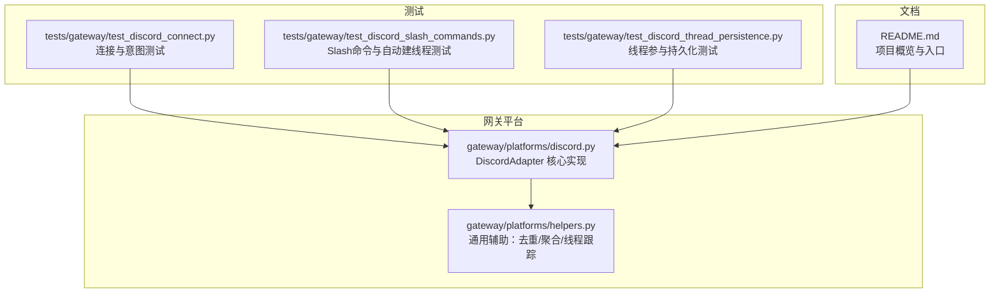
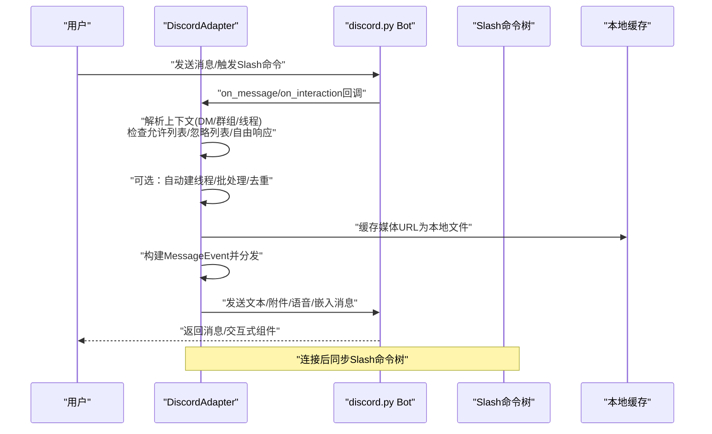
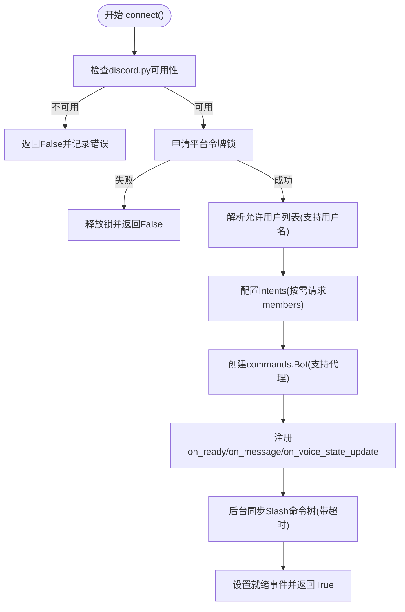
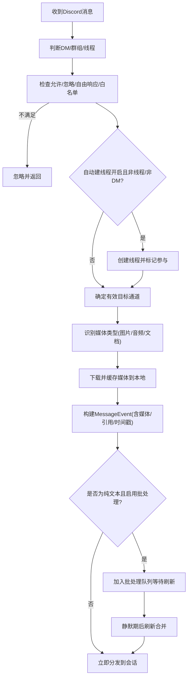
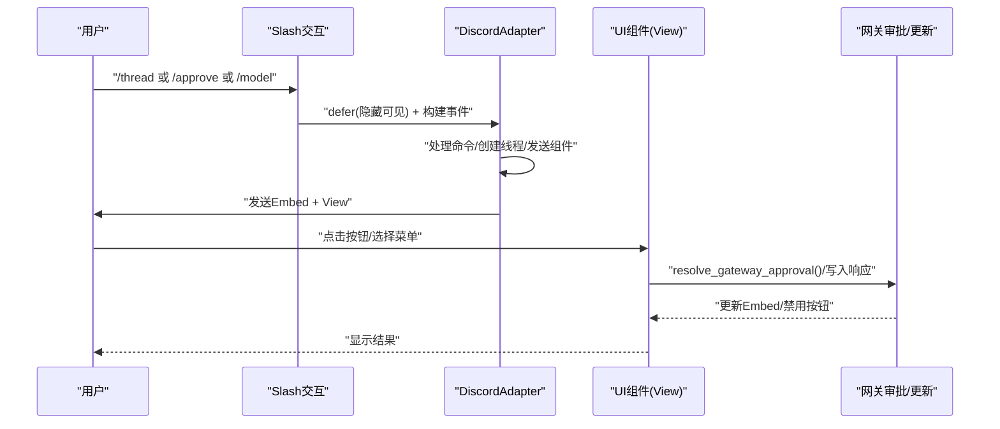
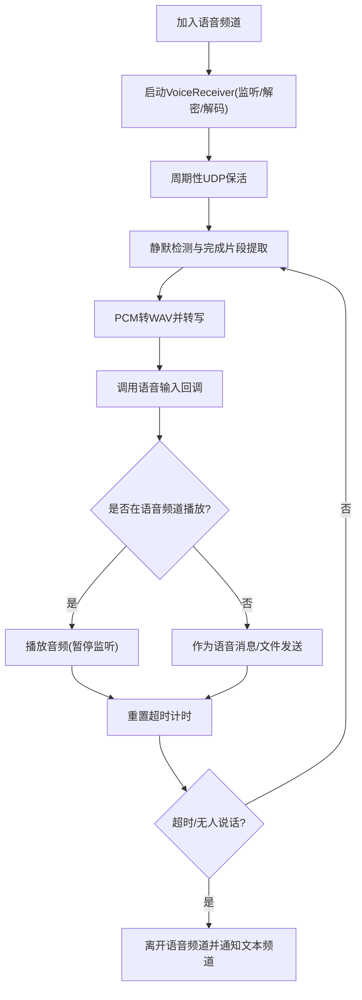
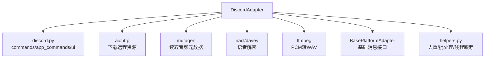

# Discord集成

<cite>
**本文档引用的文件**
- [discord.py](file://gateway/platforms/discord.py)
- [helpers.py](file://gateway/platforms/helpers.py)
- [test_discord_slash_commands.py](file://tests/gateway/test_discord_slash_commands.py)
- [test_discord_thread_persistence.py](file://tests/gateway/test_discord_thread_persistence.py)
- [test_discord_connect.py](file://tests/gateway/test_discord_connect.py)
- [README.md](file://README.md)
</cite>

## 目录
1. [简介](#简介)
2. [项目结构](#项目结构)
3. [核心组件](#核心组件)
4. [架构总览](#架构总览)
5. [详细组件分析](#详细组件分析)
6. [依赖关系分析](#依赖关系分析)
7. [性能考虑](#性能考虑)
8. [故障排除指南](#故障排除指南)
9. [结论](#结论)
10. [附录](#附录)

## 简介
本文件面向在Discord平台上集成Hermes Agent的开发者与运维人员，系统性阐述以下主题：
- OAuth2认证流程与机器人权限配置
- 服务器权限与Webhook设置建议
- 消息处理机制：文本消息、嵌入消息、附件上传下载、语音频道集成
- Discord特有能力：Slash Commands、Message Components（按钮/选择菜单）、Thread管理、角色权限控制
- 服务器集成指南、机器人权限管理与最佳实践
- 错误处理与速率限制应对策略

该文档基于仓库中的Discord适配器源码与相关测试用例进行深入分析，确保内容与实际实现保持一致。

## 项目结构
本项目采用“网关平台适配器”模式，Discord适配器位于gateway/platforms目录下，核心类为DiscordAdapter；通用辅助工具位于gateway/platforms/helpers中；测试用例位于tests/gateway目录下，覆盖连接、Slash命令、线程持久化等场景。

**图表来源**
- [discord.py:1-200](file://gateway/platforms/discord.py#L1-200)
- [helpers.py:1-100](file://gateway/platforms/helpers.py#L1-100)
- [test_discord_connect.py:1-100](file://tests/gateway/test_discord_connect.py#L1-100)
- [test_discord_slash_commands.py:1-100](file://tests/gateway/test_discord_slash_commands.py#L1-100)
- [test_discord_thread_persistence.py:1-85](file://tests/gateway/test_discord_thread_persistence.py#L1-85)
- [README.md:1-179](file://README.md#L1-L179)

**章节来源**
- [discord.py:1-200](file://gateway/platforms/discord.py#L1-200)
- [helpers.py:1-100](file://gateway/platforms/helpers.py#L1-100)
- [README.md:1-179](file://README.md#L1-L179)

## 核心组件
- DiscordAdapter：负责连接Discord、接收/发送消息、处理Slash命令、线程管理、交互式UI组件（按钮/选择菜单）、语音通道播放与监听、消息批处理与去重、线程参与跟踪等。
- VoiceReceiver：在语音频道中捕获并解码RTP音频，支持DAVE端到端加密与Opus解码，周期性检测静音并输出完整语句。
- 通用辅助：
  - MessageDeduplicator：基于TTL的消息去重缓存，避免断线重连后重复处理事件。
  - TextBatchAggregator：对快速连续的文本消息进行合并，减少客户端侧分割带来的多次处理。
  - ThreadParticipationTracker：持久化记录机器人参与过的线程，避免后续对话仍需@提及。

**章节来源**
- [discord.py:411-850](file://gateway/platforms/discord.py#L411-850)
- [discord.py:85-410](file://gateway/platforms/discord.py#L85-410)
- [helpers.py:25-247](file://gateway/platforms/helpers.py#L25-247)

## 架构总览
Discord适配器通过discord.py库建立异步连接，注册事件回调（on_ready/on_message/on_voice_state_update），并在连接成功后同步Slash命令树。消息进入时根据上下文（DM/群组/线程）与配置决定是否需要@提及、是否自动建线程、是否忽略某些频道等。发送消息时支持文本、图片、视频、文档、语音（原生语音消息或文件）、回复引用等。交互式UI组件通过Embed + View（按钮/选择菜单）实现，配合会话键进行授权与超时控制。

**图表来源**
- [discord.py:543-718](file://gateway/platforms/discord.py#L543-718)
- [discord.py:1597-1780](file://gateway/platforms/discord.py#L1597-1780)
- [discord.py:2226-2495](file://gateway/platforms/discord.py#L2226-2495)

**章节来源**
- [discord.py:543-718](file://gateway/platforms/discord.py#L543-718)
- [discord.py:1597-1780](file://gateway/platforms/discord.py#L1597-1780)
- [discord.py:2226-2495](file://gateway/platforms/discord.py#L2226-2495)

## 详细组件分析

### 连接与认证
- 依赖检查：若未安装discord.py，连接失败并提示安装方式。
- 令牌锁定：使用平台级锁防止同一机器人令牌被并发启动。
- 意图配置：默认启用message_content、dm_messages、guild_messages、voice_states；当允许列表包含用户名而非ID时才请求members意图。
- 代理支持：可通过环境变量配置HTTP/socks代理。
- Slash命令同步：连接完成后异步同步命令树，超时保护。

**图表来源**
- [discord.py:467-673](file://gateway/platforms/discord.py#L467-673)
- [discord.py:502-556](file://gateway/platforms/discord.py#L502-556)
- [test_discord_connect.py:106-131](file://tests/gateway/test_discord_connect.py#L106-131)

**章节来源**
- [discord.py:467-673](file://gateway/platforms/discord.py#L467-673)
- [test_discord_connect.py:106-131](file://tests/gateway/test_discord_connect.py#L106-131)

### 消息处理与线程管理
- 入站消息过滤：
  - DM：直接处理。
  - 群组：可配置require_mention/free_response_channels/ignored_channels/allowed_channels/no_thread_channels等。
  - 线程：若机器人已参与过则无需@提及。
  - 自动建线程：在满足条件的群组消息上自动创建线程，将后续对话隔离。
- 媒体处理：
  - 图片/音频/文档：下载并缓存到本地，支持注入文本内容（如纯文本文件）。
  - 回复引用：支持回复到系统消息的回退逻辑。
- 文本批处理：对客户端侧分割的长文本进行合并，提升吞吐。
- 线程参与持久化：将参与过的线程ID写入~/.hermes/discord_threads.json，重启后仍有效。

**图表来源**
- [discord.py:2226-2495](file://gateway/platforms/discord.py#L2226-2495)
- [discord.py:2400-2495](file://gateway/platforms/discord.py#L2400-2495)
- [test_discord_thread_persistence.py:30-70](file://tests/gateway/test_discord_thread_persistence.py#L30-70)

**章节来源**
- [discord.py:2226-2495](file://gateway/platforms/discord.py#L2226-2495)
- [discord.py:2400-2495](file://gateway/platforms/discord.py#L2400-2495)
- [test_discord_thread_persistence.py:30-70](file://tests/gateway/test_discord_thread_persistence.py#L30-70)

### Slash Commands与Message Components
- 内置Slash命令：new/reset/model/reasoning/personality/retry/undo/status/sethome/stop/compress/title/resume/usage/provider/help/insights/reload-mcp/voice/update/approve/deny/thread/queue/background/btw等。
- 技能命令桥接：从hermes_cli.commands动态注册技能为Slash命令，受100个命令上限约束。
- 交互式UI组件：
  - 执行审批：ExecApprovalView，提供Allow Once/Session/Always/Deny四个按钮，支持超时与授权校验。
  - 更新提示：UpdatePromptView，提供Yes/No按钮，写入更新响应文件。
  - 模型选择：ModelPickerView，两步下钻（Provider→Model），支持取消与回退。
- 线程创建：/thread命令支持指定名称、首条消息与自动归档时长，失败时回退到先发种子消息再建线程。

**图表来源**
- [discord.py:1597-1780](file://gateway/platforms/discord.py#L1597-1780)
- [discord.py:2569-2958](file://gateway/platforms/discord.py#L2569-2958)
- [test_discord_slash_commands.py:74-212](file://tests/gateway/test_discord_slash_commands.py#L74-212)

**章节来源**
- [discord.py:1597-1780](file://gateway/platforms/discord.py#L1597-1780)
- [discord.py:2569-2958](file://gateway/platforms/discord.py#L2569-2958)
- [test_discord_slash_commands.py:74-212](file://tests/gateway/test_discord_slash_commands.py#L74-212)

### 语音频道集成
- 加入/离开语音频道：支持移动到同一服务器内的其他语音频道，自动重置超时任务。
- 语音播放：优先在语音频道内播放音频，否则作为文件附件发送；播放前暂停语音监听以避免回声。
- 语音监听：基于UDP套接字监听Discord语音数据，解密NaCl与DAVE，Opus解码为PCM，静音检测后转写为文本。
- 超时断开：超过设定秒数无活动自动离开语音频道并通知文本频道。
- 语音状态展示：提供当前语音频道成员、说话者状态等信息，便于注入到系统提示词。

**图表来源**
- [discord.py:998-1194](file://gateway/platforms/discord.py#L998-1194)
- [discord.py:1216-1286](file://gateway/platforms/discord.py#L1216-1286)

**章节来源**
- [discord.py:998-1194](file://gateway/platforms/discord.py#L998-1194)
- [discord.py:1216-1286](file://gateway/platforms/discord.py#L1216-1286)

### 附件上传/下载与媒体处理
- 本地文件：支持图片/视频/任意文档作为附件发送。
- 远程URL：图片/音频/文档通过代理下载并缓存到本地，增强可靠性与离线访问能力。
- 语音消息：尝试使用Discord原生语音消息标志发送，失败则回退为普通文件。
- 文档注入：对小体积纯文本文档（如.md/.txt/.log）进行UTF-8解码并注入到消息正文，便于视觉模型理解。

**章节来源**
- [discord.py:878-993](file://gateway/platforms/discord.py#L878-993)
- [discord.py:1310-1416](file://gateway/platforms/discord.py#L1310-1416)
- [discord.py:2417-2457](file://gateway/platforms/discord.py#L2417-2457)

## 依赖关系分析
- 外部依赖：discord.py（commands与app_commands）、aiohttp（下载远程资源）、mutagen（读取音频时长）、nacl与davey（语音解密）、ffmpeg（PCM转WAV）。
- 内部依赖：BasePlatformAdapter（基础消息格式/缓存工具）、MessageDeduplicator/TextBatchAggregator/ThreadParticipationTracker（通用辅助）。
- 测试依赖：pytest、unittest.mock、types.SimpleNamespace模拟discord模块。

**图表来源**
- [discord.py:29-40](file://gateway/platforms/discord.py#L29-40)
- [discord.py:878-993](file://gateway/platforms/discord.py#L878-993)
- [discord.py:1254-1286](file://gateway/platforms/discord.py#L1254-1286)
- [helpers.py:25-247](file://gateway/platforms/helpers.py#L25-247)

**章节来源**
- [discord.py:29-40](file://gateway/platforms/discord.py#L29-40)
- [discord.py:878-993](file://gateway/platforms/discord.py#L878-993)
- [discord.py:1254-1286](file://gateway/platforms/discord.py#L1254-1286)
- [helpers.py:25-247](file://gateway/platforms/helpers.py#L25-247)

## 性能考虑
- 文本批处理：通过延迟合并快速连续文本，降低会话分发频率，减少客户端侧分割带来的多次处理。
- 去重缓存：TTL去重避免重复事件处理，提高断线恢复稳定性。
- 语音解码：Opus解码器按SSRC独立实例化，避免跨用户状态干扰；静默检测阈值与最小语音时长平衡准确率与延迟。
- 代理与网络：支持HTTP/socks代理，缓解网络受限环境下的连接与下载问题。
- 附件缓存：将CDN链接转换为本地缓存文件，避免过期导致的二次下载失败。

[本节为通用指导，无需特定文件引用]

## 故障排除指南
- 连接失败：
  - 未安装discord.py：检查依赖安装与Python路径。
  - 令牌冲突：确认平台令牌锁是否被占用，避免多实例竞争。
  - Slash命令同步超时：检查网络与代理配置，必要时缩短等待时间。
- 消息未响应：
  - 未@提及：检查DISCORD_REQUIRE_MENTION与free_response_channels配置。
  - 频道忽略：确认未命中ignored_channels白名单。
  - 线程未参与：首次对话需@提及或在自动建线程后方可免@。
- 附件/语音异常：
  - 下载失败：检查代理与网络，确认aiohttp可用。
  - 语音消息失败：回退为普通文件发送。
- 交互式组件无效：
  - 授权失败：确认allowed_user_ids包含当前用户。
  - 超时：组件默认超时，需在时限内操作。

**章节来源**
- [test_discord_connect.py:134-161](file://tests/gateway/test_discord_connect.py#L134-161)
- [discord.py:825-843](file://gateway/platforms/discord.py#L825-843)
- [discord.py:2587-2634](file://gateway/platforms/discord.py#L2587-2634)

## 结论
本Discord集成方案通过适配器模式实现了与discord.py的深度整合，覆盖了消息收发、Slash命令、交互式UI组件、线程管理、语音频道、媒体处理与权限控制等核心能力。配合去重、批处理与线程参与持久化等优化，能够在复杂服务器环境中稳定运行。建议在生产部署中：
- 明确配置意图与代理，合理设置频道白名单/忽略列表。
- 使用线程隔离长对话，结合自动建线程策略提升组织性。
- 对语音与媒体场景启用本地缓存与转写，增强鲁棒性。
- 通过交互式组件替代纯文本审批流程，提升安全性与体验。

[本节为总结，无需特定文件引用]

## 附录

### OAuth2认证与机器人权限配置
- 机器人创建与权限：
  - 在Discord开发者门户创建应用与机器人，授予必要权限（消息发送、线程管理、语音权限等）。
  - 通过OAuth2授权URL邀请机器人至服务器，确保分配合适的角色与权限。
- 令牌与安全：
  - 将机器人令牌存储在安全位置，避免硬编码。
  - 使用平台令牌锁避免多实例竞争。
- 代理与网络：
  - 如需通过代理访问，设置DISCORD_PROXY环境变量。

**章节来源**
- [discord.py:498-505](file://gateway/platforms/discord.py#L498-505)
- [discord.py:528-539](file://gateway/platforms/discord.py#L528-539)
- [test_discord_connect.py:134-161](file://tests/gateway/test_discord_connect.py#L134-161)

### 服务器权限与Webhook设置
- 服务器权限建议：
  - 消息发送：用于回复与发送附件。
  - 线程管理：创建/删除线程，设置自动归档时长。
  - 语音权限：加入/离开语音频道，播放音频。
  - 成员意图：仅在允许列表包含用户名时启用，避免影响上线。
- Webhook：
  - 本适配器未直接使用Webhook；如需外部集成，可在外部服务中配置Webhook并由Hermes通过HTTP调用。

**章节来源**
- [discord.py:514-527](file://gateway/platforms/discord.py#L514-527)
- [discord.py:1966-1968](file://gateway/platforms/discord.py#L1966-1968)

### 服务器集成指南与最佳实践
- 频道策略：
  - 使用DISCORD_FREE_RESPONSE_CHANNELS为特定频道免@响应。
  - 使用DISCORD_ALLOWED_CHANNELS与DISCORD_IGNORED_CHANNELS进行白名单/黑名单管理。
  - 使用DISCORD_NO_THREAD_CHANNELS避免在某些频道自动建线程。
- 用户授权：
  - 使用DISCORD_ALLOWED_USERS配置允许交互的用户ID或用户名（将自动解析为ID）。
  - 通过交互式组件的allowed_user_ids进行按钮/选择菜单授权。
- 线程管理：
  - 默认启用自动建线程，可结合ThreadParticipationTracker减少后续@提及需求。
  - 通过/threads命令快速创建带首条消息的线程。
- 语音与媒体：
  - 确保ffmpeg与opus库可用，以便语音转写与播放。
  - 对大文件与敏感文档设置大小限制与类型过滤。

**章节来源**
- [discord.py:2253-2296](file://gateway/platforms/discord.py#L2253-2296)
- [discord.py:1500-1563](file://gateway/platforms/discord.py#L1500-1563)
- [test_discord_slash_commands.py:375-426](file://tests/gateway/test_discord_slash_commands.py#L375-426)

### 错误处理与速率限制应对
- 断线重连与去重：MessageDeduplicator避免重复事件处理。
- Slash命令同步：超时保护，不影响主流程启动。
- 回复引用限制：遇到系统消息无法回复时自动回退为无引用发送。
- 组件超时：交互式组件默认超时，需在时限内操作；超时后禁用按钮并标记过期。
- 速率限制：遵循Discord API速率限制，避免频繁创建线程或发送大量消息；通过批处理与缓存降低请求频率。

**章节来源**
- [helpers.py:41-62](file://gateway/platforms/helpers.py#L41-62)
- [discord.py:827-843](file://gateway/platforms/discord.py#L827-843)
- [discord.py:2659-2664](file://gateway/platforms/discord.py#L2659-2664)
- [discord.py:2955-2958](file://gateway/platforms/discord.py#L2955-2958)