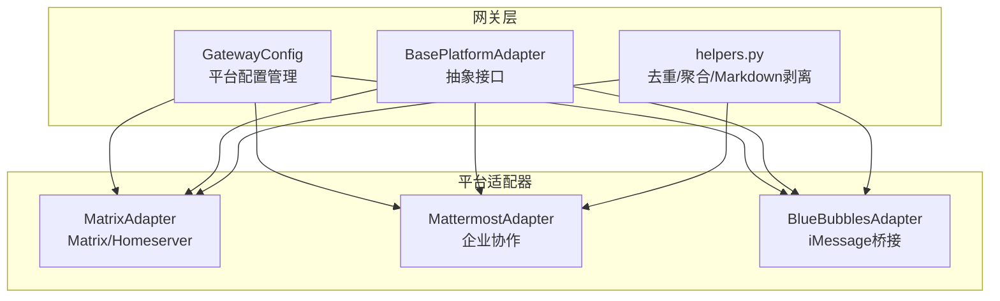
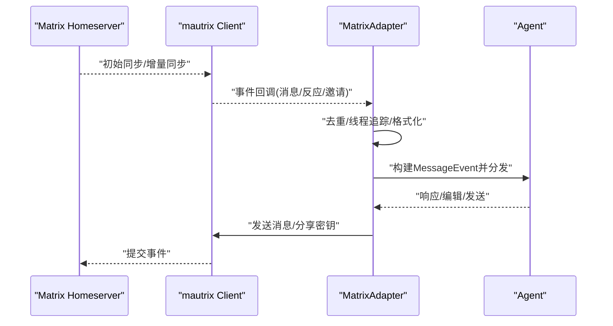
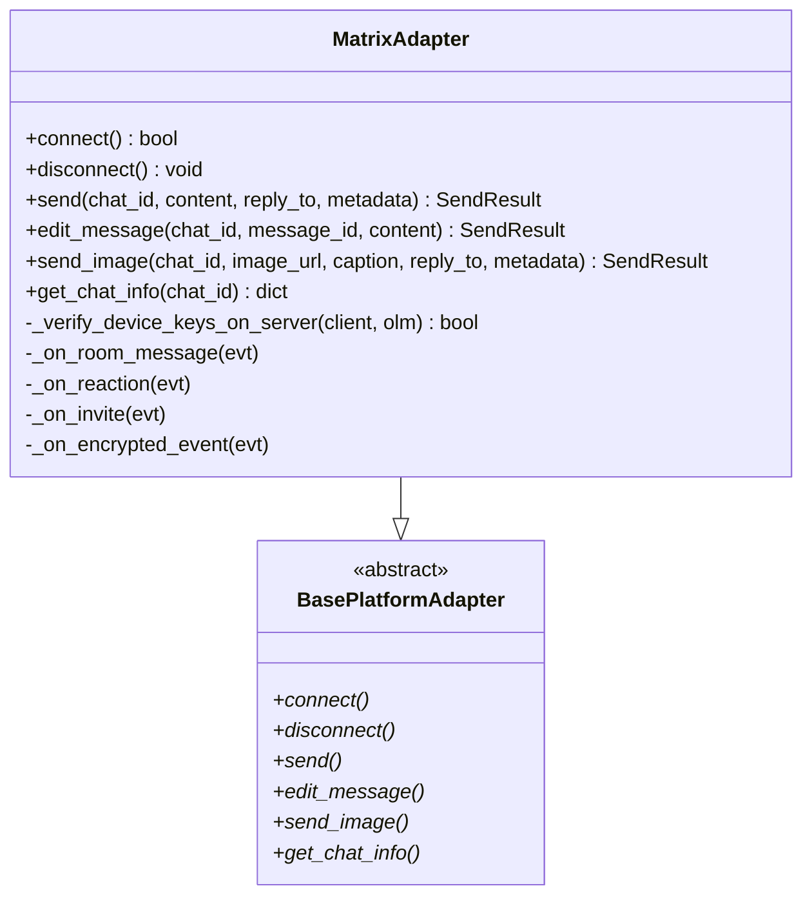
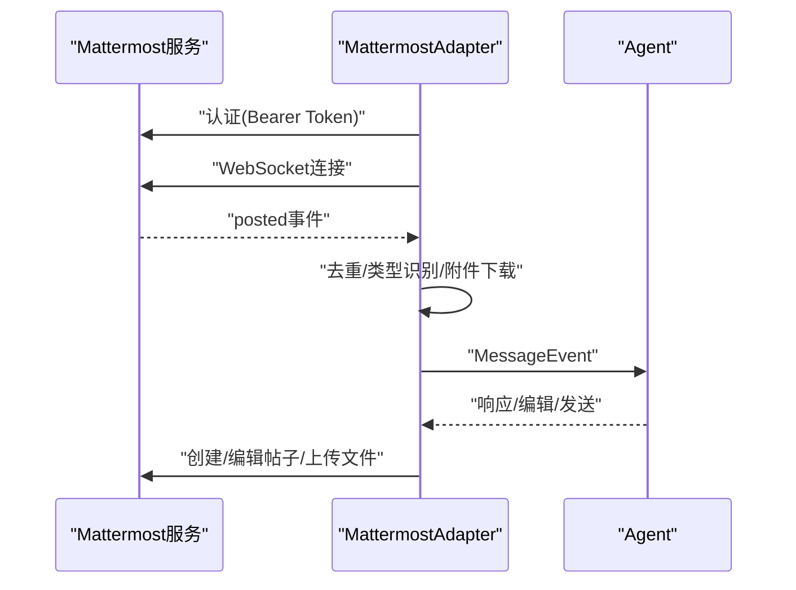
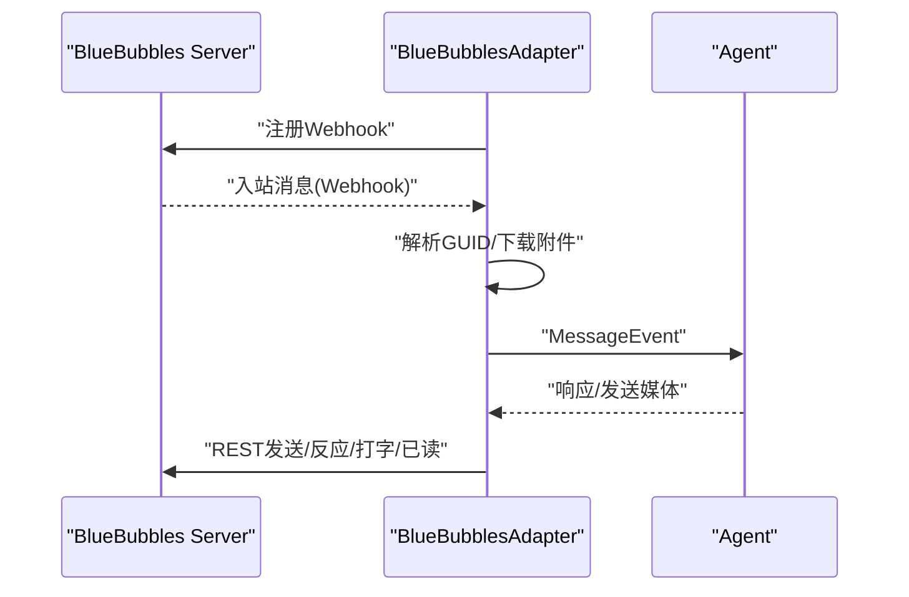
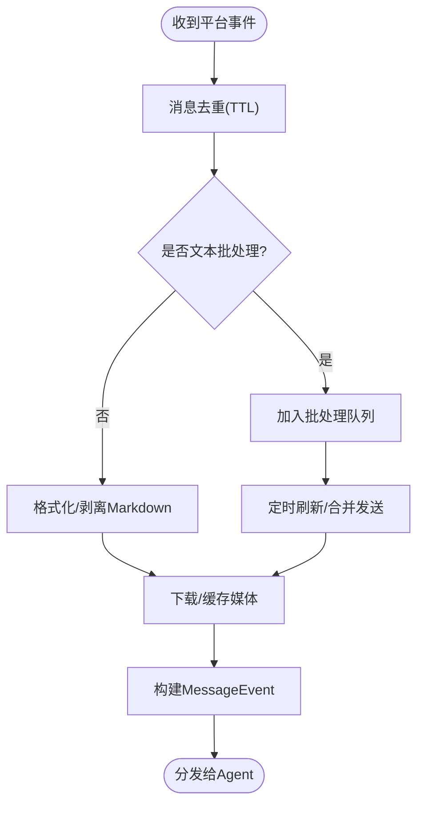
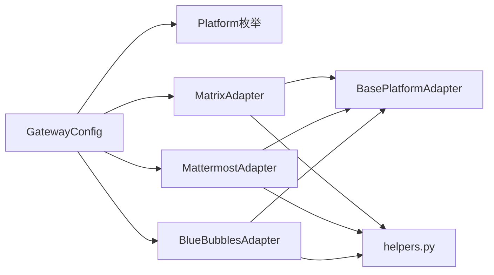

# Matrix与社区平台

<cite>
**本文档引用的文件**
- [matrix.py](file://gateway/platforms/matrix.py)
- [mattermost.py](file://gateway/platforms/mattermost.py)
- [bluebubbles.py](file://gateway/platforms/bluebubbles.py)
- [base.py](file://gateway/platforms/base.py)
- [helpers.py](file://gateway/platforms/helpers.py)
- [config.py](file://gateway/config.py)
- [README.md](file://README.md)
</cite>

## 目录
1. [简介](#简介)
2. [项目结构](#项目结构)
3. [核心组件](#核心组件)
4. [架构总览](#架构总览)
5. [详细组件分析](#详细组件分析)
6. [依赖关系分析](#依赖关系分析)
7. [性能考虑](#性能考虑)
8. [故障排除指南](#故障排除指南)
9. [结论](#结论)
10. [附录](#附录)

## 简介
本文件面向Matrix生态系统与社区平台集成，系统性梳理Hermes Agent在Matrix（含端到端加密）、Mattermost企业协作平台、以及BlueBubbles个人通讯平台的集成实现。内容涵盖：
- Homeserver配置与连接流程
- 房间权限管理与消息同步策略
- 历史消息处理与线程参与追踪
- 去中心化身份认证与加密通信机制
- 分布式消息传递与媒体附件处理
- 自托管方案与第三方集成选项

## 项目结构
Hermes Agent采用“网关适配器”模式统一接入多平台。Matrix、Mattermost、BlueBubbles分别通过独立适配器实现，共享基类与通用工具。

图示来源
- [config.py:48-69](file://gateway/config.py#L48-L69)
- [base.py:779-800](file://gateway/platforms/base.py#L779-L800)
- [helpers.py:22-262](file://gateway/platforms/helpers.py#L22-L262)
- [matrix.py:196-250](file://gateway/platforms/matrix.py#L196-L250)
- [mattermost.py:71-92](file://gateway/platforms/mattermost.py#L71-L92)
- [bluebubbles.py:100-131](file://gateway/platforms/bluebubbles.py#L100-L131)

章节来源
- [config.py:48-69](file://gateway/config.py#L48-L69)
- [base.py:779-800](file://gateway/platforms/base.py#L779-L800)
- [helpers.py:22-262](file://gateway/platforms/helpers.py#L22-L262)

## 核心组件
- 平台适配器基类：定义统一的连接、发送、编辑、媒体处理等接口，确保各平台行为一致性。
- 矩阵适配器：基于mautrix SDK，支持可选端到端加密；内置设备密钥校验、会话恢复、线程参与追踪。
- Mattermost适配器：基于REST API与WebSocket，支持回复线程、文件上传、类型化消息识别。
- BlueBubbles适配器：本地macOS服务器Webhook入站、REST出站，支持富媒体与tapback反应。
- 通用工具：消息去重、文本批处理、Markdown剥离、线程参与追踪、缓存目录管理。

章节来源
- [base.py:779-800](file://gateway/platforms/base.py#L779-L800)
- [matrix.py:196-250](file://gateway/platforms/matrix.py#L196-L250)
- [mattermost.py:71-92](file://gateway/platforms/mattermost.py#L71-L92)
- [bluebubbles.py:100-131](file://gateway/platforms/bluebubbles.py#L100-L131)
- [helpers.py:22-262](file://gateway/platforms/helpers.py#L22-L262)

## 架构总览
下图展示从平台事件到适配器处理再到Agent的典型流程，以及E2EE在Matrix中的关键节点。

图示来源
- [matrix.py:374-593](file://gateway/platforms/matrix.py#L374-L593)
- [base.py:655-717](file://gateway/platforms/base.py#L655-L717)

章节来源
- [matrix.py:374-593](file://gateway/platforms/matrix.py#L374-L593)

## 详细组件分析

### Matrix适配器（Homeserver与E2EE）
- 连接与认证
  - 支持访问令牌或密码登录，自动解析用户ID与设备ID，校验令牌有效性。
  - 首次连接执行全量同步，建立后续增量同步的游标。
- 端到端加密（E2EE）
  - 可选启用，使用Olm机器与SQLite存储密钥数据库。
  - 启动时校验设备公钥是否存在于服务器，必要时重新上传；支持恢复密钥交叉签名验证。
  - 发送失败时自动触发密钥分享以修复状态。
- 消息与线程
  - 文本批处理：合并快速连续消息，避免刷屏。
  - 线程参与追踪：持久化已参与线程列表，避免重复线程创建。
  - 聊天信息查询：读取房间名称与类型（DM/群组）。
- 房间权限与门禁
  - 支持@提及要求、自由响应房间白名单、自动线程创建、DM中提及线程等策略。
  - 通过环境变量灵活配置，适配不同社区治理模型。

图示来源
- [matrix.py:196-250](file://gateway/platforms/matrix.py#L196-L250)
- [matrix.py:374-593](file://gateway/platforms/matrix.py#L374-L593)
- [matrix.py:622-700](file://gateway/platforms/matrix.py#L622-L700)
- [base.py:779-800](file://gateway/platforms/base.py#L779-L800)

章节来源
- [matrix.py:196-250](file://gateway/platforms/matrix.py#L196-L250)
- [matrix.py:374-593](file://gateway/platforms/matrix.py#L374-L593)
- [matrix.py:622-700](file://gateway/platforms/matrix.py#L622-L700)

### Mattermost适配器（企业协作）
- 连接与认证
  - 使用Bearer Token进行REST调用，WebSocket监听实时事件。
  - 验证凭据后获取机器人身份，启动后台任务维持连接。
- 消息与线程
  - 支持“线程回复”与“平铺回复”，根据配置决定是否嵌套回复。
  - 通道类型映射：私有/公开/群组，DM按用户ID判定。
- 文件与媒体
  - 支持图片、音频、视频与文档上传，自动下载附件到本地缓存供工具使用。
- 安全与门禁
  - 支持@提及要求、自由响应通道白名单，忽略特定通道等策略。

图示来源
- [mattermost.py:195-227](file://gateway/platforms/mattermost.py#L195-L227)
- [mattermost.py:505-732](file://gateway/platforms/mattermost.py#L505-L732)
- [mattermost.py:252-281](file://gateway/platforms/mattermost.py#L252-L281)

章节来源
- [mattermost.py:195-227](file://gateway/platforms/mattermost.py#L195-L227)
- [mattermost.py:505-732](file://gateway/platforms/mattermost.py#L505-L732)
- [mattermost.py:252-281](file://gateway/platforms/mattermost.py#L252-L281)

### BlueBubbles适配器（个人通讯）
- 连接与Webhook
  - 本地BlueBubbles服务器REST出站，入站通过Webhook注册与监听。
  - 自动注册/注销Webhook，支持健康检查与错误处理。
- 聊天地址解析
  - 支持通过邮箱/电话自动解析聊天GUID，无需手动GUID。
- 富媒体与交互
  - 图片、语音、视频、文档上传；tapback反应、打字指示、已读回执（需Private API）。
- 私有API能力
  - 部分功能依赖Private API Helper（tapback、typing、read receipts、按地址新建聊天）。

图示来源
- [bluebubbles.py:156-205](file://gateway/platforms/bluebubbles.py#L156-L205)
- [bluebubbles.py:238-284](file://gateway/platforms/bluebubbles.py#L238-L284)
- [bluebubbles.py:379-421](file://gateway/platforms/bluebubbles.py#L379-L421)
- [bluebubbles.py:763-800](file://gateway/platforms/bluebubbles.py#L763-L800)

章节来源
- [bluebubbles.py:156-205](file://gateway/platforms/bluebubbles.py#L156-L205)
- [bluebubbles.py:238-284](file://gateway/platforms/bluebubbles.py#L238-L284)
- [bluebubbles.py:379-421](file://gateway/platforms/bluebubbles.py#L379-L421)
- [bluebubbles.py:763-800](file://gateway/platforms/bluebubbles.py#L763-L800)

### 通用工具与数据模型
- 去重与批处理
  - 基于TTL的消息去重，防止重复处理；文本批处理减少刷屏。
- Markdown剥离
  - 在不支持富文本的平台（如iMessage）自动剥离格式。
- 线程参与追踪
  - 将参与过的线程ID持久化，避免重复线程创建。
- 缓存与媒体
  - 统一的图片/音频/文档缓存目录，支持安全路径与过期清理。

图示来源
- [helpers.py:25-62](file://gateway/platforms/helpers.py#L25-L62)
- [helpers.py:67-150](file://gateway/platforms/helpers.py#L67-L150)
- [helpers.py:166-181](file://gateway/platforms/helpers.py#L166-L181)
- [helpers.py:187-246](file://gateway/platforms/helpers.py#L187-L246)
- [base.py:655-717](file://gateway/platforms/base.py#L655-L717)

章节来源
- [helpers.py:25-62](file://gateway/platforms/helpers.py#L25-L62)
- [helpers.py:67-150](file://gateway/platforms/helpers.py#L67-L150)
- [helpers.py:166-181](file://gateway/platforms/helpers.py#L166-L181)
- [helpers.py:187-246](file://gateway/platforms/helpers.py#L187-L246)
- [base.py:655-717](file://gateway/platforms/base.py#L655-L717)

## 依赖关系分析
- 平台枚举与配置
  - 平台类型统一由枚举定义，配置加载支持环境变量覆盖与YAML优先。
- 适配器耦合
  - 所有适配器继承同一基类，共享消息事件模型、发送结果封装、缓存工具。
- 外部依赖
  - Matrix依赖mautrix与libolm（可选E2EE），Mattermost依赖aiohttp，BlueBubbles依赖httpx与aiohttp web。

图示来源
- [config.py:48-69](file://gateway/config.py#L48-L69)
- [config.py:220-260](file://gateway/config.py#L220-L260)
- [base.py:779-800](file://gateway/platforms/base.py#L779-L800)
- [helpers.py:22-262](file://gateway/platforms/helpers.py#L22-L262)

章节来源
- [config.py:48-69](file://gateway/config.py#L48-L69)
- [config.py:220-260](file://gateway/config.py#L220-L260)
- [base.py:779-800](file://gateway/platforms/base.py#L779-L800)
- [helpers.py:22-262](file://gateway/platforms/helpers.py#L22-L262)

## 性能考虑
- 文本批处理：降低消息密度，减少平台限流风险。
- 媒体缓存：避免频繁下载与上游URL失效，提升工具处理效率。
- 增量同步：Matrix首次全量后使用增量同步，减少带宽与CPU开销。
- E2EE键持久化：SQLite存储密钥，避免每次重启重建密钥链。
- WebSocket指数退避：Mattermost断线重连采用指数退避与抖动，避免风暴。

## 故障排除指南
- Matrix常见问题
  - “无法认证/whoami失败”：核对Homeserver URL与Access Token，使用curl验证。
  - “未安装mautrix”：安装hermes-agent[matrix]或单独安装mautrix[encryption]。
  - “加密错误/无法解密”：确认libolm安装、开启E2EE、在客户端信任设备、新加入房间仅能解密之后的消息。
- Mattermost常见问题
  - “认证失败”：核对Token与URL，确保WebSocket可访问。
  - “文件上传失败”：检查服务器文件存储与网络可达性。
- BlueBubbles常见问题
  - “无法连接服务器”：确认Server URL与密码、Mac在线、防火墙放行。
  - “Webhook未注册”：检查Server设置与外部可达性，查看日志定位错误。
  - “Private API未连接”：安装Helper Bundle，部分功能（tapback/typing/已读）需要。

章节来源
- [matrix.py:133-166](file://gateway/platforms/matrix.py#L133-L166)
- [mattermost.py:53-69](file://gateway/platforms/mattermost.py#L53-L69)
- [bluebubbles.py:156-184](file://gateway/platforms/bluebubbles.py#L156-L184)

## 结论
Hermes Agent通过统一的适配器架构，将Matrix（含E2EE）、Mattermost与BlueBubbles无缝集成至社区平台生态。其特性包括：
- 可插拔的平台适配器与一致的消息模型
- 端到端加密与设备密钥校验（Matrix）
- 企业级协作能力（Mattermost）
- 个人通讯桥接与富媒体支持（BlueBubbles）
- 可扩展的配置与环境变量覆盖，便于自托管部署

## 附录
- 快速开始与文档入口见项目README。
- 平台配置参考GatewayConfig与Platform枚举，支持YAML与环境变量双轨配置。
- 社区平台自托管建议：使用独立Homeserver（如Synapse）或公共实例；企业使用Mattermost Cloud/自托管；个人使用BlueBubbles本地服务器。

章节来源
- [README.md:87-108](file://README.md#L87-L108)
- [config.py:431-430](file://gateway/config.py#L431-L430)