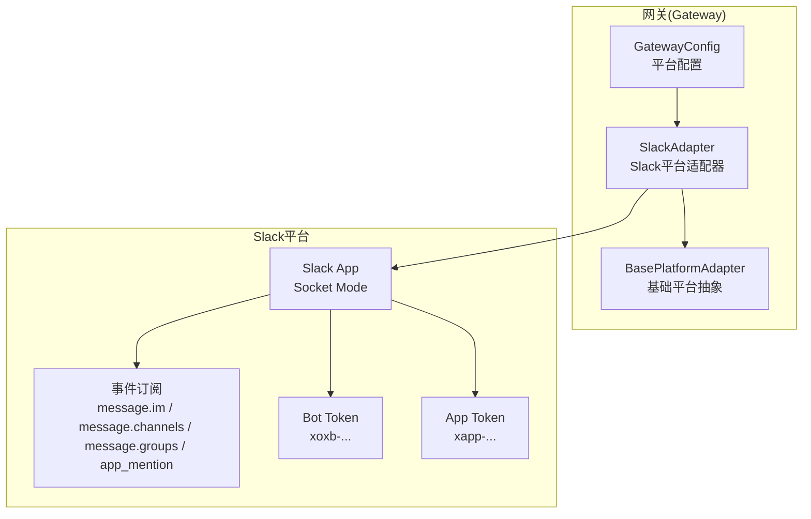
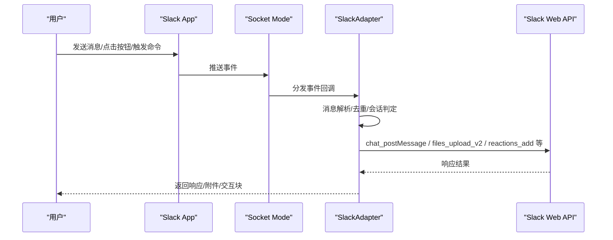
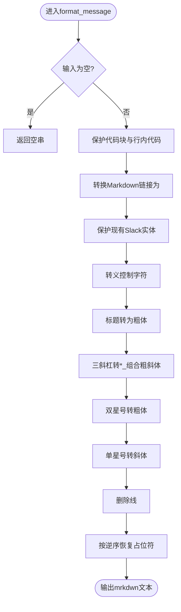
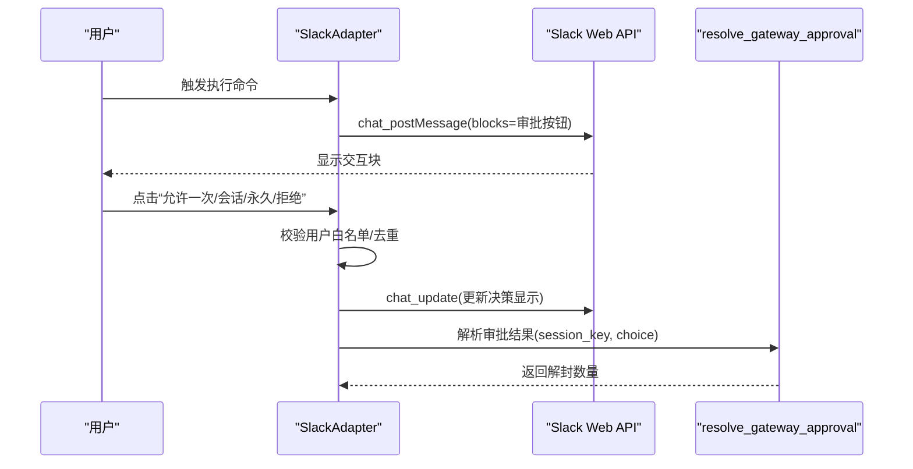
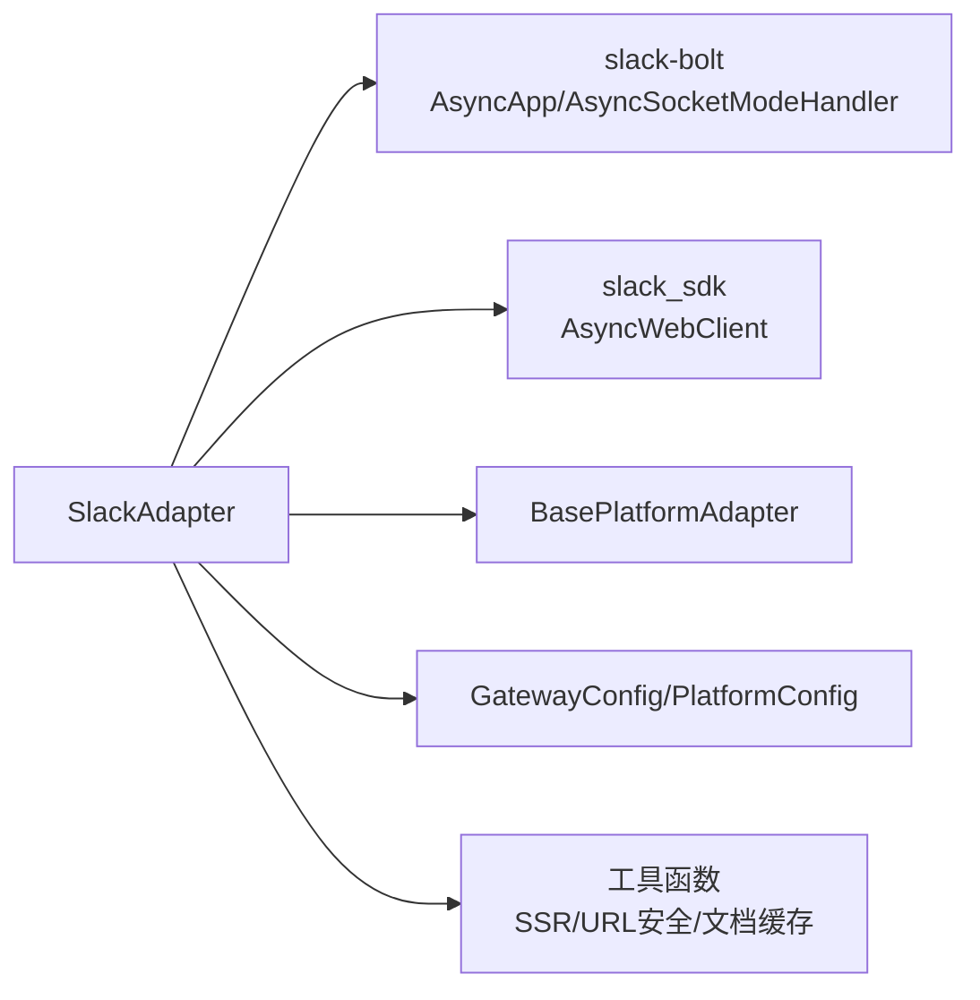

# Slack集成

<cite>
**本文引用的文件**
- [slack.py](file://gateway/platforms/slack.py)
- [config.py](file://gateway/config.py)
- [slack.md](file://website/docs/user-guide/messaging/slack.md)
- [test_slack.py](file://tests/gateway/test_slack.py)
- [test_slack_mention.py](file://tests/gateway/test_slack_mention.py)
- [test_slack_approval_buttons.py](file://tests/gateway/test_slack_approval_buttons.py)
- [config.py](file://hermes_cli/config.py)
</cite>

## 目录
1. [简介](#简介)
2. [项目结构](#项目结构)
3. [核心组件](#核心组件)
4. [架构总览](#架构总览)
5. [详细组件分析](#详细组件分析)
6. [依赖分析](#依赖分析)
7. [性能考虑](#性能考虑)
8. [故障排查指南](#故障排查指南)
9. [结论](#结论)
10. [附录](#附录)

## 简介
本文件面向在Slack平台集成Hermes Agent的工程团队与运维人员，系统性阐述Slack App的创建与配置、Bot Token与App Token的获取、Workspace安装与权限范围设置；详解Slack消息格式处理（Markdown到mrkdwn转换）、Block Kit交互组件（审批按钮）、用户与频道管理、实时消息传递机制；覆盖Slack特有能力如Slash Commands、Interactive Components、Modals弹窗、文件上传下载；并提供App配置指南、权限管理策略与集成最佳实践，以及WebSocket连接管理与事件处理机制。

## 项目结构
Slack集成主要由以下模块构成：
- 平台适配器：SlackAdapter（gateway/platforms/slack.py）
- 配置管理：GatewayConfig/PlatformConfig（gateway/config.py）
- 用户指南：Slack平台设置与最佳实践（website/docs/user-guide/messaging/slack.md）
- 测试用例：覆盖消息路由、Block Kit审批按钮、线程上下文抓取等（tests/gateway/test_slack*.py）
- CLI配置项：Slack相关环境变量与提示（hermes_cli/config.py）

图示来源
- [slack.py:64-116](file://gateway/platforms/slack.py#L64-L116)
- [config.py:48-68](file://gateway/config.py#L48-L68)

章节来源
- [slack.py:64-116](file://gateway/platforms/slack.py#L64-L116)
- [config.py:48-68](file://gateway/config.py#L48-L68)

## 核心组件
- SlackAdapter：基于slack-bolt与Socket Mode的异步适配器，负责连接、事件处理、消息发送、文件上传、Block Kit交互、线程上下文抓取、打字状态指示等。
- GatewayConfig/PlatformConfig：集中管理各平台配置，支持从环境变量、config.yaml桥接至Slack的require_mention、free_response_channels等行为参数。
- CLI配置项：提供Slack Bot Token与App Token的交互式输入与校验。

章节来源
- [slack.py:64-116](file://gateway/platforms/slack.py#L64-L116)
- [config.py:142-187](file://gateway/config.py#L142-L187)
- [config.py:1170-1187](file://hermes_cli/config.py#L1170-L1187)

## 架构总览
Slack集成采用Socket Mode，通过WebSocket与Slack服务器建立长连接，无需公网可访问的HTTP回调端点。适配器在启动时注册事件处理器（消息、@提及、助手线程生命周期事件、Slash命令），并通过Web API进行消息发送、文件上传、状态更新等操作。

图示来源
- [slack.py:117-230](file://gateway/platforms/slack.py#L117-L230)
- [slack.py:182-226](file://gateway/platforms/slack.py#L182-L226)

章节来源
- [slack.py:117-230](file://gateway/platforms/slack.py#L117-L230)
- [slack.py:182-226](file://gateway/platforms/slack.py#L182-L226)

## 详细组件分析

### Slack App创建与配置
- 创建Slack App（从scratch），选择目标Workspace。
- 配置Bot Token Scopes（至少包含chat:write、app_mentions:read、channels:history、groups:history、im:history、im:read、im:write、users:read、files:write）。
- 启用Socket Mode并生成App-Level Token（xapp-...），添加connections:write作用域。
- 订阅Bot事件：message.im、message.channels、message.groups、app_mention。
- 启用App Home Messages Tab，允许用户通过消息标签页向应用发送消息。
- 安装App到Workspace，复制Bot User OAuth Token（xoxb-...）。
- 在Hermes中配置SLACK_BOT_TOKEN、SLACK_APP_TOKEN、SLACK_ALLOWED_USERS等环境变量或config.yaml。

章节来源
- [slack.md:30-144](file://website/docs/user-guide/messaging/slack.md#L30-L144)
- [slack.md:162-190](file://website/docs/user-guide/messaging/slack.md#L162-L190)

### 权限范围与作用域
- 必需作用域：chat:write、app_mentions:read、channels:history、groups:history、im:history、im:read、im:write、users:read、files:write。
- 可选作用域：groups:read。
- 重要：若缺少channels:history或groups:history，机器人在公共/私有频道不会接收消息，仅DM可用。

章节来源
- [slack.md:42-70](file://website/docs/user-guide/messaging/slack.md#L42-L70)
- [slack.md:59-62](file://website/docs/user-guide/messaging/slack.md#L59-L62)

### Socket Mode与事件订阅
- 使用Socket Mode替代RTM（已废弃），无需公网URL。
- 事件订阅必须包含message.im、message.channels、message.groups、app_mention。
- 若仅DM工作而频道不工作，最可能原因：未添加message.channels/message.groups事件或未重新安装App。

章节来源
- [slack.md:9-17](file://website/docs/user-guide/messaging/slack.md#L9-L17)
- [slack.md:90-113](file://website/docs/user-guide/messaging/slack.md#L90-L113)
- [slack.md:420-447](file://website/docs/user-guide/messaging/slack.md#L420-L447)

### 消息格式处理与Markdown到mrkdwn转换
- SlackAdapter提供format_message方法，将标准Markdown转换为Slack mrkdwn语法。
- 支持保护代码块/行内代码、链接转换、实体保留、转义控制字符、标题转粗体、删除线、块引用等。
- 转换过程采用占位符机制，确保受保护内容不被破坏。

图示来源
- [slack.py:423-531](file://gateway/platforms/slack.py#L423-L531)

章节来源
- [slack.py:423-531](file://gateway/platforms/slack.py#L423-L531)

### Block Kit交互与审批按钮
- 通过send_exec_approval发送包含四个按钮的Block Kit消息：允许一次、允许会话、永久允许、拒绝。
- 点击按钮后，_handle_approval_action进行授权校验与去重，调用resolve_gateway_approval解封等待的执行请求，并更新消息显示决策。
- 支持在指定thread_ts中展示，便于上下文关联。

图示来源
- [slack.py:1197-1276](file://gateway/platforms/slack.py#L1197-L1276)
- [slack.py:1277-1369](file://gateway/platforms/slack.py#L1277-L1369)

章节来源
- [slack.py:1197-1276](file://gateway/platforms/slack.py#L1197-L1276)
- [slack.py:1277-1369](file://gateway/platforms/slack.py#L1277-L1369)
- [test_slack_approval_buttons.py:66-146](file://tests/gateway/test_slack_approval_buttons.py#L66-L146)

### 文件上传与媒体处理
- 支持图片、音频、视频、文档上传，自动根据扩展名与MIME类型判断类型与大小限制。
- 文档缓存：对txt/md等小文件注入内容，超过阈值则仅缓存文件路径。
- 私有文件下载：使用bot token作为Authorization头，带重试与HTML兜底检测。

章节来源
- [slack.py:397-420](file://gateway/platforms/slack.py#L397-L420)
- [slack.py:598-782](file://gateway/platforms/slack.py#L598-L782)
- [slack.py:1074-1156](file://gateway/platforms/slack.py#L1074-L1156)
- [test_slack.py:157-251](file://tests/gateway/test_slack.py#L157-L251)
- [test_slack.py:257-313](file://tests/gateway/test_slack.py#L257-L313)

### Slash Commands与消息路由
- 注册/command "/hermes"，映射到内部命令表，支持compact别名。
- 消息路由规则：DM始终处理；频道消息默认要求@提及；首次在线程中被@提及后，后续该线程回复无需@提及；自由通道（free_response_channels）可绕过@提及。
- 机器人消息过滤：支持none/mentions/all三种策略，避免回环与噪音。

章节来源
- [slack.py:202-207](file://gateway/platforms/slack.py#L202-L207)
- [slack.py:1481-1521](file://gateway/platforms/slack.py#L1481-L1521)
- [slack.py:936-1041](file://gateway/platforms/slack.py#L936-L1041)
- [test_slack_mention.py:178-279](file://tests/gateway/test_slack_mention.py#L178-L279)

### 线程上下文抓取与会话保持
- 首次在某线程被@提及且无活跃会话时，抓取最近N条消息作为上下文前缀，避免重复与上下文缺失。
- 对conversation.replies进行指数退避重试，带缓存（TTL）以降低速率限制压力。
- 会话键构建遵循build_session_key，避免手动拼接导致的隔离策略偏差。

章节来源
- [slack.py:1372-1480](file://gateway/platforms/slack.py#L1372-L1480)
- [slack.py:1522-1568](file://gateway/platforms/slack.py#L1522-L1568)
- [test_slack_approval_buttons.py:244-374](file://tests/gateway/test_slack_approval_buttons.py#L244-L374)

### 打字状态与反应
- 通过assistant.threads.setStatus在线程中显示“正在思考”状态，失败时降级为reaction。
- 发送/编辑消息后自动添加/移除eyes与白色勾选反应，提升交互反馈。

章节来源
- [slack.py:341-368](file://gateway/platforms/slack.py#L341-L368)
- [slack.py:1181-1194](file://gateway/platforms/slack.py#L1181-L1194)

### 多工作区支持
- 支持逗号分隔的多Bot Token，首个为主Token用于Socket Mode连接，其余用于多工作区认证。
- 自动加载~/.hermes/slack_tokens.json中的OAuth token，合并去重。
- 按team_id维护独立WebClient与bot_user_id，消息到达时选择正确客户端响应。

章节来源
- [slack.py:135-152](file://gateway/platforms/slack.py#L135-L152)
- [slack.py:157-181](file://gateway/platforms/slack.py#L157-L181)
- [slack.md:357-409](file://website/docs/user-guide/messaging/slack.md#L357-L409)

### 配置与行为选项
- reply_to_mode：多段回复的线程模式（off/first/all）。
- extra.reply_in_thread：是否在频道中使用线程回复（默认true）。
- extra.reply_broadcast：线程回复是否广播到主频道（仅首块生效）。
- require_mention：是否强制频道@提及（默认true）。
- free_response_channels：免@提及的频道集合。
- unauthorized_dm_behavior：未授权用户DM处理策略（pair/ignore）。
- group_sessions_per_user：共享频道中按用户隔离会话（默认true）。

章节来源
- [slack.md:221-336](file://website/docs/user-guide/messaging/slack.md#L221-L336)
- [config.py:565-577](file://gateway/config.py#L565-L577)
- [config.py:142-187](file://gateway/config.py#L142-L187)

## 依赖分析
- 外部依赖：slack-bolt（AsyncApp、AsyncSocketModeHandler）、slack_sdk（AsyncWebClient）。
- 内部依赖：BasePlatformAdapter（统一消息事件封装）、MessageEvent/SendResult、会话存储（可选）、工具函数（SSR防护、URL安全检查、文档缓存）。

图示来源
- [slack.py:20-30](file://gateway/platforms/slack.py#L20-L30)
- [slack.py:35-45](file://gateway/platforms/slack.py#L35-L45)

章节来源
- [slack.py:20-30](file://gateway/platforms/slack.py#L20-L30)
- [slack.py:35-45](file://gateway/platforms/slack.py#L35-L45)

## 性能考虑
- 线程上下文抓取：对conversation.replies使用指数退避重试与TTL缓存，避免频繁API调用。
- 去重与内存上限：_bot_message_ts与_mentioned_threads采用容量上限与定期清理，防止无限增长。
- 多工作区：按team_id缓存client与bot_user_id，减少重复认证开销。
- Markdown转换：采用占位符与分阶段转换，避免多次正则替换带来的复杂度。

章节来源
- [slack.py:1400-1430](file://gateway/platforms/slack.py#L1400-L1430)
- [slack.py:101-116](file://gateway/platforms/slack.py#L101-L116)
- [slack.py:986-988](file://gateway/platforms/slack.py#L986-L988)

## 故障排查指南
常见问题与解决步骤：
- 机器人在DM工作但在频道不工作：确认已订阅message.channels与message.groups事件，重新安装App，并邀请机器人到频道。
- “发送消息给此应用已被关闭”：启用App Home Messages Tab。
- “not_authed/invalid_auth”：重新生成Bot Token与App Token。
- “missing_scope”：补充所需作用域并重新安装App。
- Socket断连频繁：检查网络稳定性，Bolt会自动重连。
- 更改作用域/事件后无效：必须重新安装App。

快速检查清单：
- ✅ 已订阅message.im、message.channels、message.groups、app_mention
- ✅ 已添加channels:history与groups:history作用域
- ✅ 已重新安装App
- ✅ 已邀请机器人到目标频道
- ✅ 已@提及机器人（频道场景）

章节来源
- [slack.md:420-448](file://website/docs/user-guide/messaging/slack.md#L420-L448)

## 结论
通过Socket Mode与完善的事件处理、消息格式转换、Block Kit交互、文件处理与线程上下文管理，Hermes在Slack平台实现了稳定、可扩展且安全的集成能力。遵循本文的App创建流程、权限配置与最佳实践，可显著降低部署与运维成本，并提升用户体验。

## 附录

### 环境变量与CLI提示
- SLACK_BOT_TOKEN：Bot User OAuth Token（xoxb-...）
- SLACK_APP_TOKEN：App-Level Token（xapp-...），用于Socket Mode
- SLACK_ALLOWED_USERS：授权用户Member ID列表（逗号分隔）
- SLACK_HOME_CHANNEL：Home频道ID（可选）
- SLACK_HOME_CHANNEL_NAME：Home频道显示名称（可选）

章节来源
- [slack.md:164-175](file://website/docs/user-guide/messaging/slack.md#L164-L175)
- [config.py:1170-1187](file://hermes_cli/config.py#L1170-L1187)