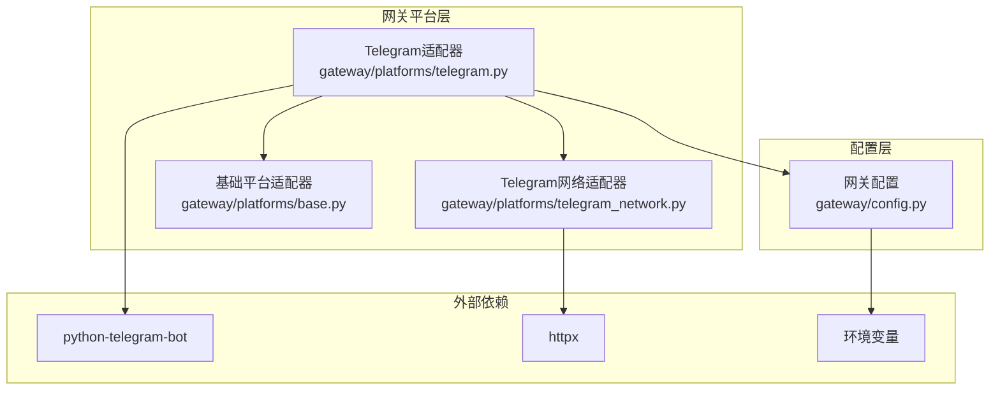
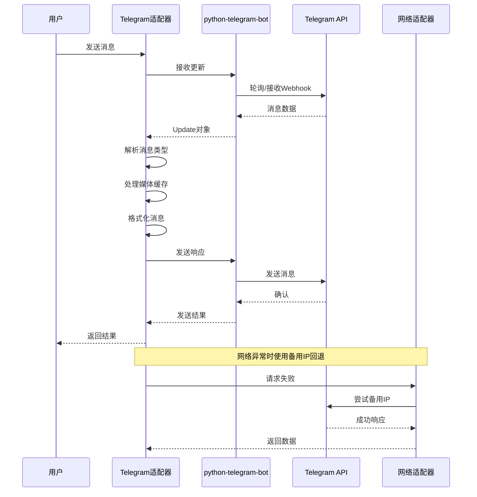
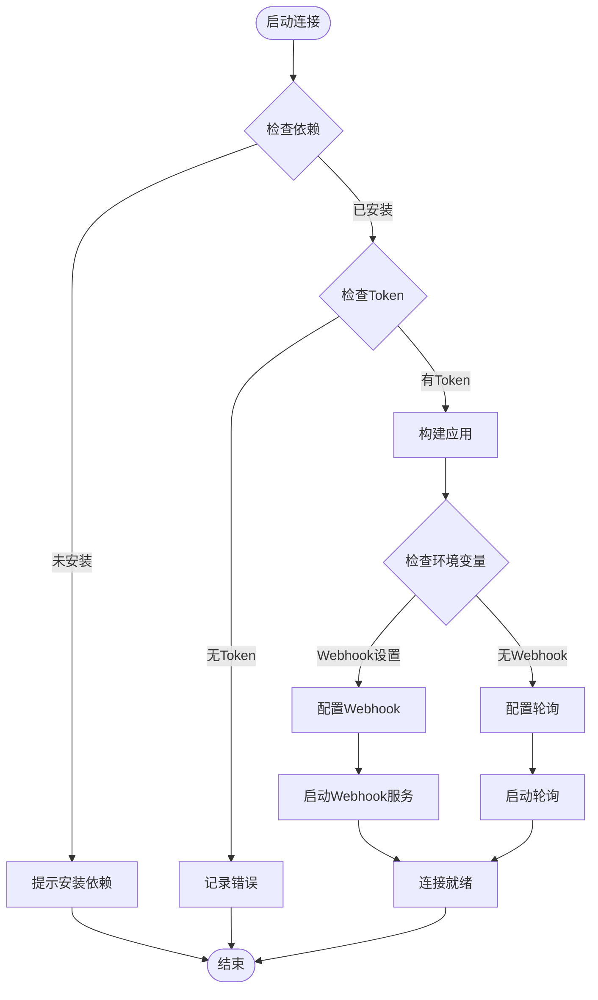
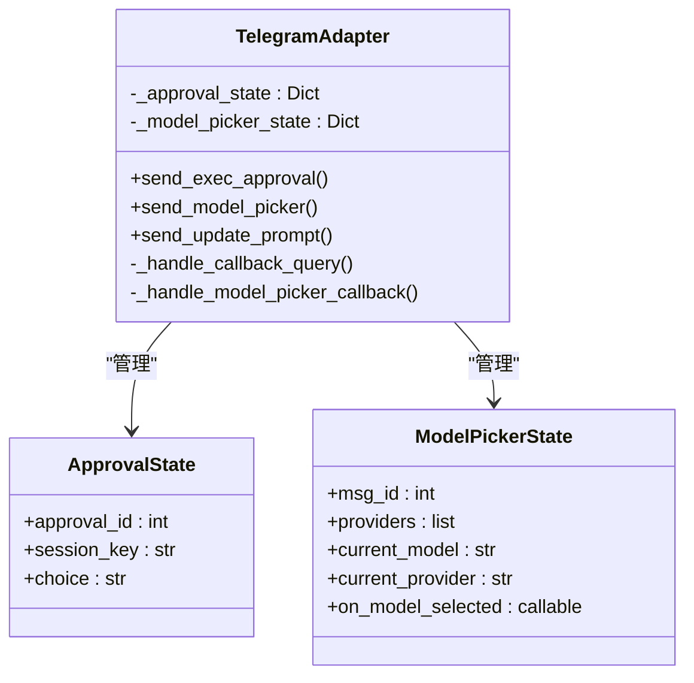
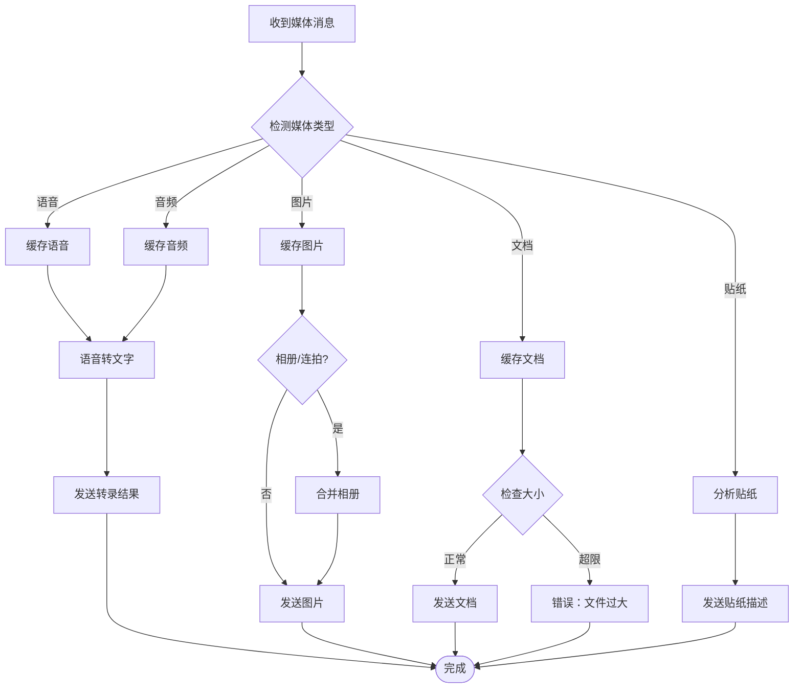
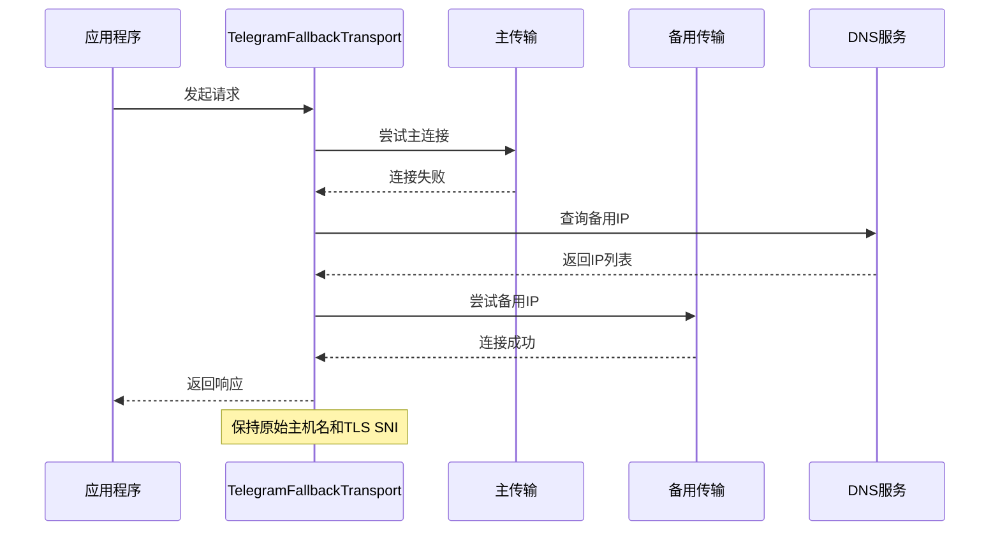
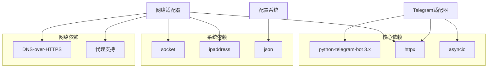
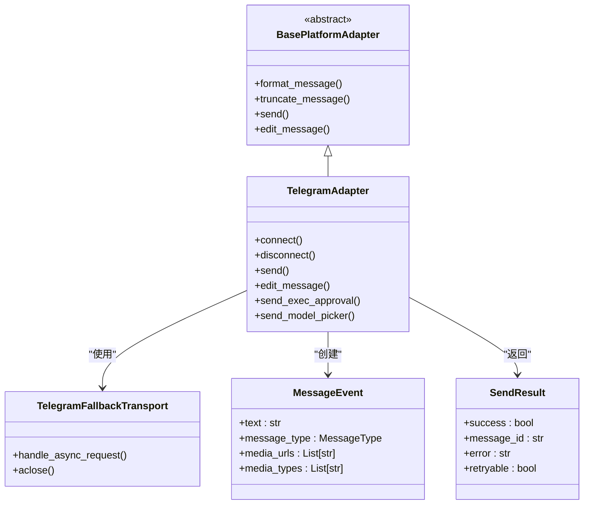

# Telegram集成

<cite>
**本文档引用的文件**
- [telegram.py](file://gateway/platforms/telegram.py)
- [telegram_network.py](file://gateway/platforms/telegram_network.py)
- [base.py](file://gateway/platforms/base.py)
- [config.py](file://gateway/config.py)
- [README.md](file://README.md)
</cite>

## 目录
1. [简介](#简介)
2. [项目结构](#项目结构)
3. [核心组件](#核心组件)
4. [架构概览](#架构概览)
5. [详细组件分析](#详细组件分析)
6. [依赖关系分析](#依赖关系分析)
7. [性能考虑](#性能考虑)
8. [故障排除指南](#故障排除指南)
9. [结论](#结论)
10. [附录](#附录)

## 简介
本文件为Telegram平台集成的详细技术文档，基于代码库中的实现进行全面解析。内容涵盖Bot Token获取与验证、Webhook配置与长期连接建立、消息格式处理、Inline Keyboard按钮响应、媒体文件接收与发送、群组与私聊的不同处理逻辑，以及Telegram特有的功能（内联查询、支付集成、游戏支持等）。同时提供配置示例、错误处理策略和性能优化建议，并重点说明Telegram网络适配器的特殊处理机制。

## 项目结构
Telegram集成位于gateway/platforms目录下，主要由以下文件构成：
- telegram.py：Telegram平台适配器的核心实现，负责连接、消息处理、媒体处理、键盘交互等
- telegram_network.py：Telegram专用网络适配器，提供备用IP回退机制
- base.py：平台适配器基类定义，提供通用的消息事件、发送结果等抽象
- config.py：网关配置管理，包含平台配置、会话重置策略、流式传输配置等



**图表来源**
- [telegram.py:114-732](file://gateway/platforms/telegram.py#L114-L732)
- [telegram_network.py:53-121](file://gateway/platforms/telegram_network.py#L53-L121)
- [base.py:779-800](file://gateway/platforms/base.py#L779-L800)
- [config.py:48-186](file://gateway/config.py#L48-L186)

**章节来源**
- [telegram.py:1-100](file://gateway/platforms/telegram.py#L1-L100)
- [telegram_network.py:1-50](file://gateway/platforms/telegram_network.py#L1-L50)
- [base.py:1-50](file://gateway/platforms/base.py#L1-L50)
- [config.py:1-50](file://gateway/config.py#L1-L50)

## 核心组件
本节深入分析Telegram集成的关键组件及其职责：

### TelegramAdapter类
TelegramAdapter是平台适配器的核心实现，继承自BasePlatformAdapter，提供完整的Telegram功能支持：

- 连接管理：支持轮询模式和Webhook模式两种连接方式
- 消息处理：文本、命令、位置、媒体等多种消息类型的统一处理
- 媒体处理：图片、音频、视频、文档等媒体文件的接收与缓存
- 交互功能：Inline Keyboard按钮响应、模型选择器、执行审批等
- 网络适配：内置备用IP回退机制，解决网络限制问题

### TelegramFallbackTransport类
专门设计的网络传输层，解决Telegram API访问受限的问题：

- 备用IP回退：当主域名不可达时自动切换到备用IP
- TLS SNI保持：在切换IP的同时保持原始主机名和TLS服务器名称
- 连接池隔离：为主请求和备用请求分别维护独立的连接池
- 自动粘性：一旦找到可用的备用IP，后续请求将优先使用该IP

### 基础平台适配器
提供通用的消息事件、发送结果、媒体缓存等基础设施：

- MessageEvent：标准化的消息事件表示，支持多种媒体类型
- SendResult：统一的发送结果封装，包含成功状态、错误信息等
- 缓存工具：图像、音频、文档的本地缓存机制
- 长度计算：UTF-16长度计算，确保符合Telegram字符限制

**章节来源**
- [telegram.py:114-164](file://gateway/platforms/telegram.py#L114-L164)
- [telegram_network.py:53-121](file://gateway/platforms/telegram_network.py#L53-L121)
- [base.py:634-727](file://gateway/platforms/base.py#L634-L727)

## 架构概览
Telegram集成采用分层架构设计，确保功能模块化和可扩展性：



**图表来源**
- [telegram.py:477-732](file://gateway/platforms/telegram.py#L477-L732)
- [telegram_network.py:74-115](file://gateway/platforms/telegram_network.py#L74-L115)

## 详细组件分析

### 连接与认证机制
Telegram适配器支持两种连接模式，满足不同部署场景的需求：

#### 轮询模式（Polling）
默认的长连接方式，适合本地开发和小型部署：
- 自动清理之前的Webhook设置，避免冲突
- 支持错误回调处理，自动重连网络异常
- 具备冲突检测机制，防止多个实例同时运行

#### Webhook模式
适合云平台部署，支持自动唤醒：
- 配置HTTPS URL、端口和密钥令牌
- 支持反向代理和负载均衡
- 提供安全的更新验证机制



**图表来源**
- [telegram.py:477-732](file://gateway/platforms/telegram.py#L477-L732)

**章节来源**
- [telegram.py:477-732](file://gateway/platforms/telegram.py#L477-L732)

### 消息格式处理
Telegram适配器实现了完整的MarkdownV2格式转换，确保消息在Telegram中正确显示：

#### 格式转换流程
1. **保护代码块**：先处理代码块和行内代码，防止转义影响
2. **链接转换**：将标准Markdown链接转换为Telegram格式
3. **标题处理**：将多级标题转换为粗体格式
4. **特殊字符转义**：对MarkdownV2特殊字符进行转义
5. **占位符恢复**：最后恢复之前保护的内容

#### 字符长度计算
使用UTF-16长度计算，准确反映Telegram的字符限制：
- 支持表情符号等Unicode字符
- 避免字符截断问题
- 确保消息完整性

**章节来源**
- [telegram.py:1818-1973](file://gateway/platforms/telegram.py#L1818-L1973)
- [base.py:24-56](file://gateway/platforms/base.py#L24-L56)

### Inline Keyboard交互
Telegram适配器提供了丰富的交互功能，通过Inline Keyboard实现用户与系统的自然对话：

#### 执行审批系统
支持三种审批级别：
- 一次性审批：仅本次调用有效
- 会话级审批：当前会话期间有效  
- 永久审批：永久生效



**图表来源**
- [telegram.py:1055-1190](file://gateway/platforms/telegram.py#L1055-L1190)
- [telegram.py:1235-1413](file://gateway/platforms/telegram.py#L1235-L1413)

#### 模型选择器
提供两步式模型选择界面：
- 第一步：选择AI提供商
- 第二步：浏览和选择具体模型
- 支持分页浏览和搜索

**章节来源**
- [telegram.py:1055-1190](file://gateway/platforms/telegram.py#L1055-L1190)
- [telegram.py:1192-1413](file://gateway/platforms/telegram.py#L1192-L1413)

### 媒体文件处理
Telegram适配器实现了完整的媒体文件处理机制，支持多种媒体类型：

#### 图片处理
- 自动下载并缓存图片到本地
- 支持JPEG、PNG、WEBP、GIF等多种格式
- 处理图片相册和连续拍照场景
- 支持贴纸分析和描述生成

#### 音频处理
- 语音消息自动转录为文本
- 支持MP3、OGG等音频格式
- 自动缓存音频文件用于转录

#### 文档处理
- 支持PDF、TXT、MD等文本格式
- 自动注入文档内容到消息中
- 限制最大文件大小（20MB）



**图表来源**
- [telegram.py:2302-2467](file://gateway/platforms/telegram.py#L2302-L2467)
- [base.py:316-453](file://gateway/platforms/base.py#L316-L453)

**章节来源**
- [telegram.py:2302-2467](file://gateway/platforms/telegram.py#L2302-L2467)
- [base.py:316-453](file://gateway/platforms/base.py#L316-L453)

### 群组与私聊处理
Telegram适配器针对不同的聊天类型提供了差异化处理逻辑：

#### 私聊（Direct Message）处理
- 完全开放的对话权限
- 支持所有命令和功能
- 无需@提及即可触发

#### 群组（Group）处理
- 受限触发机制，需要@提及或回复机器人
- 支持白名单通道配置
- 可配置唤醒词模式

#### 论坛主题（Forum Topics）
- 支持Telegram 9.4新增的私聊主题功能
- 自动创建和管理主题
- 支持主题技能绑定

**章节来源**
- [telegram.py:1975-2116](file://gateway/platforms/telegram.py#L1975-L2116)
- [telegram.py:320-476](file://gateway/platforms/telegram.py#L320-L476)

### Telegram网络适配器
这是Telegram集成的核心创新，专门解决网络访问限制问题：

#### 备用IP发现机制
- DNS-over-HTTPS查询：通过Google和Cloudflare获取可用IP
- 系统DNS对比：排除本地不可达的IP
- 固定种子IP：作为最后的备选方案

#### 连接回退策略
- 主域名连接失败时自动尝试备用IP
- 保持TLS SNI和主机名不变
- 实现连接池级别的回退



**图表来源**
- [telegram_network.py:74-115](file://gateway/platforms/telegram_network.py#L74-L115)

**章节来源**
- [telegram_network.py:186-227](file://gateway/platforms/telegram_network.py#L186-L227)
- [telegram_network.py:230-243](file://gateway/platforms/telegram_network.py#L230-L243)

## 依赖关系分析

### 外部依赖
Telegram集成依赖以下关键组件：



**图表来源**
- [telegram.py:19-56](file://gateway/platforms/telegram.py#L19-L56)
- [telegram_network.py:19-21](file://gateway/platforms/telegram_network.py#L19-L21)

### 内部依赖关系
适配器之间的依赖关系清晰明确：



**图表来源**
- [base.py:779-800](file://gateway/platforms/base.py#L779-L800)
- [telegram.py:114-164](file://gateway/platforms/telegram.py#L114-L164)
- [telegram_network.py:53-73](file://gateway/platforms/telegram_network.py#L53-L73)

**章节来源**
- [base.py:779-800](file://gateway/platforms/base.py#L779-L800)
- [telegram.py:114-164](file://gateway/platforms/telegram.py#L114-L164)
- [telegram_network.py:53-73](file://gateway/platforms/telegram_network.py#L53-L73)

## 性能考虑
Telegram集成在设计时充分考虑了性能优化：

### 连接池优化
- 独立的请求和获取更新连接池
- 可配置的连接池大小和超时参数
- 避免连接竞争和资源争用

### 消息批处理
- 文本消息缓冲：处理客户端侧消息分割
- 图片相册合并：将连续图片合并为单个事件
- 媒体会话队列：按媒体组ID合并相册内容

### 缓存策略
- 媒体文件本地缓存：避免重复下载
- 贴纸描述缓存：减少重复分析
- 配置热加载：支持动态更新主题配置

### 错误处理与重试
- 指数退避重试：网络错误自动重试
- 冲突检测：防止多实例冲突
- 非幂等操作防护：避免重复发送

## 故障排除指南

### 常见连接问题
1. **Token无效**
   - 检查TELEGRAM_BOT_TOKEN环境变量
   - 验证Bot Token格式正确性
   - 确认Bot具有相应权限

2. **网络连接失败**
   - 检查防火墙设置
   - 验证代理配置
   - 启用备用IP回退机制

3. **Webhook配置错误**
   - 确认HTTPS URL有效且可访问
   - 检查密钥令牌配置
   - 验证端口监听状态

### 消息处理问题
1. **消息被截断**
   - 检查UTF-16长度限制
   - 使用消息分片功能
   - 调整消息格式

2. **媒体文件处理失败**
   - 检查文件大小限制
   - 验证文件格式支持
   - 确认磁盘空间充足

3. **Inline Keyboard无响应**
   - 检查回调处理器注册
   - 验证按钮数据格式
   - 确认用户权限

**章节来源**
- [telegram.py:195-318](file://gateway/platforms/telegram.py#L195-L318)
- [telegram.py:824-937](file://gateway/platforms/telegram.py#L824-L937)

## 结论
Telegram集成通过模块化设计和完善的错误处理机制，提供了稳定可靠的即时通讯平台支持。其核心优势包括：

1. **灵活的连接模式**：支持轮询和Webhook两种模式，适应不同部署场景
2. **强大的媒体处理能力**：完整的媒体文件接收、缓存和处理机制
3. **丰富的交互功能**：Inline Keyboard、模型选择器、执行审批等
4. **网络适应性强**：内置备用IP回退机制，解决网络访问限制
5. **性能优化完善**：连接池、批处理、缓存等多重优化措施

该集成不仅满足了基本的聊天功能需求，还为高级应用场景（如AI模型选择、执行审批、主题管理等）提供了坚实的基础。

## 附录

### 配置示例
```yaml
# Telegram配置示例
telegram:
  enabled: true
  token: ${TELEGRAM_BOT_TOKEN}
  reply_to_mode: first
  extra:
    # 备用IP配置
    fallback_ips: []
    
    # 群组触发规则
    require_mention: false
    free_response_chats: []
    mention_patterns: []
    
    # DM主题配置
    dm_topics: []
    
    # 会话隔离
    group_sessions_per_user: true
    thread_sessions_per_user: false
```

### 环境变量参考
- `TELEGRAM_BOT_TOKEN`：Bot访问令牌
- `TELEGRAM_WEBHOOK_URL`：Webhook HTTPS URL
- `TELEGRAM_WEBHOOK_PORT`：Webhook监听端口（默认8443）
- `TELEGRAM_WEBHOOK_SECRET`：Webhook密钥令牌
- `TELEGRAM_REQUIRE_MENTION`：是否要求@提及
- `TELEGRAM_FREE_RESPONSE_CHATS`：允许自由回复的群组ID列表
- `TELEGRAM_MENTION_PATTERNS`：唤醒词正则表达式模式
- `TELEGRAM_FALLBACK_IPS`：备用IP地址列表

### 支持的消息类型
- 文本消息：支持MarkdownV2格式
- 命令消息：/command格式
- 位置消息：经纬度坐标
- 媒体消息：图片、视频、音频、文档、贴纸
- 交互消息：Inline Keyboard按钮点击