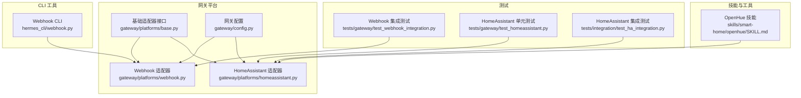
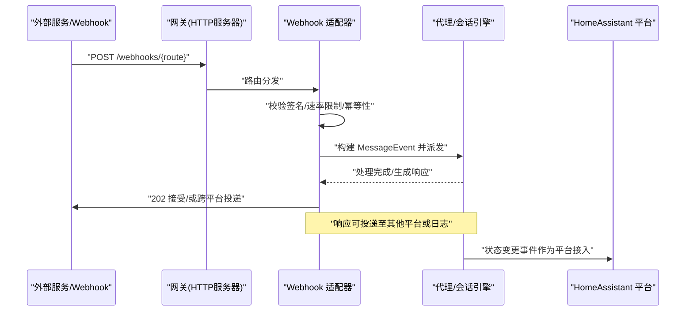
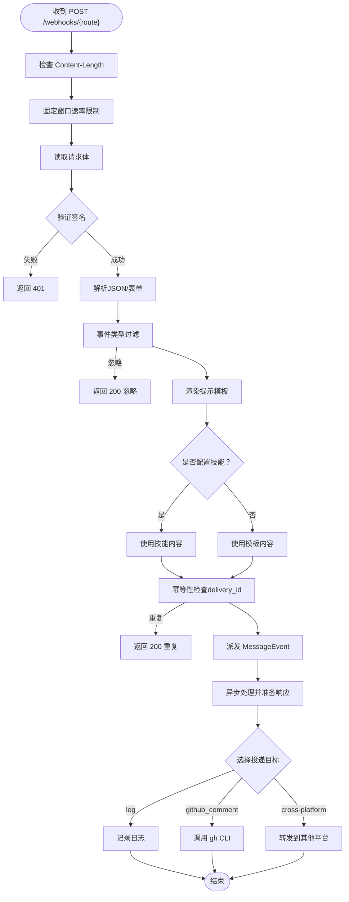
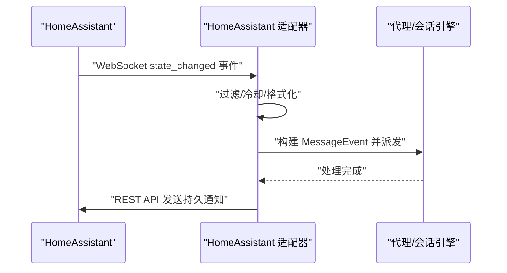
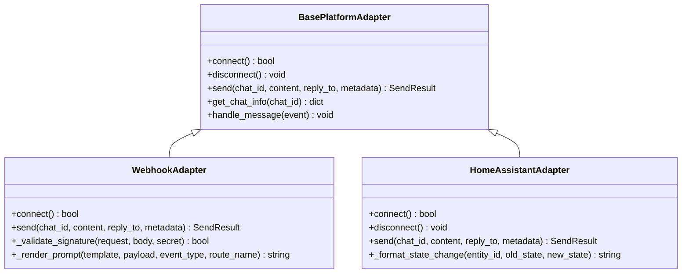
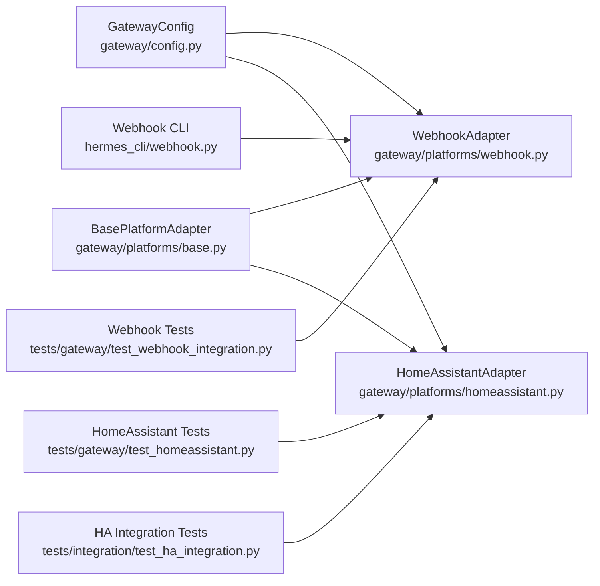

# Webhook与HomeAssistant

<cite>
**本文档引用的文件**
- [webhook.py](file://gateway/platforms/webhook.py)
- [homeassistant.py](file://gateway/platforms/homeassistant.py)
- [base.py](file://gateway/platforms/base.py)
- [config.py](file://gateway/config.py)
- [webhook.py](file://hermes_cli/webhook.py)
- [test_webhook_integration.py](file://tests/gateway/test_webhook_integration.py)
- [test_homeassistant.py](file://tests/gateway/test_homeassistant.py)
- [test_ha_integration.py](file://tests/integration/test_ha_integration.py)
- [SKILL.md](file://skills/smart-home/openhue/SKILL.md)
</cite>

## 目录
1. [简介](#简介)
2. [项目结构](#项目结构)
3. [核心组件](#核心组件)
4. [架构总览](#架构总览)
5. [详细组件分析](#详细组件分析)
6. [依赖关系分析](#依赖关系分析)
7. [性能考虑](#性能考虑)
8. [故障排查指南](#故障排查指南)
9. [结论](#结论)
10. [附录](#附录)

## 简介
本文件面向需要在系统中集成Webhook与HomeAssistant的用户与开发者，提供从架构设计到实现细节、安全策略、调试方法与最佳实践的完整文档。内容涵盖：
- 通用Webhook接口：URL配置、请求验证（HMAC签名）、事件过滤、提示模板渲染、跨平台响应投递与防重放机制
- HomeAssistant平台：实时事件监听、状态变更格式化、过滤与节流、通知发送与工具集集成
- 安全与可靠性：签名验证、速率限制、幂等性、超时与重连
- 实践案例：动态路由订阅、测试工具、常见智能家居场景

## 项目结构
本项目采用“网关适配器”模式，将不同平台抽象为统一的适配器接口，通过配置驱动连接与行为。

**图表来源**
- [webhook.py:65-154](file://gateway/platforms/webhook.py#L65-L154)
- [homeassistant.py:51-138](file://gateway/platforms/homeassistant.py#L51-L138)
- [base.py:779-800](file://gateway/platforms/base.py#L779-L800)
- [config.py:48-69](file://gateway/config.py#L48-L69)
- [webhook.py:114-180](file://hermes_cli/webhook.py#L114-L180)
- [test_webhook_integration.py:34-47](file://tests/gateway/test_webhook_integration.py#L34-L47)
- [test_homeassistant.py:179-257](file://tests/gateway/test_homeassistant.py#L179-L257)
- [test_ha_integration.py:73-104](file://tests/integration/test_ha_integration.py#L73-L104)
- [SKILL.md:1-109](file://skills/smart-home/openhue/SKILL.md#L1-L109)

**章节来源**
- [webhook.py:1-23](file://gateway/platforms/webhook.py#L1-L23)
- [homeassistant.py:1-13](file://gateway/platforms/homeassistant.py#L1-L13)
- [base.py:1-22](file://gateway/platforms/base.py#L1-L22)
- [config.py:1-22](file://gateway/config.py#L1-L22)

## 核心组件
- Webhook 适配器：提供HTTP端点接收外部服务事件，进行签名验证、事件过滤、提示模板渲染、会话派发与响应投递；支持静态与动态路由热加载、速率限制、幂等性与跨平台投递。
- HomeAssistant 适配器：通过WebSocket订阅state_changed事件，按域/实体过滤与节流，格式化为人类可读消息并注入会话；通过REST API发送持久通知。
- 基础适配器接口：定义消息事件、发送结果、会话源等统一数据结构与生命周期钩子。
- 网关配置：集中管理平台启用状态、令牌、额外参数、默认投递通道与会话策略。
- CLI 工具：提供动态Webhook订阅的创建、列出、删除与测试能力。
- 测试套件：覆盖Webhook与HomeAssistant的关键行为与边界条件。

**章节来源**
- [webhook.py:65-154](file://gateway/platforms/webhook.py#L65-L154)
- [homeassistant.py:51-138](file://gateway/platforms/homeassistant.py#L51-L138)
- [base.py:634-727](file://gateway/platforms/base.py#L634-L727)
- [config.py:142-186](file://gateway/config.py#L142-L186)
- [webhook.py:114-180](file://hermes_cli/webhook.py#L114-L180)

## 架构总览
Webhook与HomeAssistant作为网关平台，遵循统一的适配器模式，通过配置驱动连接与行为，对外提供一致的消息处理体验。

**图表来源**
- [webhook.py:278-478](file://gateway/platforms/webhook.py#L278-L478)
- [base.py:655-691](file://gateway/platforms/base.py#L655-L691)
- [homeassistant.py:217-318](file://gateway/platforms/homeassistant.py#L217-L318)

## 详细组件分析

### Webhook 适配器
- 端点与路由
  - GET /health 健康检查
  - POST /webhooks/{route_name} 事件入口
  - 支持静态路由与动态路由热加载（~/.hermes/webhook_subscriptions.json）
- 安全与验证
  - HMAC-SHA256 签名验证（GitHub/GitLab/通用）
  - 可选全局密钥或路由级密钥
  - 测试模式：设置密钥为特定值以跳过验证
- 请求处理流程
  - 身体大小限制（先验校验）
  - 速率限制（固定窗口）
  - 事件类型过滤（基于头部或payload字段）
  - 提示模板渲染（支持点号访问与特殊占位符）
  - 技能注入（优先使用技能内容）
  - 幂等性（基于 delivery_id 的TTL缓存）
  - 会话派发与异步处理
  - 响应投递（日志、GitHub评论、跨平台）
- 关键特性
  - 动态路由热重载（mtime感知）
  - TTL清理与交叠清理
  - 跨平台投递（Telegram/Discord/Slack等）

**图表来源**
- [webhook.py:278-478](file://gateway/platforms/webhook.py#L278-L478)
- [webhook.py:484-513](file://gateway/platforms/webhook.py#L484-L513)
- [webhook.py:519-570](file://gateway/platforms/webhook.py#L519-L570)

**章节来源**
- [webhook.py:65-154](file://gateway/platforms/webhook.py#L65-L154)
- [webhook.py:278-478](file://gateway/platforms/webhook.py#L278-L478)
- [webhook.py:484-513](file://gateway/platforms/webhook.py#L484-L513)
- [webhook.py:519-570](file://gateway/platforms/webhook.py#L519-L570)
- [webhook.py:575-673](file://gateway/platforms/webhook.py#L575-L673)

### HomeAssistant 适配器
- 连接与认证
  - 通过环境变量或配置提供URL与长连接访问令牌
  - 建立WebSocket连接并鉴权，订阅state_changed事件
- 事件过滤与节流
  - 支持按域/实体白名单、黑名单与全局开关
  - 按实体维度的冷却时间，避免事件风暴
- 消息格式化
  - 针对不同域（如sensor/climate/light等）输出人类可读描述
- 发送通知
  - 使用REST API发送持久通知，避免与事件监听循环竞争
- 工具集集成
  - 提供实体查询、状态获取、服务调用等工具

**图表来源**
- [homeassistant.py:140-185](file://gateway/platforms/homeassistant.py#L140-L185)
- [homeassistant.py:217-318](file://gateway/platforms/homeassistant.py#L217-L318)
- [homeassistant.py:386-439](file://gateway/platforms/homeassistant.py#L386-L439)

**章节来源**
- [homeassistant.py:51-138](file://gateway/platforms/homeassistant.py#L51-L138)
- [homeassistant.py:140-185](file://gateway/platforms/homeassistant.py#L140-L185)
- [homeassistant.py:217-318](file://gateway/platforms/homeassistant.py#L217-L318)
- [homeassistant.py:386-439](file://gateway/platforms/homeassistant.py#L386-L439)

### 基础适配器接口与配置
- 统一消息事件与发送结果结构，便于各平台复用
- 网关配置集中管理平台启用、令牌、默认投递通道与会话策略

**图表来源**
- [base.py:779-800](file://gateway/platforms/base.py#L779-L800)
- [webhook.py:65-154](file://gateway/platforms/webhook.py#L65-L154)
- [homeassistant.py:51-138](file://gateway/platforms/homeassistant.py#L51-L138)

**章节来源**
- [base.py:634-727](file://gateway/platforms/base.py#L634-L727)
- [config.py:142-186](file://gateway/config.py#L142-L186)

## 依赖关系分析
- 平台枚举与配置
  - 平台类型统一定义于配置模块，Webhook与HomeAssistant均在此注册
  - 网关配置负责解析与合并多来源配置（环境变量、配置文件、遗留文件）
- 适配器耦合
  - Webhook 适配器依赖基础接口与消息事件结构
  - HomeAssistant 适配器同样依赖基础接口，并通过REST API与WebSocket交互
- CLI 与测试
  - CLI 提供动态路由管理与测试能力
  - 测试覆盖Webhook与HomeAssistant的关键路径与边界条件

**图表来源**
- [config.py:48-69](file://gateway/config.py#L48-L69)
- [webhook.py:65-154](file://gateway/platforms/webhook.py#L65-L154)
- [homeassistant.py:51-138](file://gateway/platforms/homeassistant.py#L51-L138)
- [base.py:779-800](file://gateway/platforms/base.py#L779-L800)
- [webhook.py:114-180](file://hermes_cli/webhook.py#L114-L180)
- [test_webhook_integration.py:34-47](file://tests/gateway/test_webhook_integration.py#L34-L47)
- [test_homeassistant.py:179-257](file://tests/gateway/test_homeassistant.py#L179-L257)
- [test_ha_integration.py:73-104](file://tests/integration/test_ha_integration.py#L73-L104)

**章节来源**
- [config.py:48-69](file://gateway/config.py#L48-L69)
- [base.py:779-800](file://gateway/platforms/base.py#L779-L800)

## 性能考虑
- Webhook
  - 固定窗口速率限制：每路由每分钟请求数上限，避免突发流量
  - 身体大小限制：先验检查，防止大体积请求占用资源
  - 幂等性：基于delivery_id的TTL缓存，避免重复处理
  - 异步处理：立即返回202，后台任务处理，提升吞吐
- HomeAssistant
  - WebSocket心跳与断线重连：指数退避，提高稳定性
  - 冷却时间：按实体维度去抖，降低事件风暴
  - REST API发送通知：避免与WS监听竞争，减少竞态

[本节为通用指导，无需具体文件引用]

## 故障排查指南
- Webhook
  - 端口冲突：启动前检测端口占用，避免绑定失败
  - 密钥配置：未配置密钥会导致启动失败；测试模式需显式设置
  - 签名验证失败：确认请求头与签名算法匹配（GitHub/GitLab/通用）
  - 路由不存在：返回404，检查动态/静态路由名称
  - 速率限制：超过阈值返回429，调整配置或客户端退避
  - 幂等性：重复delivery_id返回200且状态为duplicate
  - 跨平台投递：检查目标平台已连接与聊天ID配置
- HomeAssistant
  - 缺少令牌：未配置HASS_TOKEN将无法连接
  - WebSocket鉴权失败：确认令牌有效与URL正确
  - 事件被过滤：检查watch_domains/watch_entities/ignore_entities与watch_all
  - 冷却生效：短时间内相同实体事件会被丢弃
  - 通知发送失败：检查REST API返回码与消息长度限制

**章节来源**
- [webhook.py:112-154](file://gateway/platforms/webhook.py#L112-L154)
- [webhook.py:291-325](file://gateway/platforms/webhook.py#L291-L325)
- [webhook.py:300-307](file://gateway/platforms/webhook.py#L300-L307)
- [webhook.py:412-420](file://gateway/platforms/webhook.py#L412-L420)
- [webhook.py:186-215](file://gateway/platforms/webhook.py#L186-L215)
- [homeassistant.py:101-138](file://gateway/platforms/homeassistant.py#L101-L138)
- [homeassistant.py:150-184](file://gateway/platforms/homeassistant.py#L150-L184)
- [homeassistant.py:270-291](file://gateway/platforms/homeassistant.py#L270-L291)
- [homeassistant.py:435-438](file://gateway/platforms/homeassistant.py#L435-L438)

## 结论
Webhook与HomeAssistant适配器通过统一的接口与配置体系，实现了高可用、可扩展、安全可靠的智能家庭与外部服务集成方案。Webhook提供灵活的事件入口与跨平台投递能力，HomeAssistant提供实时事件监听与通知能力。配合CLI工具与完善的测试，用户可以快速搭建从自动化触发到状态监控的完整闭环。

[本节为总结性内容，无需具体文件引用]

## 附录

### Webhook 安全与验证要点
- 签名验证
  - GitHub：X-Hub-Signature-256
  - GitLab：X-Gitlab-Token
  - 通用：X-Webhook-Signature
- 测试模式
  - 设置密钥为特定值以跳过验证（仅限测试）
- 防重放
  - 基于delivery_id的TTL缓存
- 速率限制
  - 固定窗口（每路由每分钟）
- 身体大小限制
  - 先验检查，防止过大请求

**章节来源**
- [webhook.py:484-513](file://gateway/platforms/webhook.py#L484-L513)
- [webhook.py:116-124](file://gateway/platforms/webhook.py#L116-L124)
- [webhook.py:403-420](file://gateway/platforms/webhook.py#L403-L420)
- [webhook.py:99-106](file://gateway/platforms/webhook.py#L99-L106)

### HomeAssistant 配置要点
- 认证
  - HASS_TOKEN 环境变量或配置令牌
  - HASS_URL 默认地址
- 事件过滤
  - watch_domains/watch_entities/ignore_entities
  - watch_all 全量接收
- 冷却时间
  - cooldown_seconds 防止事件风暴
- 通知发送
  - REST API 持久通知
  - 最大消息长度限制

**章节来源**
- [homeassistant.py:77-87](file://gateway/platforms/homeassistant.py#L77-L87)
- [homeassistant.py:121-128](file://gateway/platforms/homeassistant.py#L121-L128)
- [homeassistant.py:386-439](file://gateway/platforms/homeassistant.py#L386-L439)

### CLI 动态路由管理
- 创建/更新订阅：生成随机密钥、渲染提示模板、配置投递目标
- 列出订阅：查看当前所有动态路由
- 删除订阅：移除指定路由
- 测试订阅：构造签名并发送测试请求

**章节来源**
- [webhook.py:136-180](file://hermes_cli/webhook.py#L136-L180)
- [webhook.py:183-202](file://hermes_cli/webhook.py#L183-L202)
- [webhook.py:205-217](file://hermes_cli/webhook.py#L205-L217)
- [webhook.py:219-259](file://hermes_cli/webhook.py#L219-L259)

### 智能家居场景与工具
- OpenHue 技能：通过CLI控制Philips Hue灯光、房间与场景
- HomeAssistant 工具集：实体列表、状态获取、服务调用

**章节来源**
- [SKILL.md:1-109](file://skills/smart-home/openhue/SKILL.md#L1-L109)