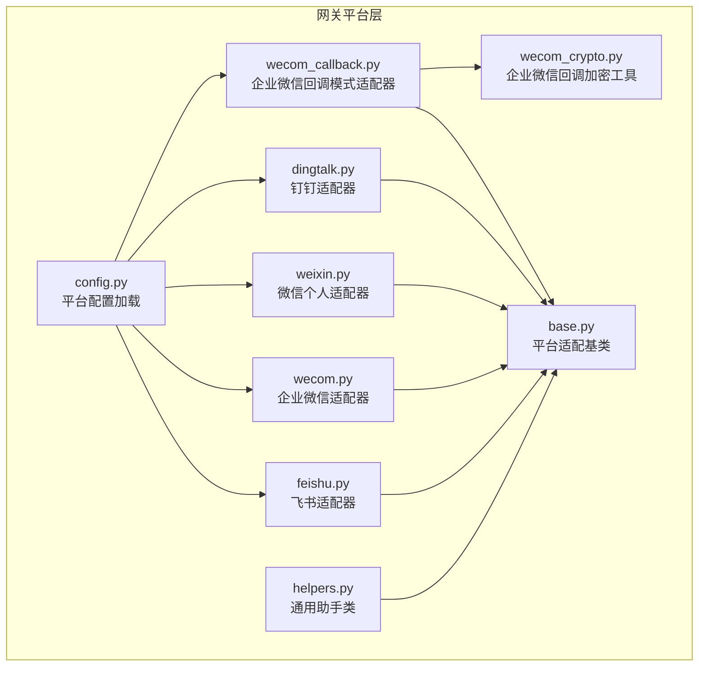
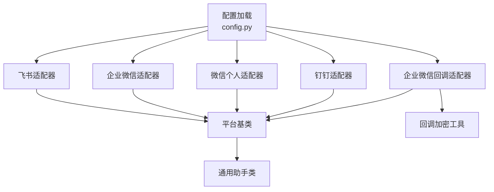
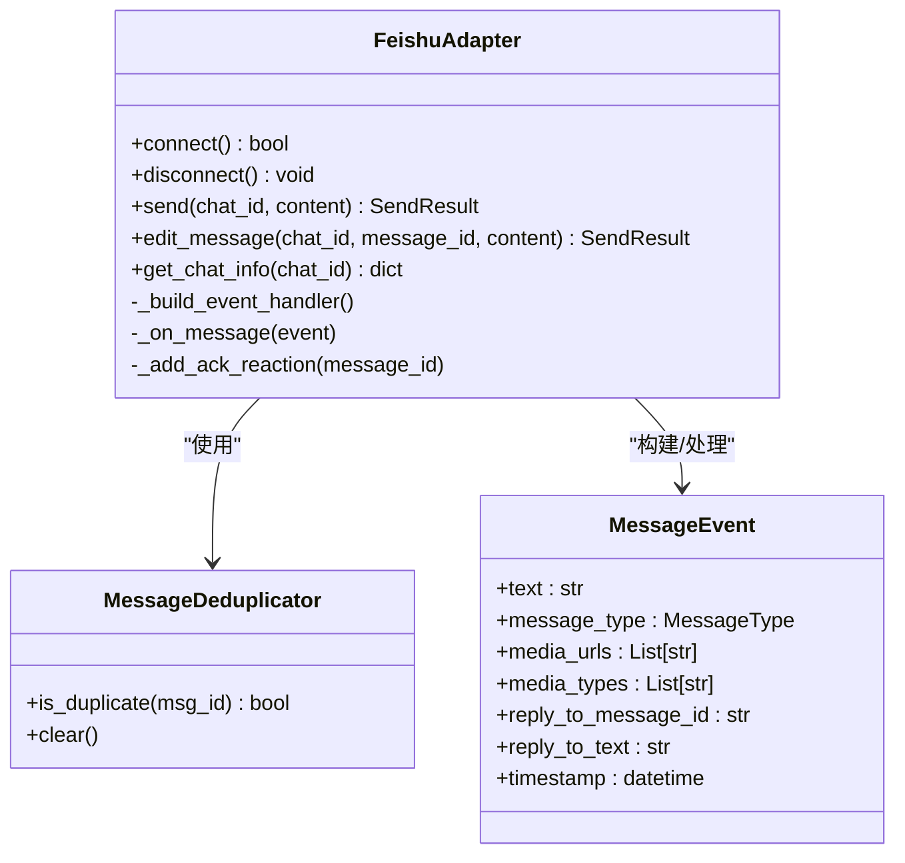
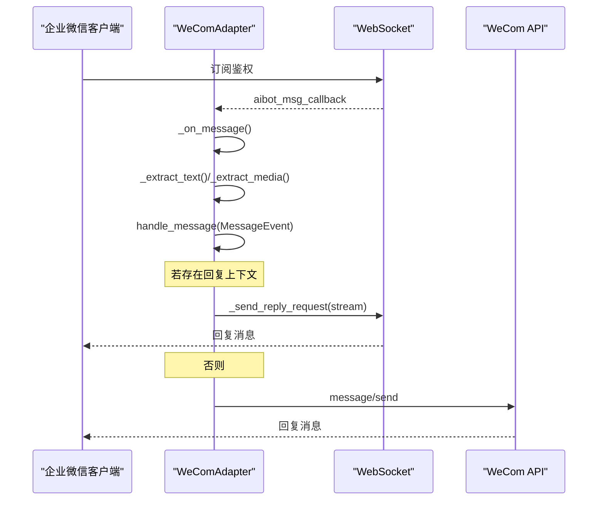
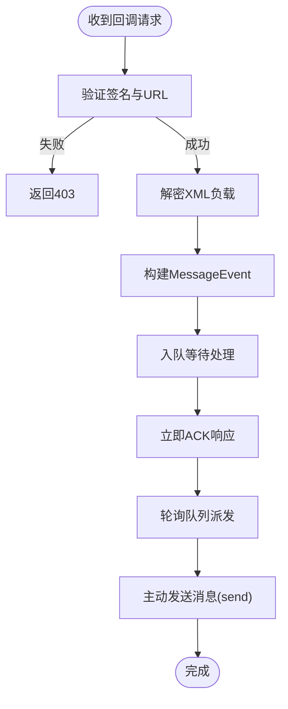
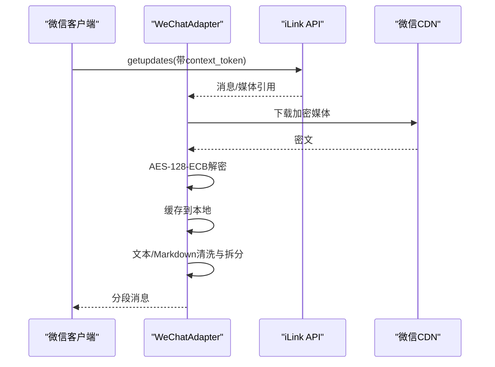
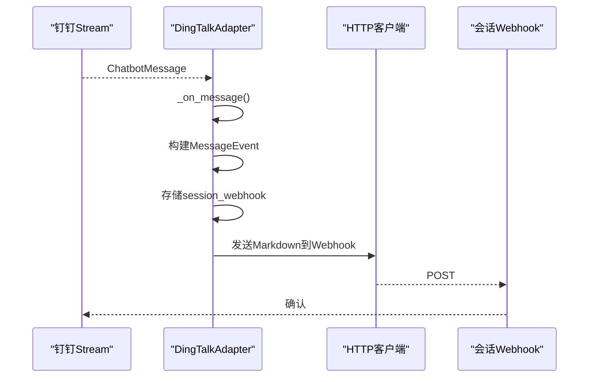
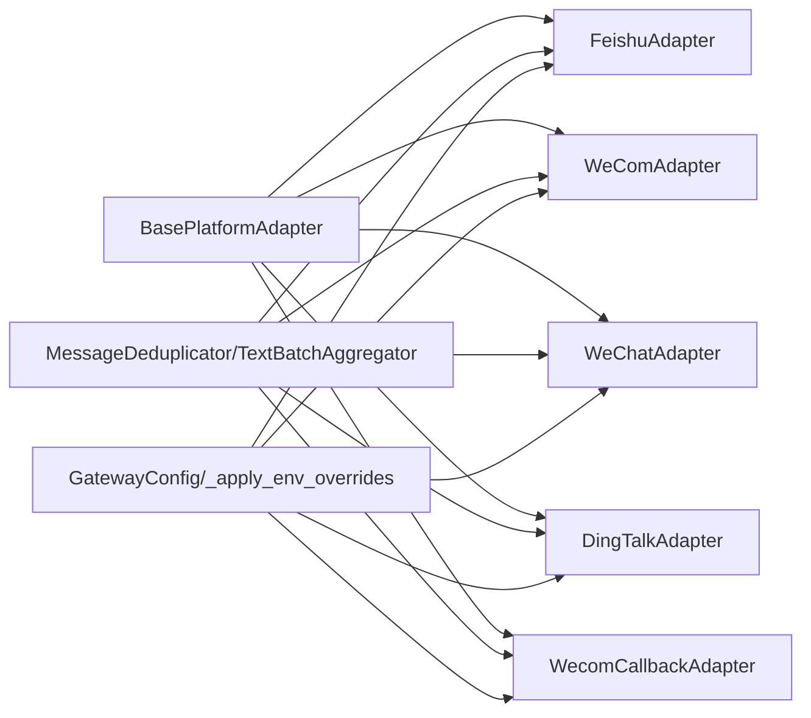

# 中文平台集成

<cite>
**本文档引用的文件**
- [feishu.py](file://gateway/platforms/feishu.py)
- [wecom.py](file://gateway/platforms/wecom.py)
- [weixin.py](file://gateway/platforms/weixin.py)
- [dingtalk.py](file://gateway/platforms/dingtalk.py)
- [wecom_callback.py](file://gateway/platforms/wecom_callback.py)
- [wecom_crypto.py](file://gateway/platforms/wecom_crypto.py)
- [helpers.py](file://gateway/platforms/helpers.py)
- [base.py](file://gateway/platforms/base.py)
- [config.py](file://gateway/config.py)
- [test_feishu.py](file://tests/gateway/test_feishu.py)
- [test_wecom.py](file://tests/gateway/test_wecom.py)
</cite>

## 目录
1. [简介](#简介)
2. [项目结构](#项目结构)
3. [核心组件](#核心组件)
4. [架构总览](#架构总览)
5. [详细组件分析](#详细组件分析)
6. [依赖关系分析](#依赖关系分析)
7. [性能考虑](#性能考虑)
8. [故障排除指南](#故障排除指南)
9. [结论](#结论)

## 简介
本文件面向中文地区企业级平台集成，系统性梳理飞书（Feishu）、企业微信（WeCom）、微信（WeChat Personal）与钉钉（DingTalk）在 Hermes Agent 中的适配实现。内容涵盖：
- 企业级认证机制与应用配置
- 权限管理与会话策略
- 中文平台特有能力（企业内部通讯录、组织架构、审批流程等）
- 企业级部署指南、安全加密与合规要求
- 回调验证、消息加解密与 API 调用最佳实践

## 项目结构
中文平台集成位于 gateway/platforms 目录下，采用“按平台分文件”的模块化设计，每个平台一个适配器文件，并共享基础抽象与通用工具。

**图表来源**
- [feishu.py:1-120](file://gateway/platforms/feishu.py#L1-L120)
- [wecom.py:1-120](file://gateway/platforms/wecom.py#L1-L120)
- [weixin.py:1-120](file://gateway/platforms/weixin.py#L1-L120)
- [dingtalk.py:1-120](file://gateway/platforms/dingtalk.py#L1-L120)
- [wecom_callback.py:1-120](file://gateway/platforms/wecom_callback.py#L1-L120)
- [wecom_crypto.py:1-120](file://gateway/platforms/wecom_crypto.py#L1-L120)
- [helpers.py:1-120](file://gateway/platforms/helpers.py#L1-L120)
- [base.py:779-880](file://gateway/platforms/base.py#L779-L880)
- [config.py:980-1126](file://gateway/config.py#L980-L1126)

**章节来源**
- [feishu.py:1-120](file://gateway/platforms/feishu.py#L1-L120)
- [wecom.py:1-120](file://gateway/platforms/wecom.py#L1-L120)
- [weixin.py:1-120](file://gateway/platforms/weixin.py#L1-L120)
- [dingtalk.py:1-120](file://gateway/platforms/dingtalk.py#L1-L120)
- [wecom_callback.py:1-120](file://gateway/platforms/wecom_callback.py#L1-L120)
- [wecom_crypto.py:1-120](file://gateway/platforms/wecom_crypto.py#L1-L120)
- [helpers.py:1-120](file://gateway/platforms/helpers.py#L1-L120)
- [base.py:779-880](file://gateway/platforms/base.py#L779-L880)
- [config.py:980-1126](file://gateway/config.py#L980-L1126)

## 核心组件
- 平台适配器基类：统一连接生命周期、消息收发、媒体处理与错误处理接口
- 通用助手类：消息去重、文本批聚合、Markdown 清洗、线程参与追踪
- 飞书适配器：支持 WebSocket/Webhook 双通道，富文本解析、卡片按钮事件、去重与 ACK
- 企业微信适配器：AI Bot WebSocket 模式，主动/被动回复、媒体上传、策略控制
- 企业微信回调模式适配器：自建应用回调，URL 验证、XML 解密、主动发送
- 微信个人适配器：iLink Bot API，长轮询、上下文令牌、AES-128-ECB 加密 CDN
- 钉钉适配器：Stream Mode 实时接收，会话 Webhook 回复，Markdown 发送

**章节来源**
- [base.py:779-880](file://gateway/platforms/base.py#L779-L880)
- [helpers.py:25-150](file://gateway/platforms/helpers.py#L25-L150)
- [feishu.py:1-120](file://gateway/platforms/feishu.py#L1-L120)
- [wecom.py:1-120](file://gateway/platforms/wecom.py#L1-L120)
- [wecom_callback.py:1-120](file://gateway/platforms/wecom_callback.py#L1-L120)
- [weixin.py:1-120](file://gateway/platforms/weixin.py#L1-L120)
- [dingtalk.py:1-120](file://gateway/platforms/dingtalk.py#L1-L120)

## 架构总览
中文平台集成遵循统一的适配器模式，通过配置驱动启用不同平台，平台间共享消息模型、缓存与去重能力。

**图表来源**
- [config.py:980-1126](file://gateway/config.py#L980-L1126)
- [feishu.py:1-120](file://gateway/platforms/feishu.py#L1-L120)
- [wecom.py:1-120](file://gateway/platforms/wecom.py#L1-L120)
- [weixin.py:1-120](file://gateway/platforms/weixin.py#L1-L120)
- [dingtalk.py:1-120](file://gateway/platforms/dingtalk.py#L1-L120)
- [wecom_callback.py:1-120](file://gateway/platforms/wecom_callback.py#L1-L120)
- [wecom_crypto.py:1-120](file://gateway/platforms/wecom_crypto.py#L1-L120)
- [helpers.py:1-120](file://gateway/platforms/helpers.py#L1-L120)
- [base.py:779-880](file://gateway/platforms/base.py#L779-L880)

## 详细组件分析

### 飞书（Feishu/Lark）适配器
- 连接模式：WebSocket 与 Webhook 双通道，支持回调验证与 URL 接入
- 富文本解析：post 内容多语言解析、@提及提取、图片/媒体键收集
- 交互卡片：按钮点击事件转为命令事件，支持去重与 ACK 表情
- 安全与合规：消息去重、速率限制、异常追踪、回调签名验证
- 企业特性：支持多租户、群组策略、管理员列表、允许用户白名单

**图表来源**
- [feishu.py:1-120](file://gateway/platforms/feishu.py#L1-L120)
- [helpers.py:25-150](file://gateway/platforms/helpers.py#L25-L150)
- [base.py:655-727](file://gateway/platforms/base.py#L655-L727)

**章节来源**
- [feishu.py:1-120](file://gateway/platforms/feishu.py#L1-L120)
- [feishu.py:433-470](file://gateway/platforms/feishu.py#L433-L470)
- [feishu.py:628-680](file://gateway/platforms/feishu.py#L628-L680)
- [feishu.py:176-187](file://gateway/platforms/feishu.py#L176-L187)
- [test_feishu.py:103-170](file://tests/gateway/test_feishu.py#L103-L170)
- [test_feishu.py:252-342](file://tests/gateway/test_feishu.py#L252-L342)

### 企业微信（WeCom）适配器
- 连接模式：AI Bot WebSocket，订阅鉴权、心跳、断线重连
- 主动/被动回复：带回复上下文时走被动流式回复，否则主动发送
- 媒体处理：分片上传、大小限制、类型降级（语音转文件）、远程下载与解密
- 策略控制：私聊/群聊策略、白名单/黑名单、分组细粒度规则
- 企业特性：支持多应用、会话 Webhook 路由、消息去重

**图表来源**
- [wecom.py:189-224](file://gateway/platforms/wecom.py#L189-L224)
- [wecom.py:375-400](file://gateway/platforms/wecom.py#L375-L400)
- [wecom.py:472-538](file://gateway/platforms/wecom.py#L472-L538)
- [wecom.py:177-184](file://gateway/platforms/wecom.py#L177-L184)

**章节来源**
- [wecom.py:1-120](file://gateway/platforms/wecom.py#L1-L120)
- [wecom.py:189-224](file://gateway/platforms/wecom.py#L189-L224)
- [wecom.py:472-538](file://gateway/platforms/wecom.py#L472-L538)
- [wecom.py:539-610](file://gateway/platforms/wecom.py#L539-L610)
- [test_wecom.py:120-173](file://tests/gateway/test_wecom.py#L120-L173)
- [test_wecom.py:425-503](file://tests/gateway/test_wecom.py#L425-L503)

### 企业微信回调模式适配器
- 回调接入：HTTP 服务器，GET URL 验证，POST 加密 XML 解密
- 主动发送：基于 access_token 的 message/send 接口
- 多应用支持：按 corp_id:user_id 映射应用，避免跨企业冲突
- 加密工具：兼容 WXBizMsgCrypt 的 AES-CBC 加解密与签名校验

**图表来源**
- [wecom_callback.py:229-277](file://gateway/platforms/wecom_callback.py#L229-L277)
- [wecom_callback.py:302-337](file://gateway/platforms/wecom_callback.py#L302-L337)
- [wecom_callback.py:178-210](file://gateway/platforms/wecom_callback.py#L178-L210)
- [wecom_crypto.py:66-125](file://gateway/platforms/wecom_crypto.py#L66-L125)

**章节来源**
- [wecom_callback.py:1-120](file://gateway/platforms/wecom_callback.py#L1-L120)
- [wecom_callback.py:229-277](file://gateway/platforms/wecom_callback.py#L229-L277)
- [wecom_callback.py:302-337](file://gateway/platforms/wecom_callback.py#L302-L337)
- [wecom_crypto.py:66-125](file://gateway/platforms/wecom_crypto.py#L66-L125)

### 微信（WeChat Personal）适配器
- 接入方式：iLink Bot API，长轮询 getupdates 驱动
- 上下文令牌：必须回显最新 context_token，确保消息连续性
- 媒体传输：CDN 加密协议（AES-128-ECB），下载后解密写入本地缓存
- 交付优化：Markdown 规则转换、短消息拆分、表格/标题格式化

**图表来源**
- [weixin.py:371-422](file://gateway/platforms/weixin.py#L371-L422)
- [weixin.py:540-562](file://gateway/platforms/weixin.py#L540-L562)
- [weixin.py:702-739](file://gateway/platforms/weixin.py#L702-L739)

**章节来源**
- [weixin.py:1-120](file://gateway/platforms/weixin.py#L1-L120)
- [weixin.py:371-422](file://gateway/platforms/weixin.py#L371-L422)
- [weixin.py:540-562](file://gateway/platforms/weixin.py#L540-L562)
- [weixin.py:702-739](file://gateway/platforms/weixin.py#L702-L739)

### 钉钉（DingTalk）适配器
- 连接模式：dingtalk-stream SDK 维护长连接，实时接收消息
- 回复方式：通过会话 Webhook（session_webhook）发送 Markdown
- 会话路由：按 chat_id 缓存 session_webhook，限制最大数量防止内存增长
- 错误处理：自动重连、超时保护、不可达目标防护

**图表来源**
- [dingtalk.py:131-174](file://gateway/platforms/dingtalk.py#L131-L174)
- [dingtalk.py:177-239](file://gateway/platforms/dingtalk.py#L177-L239)
- [dingtalk.py:260-295](file://gateway/platforms/dingtalk.py#L260-L295)

**章节来源**
- [dingtalk.py:1-120](file://gateway/platforms/dingtalk.py#L1-L120)
- [dingtalk.py:131-174](file://gateway/platforms/dingtalk.py#L131-L174)
- [dingtalk.py:177-239](file://gateway/platforms/dingtalk.py#L177-L239)
- [dingtalk.py:260-295](file://gateway/platforms/dingtalk.py#L260-L295)

## 依赖关系分析
- 平台适配器均继承自 BasePlatformAdapter，统一消息模型、发送结果、媒体缓存与去重
- 通用助手类被多个平台复用，降低重复代码与提升一致性
- 配置模块集中从环境变量加载平台参数，支持飞书、企业微信、微信个人、钉钉与企业微信回调

**图表来源**
- [base.py:779-880](file://gateway/platforms/base.py#L779-L880)
- [helpers.py:25-150](file://gateway/platforms/helpers.py#L25-L150)
- [config.py:980-1126](file://gateway/config.py#L980-L1126)

**章节来源**
- [base.py:779-880](file://gateway/platforms/base.py#L779-L880)
- [helpers.py:25-150](file://gateway/platforms/helpers.py#L25-L150)
- [config.py:980-1126](file://gateway/config.py#L980-L1126)

## 性能考虑
- 文本批聚合：针对快速连续文本消息进行合并，减少平台端拆分带来的多次渲染
- 媒体缓存：图片/音频/文档本地缓存，避免上游 URL 过期与网络抖动影响
- 去重与限流：基于 TTL 的消息去重与回调速率限制，防止重复与过载
- 异步 I/O：WebSocket/HTTP 客户端异步化，配合事件循环提高吞吐
- 重连退避：断线重连采用指数退避，降低瞬时风暴

[本节为通用指导，无需具体文件分析]

## 故障排除指南
- 飞书
  - 应用锁冲突：若已有实例占用 app_id，将触发致命错误并拒绝启动
  - WebSocket 临时失败：自动重试一次，确认网络与凭证
  - 富文本更新失败：自动回退为纯文本更新
  - 参考测试用例覆盖上述场景

- 企业微信
  - 缺少依赖或凭证：连接前检查 aiohttp/httpx 与 bot_id/secret
  - 认证失败：握手阶段返回错误码需核对 secret
  - 媒体上传失败：检查大小限制与类型降级逻辑
  - 回调模式：URL 验证失败返回 403；解密失败尝试其他应用配置

- 微信个人
  - CDN 下载失败：检查 AES 密钥与加密参数
  - 上下文令牌缺失：必须在回复中携带最新 context_token
  - Markdown 转换异常：关注标题/表格/代码块格式化规则

- 钉钉
  - 会话 Webhook 未就绪：需等待首次消息到达以建立路由
  - 自动重连：观察日志中的重连延迟与次数

**章节来源**
- [test_feishu.py:295-367](file://tests/gateway/test_feishu.py#L295-L367)
- [test_feishu.py:422-506](file://tests/gateway/test_feishu.py#L422-L506)
- [test_wecom.py:72-118](file://tests/gateway/test_wecom.py#L72-L118)
- [test_wecom.py:120-173](file://tests/gateway/test_wecom.py#L120-L173)
- [wecom_callback.py:232-277](file://gateway/platforms/wecom_callback.py#L232-L277)
- [wecom_crypto.py:84-112](file://gateway/platforms/wecom_crypto.py#L84-L112)
- [weixin.py:371-422](file://gateway/platforms/weixin.py#L371-L422)

## 结论
本集成方案通过统一的适配器基类与通用助手类，实现了飞书、企业微信、微信个人与钉钉在企业级场景下的稳定接入。平台特性包括：
- 企业级认证与权限控制（白名单/黑名单、分组策略）
- 丰富的消息形态与媒体处理（富文本、卡片、图片/音视频/文件）
- 安全与合规（回调签名、消息去重、SSRF 防护、CDN 加密）
- 企业特性扩展（回调模式、会话 Webhook、上下文令牌）

建议在生产部署中结合企业内网代理、证书与密钥管理策略，严格遵循平台 API 限额与合规要求，持续监控回调异常与重连行为，确保高可用与可审计。