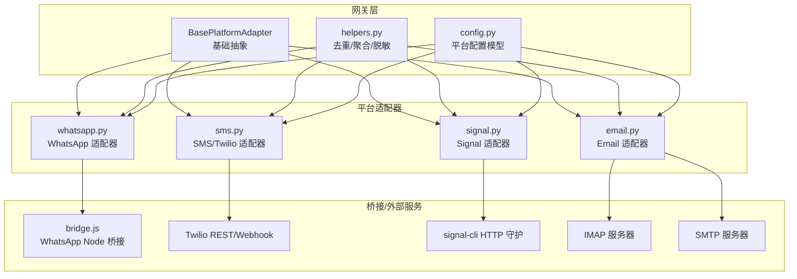
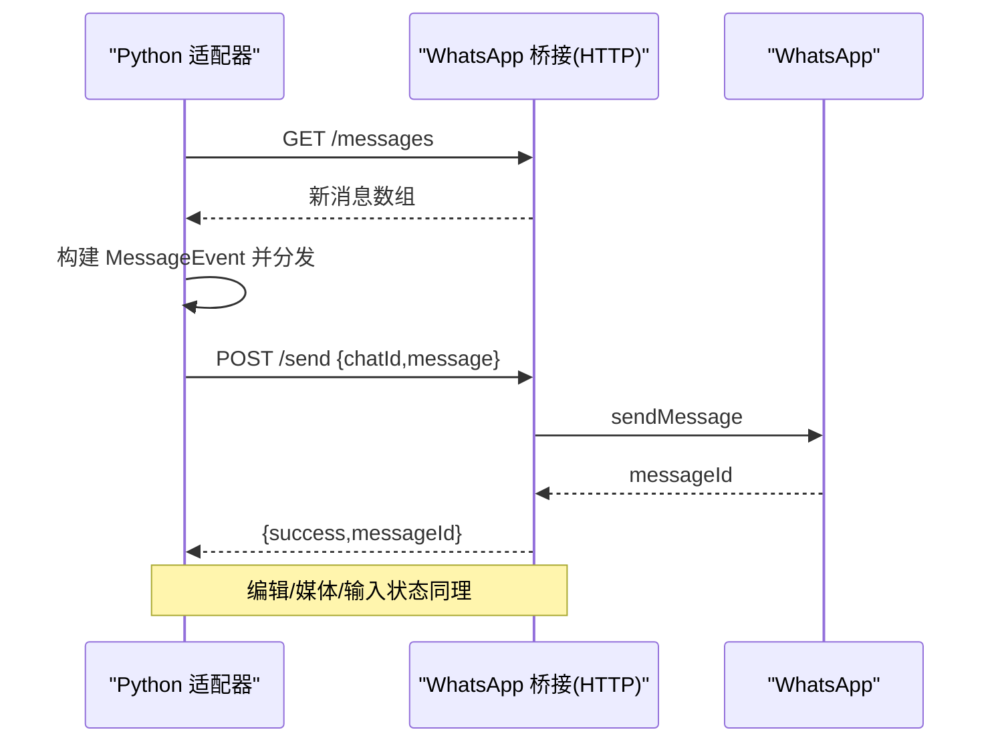
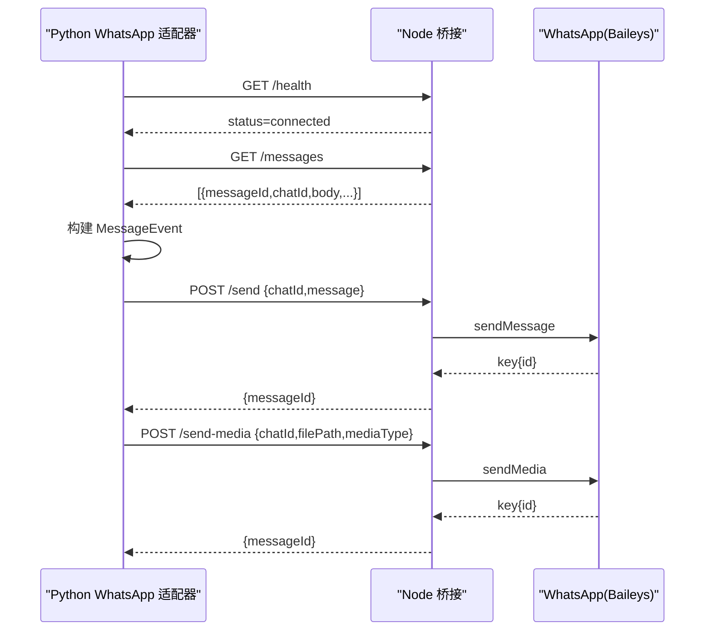
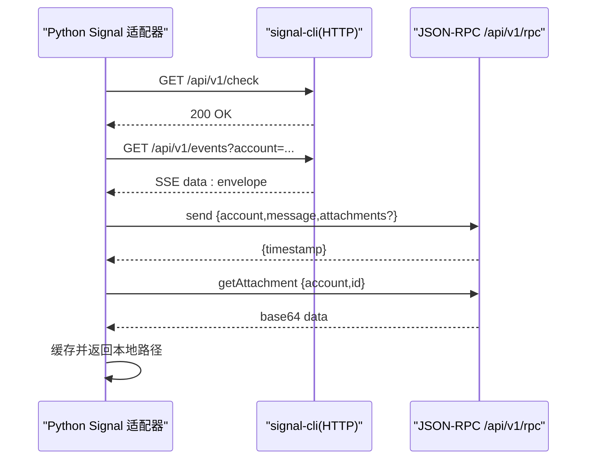
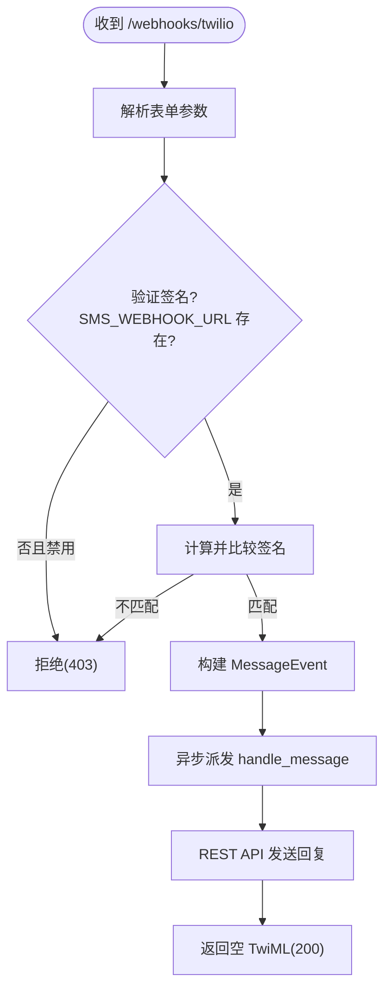
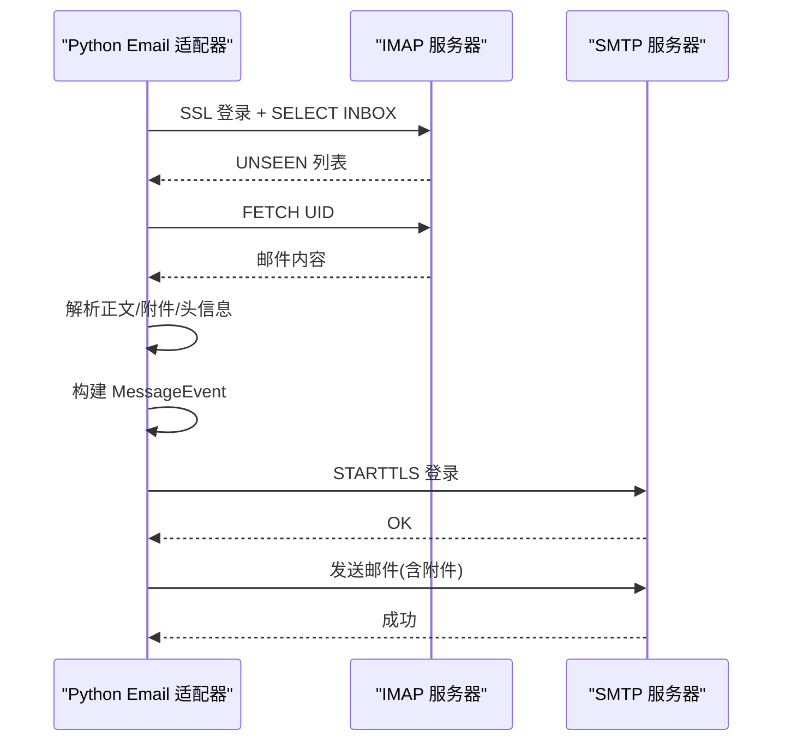
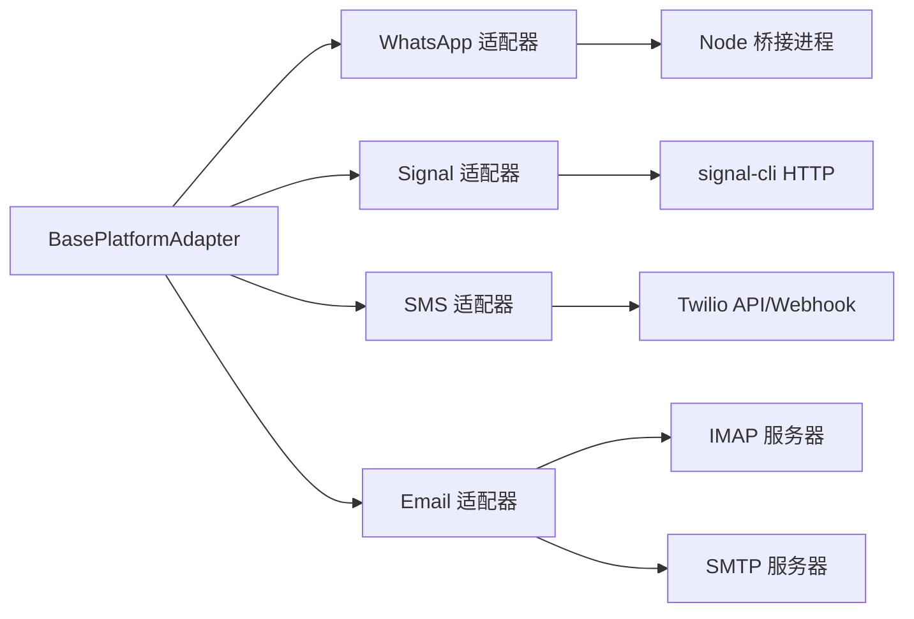

# 即时通讯平台

<cite>
**本文引用的文件**
- [gateway/platforms/whatsapp.py](file://gateway/platforms/whatsapp.py)
- [gateway/platforms/signal.py](file://gateway/platforms/signal.py)
- [gateway/platforms/sms.py](file://gateway/platforms/sms.py)
- [gateway/platforms/email.py](file://gateway/platforms/email.py)
- [gateway/platforms/base.py](file://gateway/platforms/base.py)
- [gateway/platforms/helpers.py](file://gateway/platforms/helpers.py)
- [gateway/config.py](file://gateway/config.py)
- [scripts/whatsapp-bridge/bridge.js](file://scripts/whatsapp-bridge/bridge.js)
- [scripts/whatsapp-bridge/package.json](file://scripts/whatsapp-bridge/package.json)
</cite>

## 目录
1. [简介](#简介)
2. [项目结构](#项目结构)
3. [核心组件](#核心组件)
4. [架构总览](#架构总览)
5. [详细组件分析](#详细组件分析)
6. [依赖分析](#依赖分析)
7. [性能考虑](#性能考虑)
8. [故障排查指南](#故障排查指南)
9. [结论](#结论)
10. [附录](#附录)

## 简介
本文件面向即时通讯平台集成，系统性梳理并说明以下平台的实现与使用：  
- WhatsApp Business API（通过 Baileys 的本地桥接）  
- Signal（基于 signal-cli 守护进程的 HTTP 接口）  
- SMS（Twilio REST API + Webhook 验签）  
- Email（IMAP 收信 + SMTP 发信）

内容覆盖认证机制、消息格式规范、传输协议、消息状态回调、多媒体处理、联系人/群组信息、Webhook 设置、错误处理策略、速率限制与合规要求等。

## 项目结构
- 平台适配器位于 gateway/platforms 下，每个平台一个文件，统一继承自基础适配器基类，实现连接、收发、媒体处理等能力。
- WhatsApp 使用 Node.js 桥接进程，Python 侧通过 HTTP 调用桥接端点；桥接脚本位于 scripts/whatsapp-bridge。
- 基础设施与通用工具位于 gateway/platforms/base.py 与 helpers.py。
- 配置模型位于 gateway/config.py，支持多平台配置合并与环境变量覆盖。

图表来源
- [gateway/platforms/base.py:779-1200](file://gateway/platforms/base.py#L779-L1200)
- [gateway/platforms/whatsapp.py:103-533](file://gateway/platforms/whatsapp.py#L103-L533)
- [gateway/platforms/signal.py:140-247](file://gateway/platforms/signal.py#L140-L247)
- [gateway/platforms/sms.py:56-147](file://gateway/platforms/sms.py#L56-L147)
- [gateway/platforms/email.py:221-319](file://gateway/platforms/email.py#L221-L319)
- [scripts/whatsapp-bridge/bridge.js:1-571](file://scripts/whatsapp-bridge/bridge.js#L1-L571)

章节来源
- [gateway/platforms/base.py:779-1200](file://gateway/platforms/base.py#L779-L1200)
- [gateway/platforms/whatsapp.py:103-533](file://gateway/platforms/whatsapp.py#L103-L533)
- [gateway/platforms/signal.py:140-247](file://gateway/platforms/signal.py#L140-L247)
- [gateway/platforms/sms.py:56-147](file://gateway/platforms/sms.py#L56-L147)
- [gateway/platforms/email.py:221-319](file://gateway/platforms/email.py#L221-L319)
- [gateway/platforms/helpers.py:1-262](file://gateway/platforms/helpers.py#L1-L262)
- [gateway/config.py:48-430](file://gateway/config.py#L48-L430)
- [scripts/whatsapp-bridge/bridge.js:1-571](file://scripts/whatsapp-bridge/bridge.js#L1-L571)

## 核心组件
- 基类 BasePlatformAdapter：定义统一接口（connect/disconnect/send/edit_message/send_typing 等）、消息事件模型 MessageEvent、发送结果 SendResult、媒体缓存工具与去重/聚合/脱敏等通用能力。
- 平台适配器：分别实现各平台的认证、消息收发、媒体下载/上传、会话/线程上下文维护、错误处理与健康检查。
- 配置模型：GatewayConfig/PlatformConfig/StreamingConfig 等，支持从 YAML/环境变量加载与校验。
- 辅助模块：helpers 提供消息去重、文本聚合、Markdown 脱敏、线程参与跟踪、电话号码脱敏等。

章节来源
- [gateway/platforms/base.py:634-727](file://gateway/platforms/base.py#L634-L727)
- [gateway/platforms/base.py:779-1200](file://gateway/platforms/base.py#L779-L1200)
- [gateway/platforms/helpers.py:25-262](file://gateway/platforms/helpers.py#L25-L262)
- [gateway/config.py:142-187](file://gateway/config.py#L142-L187)

## 架构总览
- 适配器模式：所有平台适配器均继承自 BasePlatformAdapter，统一对外暴露 send/handle_message 等接口。
- 传输协议：
  - WhatsApp：Python 适配器通过 HTTP 调用 Node 桥接进程提供的 /messages、/send、/edit、/send-media、/typing、/chat/:id、/health 等端点。
  - Signal：HTTP 守护进程提供 /api/v1/events（SSE）与 /api/v1/rpc（JSON-RPC），Python 适配器负责监听与 RPC 调用。
  - SMS：Python 适配器启动 aiohttp Web 应用监听 /webhooks/twilio，Twilio 以表单数据 POST 回调；同时使用 Twilio REST API 发送短信。
  - Email：Python 适配器轮询 IMAP 收件箱，解析邮件并构建 MessageEvent；通过 SMTP 发送回复。
- 多媒体缓存：图片/音频/文档统一落地到本地缓存目录，便于后续工具链处理。

图表来源
- [gateway/platforms/whatsapp.py:534-575](file://gateway/platforms/whatsapp.py#L534-L575)
- [scripts/whatsapp-bridge/bridge.js:367-419](file://scripts/whatsapp-bridge/bridge.js#L367-L419)

## 详细组件分析

### WhatsApp Business API/个人账号（Baileys 桥接）
- 认证与连接
  - Python 适配器启动 Node 桥接进程，监听本地端口；通过 /health 检查连接状态。
  - 支持 WHATSAPP_MODE（self-chat/bot）与允许用户白名单过滤。
- 消息收发
  - 轮询 /messages 获取新消息；支持编辑已发消息（/edit）与原生发送媒体（/send-media）。
  - 输入状态：/typing；聊天信息：/chat/:id。
- 多媒体处理
  - 自动下载图片/视频/音频/文档至本地缓存目录，返回本地路径供后续处理。
- 会话与安全
  - 会话锁防止重复实例；支持会话目录与二维码登录；支持允许用户白名单。
- 配置项
  - bridge_script、bridge_port、session_path、reply_prefix、mention_patterns、require_mention、free_response_chats 等。

图表来源
- [gateway/platforms/whatsapp.py:273-451](file://gateway/platforms/whatsapp.py#L273-L451)
- [gateway/platforms/whatsapp.py:534-706](file://gateway/platforms/whatsapp.py#L534-L706)
- [scripts/whatsapp-bridge/bridge.js:367-498](file://scripts/whatsapp-bridge/bridge.js#L367-L498)

章节来源
- [gateway/platforms/whatsapp.py:103-533](file://gateway/platforms/whatsapp.py#L103-L533)
- [gateway/platforms/whatsapp.py:534-806](file://gateway/platforms/whatsapp.py#L534-L806)
- [scripts/whatsapp-bridge/bridge.js:1-571](file://scripts/whatsapp-bridge/bridge.js#L1-L571)
- [scripts/whatsapp-bridge/package.json:1-17](file://scripts/whatsapp-bridge/package.json#L1-L17)

### Signal（signal-cli）
- 认证与连接
  - 依赖 signal-cli 守护进程以 HTTP 模式运行（--http），Python 适配器通过 /api/v1/check 健康检查。
- 消息收发
  - SSE 流式接收事件（/api/v1/events?account=...），解析 envelope，提取文本与附件。
  - JSON-RPC 2.0 通过 /api/v1/rpc 发送消息、图片、语音等。
- 多媒体处理
  - 通过 RPC getAttachment 获取二进制内容，按扩展名推断 MIME 类型并缓存到本地。
- 会话与安全
  - 支持忽略故事消息；支持组消息白名单（SIGNAL_GROUP_ALLOWED_USERS）；自对话防环回（基于时间戳）。
- 配置项
  - http_url、account、ignore_stories、组策略等。

图表来源
- [gateway/platforms/signal.py:184-215](file://gateway/platforms/signal.py#L184-L215)
- [gateway/platforms/signal.py:252-316](file://gateway/platforms/signal.py#L252-L316)
- [gateway/platforms/signal.py:552-586](file://gateway/platforms/signal.py#L552-L586)
- [gateway/platforms/signal.py:589-778](file://gateway/platforms/signal.py#L589-L778)

章节来源
- [gateway/platforms/signal.py:140-247](file://gateway/platforms/signal.py#L140-L247)
- [gateway/platforms/signal.py:252-356](file://gateway/platforms/signal.py#L252-L356)
- [gateway/platforms/signal.py:552-778](file://gateway/platforms/signal.py#L552-L778)

### SMS（Twilio）
- 认证与连接
  - 使用 TWILIO_ACCOUNT_SID/TWILIO_AUTH_TOKEN 进行 Basic 认证；启动 aiohttp Web 应用监听 /webhooks/twilio。
- 消息收发
  - 发送：Twilio REST API /2010-04-01/Accounts/{sid}/Messages.json。
  - 接收：Twilio 以表单数据 POST 到 /webhooks/twilio，Python 适配器进行签名验证后解析。
- 多媒体处理
  - 仅文本；通过 Twilio 分段发送（长度截断）。
- 安全与合规
  - 支持 SMS_WEBHOOK_URL 与 X-Twilio-Signature 验证；开发可临时开启 SMS_INSECURE_NO_SIGNATURE（不建议生产使用）。
- 配置项
  - TWILIO_ACCOUNT_SID/TWILIO_AUTH_TOKEN/TWILIO_PHONE_NUMBER、SMS_WEBHOOK_PORT/HOST/URL、SMS_ALLOWED_USERS、SMS_ALLOW_ALL_USERS 等。

图表来源
- [gateway/platforms/sms.py:286-374](file://gateway/platforms/sms.py#L286-L374)
- [gateway/platforms/sms.py:218-281](file://gateway/platforms/sms.py#L218-L281)

章节来源
- [gateway/platforms/sms.py:56-147](file://gateway/platforms/sms.py#L56-L147)
- [gateway/platforms/sms.py:148-201](file://gateway/platforms/sms.py#L148-L201)
- [gateway/platforms/sms.py:218-374](file://gateway/platforms/sms.py#L218-L374)

### Email（IMAP/SMTP）
- 认证与连接
  - IMAP：SSL 登录测试；SMTP：STARTTLS 登录测试。
- 消息收发
  - 轮询：定时执行 IMAP 搜索 UNSEEN，拉取并解析邮件，构建 MessageEvent。
  - 发送：通过 SMTP 发送带附件或纯文本的邮件；自动维护线程上下文（In-Reply-To/References）。
- 多媒体处理
  - 解析内联图片与附件，缓存到本地并返回路径；HTML 转纯文本。
- 安全与合规
  - 自动跳过自动化/批量邮件头；支持跳过附件（保护带宽/安全）。
- 配置项
  - EMAIL_IMAP/SMTP_HOST/PORT、EMAIL_ADDRESS/PASSWORD、EMAIL_POLL_INTERVAL、EMAIL_ALLOWED_USERS 等。

图表来源
- [gateway/platforms/email.py:272-306](file://gateway/platforms/email.py#L272-L306)
- [gateway/platforms/email.py:339-403](file://gateway/platforms/email.py#L339-L403)
- [gateway/platforms/email.py:465-524](file://gateway/platforms/email.py#L465-L524)

章节来源
- [gateway/platforms/email.py:221-319](file://gateway/platforms/email.py#L221-L319)
- [gateway/platforms/email.py:320-464](file://gateway/platforms/email.py#L320-L464)
- [gateway/platforms/email.py:465-626](file://gateway/platforms/email.py#L465-L626)

## 依赖分析
- 组件耦合
  - 各平台适配器强依赖 BasePlatformAdapter 的统一接口与消息事件模型。
  - WhatsApp 适配器与 Node 桥接进程存在进程级耦合，需注意进程生命周期与健康检查。
  - Signal 适配器依赖 signal-cli 守护进程与网络可达性。
  - SMS 适配器依赖 Twilio 公网可达性与正确的 Webhook URL 配置。
  - Email 适配器依赖 IMAP/SMTP 服务器可用性与凭据正确性。
- 外部依赖
  - WhatsApp：Node.js、@whiskeysockets/baileys、express、qrcode-terminal、pino。
  - Signal：signal-cli（HTTP 模式）。
  - SMS：aiohttp、Twilio REST API。
  - Email：标准 IMAP/SMTP 协议栈。

图表来源
- [gateway/platforms/whatsapp.py:103-148](file://gateway/platforms/whatsapp.py#L103-L148)
- [gateway/platforms/signal.py:140-178](file://gateway/platforms/signal.py#L140-L178)
- [gateway/platforms/sms.py:56-78](file://gateway/platforms/sms.py#L56-L78)
- [gateway/platforms/email.py:221-241](file://gateway/platforms/email.py#L221-L241)
- [scripts/whatsapp-bridge/package.json:10-15](file://scripts/whatsapp-bridge/package.json#L10-L15)

章节来源
- [gateway/platforms/whatsapp.py:103-148](file://gateway/platforms/whatsapp.py#L103-L148)
- [gateway/platforms/signal.py:140-178](file://gateway/platforms/signal.py#L140-L178)
- [gateway/platforms/sms.py:56-78](file://gateway/platforms/sms.py#L56-L78)
- [gateway/platforms/email.py:221-241](file://gateway/platforms/email.py#L221-L241)
- [scripts/whatsapp-bridge/package.json:10-15](file://scripts/whatsapp-bridge/package.json#L10-L15)

## 性能考虑
- 轮询与长连接
  - WhatsApp：轮询 /messages，避免长连接复杂度；注意队列长度与内存占用。
  - Signal：SSE 流 + 健康监控，自动重连与保活；注意连接抖动与重试退避。
  - SMS：Webhook 异步派发，避免阻塞；REST 发送采用连接池复用。
  - Email：定时轮询，注意 IMAP/SMTP 连接复用与超时控制。
- 媒体缓存
  - 图片/音频/文档统一缓存，定期清理过期文件；注意磁盘空间与并发写入。
- 文本批处理
  - helpers.TextBatchAggregator 可聚合快速文本事件，减少平台压力。
- 速率限制与重试
  - 基类对可重试错误有统一识别；平台适配器应结合自身 API 限流策略进行退避与熔断。

[本节为通用指导，无需特定文件引用]

## 故障排查指南
- 通用
  - 查看适配器运行状态与致命错误码（fatal_error_*）；确认平台锁未被占用。
  - 检查日志输出（桥接进程日志、信号守护日志、Webhook 请求日志）。
- WhatsApp
  - 确认 Node.js 与依赖安装；检查桥接进程是否在运行与端口占用；查看 /health 状态与队列长度。
  - 若出现“代理重启”（code 515），桥接会自动重连；若长时间未连接，检查网络与二维码登录流程。
- Signal
  - 确认 signal-cli 已以 HTTP 模式启动；检查 /api/v1/check 是否 200；SSE 断开时健康监控会触发强制重连。
  - 附件过大（>100MB）会被丢弃；注意 MIME 类型推断与缓存目录权限。
- SMS
  - 必须配置 SMS_WEBHOOK_URL 用于签名验证；生产环境禁止启用 SMS_INSECURE_NO_SIGNATURE。
  - TwiML 返回空 XML；错误响应会记录状态码与错误信息。
- Email
  - IMAP/SMTP 登录失败时会直接报错；检查 SSL/TLS 与端口；注意自动化邮件头过滤与附件跳过选项。

章节来源
- [gateway/platforms/base.py:835-871](file://gateway/platforms/base.py#L835-L871)
- [gateway/platforms/whatsapp.py:322-451](file://gateway/platforms/whatsapp.py#L322-L451)
- [gateway/platforms/signal.py:321-346](file://gateway/platforms/signal.py#L321-L346)
- [gateway/platforms/sms.py:98-116](file://gateway/platforms/sms.py#L98-L116)
- [gateway/platforms/email.py:272-306](file://gateway/platforms/email.py#L272-L306)

## 结论
本项目通过统一的适配器基类与平台特定实现，提供了对 WhatsApp、Signal、SMS、Email 的标准化接入。关键在于：
- 明确各平台的认证与传输协议（HTTP/SSE/REST/Webhook/IMAP/SMTP）；
- 规范消息格式与多媒体处理流程；
- 建立完善的错误处理与健康监控；
- 在配置层面提供灵活的环境变量与 YAML 合并机制。

[本节为总结，无需特定文件引用]

## 附录

### API 密钥与配置要点
- WhatsApp
  - 环境变量：WHATSAPP_MODE、WHATSAPP_ALLOWED_USERS、WHATSAPP_REPLY_PREFIX、WHATSAPP_REQUIRE_MENTION、WHATSAPP_MENTION_PATTERNS、WHATSAPP_FREE_RESPONSE_CHATS。
  - 配置项：bridge_script、bridge_port、session_path、extra 中的策略字段。
- Signal
  - 环境变量：SIGNAL_HTTP_URL、SIGNAL_ACCOUNT、SIGNAL_GROUP_ALLOWED_USERS、SIGNAL_GROUP_IGNORE_STORIES。
  - 配置项：http_url、account、ignore_stories、extra。
- SMS
  - 环境变量：TWILIO_ACCOUNT_SID、TWILIO_AUTH_TOKEN、TWILIO_PHONE_NUMBER、SMS_WEBHOOK_PORT/HOST/URL、SMS_INSECURE_NO_SIGNATURE、SMS_ALLOWED_USERS、SMS_ALLOW_ALL_USERS、SMS_HOME_CHANNEL。
- Email
  - 环境变量：EMAIL_IMAP_HOST/PORT、EMAIL_SMTP_HOST/PORT、EMAIL_ADDRESS、EMAIL_PASSWORD、EMAIL_POLL_INTERVAL、EMAIL_ALLOWED_USERS、EMAIL_SKIP_ATTACHMENTS。

章节来源
- [gateway/config.py:48-430](file://gateway/config.py#L48-L430)
- [gateway/platforms/whatsapp.py:129-141](file://gateway/platforms/whatsapp.py#L129-L141)
- [gateway/platforms/signal.py:145-151](file://gateway/platforms/signal.py#L145-L151)
- [gateway/platforms/sms.py:66-76](file://gateway/platforms/sms.py#L66-L76)
- [gateway/platforms/email.py:227-233](file://gateway/platforms/email.py#L227-L233)

### Webhook 设置与签名验证
- SMS
  - Webhook 路由：/webhooks/twilio；请求体为表单编码；必须配置 SMS_WEBHOOK_URL 以启用签名验证；X-Twilio-Signature 头必须存在且匹配。
- Signal
  - 无需 Webhook；通过 SSE 事件流推送。
- WhatsApp
  - 无需 Webhook；通过 HTTP 桥接轮询消息。
- Email
  - 无需 Webhook；通过 IMAP 轮询。

章节来源
- [gateway/platforms/sms.py:117-136](file://gateway/platforms/sms.py#L117-L136)
- [gateway/platforms/sms.py:286-374](file://gateway/platforms/sms.py#L286-L374)
- [gateway/platforms/signal.py:252-316](file://gateway/platforms/signal.py#L252-L316)
- [gateway/platforms/whatsapp.py:534-575](file://gateway/platforms/whatsapp.py#L534-L575)

### 速率限制与合规要求
- WhatsApp
  - 通过 Baileys 与官方协议交互；遵循 Baileys 版本与 WhatsApp 服务端行为；注意会话与二维码登录流程。
- Signal
  - 依赖 signal-cli 的速率与大小限制；附件最大 100MB；注意 MIME 类型与扩展名映射。
- SMS
  - Twilio REST API 有速率限制与配额；Webhook 回调需签名验证；生产环境必须启用签名验证。
- Email
  - 依赖 IMAP/SMTP 服务器策略；注意自动化邮件头过滤与附件大小限制。

章节来源
- [gateway/platforms/signal.py:47-53](file://gateway/platforms/signal.py#L47-L53)
- [gateway/platforms/sms.py:41-44](file://gateway/platforms/sms.py#L41-L44)
- [gateway/platforms/email.py:62-65](file://gateway/platforms/email.py#L62-L65)