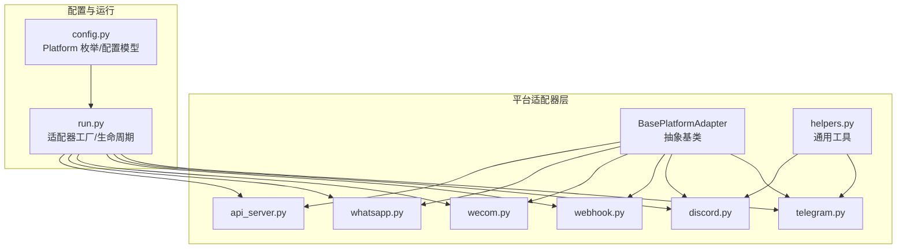
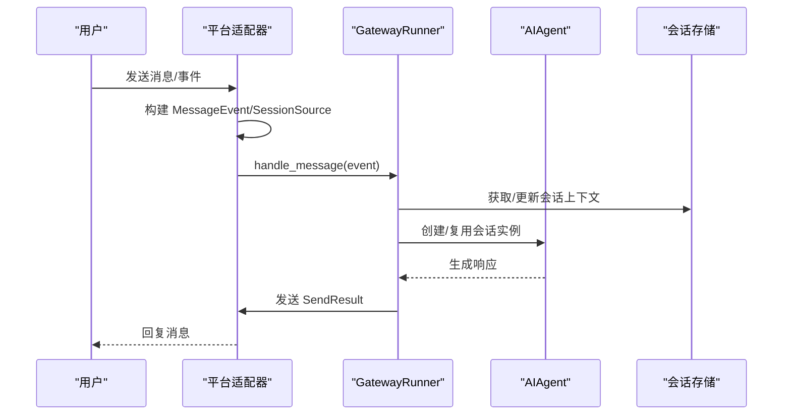
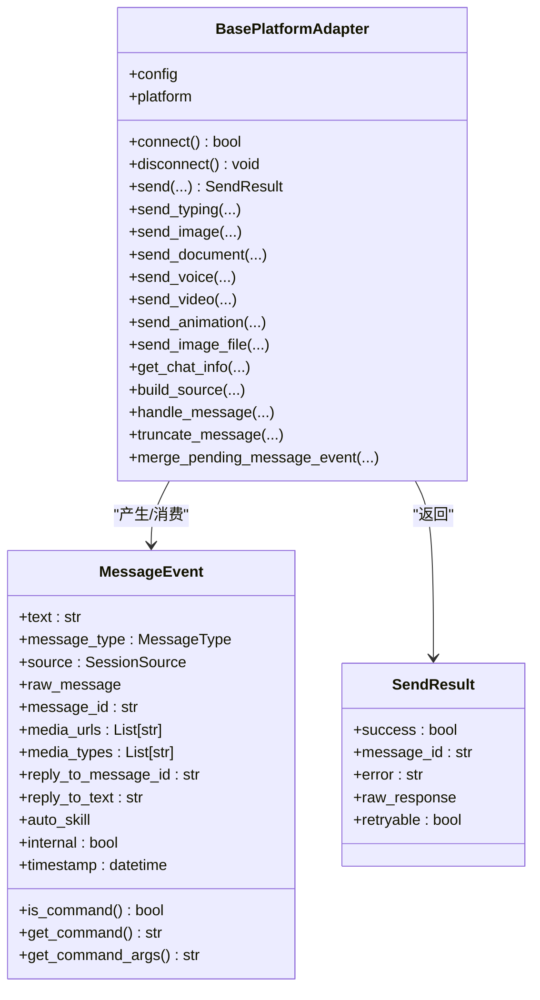
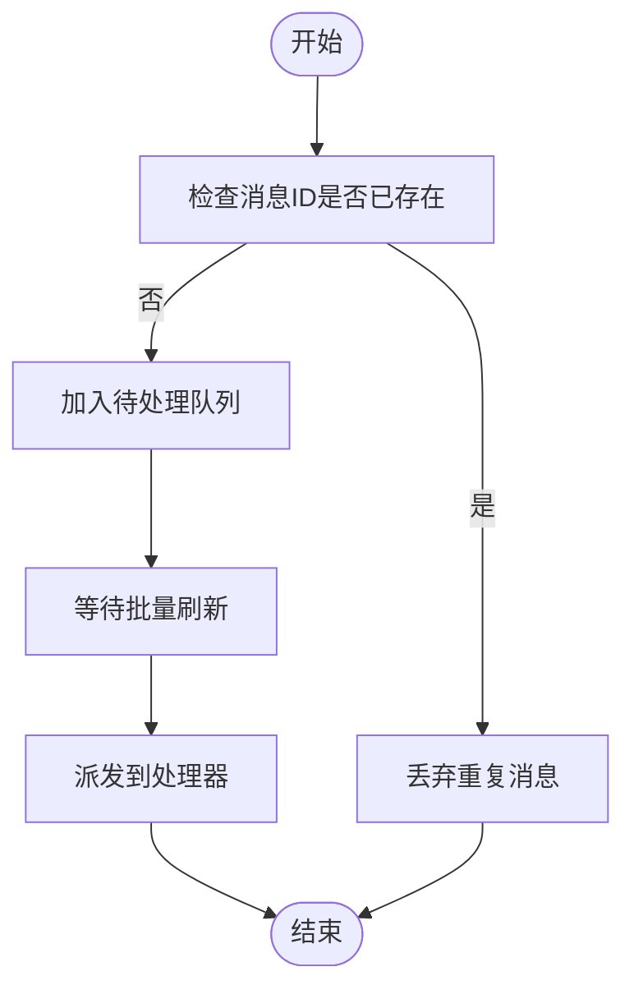
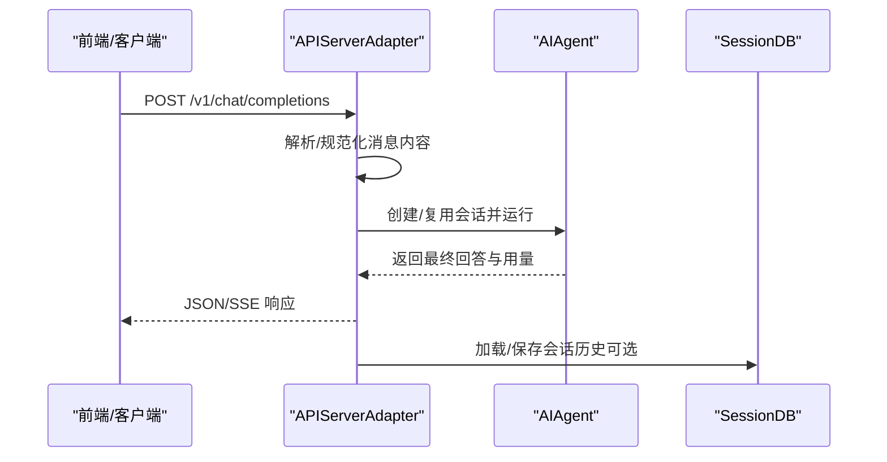
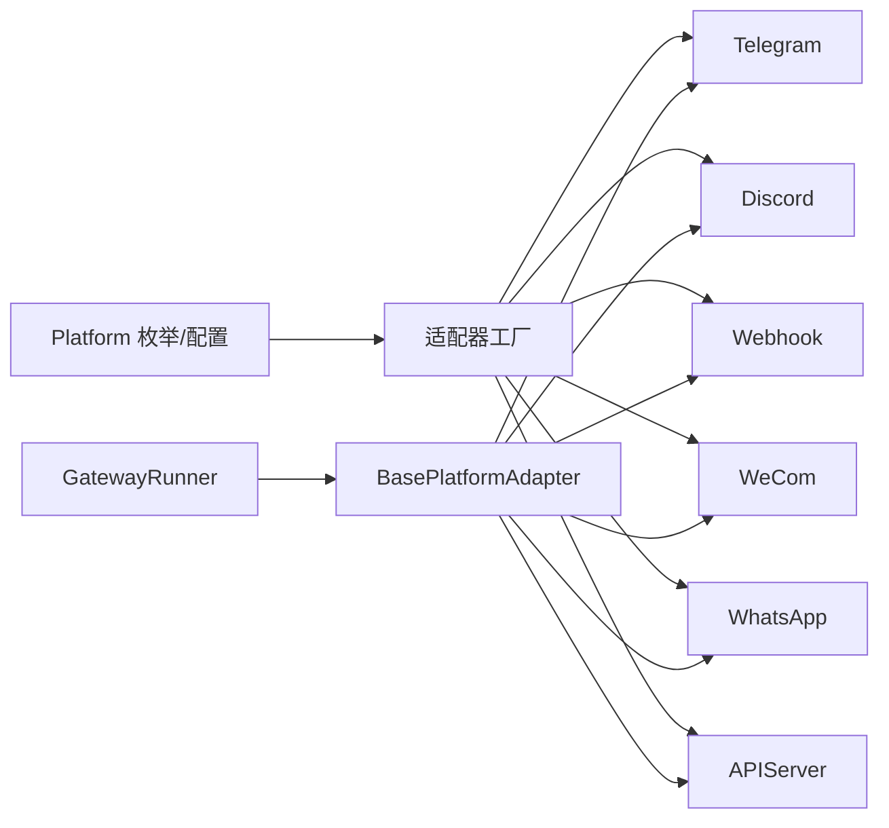

# 平台适配器开发

<cite>
**本文档引用的文件**
- [gateway/platforms/base.py](file://gateway/platforms/base.py)
- [gateway/platforms/ADDING_A_PLATFORM.md](file://gateway/platforms/ADDING_A_PLATFORM.md)
- [gateway/platforms/__init__.py](file://gateway/platforms/__init__.py)
- [gateway/platforms/api_server.py](file://gateway/platforms/api_server.py)
- [gateway/platforms/helpers.py](file://gateway/platforms/helpers.py)
- [gateway/platforms/telegram.py](file://gateway/platforms/telegram.py)
- [gateway/platforms/discord.py](file://gateway/platforms/discord.py)
- [gateway/platforms/webhook.py](file://gateway/platforms/webhook.py)
- [gateway/platforms/wecom.py](file://gateway/platforms/wecom.py)
- [gateway/platforms/whatsapp.py](file://gateway/platforms/whatsapp.py)
- [gateway/config.py](file://gateway/config.py)
- [gateway/run.py](file://gateway/run.py)
</cite>

## 目录
1. [简介](#简介)
2. [项目结构](#项目结构)
3. [核心组件](#核心组件)
4. [架构总览](#架构总览)
5. [详细组件分析](#详细组件分析)
6. [依赖分析](#依赖分析)
7. [性能考虑](#性能考虑)
8. [故障排查指南](#故障排查指南)
9. [结论](#结论)
10. [附录](#附录)

## 简介
本指南面向平台适配器开发者，系统阐述 Hermes Agent 网关平台适配器的基础架构与继承体系，覆盖 BaseAdapter 抽象类的设计理念与接口规范；详解新增平台的完整流程（从接口定义到实现细节）；记录消息格式转换、事件处理、权限验证与错误处理的标准模式；提供代码模板、测试策略与调试技巧；并给出性能优化建议、安全考虑与兼容性保障，辅以真实平台适配器实现案例与最佳实践。

## 项目结构
平台适配器位于 gateway/platforms 目录，采用“按平台拆分”的模块化组织方式：
- 基础设施：base.py 定义抽象基类与通用工具；helpers.py 提供可复用的通用能力（去重、聚合、Markdown 清理、线程参与跟踪等）
- 具体平台：telegram.py、discord.py、webhook.py、wecom.py、whatsapp.py 等
- 配置与运行：config.py 定义平台枚举与配置模型；run.py 负责适配器工厂与生命周期管理
- 开放式平台：api_server.py 提供 OpenAI 兼容 API 服务器适配器

图表来源
- [gateway/platforms/base.py](file://gateway/platforms/base.py)
- [gateway/platforms/helpers.py](file://gateway/platforms/helpers.py)
- [gateway/platforms/telegram.py](file://gateway/platforms/telegram.py)
- [gateway/platforms/discord.py](file://gateway/platforms/discord.py)
- [gateway/platforms/webhook.py](file://gateway/platforms/webhook.py)
- [gateway/platforms/wecom.py](file://gateway/platforms/wecom.py)
- [gateway/platforms/whatsapp.py](file://gateway/platforms/whatsapp.py)
- [gateway/platforms/api_server.py](file://gateway/platforms/api_server.py)
- [gateway/config.py](file://gateway/config.py)
- [gateway/run.py](file://gateway/run.py)

章节来源
- [gateway/platforms/__init__.py](file://gateway/platforms/__init__.py)
- [gateway/platforms/ADDING_A_PLATFORM.md](file://gateway/platforms/ADDING_A_PLATFORM.md)

## 核心组件
- BasePlatformAdapter 抽象基类：定义统一的连接、断开、发送、接收、媒体缓存、会话源构建等接口契约，提供消息类型、发送结果、消息合并、UTF-16 长度计算、代理与网络访问控制、图片/音频/文档缓存等基础设施
- MessageEvent/MessageType/ProcessingOutcome：标准化入站消息的数据结构与处理结果分类
- SendResult：标准化出站发送结果，支持可重试标记
- 通用工具 helpers.py：消息去重、文本聚合、Markdown 清理、线程参与跟踪、电话号码脱敏
- 平台枚举 Platform 与配置模型 PlatformConfig/GatewayConfig：集中管理平台启用状态、令牌、额外配置、会话重置策略等

章节来源
- [gateway/platforms/base.py](file://gateway/platforms/base.py)
- [gateway/platforms/helpers.py](file://gateway/platforms/helpers.py)
- [gateway/config.py](file://gateway/config.py)

## 架构总览
平台适配器通过 GatewayRunner 统一调度，各平台适配器实现各自的 connect/disconnect/send/receive 逻辑，并通过 SessionSource/MessageEvent/SessionKey 将消息路由至 Agent 执行，最终由 SendResult 返回结果。API Server 适配器提供 OpenAI 兼容接口，Webhook 适配器提供通用事件入口。

图表来源
- [gateway/run.py](file://gateway/run.py)
- [gateway/platforms/base.py](file://gateway/platforms/base.py)

## 详细组件分析

### BasePlatformAdapter 抽象基类
- 设计理念
  - 统一抽象：屏蔽不同平台差异，暴露一致的接口给上层调度器
  - 可扩展：通过抽象方法与可选默认实现，降低新增平台的实现成本
  - 安全与健壮：内置代理解析、URL 安全检查、SSRF 防护、幂等缓存、重连退避
- 关键接口
  - 生命周期：connect()/disconnect()
  - 消息：send()/send_typing()/send_image()/send_document()/send_voice()/send_video()/send_animation()/send_image_file()
  - 工具：build_source()/handle_message()/get_chat_info()/truncate_message()/merge_pending_message_event()
  - 缓存：图片/音频/文档本地缓存与清理
  - 安全：UTF-16 长度计算、消息长度限制、SSRF 拦截、代理支持
- 数据结构
  - MessageEvent：统一入站消息载体
  - SendResult：统一出站结果载体
  - MessageType/ProcessingOutcome：枚举化消息类型与处理结果
- 错误处理
  - 可重试错误模式识别
  - 致命错误码与通知机制
  - 重连退避与冲突处理（以 Telegram 为例）

图表来源
- [gateway/platforms/base.py](file://gateway/platforms/base.py)

章节来源
- [gateway/platforms/base.py](file://gateway/platforms/base.py)

### 通用工具 helpers.py
- MessageDeduplicator：基于 TTL 的消息去重，避免重复处理
- TextBatchAggregator：快速文本事件聚合，减少平台负载
- strip_markdown：移除 Markdown 标记，适配纯文本平台
- ThreadParticipationTracker：持久化记录机器人参与过的线程
- redact_phone：日志中脱敏电话号码

图表来源
- [gateway/platforms/helpers.py](file://gateway/platforms/helpers.py)

章节来源
- [gateway/platforms/helpers.py](file://gateway/platforms/helpers.py)

### 新增平台流程（从零到一）
参考官方清单，确保以下集成点全部实现：
- 核心适配器：继承 BasePlatformAdapter，实现构造、连接、断开、发送、打字指示、媒体发送、聊天信息查询等
- 平台枚举：在 Platform 中注册新平台
- 适配器工厂：在 run.py 的工厂函数中创建适配器并校验依赖
- 授权映射：在 run.py 的授权函数中添加允许用户列表与全局开关
- 会话源：如需额外身份字段，在 SessionSource 与 base.py 的序列化/反序列化中补充
- 系统提示：在 prompt_builder.py 中添加平台提示词
- 工具集：在 toolsets.py 中为新平台定义工具集并纳入复合工具集
- 定时投递：在 scheduler.py 中添加平台映射
- 发送消息工具：在 send_message_tool.py 中添加平台映射与路由
- Cron 工具 Schema：在 cronjob_tools.py 中完善交付选项描述
- 通道目录：在 channel_directory.py 中将平台加入会话驱动发现
- 状态显示：在 hermes_cli/status.py 中添加平台配置项
- 安装向导：在 hermes_cli/gateway.py 中添加平台设置项与自定义逻辑
- 敏感信息脱敏：在 agent/redact.py 中添加正则与脱敏函数
- 文档：更新 README/AGENTS.md/环境变量文档/平台文档
- 测试：按清单覆盖单元/异步/重连/附件/群组过滤等场景

章节来源
- [gateway/platforms/ADDING_A_PLATFORM.md](file://gateway/platforms/ADDING_A_PLATFORM.md)
- [gateway/run.py](file://gateway/run.py)
- [gateway/config.py](file://gateway/config.py)

### API Server 适配器（OpenAI 兼容）
- 功能：提供 /v1/chat/completions、/v1/responses、/v1/models、/v1/runs 等端点
- 特性：请求体大小限制、CORS 中间件、安全头、幂等缓存、会话数据库、流式 SSE、工具进度事件
- 认证：Bearer Token 校验（可选），未配置时仅限本地使用
- 会话：支持通过 X-Hermes-Session-Id 进行会话延续，受 API Key 保护

图表来源
- [gateway/platforms/api_server.py](file://gateway/platforms/api_server.py)

章节来源
- [gateway/platforms/api_server.py](file://gateway/platforms/api_server.py)

### Telegram 适配器
- 特性：论坛主题（DM Topic）、长消息分片检测、媒体相册批处理、文本聚合、MarkdownV2 转义与清理、轮询网络错误自动重连、冲突处理（多实例）
- 限制：消息长度限制（UTF-16 单元），媒体分组等待时间
- 安全：过滤自消息、过滤同步回声消息、敏感标识脱敏

章节来源
- [gateway/platforms/telegram.py](file://gateway/platforms/telegram.py)
- [gateway/platforms/base.py](file://gateway/platforms/base.py)

### Discord 适配器
- 特性：语音接收（RTP/NaCl/DAVE/Opus 解密与解码）、静音检测、PCM 转 WAV、线程参与跟踪、消息去重
- 安全：URL 安全检查、SSRF 防护、消息去重

章节来源
- [gateway/platforms/discord.py](file://gateway/platforms/discord.py)
- [gateway/platforms/base.py](file://gateway/platforms/base.py)

### Webhook 适配器
- 特性：HMAC 签名验证、动态路由加载、速率限制、幂等缓存、跨平台投递
- 安全：每路由密钥、固定窗口限流、Body 大小限制、可选“无认证”模式（仅测试）

章节来源
- [gateway/platforms/webhook.py](file://gateway/platforms/webhook.py)

### WeCom 适配器
- 特性：WebSocket 持久连接、AI Bot 网关协议、媒体上传/下载、消息去重、文本聚合、消息长度限制
- 安全：依赖 aiohttp/httpx、媒体大小限制、心跳与重连退避

章节来源
- [gateway/platforms/wecom.py](file://gateway/platforms/wecom.py)

### WhatsApp 适配器（桥接模式）
- 特性：Node.js 桥接脚本、HTTP IPC、会话路径管理、提及模式、自由回复聊天白名单
- 安全：Node.js 可执行依赖检查、端口占用清理

章节来源
- [gateway/platforms/whatsapp.py](file://gateway/platforms/whatsapp.py)

## 依赖分析
- 平台适配器对基础框架的依赖：统一继承 BasePlatformAdapter，复用 MessageEvent/MessageType/SessionSource/缓存工具
- 适配器工厂：根据 Platform 枚举与配置选择具体适配器实现
- 会话与投递：GatewayRunner 负责会话上下文、Agent 实例复用、跨平台投递
- 第三方库：各平台按需引入（如 telegram、discord、aiohttp、httpx、nacl、davey 等）

图表来源
- [gateway/config.py](file://gateway/config.py)
- [gateway/run.py](file://gateway/run.py)
- [gateway/platforms/base.py](file://gateway/platforms/base.py)

章节来源
- [gateway/config.py](file://gateway/config.py)
- [gateway/run.py](file://gateway/run.py)

## 性能考虑
- 消息聚合与批处理：使用 TextBatchAggregator 合并高频文本事件，降低平台负载
- 去重与幂等：MessageDeduplicator 避免重复处理；Webhook/APIServer 的幂等缓存减少重复调用
- 缓存与本地化：图片/音频/文档缓存避免平台 URL 过期与网络抖动影响
- 会话复用：GatewayRunner 对会话进行 Agent 实例缓存，保留前缀缓存，显著降低推理成本
- 传输优化：合理设置编辑间隔、缓冲阈值、光标样式，平衡实时性与平台限制
- 重连退避：指数退避 + 抖动，避免雪崩效应

章节来源
- [gateway/platforms/helpers.py](file://gateway/platforms/helpers.py)
- [gateway/platforms/api_server.py](file://gateway/platforms/api_server.py)
- [gateway/platforms/webhook.py](file://gateway/platforms/webhook.py)
- [gateway/run.py](file://gateway/run.py)

## 故障排查指南
- 常见致命错误
  - Telegram 轮询冲突：多实例抢占 token，需停止其他进程后重启
  - Telegram 轮询网络错误：指数退避重连，超过最大次数后标记致命错误
  - WeCom 依赖缺失：缺少 aiohttp/httpx，安装后重试
- 可重试错误
  - 连接超时/连接被拒/网络异常等，SendResult.retryable 标记用于自动重试
- 日志与脱敏
  - 使用 redact_phone/脱敏工具避免敏感信息泄露
  - SSRF 防护拦截私有地址重定向
- 调试技巧
  - 启用详细日志，观察重连/去重/聚合行为
  - 使用最小化配置复现问题，逐步增加复杂度
  - 在 API Server/Webhook 中开启健康检查端点与限流参数验证

章节来源
- [gateway/platforms/telegram.py](file://gateway/platforms/telegram.py)
- [gateway/platforms/wecom.py](file://gateway/platforms/wecom.py)
- [gateway/platforms/webhook.py](file://gateway/platforms/webhook.py)
- [gateway/platforms/base.py](file://gateway/platforms/base.py)

## 结论
通过统一的 BasePlatformAdapter 抽象与 helpers 工具，Hermes Agent 为多平台适配提供了清晰的扩展路径。遵循官方新增平台清单、充分利用现有工具与安全机制、结合性能优化与严格测试，可以高效、稳定地集成新平台并保障生产可用性。

## 附录

### 新平台添加清单（摘要）
- 必备：适配器类继承 BasePlatformAdapter，实现 connect/disconnect/send 等方法
- 枚举与工厂：在 Platform 与 run.py 工厂中注册
- 授权与会话：在 run.py 授权函数中添加映射；必要时扩展 SessionSource
- 提示词与工具集：prompt_builder.py 与 toolsets.py 更新
- 投递与状态：scheduler.py、send_message_tool.py、channel_directory.py、hermes_cli/status.py、gateway.py 更新
- 文档与测试：README/AGENTS.md/环境变量文档/平台文档更新；按清单编写测试

章节来源
- [gateway/platforms/ADDING_A_PLATFORM.md](file://gateway/platforms/ADDING_A_PLATFORM.md)