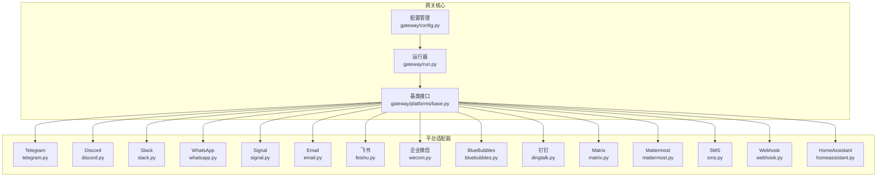
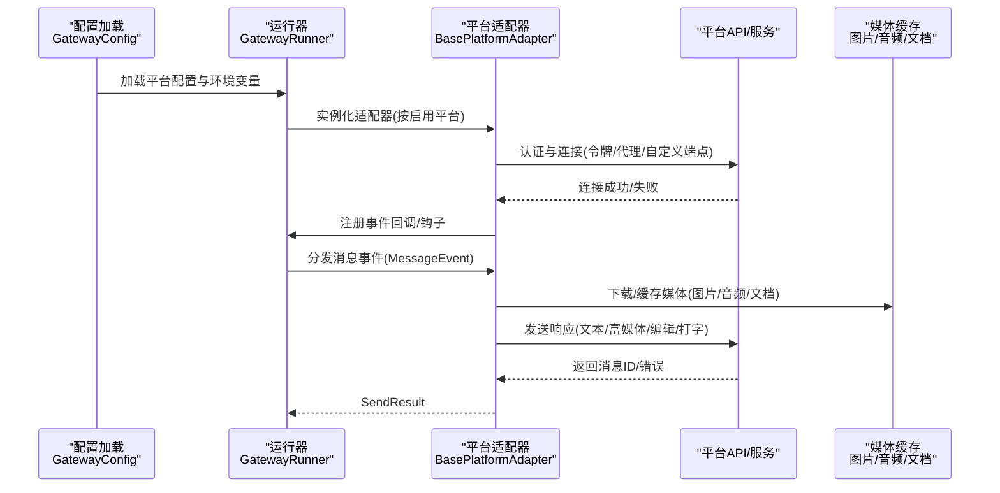
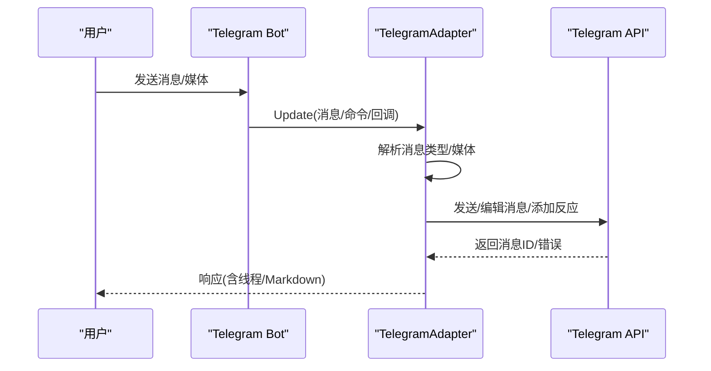
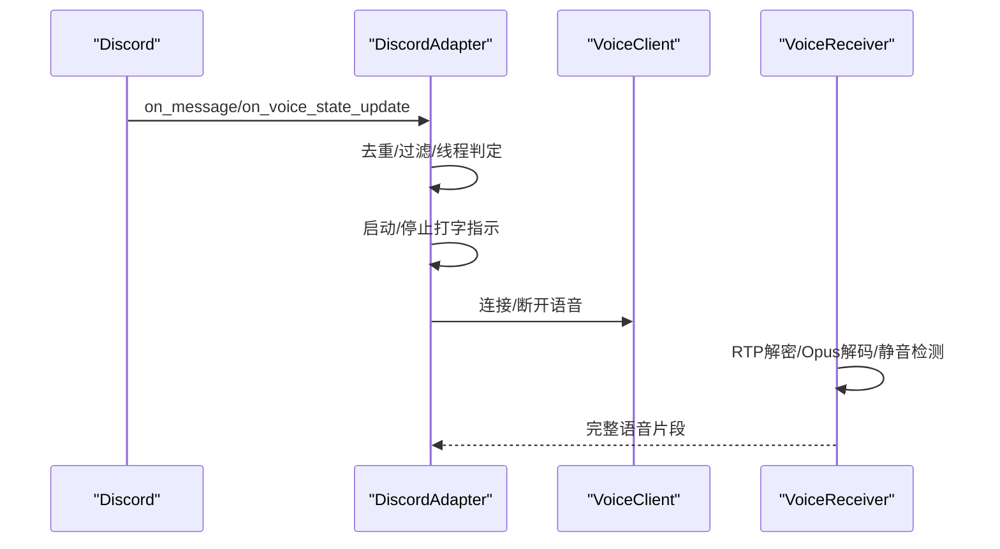
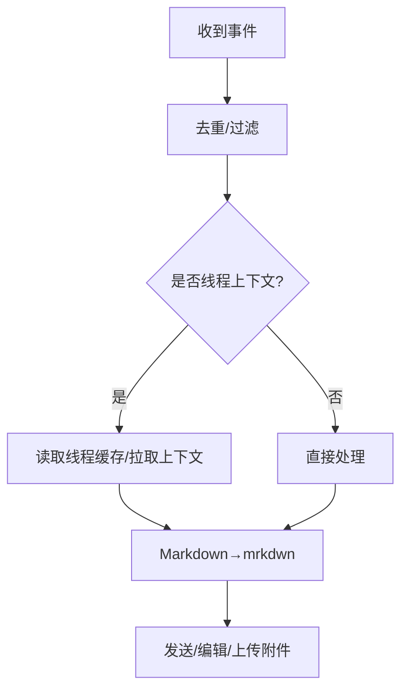
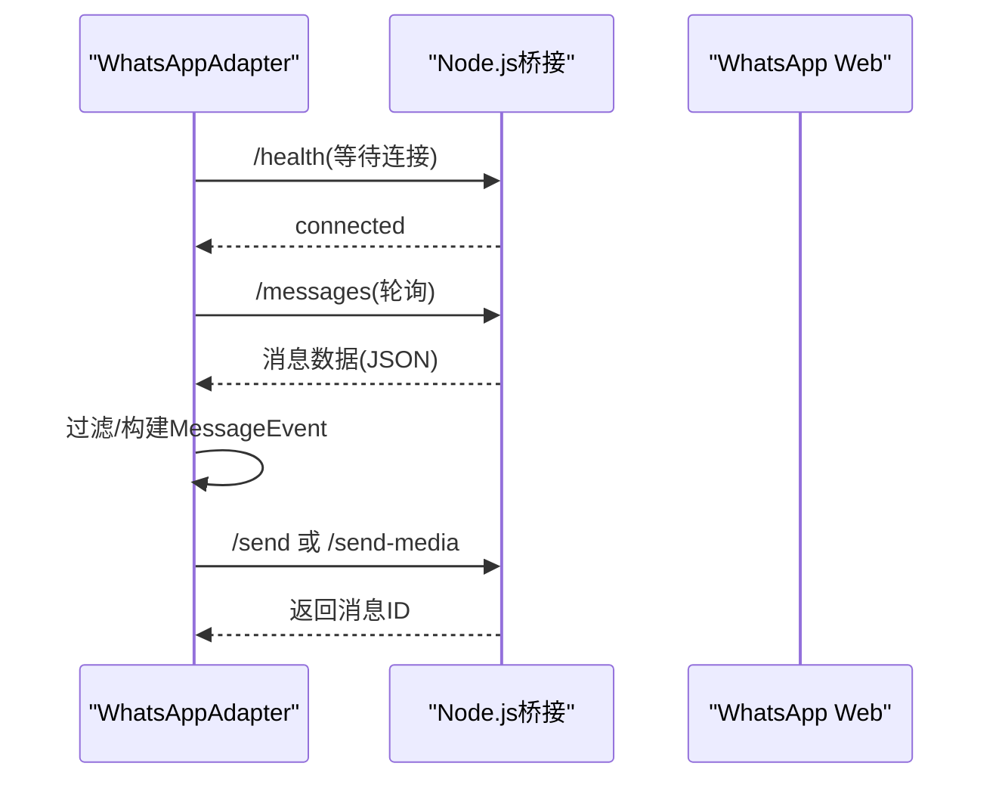
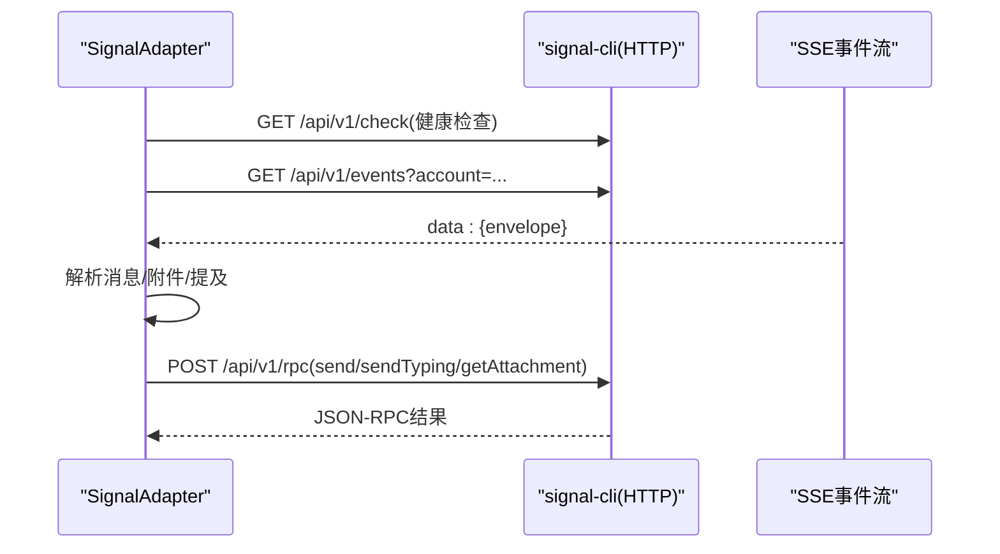
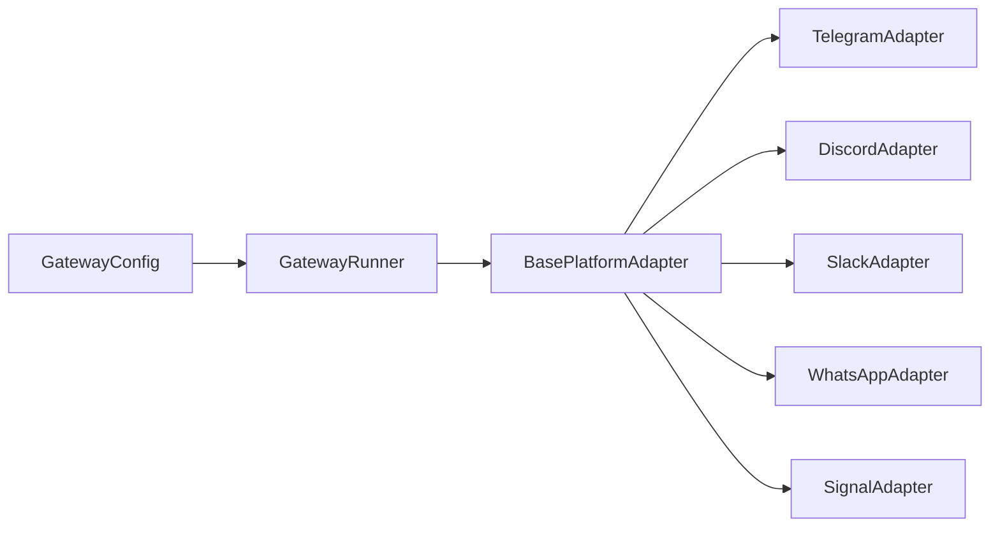

# 平台集成

<cite>
**本文引用的文件**
- [gateway/platforms/__init__.py](file://gateway/platforms/__init__.py)
- [gateway/platforms/base.py](file://gateway/platforms/base.py)
- [gateway/config.py](file://gateway/config.py)
- [gateway/run.py](file://gateway/run.py)
- [gateway/platforms/telegram.py](file://gateway/platforms/telegram.py)
- [gateway/platforms/discord.py](file://gateway/platforms/discord.py)
- [gateway/platforms/slack.py](file://gateway/platforms/slack.py)
- [gateway/platforms/whatsapp.py](file://gateway/platforms/whatsapp.py)
- [gateway/platforms/signal.py](file://gateway/platforms/signal.py)
- [gateway/platforms/email.py](file://gateway/platforms/email.py)
- [gateway/platforms/feishu.py](file://gateway/platforms/feishu.py)
- [gateway/platforms/wecom.py](file://gateway/platforms/wecom.py)
- [gateway/platforms/bluebubbles.py](file://gateway/platforms/bluebubbles.py)
- [gateway/platforms/dingtalk.py](file://gateway/platforms/dingtalk.py)
- [gateway/platforms/matrix.py](file://gateway/platforms/matrix.py)
- [gateway/platforms/mattermost.py](file://gateway/platforms/mattermost.py)
- [gateway/platforms/sms.py](file://gateway/platforms/sms.py)
- [gateway/platforms/webhook.py](file://gateway/platforms/webhook.py)
- [gateway/platforms/homeassistant.py](file://gateway/platforms/homeassistant.py)
</cite>

## 目录
1. [简介](#简介)
2. [项目结构](#项目结构)
3. [核心组件](#核心组件)
4. [架构总览](#架构总览)
5. [详细组件分析](#详细组件分析)
6. [依赖分析](#依赖分析)
7. [性能考量](#性能考量)
8. [故障排查指南](#故障排查指南)
9. [结论](#结论)
10. [附录](#附录)

## 简介
本文件面向Hermes Agent消息网关平台的平台集成，系统性梳理15+消息平台（Telegram、Discord、Slack、WhatsApp、Signal、Email、飞书、企业微信、BlueBubbles、钉钉、Matrix、Mattermost、SMS、Webhook、HomeAssistant）的适配方式与实现要点。内容覆盖：
- 配置方法与认证机制
- 连接建立流程与平台特性
- 消息格式转换、媒体处理与权限控制
- 安全考虑与SSRF防护
- 平台适配器开发指南与最佳实践
- 常见问题排查与性能优化建议

## 项目结构
Hermes Agent的消息网关采用“统一基类 + 多平台适配器”的分层设计：
- 统一基类：定义消息事件模型、发送结果、媒体缓存、代理与SSRF防护等通用能力
- 平台适配器：按平台差异实现连接、认证、消息收发、线程/回复模式、媒体处理等
- 配置管理：集中管理平台开关、令牌、回复模式、环境变量桥接等
- 运行器：启动/停止适配器、会话管理、钩子与后台任务调度

图表来源
- [gateway/config.py](file://gateway/config.py)
- [gateway/run.py](file://gateway/run.py)
- [gateway/platforms/base.py](file://gateway/platforms/base.py)
- [gateway/platforms/telegram.py](file://gateway/platforms/telegram.py)
- [gateway/platforms/discord.py](file://gateway/platforms/discord.py)
- [gateway/platforms/slack.py](file://gateway/platforms/slack.py)
- [gateway/platforms/whatsapp.py](file://gateway/platforms/whatsapp.py)
- [gateway/platforms/signal.py](file://gateway/platforms/signal.py)
- [gateway/platforms/email.py](file://gateway/platforms/email.py)
- [gateway/platforms/feishu.py](file://gateway/platforms/feishu.py)
- [gateway/platforms/wecom.py](file://gateway/platforms/wecom.py)
- [gateway/platforms/bluebubbles.py](file://gateway/platforms/bluebubbles.py)
- [gateway/platforms/dingtalk.py](file://gateway/platforms/dingtalk.py)
- [gateway/platforms/matrix.py](file://gateway/platforms/matrix.py)
- [gateway/platforms/mattermost.py](file://gateway/platforms/mattermost.py)
- [gateway/platforms/sms.py](file://gateway/platforms/sms.py)
- [gateway/platforms/webhook.py](file://gateway/platforms/webhook.py)
- [gateway/platforms/homeassistant.py](file://gateway/platforms/homeassistant.py)

章节来源
- [gateway/platforms/__init__.py](file://gateway/platforms/__init__.py)
- [gateway/platforms/base.py](file://gateway/platforms/base.py)
- [gateway/config.py](file://gateway/config.py)
- [gateway/run.py](file://gateway/run.py)

## 核心组件
- 基类接口与通用工具
  - 消息事件模型与发送结果封装
  - 文本截断、Markdown/平台格式转换
  - 图片/音频/文档本地缓存与SSRF防护
  - 代理与网络可达性检测
  - 会话键构建、权限与授权钩子
- 配置体系
  - 平台枚举、平台配置、Home频道、会话重置策略
  - 流式传输配置、STT开关、会话隔离策略
  - 环境变量桥接与校验（令牌占位符拒绝）
- 运行器
  - 生命周期管理、失败平台重连、内存刷新、钩子注册
  - 会话存储、进程注册、语音模式持久化

章节来源
- [gateway/platforms/base.py](file://gateway/platforms/base.py)
- [gateway/config.py](file://gateway/config.py)
- [gateway/run.py](file://gateway/run.py)

## 架构总览
下图展示从配置到适配器、再到消息处理与媒体缓存的整体流程。

图表来源
- [gateway/config.py](file://gateway/config.py)
- [gateway/run.py](file://gateway/run.py)
- [gateway/platforms/base.py](file://gateway/platforms/base.py)

## 详细组件分析

### Telegram 适配器
- 认证与连接
  - 使用python-telegram-bot，支持轮询与Webhook两种模式
  - 支持自定义base_url/base_file_url、代理与Telegram Fallback IP
  - 自动注册命令菜单、论坛主题(DM Topics)创建与持久化
- 消息处理
  - 文本、位置、媒体（照片/视频/音频/语音/文档/贴纸）
  - 文本/相册批量合并、回复线程模式（off/first/all）
  - MarkdownV2转义与清理
- 错误与重连
  - 轮询冲突与网络错误自动重试与致命错误标记
- 安全与代理
  - 代理解析与SOCKS/HTTP自动选择
  - SSRF防护与URL白名单检查

图表来源
- [gateway/platforms/telegram.py](file://gateway/platforms/telegram.py)
- [gateway/platforms/base.py](file://gateway/platforms/base.py)

章节来源
- [gateway/platforms/telegram.py](file://gateway/platforms/telegram.py)

### Discord 适配器
- 认证与连接
  - 使用discord.py，Socket Mode或Bot Token模式
  - 可选OPUS加载、语音接收器(VoiceReceiver)解码与静音检测
- 消息处理
  - 文本、媒体、Slash命令、按钮审批、反应反馈
  - 线程参与追踪、去重、多工作区支持
- 语音通道
  - DAVE/E2EE解密、Opus解码、PCM转WAV供STT
  - 语音超时断开、打字指示器

图表来源
- [gateway/platforms/discord.py](file://gateway/platforms/discord.py)

章节来源
- [gateway/platforms/discord.py](file://gateway/platforms/discord.py)

### Slack 适配器
- 认证与连接
  - Slack-Bolt Socket Mode，需要APP TOKEN与BOT TOKEN
  - 多工作区映射、AI Assistant Thread生命周期事件
- 消息处理
  - 文本/富文本(Markdown→mrkdwn)、附件上传(files_upload_v2)
  - 线程上下文缓存、@提及自动响应、回复广播
- 安全与限流
  - SSRF重定向防护、长消息拆分、速率限制规避

图表来源
- [gateway/platforms/slack.py](file://gateway/platforms/slack.py)

章节来源
- [gateway/platforms/slack.py](file://gateway/platforms/slack.py)

### WhatsApp 适配器
- 连接模式
  - 通过Node.js桥接(HTTP/IPC)与WhatsApp Web/Baileys/业务API交互
  - 支持外部/内部桥接进程管理、QR登录、会话持久化
- 消息处理
  - 文本/媒体(图片/视频/音频/文档)、回复前缀、@提及/模式匹配
  - 自由响应群聊白名单、@机器人判定、提及模式正则
- 健康与监控
  - 桥接进程健康检查、意外退出致命错误上报

图表来源
- [gateway/platforms/whatsapp.py](file://gateway/platforms/whatsapp.py)

章节来源
- [gateway/platforms/whatsapp.py](file://gateway/platforms/whatsapp.py)

### Signal 适配器
- 连接与认证
  - signal-cli HTTP守护进程，SSE事件流 + JSON-RPC 2.0
  - ACCOUNT与HTTP URL必需；支持组消息白名单
- 消息处理
  - SSE事件解析、@提及渲染、附件下载与缓存
  - Note to Self回环过滤、最近发送时间戳去重
- 打字指示与健康监控
  - 循环发送typing、SSE空闲健康检查与强制重连

图表来源
- [gateway/platforms/signal.py](file://gateway/platforms/signal.py)

章节来源
- [gateway/platforms/signal.py](file://gateway/platforms/signal.py)

### 其他平台（概览）
- Email：IMAP/SMTP配置、邮件解析与发送、附件处理
- 飞书：应用凭证(app_id/app_secret)、消息与审批卡片
- 企业微信：回调/机器人双模式、加解密与回调验证
- BlueBubbles：本地iOS/macOS消息服务器桥接
- 钉钉：企业内部群聊与机器人
- Matrix：去中心化聊天协议、房间与线程
- Mattermost：企业级开源聊天平台
- SMS：Twilio集成(账号SID/Token)，短信发送
- Webhook：动态路由、签名与幂等
- HomeAssistant：设备与场景联动

章节来源
- [gateway/platforms/email.py](file://gateway/platforms/email.py)
- [gateway/platforms/feishu.py](file://gateway/platforms/feishu.py)
- [gateway/platforms/wecom.py](file://gateway/platforms/wecom.py)
- [gateway/platforms/bluebubbles.py](file://gateway/platforms/bluebubbles.py)
- [gateway/platforms/dingtalk.py](file://gateway/platforms/dingtalk.py)
- [gateway/platforms/matrix.py](file://gateway/platforms/matrix.py)
- [gateway/platforms/mattermost.py](file://gateway/platforms/mattermost.py)
- [gateway/platforms/sms.py](file://gateway/platforms/sms.py)
- [gateway/platforms/webhook.py](file://gateway/platforms/webhook.py)
- [gateway/platforms/homeassistant.py](file://gateway/platforms/homeassistant.py)

## 依赖分析
- 组件耦合
  - 所有适配器继承BasePlatformAdapter，共享消息事件、发送结果、媒体缓存与SSRF工具
  - 运行器通过配置驱动适配器实例化与生命周期管理
- 外部依赖
  - Telegram: python-telegram-bot
  - Discord: discord.py + 可选OPUS/NAcl/DAVE
  - Slack: slack-bolt + slack_sdk
  - WhatsApp: Node.js桥接(whatsapp-web.js/Baileys/业务API)
  - Signal: signal-cli HTTP守护进程
- 环境变量与配置桥接
  - 平台令牌、代理、自定义端点、回复模式、线程策略、SSR模式等通过环境变量与config.yaml桥接

图表来源
- [gateway/platforms/base.py](file://gateway/platforms/base.py)
- [gateway/config.py](file://gateway/config.py)
- [gateway/run.py](file://gateway/run.py)

章节来源
- [gateway/platforms/base.py](file://gateway/platforms/base.py)
- [gateway/config.py](file://gateway/config.py)
- [gateway/run.py](file://gateway/run.py)

## 性能考量
- 连接与重试
  - Telegram轮询冲突与网络错误指数退避重试；Discord语音解码与静音检测避免无效负载
- 媒体处理
  - 异步下载与本地缓存，带重试与SSRF防护；大文件分块与类型识别
- 会话与上下文
  - 会话缓存与提示词复用、智能模型路由、压缩与重置策略降低重复计算
- 网络与代理
  - 自动代理检测与SOCKS/HTTP选择，Telegram Fallback IP提升连通性

## 故障排查指南
- 常见问题
  - 令牌为空/占位符：启动日志会拒绝空令牌并禁用对应平台
  - Telegram轮询冲突：多个进程同时轮询导致冲突，需停止其他实例
  - Discord语音OPUS缺失：未找到OPUS库时语音播放不可用
  - Signal SSE空闲：长时间无事件可能被守护进程视为异常，触发强制重连
  - WhatsApp桥接进程：外部桥接退出或端口占用，需检查日志与进程状态
- 排查步骤
  - 查看网关日志与平台适配器日志
  - 检查环境变量与config.yaml配置
  - 验证代理设置与网络可达性
  - 对于媒体问题，确认缓存目录权限与磁盘空间

章节来源
- [gateway/config.py](file://gateway/config.py)
- [gateway/platforms/telegram.py](file://gateway/platforms/telegram.py)
- [gateway/platforms/discord.py](file://gateway/platforms/discord.py)
- [gateway/platforms/signal.py](file://gateway/platforms/signal.py)
- [gateway/platforms/whatsapp.py](file://gateway/platforms/whatsapp.py)

## 结论
Hermes Agent通过统一的适配器基类与完善的配置/运行器体系，实现了对15+消息平台的一致接入与扩展。平台适配器在认证、连接、消息格式转换、媒体处理与安全方面各有侧重，结合运行器的生命周期管理与钩子系统，形成高可用、可维护的网关生态。建议在生产部署中优先完善代理与SSRF防护、严格令牌管理与会话隔离策略，并针对平台特性进行性能调优。

## 附录

### 平台适配器开发指南与最佳实践
- 继承与职责
  - 继承BasePlatformAdapter，实现connect/disconnect与send/edit_message
  - 在connect中完成认证、代理、自定义端点与事件注册
- 消息与媒体
  - 使用MessageEvent标准化输入，利用媒体缓存工具处理图片/音频/文档
  - 对长文本进行平台限制下的拆分与流式传输
- 安全与合规
  - 严格SSRF防护，使用URL白名单与重定向守卫
  - 对敏感信息进行脱敏输出与最小化日志
- 可靠性
  - 实现重连策略与致命错误上报，避免资源泄漏
  - 对外部进程/守护进程进行健康检查与异常恢复

### 平台配置清单（示例字段）
- 通用
  - enabled: 是否启用
  - token/api_key: 平台令牌
  - home_channel: 默认Home频道(chat_id/name)
  - reply_to_mode: 回复线程模式(off/first/all)
  - extra: 平台特定参数
- Telegram
  - base_url/base_file_url: 自定义端点
  - fallback_ips: Telegram Fallback IP
  - dm_topics: DM论坛主题配置
- Discord
  - allow_bots/require_mention/free_response_channels
  - auto_thread/reactions/ignored_channels/allowed_channels
- Slack
  - reply_broadcast: 线程广播
  - reply_in_thread: 是否在话题内回复
- WhatsApp
  - bridge_script/bridge_port/session_path
  - reply_prefix/mention_patterns/free_response_chats
- Signal
  - http_url/account/ignore_stories/group允许列表
- Email/飞书/企业微信/钉钉/Matrix/Mattermost/SMS/Webhook/HomeAssistant
  - 按平台文档配置相应凭据与路由参数

章节来源
- [gateway/config.py](file://gateway/config.py)
- [gateway/platforms/telegram.py](file://gateway/platforms/telegram.py)
- [gateway/platforms/discord.py](file://gateway/platforms/discord.py)
- [gateway/platforms/slack.py](file://gateway/platforms/slack.py)
- [gateway/platforms/whatsapp.py](file://gateway/platforms/whatsapp.py)
- [gateway/platforms/signal.py](file://gateway/platforms/signal.py)