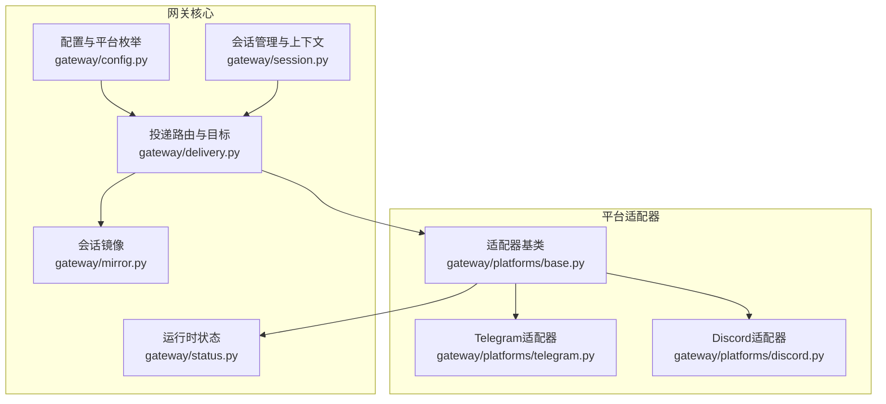
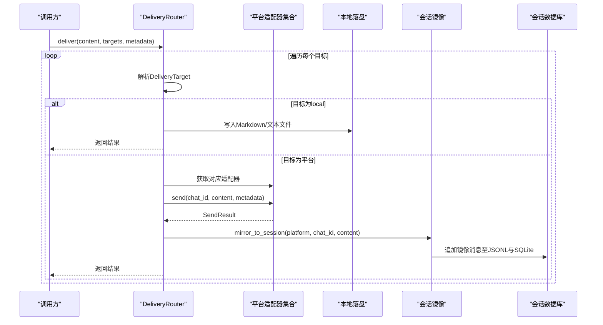
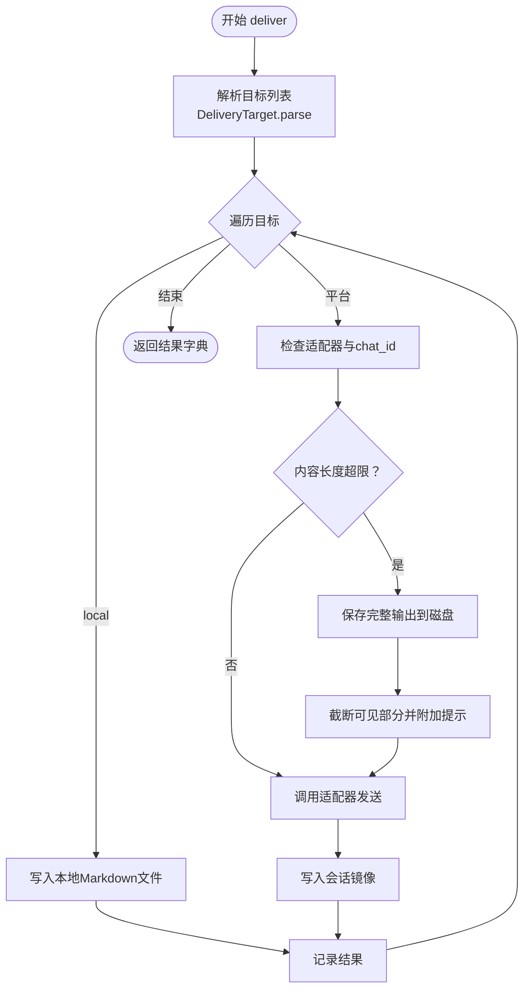
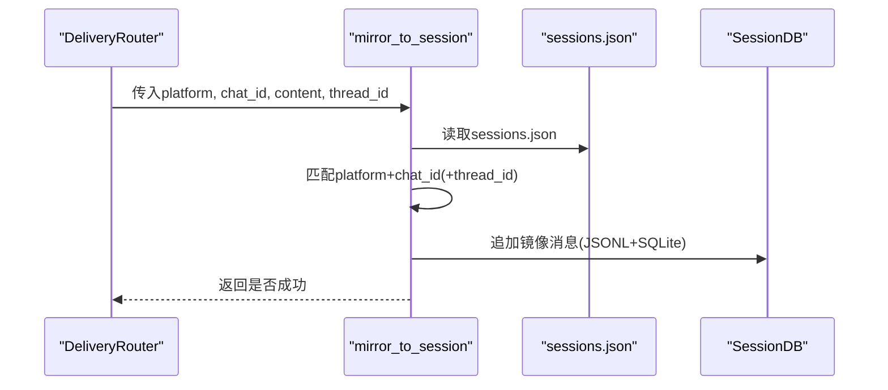
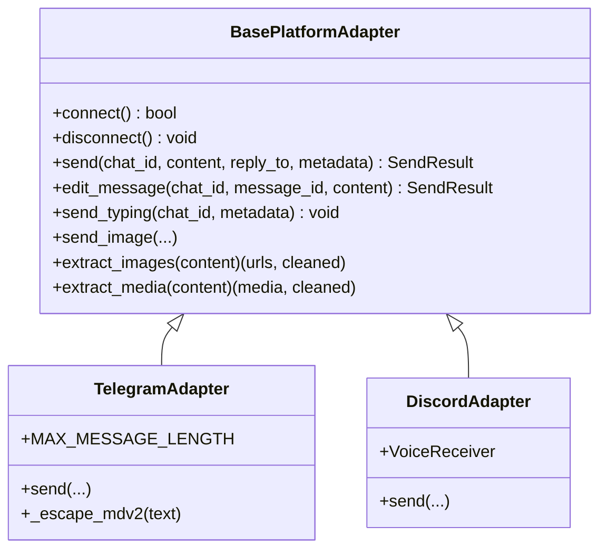
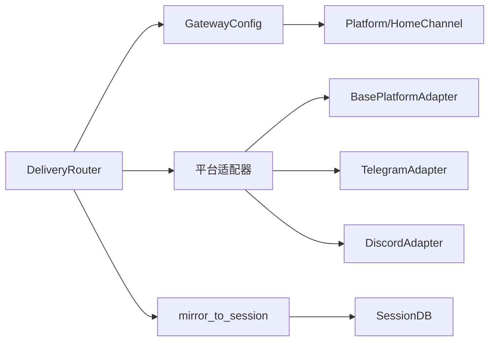

# 消息投递

<cite>
**本文引用的文件**
- [gateway/delivery.py](file://gateway/delivery.py)
- [gateway/mirror.py](file://gateway/mirror.py)
- [gateway/config.py](file://gateway/config.py)
- [gateway/session.py](file://gateway/session.py)
- [gateway/platforms/base.py](file://gateway/platforms/base.py)
- [gateway/platforms/telegram.py](file://gateway/platforms/telegram.py)
- [gateway/platforms/discord.py](file://gateway/platforms/discord.py)
- [gateway/status.py](file://gateway/status.py)
</cite>

## 目录
1. [简介](#简介)
2. [项目结构](#项目结构)
3. [核心组件](#核心组件)
4. [架构总览](#架构总览)
5. [详细组件分析](#详细组件分析)
6. [依赖分析](#依赖分析)
7. [性能考虑](#性能考虑)
8. [故障排查指南](#故障排查指南)
9. [结论](#结论)
10. [附录](#附录)

## 简介
本文件面向Hermes Agent消息网关的消息投递系统，围绕以下目标展开：  
- 深入解析消息路由机制与DeliveryRouter的路由算法、DeliveryTarget的目标选择策略  
- 详述消息镜像（会话转录镜像）的实现原理与启用方式  
- 记录消息队列处理、批量发送与平台适配器的并发模型  
- 解释消息格式转换、媒体提取、内容过滤与安全检查流程  
- 提供投递失败处理、重试机制与回退策略  
- 给出性能优化建议与监控指标使用指南  

## 项目结构
消息投递相关代码主要位于gateway子模块中，关键文件如下：  
- 路由与投递：gateway/delivery.py  
- 会话镜像：gateway/mirror.py  
- 配置与平台枚举：gateway/config.py  
- 会话上下文与提示注入：gateway/session.py  
- 平台适配器基类与通用能力：gateway/platforms/base.py  
- 典型平台适配器：gateway/platforms/telegram.py、gateway/platforms/discord.py  
- 运行时状态与健康监控：gateway/status.py  

**图表来源**
- [gateway/config.py](file://gateway/config.py)
- [gateway/session.py](file://gateway/session.py)
- [gateway/delivery.py](file://gateway/delivery.py)
- [gateway/mirror.py](file://gateway/mirror.py)
- [gateway/platforms/base.py](file://gateway/platforms/base.py)
- [gateway/platforms/telegram.py](file://gateway/platforms/telegram.py)
- [gateway/platforms/discord.py](file://gateway/platforms/discord.py)
- [gateway/status.py](file://gateway/status.py)

**章节来源**
- [gateway/delivery.py](file://gateway/delivery.py)
- [gateway/mirror.py](file://gateway/mirror.py)
- [gateway/config.py](file://gateway/config.py)
- [gateway/session.py](file://gateway/session.py)
- [gateway/platforms/base.py](file://gateway/platforms/base.py)
- [gateway/platforms/telegram.py](file://gateway/platforms/telegram.py)
- [gateway/platforms/discord.py](file://gateway/platforms/discord.py)
- [gateway/status.py](file://gateway/status.py)

## 核心组件
- 配置与平台枚举：定义支持的平台类型、HomeChannel默认通道、会话重置策略、流式传输等配置项，并提供加载与校验逻辑。  
- 会话上下文：构建动态系统提示，注入来源平台、聊天类型、用户标识等信息；支持PII脱敏与多用户线程场景。  
- 投递路由与目标：解析目标字符串为DeliveryTarget，支持origin、local、平台名或平台:chat_id:thread_id等格式；按平台分发到适配器或本地落盘。  
- 会话镜像：在投递后向目标会话追加一条镜像消息，便于接收端具备“已投递”的上下文。  
- 平台适配器基类：统一抽象连接、收发、媒体处理、错误分类与可重试性等能力；提供消息格式化、媒体提取、URL安全检查等工具。  
- 运行时状态：持久化网关与各平台的运行状态，用于诊断与健康检查。

**章节来源**
- [gateway/config.py](file://gateway/config.py)
- [gateway/session.py](file://gateway/session.py)
- [gateway/delivery.py](file://gateway/delivery.py)
- [gateway/mirror.py](file://gateway/mirror.py)
- [gateway/platforms/base.py](file://gateway/platforms/base.py)
- [gateway/status.py](file://gateway/status.py)

## 架构总览
下图展示从消息生成到投递完成的关键路径，以及镜像写入与平台适配器交互：

**图表来源**
- [gateway/delivery.py](file://gateway/delivery.py)
- [gateway/mirror.py](file://gateway/mirror.py)
- [gateway/platforms/base.py](file://gateway/platforms/base.py)

**章节来源**
- [gateway/delivery.py](file://gateway/delivery.py)
- [gateway/mirror.py](file://gateway/mirror.py)
- [gateway/platforms/base.py](file://gateway/platforms/base.py)

## 详细组件分析

### 路由与目标：DeliveryRouter 与 DeliveryTarget
- 目标解析规则
  - origin：若存在SessionSource则回送到源平台/聊天/主题；否则回退到local。  
  - local：仅保存到本地文件。  
  - 平台名：使用该平台的HomeChannel（默认通道）。  
  - 平台:chat_id或平台:chat_id:thread_id：显式指定聊天与主题。  
- 路由执行
  - 对于local目标：直接写入Markdown文件，包含作业名称、时间戳、元数据等。  
  - 对于平台目标：校验适配器是否存在、chat_id是否有效；若内容超限则截断并保存完整输出到磁盘；通过适配器发送，并将thread_id写入metadata以支持回复线程。  
- 结果聚合
  - 每个目标返回成功/失败与具体结果；异常被捕获并记录错误信息，不中断其他目标的投递。

**图表来源**
- [gateway/delivery.py](file://gateway/delivery.py)

**章节来源**
- [gateway/delivery.py](file://gateway/delivery.py)

### 会话镜像：mirror_to_session
- 功能概述
  - 在投递完成后，根据平台+chat_id+thread_id查找匹配的会话ID，向会话的JSONL转录与SQLite数据库追加一条镜像消息，标记为镜像来源与时间戳。  
  - 若未找到匹配会话或写入失败，静默忽略，不影响主流程。  
- 查找策略
  - 读取sessions.json索引，匹配origin.platform与origin.chat_id，支持thread_id精确匹配；选择更新时间最新的会话作为目标。  
- 写入策略
  - JSONL：逐条追加一行JSON；  
  - SQLite：通过SessionDB追加消息，确保一致性。  

**图表来源**
- [gateway/mirror.py](file://gateway/mirror.py)

**章节来源**
- [gateway/mirror.py](file://gateway/mirror.py)

### 平台适配器基类：通用能力与安全检查
- 统一接口
  - connect/disconnect：连接与断开；  
  - send/edit_message/send_typing：发送、编辑、输入指示；  
  - send_image/send_animation/send_voice/send_video/send_document：原生媒体发送；  
  - extract_images/extract_media：从响应中抽取图片/媒体指令；  
  - SendResult：统一返回结构，含success/error/retryable等。  
- 安全与合规
  - URL安全检查：对下载/缓存URL进行SSRF防护，拦截私有/内部地址；  
  - 文本长度与编码：UTF-16长度计算、前缀截断、MarkdownV2转义/清理；  
  - 媒体缓存：图片/音频/文档本地缓存，避免平台URL过期导致的失效。  
- 错误与重试
  - 可重试错误模式识别：连接类错误（如连接被拒绝、网络异常等）；  
  - 发送结果retryable字段：明确哪些错误适合自动重试。  

**图表来源**
- [gateway/platforms/base.py](file://gateway/platforms/base.py)
- [gateway/platforms/telegram.py](file://gateway/platforms/telegram.py)
- [gateway/platforms/discord.py](file://gateway/platforms/discord.py)

**章节来源**
- [gateway/platforms/base.py](file://gateway/platforms/base.py)
- [gateway/platforms/telegram.py](file://gateway/platforms/telegram.py)
- [gateway/platforms/discord.py](file://gateway/platforms/discord.py)

### 会话上下文与提示注入
- SessionSource描述消息来源（平台、聊天类型、用户/聊天标识、主题等），用于：
  - 回送origin目标；  
  - 注入动态系统提示，告知可用平台与HomeChannel；  
  - 支持PII脱敏（特定平台下对用户ID/聊天ID进行确定性哈希）。  
- build_session_context_prompt生成当前会话上下文提示，包含：
  - 来源描述与用户/聊天标识；  
  - 平台行为说明（如Slack/Discord不可调用其API）；  
  - 已连接平台与HomeChannel清单；  
  - 任务投递选项（origin/local/平台HomeChannel）。  

**章节来源**
- [gateway/session.py](file://gateway/session.py)

### 配置与平台枚举
- 平台枚举与HomeChannel：定义支持的平台与默认通道；  
- 会话重置策略：按日/空闲/两者皆可控制会话上下文清理；  
- 流式传输：控制实时令牌流式传输的开关、编辑间隔、缓冲阈值与光标样式；  
- 加载与校验：从config.yaml与环境变量合并配置，进行默认值填充与占位符校验，拒绝弱口令；  
- 连接性判定：按平台条件判断是否已配置有效凭据（如token/api_key/account_id等）。  

**章节来源**
- [gateway/config.py](file://gateway/config.py)

### 运行时状态与健康监控
- 状态文件：gateway_state.json持久化网关与各平台状态、错误码/消息、更新时间等；  
- PID文件：gateway.pid用于检测进程存活与替换重启；  
- 平台锁：防止同一外部身份（如同一Telegram bot token）在不同本地目录同时运行；  
- 健康检查：通过读取状态文件判断网关与平台连接状态，辅助CLI侧可用性判断。  

**章节来源**
- [gateway/status.py](file://gateway/status.py)

## 依赖分析
- 组件耦合
  - DeliveryRouter依赖GatewayConfig与平台适配器映射；  
  - DeliveryTarget依赖Platform枚举与SessionSource；  
  - mirror_to_session依赖会话索引与SessionDB；  
  - 平台适配器依赖BasePlatformAdapter提供的统一接口与工具函数。  
- 外部依赖
  - 平台SDK（如python-telegram-bot、discord.py）；  
  - hermes_state.SessionDB（会话数据库）；  
  - hermes_cli.config（配置路径与环境变量）；  
  - 工具模块（URL安全检查、媒体缓存等）。  

**图表来源**
- [gateway/delivery.py](file://gateway/delivery.py)
- [gateway/mirror.py](file://gateway/mirror.py)
- [gateway/config.py](file://gateway/config.py)
- [gateway/platforms/base.py](file://gateway/platforms/base.py)
- [gateway/platforms/telegram.py](file://gateway/platforms/telegram.py)
- [gateway/platforms/discord.py](file://gateway/platforms/discord.py)

**章节来源**
- [gateway/delivery.py](file://gateway/delivery.py)
- [gateway/mirror.py](file://gateway/mirror.py)
- [gateway/config.py](file://gateway/config.py)
- [gateway/platforms/base.py](file://gateway/platforms/base.py)
- [gateway/platforms/telegram.py](file://gateway/platforms/telegram.py)
- [gateway/platforms/discord.py](file://gateway/platforms/discord.py)

## 性能考虑
- 批量与并发
  - 平台适配器内部维护会话级活跃任务集合，避免旧实例在重启/替换后继续处理；  
  - Telegram/Discord适配器对快速到达的媒体/文本事件进行批处理延迟聚合，减少重复处理与客户端拆分带来的多次往返。  
- 缓冲与节流
  - 流式传输编辑间隔与缓冲阈值可调，平衡实时性与平台速率限制；  
  - 平台消息长度限制（如Telegram 4096 UTF-16单元）需在发送前进行长度评估与截断。  
- 存储与I/O
  - 本地落盘采用原子写入与目录创建保护；  
  - 媒体缓存定期清理，避免磁盘膨胀；  
  - 会话镜像写入JSONL与SQLite双通道，注意I/O开销与事务边界。  
- 网络与代理
  - 适配器支持代理配置与自动检测，必要时启用SOCKS代理以绕过网络限制；  
  - SSRF防护与URL白名单检查降低无效请求与安全风险。  

[本节为通用指导，无需特定文件引用]

## 故障排查指南
- 常见问题与定位
  - 无法连接平台：检查token/api_key是否正确配置，确认环境变量覆盖顺序；  
  - 投递失败但未重试：SendResult.retryable为False或错误类型不可重试；  
  - 内容超限：平台消息长度限制导致截断，完整输出保存在磁盘；  
  - 镜像未写入：目标会话不存在或写入异常，镜像模块会静默失败；  
  - 健康状态异常：读取gateway_state.json确认平台状态与错误码。  
- 排查步骤
  - 查看运行时状态文件与平台状态；  
  - 检查会话索引与镜像写入日志；  
  - 校验URL安全检查与代理设置；  
  - 关注平台适配器的可重试错误模式与网络错误回调。  

**章节来源**
- [gateway/platforms/base.py](file://gateway/platforms/base.py)
- [gateway/delivery.py](file://gateway/delivery.py)
- [gateway/mirror.py](file://gateway/mirror.py)
- [gateway/status.py](file://gateway/status.py)

## 结论
Hermes Agent消息网关通过清晰的路由与目标解析、稳健的平台适配器抽象、完善的会话镜像与健康监控，实现了跨平台消息的可靠投递。结合批量聚合、流式传输与安全检查机制，系统在复杂网络环境下仍能保持高可用与可观测性。建议在生产环境中合理配置平台凭据、流式参数与会话重置策略，并持续关注运行时状态与日志，以获得最佳投递体验。

[本节为总结性内容，无需特定文件引用]

## 附录
- 配置要点
  - 平台凭据与HomeChannel：在config.yaml中配置token/api_key与默认通道；  
  - 会话重置策略：按日/空闲/两者控制上下文生命周期；  
  - 流式传输：根据平台速率限制调整编辑间隔与缓冲阈值；  
  - unauthorized_dm_behavior：控制未授权私信的行为策略。  
- 使用建议
  - 明确投递目标格式（origin/local/平台/平台:chat_id:thread_id）；  
  - 对超长输出启用本地落盘与截断提示；  
  - 启用会话镜像以增强接收端上下文感知；  
  - 结合运行时状态文件进行健康巡检与故障定位。

**章节来源**
- [gateway/config.py](file://gateway/config.py)
- [gateway/delivery.py](file://gateway/delivery.py)
- [gateway/mirror.py](file://gateway/mirror.py)
- [gateway/status.py](file://gateway/status.py)