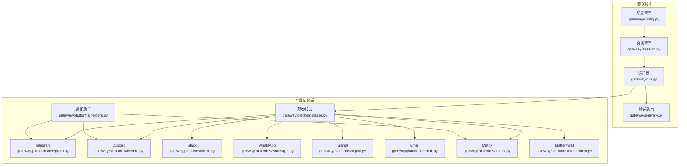
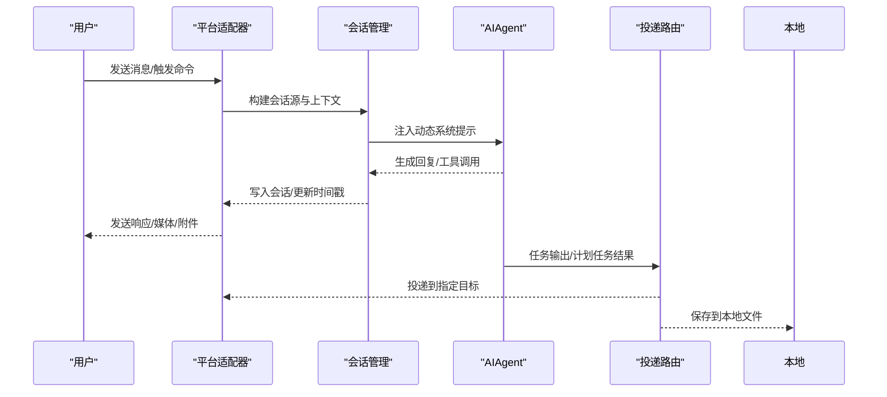
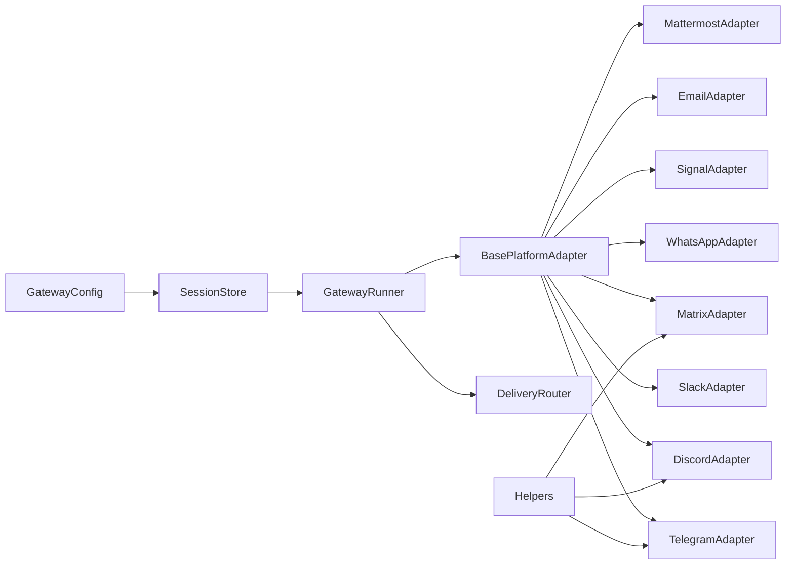
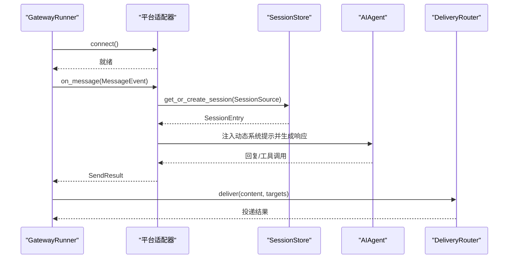

# 消息网关系统

<cite>
**本文档引用的文件**
- [gateway/__init__.py](file://gateway/__init__.py)
- [gateway/config.py](file://gateway/config.py)
- [gateway/session.py](file://gateway/session.py)
- [gateway/platforms/base.py](file://gateway/platforms/base.py)
- [gateway/platforms/__init__.py](file://gateway/platforms/__init__.py)
- [gateway/platforms/telegram.py](file://gateway/platforms/telegram.py)
- [gateway/platforms/discord.py](file://gateway/platforms/discord.py)
- [gateway/platforms/slack.py](file://gateway/platforms/slack.py)
- [gateway/platforms/whatsapp.py](file://gateway/platforms/whatsapp.py)
- [gateway/platforms/signal.py](file://gateway/platforms/signal.py)
- [gateway/platforms/email.py](file://gateway/platforms/email.py)
- [gateway/platforms/matrix.py](file://gateway/platforms/matrix.py)
- [gateway/platforms/mattermost.py](file://gateway/platforms/mattermost.py)
- [gateway/platforms/helpers.py](file://gateway/platforms/helpers.py)
- [gateway/delivery.py](file://gateway/delivery.py)
- [gateway/run.py](file://gateway/run.py)
</cite>

## 目录
1. [简介](#简介)
2. [项目结构](#项目结构)
3. [核心组件](#核心组件)
4. [架构总览](#架构总览)
5. [详细组件分析](#详细组件分析)
6. [依赖关系分析](#依赖关系分析)
7. [性能考量](#性能考量)
8. [故障排除指南](#故障排除指南)
9. [结论](#结论)
10. [附录](#附录)

## 简介
本文件为 Hermes Agent 消息网关系统的全面技术文档。该系统提供统一的消息网关能力，支持多平台消息集成（如 Telegram、Discord、Slack、WhatsApp、Signal、Email、Matrix、Mattermost 等），并具备以下关键能力：
- 会话管理：持久化对话上下文、会话重置策略、动态系统提示注入
- 消息路由：从平台到适配器再到代理的完整消息流
- 权限与安全：平台特定的授权策略、代理执行审批、敏感信息脱敏
- 平台特性：各平台的差异化能力（线程、媒体、语音、提及等）
- 扩展性：统一适配器接口，便于新增平台

## 项目结构
消息网关位于 gateway 目录，核心模块包括：
- 配置管理：加载与校验平台配置、会话重置策略、投递偏好
- 会话管理：会话键生成、会话存储、过期与重置逻辑
- 平台适配器：统一基类与各平台实现（Telegram、Discord、Slack、WhatsApp、Signal、Email、Matrix、Mattermost 等）
- 投递路由：将任务输出或代理响应投递到指定目标（本地文件、平台 home channel、显式目标）
- 运行器：启动与生命周期管理、后台任务、重启与退出

图表来源
- [gateway/config.py:1-1126](file://gateway/config.py#L1-L1126)
- [gateway/session.py:1-1081](file://gateway/session.py#L1-L1081)
- [gateway/platforms/base.py:1-2072](file://gateway/platforms/base.py#L1-L2072)
- [gateway/platforms/telegram.py:1-2787](file://gateway/platforms/telegram.py#L1-L2787)
- [gateway/platforms/discord.py:1-2958](file://gateway/platforms/discord.py#L1-L2958)
- [gateway/platforms/slack.py:1-1671](file://gateway/platforms/slack.py#L1-L1671)
- [gateway/platforms/whatsapp.py:1-913](file://gateway/platforms/whatsapp.py#L1-L913)
- [gateway/platforms/signal.py:1-842](file://gateway/platforms/signal.py#L1-L842)
- [gateway/platforms/email.py:1-626](file://gateway/platforms/email.py#L1-L626)
- [gateway/platforms/matrix.py:1-2065](file://gateway/platforms/matrix.py#L1-L2065)
- [gateway/platforms/mattermost.py:1-734](file://gateway/platforms/mattermost.py#L1-L734)
- [gateway/platforms/helpers.py:1-262](file://gateway/platforms/helpers.py#L1-L262)
- [gateway/delivery.py:1-257](file://gateway/delivery.py#L1-L257)
- [gateway/run.py:1-8911](file://gateway/run.py#L1-L8911)

章节来源
- [gateway/__init__.py:1-36](file://gateway/__init__.py#L1-L36)
- [gateway/config.py:1-1126](file://gateway/config.py#L1-L1126)
- [gateway/session.py:1-1081](file://gateway/session.py#L1-L1081)
- [gateway/platforms/base.py:1-2072](file://gateway/platforms/base.py#L1-L2072)
- [gateway/platforms/helpers.py:1-262](file://gateway/platforms/helpers.py#L1-L262)
- [gateway/delivery.py:1-257](file://gateway/delivery.py#L1-L257)
- [gateway/run.py:1-8911](file://gateway/run.py#L1-L8911)

## 核心组件
- 配置管理（GatewayConfig）：集中管理平台开关、令牌、Home Channel、会话重置策略、快速命令、STT、会话隔离策略、流式传输等；支持从环境变量与 YAML 合并覆盖。
- 会话管理（SessionStore/SessionContext）：构建会话键、跟踪会话元数据、评估过期与重置、动态注入系统提示（含 PII 脱敏）、SQLite/JSONL 存储。
- 平台适配器（BasePlatformAdapter 及子类）：统一抽象消息接收/发送、媒体缓存、文本批聚合、错误与重试、平台特定行为（提及、线程、语音等）。
- 投递路由（DeliveryRouter）：解析目标字符串（origin/local/平台:chat_id[:thread_id]）、本地落盘、平台投递、超长内容截断与保存全量。
- 运行器（GatewayRunner）：加载配置、初始化适配器、事件钩子、内存刷新、后台任务、重启与退出、会话模型覆盖、语音模式持久化。

章节来源
- [gateway/config.py:1-1126](file://gateway/config.py#L1-L1126)
- [gateway/session.py:1-1081](file://gateway/session.py#L1-L1081)
- [gateway/platforms/base.py:1-2072](file://gateway/platforms/base.py#L1-L2072)
- [gateway/delivery.py:1-257](file://gateway/delivery.py#L1-L257)
- [gateway/run.py:512-800](file://gateway/run.py#L512-L800)

## 架构总览
消息网关采用“配置驱动 + 统一适配器 + 会话中心 + 投递路由”的分层设计：
- 配置层：集中定义平台能力与行为边界
- 适配器层：屏蔽平台差异，提供统一接口
- 会话层：跨平台共享上下文与状态
- 路由层：面向任务输出与代理响应的目标选择
- 运行层：生命周期管理、后台任务与重启策略

图表来源
- [gateway/run.py:512-800](file://gateway/run.py#L512-L800)
- [gateway/session.py:187-326](file://gateway/session.py#L187-L326)
- [gateway/delivery.py:107-257](file://gateway/delivery.py#L107-L257)
- [gateway/platforms/base.py:779-800](file://gateway/platforms/base.py#L779-L800)

## 详细组件分析

### 配置管理（GatewayConfig）
- 支持平台枚举（Telegram、Discord、Slack、WhatsApp、Signal、Email、Matrix、Mattermost 等）
- 平台配置（启用、令牌、Home Channel、回复线程模式、额外参数）
- 会话重置策略（按日、空闲、两者皆是、从不），支持按类型/平台覆盖
- 快速命令、STT 开关、会话隔离策略（群组按用户隔离、线程按用户隔离）
- 流式传输配置（编辑进度、节流、光标）
- 环境变量优先级与 YAML 合并覆盖、令牌占位符检测与拒绝

章节来源
- [gateway/config.py:48-429](file://gateway/config.py#L48-L429)
- [gateway/config.py:431-671](file://gateway/config.py#L431-L671)
- [gateway/config.py:673-741](file://gateway/config.py#L673-L741)

### 会话管理（SessionStore/SessionContext）
- 会话键规则：DM/群组/频道/线程的组合，支持按用户隔离与线程隔离策略
- 会话存储：SQLite（推荐）与 JSONL 回退；持久化会话元数据与令牌统计
- 过期与重置：基于空闲分钟数与每日时刻；支持挂起标记以强制重置
- 动态系统提示：注入来源平台、Home Channel、交付选项、平台行为说明；可选 PII 脱敏
- 令牌追踪：输入/输出/缓存读写/总计，用于成本估算与压缩预检

章节来源
- [gateway/session.py:436-493](file://gateway/session.py#L436-L493)
- [gateway/session.py:579-660](file://gateway/session.py#L579-L660)
- [gateway/session.py:683-769](file://gateway/session.py#L683-L769)
- [gateway/session.py:187-326](file://gateway/session.py#L187-L326)

### 平台适配器（BasePlatformAdapter 及子类）
- 基类能力：
  - 文本长度与 UTF-16 计算、消息截断、代理 URL 解析与 SSRF 保护
  - 图像/音频/文档缓存、清理策略
  - 文本批聚合（Photo 相册合并、长文本拼接）
  - 错误分类与自动重试（连接错误）
  - 消息去重、线程参与追踪、Markdown 清理、电话号码脱敏
- Telegram：论坛主题（线程）、MarkdownV2 转义、回退 IP、媒体批处理、轮询网络错误重连
- Discord：语音接收（DAVE E2EE 解密）、线程自动归档、提及/白名单/忽略列表、线程参与追踪
- Slack：Socket Mode、多工作区、AI Assistant 生命周期事件、线程上下文缓存、去重
- WhatsApp：Node.js 桥接（whatsapp-web.js/Baileys/Business API），提及模式、自由回复聊天、队列与日志
- Signal：HTTP 守护进程（signal-cli）、SSE 流、打字指示、健康检查、自聊防回环
- Email：IMAP 接收、SMTP 发送、自动化发件人过滤、HTML 文本提取、附件缓存
- Matrix：mautrix SDK、可选端到端加密、设备密钥存储、未解密事件缓冲
- Mattermost：REST API + WebSocket、回复模式、去重、重连指数退避

章节来源
- [gateway/platforms/base.py:24-800](file://gateway/platforms/base.py#L24-L800)
- [gateway/platforms/telegram.py:114-200](file://gateway/platforms/telegram.py#L114-L200)
- [gateway/platforms/discord.py:80-200](file://gateway/platforms/discord.py#L80-L200)
- [gateway/platforms/slack.py:64-120](file://gateway/platforms/slack.py#L64-L120)
- [gateway/platforms/whatsapp.py:103-200](file://gateway/platforms/whatsapp.py#L103-L200)
- [gateway/platforms/signal.py:140-200](file://gateway/platforms/signal.py#L140-L200)
- [gateway/platforms/email.py:78-160](file://gateway/platforms/email.py#L78-L160)
- [gateway/platforms/matrix.py:196-200](file://gateway/platforms/matrix.py#L196-L200)
- [gateway/platforms/mattermost.py:71-120](file://gateway/platforms/mattermost.py#L71-L120)
- [gateway/platforms/helpers.py:25-262](file://gateway/platforms/helpers.py#L25-L262)

### 投递路由（DeliveryRouter）
- 目标解析：origin、local、平台名、平台:chat_id、平台:chat_id:thread_id
- 本地投递：按作业 ID/名称生成文档，包含时间戳与元数据
- 平台投递：适配器发送，必要时截断超长输出并保存全量
- 元数据透传：线程 ID 等

章节来源
- [gateway/delivery.py:28-105](file://gateway/delivery.py#L28-L105)
- [gateway/delivery.py:107-257](file://gateway/delivery.py#L107-L257)

### 运行器（GatewayRunner）
- 生命周期：加载配置、桥接 config.yaml 到环境变量、初始化会话存储与投递路由、注册钩子、启动平台适配器
- 会话缓存：复用 AIAgent 实例以保持前缀缓存与成本优化
- 内存刷新：会话过期前触发记忆保存流程
- 重启与退出：优雅停机、服务重启退出码、重启排空超时
- 语音模式持久化：聊天级自动 TTS 关闭状态
- 背景任务集合：防止垃圾回收导致任务中断

章节来源
- [gateway/run.py:512-800](file://gateway/run.py#L512-L800)
- [gateway/run.py:700-800](file://gateway/run.py#L700-L800)

## 依赖关系分析
- 配置与会话：GatewayConfig 提供策略，SessionStore 依据策略评估过期与重置
- 适配器与运行器：运行器实例化适配器并注入会话存储与投递路由
- 基类与子类：所有平台适配器继承 BasePlatformAdapter，共享缓存、去重、批聚合等通用能力
- 辅助模块：helpers 提供去重、批聚合、Markdown 清理、线程追踪、电话脱敏等通用能力

图表来源
- [gateway/config.py:220-429](file://gateway/config.py#L220-L429)
- [gateway/session.py:495-769](file://gateway/session.py#L495-L769)
- [gateway/platforms/base.py:779-800](file://gateway/platforms/base.py#L779-L800)
- [gateway/platforms/helpers.py:25-262](file://gateway/platforms/helpers.py#L25-L262)
- [gateway/delivery.py:107-257](file://gateway/delivery.py#L107-L257)
- [gateway/run.py:512-800](file://gateway/run.py#L512-L800)

章节来源
- [gateway/config.py:1-1126](file://gateway/config.py#L1-L1126)
- [gateway/session.py:1-1081](file://gateway/session.py#L1-L1081)
- [gateway/platforms/base.py:1-2072](file://gateway/platforms/base.py#L1-L2072)
- [gateway/platforms/helpers.py:1-262](file://gateway/platforms/helpers.py#L1-L262)
- [gateway/delivery.py:1-257](file://gateway/delivery.py#L1-L257)
- [gateway/run.py:1-8911](file://gateway/run.py#L1-L8911)

## 性能考量
- 会话缓存与前缀缓存：通过复用 AIAgent 实例避免重复构建系统提示，降低大模型调用成本
- 文本批聚合：减少平台消息拆分带来的多次往返与渲染开销
- 缓存与清理：图像/音频/文档缓存定期清理，避免磁盘膨胀
- 重置策略：空闲与每日重置减少上下文膨胀，提升响应质量
- 流式传输：编辑进度与节流参数平衡实时性与平台速率限制
- I/O 与锁：会话索引保存使用临时文件与原子替换，降低锁持有时间

## 故障排除指南
- 平台连接失败
  - 检查令牌/密钥是否正确且非占位符
  - 查看网络代理配置（resolve_proxy_url/proxy_kwargs_for_*）
  - Telegram 轮询冲突与网络错误：查看轮询错误计数与重连逻辑
- 会话重置异常
  - 确认重置策略（空闲分钟数、每日时刻）与会话隔离设置
  - 使用挂起标记强制重置（/stop 后重启）
- 媒体处理问题
  - 图像/音频/文档缓存路径与权限
  - SSRF 保护导致的 URL 拦截
- 投递失败
  - 目标格式是否正确（origin/local/平台:chat_id[:thread_id]）
  - 超长输出被截断，检查本地全量保存路径
- 语音与线程
  - Discord 语音接收需正确配置 DAVE 密钥与 SSRC 映射
  - Slack/Mattermost/Matrix 的线程参与追踪状态文件

章节来源
- [gateway/platforms/base.py:148-231](file://gateway/platforms/base.py#L148-L231)
- [gateway/platforms/telegram.py:172-200](file://gateway/platforms/telegram.py#L172-L200)
- [gateway/platforms/discord.py:85-200](file://gateway/platforms/discord.py#L85-L200)
- [gateway/delivery.py:224-257](file://gateway/delivery.py#L224-L257)
- [gateway/platforms/helpers.py:25-150](file://gateway/platforms/helpers.py#L25-L150)

## 结论
Hermes Agent 消息网关通过统一的适配器接口与完善的会话/配置/投递体系，实现了对多平台消息的高效集成。其设计强调：
- 可靠性：错误分类与自动重试、SSRF 保护、缓存清理
- 可扩展性：平台特定能力与通用辅助模块分离
- 可维护性：配置驱动、会话隔离与重置策略、动态系统提示
- 可观测性：本地落盘、会话令牌统计、健康检查与日志

## 附录

### 平台配置与连接要点
- Telegram
  - 令牌、回复线程模式、回退 IP、DM 主题映射
- Discord
  - 令牌、提及/白名单/忽略列表、自动线程、语音接收
- Slack
  - Socket Mode 令牌、多工作区、AI Assistant 事件、线程上下文缓存
- WhatsApp
  - Node.js 桥接脚本、端口、会话路径、提及模式、自由回复聊天
- Signal
  - HTTP 守护进程 URL 与账户、SSE 健康检查、打字指示
- Email
  - IMAP/SMTP 主机与凭据、轮询间隔、允许用户列表
- Matrix
  - homeserver、访问令牌/密码、可选 E2EE、设备 ID、允许用户
- Mattermost
  - 服务器 URL 与令牌、回复模式、去重、重连退避

章节来源
- [gateway/platforms/telegram.py:132-164](file://gateway/platforms/telegram.py#L132-L164)
- [gateway/platforms/discord.py:117-180](file://gateway/platforms/discord.py#L117-L180)
- [gateway/platforms/slack.py:117-180](file://gateway/platforms/slack.py#L117-L180)
- [gateway/platforms/whatsapp.py:129-147](file://gateway/platforms/whatsapp.py#L129-L147)
- [gateway/platforms/signal.py:184-200](file://gateway/platforms/signal.py#L184-L200)
- [gateway/platforms/email.py:78-87](file://gateway/platforms/email.py#L78-L87)
- [gateway/platforms/matrix.py:133-167](file://gateway/platforms/matrix.py#L133-L167)
- [gateway/platforms/mattermost.py:195-200](file://gateway/platforms/mattermost.py#L195-L200)

### 消息传递流程（代码级）

图表来源
- [gateway/run.py:512-800](file://gateway/run.py#L512-L800)
- [gateway/platforms/base.py:779-800](file://gateway/platforms/base.py#L779-L800)
- [gateway/session.py:683-769](file://gateway/session.py#L683-L769)
- [gateway/delivery.py:127-167](file://gateway/delivery.py#L127-L167)

### 扩展新平台适配器指南
- 继承 BasePlatformAdapter，实现 connect/send/message 处理
- 处理平台特有能力：线程、提及、媒体、语音
- 使用缓存工具：图片/音频/文档缓存与清理
- 遵循错误分类与重试策略，确保连接错误自动重试
- 在 GatewayConfig 中添加平台枚举与默认配置项
- 在运行器中注册适配器并接入会话存储与投递路由

章节来源
- [gateway/platforms/base.py:779-800](file://gateway/platforms/base.py#L779-L800)
- [gateway/platforms/helpers.py:319-370](file://gateway/platforms/helpers.py#L319-L370)
- [gateway/config.py:48-97](file://gateway/config.py#L48-L97)
- [gateway/run.py:512-800](file://gateway/run.py#L512-L800)