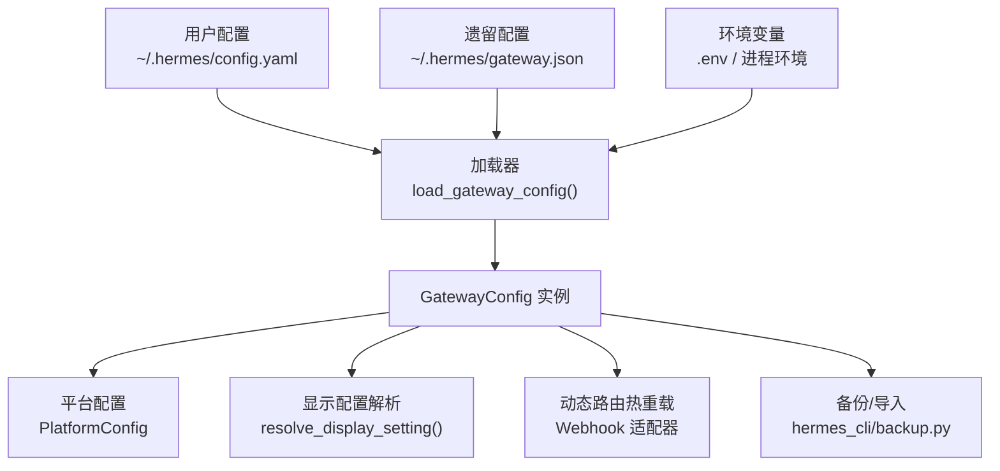
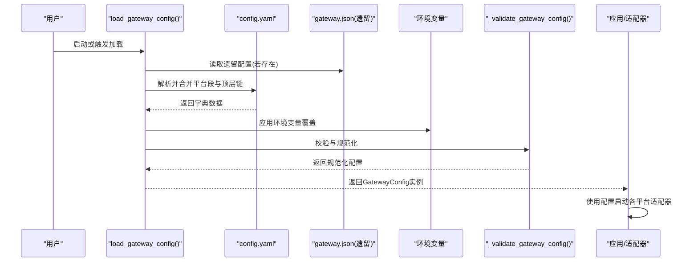
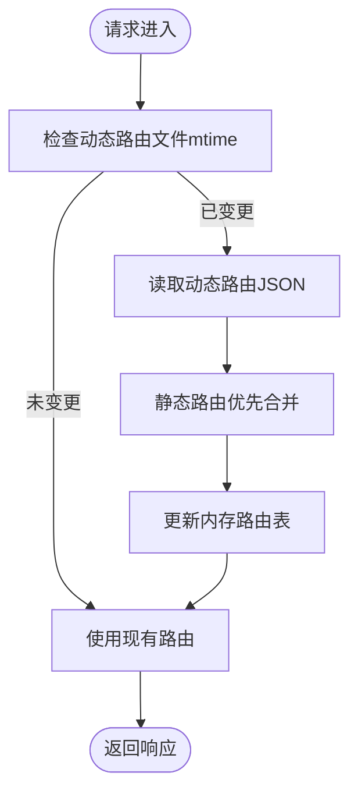
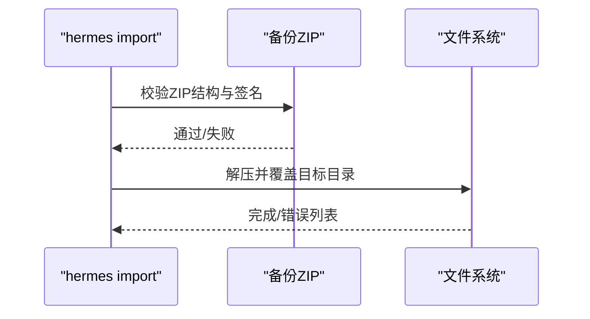
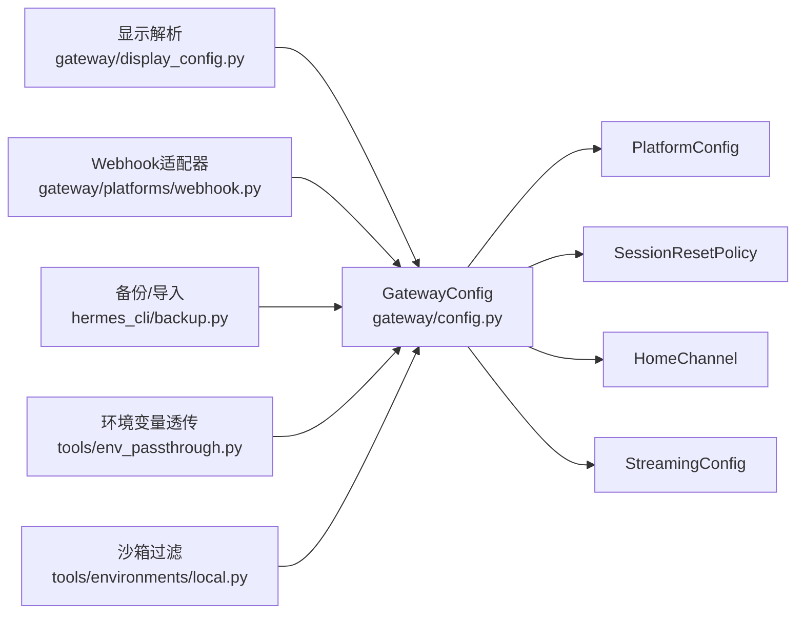

# 网关配置

<cite>
**本文引用的文件**
- [gateway/config.py](file://gateway/config.py)
- [gateway/display_config.py](file://gateway/display_config.py)
- [cli-config.yaml.example](file://cli-config.yaml.example)
- [docs/skins/example-skin.yaml](file://docs/skins/example-skin.yaml)
- [hermes_cli/config.py](file://hermes_cli/config.py)
- [hermes_cli/backup.py](file://hermes_cli/backup.py)
- [gateway/platforms/webhook.py](file://gateway/platforms/webhook.py)
- [gateway/restart.py](file://gateway/restart.py)
- [tools/env_passthrough.py](file://tools/env_passthrough.py)
- [tools/environments/local.py](file://tools/environments/local.py)
- [tests/gateway/test_webhook_dynamic_routes.py](file://tests/gateway/test_webhook_dynamic_routes.py)
- [tests/hermes_cli/test_backup.py](file://tests/hermes_cli/test_backup.py)
</cite>

## 目录
1. [简介](#简介)
2. [项目结构](#项目结构)
3. [核心组件](#核心组件)
4. [架构总览](#架构总览)
5. [详细组件分析](#详细组件分析)
6. [依赖关系分析](#依赖关系分析)
7. [性能考量](#性能考量)
8. [故障排查指南](#故障排查指南)
9. [结论](#结论)
10. [附录](#附录)

## 简介
本文件面向Hermes Agent消息网关的配置系统，聚焦GatewayConfig与PlatformConfig的数据结构、配置来源与合并策略、默认值与校验规则、显示配置的定制与主题设置、配置热重载与运行时修改、配置备份与恢复、配置模板与示例、配置迁移指南，以及配置安全与敏感信息保护、环境变量注入机制等。

## 项目结构
网关配置相关的核心位置：
- 网关配置模型与加载：gateway/config.py
- 平台显示配置解析：gateway/display_config.py
- CLI配置示例（含会话重置、流式传输、语音转写等）：cli-config.yaml.example
- 皮肤模板（主题与外观）：docs/skins/example-skin.yaml
- CLI配置管理与环境变量：hermes_cli/config.py
- 备份与导入命令：hermes_cli/backup.py
- 动态路由热重载（Webhook适配器）：gateway/platforms/webhook.py
- 网关重启与排空超时：gateway/restart.py
- 环境变量透传与沙箱过滤：tools/env_passthrough.py、tools/environments/local.py

**图表来源**
- [gateway/config.py:431-670](file://gateway/config.py#L431-L670)
- [gateway/display_config.py:104-164](file://gateway/display_config.py#L104-L164)
- [gateway/platforms/webhook.py:257-287](file://gateway/platforms/webhook.py#L257-L287)
- [hermes_cli/backup.py:79-188](file://hermes_cli/backup.py#L79-L188)

**章节来源**
- [gateway/config.py:431-670](file://gateway/config.py#L431-L670)
- [gateway/display_config.py:104-164](file://gateway/display_config.py#L104-L164)
- [cli-config.yaml.example:421-444](file://cli-config.yaml.example#L421-L444)
- [docs/skins/example-skin.yaml:12-90](file://docs/skins/example-skin.yaml#L12-L90)
- [hermes_cli/backup.py:79-188](file://hermes_cli/backup.py#L79-L188)

## 核心组件
- GatewayConfig：主配置容器，管理平台集合、会话重置策略、快速命令、存储路径、交付偏好、STT开关、会话隔离、未授权私信行为、实时流式传输等。
- PlatformConfig：单个平台的配置，包括启用状态、令牌、额外参数、回复线程模式等。
- HomeChannel：平台默认投递目标（Home Channel），用于无显式聊天ID时的投递。
- StreamingConfig：实时token流式传输配置（启用、传输方式、编辑间隔、缓冲阈值、光标）。
- SessionResetPolicy：会话重置策略（模式、每日重置小时、空闲分钟、通知与排除平台）。
- 显示配置解析：resolve_display_setting() 提供按平台覆盖的显示设置解析，支持全局默认与平台默认层级。

**章节来源**
- [gateway/config.py:71-417](file://gateway/config.py#L71-L417)
- [gateway/display_config.py:29-101](file://gateway/display_config.py#L29-L101)

## 架构总览
配置加载与生效流程如下：

**图表来源**
- [gateway/config.py:431-670](file://gateway/config.py#L431-L670)

## 详细组件分析

### GatewayConfig 数据结构与字段
- 平台集合：platforms: Dict[Platform, PlatformConfig]
- 默认与按类型/平台的重置策略：default_reset_policy、reset_by_type、reset_by_platform
- 重置触发命令：reset_triggers
- 快速命令：quick_commands
- 存储路径：sessions_dir
- 交付偏好：always_log_local
- STT开关：stt_enabled
- 会话隔离：group_sessions_per_user、thread_sessions_per_user
- 未授权私信行为：unauthorized_dm_behavior
- 流式传输：streaming: StreamingConfig

加载与合并优先级（最高到最低）：
- 环境变量
- ~/.hermes/config.yaml（主配置）
- ~/.hermes/gateway.json（遗留配置，提供默认）
- 内置默认

默认值与校验要点：
- at_hour必须在0-23；idle_minutes必须为正数，否则回退到默认
- 对已启用但令牌为空字符串的平台发出警告
- 对已启用且令牌为占位符的平台，直接禁用该平台配置以避免连接失败

**章节来源**
- [gateway/config.py:221-417](file://gateway/config.py#L221-L417)
- [gateway/config.py:673-740](file://gateway/config.py#L673-L740)

### PlatformConfig 与 HomeChannel
- PlatformConfig字段：enabled、token、api_key、home_channel、reply_to_mode、extra
- HomeChannel字段：platform、chat_id、name
- reply_to_mode支持"off"/"first"/"all"，控制多段回复是否对原消息进行线程回复
- extra用于承载平台特定配置（如WeCom回调、Feishu凭据、Signal HTTP地址等）

**章节来源**
- [gateway/config.py:142-187](file://gateway/config.py#L142-L187)
- [gateway/config.py:71-97](file://gateway/config.py#L71-L97)

### 会话重置策略
- 模式：daily/idle/both/none
- at_hour：每日重置小时（本地时间）
- idle_minutes：空闲超时（分钟）
- notify：自动重置时是否通知
- notify_exclude_platforms：不发送重置通知的平台集合

解析优先级：平台覆盖 > 类型覆盖 > 默认

**章节来源**
- [gateway/config.py:100-140](file://gateway/config.py#L100-L140)
- [gateway/config.py:315-334](file://gateway/config.py#L315-L334)

### 显示配置解析与主题设置
resolve_display_setting() 的解析顺序：
1) display.platforms.<platform>.<key> 显式平台覆盖
2) display.<key> 全局用户设置
3) 平台内置默认（按编辑能力分层：高/中/低/最小）
4) 全局默认

平台默认分层（编辑能力）：
- 高：Telegram、Discord
- 中：Slack、Mattermost、Matrix、Feishu
- 低：Signal、WhatsApp、BlueBubbles、Weixin、WeCom、DingTalk
- 最小：Email、SMS、Webhook、HomeAssistant、API Server

主题与外观通过皮肤模板实现，可自定义颜色、旋转器、品牌文案、工具输出前缀等。

**章节来源**
- [gateway/display_config.py:104-164](file://gateway/display_config.py#L104-L164)
- [gateway/display_config.py:29-98](file://gateway/display_config.py#L29-L98)
- [docs/skins/example-skin.yaml:12-90](file://docs/skins/example-skin.yaml#L12-L90)

### 配置加载机制与默认值
- 主配置：~/.hermes/config.yaml
- 遗留配置：~/.hermes/gateway.json（仅提供默认）
- 环境变量：优先于配置文件
- 平台段落桥接：config.yaml中的平台段（如telegram: {...}）会桥接到platforms.telegram.extra，确保遗留extra键保留
- 平台特定环境变量注入：当未设置对应环境变量时，从config.yaml桥接注入（如Slack/Discord/Telegram/WhatsApp/Matriix等）

**章节来源**
- [gateway/config.py:431-670](file://gateway/config.py#L431-L670)

### 验证规则与安全
- 重置策略边界校验：at_hour与idle_minutes的合法性检查与回退
- 令牌有效性：对空字符串令牌发出警告；对疑似占位符令牌进行拒绝并禁用平台
- 环境变量安全：默认沙箱过滤敏感变量（KEY/TOKEN/SECRET/PASSWORD/CREDENTIAL等），允许通过env_passthrough显式白名单透传

**章节来源**
- [gateway/config.py:673-740](file://gateway/config.py#L673-L740)
- [tools/env_passthrough.py:1-35](file://tools/env_passthrough.py#L1-L35)
- [tools/environments/local.py:110-124](file://tools/environments/local.py#L110-L124)

### 配置热重载与运行时修改
- Webhook动态路由热重载：适配器在每次请求时基于mtime门控重新加载动态订阅文件，并与静态路由合并（静态优先）
- 网关重启与排空：通过系统服务重启退出码与排空超时控制优雅重启

**图表来源**
- [gateway/platforms/webhook.py:257-287](file://gateway/platforms/webhook.py#L257-L287)

**章节来源**
- [gateway/platforms/webhook.py:257-287](file://gateway/platforms/webhook.py#L257-L287)
- [tests/gateway/test_webhook_dynamic_routes.py:38-87](file://tests/gateway/test_webhook_dynamic_routes.py#L38-L87)
- [gateway/restart.py:1-21](file://gateway/restart.py#L1-L21)

### 配置备份与恢复
- 备份：打包~/.hermes目录（排除仓库与临时文件），生成zip
- 导入：校验zip结构，检测前缀，覆盖当前根目录内容
- 容错：即使部分模块缺失也能尽量恢复文件

**图表来源**
- [hermes_cli/backup.py:194-279](file://hermes_cli/backup.py#L194-L279)
- [tests/hermes_cli/test_backup.py:920-935](file://tests/hermes_cli/test_backup.py#L920-L935)

**章节来源**
- [hermes_cli/backup.py:79-188](file://hermes_cli/backup.py#L79-L188)
- [hermes_cli/backup.py:194-279](file://hermes_cli/backup.py#L194-L279)
- [tests/hermes_cli/test_backup.py:920-935](file://tests/hermes_cli/test_backup.py#L920-L935)

### 配置模板、示例与迁移
- CLI配置示例：包含模型、终端后端、上下文压缩、会话重置、流式传输、语音转写、显示等完整示例
- 网关配置模板：由config.yaml示例提供（平台段、session_reset、quick_commands、stt、streaming等）
- 迁移：提供从OpenClaw到Hermes的迁移脚本与流程（包含备份、选择迁移项、执行迁移）

**章节来源**
- [cli-config.yaml.example:421-444](file://cli-config.yaml.example#L421-L444)
- [cli-config.yaml.example:691-701](file://cli-config.yaml.example#L691-L701)
- [cli-config.yaml.example:765-796](file://cli-config.yaml.example#L765-L796)

### 环境变量注入与安全
- 平台特定环境变量：当config.yaml中未设置对应环境变量时，从config.yaml桥接注入（如require_mention、free_response_*、auto_thread、reactions等）
- 环境变量透传：通过env_passthrough注册表在沙箱执行前决定是否放行敏感变量
- 沙箱过滤：默认过滤敏感前缀与子串，仅允许白名单变量通过

**章节来源**
- [gateway/config.py:565-653](file://gateway/config.py#L565-L653)
- [tools/env_passthrough.py:1-35](file://tools/env_passthrough.py#L1-L35)
- [tools/environments/local.py:110-124](file://tools/environments/local.py#L110-L124)

## 依赖关系分析

**图表来源**
- [gateway/config.py:221-417](file://gateway/config.py#L221-L417)
- [gateway/display_config.py:104-164](file://gateway/display_config.py#L104-L164)
- [gateway/platforms/webhook.py:257-287](file://gateway/platforms/webhook.py#L257-L287)
- [hermes_cli/backup.py:79-188](file://hermes_cli/backup.py#L79-L188)
- [tools/env_passthrough.py:1-35](file://tools/env_passthrough.py#L1-L35)
- [tools/environments/local.py:110-124](file://tools/environments/local.py#L110-L124)

**章节来源**
- [gateway/config.py:221-417](file://gateway/config.py#L221-L417)
- [gateway/display_config.py:104-164](file://gateway/display_config.py#L104-L164)
- [gateway/platforms/webhook.py:257-287](file://gateway/platforms/webhook.py#L257-L287)
- [hermes_cli/backup.py:79-188](file://hermes_cli/backup.py#L79-L188)
- [tools/env_passthrough.py:1-35](file://tools/env_passthrough.py#L1-L35)
- [tools/environments/local.py:110-124](file://tools/environments/local.py#L110-L124)

## 性能考量
- 配置加载：YAML解析与深度合并、环境变量覆盖、校验均为轻量操作，开销可忽略
- 动态路由热重载：基于mtime门控，仅在文件变更时读取与合并，成本极低
- 流式传输：edit_interval与buffer_threshold影响消息编辑频率与网络负载，需根据平台速率限制调整
- 会话重置：合理的idle_minutes与at_hour可降低API调用成本与上下文膨胀

## 故障排查指南
- 配置语法错误：config.yaml解析失败会回退到遗留配置与环境变量，检查语法与键名
- 令牌问题：启用但令牌为空字符串或疑似占位符会被禁用，请确认环境变量或config.yaml中的令牌
- 动态路由不生效：检查动态路由文件是否存在、JSON格式是否正确、mtime是否变化
- 备份/导入失败：确认zip完整性与权限，必要时手动解压覆盖

**章节来源**
- [gateway/config.py:654-660](file://gateway/config.py#L654-L660)
- [gateway/config.py:715-740](file://gateway/config.py#L715-L740)
- [gateway/platforms/webhook.py:275-277](file://gateway/platforms/webhook.py#L275-L277)
- [hermes_cli/backup.py:253-279](file://hermes_cli/backup.py#L253-L279)

## 结论
Hermes Agent网关配置系统通过清晰的数据模型、严格的加载与校验流程、灵活的显示与主题定制、稳健的安全与环境变量处理，以及对动态路由与备份恢复的支持，提供了生产可用的配置体验。建议在生产环境中：
- 使用config.yaml集中管理配置，必要时通过环境变量进行覆盖
- 严格管理令牌与敏感变量，仅在需要时通过env_passthrough透传
- 利用会话重置策略与流式传输优化成本与用户体验
- 定期备份~/.hermes目录，确保可快速恢复

## 附录
- 示例配置参考：cli-config.yaml.example中的“会话重置”、“流式传输”、“语音转写”、“显示”等段落
- 皮肤模板：docs/skins/example-skin.yaml
- 运行时热重载：Webhook适配器的动态路由热重载机制
- 备份与恢复：hermes_cli/backup.py提供的备份与导入命令