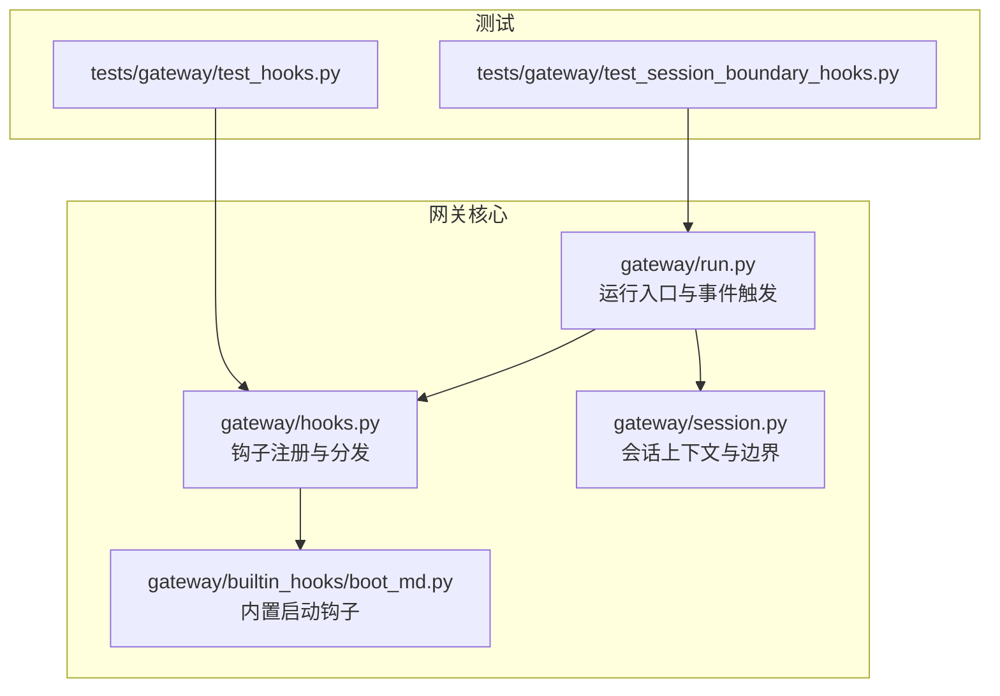
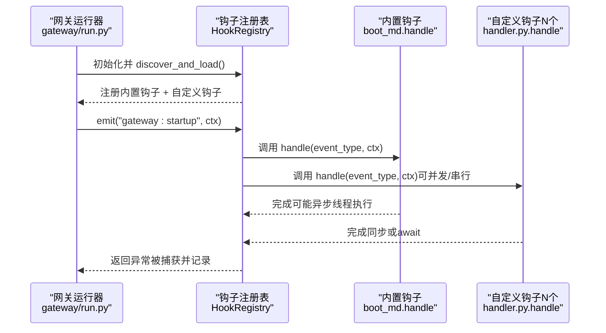
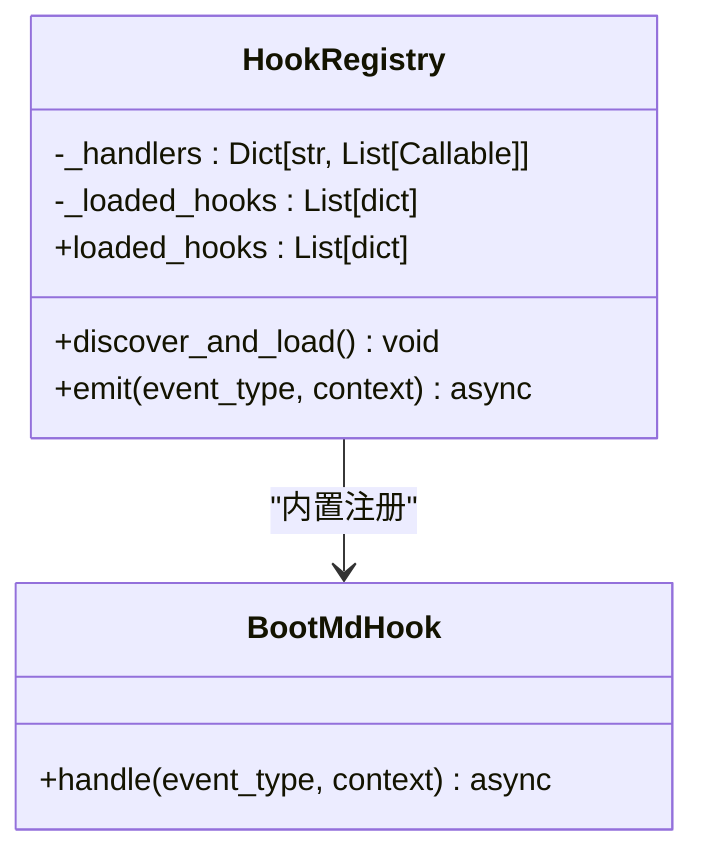
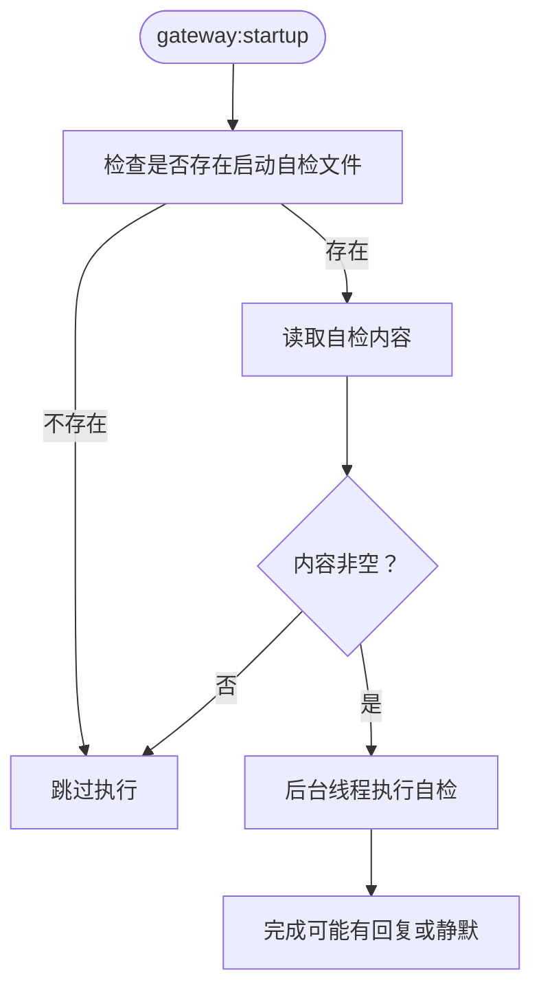
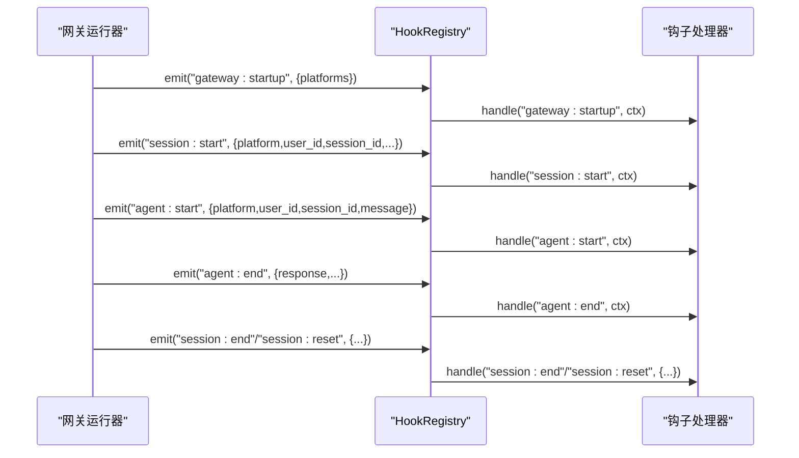
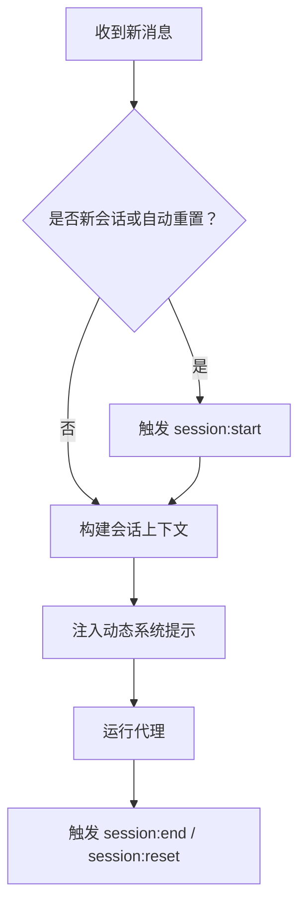
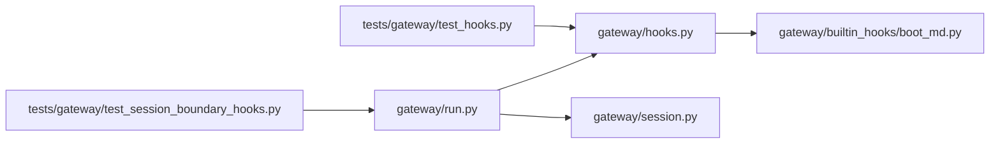

# 网关钩子

<cite>
**本文引用的文件**
- [gateway/hooks.py](file://gateway/hooks.py)
- [gateway/builtin_hooks/boot_md.py](file://gateway/builtin_hooks/boot_md.py)
- [gateway/run.py](file://gateway/run.py)
- [gateway/session.py](file://gateway/session.py)
- [tests/gateway/test_hooks.py](file://tests/gateway/test_hooks.py)
- [tests/gateway/test_session_boundary_hooks.py](file://tests/gateway/test_session_boundary_hooks.py)
</cite>

## 目录
1. [简介](#简介)
2. [项目结构](#项目结构)
3. [核心组件](#核心组件)
4. [架构总览](#架构总览)
5. [详细组件分析](#详细组件分析)
6. [依赖分析](#依赖分析)
7. [性能考量](#性能考量)
8. [故障排查指南](#故障排查指南)
9. [结论](#结论)
10. [附录](#附录)

## 简介
本文件系统性阐述 Hermes Agent 消息网关的钩子（Hook）机制：设计原理、事件类型与触发时机、内置钩子与自定义钩子的实现方式、注册与执行顺序、错误处理策略、安全限制、性能影响与调试方法，并给出最佳实践与常见使用场景。

钩子系统是一个轻量级事件驱动框架，在关键生命周期节点触发用户或内置处理器，确保主流程不被钩子错误阻断，同时允许扩展与定制化行为（如启动自检、会话边界动作、消息处理前后处理等）。

## 项目结构
与钩子相关的核心位置如下：
- 钩子注册与事件分发：gateway/hooks.py
- 内置钩子：gateway/builtin_hooks/boot_md.py
- 钩子在网关运行时的触发点：gateway/run.py
- 会话上下文与边界：gateway/session.py
- 测试用例：tests/gateway/test_hooks.py、tests/gateway/test_session_boundary_hooks.py

**图表来源**
- [gateway/run.py](file://gateway/run.py)
- [gateway/hooks.py](file://gateway/hooks.py)
- [gateway/builtin_hooks/boot_md.py](file://gateway/builtin_hooks/boot_md.py)
- [gateway/session.py](file://gateway/session.py)
- [tests/gateway/test_hooks.py](file://tests/gateway/test_hooks.py)
- [tests/gateway/test_session_boundary_hooks.py](file://tests/gateway/test_session_boundary_hooks.py)

**章节来源**
- [gateway/hooks.py](file://gateway/hooks.py)
- [gateway/builtin_hooks/boot_md.py](file://gateway/builtin_hooks/boot_md.py)
- [gateway/run.py](file://gateway/run.py)
- [gateway/session.py](file://gateway/session.py)
- [tests/gateway/test_hooks.py](file://tests/gateway/test_hooks.py)
- [tests/gateway/test_session_boundary_hooks.py](file://tests/gateway/test_session_boundary_hooks.py)

## 核心组件
- HookRegistry：负责发现、加载与发射事件钩子；支持通配符匹配；对异常进行捕获但不中断主流程。
- 内置钩子：在每次网关启动时自动注册并执行，例如“启动自检”钩子。
- 触发点：网关启动、会话开始/结束/重置、代理开始/结束、命令执行等。

关键职责与接口要点：
- 发现与加载：扫描用户目录下的钩子包，读取元数据并动态导入处理器模块。
- 事件发射：按精确匹配与通配符匹配收集处理器，依次同步或异步执行。
- 错误隔离：钩子异常被捕获并记录，不影响主流程。
- 上下文传递：事件携带结构化上下文字典，便于钩子读取环境信息。

**章节来源**
- [gateway/hooks.py](file://gateway/hooks.py)
- [gateway/builtin_hooks/boot_md.py](file://gateway/builtin_hooks/boot_md.py)

## 架构总览
钩子系统围绕 HookRegistry 展开，运行时由网关在恰当的生命周期节点调用 emit 触发钩子。内置钩子在启动阶段即被注册，自定义钩子通过用户目录下的钩子包动态加载。

**图表来源**
- [gateway/run.py](file://gateway/run.py)
- [gateway/hooks.py](file://gateway/hooks.py)
- [gateway/builtin_hooks/boot_md.py](file://gateway/builtin_hooks/boot_md.py)

## 详细组件分析

### HookRegistry 类与事件模型
- 事件类型
  - 系统启动：gateway:startup
  - 会话边界：session:start、session:end、session:reset
  - 代理生命周期：agent:start、agent:end、agent:step
  - 命令执行：command:*（通配符）
- 加载策略
  - 内置钩子：始终注册（如启动自检）
  - 自定义钩子：扫描用户家目录下钩子包，要求 HOOK.yaml 与 handler.py
- 执行模型
  - 支持同步与异步处理器
  - 通配符匹配仅作用于 base 类型（如 command:* 匹配所有以 command: 开头的事件）
  - 异常捕获与日志记录，不阻断后续处理器与主流程

**图表来源**
- [gateway/hooks.py](file://gateway/hooks.py)
- [gateway/builtin_hooks/boot_md.py](file://gateway/builtin_hooks/boot_md.py)

**章节来源**
- [gateway/hooks.py](file://gateway/hooks.py)

### 内置钩子：启动自检（boot_md）
- 作用：在网关启动时读取用户家目录下的启动自检文件，若存在则在后台线程中以代理身份执行该清单，必要时向平台发送结果摘要，否则静默完成。
- 触发时机：gateway:startup
- 安全与性能
  - 后台线程执行，避免阻塞启动
  - 若无自检内容或文件为空，则直接跳过
  - 失败会被记录但不影响启动

**图表来源**
- [gateway/builtin_hooks/boot_md.py](file://gateway/builtin_hooks/boot_md.py)

**章节来源**
- [gateway/builtin_hooks/boot_md.py](file://gateway/builtin_hooks/boot_md.py)

### 事件触发点与上下文
- 网关启动：在运行器初始化后立即触发 gateway:startup，并传入已连接平台列表等上下文。
- 会话边界：
  - 新会话创建时触发 session:start，携带平台、用户ID、会话标识等
  - 会话结束时触发 session:end
  - 会话重置完成后触发 session:reset
- 代理生命周期：
  - 代理开始处理消息时触发 agent:start，携带平台、用户ID、会话标识与消息片段
  - 代理结束处理时触发 agent:end，携带响应片段等
  - 工具循环每轮触发 agent:step（运行器内部引用处）
- 命令执行：任何斜杠命令都会触发对应 command:* 事件，便于统一拦截与审计

**图表来源**
- [gateway/run.py](file://gateway/run.py)
- [gateway/hooks.py](file://gateway/hooks.py)

**章节来源**
- [gateway/run.py](file://gateway/run.py)

### 会话边界钩子与上下文注入
- 会话上下文构建：在新会话开始前，运行器会构建动态系统提示上下文，注入平台、聊天通道、用户信息等，供代理理解当前会话背景。
- 边界钩子触发：在会话状态变化的关键点触发 session:start、session:end、session:reset，便于外部逻辑（如审计、通知、清理）介入。
- 自动技能加载：在新会话时可按配置自动加载技能内容，作为系统提示的一部分注入。

**图表来源**
- [gateway/run.py](file://gateway/run.py)
- [gateway/session.py](file://gateway/session.py)

**章节来源**
- [gateway/run.py](file://gateway/run.py)
- [gateway/session.py](file://gateway/session.py)

### 消息处理钩子（agent:start/end/step）
- agent:start：在代理开始处理前触发，适合做预处理（如权限校验、速率限制统计、审计日志）。
- agent:end：在代理结束处理后触发，适合做后处理（如统计耗时、持久化中间态、清理资源）。
- agent:step：在工具调用循环的每一步触发，适合做细粒度监控与审计。

注意：agent:step 的触发点位于运行器内部引用处，用于在代理工具循环中逐轮发射事件，便于外部观察与干预。

**章节来源**
- [gateway/run.py](file://gateway/run.py)

### 命令处理钩子（command:*）
- 任何斜杠命令都会触发对应 command:* 事件，例如 /reset、/new、/help 等。
- 可通过通配符监听所有命令，实现统一的命令审计、限流或路由。

**章节来源**
- [gateway/run.py](file://gateway/run.py)

## 依赖分析
- HookRegistry 依赖用户家目录下的钩子包结构（HOOK.yaml 与 handler.py），并通过动态导入加载处理器。
- 内置钩子 boot_md 依赖运行器提供的代理执行能力与后台线程机制。
- 运行器在多个生命周期节点调用 emit，形成钩子与主流程的弱耦合。

**图表来源**
- [gateway/run.py](file://gateway/run.py)
- [gateway/hooks.py](file://gateway/hooks.py)
- [gateway/builtin_hooks/boot_md.py](file://gateway/builtin_hooks/boot_md.py)
- [gateway/session.py](file://gateway/session.py)
- [tests/gateway/test_hooks.py](file://tests/gateway/test_hooks.py)
- [tests/gateway/test_session_boundary_hooks.py](file://tests/gateway/test_session_boundary_hooks.py)

**章节来源**
- [gateway/hooks.py](file://gateway/hooks.py)
- [gateway/run.py](file://gateway/run.py)
- [gateway/builtin_hooks/boot_md.py](file://gateway/builtin_hooks/boot_md.py)
- [gateway/session.py](file://gateway/session.py)
- [tests/gateway/test_hooks.py](file://tests/gateway/test_hooks.py)
- [tests/gateway/test_session_boundary_hooks.py](file://tests/gateway/test_session_boundary_hooks.py)

## 性能考量
- 异步与并发：钩子处理器可为同步或异步函数，emit 会等待协程完成；建议钩子内部避免长时间阻塞操作。
- 后台线程：内置启动自检采用后台线程执行，避免阻塞启动；自定义钩子也应遵循此原则。
- 通配符匹配：通配符仅匹配 base 类型，不会对每个事件都进行全量匹配，降低开销。
- 错误隔离：钩子异常被捕获并记录，不影响主流程；但频繁失败会影响可观测性与调试效率。
- 资源管理：在 agent:end 中进行资源清理与持久化，避免泄漏；在 session:end/session:reset 中进行会话级清理。

[本节为通用指导，无需特定文件来源]

## 故障排查指南
- 钩子未生效
  - 检查钩子包目录结构是否包含 HOOK.yaml 与 handler.py
  - 确认 HOOK.yaml 中 events 字段声明了目标事件
  - 确认 handler.py 中存在顶层 handle 函数（同步或异步）
- 钩子报错但主流程不受影响
  - 查看日志中关于钩子异常的记录，定位具体处理器
  - 将钩子临时禁用以确认问题是否由钩子引起
- 启动自检未执行
  - 确认用户家目录下存在启动自检文件且内容非空
  - 检查后台线程是否正常启动
- 会话边界钩子未触发
  - 确认运行器在相应生命周期节点确实调用了 emit
  - 检查会话状态变化逻辑（新会话判定、自动重置）

**章节来源**
- [gateway/hooks.py](file://gateway/hooks.py)
- [gateway/builtin_hooks/boot_md.py](file://gateway/builtin_hooks/boot_md.py)
- [tests/gateway/test_hooks.py](file://tests/gateway/test_hooks.py)
- [tests/gateway/test_session_boundary_hooks.py](file://tests/gateway/test_session_boundary_hooks.py)

## 结论
Hermes Agent 的钩子系统通过 HookRegistry 提供了轻量、灵活且强扩展性的事件机制。内置钩子保障启动自检等基础能力，自定义钩子通过标准目录结构与元数据即可无缝接入。运行器在关键生命周期节点触发事件，配合上下文传递与通配符匹配，满足从审计、通知到复杂业务编排的多种需求。遵循异步、后台线程与资源清理等最佳实践，可在保证主流程稳定的同时最大化扩展价值。

[本节为总结性内容，无需特定文件来源]

## 附录

### 钩子类型与触发时机速览
- 系统启动：gateway:startup（网关启动后）
- 会话边界：session:start（新会话）、session:end（会话结束）、session:reset（会话重置完成）
- 代理生命周期：agent:start（代理开始处理）、agent:end（代理结束处理）、agent:step（工具循环每步）
- 命令执行：command:*（任意斜杠命令）

**章节来源**
- [gateway/run.py](file://gateway/run.py)
- [gateway/hooks.py](file://gateway/hooks.py)

### 自定义钩子开发步骤
- 在用户家目录下创建钩子包目录
- 编写 HOOK.yaml（至少包含 name 与 events）
- 编写 handler.py，导出顶层 handle(event_type, context) 函数（同步或异步）
- 在钩子内读取 context 获取上下文信息，执行所需逻辑
- 使用测试用例验证事件触发与上下文传递

**章节来源**
- [gateway/hooks.py](file://gateway/hooks.py)
- [tests/gateway/test_hooks.py](file://tests/gateway/test_hooks.py)