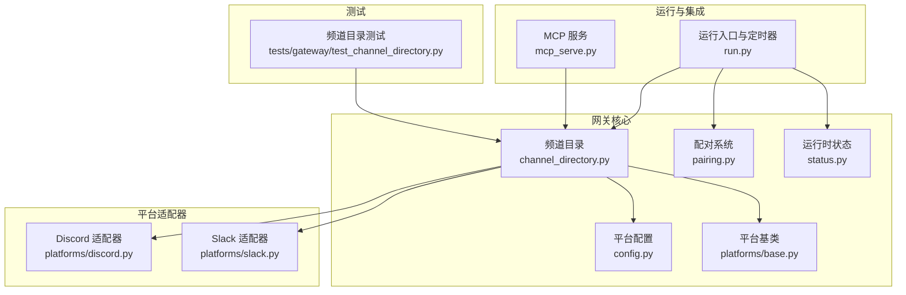
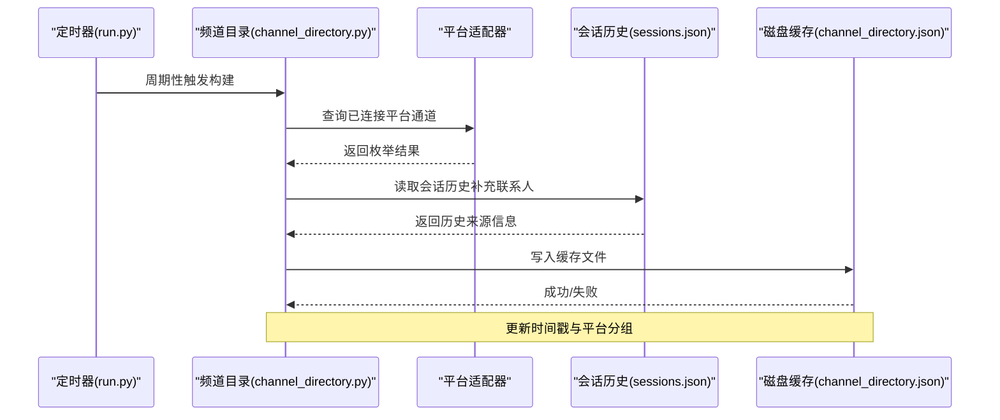
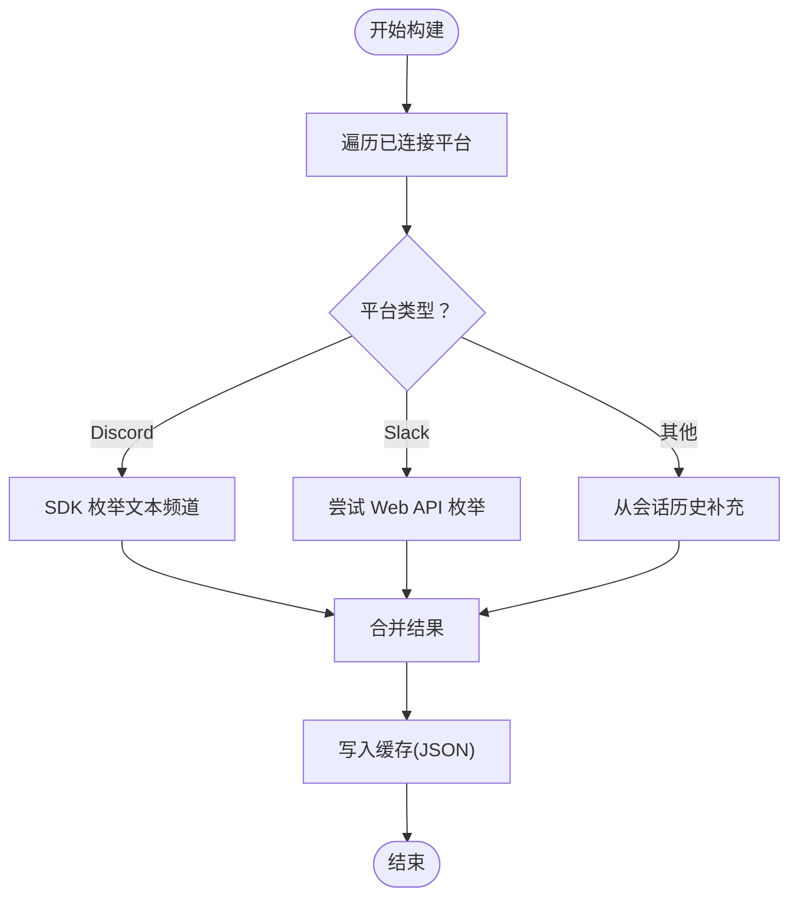
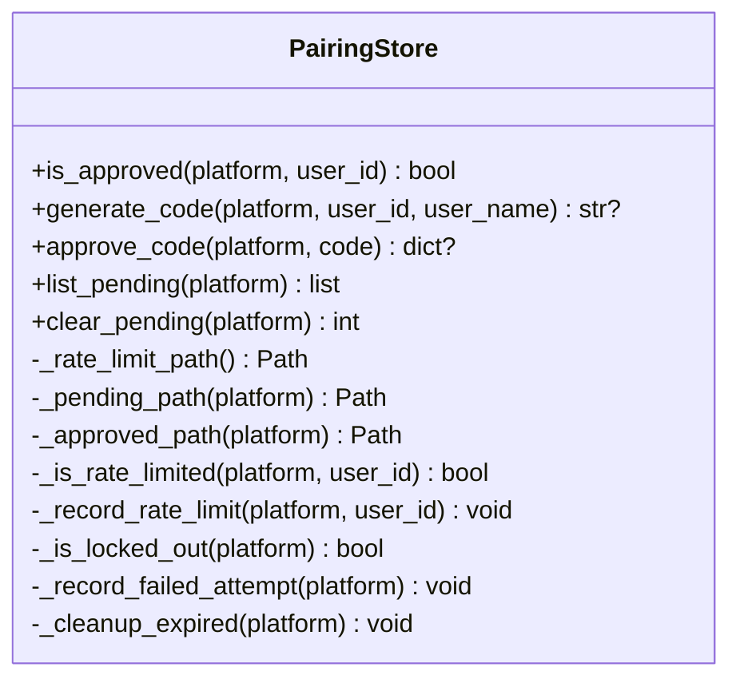
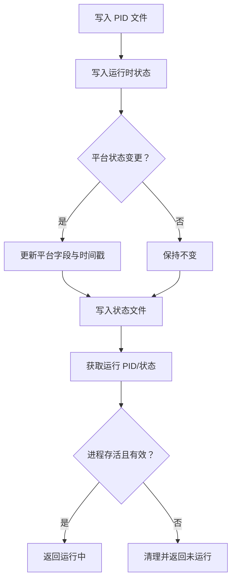
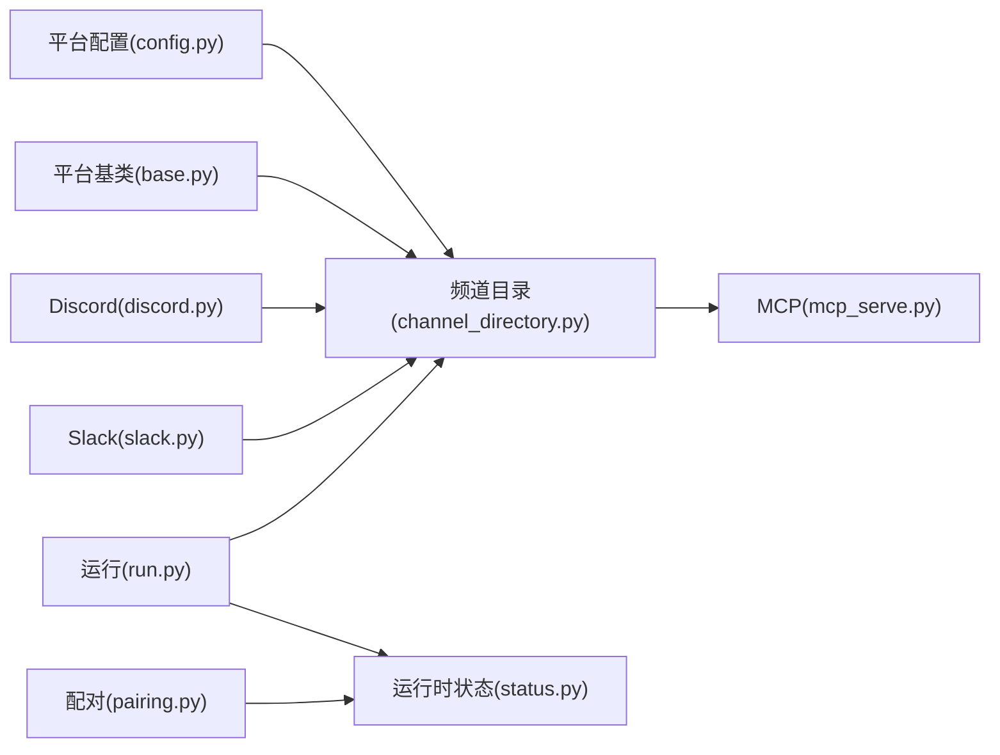

# 频道目录

<cite>
**本文引用的文件**
- [channel_directory.py](file://gateway/channel_directory.py)
- [pairing.py](file://gateway/pairing.py)
- [status.py](file://gateway/status.py)
- [config.py](file://gateway/config.py)
- [base.py](file://gateway/platforms/base.py)
- [discord.py](file://gateway/platforms/discord.py)
- [slack.py](file://gateway/platforms/slack.py)
- [run.py](file://gateway/run.py)
- [__init__.py](file://gateway/__init__.py)
- [mcp_serve.py](file://mcp_serve.py)
- [test_channel_directory.py](file://tests/gateway/test_channel_directory.py)
</cite>

## 目录
1. [简介](#简介)
2. [项目结构](#项目结构)
3. [核心组件](#核心组件)
4. [架构总览](#架构总览)
5. [详细组件分析](#详细组件分析)
6. [依赖分析](#依赖分析)
7. [性能考量](#性能考量)
8. [故障排查指南](#故障排查指南)
9. [结论](#结论)
10. [附录](#附录)

## 简介
本文件系统性阐述 Hermes Agent 消息网关的“频道目录”体系：如何在启动与定时任务中构建并维护频道清单，如何将人类可读的频道名解析为机器可用的 ID，以及如何通过会话历史补充未被平台 API 枚举到的联系人/私聊通道。同时覆盖授权与访问控制（基于配对码）、运行时健康状态与故障转移、扩展接口与自定义平台接入指南，以及安全最佳实践。

## 项目结构
频道目录相关能力主要分布在以下模块：
- 频道目录构建与解析：gateway/channel_directory.py
- 授权与访问控制（配对）：gateway/pairing.py
- 运行时健康与状态：gateway/status.py
- 平台配置与枚举：gateway/config.py、gateway/platforms/base.py
- 平台适配器示例：gateway/platforms/discord.py、gateway/platforms/slack.py
- 定时刷新与入口：gateway/run.py
- 扩展接口：mcp_serve.py（将频道目录暴露为 MCP 工具）
- 测试用例：tests/gateway/test_channel_directory.py

图表来源
- [channel_directory.py:60-99](file://gateway/channel_directory.py#L60-L99)
- [pairing.py:75-310](file://gateway/pairing.py#L75-L310)
- [status.py:32-53](file://gateway/status.py#L32-L53)
- [config.py:48-69](file://gateway/config.py#L48-L69)
- [base.py:779-800](file://gateway/platforms/base.py#L779-L800)
- [discord.py:1-120](file://gateway/platforms/discord.py#L1-L120)
- [slack.py:64-120](file://gateway/platforms/slack.py#L64-L120)
- [run.py:8655-8690](file://gateway/run.py#L8655-L8690)
- [mcp_serve.py:770-799](file://mcp_serve.py#L770-L799)
- [test_channel_directory.py:1-41](file://tests/gateway/test_channel_directory.py#L1-L41)

章节来源
- [channel_directory.py:60-99](file://gateway/channel_directory.py#L60-L99)
- [run.py:8655-8690](file://gateway/run.py#L8655-L8690)

## 核心组件
- 频道目录构建器：从已连接平台适配器与会话历史生成缓存文件，周期性刷新。
- 名称解析器：将用户输入的人类友好名称映射为平台 ID。
- 显示格式化器：将目录内容格式化为模型可读列表。
- 配对存储：管理待批准请求、已批准用户、速率限制与锁定。
- 运行时状态：守护进程 PID 文件、运行状态持久化、锁文件与健康检查。
- 平台配置：统一管理平台启用状态、令牌、主页频道等。
- 平台基类：抽象出消息事件、发送结果、媒体缓存等通用能力。
- MCP 扩展：将频道目录作为 MCP 工具暴露给外部系统。

章节来源
- [channel_directory.py:60-277](file://gateway/channel_directory.py#L60-L277)
- [pairing.py:75-310](file://gateway/pairing.py#L75-L310)
- [status.py:32-431](file://gateway/status.py#L32-L431)
- [config.py:48-429](file://gateway/config.py#L48-L429)
- [base.py:779-800](file://gateway/platforms/base.py#L779-L800)
- [mcp_serve.py:770-799](file://mcp_serve.py#L770-L799)

## 架构总览
频道目录系统围绕“构建—缓存—解析—显示—刷新”的闭环工作流展开，并与平台适配器、运行时状态、配对系统协同：

图表来源
- [run.py:8675-8680](file://gateway/run.py#L8675-L8680)
- [channel_directory.py:60-99](file://gateway/channel_directory.py#L60-L99)
- [channel_directory.py:147-176](file://gateway/channel_directory.py#L147-L176)

## 详细组件分析

### 组件A：频道目录构建与解析
- 构建流程
  - 遍历已连接平台，按平台类型调用专用枚举函数或回退到会话历史。
  - 对 Discord/Slack 等支持直接枚举的平台优先使用 SDK 获取频道列表；对不支持的平台从会话历史提取来源信息。
  - 合并后写入 JSON 缓存文件，包含更新时间与平台分组。
- 解析策略
  - 加载缓存，标准化查询字符串（去前缀、小写、去除特殊字符）。
  - 支持精确匹配、显示标签匹配、带公会限定的名称匹配、唯一前缀匹配。
  - 特定平台差异化展示：Discord 分组显示公会与 DM，其他平台按平台名分组。
- 性能与健壮性
  - 异常捕获与日志记录，避免单平台失败影响整体构建。
  - 使用原子写入确保并发安全。

图表来源
- [channel_directory.py:60-99](file://gateway/channel_directory.py#L60-L99)
- [channel_directory.py:102-127](file://gateway/channel_directory.py#L102-L127)
- [channel_directory.py:130-144](file://gateway/channel_directory.py#L130-L144)
- [channel_directory.py:147-176](file://gateway/channel_directory.py#L147-L176)

章节来源
- [channel_directory.py:60-277](file://gateway/channel_directory.py#L60-L277)
- [test_channel_directory.py:1-41](file://tests/gateway/test_channel_directory.py#L1-L41)

### 组件B：授权与访问控制（配对）
- 设计目标
  - 未知用户通过一次性验证码获得临时授权，管理员在 CLI 中批准。
  - 采用不可混淆字母集、加密随机数、过期时间、速率限制、失败锁定、文件权限保护等安全措施。
- 数据结构
  - 每平台独立的待批准请求与已批准用户文件，速率限制与锁定状态集中管理。
- 关键流程
  - 生成验证码：检查锁定、速率限制、最大待批准数量，生成并保存。
  - 批准验证码：校验有效期与存在性，移除待批准项并加入已批准列表。
  - 清理过期：定期清理超时请求。
  - 锁定阈值：超过失败次数触发平台级锁定。

图表来源
- [pairing.py:75-310](file://gateway/pairing.py#L75-L310)

章节来源
- [pairing.py:1-310](file://gateway/pairing.py#L1-L310)

### 组件C：运行时健康与状态
- PID 文件与进程识别：支持多环境变量覆盖，兼容 Windows 与 POSIX 的终止方式。
- 运行时状态持久化：包含网关状态、退出原因、重启请求、平台状态、错误码与消息等字段。
- 作用域锁：防止同一外部身份在同一主机上重复占用（如 Telegram Bot Token），支持替换模式清理旧锁。
- 健康检查：通过状态文件与 PID 文件联合判断运行状态。

图表来源
- [status.py:215-265](file://gateway/status.py#L215-L265)
- [status.py:391-431](file://gateway/status.py#L391-L431)

章节来源
- [status.py:1-431](file://gateway/status.py#L1-L431)

### 组件D：平台配置与枚举
- 平台枚举：统一的平台枚举类型，便于在频道目录与适配器之间传递。
- 配置加载：优先级为环境变量 > config.yaml > 旧版 gateway.json > 内置默认值；并对令牌有效性进行弱校验与告警。
- 会话重置策略：支持按平台/类型/默认策略组合，用于上下文管理与通知策略。

章节来源
- [config.py:48-429](file://gateway/config.py#L48-L429)

### 组件E：平台适配器与会话来源
- 平台基类：抽象消息事件、发送结果、媒体缓存、代理设置、URL 安全检查等通用能力。
- Discord 适配器：使用 discord.py，支持语音接收、线程、提及等特性。
- Slack 适配器：使用 slack-bolt Socket Mode，支持多工作区、线程上下文缓存、AI Assistant 生命周期事件等。

章节来源
- [base.py:779-800](file://gateway/platforms/base.py#L779-L800)
- [discord.py:1-120](file://gateway/platforms/discord.py#L1-L120)
- [slack.py:64-120](file://gateway/platforms/slack.py#L64-L120)

### 组件F：定时刷新与入口
- 定时器：每 5 分钟刷新一次频道目录，每小时清理图片/文档缓存。
- 入口模块：负责环境准备、配置桥接、SSL 证书检测、运行生命周期管理。

章节来源
- [run.py:8655-8690](file://gateway/run.py#L8655-L8690)

### 组件G：扩展接口与 MCP 工具
- MCP 工具：将频道目录暴露为 MCP 工具，支持列出频道、过滤平台、输出标准字段。
- 用途：外部系统可通过 MCP 协议动态发现与选择目标通道。

章节来源
- [mcp_serve.py:770-799](file://mcp_serve.py#L770-L799)

## 依赖分析
- 构建依赖
  - 频道目录依赖平台配置与会话历史；对特定平台使用 SDK 枚举；对不支持枚举的平台回退到会话来源。
- 存储依赖
  - 频道目录缓存文件位于用户家目录下的 Hermes 配置路径；配对系统将待批准与已批准分别持久化。
- 运行时依赖
  - 定时器在运行循环中周期性触发构建；运行时状态文件用于健康检查与进程管理。
- 外部依赖
  - 平台 SDK（如 discord.py、slack-bolt）用于枚举与消息处理；MCP 服务用于对外暴露工具。

图表来源
- [config.py:48-69](file://gateway/config.py#L48-L69)
- [channel_directory.py:60-99](file://gateway/channel_directory.py#L60-L99)
- [run.py:8675-8680](file://gateway/run.py#L8675-L8680)
- [status.py:32-53](file://gateway/status.py#L32-L53)
- [pairing.py:46-46](file://gateway/pairing.py#L46-L46)
- [mcp_serve.py:770-799](file://mcp_serve.py#L770-L799)

章节来源
- [config.py:48-429](file://gateway/config.py#L48-L429)
- [channel_directory.py:60-277](file://gateway/channel_directory.py#L60-L277)
- [run.py:8655-8690](file://gateway/run.py#L8655-L8690)
- [status.py:1-431](file://gateway/status.py#L1-L431)
- [pairing.py:1-310](file://gateway/pairing.py#L1-L310)
- [mcp_serve.py:770-799](file://mcp_serve.py#L770-L799)

## 性能考量
- 构建频率：默认每 5 分钟一次，平衡新鲜度与资源消耗。
- 原子写入：频道目录缓存采用原子写入，避免部分写入导致读取异常。
- 会话回退：对不支持枚举的平台使用会话历史，减少对第三方 API 的依赖。
- 媒体缓存清理：定时清理图片/文档缓存，避免磁盘膨胀。
- 并发安全：配对系统使用锁保护共享状态，避免竞态。

## 故障排查指南
- 频道目录为空
  - 检查定时刷新是否正常执行；确认平台适配器已连接且可枚举。
  - 查看缓存文件是否存在与可读；核对构建日志中的异常。
- 名称解析失败
  - 确认输入名称大小写与前缀（如 Discord 的 # 前缀、Slack 的 # 前缀）。
  - 使用显示格式化输出确认可用目标列表。
- 授权失败
  - 检查速率限制与锁定状态；确认验证码未过期；核对配对存储文件权限。
- 运行状态异常
  - 检查 PID 文件与进程是否一致；确认运行时状态文件可写；必要时清理作用域锁。

章节来源
- [channel_directory.py:183-277](file://gateway/channel_directory.py#L183-L277)
- [pairing.py:248-310](file://gateway/pairing.py#L248-L310)
- [status.py:391-431](file://gateway/status.py#L391-L431)

## 结论
频道目录系统通过“构建—缓存—解析—显示—刷新”的闭环，结合平台适配器与会话历史，实现了对多平台消息通道的统一管理。配合严格的配对与访问控制、运行时健康状态与作用域锁，以及 MCP 扩展接口，既保证了易用性与安全性，也为后续平台扩展与外部集成提供了清晰的边界。

## 附录

### 频道配对机制与配置要点
- 生成验证码：检查锁定、速率限制、最大待批准数量，生成并保存。
- 批准验证码：校验有效期与存在性，移除待批准项并加入已批准列表。
- 清理过期：定期清理超时请求。
- 锁定阈值：超过失败次数触发平台级锁定。
- 文件权限：所有数据文件使用严格权限写入，避免泄露。

章节来源
- [pairing.py:150-218](file://gateway/pairing.py#L150-L218)
- [pairing.py:287-310](file://gateway/pairing.py#L287-L310)

### 频道状态监控与健康检查
- PID 文件：守护进程标识与进程存在性验证。
- 运行时状态：包含网关状态、平台状态、错误信息与更新时间。
- 作用域锁：防止同一外部身份重复占用，支持替换模式清理旧锁。

章节来源
- [status.py:215-265](file://gateway/status.py#L215-L265)
- [status.py:276-389](file://gateway/status.py#L276-L389)

### 扩展接口与自定义平台类型开发指南
- 扩展接口：通过 MCP 将频道目录作为工具暴露，支持列出频道、过滤平台、输出标准字段。
- 自定义平台接入：继承平台基类，实现连接、接收、发送、媒体处理等方法；在频道目录中添加对应枚举分支；在配置中注册平台类型与默认参数。

章节来源
- [mcp_serve.py:770-799](file://mcp_serve.py#L770-L799)
- [base.py:779-800](file://gateway/platforms/base.py#L779-L800)
- [config.py:48-69](file://gateway/config.py#L48-L69)

### 安全考虑与最佳实践
- 不可混淆字母集与加密随机数生成验证码。
- 严格文件权限（仅属主读写）与原子写入。
- 速率限制与失败锁定，防止暴力破解。
- SSRF 保护与 URL 安全检查。
- PII 脱敏与最小化存储策略。

章节来源
- [pairing.py:1-19](file://gateway/pairing.py#L1-L19)
- [base.py:290-305](file://gateway/platforms/base.py#L290-L305)
- [session.py:35-56](file://gateway/session.py#L35-L56)