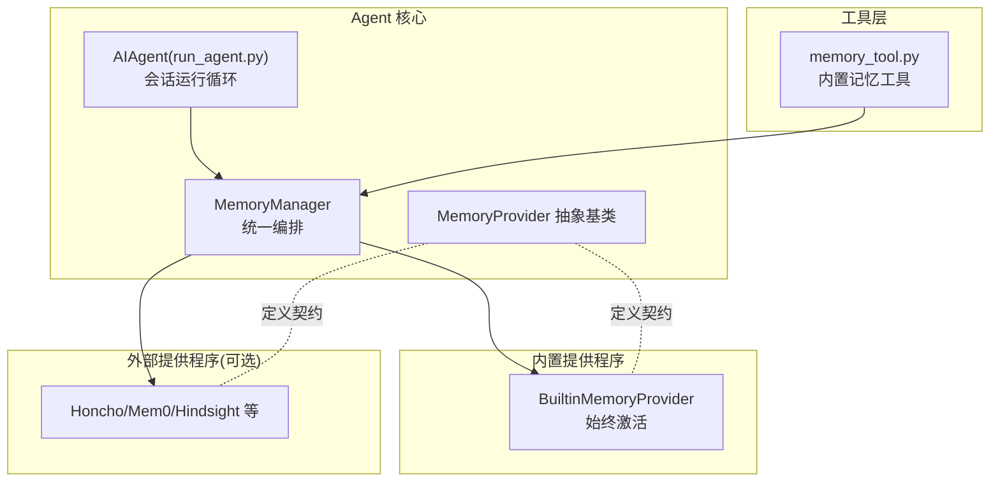
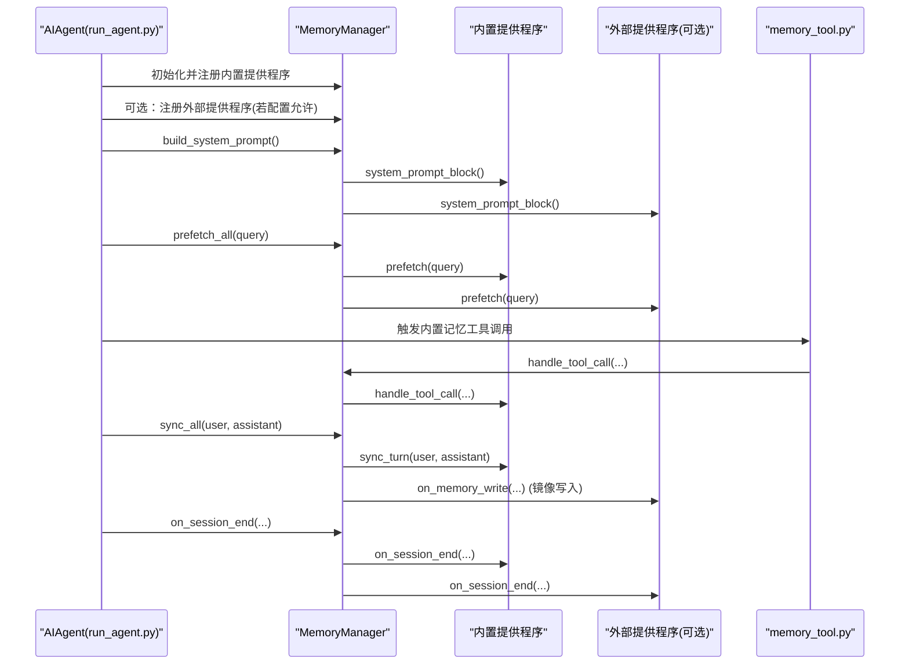
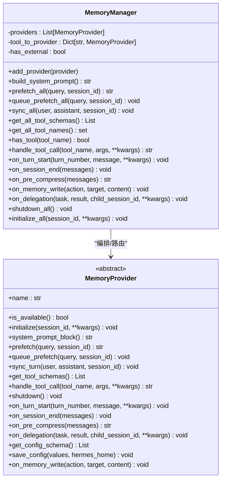
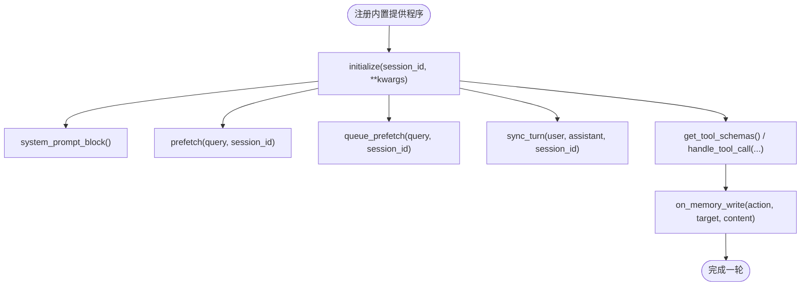
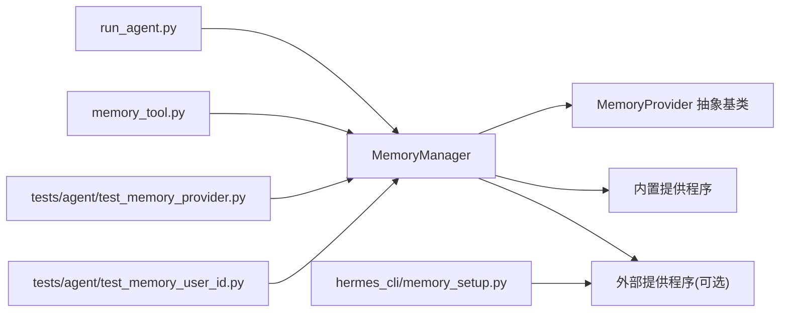

# 内置记忆提供程序

<cite>
**本文引用的文件**
- [agent/memory_manager.py](file://agent/memory_manager.py)
- [agent/memory_provider.py](file://agent/memory_provider.py)
- [run_agent.py](file://run_agent.py)
- [tests/agent/test_memory_provider.py](file://tests/agent/test_memory_provider.py)
- [tests/agent/test_memory_user_id.py](file://tests/agent/test_memory_user_id.py)
- [hermes_cli/memory_setup.py](file://hermes_cli/memory_setup.py)
- [tools/memory_tool.py](file://tools/memory_tool.py)
- [tests/tools/test_memory_tool.py](file://tests/tools/test_memory_tool.py)
</cite>

## 目录
1. [简介](#简介)
2. [项目结构](#项目结构)
3. [核心组件](#核心组件)
4. [架构总览](#架构总览)
5. [详细组件分析](#详细组件分析)
6. [依赖关系分析](#依赖关系分析)
7. [性能考量](#性能考量)
8. [故障排除指南](#故障排除指南)
9. [结论](#结论)
10. [附录](#附录)

## 简介
本文件系统性阐述 Hermes Agent 的内置记忆提供程序（BuiltinMemoryProvider）。该提供程序是所有会话中始终激活的核心记忆后端，不可移除，负责持久化与检索用户与代理之间的交互记忆，并通过 MemoryManager 统一编排。内置提供程序与外部插件型记忆提供程序（如 Honcho、Hindsight、Mem0 等）并存，但同一时刻仅允许一个外部提供程序运行，以避免工具模式冲突与资源竞争。

内置提供程序的关键职责包括：
- 记忆的创建、存储与检索
- 与 MemoryManager 协作，提供系统提示块、预取上下文、回合同步写入
- 支持工具调用（如读取/写入记忆），并可将写入事件镜像到外部提供程序
- 在网关等多用户场景下，基于 user_id 进行用户级隔离
- 生命周期管理：初始化、关闭、会话结束处理、委托完成通知等

## 项目结构
与内置记忆提供程序直接相关的核心模块与测试如下：
- agent/memory_manager.py：统一编排内置与外部记忆提供程序，定义注册、系统提示构建、预取、回合同步、工具路由、生命周期钩子等接口
- agent/memory_provider.py：抽象基类，定义提供程序的标准生命周期与可选钩子
- run_agent.py：在运行循环中通过 MemoryManager 注册内置提供程序，并在每轮对话前后调用其方法
- hermes_cli/memory_setup.py：提供记忆提供程序的配置向导能力（对插件型提供程序）
- tools/memory_tool.py：内置记忆工具的实现入口（供模型调用）
- tests/agent/test_memory_provider.py：验证 MemoryManager 的行为（注册策略、错误韧性、生命周期等）
- tests/agent/test_memory_user_id.py：验证 user_id 在内置与外部提供程序中的传播与隔离

**图示来源**
- [agent/memory_manager.py:72-363](file://agent/memory_manager.py#L72-L363)
- [agent/memory_provider.py:42-232](file://agent/memory_provider.py#L42-L232)
- [run_agent.py:1-1200](file://run_agent.py#L1-L1200)
- [tools/memory_tool.py](file://tools/memory_tool.py)

**章节来源**
- [agent/memory_manager.py:1-120](file://agent/memory_manager.py#L1-L120)
- [agent/memory_provider.py:1-60](file://agent/memory_provider.py#L1-L60)
- [run_agent.py:1-1200](file://run_agent.py#L1-L1200)

## 核心组件
- MemoryManager：负责注册与编排提供程序；内置提供程序总是第一个且不可移除；最多仅允许一个外部提供程序；提供系统提示构建、预取合并、回合同步、工具路由、生命周期钩子等
- MemoryProvider 抽象基类：定义提供程序的生命周期方法与可选钩子（如 on_memory_write、on_delegation 等）
- BuiltinMemoryProvider：内置提供程序，始终激活，负责实际的记忆存储与检索
- Memory 工具：通过工具模式暴露给模型，用于读取/写入内置记忆
- hermes_cli/memory_setup：为插件型提供程序提供配置向导（内置提供程序通常无需此步骤）

关键行为要点：
- 注册策略：内置提供程序优先注册；若尝试注册第二个外部提供程序，将被拒绝并发出警告
- 错误韧性：单个提供程序的失败不会阻断其他提供程序的工作流
- 用户隔离：在网关等多用户场景，user_id 会传递到提供程序的 initialize 钩子中，确保不同用户拥有独立记忆空间
- 生命周期：initialize、system_prompt_block、prefetch、queue_prefetch、sync_turn、get_tool_schemas、handle_tool_call、on_memory_write、on_delegation、shutdown_all 等

**章节来源**
- [agent/memory_manager.py:72-363](file://agent/memory_manager.py#L72-L363)
- [agent/memory_provider.py:42-232](file://agent/memory_provider.py#L42-L232)
- [tests/agent/test_memory_provider.py:149-353](file://tests/agent/test_memory_provider.py#L149-L353)
- [tests/agent/test_memory_user_id.py:64-130](file://tests/agent/test_memory_user_id.py#L64-L130)

## 架构总览
内置记忆提供程序在系统中的核心地位体现在以下流程：
- 初始化阶段：AIAgent 创建 MemoryManager 并注册内置提供程序；随后根据配置决定是否注册外部提供程序
- 每轮对话前：MemoryManager 调用各提供程序的 prefetch 或 queue_prefetch，构建上下文
- 回合结束后：MemoryManager 调用 sync_turn 将本轮对话写入后端
- 工具调用：当模型请求调用内置记忆工具时，MemoryManager 将工具调用路由至内置提供程序
- 生命周期：在会话开始、结束、委托完成等节点触发相应钩子

**图示来源**
- [run_agent.py:1-1200](file://run_agent.py#L1-L1200)
- [agent/memory_manager.py:146-333](file://agent/memory_manager.py#L146-L333)
- [agent/memory_provider.py:83-232](file://agent/memory_provider.py#L83-L232)
- [tools/memory_tool.py](file://tools/memory_tool.py)

## 详细组件分析

### MemoryManager 分析
- 注册与约束
  - 内置提供程序名称固定为 "builtin"，必须存在且不可移除
  - 外部提供程序最多只能有一个；重复注册会触发警告并拒绝
- 系统提示构建：收集各提供程序返回的静态提示块并拼接
- 预取与队列预取：按提供程序顺序执行 prefetch 合并结果；queue_prefetch 用于下一轮预取
- 回合同步：在每轮结束后调用 sync_turn，支持异步写入
- 工具路由：根据工具名映射到对应提供程序，避免冲突
- 生命周期钩子：提供 on_turn_start、on_session_end、on_pre_compress、on_memory_write、on_delegation、shutdown_all、initialize_all 等

**图示来源**
- [agent/memory_manager.py:72-363](file://agent/memory_manager.py#L72-L363)
- [agent/memory_provider.py:42-232](file://agent/memory_provider.py#L42-L232)

**章节来源**
- [agent/memory_manager.py:72-363](file://agent/memory_manager.py#L72-L363)
- [agent/memory_provider.py:42-232](file://agent/memory_provider.py#L42-L232)

### MemoryProvider 抽象基类分析
- 必须实现的方法：name、is_available、initialize、get_tool_schemas
- 常用覆盖方法：system_prompt_block、prefetch、queue_prefetch、sync_turn、handle_tool_call
- 可选钩子：on_turn_start、on_session_end、on_pre_compress、on_delegation、on_memory_write、get_config_schema、save_config
- 用途：为内置与外部提供程序提供一致的契约，便于扩展与替换

**章节来源**
- [agent/memory_provider.py:42-232](file://agent/memory_provider.py#L42-L232)

### 内置记忆提供程序（BuiltinMemoryProvider）
- 位置与角色：在 run_agent.py 中作为第一个提供程序注册，不可移除
- 功能范围：负责实际的记忆存储与检索；与 MemoryManager 协作提供系统提示、预取、同步与工具调用
- 用户隔离：通过 user_id 参数在 initialize 阶段进行用户级隔离
- 与外部提供程序协作：当内置工具写入记忆时，通过 on_memory_write 通知外部提供程序进行镜像写入

**图示来源**
- [run_agent.py:1-1200](file://run_agent.py#L1-L1200)
- [agent/memory_manager.py:146-333](file://agent/memory_manager.py#L146-L333)
- [agent/memory_provider.py:83-232](file://agent/memory_provider.py#L83-L232)

**章节来源**
- [run_agent.py:1-1200](file://run_agent.py#L1-L1200)
- [agent/memory_manager.py:146-333](file://agent/memory_manager.py#L146-L333)
- [agent/memory_provider.py:83-232](file://agent/memory_provider.py#L83-L232)

### 内置记忆工具（memory_tool.py）
- 作用：通过工具模式暴露给模型，用于读取/写入内置记忆
- 路由：MemoryManager 根据工具名将调用路由到内置提供程序
- 结果：返回 JSON 字符串格式的结果，便于模型理解

**章节来源**
- [tools/memory_tool.py](file://tools/memory_tool.py)
- [agent/memory_manager.py:238-257](file://agent/memory_manager.py#L238-L257)

## 依赖关系分析
- 运行时依赖
  - run_agent.py 通过 MemoryManager 注册并驱动内置提供程序
  - MemoryManager 依赖 MemoryProvider 抽象契约，确保一致性
  - tools/memory_tool.py 依赖 MemoryManager 的工具路由机制
- 配置与环境
  - hermes_cli/memory_setup.py 主要面向插件型提供程序的配置向导
  - 内置提供程序通常不需要额外配置文件，但会从 hermes_home 解析存储路径
- 测试依赖
  - tests/agent/test_memory_provider.py 验证 MemoryManager 的注册策略与错误韧性
  - tests/agent/test_memory_user_id.py 验证 user_id 在内置与外部提供程序中的传播与隔离

**图示来源**
- [run_agent.py:1-1200](file://run_agent.py#L1-L1200)
- [agent/memory_manager.py:72-363](file://agent/memory_manager.py#L72-L363)
- [agent/memory_provider.py:42-232](file://agent/memory_provider.py#L42-L232)
- [tools/memory_tool.py](file://tools/memory_tool.py)
- [hermes_cli/memory_setup.py](file://hermes_cli/memory_setup.py)
- [tests/agent/test_memory_provider.py:149-353](file://tests/agent/test_memory_provider.py#L149-L353)
- [tests/agent/test_memory_user_id.py:64-130](file://tests/agent/test_memory_user_id.py#L64-L130)

**章节来源**
- [run_agent.py:1-1200](file://run_agent.py#L1-L1200)
- [agent/memory_manager.py:72-363](file://agent/memory_manager.py#L72-L363)
- [agent/memory_provider.py:42-232](file://agent/memory_provider.py#L42-L232)
- [tests/agent/test_memory_provider.py:149-353](file://tests/agent/test_memory_provider.py#L149-L353)
- [tests/agent/test_memory_user_id.py:64-130](file://tests/agent/test_memory_user_id.py#L64-L130)

## 性能考量
- 预取与缓存
  - prefetch 应尽量快速返回缓存结果；后台线程负责实际召回，避免阻塞主流程
  - queue_prefetch 用于下一轮预取，减少首 token 延迟
- 异步写入
  - sync_turn 应非阻塞，将写入排队至后台处理，降低回合间等待时间
- 错误韧性
  - 单个提供程序异常不应影响其他提供程序；日志记录有助于定位问题
- 用户隔离与并发
  - 在网关等多用户场景，user_id 透传到提供程序，避免共享状态导致的锁争用
- 存储路径
  - 使用 hermes_home 解析提供程序的本地存储路径，避免硬编码带来的跨环境问题

[本节为通用指导，不直接分析具体文件]

## 故障排除指南
- 注册了多个外部提供程序
  - 现象：第二次外部提供程序注册被拒绝并警告
  - 处理：确认配置项 memory.provider 仅指向一个外部提供程序
  - 参考：[agent/memory_manager.py:86-131](file://agent/memory_manager.py#L86-L131)
- 预取失败不影响整体流程
  - 现象：某提供程序预取抛出异常
  - 处理：MemoryManager 对异常进行捕获并记录调试日志，不影响其他提供程序
  - 参考：[agent/memory_manager.py:174-184](file://agent/memory_manager.py#L174-L184)
- 工具调用未命中任何提供程序
  - 现象：handle_tool_call 返回工具错误
  - 处理：检查工具名是否存在于任一提供程序的工具模式中
  - 参考：[agent/memory_manager.py:238-257](file://agent/memory_manager.py#L238-L257)
- user_id 未生效或未隔离
  - 现象：多用户共享同一记忆
  - 处理：确认 AIAgent 是否正确传递 user_id；检查提供程序 initialize 是否接收 user_id
  - 参考：[tests/agent/test_memory_user_id.py:64-130](file://tests/agent/test_memory_user_id.py#L64-L130)
- 内置工具写入未同步到外部提供程序
  - 现象：外部提供程序缺少最新写入
  - 处理：确认 on_memory_write 钩子在外部提供程序中已实现；检查内置写入是否触发
  - 参考：[agent/memory_manager.py:304-318](file://agent/memory_manager.py#L304-L318)

**章节来源**
- [agent/memory_manager.py:86-131](file://agent/memory_manager.py#L86-L131)
- [agent/memory_manager.py:174-184](file://agent/memory_manager.py#L174-L184)
- [agent/memory_manager.py:238-257](file://agent/memory_manager.py#L238-L257)
- [tests/agent/test_memory_user_id.py:64-130](file://tests/agent/test_memory_user_id.py#L64-L130)
- [agent/memory_manager.py:304-318](file://agent/memory_manager.py#L304-L318)

## 结论
内置记忆提供程序是 Hermes Agent 的核心记忆后端，具备以下特征：
- 始终激活、不可移除，确保会话具备基础记忆能力
- 与 MemoryManager 协作，提供系统提示、预取、同步与工具调用
- 通过 user_id 实现多用户隔离，适配网关等多租户场景
- 与外部提供程序互补：外部提供程序负责高级检索/索引能力，内置提供程序负责稳定、低延迟的基础记忆
- 具备良好的错误韧性与生命周期钩子，便于扩展与维护

[本节为总结，不直接分析具体文件]

## 附录

### 使用示例与最佳实践
- 示例：在 run_agent.py 中注册内置提供程序并启用外部提供程序（若配置允许）
  - 参考：[run_agent.py:1-1200](file://run_agent.py#L1-L1200)
- 最佳实践
  - 保持 prefetch 快速返回缓存结果，后台线程负责召回
  - 将 sync_turn 设计为非阻塞，避免影响对话流畅度
  - 在网关场景显式传递 user_id，确保用户隔离
  - 仅启用一个外部提供程序，避免工具模式冲突
  - 利用 on_memory_write 钩子实现与外部提供程序的写入镜像

**章节来源**
- [run_agent.py:1-1200](file://run_agent.py#L1-L1200)
- [agent/memory_manager.py:146-333](file://agent/memory_manager.py#L146-L333)