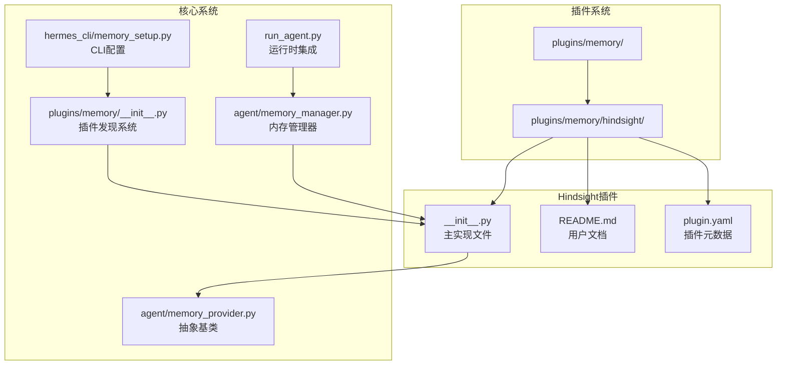
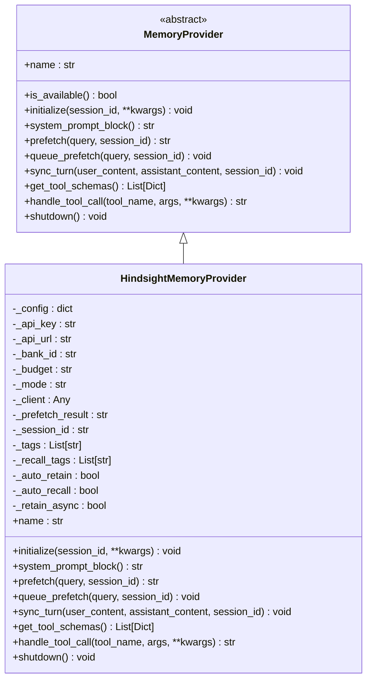
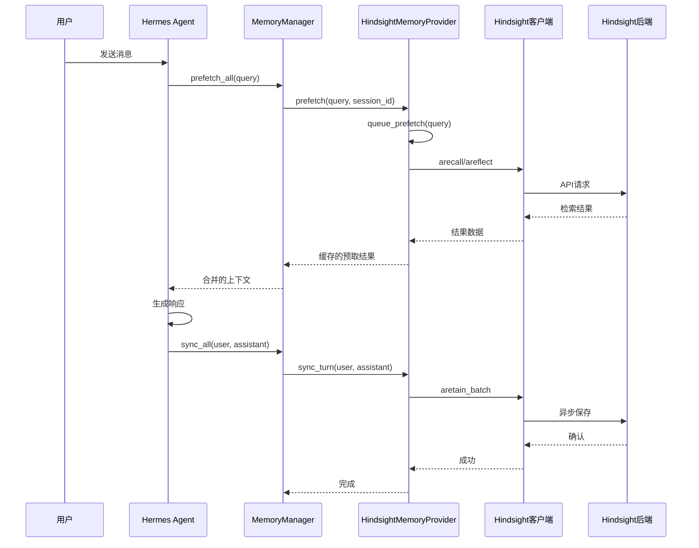
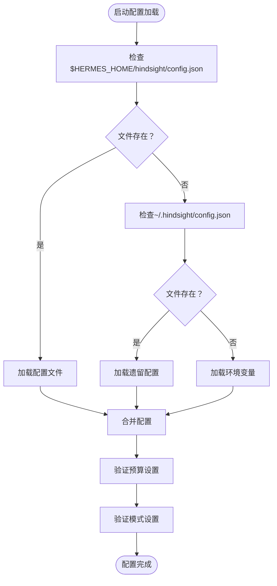
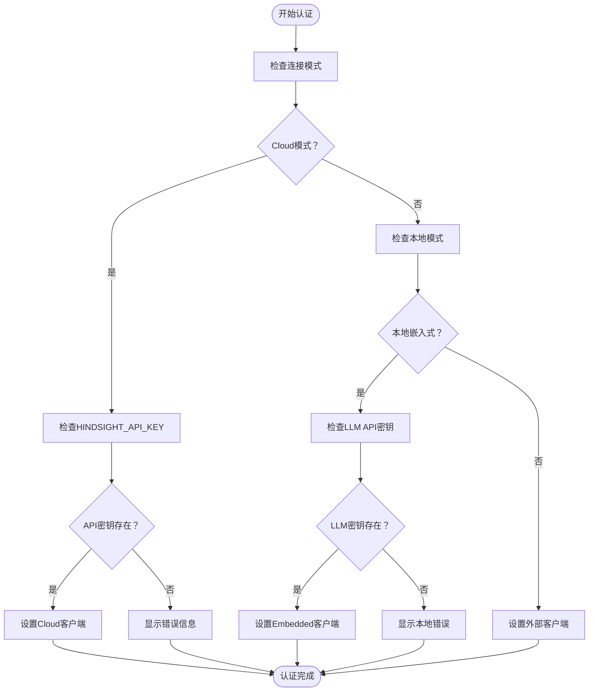
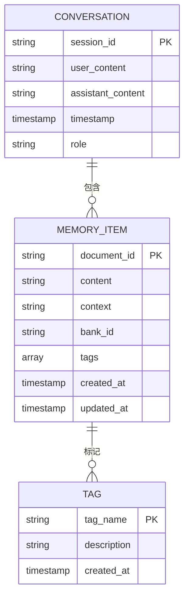
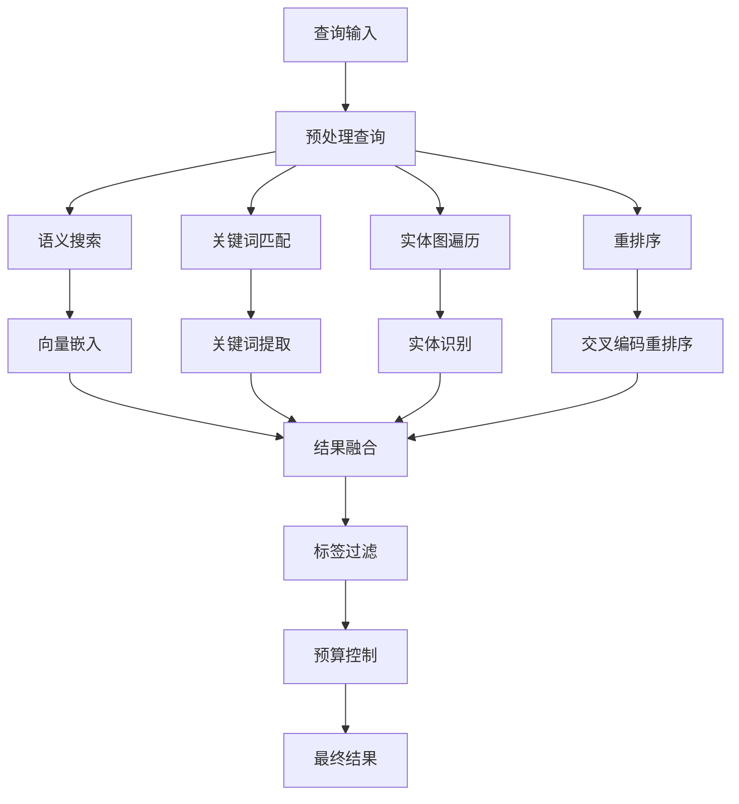
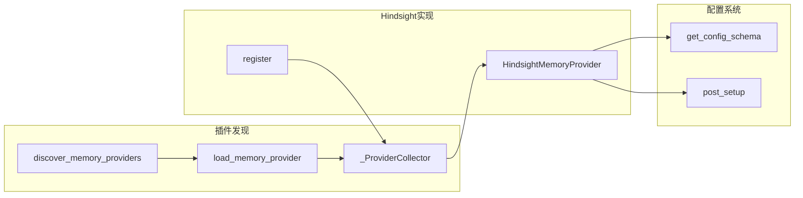
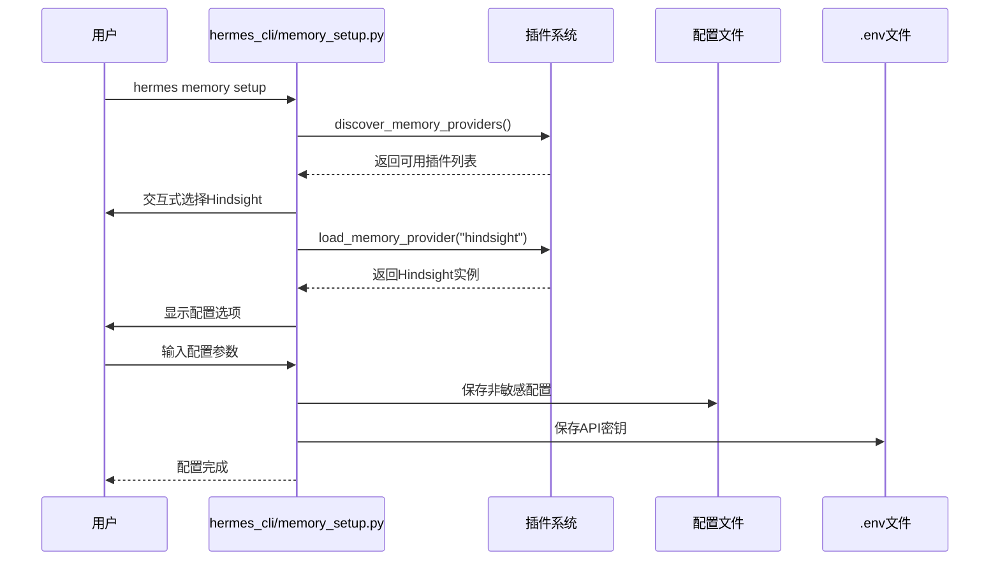
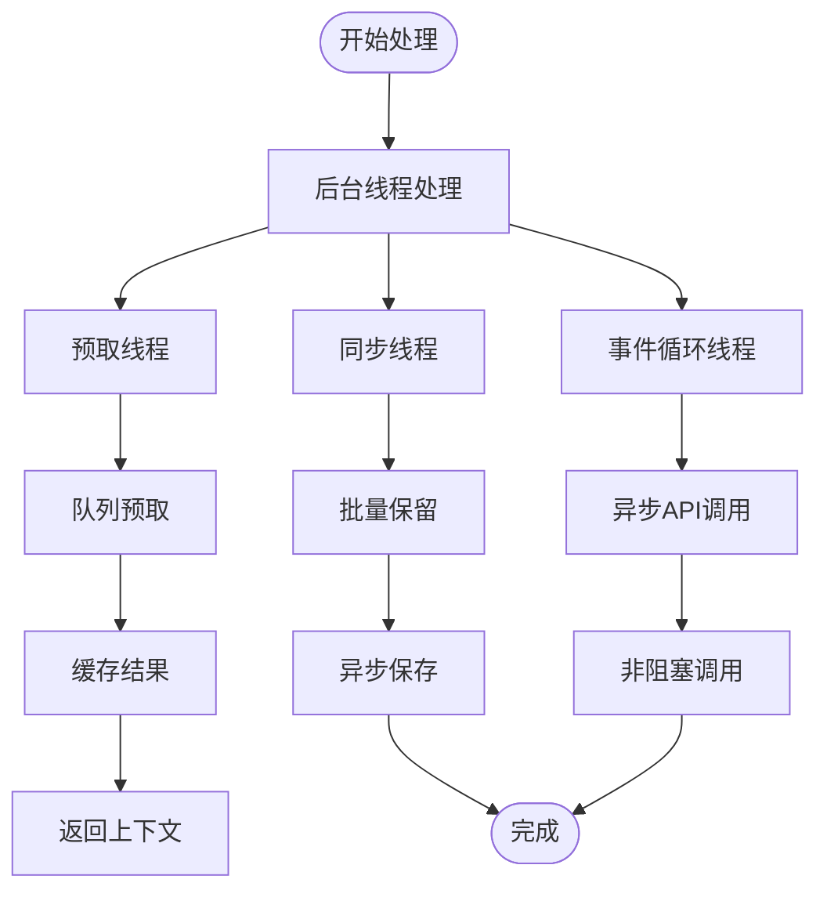

# Hindsight记忆提供程序

<cite>
**本文档引用的文件**
- [plugins/memory/hindsight/__init__.py](file://plugins/memory/hindsight/__init__.py)
- [plugins/memory/hindsight/README.md](file://plugins/memory/hindsight/README.md)
- [plugins/memory/hindsight/plugin.yaml](file://plugins/memory/hindsight/plugin.yaml)
- [plugins/memory/__init__.py](file://plugins/memory/__init__.py)
- [agent/memory_manager.py](file://agent/memory_manager.py)
- [agent/memory_provider.py](file://agent/memory_provider.py)
- [hermes_cli/memory_setup.py](file://hermes_cli/memory_setup.py)
- [run_agent.py](file://run_agent.py)
</cite>

## 目录
1. [简介](#简介)
2. [项目结构](#项目结构)
3. [核心组件](#核心组件)
4. [架构概览](#架构概览)
5. [详细组件分析](#详细组件分析)
6. [依赖关系分析](#依赖关系分析)
7. [性能考虑](#性能考虑)
8. [故障排除指南](#故障排除指南)
9. [结论](#结论)
10. [附录](#附录)

## 简介

Hindsight是一个强大的外部记忆提供程序，为Hermes Agent提供长期记忆能力。该提供程序基于时间线的记忆组织方式，支持知识图谱、实体解析和多策略检索。它提供了三种连接模式：云端模式（Hindsight Cloud API）、本地嵌入式模式（内置PostgreSQL数据库）和本地外部模式（连接现有Hindsight实例）。

Hindsight的核心特点包括：
- 基于时间线的记忆组织方式
- 长期记忆存储能力
- 智能检索机制（语义搜索、关键词匹配、实体图遍历、重排序）
- 多种集成模式（混合、上下文、工具）
- 自动保留和预取机制
- 支持标签过滤和类型筛选

## 项目结构

Hindsight记忆提供程序位于插件系统中，采用模块化设计：



**图表来源**
- [plugins/memory/hindsight/__init__.py:1-884](file://plugins/memory/hindsight/__init__.py#L1-L884)
- [plugins/memory/hindsight/README.md:1-135](file://plugins/memory/hindsight/README.md#L1-L135)
- [plugins/memory/hindsight/plugin.yaml:1-9](file://plugins/memory/hindsight/plugin.yaml#L1-L9)

**章节来源**
- [plugins/memory/hindsight/__init__.py:1-884](file://plugins/memory/hindsight/__init__.py#L1-L884)
- [plugins/memory/hindsight/README.md:1-135](file://plugins/memory/hindsight/README.md#L1-L135)
- [plugins/memory/hindsight/plugin.yaml:1-9](file://plugins/memory/hindsight/plugin.yaml#L1-L9)

## 核心组件

### HindsightMemoryProvider类

HindsightMemoryProvider是MemoryProvider接口的具体实现，负责处理所有记忆相关的操作：



**图表来源**
- [agent/memory_provider.py:42-232](file://agent/memory_provider.py#L42-L232)
- [plugins/memory/hindsight/__init__.py:185-884](file://plugins/memory/hindsight/__init__.py#L185-L884)

### 工具Schema定义

Hindsight提供三个核心工具来支持记忆操作：

| 工具名称 | 描述 | 参数 |
|---------|------|------|
| hindsight_retain | 存储信息到长期记忆 | content（必需），context（可选），tags（可选） |
| hindsight_recall | 搜索长期记忆 | query（必需），tags（可选），types（可选） |
| hindsight_reflect | 从长期记忆中合成推理答案 | query（必需） |

**章节来源**
- [plugins/memory/hindsight/__init__.py:91-135](file://plugins/memory/hindsight/__init__.py#L91-L135)
- [plugins/memory/hindsight/__init__.py:774-849](file://plugins/memory/hindsight/__init__.py#L774-L849)

## 架构概览

Hindsight在Hermes Agent中的集成架构如下：



**图表来源**
- [agent/memory_manager.py:167-209](file://agent/memory_manager.py#L167-L209)
- [plugins/memory/hindsight/__init__.py:654-773](file://plugins/memory/hindsight/__init__.py#L654-L773)
- [run_agent.py:7850-8049](file://run_agent.py#L7850-L8049)

**章节来源**
- [agent/memory_manager.py:72-363](file://agent/memory_manager.py#L72-L363)
- [run_agent.py:1148-1181](file://run_agent.py#L1148-L1181)

## 详细组件分析

### 配置系统

Hindsight支持多种配置方式，具有灵活的优先级顺序：



**图表来源**
- [plugins/memory/hindsight/__init__.py:142-179](file://plugins/memory/hindsight/__init__.py#L142-L179)

配置选项包括：

| 配置项 | 默认值 | 描述 |
|--------|--------|------|
| mode | cloud | 连接模式：cloud/local_embedded/local_external |
| api_url | https://api.hindsight.vectorize.io | API端点URL |
| apiKey | 空 | Hindsight Cloud API密钥 |
| bank_id | hermes | 内存银行名称 |
| recall_budget | mid | 检索彻底程度：low/mid/high |
| memory_mode | hybrid | 集成模式：hybrid/context/tools |
| llm_provider | openai | LLM提供商 |
| llm_model | gpt-4o-mini | LLM模型名称 |
| retain_async | true | 异步处理保留操作 |

**章节来源**
- [plugins/memory/hindsight/__init__.py:406-437](file://plugins/memory/hindsight/__init__.py#L406-L437)
- [plugins/memory/hindsight/README.md:47-135](file://plugins/memory/hindsight/README.md#L47-L135)

### 认证流程

Hindsight支持多种认证方式：



**图表来源**
- [plugins/memory/hindsight/__init__.py:233-244](file://plugins/memory/hindsight/__init__.py#L233-L244)
- [plugins/memory/hindsight/__init__.py:439-467](file://plugins/memory/hindsight/__init__.py#L439-L467)

### 数据存储格式

Hindsight使用JSON格式存储对话历史：



**图表来源**
- [plugins/memory/hindsight/__init__.py:715-773](file://plugins/memory/hindsight/__init__.py#L715-L773)

**章节来源**
- [plugins/memory/hindsight/__init__.py:715-773](file://plugins/memory/hindsight/__init__.py#L715-L773)

### 智能检索机制

Hindsight的检索机制采用多策略融合：



**图表来源**
- [plugins/memory/hindsight/__init__.py:683-714](file://plugins/memory/hindsight/__init__.py#L683-L714)
- [plugins/memory/hindsight/__init__.py:806-831](file://plugins/memory/hindsight/__init__.py#L806-L831)

**章节来源**
- [plugins/memory/hindsight/__init__.py:683-714](file://plugins/memory/hindsight/__init__.py#L683-L714)
- [plugins/memory/hindsight/__init__.py:806-847](file://plugins/memory/hindsight/__init__.py#L806-L847)

## 依赖关系分析

### 插件发现系统

Hindsight通过插件系统自动发现和加载：



**图表来源**
- [plugins/memory/__init__.py:32-196](file://plugins/memory/__init__.py#L32-L196)
- [plugins/memory/hindsight/__init__.py:881-884](file://plugins/memory/hindsight/__init__.py#L881-L884)

### CLI集成

Hindsight通过CLI命令进行配置管理：



**图表来源**
- [hermes_cli/memory_setup.py:183-351](file://hermes_cli/memory_setup.py#L183-L351)
- [plugins/memory/__init__.py:32-76](file://plugins/memory/__init__.py#L32-L76)

**章节来源**
- [plugins/memory/__init__.py:32-196](file://plugins/memory/__init__.py#L32-L196)
- [hermes_cli/memory_setup.py:183-351](file://hermes_cli/memory_setup.py#L183-L351)

## 性能考虑

### 异步处理机制

Hindsight采用了多线程异步处理来优化性能：



**图表来源**
- [plugins/memory/hindsight/__init__.py:53-84](file://plugins/memory/hindsight/__init__.py#L53-L84)
- [plugins/memory/hindsight/__init__.py:715-773](file://plugins/memory/hindsight/__init__.py#L715-L773)

### 内存管理优化

Hindsight实现了智能的内存管理策略：

| 优化特性 | 实现方式 | 性能收益 |
|----------|----------|----------|
| 批量保留 | 每N轮保留一次对话 | 减少API调用频率 |
| 预取缓存 | 缓存预取结果 | 避免重复检索 |
| 异步处理 | 后台线程处理 | 提升响应速度 |
| 标签过滤 | 服务端过滤 | 减少传输数据量 |
| 预算控制 | 限制结果数量 | 控制成本和延迟 |

**章节来源**
- [plugins/memory/hindsight/__init__.py:53-84](file://plugins/memory/hindsight/__init__.py#L53-L84)
- [plugins/memory/hindsight/__init__.py:715-773](file://plugins/memory/hindsight/__init__.py#L715-L773)

## 故障排除指南

### 常见问题及解决方案

#### 1. 安装和依赖问题

**问题**: `ModuleNotFoundError: No module named 'hindsight'`
**解决方案**: 
- 确保已安装正确的依赖包
- 使用uv工具进行安装：`uv pip install hindsight-client>=0.4.22`
- 或者使用pip：`pip install hindsight-client>=0.4.22`

#### 2. 配置问题

**问题**: `hindsight-client版本过旧`
**解决方案**:
- 检查当前版本：`pip show hindsight-client`
- 自动升级：`uv pip install --upgrade hindsight-client>=0.4.22`
- 或手动升级：`pip install --upgrade hindsight-client>=0.4.22`

#### 3. 认证失败

**问题**: API调用返回401或403错误
**解决方案**:
- 验证API密钥是否正确
- 检查网络连接和防火墙设置
- 确认API端点URL正确
- 对于本地模式，检查LLM提供商配置

#### 4. 性能问题

**问题**: 检索响应缓慢
**解决方案**:
- 调整recall_budget为'mid'或'low'
- 使用标签过滤减少搜索范围
- 优化查询语句，避免过长的查询文本
- 检查网络延迟和带宽

**章节来源**
- [plugins/memory/hindsight/__init__.py:472-496](file://plugins/memory/hindsight/__init__.py#L472-L496)
- [plugins/memory/hindsight/README.md:132-135](file://plugins/memory/hindsight/README.md#L132-L135)

### 日志和调试

Hindsight提供了详细的日志记录功能：

| 日志级别 | 用途 | 示例信息 |
|----------|------|----------|
| DEBUG | 详细操作跟踪 | "Prefetch: calling recall" |
| INFO | 重要状态信息 | "Hindsight initialized" |
| WARNING | 警告信息 | "Hindsight sync failed" |
| ERROR | 错误信息 | "Hindsight client init failed" |

日志文件位置：
- 本地嵌入式模式：`~/.hermes/logs/hindsight-embed.log`
- 运行时日志：`~/.hindsight/profiles/<profile>.log`

**章节来源**
- [plugins/memory/hindsight/__init__.py:541-555](file://plugins/memory/hindsight/__init__.py#L541-L555)

## 结论

Hindsight记忆提供程序为Hermes Agent提供了强大而灵活的长期记忆能力。其核心优势包括：

1. **多模式支持**: 云端、本地嵌入式和本地外部三种模式满足不同部署需求
2. **智能检索**: 多策略融合的检索机制提供高质量的结果
3. **灵活配置**: 丰富的配置选项适应各种使用场景
4. **性能优化**: 异步处理和缓存机制确保良好的用户体验
5. **易于集成**: 与Hermes Agent无缝集成，支持多种集成模式

Hindsight特别适用于需要长期记忆、跨会话知识管理和智能检索的应用场景，如客户服务、知识管理、个性化助手等。

## 附录

### 安装和配置步骤

1. **基本安装**
   ```bash
   hermes memory setup
   # 选择"hindsight"选项
   ```

2. **手动配置**
   ```bash
   hermes config set memory.provider hindsight
   echo "HINDSIGHT_API_KEY=your-key" >> ~/.hermes/.env
   ```

3. **本地嵌入式模式**
   ```bash
   hermes config set memory.hindsight.mode local_embedded
   hermes config set memory.hindsight.llm_provider openai
   hermes config set memory.hindsight.llm_model gpt-4o-mini
   ```

### 使用示例

1. **基本使用**
   - 在聊天中直接使用hindsight工具
   - 系统会自动进行预取和保留

2. **高级配置**
   - 设置标签过滤：`hermes config set memory.hindsight.recall_tags "project,important"`
   - 调整预算：`hermes config set memory.hindsight.recall_budget high`

3. **监控和维护**
   - 查看状态：`hermes memory status`
   - 清理缓存：重启会话或删除缓存文件

**章节来源**
- [plugins/memory/hindsight/README.md:11-46](file://plugins/memory/hindsight/README.md#L11-L46)
- [hermes_cli/memory_setup.py:183-351](file://hermes_cli/memory_setup.py#L183-L351)