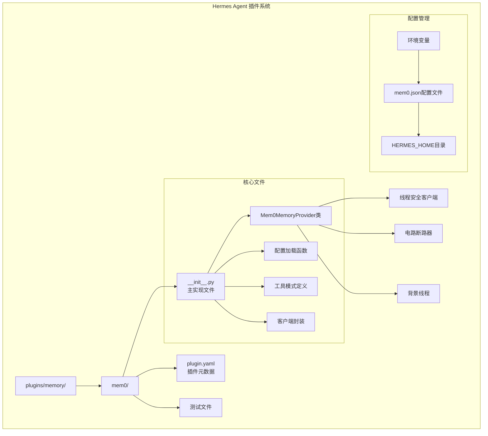
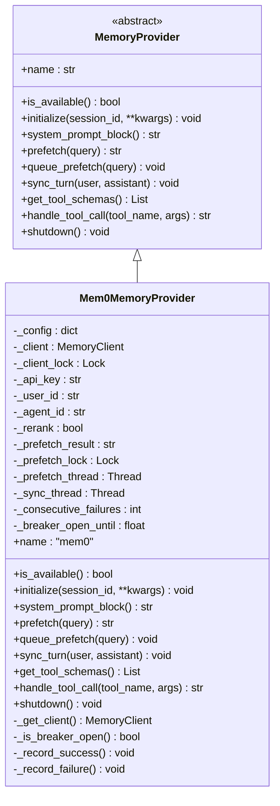
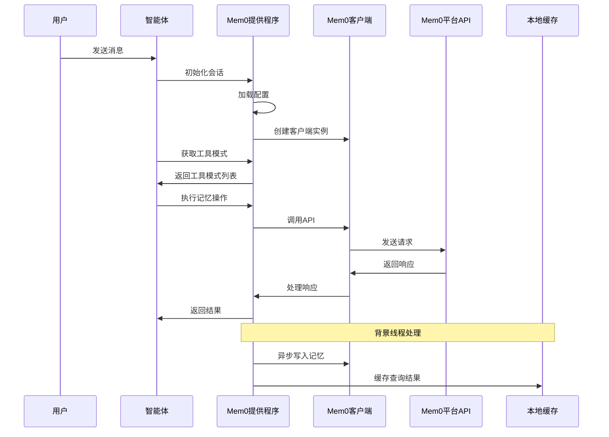
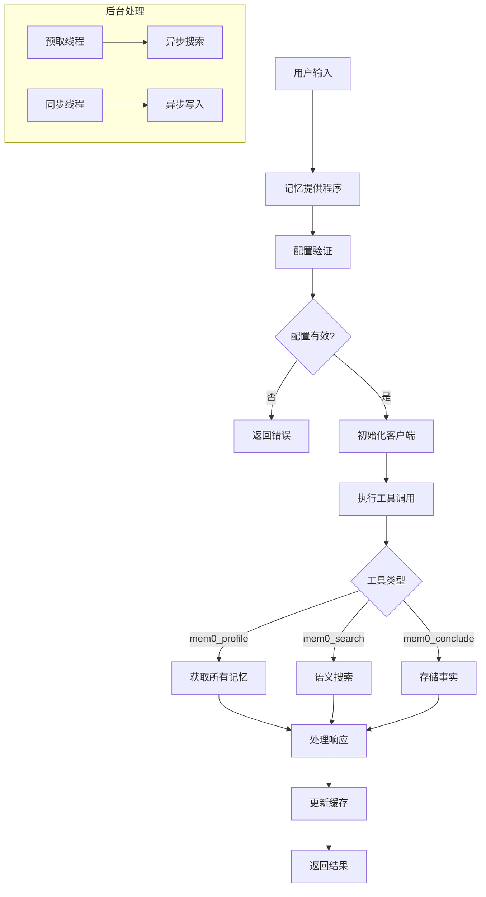
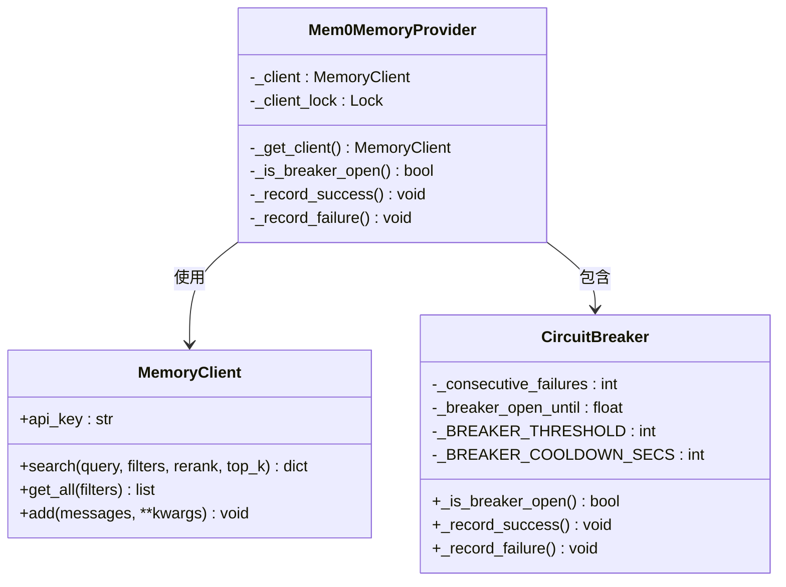
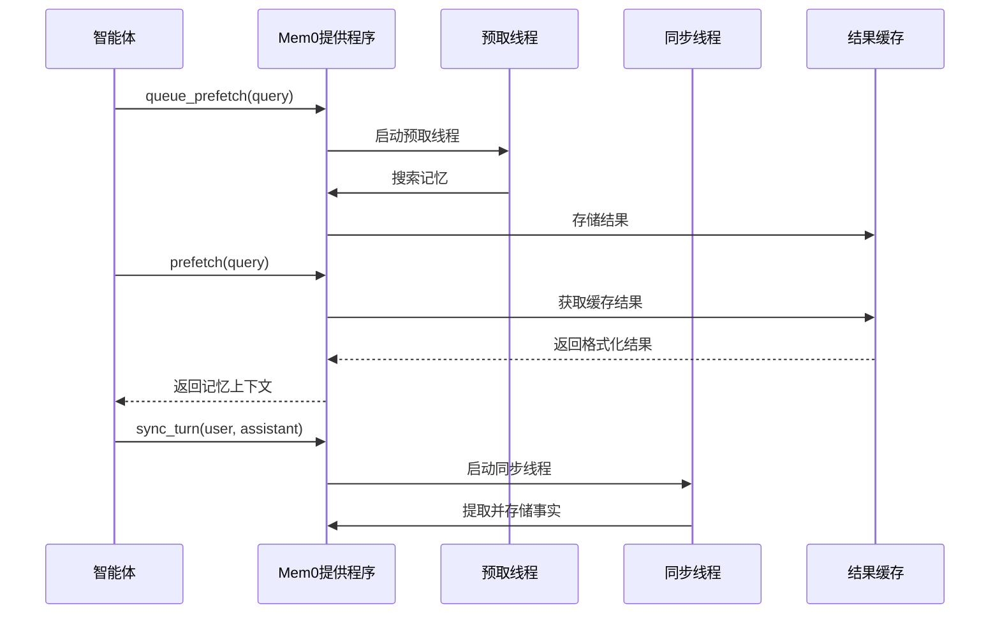
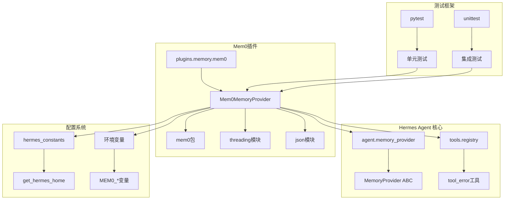
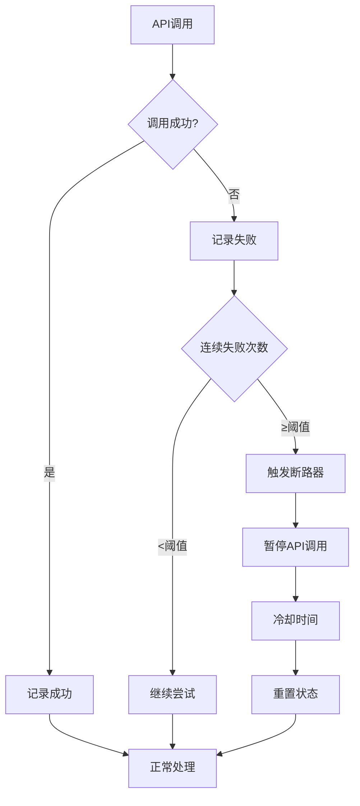

# Mem0记忆提供程序

<cite>
**本文档引用的文件**
- [plugins/memory/mem0/__init__.py](file://plugins/memory/mem0/__init__.py)
- [agent/memory_provider.py](file://agent/memory_provider.py)
- [plugins/memory/mem0/plugin.yaml](file://plugins/memory/mem0/plugin.yaml)
- [tests/plugins/memory/test_mem0_v2.py](file://tests/plugins/memory/test_mem0_v2.py)
- [hermes_cli/memory_setup.py](file://hermes_cli/memory_setup.py)
- [hermes_cli/config.py](file://hermes_cli/config.py)
- [website/docs/user-guide/features/memory-providers.md](file://website/docs/user-guide/features/memory-providers.md)
- [tests/agent/test_memory_provider.py](file://tests/agent/test_memory_provider.py)
- [tests/hermes_cli/test_doctor.py](file://tests/hermes_cli/test_doctor.py)
</cite>

## 目录
1. [简介](#简介)
2. [项目结构](#项目结构)
3. [核心组件](#核心组件)
4. [架构概览](#架构概览)
5. [详细组件分析](#详细组件分析)
6. [依赖关系分析](#依赖关系分析)
7. [性能考虑](#性能考虑)
8. [故障排除指南](#故障排除指南)
9. [结论](#结论)
10. [附录](#附录)

## 简介

Mem0是Hermes Agent框架中的一个开源记忆提供程序插件，基于Mem0平台API构建。该插件提供了服务器端的大语言模型事实提取、语义搜索与重排序、以及自动去重功能，为智能体提供了强大的持久化记忆能力。

Mem0的核心技术特点包括：
- **服务器端事实提取**：通过Mem0平台API自动从对话中提取关键事实
- **语义搜索与重排序**：支持基于语义相似度的记忆检索，并可启用重排序提高准确性
- **自动去重机制**：防止重复记忆的存储和检索
- **个性化记忆建模**：支持用户级和代理级的记忆隔离
- **向量数据库集成**：与Mem0平台的向量存储和检索系统无缝集成

## 项目结构

Mem0记忆提供程序位于Hermes Agent项目的插件系统中，采用标准的插件架构设计：



**图表来源**
- [plugins/memory/mem0/__init__.py:1-374](file://plugins/memory/mem0/__init__.py#L1-L374)
- [plugins/memory/mem0/plugin.yaml:1-6](file://plugins/memory/mem0/plugin.yaml#L1-L6)

**章节来源**
- [plugins/memory/mem0/__init__.py:1-374](file://plugins/memory/mem0/__init__.py#L1-L374)
- [plugins/memory/mem0/plugin.yaml:1-6](file://plugins/memory/mem0/plugin.yaml#L1-L6)

## 核心组件

### Mem0MemoryProvider类

Mem0MemoryProvider是Mem0插件的核心实现，继承自MemoryProvider抽象基类。该类实现了完整的记忆提供程序生命周期管理：



**图表来源**
- [agent/memory_provider.py:42-232](file://agent/memory_provider.py#L42-L232)
- [plugins/memory/mem0/__init__.py:119-374](file://plugins/memory/mem0/__init__.py#L119-L374)

### 配置管理系统

Mem0插件支持灵活的配置管理，包括环境变量和本地配置文件两种方式：

| 配置项 | 类型 | 默认值 | 描述 |
|--------|------|--------|------|
| MEM0_API_KEY | 必需 | 无 | Mem0平台API密钥 |
| MEM0_USER_ID | 可选 | hermes-user | 用户标识符 |
| MEM0_AGENT_ID | 可选 | hermes | 代理标识符 |
| rerank | 可选 | true | 启用重排序以提高召回率 |

**章节来源**
- [plugins/memory/mem0/__init__.py:8-14](file://plugins/memory/mem0/__init__.py#L8-L14)
- [plugins/memory/mem0/__init__.py:40-66](file://plugins/memory/mem0/__init__.py#L40-L66)
- [plugins/memory/mem0/__init__.py:160-166](file://plugins/memory/mem0/__init__.py#L160-L166)

## 架构概览

Mem0记忆提供程序采用分层架构设计，结合了内存存储、网络通信和后台处理机制：



**图表来源**
- [plugins/memory/mem0/__init__.py:203-295](file://plugins/memory/mem0/__init__.py#L203-L295)
- [plugins/memory/mem0/__init__.py:251-270](file://plugins/memory/mem0/__init__.py#L251-L270)

### 数据流架构



**图表来源**
- [plugins/memory/mem0/__init__.py:300-361](file://plugins/memory/mem0/__init__.py#L300-L361)
- [plugins/memory/mem0/__init__.py:237-295](file://plugins/memory/mem0/__init__.py#L237-L295)

## 详细组件分析

### 客户端封装与连接管理

Mem0提供程序实现了线程安全的客户端封装，确保在多线程环境下的一致性和可靠性：



**图表来源**
- [plugins/memory/mem0/__init__.py:168-202](file://plugins/memory/mem0/__init__.py#L168-L202)
- [plugins/memory/mem0/__init__.py:180-196](file://plugins/memory/mem0/__init__.py#L180-L196)

### 工具模式与API接口

Mem0提供程序定义了三个核心工具模式，每个都对应特定的记忆操作：

| 工具名称 | 功能描述 | 参数 | 返回值 |
|----------|----------|------|--------|
| mem0_profile | 获取用户的所有记忆 | 无 | 记忆列表和计数 |
| mem0_search | 基于语义的搜索 | query, rerank, top_k | 相关记忆和评分 |
| mem0_conclude | 存储持久化事实 | conclusion | 存储确认 |

**章节来源**
- [plugins/memory/mem0/__init__.py:73-112](file://plugins/memory/mem0/__init__.py#L73-L112)
- [plugins/memory/mem0/__init__.py:300-361](file://plugins/memory/mem0/__init__.py#L300-L361)

### 背景处理与缓存机制

为了提升用户体验，Mem0提供程序实现了多线程的背景处理机制：



**图表来源**
- [plugins/memory/mem0/__init__.py:237-295](file://plugins/memory/mem0/__init__.py#L237-L295)
- [plugins/memory/mem0/__init__.py:251-270](file://plugins/memory/mem0/__init__.py#L251-L270)

**章节来源**
- [plugins/memory/mem0/__init__.py:237-295](file://plugins/memory/mem0/__init__.py#L237-L295)

## 依赖关系分析

### 外部依赖

Mem0插件的主要外部依赖关系如下：



**图表来源**
- [plugins/memory/mem0/__init__.py:25-26](file://plugins/memory/mem0/__init__.py#L25-L26)
- [plugins/memory/mem0/__init__.py:47](file://plugins/memory/mem0/__init__.py#L47)
- [tests/plugins/memory/test_mem0_v2.py:9](file://tests/plugins/memory/test_mem0_v2.py#L9)

### 内部模块依赖

Mem0插件与Hermes Agent框架的集成点主要体现在以下几个方面：

1. **配置系统集成**：通过`hermes_constants.get_hermes_home()`访问配置目录
2. **工具注册系统**：通过`tools.registry.tool_error`处理工具调用错误
3. **内存管理器集成**：遵循MemoryManager的生命周期管理规范
4. **CLI配置集成**：支持hermes命令行工具的配置管理

**章节来源**
- [plugins/memory/mem0/__init__.py:47](file://plugins/memory/mem0/__init__.py#L47)
- [plugins/memory/mem0/__init__.py:26](file://plugins/memory/mem0/__init__.py#L26)

## 性能考虑

### 线程安全与并发控制

Mem0提供程序采用了多层次的并发控制机制：

- **客户端锁**：确保MemoryClient实例的线程安全访问
- **预取结果锁**：保护预取结果的原子性更新
- **后台线程管理**：避免线程泄漏和资源竞争

### 错误处理与容错机制



**图表来源**
- [plugins/memory/mem0/__init__.py:180-202](file://plugins/memory/mem0/__init__.py#L180-L202)

### 性能优化策略

1. **背景处理**：所有网络I/O操作都在独立线程中执行
2. **结果缓存**：预取的结果在内存中缓存，减少重复查询
3. **批量处理**：支持批量记忆检索和存储操作
4. **智能重试**：结合断路器机制避免雪崩效应

## 故障排除指南

### 常见问题诊断

| 问题类型 | 症状 | 可能原因 | 解决方案 |
|----------|------|----------|----------|
| 认证失败 | "Mem0 API密钥未设置" | API密钥缺失或无效 | 设置MEM0_API_KEY环境变量 |
| 导入错误 | "mem0包未安装" | 依赖包缺失 | 运行pip install mem0ai |
| 网络超时 | "API调用失败" | 网络连接问题 | 检查网络连接和防火墙设置 |
| 断路器触发 | "API暂时不可用" | 连续失败超过阈值 | 等待冷却时间或检查服务状态 |

### 调试技巧

1. **启用详细日志**：检查Mem0相关日志输出
2. **验证配置**：使用hermes doctor命令检查配置状态
3. **测试连接**：单独测试API连接和认证
4. **监控指标**：观察断路器状态和错误率

**章节来源**
- [tests/hermes_cli/test_doctor.py:220-226](file://tests/hermes_cli/test_doctor.py#L220-L226)
- [plugins/memory/mem0/__init__.py:197-201](file://plugins/memory/mem0/__init__.py#L197-L201)

### 性能调优建议

1. **合理设置预取**：根据对话频率调整预取线程的触发条件
2. **优化查询参数**：合理设置top_k和rerank参数平衡准确性和性能
3. **监控资源使用**：定期检查内存和CPU使用情况
4. **配置合适的冷却时间**：根据服务稳定性调整断路器参数

## 结论

Mem0记忆提供程序为Hermes Agent框架提供了强大而可靠的云端记忆能力。通过服务器端的事实提取、语义搜索和自动去重功能，Mem0显著提升了智能体的长期记忆能力和对话连贯性。

### 主要优势

1. **云端托管**：无需维护复杂的基础设施
2. **高精度检索**：基于语义相似度的精确记忆检索
3. **自动管理**：自动去重和事实提取减少人工干预
4. **易于集成**：标准化的插件接口和配置管理

### 适用场景

- 需要长期对话记忆的客服机器人
- 需要个性化知识管理的企业助手
- 需要跨会话保持上下文的教育应用
- 需要智能检索增强生成的应用程序

## 附录

### 安装与配置步骤

1. **安装依赖包**：
   ```bash
   pip install mem0ai
   ```

2. **获取API密钥**：
   - 访问Mem0平台获取API密钥
   - 设置环境变量：`export MEM0_API_KEY=your_api_key`

3. **配置用户标识**：
   - 设置用户ID：`export MEM0_USER_ID=your_user_id`
   - 设置代理ID：`export MEM0_AGENT_ID=your_agent_id`

4. **验证安装**：
   ```bash
   hermes memory setup
   hermes doctor
   ```

### API参考

| 方法 | 参数 | 返回值 | 描述 |
|------|------|--------|------|
| initialize | session_id, **kwargs | None | 初始化会话 |
| system_prompt_block | 无 | str | 返回系统提示块 |
| prefetch | query, session_id | str | 获取预取的记忆 |
| queue_prefetch | query, session_id | None | 预取下一轮记忆 |
| sync_turn | user_content, assistant_content, session_id | None | 同步对话记忆 |
| get_tool_schemas | 无 | List[Dict] | 返回工具模式 |
| handle_tool_call | tool_name, args | str | 处理工具调用 |
| shutdown | 无 | None | 清理资源 |

### 最佳实践

1. **配置管理**：使用环境变量管理敏感信息
2. **错误处理**：实现适当的异常处理和重试机制
3. **性能监控**：定期监控API使用情况和响应时间
4. **安全考虑**：限制API密钥权限和使用范围