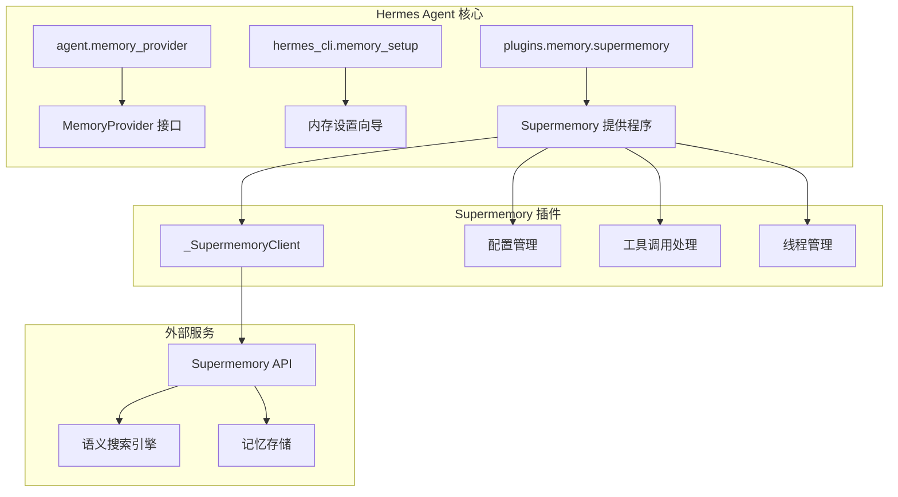
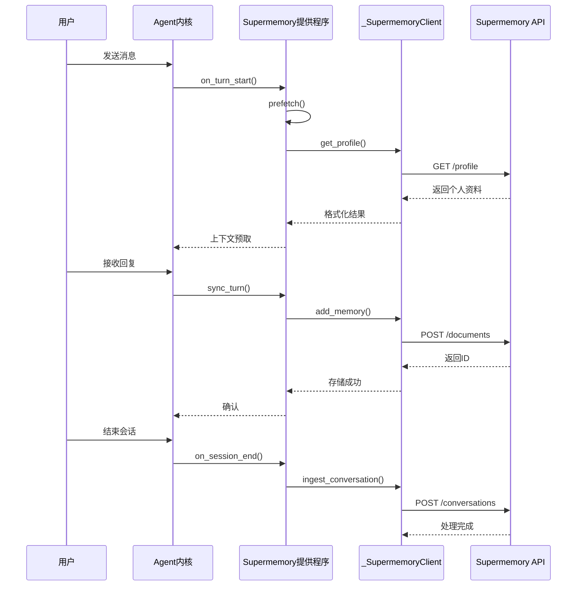
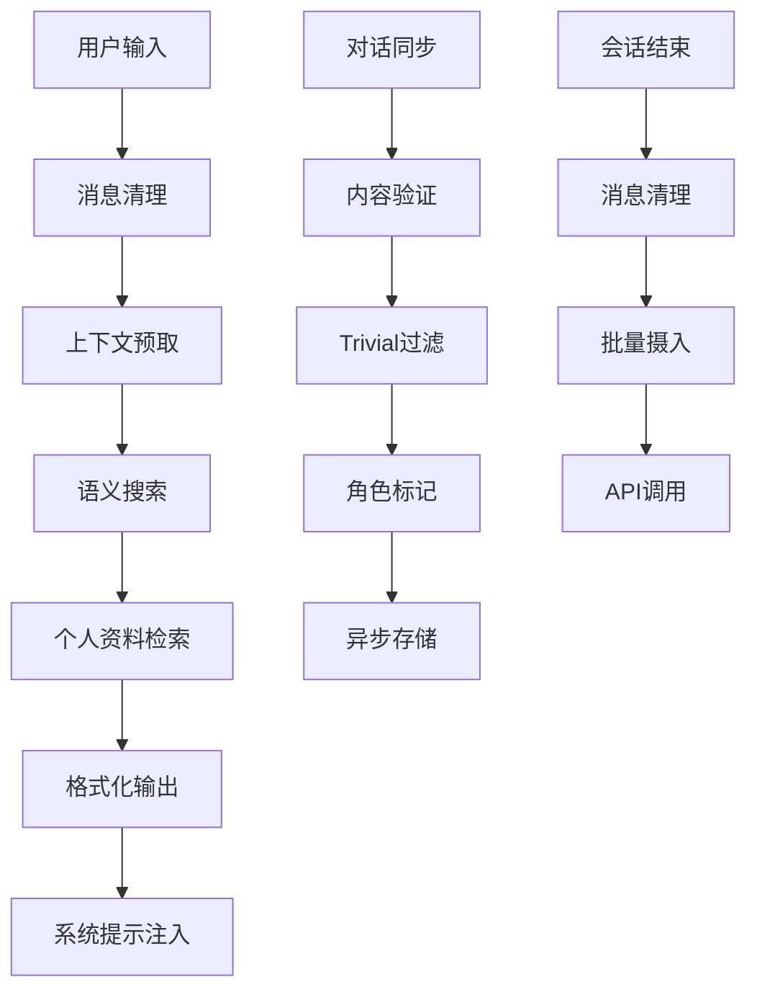
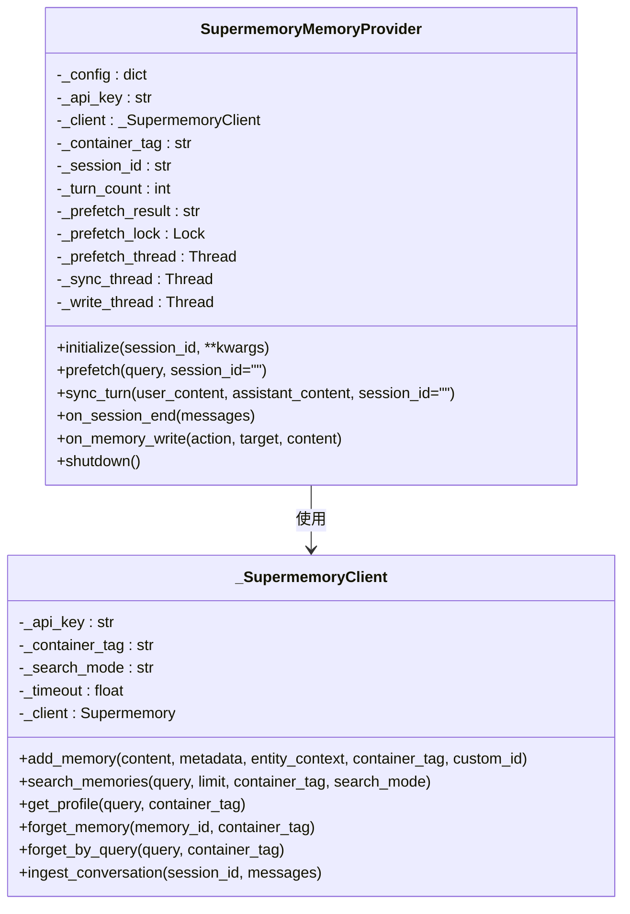
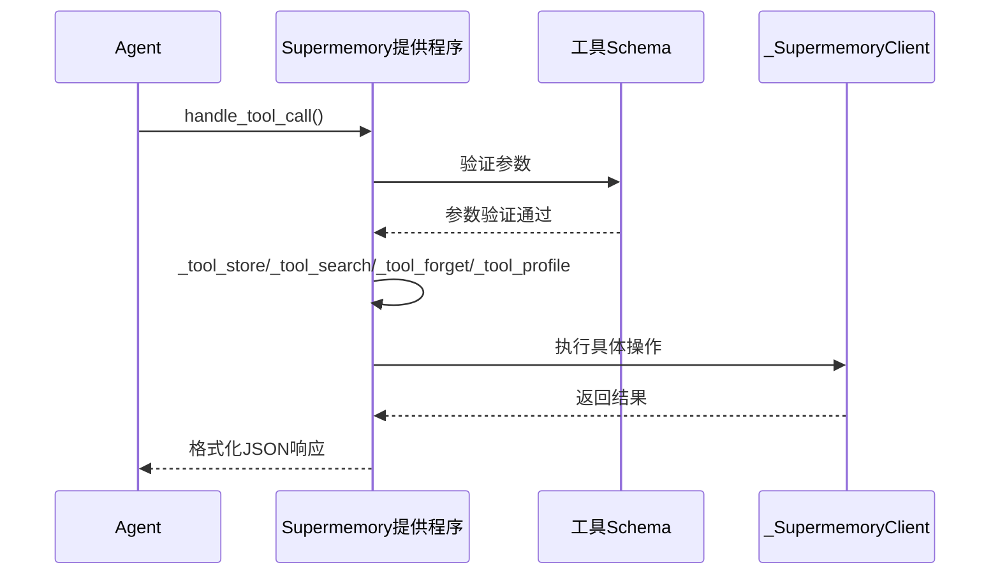
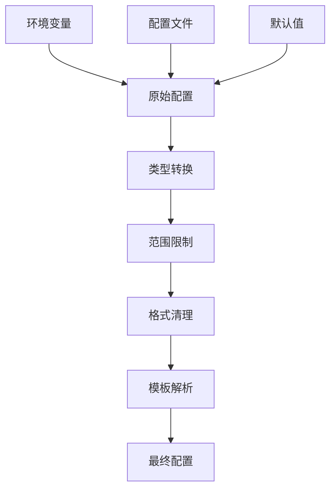
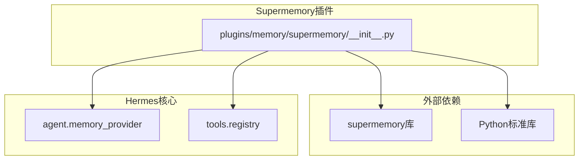
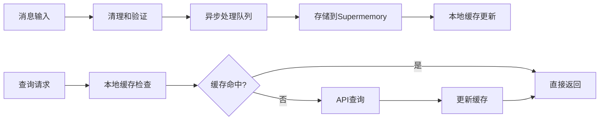
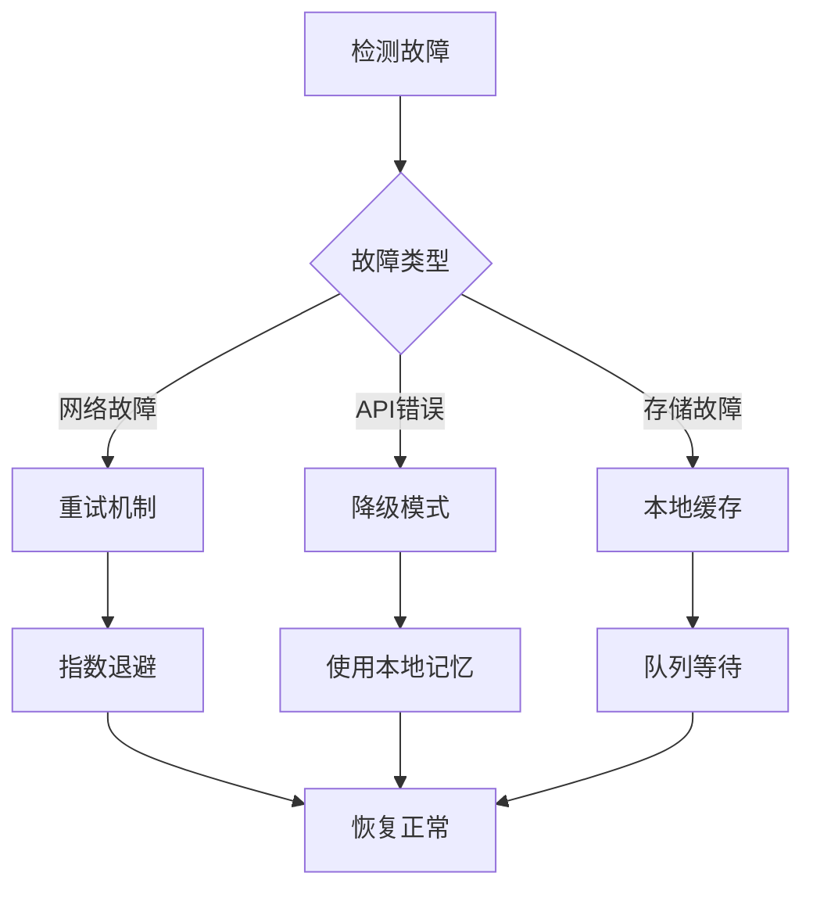

# Supermemory记忆提供程序

<cite>
**本文档引用的文件**
- [plugins/memory/supermemory/__init__.py](file://plugins/memory/supermemory/__init__.py)
- [tests/plugins/memory/test_supermemory_provider.py](file://tests/plugins/memory/test_supermemory_provider.py)
- [hermes_cli/memory_setup.py](file://hermes_cli/memory_setup.py)
- [website/docs/user-guide/features/memory-providers.md](file://website/docs/user-guide/features/memory-providers.md)
- [README.md](file://README.md)
- [pyproject.toml](file://pyproject.toml)
- [requirements.txt](file://requirements.txt)
</cite>

## 目录
1. [简介](#简介)
2. [项目结构](#项目结构)
3. [核心组件](#核心组件)
4. [架构概览](#架构概览)
5. [详细组件分析](#详细组件分析)
6. [依赖关系分析](#依赖关系分析)
7. [性能考虑](#性能考虑)
8. [故障排除指南](#故障排除指南)
9. [结论](#结论)
10. [附录](#附录)

## 简介

Supermemory是Hermes Agent生态系统中的一个高级记忆提供程序，基于语义长短期记忆技术，为AI代理提供了强大的知识管理能力。该插件实现了完整的MemoryProvider接口，集成了语义搜索、显式记忆工具、清理后的对话捕获和会话结束时的对话摄入功能。

Supermemory的核心优势在于其分布式存储机制、高可用性和扩展性特点。通过与Supermemory云服务的集成，该提供程序能够提供：

- **语义长期记忆**：基于深度学习模型的记忆检索和存储
- **个人资料回忆**：持久化的用户偏好和上下文信息
- **智能搜索功能**：支持混合、记忆和文档三种搜索模式
- **多容器支持**：允许在同一系统中管理多个独立的知识库
- **自动上下文管理**：防止记忆污染的上下文围栏机制

## 项目结构

Supermemory记忆提供程序位于Hermes Agent项目的插件系统中，采用模块化设计，便于集成和维护。



**图表来源**
- [plugins/memory/supermemory/__init__.py:1-792](file://plugins/memory/supermemory/__init__.py#L1-L792)
- [hermes_cli/memory_setup.py:1-452](file://hermes_cli/memory_setup.py#L1-L452)

**章节来源**
- [plugins/memory/supermemory/__init__.py:1-792](file://plugins/memory/supermemory/__init__.py#L1-L792)
- [hermes_cli/memory_setup.py:1-452](file://hermes_cli/memory_setup.py#L1-L452)

## 核心组件

Supermemory记忆提供程序由多个关键组件构成，每个组件都有明确的职责和功能：

### 主要组件概述

1. **SupermemoryMemoryProvider**：主提供程序类，实现MemoryProvider接口
2. **_SupermemoryClient**：内部客户端，封装与Supermemory API的交互
3. **配置管理系统**：处理环境变量和配置文件
4. **工具调用处理器**：提供四个核心工具（存储、搜索、遗忘、个人资料）
5. **线程管理器**：异步处理记忆操作，确保性能和响应性

### 配置参数详解

| 参数名称 | 默认值 | 范围 | 描述 |
|---------|--------|------|------|
| container_tag | "hermes" | 字符串 | 容器标签，用于组织记忆内容 |
| auto_recall | True | 布尔值 | 是否自动召回记忆 |
| auto_capture | True | 布尔值 | 是否自动捕获对话 |
| max_recall_results | 10 | 1-20 | 最大召回结果数量 |
| profile_frequency | 50 | 1-500 | 个人资料刷新频率 |
| capture_mode | "all" | "all"/"everything" | 捕获模式 |
| search_mode | "hybrid" | "hybrid"/"memories"/"documents" | 搜索模式 |
| api_timeout | 5.0 | 0.5-15.0秒 | API超时时间 |

**章节来源**
- [plugins/memory/supermemory/__init__.py:56-141](file://plugins/memory/supermemory/__init__.py#L56-L141)
- [plugins/memory/supermemory/__init__.py:420-449](file://plugins/memory/supermemory/__init__.py#L420-L449)

## 架构概览

Supermemory记忆提供程序采用了分层架构设计，确保了良好的可维护性和扩展性。



**图表来源**
- [plugins/memory/supermemory/__init__.py:527-616](file://plugins/memory/supermemory/__init__.py#L527-L616)
- [plugins/memory/supermemory/__init__.py:263-368](file://plugins/memory/supermemory/__init__.py#L263-L368)

### 数据流架构



**图表来源**
- [plugins/memory/supermemory/__init__.py:253-261](file://plugins/memory/supermemory/__init__.py#L253-L261)
- [plugins/memory/supermemory/__init__.py:563-616](file://plugins/memory/supermemory/__init__.py#L563-L616)

## 详细组件分析

### SupermemoryMemoryProvider 类

这是整个插件的核心类，实现了MemoryProvider接口的所有方法。

#### 关键特性

1. **初始化流程**：处理环境变量、配置文件和容器标签解析
2. **上下文管理**：自动预取和格式化记忆上下文
3. **异步操作**：使用线程池处理存储和搜索请求
4. **多容器支持**：允许在同一系统中管理多个独立的知识库

#### 线程管理机制



**图表来源**
- [plugins/memory/supermemory/__init__.py:420-792](file://plugins/memory/supermemory/__init__.py#L420-L792)

**章节来源**
- [plugins/memory/supermemory/__init__.py:420-792](file://plugins/memory/supermemory/__init__.py#L420-L792)

### 工具调用系统

Supermemory提供了四个核心工具，每个工具都经过精心设计以满足不同的记忆管理需求。

#### 工具定义

| 工具名称 | 功能描述 | 参数 | 返回值 |
|---------|----------|------|--------|
| supermemory_store | 存储显式记忆 | content, metadata, container_tag | JSON字符串 |
| supermemory_search | 语义搜索记忆 | query, limit, container_tag | JSON字符串 |
| supermemory_forget | 忘记特定记忆 | id, query, container_tag | JSON字符串 |
| supermemory_profile | 获取个人资料 | query, container_tag | JSON字符串 |

#### 工具执行流程



**图表来源**
- [plugins/memory/supermemory/__init__.py:666-787](file://plugins/memory/supermemory/__init__.py#L666-L787)

**章节来源**
- [plugins/memory/supermemory/__init__.py:370-417](file://plugins/memory/supermemory/__init__.py#L370-L417)
- [plugins/memory/supermemory/__init__.py:682-787](file://plugins/memory/supermemory/__init__.py#L682-L787)

### 配置管理系统

配置管理系统负责处理各种配置来源，确保系统的灵活性和可定制性。

#### 配置优先级

1. **环境变量**：SUPERMEMORY_API_KEY, SUPERMEMORY_CONTAINER_TAG
2. **配置文件**：$HERMES_HOME/supermemory.json
3. **默认值**：代码中的硬编码默认值

#### 配置验证和清理



**图表来源**
- [plugins/memory/supermemory/__init__.py:98-141](file://plugins/memory/supermemory/__init__.py#L98-L141)

**章节来源**
- [plugins/memory/supermemory/__init__.py:98-141](file://plugins/memory/supermemory/__init__.py#L98-L141)

## 依赖关系分析

Supermemory记忆提供程序的依赖关系相对简单，主要依赖于外部的supermemory库和标准库。



**图表来源**
- [plugins/memory/supermemory/__init__.py:20-21](file://plugins/memory/supermemory/__init__.py#L20-L21)

### 外部依赖详情

| 依赖项 | 版本要求 | 用途 |
|--------|----------|------|
| supermemory | 必需 | 与Supermemory API通信 |
| Python | >=3.11 | 运行时环境 |
| requests | >=2.33.0 | HTTP请求处理 |
| tenacity | >=9.1.4 | 重试机制 |
| pydantic | >=2.12.5 | 数据验证 |

**章节来源**
- [pyproject.toml:13-37](file://pyproject.toml#L13-L37)
- [requirements.txt:5-37](file://requirements.txt#L5-L37)

## 性能考虑

Supermemory记忆提供程序在设计时充分考虑了性能优化，采用了多种策略来确保高效运行。

### 异步处理策略

1. **线程池管理**：使用独立的线程处理存储、搜索和会话摄入操作
2. **超时控制**：为所有API调用设置合理的超时时间
3. **去重机制**：防止重复记忆的存储和召回
4. **批处理优化**：会话结束时进行批量摄入处理

### 内存管理



**图表来源**
- [plugins/memory/supermemory/__init__.py:563-637](file://plugins/memory/supermemory/__init__.py#L563-L637)

### 性能优化建议

1. **合理设置超时**：根据网络状况调整api_timeout参数
2. **控制召回数量**：通过max_recall_results平衡性能和准确性
3. **使用多容器**：将不同类型的记忆分离到不同容器中
4. **定期清理**：使用forget工具删除不再需要的记忆

## 故障排除指南

### 常见问题及解决方案

#### 1. API密钥配置问题

**症状**：`is_available()`返回False或工具调用失败

**诊断步骤**：
1. 检查环境变量是否正确设置
2. 验证API密钥格式
3. 确认网络连接正常

**解决方法**：
```bash
export SUPERMEMORY_API_KEY="your_api_key_here"
hermes memory setup
```

#### 2. 记忆存储失败

**症状**：`add_memory`操作抛出异常

**可能原因**：
1. API超时
2. 内容格式不正确
3. 容器标签无效

**调试方法**：
1. 检查网络连接
2. 验证内容长度和格式
3. 确认容器权限

#### 3. 搜索结果不准确

**症状**：`search_memories`返回相关性较低的结果

**优化建议**：
1. 调整search_mode参数
2. 优化entity_context内容
3. 增加记忆数量

**章节来源**
- [plugins/memory/supermemory/__init__.py:454-462](file://plugins/memory/supermemory/__init__.py#L454-L462)
- [tests/plugins/memory/test_supermemory_provider.py:64-84](file://tests/plugins/memory/test_supermemory_provider.py#L64-L84)

### 日志和监控

Supermemory提供程序内置了详细的日志记录机制，有助于问题诊断和性能监控。

#### 关键日志点

1. **初始化阶段**：记录配置加载和客户端创建
2. **API调用**：记录所有外部服务交互
3. **错误处理**：记录异常和故障恢复
4. **性能指标**：记录响应时间和吞吐量

## 结论

Supermemory记忆提供程序是一个功能强大、设计精良的记忆管理解决方案。它成功地将复杂的语义记忆技术与Hermes Agent的插件架构相结合，为AI代理提供了接近人类水平的记忆能力。

### 主要优势

1. **技术先进性**：基于最新的语义搜索和记忆技术
2. **架构优雅**：模块化设计，易于维护和扩展
3. **性能优异**：异步处理和缓存机制确保高效运行
4. **配置灵活**：支持多种配置方式和自定义选项
5. **安全可靠**：完善的错误处理和超时控制

### 适用场景

Supermemory特别适合以下应用场景：

- **长期对话代理**：需要记住用户偏好和历史对话的AI助手
- **知识管理**：需要组织和检索大量信息的企业应用
- **个性化推荐**：基于用户行为和偏好的智能推荐系统
- **智能客服**：能够理解上下文并提供准确回答的客服机器人

### 未来发展方向

1. **增强搜索算法**：改进语义理解和搜索精度
2. **扩展存储能力**：支持更多类型的媒体内容
3. **优化性能**：进一步提升响应速度和并发处理能力
4. **增强安全性**：完善访问控制和数据保护机制

## 附录

### 安装和配置指南

#### 系统要求

- Python >= 3.11
- 至少2GB RAM
- 稳定的网络连接

#### 安装步骤

1. **基础安装**：
```bash
pip install hermes-agent
```

2. **配置API密钥**：
```bash
export SUPERMEMORY_API_KEY="your_api_key"
```

3. **启动设置向导**：
```bash
hermes memory setup
```

#### 配置文件示例

```json
{
    "container_tag": "hermes-{identity}",
    "auto_recall": true,
    "auto_capture": true,
    "max_recall_results": 10,
    "profile_frequency": 50,
    "capture_mode": "all",
    "search_mode": "hybrid",
    "entity_context": "用户助手对话...",
    "api_timeout": 5.0,
    "enable_custom_container_tags": false,
    "custom_containers": [],
    "custom_container_instructions": ""
}
```

### 使用案例

#### 案例1：个性化AI助手

```python
# 初始化Supermemory提供程序
provider = SupermemoryMemoryProvider()
provider.initialize("session_001")

# 存储用户偏好
provider.handle_tool_call("supermemory_store", {
    "content": "用户喜欢简洁的回复风格",
    "metadata": {"category": "preference"}
})

# 搜索相关记忆
result = provider.handle_tool_call("supermemory_search", {
    "query": "用户偏好",
    "limit": 5
})
```

#### 案例2：多容器知识管理

```python
# 启用多容器模式
config = {
    "enable_custom_container_tags": True,
    "custom_containers": ["project-alpha", "shared-knowledge"],
    "custom_container_instructions": "使用project-alpha存储项目相关知识"
}

# 在指定容器中存储记忆
provider.handle_tool_call("supermemory_store", {
    "content": "项目需求变更",
    "container_tag": "project-alpha"
})
```

### 监控和运维

#### 关键监控指标

| 指标类型 | 指标名称 | 描述 |
|----------|----------|------|
| 性能 | API响应时间 | Supermemory API调用的平均响应时间 |
| 性能 | 存储延迟 | 记忆存储操作的平均耗时 |
| 性能 | 搜索延迟 | 语义搜索操作的平均耗时 |
| 可用性 | 请求成功率 | API调用的成功率 |
| 可用性 | 错误率 | API调用的错误率 |
| 资源 | 内存使用 | 应用程序的内存占用情况 |
| 资源 | CPU使用 | 应用程序的CPU占用情况 |

#### 备份和恢复策略

1. **定期备份**：建议每天备份重要的记忆数据
2. **版本控制**：对配置文件进行版本管理
3. **灾难恢复**：制定详细的恢复计划和测试流程
4. **监控告警**：设置关键指标的告警阈值

#### 故障恢复流程



**章节来源**
- [website/docs/user-guide/features/memory-providers.md:435-460](file://website/docs/user-guide/features/memory-providers.md#L435-L460)
- [README.md:1-179](file://README.md#L1-L179)