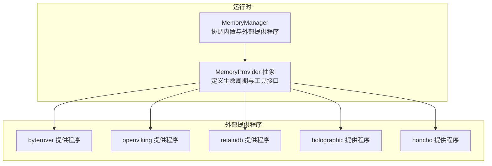
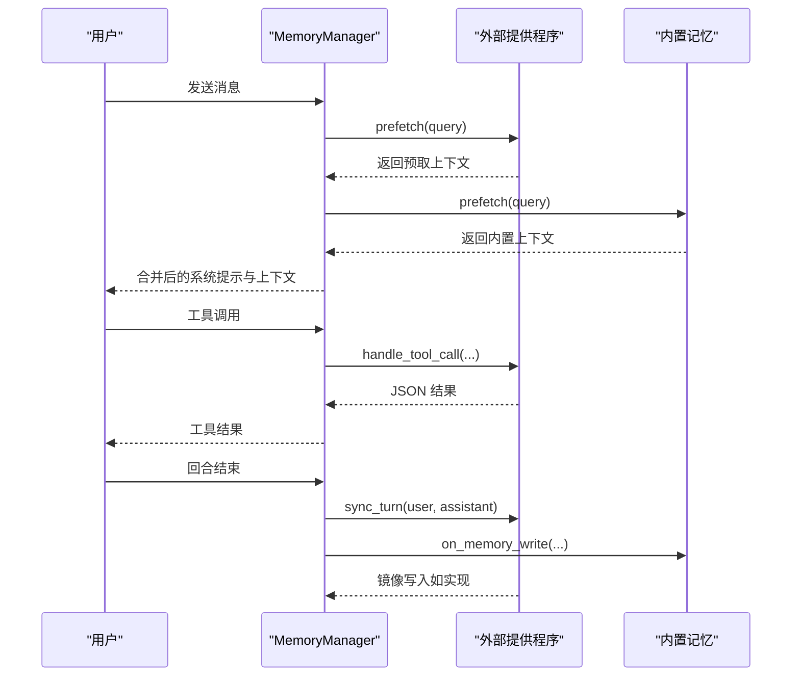
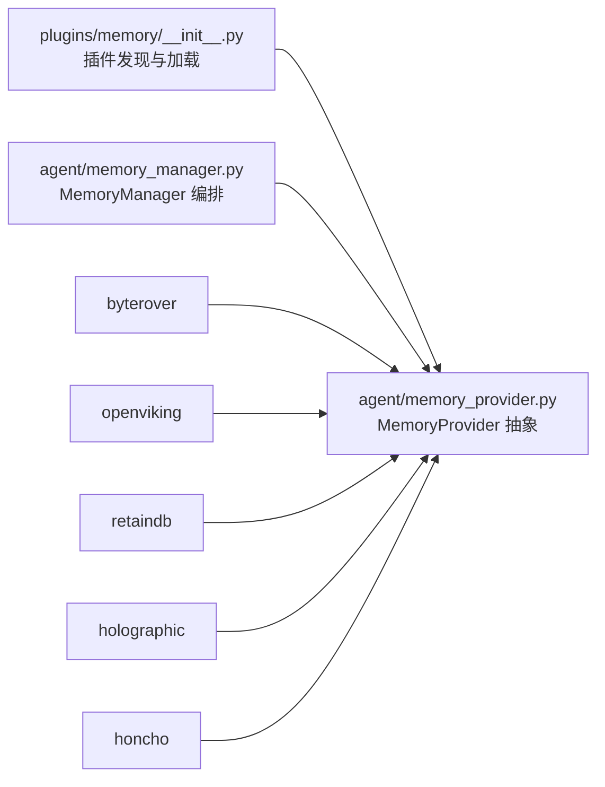

# 其他记忆提供程序

<cite>
**本文引用的文件**
- [plugins/memory/__init__.py](file://plugins/memory/__init__.py)
- [plugins/memory/byterover/__init__.py](file://plugins/memory/byterover/__init__.py)
- [plugins/memory/openviking/__init__.py](file://plugins/memory/openviking/__init__.py)
- [plugins/memory/retaindb/__init__.py](file://plugins/memory/retaindb/__init__.py)
- [plugins/memory/holographic/__init__.py](file://plugins/memory/holographic/__init__.py)
- [plugins/memory/honcho/__init__.py](file://plugins/memory/honcho/__init__.py)
- [agent/memory_provider.py](file://agent/memory_provider.py)
- [agent/memory_manager.py](file://agent/memory_manager.py)
- [docs/honcho-integration-spec.md](file://docs/honcho-integration-spec.md)
</cite>

## 目录
1. [简介](#简介)
2. [项目结构](#项目结构)
3. [核心组件](#核心组件)
4. [架构总览](#架构总览)
5. [详细组件分析](#详细组件分析)
6. [依赖关系分析](#依赖关系分析)
7. [性能考量](#性能考量)
8. [故障排查指南](#故障排查指南)
9. [结论](#结论)
10. [附录](#附录)

## 简介
本文件系统性介绍 Hermes Agent 中“其他记忆提供程序”的能力与用法，覆盖 byterover、openviking、retaindb、holographic、honcho 等插件型记忆提供程序。内容包括：
- 各提供程序的核心功能、技术特色与适用场景
- 基本配置方法与使用要点
- 与主流提供程序（hindsight、mem0、supermemory）的关系与互补
- 选择建议与迁移指南

## 项目结构
- 记忆提供程序通过统一的 MemoryProvider 抽象接入，由 MemoryManager 协调内置与外部提供程序。
- 外部提供程序位于 plugins/memory/<name>/，遵循统一生命周期与工具接口。

图示来源
- [agent/memory_manager.py:72-131](file://agent/memory_manager.py#L72-L131)
- [agent/memory_provider.py:42-232](file://agent/memory_provider.py#L42-L232)

章节来源
- [plugins/memory/__init__.py:1-318](file://plugins/memory/__init__.py#L1-L318)
- [agent/memory_manager.py:1-363](file://agent/memory_manager.py#L1-L363)
- [agent/memory_provider.py:1-232](file://agent/memory_provider.py#L1-L232)

## 核心组件
- MemoryProvider 抽象：定义提供程序名称、可用性检查、初始化、系统提示块、预取、回合同步、工具模式、处理工具调用、关闭等生命周期钩子。
- MemoryManager：注册与编排多个提供程序；聚合系统提示、合并预取上下文、分发工具调用、触发可选钩子（会话结束、预压缩、委托观察等）。

章节来源
- [agent/memory_provider.py:42-232](file://agent/memory_provider.py#L42-L232)
- [agent/memory_manager.py:72-363](file://agent/memory_manager.py#L72-L363)

## 架构总览
外部提供程序通过插件目录自动发现与加载，仅允许启用一个外部提供程序，其余作为备用或仅在 CLI 中暴露命令。每个提供程序实现 MemoryProvider 接口，并可选择性实现工具模式与后台线程预取。

图示来源
- [agent/memory_manager.py:167-256](file://agent/memory_manager.py#L167-L256)
- [agent/memory_provider.py:92-137](file://agent/memory_provider.py#L92-L137)

章节来源
- [plugins/memory/__init__.py:32-96](file://plugins/memory/__init__.py#L32-L96)
- [agent/memory_manager.py:167-256](file://agent/memory_manager.py#L167-L256)
- [agent/memory_provider.py:92-137](file://agent/memory_provider.py#L92-L137)

## 详细组件分析

### ByteRover 提供程序
- 核心功能
  - 本地优先的持久化知识树，支持层级检索与模糊文本到 LLM 驱动搜索的两级检索。
  - 通过 brv CLI 操作：查询、整理（curate）、状态检查。
  - 会话级异步写入，镜像内置记忆写入。
- 技术特色
  - 线程安全的 brv 路径解析与缓存。
  - 同步预取（prefetch）与后台 curate（sync_turn）。
  - 最小长度过滤与超时控制。
- 适用场景
  - 需要本地优先、可云同步的知识树式记忆。
  - 对检索质量有要求且希望模型参与组织记忆的场景。
- 基本配置
  - 环境变量：BRV_API_KEY（可选，用于云端特性）。
  - 工作目录：$HERMES_HOME/byterover（按配置文件作用域隔离）。
- 使用要点
  - 首次使用需安装 brv CLI；若不可用则不激活。
  - 预取阻塞直至返回或超时，确保首轮调用前上下文就绪。
  - 工具：brv_query、brv_curate、brv_status。

章节来源
- [plugins/memory/byterover/__init__.py:1-384](file://plugins/memory/byterover/__init__.py#L1-L384)

### OpenViking 提供程序
- 核心功能
  - Volcengine 的上下文数据库，支持语义搜索、层级目录浏览、资源索引、会话管理与自动记忆抽取。
  - 双向交互：搜索、读取、浏览、显式记忆、添加资源。
- 技术特色
  - 使用 httpx 直接访问 REST API，避免额外 SDK 依赖。
  - atexit 安全网关确保会话提交。
  - 异步预取与后台同步，带锁与线程池管理。
- 适用场景
  - 企业级知识库、需要结构化浏览与自动抽取记忆的团队协作。
- 基本配置
  - 环境变量：OPENVIKING_ENDPOINT（必填）、OPENVIKING_API_KEY（可选）、OPENVIKING_ACCOUNT/USER（默认 root/default）。
- 使用要点
  - 初始化时健康检查失败将禁用插件。
  - 支持会话提交触发记忆抽取（6 类别）。
  - 工具：viking_search、viking_read、viking_browse、viking_remember、viking_add_resource。

章节来源
- [plugins/memory/openviking/__init__.py:1-633](file://plugins/memory/openviking/__init__.py#L1-L633)

### RetainDB 提供程序
- 核心功能
  - 云端记忆服务，提供语义搜索、用户画像、合成上下文、共享文件存储与显式记忆工具。
  - 持久化 SQLite 写入队列，崩溃安全、异步入库。
  - 三类预取：语义上下文叠加、用户对话合成、代理自我模型。
- 技术特色
  - 写入队列：SQLite 表 + 队列 + 后台线程，失败重试与错误记录。
  - 上下文叠加去重：基于内容规范化避免重复。
  - 与 SOUL.md 同步，种子代理身份。
- 适用场景
  - 需要跨会话用户建模、对话合成与共享文件的场景。
- 基本配置
  - 环境变量：RETAINDB_API_KEY（必填）、RETAINDB_BASE_URL（默认）、RETAINDB_PROJECT（默认 default）。
- 使用要点
  - 初始化时解析项目名（优先 RETAINDB_PROJECT，其次从配置文件推断）。
  - 工具：retaindb_profile、retaindb_search、retaindb_context、retaindb_remember、retaindb_forget、文件上传/列表/读取/索引/删除。

章节来源
- [plugins/memory/retaindb/__init__.py:1-767](file://plugins/memory/retaindb/__init__.py#L1-L767)

### Holographic 提供程序
- 核心功能
  - 结构化事实存储，实体解析、信任评分与 HRR（全息位置编码）组合检索。
  - 提供 fact_store 与 fact_feedback 工具，支持添加、搜索、探查、关联、推理、矛盾检测、更新/删除/列举。
- 技术特色
  - SQLite + FTS5 + 实体链接 + HRR 向量（可选 numpy）。
  - 可配置默认信任、HRR 维度、时间衰减半衰期。
  - 可选自动抽取（on_session_end）。
- 适用场景
  - 需要深度推理、结构化事实与信任评分的场景。
- 基本配置
  - 插件配置文件：$HERMES_HOME/config.yaml 下 plugins.hermes-memory-store。
  - 关键项：db_path、auto_extract、default_trust、hrr_dim、min_trust_threshold。
- 使用要点
  - 通过 fact_store(action=...) 执行操作；fact_feedback 用于训练信任。
  - 支持 on_memory_write 镜像内置记忆为用户偏好/通用类别。

章节来源
- [plugins/memory/holographic/__init__.py:1-408](file://plugins/memory/holographic/__init__.py#L1-L408)

### Honcho 提供程序
- 核心功能
  - AI 原生跨会话用户建模：同伴卡片、语义搜索、对话合成（dialectic）、结论持久化。
  - 三种召回模式：context（自动注入）、tools（仅工具）、hybrid（两者结合）。
  - 成本感知：注入频率、上下文/对话 cadence、推理级别上限。
- 技术特色
  - 懒初始化：tools-only 模式下首次工具调用才建立会话。
  - 首轮上下文烘焙：首次调用拉取并缓存代表与同伴卡，后续复用。
  - 会话命名策略：按目录、全局、映射、标题等策略解析会话名。
- 适用场景
  - 需要高质量用户建模与自然语言问答的长期对话。
- 基本配置
  - 配置链：$HERMES_HOME/honcho.json（按配置文件作用域）、~/.honcho/config.json（历史全局）、环境变量。
  - 关键项：api_key、baseUrl、recall_mode、context_tokens、injectionFrequency、contextCadence、dialecticCadence、reasoningLevelCap。
- 使用要点
  - 工具：honcho_profile、honcho_search、honcho_context、honcho_conclude。
  - 支持 on_memory_write 将用户侧记忆写入结论。

章节来源
- [plugins/memory/honcho/__init__.py:1-723](file://plugins/memory/honcho/__init__.py#L1-L723)
- [docs/honcho-integration-spec.md:1-378](file://docs/honcho-integration-spec.md#L1-L378)

## 依赖关系分析
- 插件发现与加载
  - plugins/memory/__init__.py 扫描 plugins/memory/<name>/ 目录，读取 plugin.yaml 获取描述，执行 is_available 判断可用性，动态导入模块并注册 MemoryProvider 实例。
- 生命周期与工具路由
  - MemoryManager 统一注册提供程序，聚合 system_prompt_block、合并 prefetch 结果、分发工具调用至对应提供程序。
- 与其他提供程序的关系
  - 本仓库未包含 hindsight、mem0、supermemory 的具体实现源码；但 MemoryProvider 抽象与 MemoryManager 的设计保证了这些提供程序可按相同接口接入。
  - Honcho 的集成规范文档展示了与 openclaw 的差异与可移植模式，体现不同实现间的互补与演进。

图示来源
- [plugins/memory/__init__.py:32-96](file://plugins/memory/__init__.py#L32-L96)
- [agent/memory_provider.py:42-232](file://agent/memory_provider.py#L42-L232)
- [agent/memory_manager.py:72-131](file://agent/memory_manager.py#L72-L131)

章节来源
- [plugins/memory/__init__.py:32-96](file://plugins/memory/__init__.py#L32-L96)
- [agent/memory_manager.py:72-131](file://agent/memory_manager.py#L72-L131)

## 性能考量
- 预取与注入
  - OpenViking、RetainDB、Honcho 等提供程序均采用后台线程预取，减少每回合的阻塞延迟；Honcho 支持“仅首回合注入”以降低成本。
- 写入路径
  - RetainDB 使用 SQLite 写入队列，崩溃安全、异步入库，避免阻塞主流程。
  - Honcho 对消息进行分片与续传标记，适配 API 字符限制。
- 检索与合成
  - Holographic 使用 FTS5 + Jaccard + HRR 组合打分，兼顾关键词与语义相似度。
  - RetainDB 的 dialectic 合成根据查询长度动态调整推理级别，平衡成本与效果。
- 并发与稳定性
  - 各提供程序普遍采用线程锁与守护线程，确保后台任务稳定完成并在关闭时优雅退出。

章节来源
- [plugins/memory/openviking/__init__.py:380-491](file://plugins/memory/openviking/__init__.py#L380-L491)
- [plugins/memory/retaindb/__init__.py:330-408](file://plugins/memory/retaindb/__init__.py#L330-L408)
- [plugins/memory/honcho/__init__.py:477-523](file://plugins/memory/honcho/__init__.py#L477-L523)
- [plugins/memory/holographic/__init__.py:205-224](file://plugins/memory/holographic/__init__.py#L205-L224)

## 故障排查指南
- 提供程序不可用
  - 检查 is_available 条件：如缺少 brv CLI、HTTPX 依赖、必要环境变量等。
  - 查看日志输出，确认初始化阶段的异常（如健康检查失败、网络超时）。
- 工具调用失败
  - 确认工具名称是否在提供程序的 get_tool_schemas 中；查看 handle_tool_call 的错误包装。
  - 对于 Honcho，确认 recall_mode 与懒初始化状态，避免在 cron/flush 上下文中误用。
- 写入与同步问题
  - RetainDB：检查 SQLite 队列是否正常工作，失败条目会记录 last_error，稍后重试。
  - Honcho：确认会话已创建，消息分片是否过长导致截断。
- 预取结果为空
  - 检查最小长度阈值、查询长度与线程等待超时；确认 recall_mode 是否为 tools-only 导致不自动注入。

章节来源
- [plugins/memory/byterover/__init__.py:184-235](file://plugins/memory/byterover/__init__.py#L184-L235)
- [plugins/memory/openviking/__init__.py:270-304](file://plugins/memory/openviking/__init__.py#L270-L304)
- [plugins/memory/retaindb/__init__.py:330-408](file://plugins/memory/retaindb/__init__.py#L330-L408)
- [plugins/memory/honcho/__init__.py:159-168](file://plugins/memory/honcho/__init__.py#L159-L168)

## 结论
- 选择建议
  - 本地优先 + 知识树：byterover
  - 企业知识库 + 自动抽取：openviking
  - 用户建模 + 对话合成 + 文件共享：retaindb、honcho
  - 结构化事实 + 推理与信任：holographic
- 互补关系
  - 以上提供程序与主流提供程序（hindsight、mem0、supermemory）共享同一抽象接口，可在同一系统中按需切换或组合使用。
  - Honcho 的集成规范体现了不同实现间的最佳实践迁移路径。

## 附录

### 各提供程序工具概览（名称与用途）
- byterover：brv_query、brv_curate、brv_status
- openviking：viking_search、viking_read、viking_browse、viking_remember、viking_add_resource
- retaindb：retaindb_profile、retaindb_search、retaindb_context、retaindb_remember、retaindb_forget、文件工具集
- holographic：fact_store（含 add/search/probe/related/reason/contradict/update/remove/list）、fact_feedback
- honcho：honcho_profile、honcho_search、honcho_context、honcho_conclude

章节来源
- [plugins/memory/byterover/__init__.py:126-164](file://plugins/memory/byterover/__init__.py#L126-L164)
- [plugins/memory/openviking/__init__.py:134-245](file://plugins/memory/openviking/__init__.py#L134-L245)
- [plugins/memory/retaindb/__init__.py:49-173](file://plugins/memory/retaindb/__init__.py#L49-L173)
- [plugins/memory/holographic/__init__.py:37-90](file://plugins/memory/holographic/__init__.py#L37-L90)
- [plugins/memory/honcho/__init__.py:33-112](file://plugins/memory/honcho/__init__.py#L33-L112)