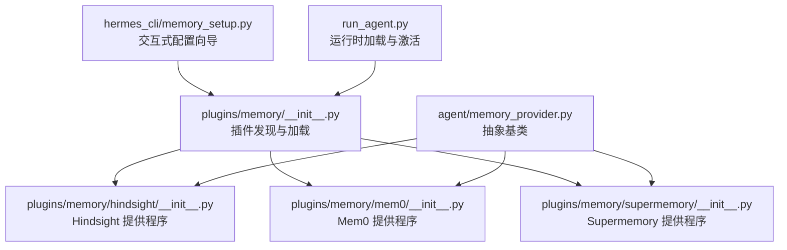
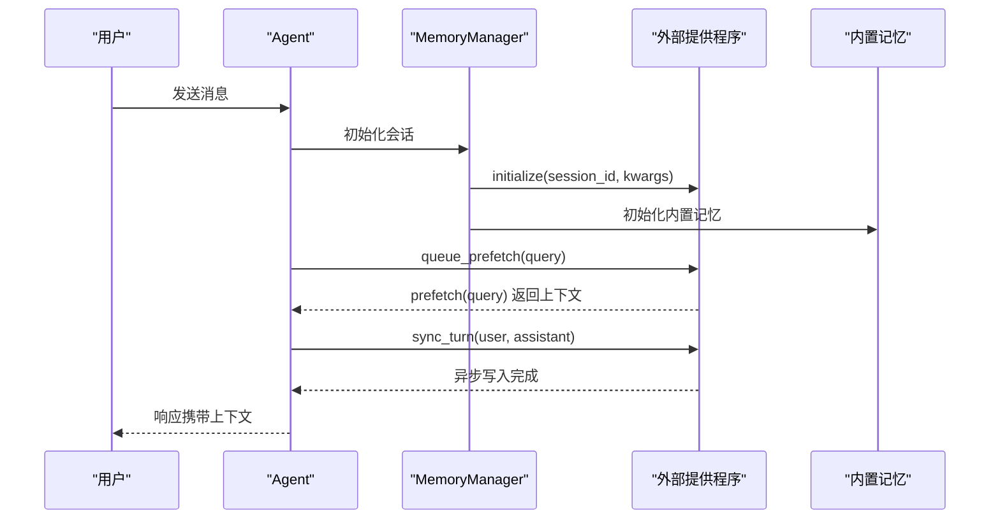
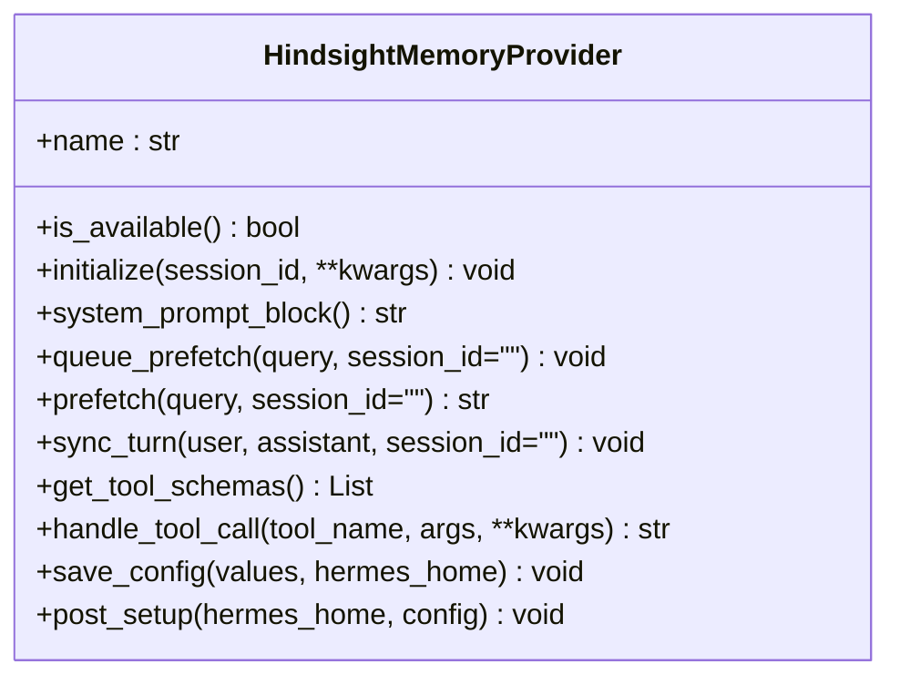
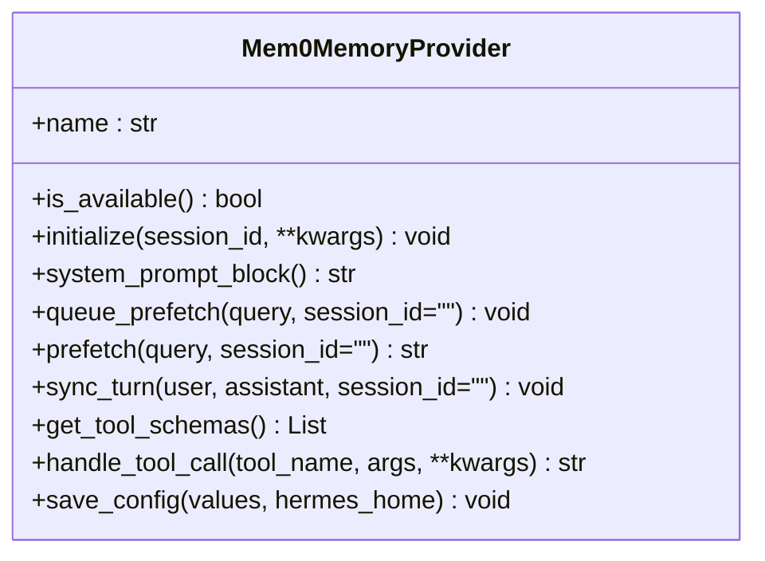
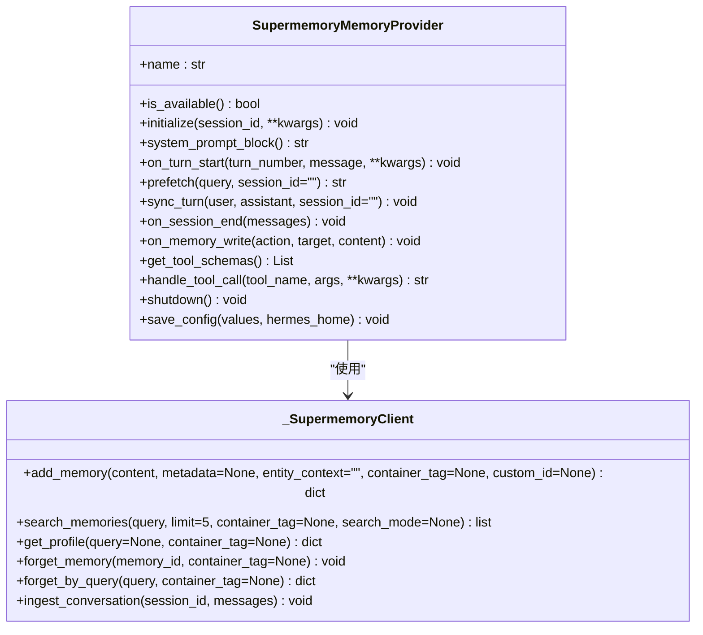
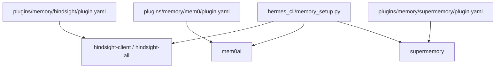

# 外部记忆提供程序

<cite>
**本文引用的文件**
- [plugins/memory/__init__.py](file://plugins/memory/__init__.py)
- [agent/memory_provider.py](file://agent/memory_provider.py)
- [plugins/memory/hindsight/__init__.py](file://plugins/memory/hindsight/__init__.py)
- [plugins/memory/mem0/__init__.py](file://plugins/memory/mem0/__init__.py)
- [plugins/memory/supermemory/__init__.py](file://plugins/memory/supermemory/__init__.py)
- [plugins/memory/hindsight/plugin.yaml](file://plugins/memory/hindsight/plugin.yaml)
- [plugins/memory/mem0/plugin.yaml](file://plugins/memory/mem0/plugin.yaml)
- [plugins/memory/supermemory/plugin.yaml](file://plugins/memory/supermemory/plugin.yaml)
- [hermes_cli/memory_setup.py](file://hermes_cli/memory_setup.py)
- [run_agent.py](file://run_agent.py)
</cite>

## 目录
1. [简介](#简介)
2. [项目结构](#项目结构)
3. [核心组件](#核心组件)
4. [架构总览](#架构总览)
5. [详细组件分析](#详细组件分析)
6. [依赖分析](#依赖分析)
7. [性能考虑](#性能考虑)
8. [故障排除指南](#故障排除指南)
9. [结论](#结论)
10. [附录](#附录)

## 简介
本文件系统性梳理 Hermes Agent 的外部记忆提供程序，重点覆盖 Hindsight、Mem0、Supermemory 三大提供程序。内容涵盖技术架构、数据存储与查询能力、配置与认证、性能特征、对比分析与选型建议、安装配置步骤、使用示例与故障排除，以及在多提供程序间的选择与切换策略。

## 项目结构
外部记忆提供程序采用“插件式”发现与加载机制：
- 插件目录：plugins/memory/<name>/
- 发现与加载：通过 plugins/memory/__init__.py 扫描子目录，读取 plugin.yaml 元数据，按需导入模块并实例化 MemoryProvider 实现
- 激活控制：仅允许一个外部提供程序激活，由 config.yaml 中的 memory.provider 字段指定
- 生命周期：由 MemoryManager 调用，遵循 MemoryProvider 抽象接口定义的生命周期钩子

图示来源
- [plugins/memory/__init__.py:32-75](file://plugins/memory/__init__.py#L32-L75)
- [plugins/memory/hindsight/__init__.py:185-232](file://plugins/memory/hindsight/__init__.py#L185-L232)
- [plugins/memory/mem0/__init__.py:119-140](file://plugins/memory/mem0/__init__.py#L119-L140)
- [plugins/memory/supermemory/__init__.py:420-452](file://plugins/memory/supermemory/__init__.py#L420-L452)
- [agent/memory_provider.py:42-81](file://agent/memory_provider.py#L42-L81)
- [hermes_cli/memory_setup.py:143-176](file://hermes_cli/memory_setup.py#L143-L176)
- [run_agent.py:1116-1123](file://run_agent.py#L1116-L1123)

章节来源
- [plugins/memory/__init__.py:32-75](file://plugins/memory/__init__.py#L32-L75)
- [plugins/memory/hindsight/plugin.yaml:1-9](file://plugins/memory/hindsight/plugin.yaml#L1-L9)
- [plugins/memory/mem0/plugin.yaml:1-6](file://plugins/memory/mem0/plugin.yaml#L1-L6)
- [plugins/memory/supermemory/plugin.yaml:1-6](file://plugins/memory/supermemory/plugin.yaml#L1-L6)

## 核心组件
- MemoryProvider 抽象基类：定义统一生命周期与可选钩子（初始化、系统提示块、预取、回合同步、工具模式、处理工具调用、关闭、会话结束、压缩前提取、委托观察、配置模式、保存配置、镜像内置写入）
- 插件发现与加载：扫描 plugins/memory/<name>/，读取 plugin.yaml，执行 is_available 判断可用性，支持 post_setup 与 save_config
- 运行时激活：run_agent.py 依据 config.yaml 的 memory.provider 加载对应插件；仅一个外部提供程序可激活
- 配置与认证：hermes_cli/memory_setup.py 提供交互式配置向导，自动安装依赖，写入 config.yaml 与 .env

章节来源
- [agent/memory_provider.py:42-232](file://agent/memory_provider.py#L42-L232)
- [plugins/memory/__init__.py:78-96](file://plugins/memory/__init__.py#L78-L96)
- [hermes_cli/memory_setup.py:183-217](file://hermes_cli/memory_setup.py#L183-L217)
- [run_agent.py:1116-1123](file://run_agent.py#L1116-L1123)

## 架构总览
外部提供程序与内置记忆共同工作，内置记忆始终激活，外部提供程序按配置叠加。外部提供程序通过异步/后台线程实现“预取 + 回合同步”，并在需要时暴露显式工具接口。

图示来源
- [agent/memory_provider.py:61-120](file://agent/memory_provider.py#L61-L120)
- [plugins/memory/hindsight/__init__.py:469-556](file://plugins/memory/hindsight/__init__.py#L469-L556)
- [plugins/memory/mem0/__init__.py:203-295](file://plugins/memory/mem0/__init__.py#L203-L295)
- [plugins/memory/supermemory/__init__.py:480-526](file://plugins/memory/supermemory/__init__.py#L480-L526)

## 详细组件分析

### Hindsight 提供程序
- 特点
  - 长期记忆 + 知识图谱 + 实体解析 + 多策略检索
  - 支持云（API 密钥）与本地（嵌入/外部）两种模式
  - 自动保留对话回合，支持标签过滤与预算控制
- 数据存储与查询
  - 云模式：通过 hindsight-client SDK 访问 API，支持 recall/reflect/retain
  - 本地模式：hindsight-all 提供本地嵌入与服务端，支持自定义 LLM 提供商与模型
  - 预取：基于 recall/reflect 的异步预取，结果注入系统提示块
- 配置与认证
  - 环境变量：HINDSIGHT_API_KEY、HINDSIGHT_BANK_ID、HINDSIGHT_BUDGET、HINDSIGHT_API_URL、HINDSIGHT_MODE
  - 配置文件：$HERMES_HOME/hindsight/config.json（优先），兼容旧版 ~/.hindsight/config.json
  - 依赖：hindsight-client>=0.4.22 或 hindsight-all（本地嵌入）
- 性能与特性
  - 使用专用事件循环与后台线程，避免 aiohttp 会话泄漏
  - 支持批量保留与异步保留选项
  - 支持多标签匹配策略与类型过滤
- 工具接口
  - hindsight_retain、hindsight_recall、hindsight_reflect
- 安装与配置
  - hermes memory setup 交互式向导，自动安装依赖，支持云/本地嵌入/本地外部三种模式选择
  - 生成 .env 并写入配置文件

图示来源
- [plugins/memory/hindsight/__init__.py:185-800](file://plugins/memory/hindsight/__init__.py#L185-L800)
- [plugins/memory/hindsight/plugin.yaml:1-9](file://plugins/memory/hindsight/plugin.yaml#L1-L9)

章节来源
- [plugins/memory/hindsight/__init__.py:142-179](file://plugins/memory/hindsight/__init__.py#L142-L179)
- [plugins/memory/hindsight/__init__.py:406-437](file://plugins/memory/hindsight/__init__.py#L406-L437)
- [plugins/memory/hindsight/__init__.py:439-467](file://plugins/memory/hindsight/__init__.py#L439-L467)
- [plugins/memory/hindsight/__init__.py:654-714](file://plugins/memory/hindsight/__init__.py#L654-L714)
- [plugins/memory/hindsight/__init__.py:715-773](file://plugins/memory/hindsight/__init__.py#L715-L773)
- [plugins/memory/hindsight/__init__.py:774-800](file://plugins/memory/hindsight/__init__.py#L774-L800)
- [plugins/memory/hindsight/plugin.yaml:1-9](file://plugins/memory/hindsight/plugin.yaml#L1-L9)

### Mem0 提供程序
- 特点
  - 服务器端 LLM 提取事实，语义检索 + 重排序，自动去重
  - 面向用户级记忆建模，跨会话检索
- 数据存储与查询
  - 通过 mem0ai SDK 调用平台 API
  - 支持 profile（概览）、search（检索）、conclude（存储明确事实）
- 配置与认证
  - 环境变量：MEM0_API_KEY（必填）、MEM0_USER_ID、MEM0_AGENT_ID
  - 配置文件：$HERMES_HOME/mem0.json（覆盖环境变量）
  - 依赖：mem0ai
- 性能与特性
  - 电路断路器：连续失败超过阈值后冷却，避免对不可用服务的冲击
  - 异步后台线程写入，非阻塞
- 工具接口
  - mem0_profile、mem0_search、mem0_conclude
- 安装与配置
  - hermes memory setup 自动安装依赖，交互式收集 API Key 与用户/代理标识

图示来源
- [plugins/memory/mem0/__init__.py:119-374](file://plugins/memory/mem0/__init__.py#L119-L374)
- [plugins/memory/mem0/plugin.yaml:1-6](file://plugins/memory/mem0/plugin.yaml#L1-L6)

章节来源
- [plugins/memory/mem0/__init__.py:40-66](file://plugins/memory/mem0/__init__.py#L40-L66)
- [plugins/memory/mem0/__init__.py:160-166](file://plugins/memory/mem0/__init__.py#L160-L166)
- [plugins/memory/mem0/__init__.py:203-218](file://plugins/memory/mem0/__init__.py#L203-L218)
- [plugins/memory/mem0/__init__.py:247-270](file://plugins/memory/mem0/__init__.py#L247-L270)
- [plugins/memory/mem0/__init__.py:272-295](file://plugins/memory/mem0/__init__.py#L272-L295)
- [plugins/memory/mem0/__init__.py:297-374](file://plugins/memory/mem0/__init__.py#L297-L374)
- [plugins/memory/mem0/plugin.yaml:1-6](file://plugins/memory/mem0/plugin.yaml#L1-L6)

### Supermemory 提供程序
- 特点
  - 语义长期记忆，支持档案式检索、显式记忆工具、清理后的回合捕获、会话末尾对话摄入
  - 支持多容器标签与自定义容器指令
- 数据存储与查询
  - 通过 supermemory SDK 调用 API，支持 documents.add、search.memories、profile、memories.forget
  - 支持 hybrid/memories/documents 三种搜索模式
  - 会话结束时摄入完整对话历史
- 配置与认证
  - 环境变量：SUPERMEMORY_API_KEY（必填），可选 SUPERMEMORY_CONTAINER_TAG
  - 配置文件：$HERMES_HOME/supermemory.json（包含容器标签、召回/捕获策略、实体上下文等）
  - 依赖：supermemory
- 性能与特性
  - 多容器支持：主容器 + 自定义容器白名单，工具调用可指定容器标签
  - 预格式化上下文：静态档案、近期上下文、检索结果三段式，去重与相似度标注
  - 写入线程化：回合同步与显式写入均在后台线程执行
- 工具接口
  - supermemory_store、supermemory_search、supermemory_forget、supermemory_profile
  - 可选 container_tag 参数（当启用多容器）
- 安装与配置
  - hermes memory setup 仅要求 API Key，其余参数写入 $HERMES_HOME/supermemory.json

图示来源
- [plugins/memory/supermemory/__init__.py:420-792](file://plugins/memory/supermemory/__init__.py#L420-L792)

章节来源
- [plugins/memory/supermemory/__init__.py:98-141](file://plugins/memory/supermemory/__init__.py#L98-L141)
- [plugins/memory/supermemory/__init__.py:263-368](file://plugins/memory/supermemory/__init__.py#L263-L368)
- [plugins/memory/supermemory/__init__.py:480-526](file://plugins/memory/supermemory/__init__.py#L480-L526)
- [plugins/memory/supermemory/__init__.py:546-594](file://plugins/memory/supermemory/__init__.py#L546-L594)
- [plugins/memory/supermemory/__init__.py:595-637](file://plugins/memory/supermemory/__init__.py#L595-L637)
- [plugins/memory/supermemory/__init__.py:666-787](file://plugins/memory/supermemory/__init__.py#L666-L787)
- [plugins/memory/supermemory/plugin.yaml:1-6](file://plugins/memory/supermemory/plugin.yaml#L1-L6)

## 依赖分析
- 插件发现与激活
  - plugins/memory/__init__.py 扫描子目录，读取 plugin.yaml，执行 is_available 判断可用性
  - hermes_cli/memory_setup.py 在安装阶段检查 pip_dependencies 并通过 uv 安装
  - run_agent.py 在运行时读取 config.yaml 的 memory.provider 并加载对应插件
- 提供程序内部依赖
  - Hindsight：hindsight-client 或 hindsight-all（本地嵌入）
  - Mem0：mem0ai
  - Supermemory：supermemory
- 配置与环境
  - 各提供程序优先从配置文件读取，其次回退到环境变量
  - hermes memory setup 将密钥写入 .env，非密钥参数写入各自原生配置文件

图示来源
- [plugins/memory/hindsight/plugin.yaml:4-6](file://plugins/memory/hindsight/plugin.yaml#L4-L6)
- [plugins/memory/mem0/plugin.yaml:4-5](file://plugins/memory/mem0/plugin.yaml#L4-L5)
- [plugins/memory/supermemory/plugin.yaml:4-5](file://plugins/memory/supermemory/plugin.yaml#L4-L5)
- [hermes_cli/memory_setup.py:58-141](file://hermes_cli/memory_setup.py#L58-L141)

章节来源
- [plugins/memory/__init__.py:32-75](file://plugins/memory/__init__.py#L32-L75)
- [hermes_cli/memory_setup.py:58-141](file://hermes_cli/memory_setup.py#L58-L141)
- [run_agent.py:1116-1123](file://run_agent.py#L1116-L1123)

## 性能考虑
- 异步与后台线程
  - Hindsight：专用事件循环与后台线程，避免频繁创建临时事件循环导致资源泄漏
  - Mem0：后台线程写入，电路断路器降低失败风暴
  - Supermemory：回合同步与显式写入均在后台线程执行
- 预取与召回
  - Hindsight：支持 recall/reflect 两种预取策略，可配置预算与最大令牌数
  - Mem0：支持 rerank 与 top_k 控制
  - Supermemory：支持 hybrid/memories/documents 三种搜索模式，预格式化上下文减少重复
- 写入策略
  - Hindsight：支持批量保留与异步保留
  - Mem0：服务端提取，自动去重
  - Supermemory：回合清理后捕获，会话结束摄入

章节来源
- [plugins/memory/hindsight/__init__.py:63-84](file://plugins/memory/hindsight/__init__.py#L63-L84)
- [plugins/memory/hindsight/__init__.py:654-714](file://plugins/memory/hindsight/__init__.py#L654-L714)
- [plugins/memory/mem0/__init__.py:180-202](file://plugins/memory/mem0/__init__.py#L180-L202)
- [plugins/memory/mem0/__init__.py:247-295](file://plugins/memory/mem0/__init__.py#L247-L295)
- [plugins/memory/supermemory/__init__.py:546-594](file://plugins/memory/supermemory/__init__.py#L546-L594)

## 故障排除指南
- 无法加载提供程序
  - 检查是否正确安装依赖（hermes memory setup 会自动安装）
  - 确认 config.yaml 中 memory.provider 指向已安装插件名称
- 缺少凭据或配置不完整
  - Hindsight：确认 HINDSIGHT_API_KEY/HINDSIGHT_API_URL/HINDSIGHT_MODE，或在 $HERMES_HOME/hindsight/config.json 中配置
  - Mem0：确认 MEM0_API_KEY，必要时在 $HERMES_HOME/mem0.json 中补充 user_id/agent_id/rerank
  - Supermemory：确认 SUPERMEMORY_API_KEY，必要时在 $HERMES_HOME/supermemory.json 中配置容器标签与实体上下文
- 电路断路器触发（Mem0）
  - 连续失败超过阈值后会暂停 API 调用，等待冷却时间
  - 检查网络连通性与 API Key 有效性
- 本地嵌入启动失败（Hindsight）
  - 查看 $HERMES_HOME/logs/hindsight-embed.log 获取详细错误
  - 确认 LLM 提供商与模型配置一致
- 多容器标签无效（Supermemory）
  - 确认 container_tag 在允许列表中，或关闭多容器模式

章节来源
- [hermes_cli/memory_setup.py:382-436](file://hermes_cli/memory_setup.py#L382-L436)
- [plugins/memory/hindsight/__init__.py:560-630](file://plugins/memory/hindsight/__init__.py#L560-L630)
- [plugins/memory/mem0/__init__.py:180-202](file://plugins/memory/mem0/__init__.py#L180-L202)
- [plugins/memory/supermemory/__init__.py:646-664](file://plugins/memory/supermemory/__init__.py#L646-L664)

## 结论
- 若追求“知识图谱 + 多策略检索 + 本地可控”的综合体验，优先 Hindsight
- 若强调“服务器端提取 + 重排序 + 自动去重”的用户级记忆，优先 Mem0
- 若需要“档案式检索 + 显式工具 + 多容器管理 + 会话摄入”，优先 Supermemory
- 三者均为插件式，可通过 hermes memory setup 快速切换与配置

## 附录

### 安装与配置步骤
- 安装依赖
  - 运行 hermes memory setup，系统将根据插件声明自动安装所需 pip 包
- 选择提供程序
  - 运行 hermes memory setup，使用交互式菜单选择目标提供程序
- 填写配置
  - Hindsight：可选云/本地嵌入/本地外部模式，填写 API Key、URL、LLM 提供商与模型等
  - Mem0：填写 API Key、可选 user_id/agent_id/rerank
  - Supermemory：填写 API Key，其余参数写入 $HERMES_HOME/supermemory.json
- 激活生效
  - 配置完成后，重新启动会话以应用新提供程序

章节来源
- [hermes_cli/memory_setup.py:183-351](file://hermes_cli/memory_setup.py#L183-L351)
- [plugins/memory/hindsight/__init__.py:261-404](file://plugins/memory/hindsight/__init__.py#L261-L404)
- [plugins/memory/mem0/__init__.py:146-166](file://plugins/memory/mem0/__init__.py#L146-L166)
- [plugins/memory/supermemory/__init__.py:472-478](file://plugins/memory/supermemory/__init__.py#L472-L478)

### 使用示例（路径指引）
- 启动配置向导
  - hermes memory setup
- 查看当前状态
  - hermes memory status
- 切换提供程序
  - hermes memory setup 重新运行，选择新的提供程序名称
- 直接设置
  - hermes memory setup <提供程序名>（跳过选择）

章节来源
- [hermes_cli/memory_setup.py:443-451](file://hermes_cli/memory_setup.py#L443-L451)

### 对比分析与选择指南
- 功能维度
  - Hindsight：知识图谱、实体解析、多策略检索、本地嵌入、标签过滤、预算控制
  - Mem0：服务器端提取、语义检索、重排序、自动去重、用户级建模
  - Supermemory：档案式检索、显式工具、多容器、会话摄入、预格式化上下文
- 适用场景
  - Hindsight：需要跨会话知识建模与推理、偏好与决策沉淀
  - Mem0：强调事实抽取与检索精度、无需本地部署
  - Supermemory：需要精细容器管理、显式记忆操作与会话摄入
- 部署与运维
  - Hindsight：云模式轻量、本地嵌入需准备 LLM 资源
  - Mem0：纯 API 调用，依赖稳定网络
  - Supermemory：API 调用，支持多容器隔离

章节来源
- [plugins/memory/hindsight/plugin.yaml:1-9](file://plugins/memory/hindsight/plugin.yaml#L1-L9)
- [plugins/memory/mem0/plugin.yaml:1-6](file://plugins/memory/mem0/plugin.yaml#L1-L6)
- [plugins/memory/supermemory/plugin.yaml:1-6](file://plugins/memory/supermemory/plugin.yaml#L1-L6)