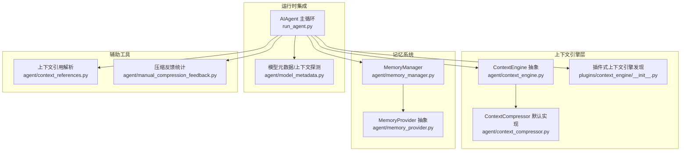
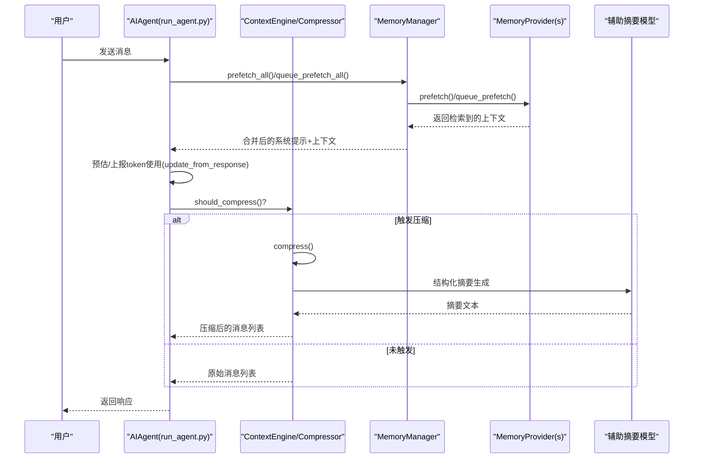
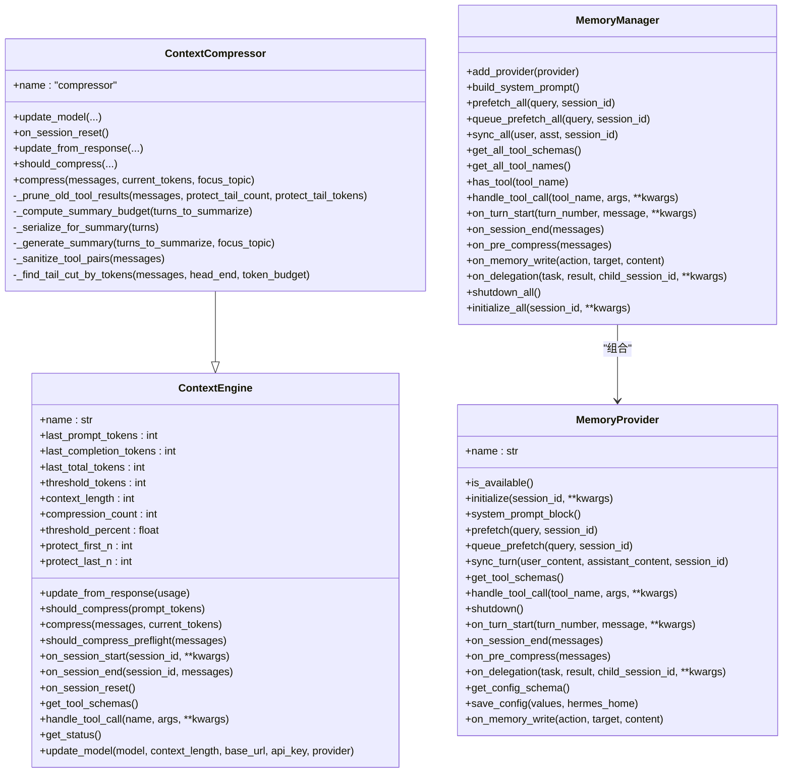
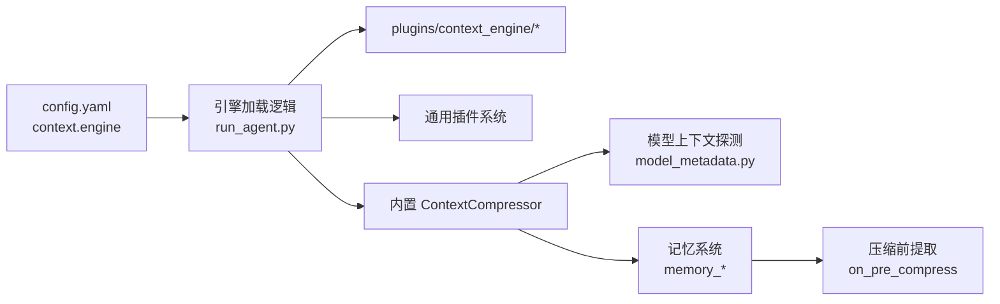

# 记忆上下文引擎

<cite>
**本文档引用的文件**
- [agent/context_engine.py](file://agent/context_engine.py)
- [agent/context_compressor.py](file://agent/context_compressor.py)
- [agent/memory_manager.py](file://agent/memory_manager.py)
- [agent/memory_provider.py](file://agent/memory_provider.py)
- [agent/context_references.py](file://agent/context_references.py)
- [agent/manual_compression_feedback.py](file://agent/manual_compression_feedback.py)
- [agent/model_metadata.py](file://agent/model_metadata.py)
- [plugins/context_engine/__init__.py](file://plugins/context_engine/__init__.py)
- [run_agent.py](file://run_agent.py)
- [tests/agent/test_context_engine.py](file://tests/agent/test_context_engine.py)
- [tests/agent/test_context_compressor.py](file://tests/agent/test_context_compressor.py)
- [website/docs/developer-guide/context-compression-and-caching.md](file://website/docs/developer-guide/context-compression-and-caching.md)
</cite>

## 目录
1. [简介](#简介)
2. [项目结构](#项目结构)
3. [核心组件](#核心组件)
4. [架构总览](#架构总览)
5. [详细组件分析](#详细组件分析)
6. [依赖关系分析](#依赖关系分析)
7. [性能考量](#性能考量)
8. [故障排查指南](#故障排查指南)
9. [结论](#结论)
10. [附录](#附录)

## 简介
本文件系统化阐述 Hermes Agent 的记忆上下文引擎，重点覆盖以下方面：
- 上下文引擎如何处理记忆的检索、过滤与整合
- 上下文压缩算法的工作原理（策略、优先级排序、内容选择）
- 配置项（阈值、保留规则、性能参数）与运行时行为
- 引擎与记忆提供程序的交互方式及检索性能优化
- 监控指标与调试方法
- 扩展开发指南与自定义算法实现路径

## 项目结构
围绕上下文引擎的关键模块与职责如下：
- 上下文引擎抽象与默认实现：agent/context_engine.py、agent/context_compressor.py
- 记忆管理与提供程序：agent/memory_manager.py、agent/memory_provider.py
- 上下文引用解析与注入：agent/context_references.py
- 压缩反馈与统计：agent/manual_compression_feedback.py
- 模型元数据与上下文长度探测：agent/model_metadata.py
- 插件式上下文引擎发现与加载：plugins/context_engine/__init__.py
- 运行时集成与生命周期：run_agent.py
- 文档与配置参考：website/docs/developer-guide/context-compression-and-caching.md

图表来源
- [agent/context_engine.py:1-185](file://agent/context_engine.py#L1-L185)
- [agent/context_compressor.py:1-821](file://agent/context_compressor.py#L1-L821)
- [agent/memory_manager.py:1-363](file://agent/memory_manager.py#L1-L363)
- [agent/memory_provider.py:1-232](file://agent/memory_provider.py#L1-L232)
- [plugins/context_engine/__init__.py:1-220](file://plugins/context_engine/__init__.py#L1-L220)
- [run_agent.py:1257-1285](file://run_agent.py#L1257-L1285)

章节来源
- [agent/context_engine.py:1-185](file://agent/context_engine.py#L1-L185)
- [agent/context_compressor.py:1-821](file://agent/context_compressor.py#L1-L821)
- [agent/memory_manager.py:1-363](file://agent/memory_manager.py#L1-L363)
- [agent/memory_provider.py:1-232](file://agent/memory_provider.py#L1-L232)
- [plugins/context_engine/__init__.py:1-220](file://plugins/context_engine/__init__.py#L1-L220)
- [run_agent.py:1257-1285](file://run_agent.py#L1257-L1285)

## 核心组件
- ContextEngine 抽象基类：定义上下文引擎的统一接口与生命周期钩子，包括压缩触发判断、压缩执行、状态上报、模型切换适配等。
- ContextCompressor 默认实现：基于损失性摘要的压缩器，提供工具输出裁剪、头尾保护、结构化摘要生成、迭代更新、角色交替插入等能力。
- MemoryManager 与 MemoryProvider：负责多提供程序的注册、系统提示拼装、预取与同步、工具路由与生命周期事件。
- 插件式上下文引擎：通过 plugins/context_engine/ 目录扫描与加载，支持第三方引擎替换默认压缩器。

章节来源
- [agent/context_engine.py:32-185](file://agent/context_engine.py#L32-L185)
- [agent/context_compressor.py:60-171](file://agent/context_compressor.py#L60-L171)
- [agent/memory_manager.py:72-363](file://agent/memory_manager.py#L72-L363)
- [agent/memory_provider.py:42-232](file://agent/memory_provider.py#L42-L232)
- [plugins/context_engine/__init__.py:33-98](file://plugins/context_engine/__init__.py#L33-L98)

## 架构总览
上下文引擎在运行时的调用链路如下：

图表来源
- [run_agent.py:1257-1285](file://run_agent.py#L1257-L1285)
- [agent/context_engine.py:65-90](file://agent/context_engine.py#L65-L90)
- [agent/context_compressor.py:666-742](file://agent/context_compressor.py#L666-L742)
- [agent/memory_manager.py:167-195](file://agent/memory_manager.py#L167-L195)

## 详细组件分析

### 上下文引擎抽象与生命周期
- 接口职责
  - 决定何时进行压缩：should_compress()
  - 执行压缩：compress()
  - 跟踪令牌使用：update_from_response()
  - 可选：预检压缩 should_compress_preflight()
  - 可选：会话生命周期 on_session_start/on_session_end/on_session_reset
  - 可选：工具暴露 get_tool_schemas()/handle_tool_call()
  - 可选：状态展示 get_status()
  - 可选：模型切换 update_model()

- 关键状态字段
  - last_prompt_tokens/last_completion_tokens/last_total_tokens：来自API响应的令牌计数
  - threshold_tokens/context_length/compression_count：阈值、上下文长度、压缩次数
  - threshold_percent/protect_first_n/protect_last_n：压缩阈值百分比与头尾保护策略

- 生命周期钩子
  - on_session_start：加载会话状态（如DAG/存储）
  - on_session_end：持久化/关闭连接
  - on_session_reset：重置压缩计数与令牌追踪

章节来源
- [agent/context_engine.py:32-185](file://agent/context_engine.py#L32-L185)

### 默认压缩器 ContextCompressor
- 核心流程
  1) 工具输出裁剪（低成本预处理，避免后续LLM调用）
  2) 头部保护（系统提示+首次对话）
  3) 尾部保护（基于令牌预算而非固定消息数）
  4) 中部回合结构化摘要（可迭代更新）
  5) 工具调用/结果对完整性修复（避免API报错）

- 关键参数与预算
  - threshold_percent：默认50%，最小阈值受 MINIMUM_CONTEXT_LENGTH 限制
  - summary_target_ratio：摘要目标比例，默认0.20，范围[0.10, 0.80]
  - tail_token_budget：尾部令牌预算 = threshold_tokens × summary_target_ratio
  - max_summary_tokens：最大摘要令牌预算，按上下文窗口5%计算，上限12K
  - protect_first_n：默认3（系统提示+首交换）
  - protect_last_n：默认20（最近消息）

- 工具输出裁剪策略
  - 从尾向头遍历，保护最近若干消息或满足令牌预算的消息集合
  - 对超过阈值的工具结果以占位符替换，降低令牌占用

- 尾部保护（令牌预算优先）
  - 以“软上限”1.5倍容忍度避免切割超大消息
  - 至少保留3条消息，防止完全压缩

- 结构化摘要生成
  - 使用结构化模板（目标、进展、决策、已解决/待解决问题、文件、剩余工作、关键上下文、工具模式）
  - 支持焦点主题引导，优先保留焦点相关内容
  - 失败冷却：失败后暂停摘要尝试一段时间，避免反复失败

- 角色交替与合并策略
  - 为摘要消息选择与邻居不冲突的角色，避免连续相同角色
  - 若双侧冲突，则将摘要合并进首个尾消息，保持消息序列合法

- 迭代摘要更新
  - 保存上次摘要，后续压缩时增量更新，保留历史信息

- 完整性修复（工具调用/结果对）
  - 移除孤儿结果
  - 为缺失结果补上“早期会话摘要”占位结果

章节来源
- [agent/context_compressor.py:60-171](file://agent/context_compressor.py#L60-L171)
- [agent/context_compressor.py:186-241](file://agent/context_compressor.py#L186-L241)
- [agent/context_compressor.py:247-484](file://agent/context_compressor.py#L247-L484)
- [agent/context_compressor.py:506-598](file://agent/context_compressor.py#L506-L598)
- [agent/context_compressor.py:604-660](file://agent/context_compressor.py#L604-L660)
- [agent/context_compressor.py:666-800](file://agent/context_compressor.py#L666-L800)

### 记忆提供程序与检索整合
- MemoryManager 职责
  - 注册内置与外部提供程序（最多一个外部）
  - 组合系统提示块、预取上下文、同步回合、路由工具调用
  - 在压缩前回调提供程序提取洞察，纳入摘要提示

- MemoryProvider 抽象
  - 初始化/关闭、系统提示块、预取/队列预取、回合同步
  - 可选钩子：turn开始、会话结束、压缩前提取、镜像写入、委托观察

- 上下文围栏与安全
  - 预取上下文以围栏标签包裹，避免模型将回忆内容误认为用户输入

章节来源
- [agent/memory_manager.py:72-363](file://agent/memory_manager.py#L72-L363)
- [agent/memory_provider.py:42-232](file://agent/memory_provider.py#L42-L232)

### 上下文引用解析与注入
- 解析与展开
  - 支持 file/folder/git/url 等引用标记，异步拉取/读取内容
  - 限制硬上限（上下文长度50%）与软上限（25%），超限时拒绝注入并给出警告

- 安全与白名单
  - 敏感路径/文件阻断，确保不会泄露凭证或内部路径

章节来源
- [agent/context_references.py:62-203](file://agent/context_references.py#L62-L203)
- [agent/context_references.py:206-326](file://agent/context_references.py#L206-L326)
- [agent/context_references.py:329-521](file://agent/context_references.py#L329-L521)

### 插件式上下文引擎
- 发现与加载
  - 扫描 plugins/context_engine/<name>/ 目录，读取 plugin.yaml 元数据
  - 支持 register() 或直接实例化类两种方式
  - 仅允许一个上下文引擎激活，由 config.yaml 的 context.engine 指定

- 与主循环集成
  - 运行时根据配置选择引擎：优先目录插件，其次通用插件，最后回退内置压缩器

章节来源
- [plugins/context_engine/__init__.py:33-98](file://plugins/context_engine/__init__.py#L33-L98)
- [run_agent.py:1257-1285](file://run_agent.py#L1257-L1285)

### 类关系图（代码级）

图表来源
- [agent/context_engine.py:32-185](file://agent/context_engine.py#L32-L185)
- [agent/context_compressor.py:60-171](file://agent/context_compressor.py#L60-L171)
- [agent/memory_manager.py:72-363](file://agent/memory_manager.py#L72-L363)
- [agent/memory_provider.py:42-232](file://agent/memory_provider.py#L42-L232)

## 依赖关系分析
- 运行时装配顺序
  - 读取 config.yaml 的 context.engine
  - 优先从 plugins/context_engine/<name>/ 加载
  - 其次从通用插件系统获取 register_context_engine
  - 最终回退到内置 ContextCompressor

- 与模型元数据的耦合
  - 通过 model_metadata 获取/探测上下文长度，用于阈值与预算计算
  - 辅助摘要模型的上下文长度不足时，发出警告并降级

- 与记忆系统的协作
  - 压缩前回调提供程序提取洞察，纳入摘要提示
  - 预取上下文以围栏包裹，避免污染用户输入

图表来源
- [run_agent.py:1257-1285](file://run_agent.py#L1257-L1285)
- [plugins/context_engine/__init__.py:79-98](file://plugins/context_engine/__init__.py#L79-L98)
- [agent/model_metadata.py:427-551](file://agent/model_metadata.py#L427-L551)

章节来源
- [run_agent.py:1257-1285](file://run_agent.py#L1257-L1285)
- [plugins/context_engine/__init__.py:79-98](file://plugins/context_engine/__init__.py#L79-L98)
- [agent/model_metadata.py:427-551](file://agent/model_metadata.py#L427-L551)

## 性能考量
- 压缩阈值与预算
  - 默认阈值50%，结合 MINIMUM_CONTEXT_LENGTH 下限，避免小模型过早压缩
  - 摘要预算按上下文窗口比例缩放，大模型获得更丰富摘要
  - 尾部令牌预算优先，避免大工具输出阻塞压缩

- 预处理与成本控制
  - 工具输出裁剪在不调用摘要模型的前提下释放大量令牌
  - 角色交替与合并策略减少消息数量，提升后续调用效率

- 摘要模型可用性
  - 当辅助摘要模型不可用时进入冷却，避免反复失败
  - 无法生成摘要时插入静态占位，保证会话连续性

- 检索性能优化
  - MemoryManager 并行预取多个提供程序的结果
  - 围栏包装避免重复注入，减少上下文冗余

章节来源
- [agent/context_compressor.py:138-141](file://agent/context_compressor.py#L138-L141)
- [agent/context_compressor.py:247-256](file://agent/context_compressor.py#L247-L256)
- [agent/context_compressor.py:604-660](file://agent/context_compressor.py#L604-L660)
- [agent/context_compressor.py:336-483](file://agent/context_compressor.py#L336-L483)
- [agent/memory_manager.py:167-195](file://agent/memory_manager.py#L167-L195)

## 故障排查指南
- 常见问题与定位
  - 压缩未触发：检查 threshold_percent 与 last_prompt_tokens 是否达到阈值
  - 摘要失败：查看冷却时间是否生效；确认辅助摘要模型可用性
  - 工具调用/结果不匹配：检查 _sanitize_tool_pairs 是否移除孤儿结果或补全占位
  - 上下文溢出：确认 tail_token_budget 是否足够；考虑增大 protect_last_n 或降低摘要比例

- 监控指标
  - last_prompt_tokens/threshold_tokens/context_length/usage_percent/compression_count
  - 可通过 get_status() 获取当前状态

- 调试建议
  - 开启 quiet_mode=false 查看详细日志
  - 使用手动压缩反馈工具对比压缩前后消息数与令牌估算
  - 在测试中模拟不同消息规模与工具输出大小，验证边界条件

章节来源
- [agent/context_engine.py:151-165](file://agent/context_engine.py#L151-L165)
- [agent/context_compressor.py:172-180](file://agent/context_compressor.py#L172-L180)
- [agent/context_compressor.py:506-564](file://agent/context_compressor.py#L506-L564)
- [agent/manual_compression_feedback.py:8-49](file://agent/manual_compression_feedback.py#L8-L49)

## 结论
Hermes Agent 的上下文引擎通过“默认压缩器 + 插件化替换”的设计，在保证会话连贯性的同时，提供了可扩展的上下文管理能力。其核心优势在于：
- 基于令牌预算的尾部保护，避免大消息阻塞压缩
- 结构化摘要与迭代更新，兼顾信息密度与可追溯性
- 与记忆系统的深度集成，支持多源上下文检索与安全注入
- 完善的状态监控与错误恢复，便于运维与调试

## 附录

### 配置项与参数详解
- 压缩配置（config.yaml compression.*）
  - enabled：启用/禁用压缩
  - threshold：压缩阈值（上下文窗口占比，默认0.50）
  - target_ratio：摘要目标比例（默认0.20，范围[0.10, 0.80]）
  - protect_last_n：尾部最少保留消息数（默认20）
  - summary_model：摘要模型覆盖（默认使用辅助模型）
  - protect_first_n：头部最少保留消息数（默认3，系统提示+首交换）

- 运行时参数
  - threshold_percent：默认0.50，受 MINIMUM_CONTEXT_LENGTH 下限约束
  - tail_token_budget：threshold_tokens × target_ratio
  - max_summary_tokens：min(context_length × 0.05, 12K)

章节来源
- [website/docs/developer-guide/context-compression-and-caching.md:77-97](file://website/docs/developer-guide/context-compression-and-caching.md#L77-L97)
- [agent/context_compressor.py:123-149](file://agent/context_compressor.py#L123-L149)
- [agent/context_compressor.py:604-660](file://agent/context_compressor.py#L604-L660)

### 测试要点与回归保障
- ContextEngine 抽象契约与默认行为验证
- ContextCompressor 行为边界（阈值、预算、角色交替、摘要失败冷却）
- 插件式引擎加载与冲突处理
- 压缩反馈统计与手动压缩对比

章节来源
- [tests/agent/test_context_engine.py:61-251](file://tests/agent/test_context_engine.py#L61-L251)
- [tests/agent/test_context_compressor.py:23-784](file://tests/agent/test_context_compressor.py#L23-L784)