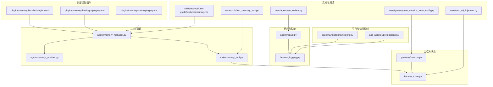
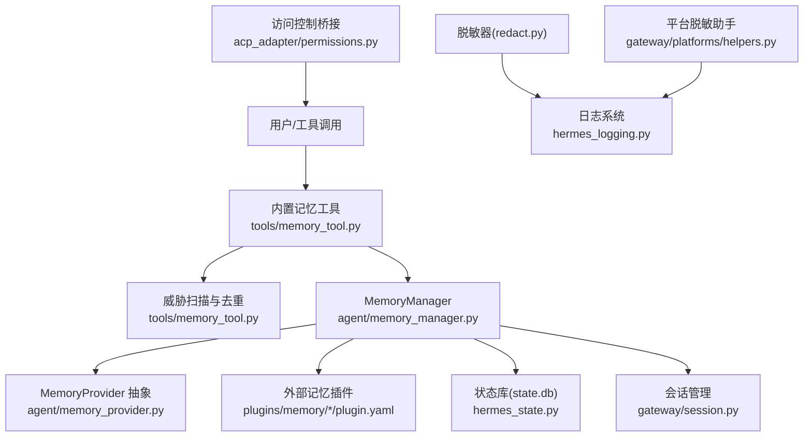
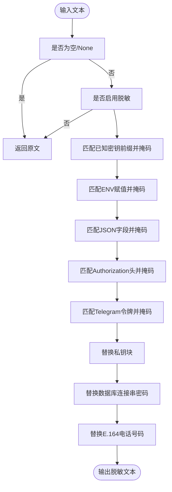
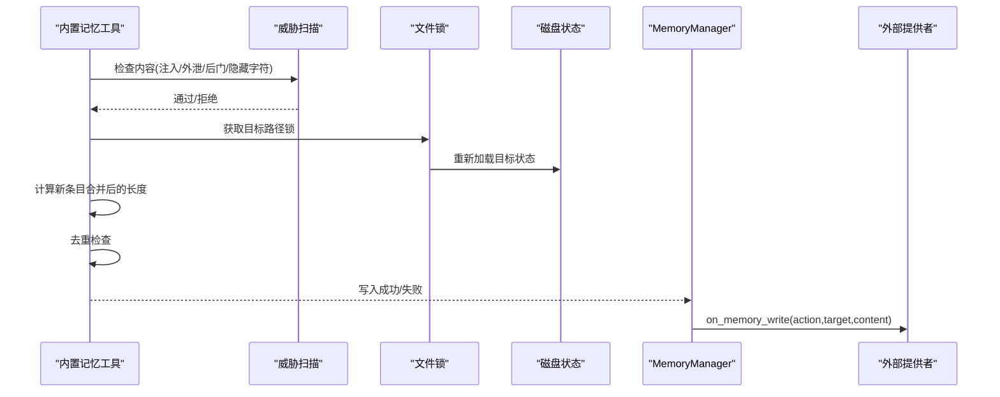
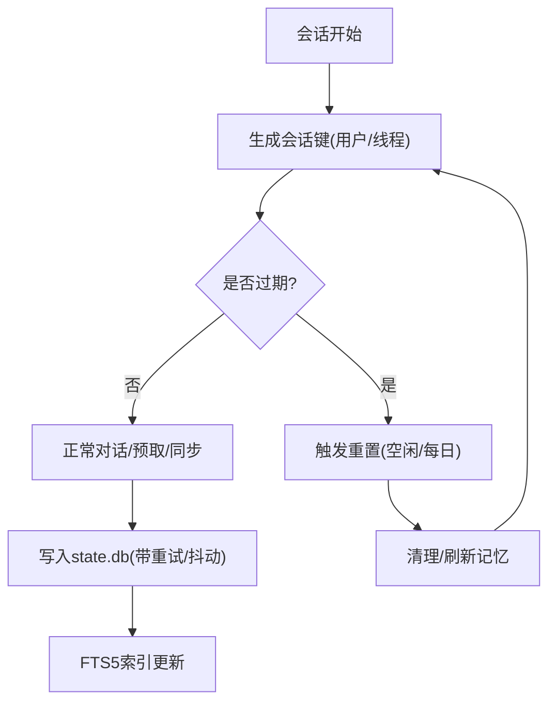
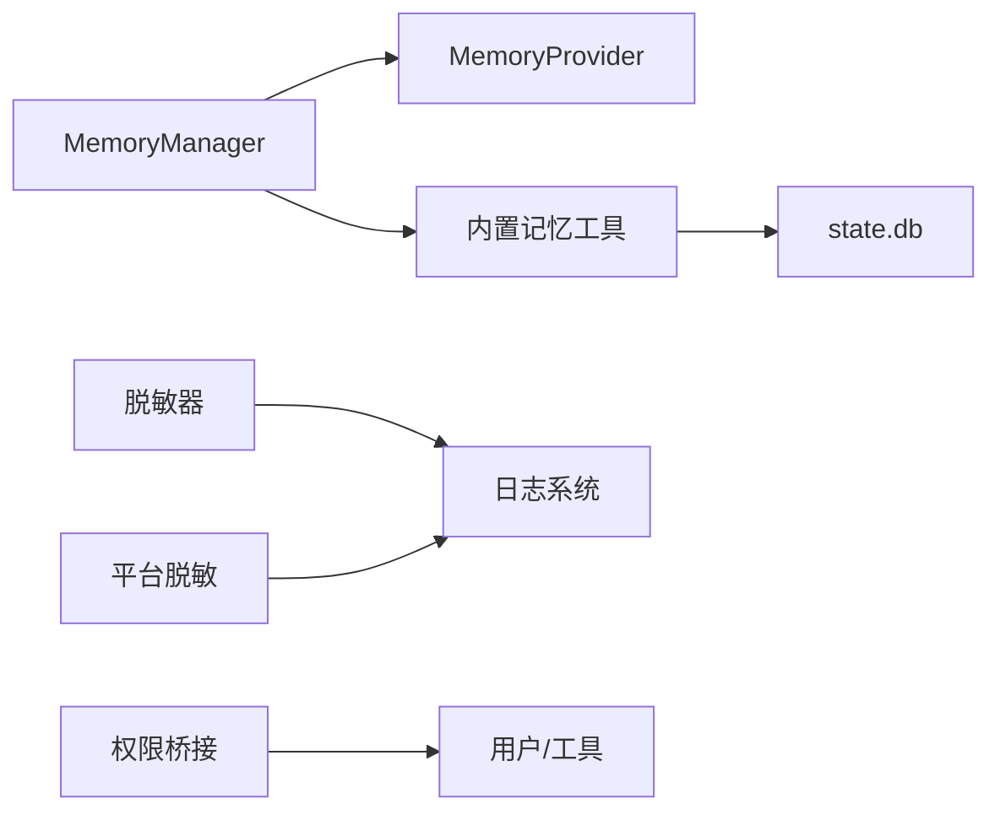
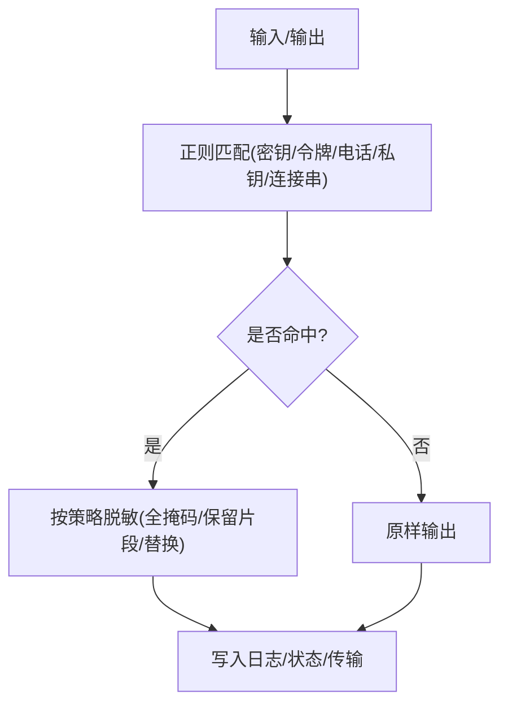

# 记忆安全与隐私

<cite>
**本文引用的文件**
- [agent/redact.py](file://agent/redact.py)
- [hermes_logging.py](file://hermes_logging.py)
- [agent/memory_manager.py](file://agent/memory_manager.py)
- [agent/memory_provider.py](file://agent/memory_provider.py)
- [tools/memory_tool.py](file://tools/memory_tool.py)
- [hermes_state.py](file://hermes_state.py)
- [gateway/session.py](file://gateway/session.py)
- [gateway/platforms/helpers.py](file://gateway/platforms/helpers.py)
- [acp_adapter/permissions.py](file://acp_adapter/permissions.py)
- [plugins/memory/honcho/plugin.yaml](file://plugins/memory/honcho/plugin.yaml)
- [plugins/memory/hindsight/plugin.yaml](file://plugins/memory/hindsight/plugin.yaml)
- [plugins/memory/mem0/plugin.yaml](file://plugins/memory/mem0/plugin.yaml)
- [website/docs/user-guide/features/memory.md](file://website/docs/user-guide/features/memory.md)
- [tests/agent/test_redact.py](file://tests/agent/test_redact.py)
- [tests/tools/test_memory_tool.py](file://tests/tools/test_memory_tool.py)
- [tests/test_sql_injection.py](file://tests/test_sql_injection.py)
- [tests/gateway/test_session_reset_notify.py](file://tests/gateway/test_session_reset_notify.py)
</cite>

## 目录
1. [简介](#简介)
2. [项目结构](#项目结构)
3. [核心组件](#核心组件)
4. [架构总览](#架构总览)
5. [详细组件分析](#详细组件分析)
6. [依赖分析](#依赖分析)
7. [性能考虑](#性能考虑)
8. [故障排查指南](#故障排查指南)
9. [结论](#结论)
10. [附录](#附录)

## 简介
本文件聚焦于Hermes Agent的记忆系统在安全与隐私方面的设计与实现，涵盖数据加密、访问控制、传输保护、PII识别与脱敏、审计日志与访问追踪、跨会话安全边界与数据隔离、隐私保护最佳实践（数据最小化、存储期限与删除策略）、安全漏洞预防与应急响应，以及与GDPR、CCPA等隐私法规的合规性要求与实施方法。

## 项目结构
围绕记忆安全与隐私的关键模块分布如下：
- 日志与脱敏：agent/redact.py、hermes_logging.py
- 内存管理：agent/memory_manager.py、agent/memory_provider.py、tools/memory_tool.py
- 会话与状态：hermes_state.py、gateway/session.py
- 平台辅助与脱敏：gateway/platforms/helpers.py
- 访问控制桥接：acp_adapter/permissions.py
- 外部记忆插件：plugins/memory/*/plugin.yaml
- 文档与测试：website/docs/user-guide/features/memory.md、tests/* 相关测试

**图表来源**
- [agent/redact.py:1-182](file://agent/redact.py#L1-L182)
- [hermes_logging.py:1-395](file://hermes_logging.py#L1-L395)
- [agent/memory_manager.py:1-363](file://agent/memory_manager.py#L1-L363)
- [agent/memory_provider.py:1-232](file://agent/memory_provider.py#L1-L232)
- [tools/memory_tool.py:186-221](file://tools/memory_tool.py#L186-L221)
- [hermes_state.py:1-200](file://hermes_state.py#L1-L200)
- [gateway/session.py:559-591](file://gateway/session.py#L559-L591)
- [gateway/platforms/helpers.py:215-252](file://gateway/platforms/helpers.py#L215-L252)
- [acp_adapter/permissions.py:1-77](file://acp_adapter/permissions.py#L1-L77)
- [plugins/memory/honcho/plugin.yaml:1-8](file://plugins/memory/honcho/plugin.yaml#L1-L8)
- [plugins/memory/hindsight/plugin.yaml:1-9](file://plugins/memory/hindsight/plugin.yaml#L1-L9)
- [plugins/memory/mem0/plugin.yaml:1-6](file://plugins/memory/mem0/plugin.yaml#L1-L6)
- [website/docs/user-guide/features/memory.md:145-185](file://website/docs/user-guide/features/memory.md#L145-L185)
- [tests/agent/test_redact.py:37-104](file://tests/agent/test_redact.py#L37-L104)
- [tests/tools/test_memory_tool.py:38-165](file://tests/tools/test_memory_tool.py#L38-L165)
- [tests/test_sql_injection.py:1-43](file://tests/test_sql_injection.py#L1-L43)
- [tests/gateway/test_session_reset_notify.py:42-113](file://tests/gateway/test_session_reset_notify.py#L42-L113)

**章节来源**
- [agent/redact.py:1-182](file://agent/redact.py#L1-L182)
- [hermes_logging.py:1-395](file://hermes_logging.py#L1-L395)
- [agent/memory_manager.py:1-363](file://agent/memory_manager.py#L1-L363)
- [agent/memory_provider.py:1-232](file://agent/memory_provider.py#L1-L232)
- [tools/memory_tool.py:186-221](file://tools/memory_tool.py#L186-L221)
- [hermes_state.py:1-200](file://hermes_state.py#L1-L200)
- [gateway/session.py:559-591](file://gateway/session.py#L559-L591)
- [gateway/platforms/helpers.py:215-252](file://gateway/platforms/helpers.py#L215-L252)
- [acp_adapter/permissions.py:1-77](file://acp_adapter/permissions.py#L1-L77)
- [plugins/memory/honcho/plugin.yaml:1-8](file://plugins/memory/honcho/plugin.yaml#L1-L8)
- [plugins/memory/hindsight/plugin.yaml:1-9](file://plugins/memory/hindsight/plugin.yaml#L1-L9)
- [plugins/memory/mem0/plugin.yaml:1-6](file://plugins/memory/mem0/plugin.yaml#L1-L6)
- [website/docs/user-guide/features/memory.md:145-185](file://website/docs/user-guide/features/memory.md#L145-L185)
- [tests/agent/test_redact.py:37-104](file://tests/agent/test_redact.py#L37-L104)
- [tests/tools/test_memory_tool.py:38-165](file://tests/tools/test_memory_tool.py#L38-L165)
- [tests/test_sql_injection.py:1-43](file://tests/test_sql_injection.py#L1-L43)
- [tests/gateway/test_session_reset_notify.py:42-113](file://tests/gateway/test_session_reset_notify.py#L42-L113)

## 核心组件
- 脱敏与日志保护：通过统一的RedactingFormatter与redact_sensitive_text对日志、输出与传输内容进行敏感信息掩码与脱敏，确保密钥、令牌、数据库连接串、电话号码等不落盘或泄露。
- 内存管理与写入安全：MemoryManager协调内置与外部记忆提供者；内置工具在写入前进行威胁扫描（注入、凭证外泄、SSH后门、隐藏Unicode字符），并限制重复与字符上限，避免越界与滥用。
- 会话与状态隔离：SQLite状态库采用WAL模式与FTS5全文检索，支持并发读写与会话级数据隔离；会话过期策略与重置通知保障生命周期管理。
- 平台与传输安全：平台辅助模块提供电话号码脱敏；会话层面对会话键生成与过期判定进行安全控制；访问控制桥接AC-P权限请求，超时自动拒绝。
- 外部记忆插件：通过插件化接入（如Honcho、Hindsight、Mem0），统一由MemoryManager注册与调度，避免冲突与越权。

**章节来源**
- [agent/redact.py:113-171](file://agent/redact.py#L113-L171)
- [hermes_logging.py:220-265](file://hermes_logging.py#L220-L265)
- [agent/memory_manager.py:72-363](file://agent/memory_manager.py#L72-L363)
- [agent/memory_provider.py:42-232](file://agent/memory_provider.py#L42-L232)
- [tools/memory_tool.py:198-221](file://tools/memory_tool.py#L198-L221)
- [hermes_state.py:115-200](file://hermes_state.py#L115-L200)
- [gateway/session.py:559-591](file://gateway/session.py#L559-L591)
- [gateway/platforms/helpers.py:235-252](file://gateway/platforms/helpers.py#L235-L252)
- [acp_adapter/permissions.py:26-77](file://acp_adapter/permissions.py#L26-L77)

## 架构总览
下图展示记忆安全与隐私相关组件之间的交互关系与数据流：

**图表来源**
- [tools/memory_tool.py:198-221](file://tools/memory_tool.py#L198-L221)
- [agent/memory_manager.py:72-363](file://agent/memory_manager.py#L72-L363)
- [agent/memory_provider.py:42-232](file://agent/memory_provider.py#L42-L232)
- [plugins/memory/honcho/plugin.yaml:1-8](file://plugins/memory/honcho/plugin.yaml#L1-L8)
- [plugins/memory/hindsight/plugin.yaml:1-9](file://plugins/memory/hindsight/plugin.yaml#L1-L9)
- [plugins/memory/mem0/plugin.yaml:1-6](file://plugins/memory/mem0/plugin.yaml#L1-L6)
- [hermes_state.py:115-200](file://hermes_state.py#L115-L200)
- [gateway/session.py:559-591](file://gateway/session.py#L559-L591)
- [agent/redact.py:113-171](file://agent/redact.py#L113-L171)
- [hermes_logging.py:220-265](file://hermes_logging.py#L220-L265)
- [gateway/platforms/helpers.py:235-252](file://gateway/platforms/helpers.py#L235-L252)
- [acp_adapter/permissions.py:26-77](file://acp_adapter/permissions.py#L26-L77)

## 详细组件分析

### 组件A：脱敏与日志保护（agent/redact.py、hermes_logging.py）
- 脱敏范围：API密钥前缀、环境变量赋值、JSON字段、Authorization头、Telegram机器人令牌、私钥块、数据库连接串密码、E.164电话号码。
- 脱敏策略：短令牌全掩码；长令牌保留前缀与尾部片段；私钥块整体替换；数据库密码替换为占位符；电话号码按长度保留前后段。
- 日志保护：所有日志使用RedactingFormatter统一脱敏；RotatingFileHandler落地文件；支持组件过滤（gateway.log仅接收网关组件）；会话上下文标记便于关联。
- 测试验证：覆盖多种令牌类型、环境变量、JSON字段与导出语句的脱敏行为，确保大小写与关键字边界正确。

**图表来源**
- [agent/redact.py:113-171](file://agent/redact.py#L113-L171)

**章节来源**
- [agent/redact.py:113-171](file://agent/redact.py#L113-L171)
- [hermes_logging.py:220-265](file://hermes_logging.py#L220-L265)
- [tests/agent/test_redact.py:37-104](file://tests/agent/test_redact.py#L37-L104)

### 组件B：内存管理与写入安全（agent/memory_manager.py、agent/memory_provider.py、tools/memory_tool.py）
- MemoryManager职责：注册内置与外部提供者；聚合系统提示、预取、同步、工具路由；在写入时通知外部提供者镜像变更；生命周期钩子（回合开始、会话结束、压缩前、委托完成）。
- MemoryProvider抽象：定义可用性检查、初始化、系统提示块、预取、回合同步、工具Schema与调用、关闭与可选钩子。
- 内置记忆工具安全：写入前进行威胁扫描（注入、凭证外泄、SSH后门、隐藏Unicode字符）；禁止空内容与重复条目；按目标（memory/user）计算字符限制；加锁读取磁盘最新状态以避免竞态。

**图表来源**
- [tools/memory_tool.py:198-221](file://tools/memory_tool.py#L198-L221)
- [agent/memory_manager.py:304-319](file://agent/memory_manager.py#L304-L319)

**章节来源**
- [agent/memory_manager.py:72-363](file://agent/memory_manager.py#L72-L363)
- [agent/memory_provider.py:42-232](file://agent/memory_provider.py#L42-L232)
- [tools/memory_tool.py:198-221](file://tools/memory_tool.py#L198-L221)
- [website/docs/user-guide/features/memory.md:171-174](file://website/docs/user-guide/features/memory.md#L171-L174)
- [tests/tools/test_memory_tool.py:38-165](file://tests/tools/test_memory_tool.py#L38-L165)

### 组件C：会话与状态隔离（hermes_state.py、gateway/session.py）
- SQLite状态库：WAL模式支持多读一写；FTS5虚拟表提供全文检索；触发器维护索引；应用层随机抖动重试缓解写入拥塞；事务显式BEGIN IMMEDIATE。
- 会话过期与重置：基于空闲时长与每日边界策略；后台观察器主动刷新；会话键生成考虑用户分组与线程分组；标题清洗与长度限制。
- 安全性验证：SQL注入防护测试覆盖列名安全标识、参数化查询与转义。

**图表来源**
- [gateway/session.py:559-591](file://gateway/session.py#L559-L591)
- [hermes_state.py:115-200](file://hermes_state.py#L115-L200)

**章节来源**
- [hermes_state.py:115-200](file://hermes_state.py#L115-L200)
- [gateway/session.py:559-591](file://gateway/session.py#L559-L591)
- [tests/test_sql_injection.py:1-43](file://tests/test_sql_injection.py#L1-L43)
- [tests/gateway/test_session_reset_notify.py:42-113](file://tests/gateway/test_session_reset_notify.py#L42-L113)

### 组件D：平台辅助与传输保护（gateway/platforms/helpers.py）
- 电话号码脱敏：保留国家码与末尾数字，中间部分掩码，用于日志与输出。
- 线程列表持久化：限制最大跟踪数量，避免无限增长；线程参与标记与保存。

**章节来源**
- [gateway/platforms/helpers.py:235-252](file://gateway/platforms/helpers.py#L235-L252)

### 组件E：访问控制与权限桥接（acp_adapter/permissions.py）
- 权限桥接：将AC-P权限请求映射为“允许一次/总是”、“拒绝一次/总是”，默认超时拒绝，确保危险操作必须明确授权。

**章节来源**
- [acp_adapter/permissions.py:26-77](file://acp_adapter/permissions.py#L26-L77)

### 组件F：外部记忆插件（plugins/memory/*/plugin.yaml）
- 插件化接入：Honcho、Hindsight、Mem0等通过插件声明与钩子（如on_session_end）与主流程集成，MemoryManager保证同一时间仅一个外部提供者生效。

**章节来源**
- [plugins/memory/honcho/plugin.yaml:1-8](file://plugins/memory/honcho/plugin.yaml#L1-L8)
- [plugins/memory/hindsight/plugin.yaml:1-9](file://plugins/memory/hindsight/plugin.yaml#L1-L9)
- [plugins/memory/mem0/plugin.yaml:1-6](file://plugins/memory/mem0/plugin.yaml#L1-L6)
- [agent/memory_manager.py:84-131](file://agent/memory_manager.py#L84-L131)

## 依赖分析
- 组件耦合与内聚：
  - MemoryManager与MemoryProvider形成清晰的抽象与实现分离，内聚高、耦合低。
  - 内置记忆工具与状态库直接交互，但通过锁与重试机制降低竞争风险。
  - 日志系统与脱敏器强耦合，确保所有输出均经脱敏。
- 外部依赖：
  - 外部记忆插件通过统一接口接入，避免工具Schema膨胀与后端冲突。
  - 平台辅助模块与日志系统协作，保障传输与日志层面的PII安全。

**图表来源**
- [agent/memory_manager.py:72-363](file://agent/memory_manager.py#L72-L363)
- [agent/memory_provider.py:42-232](file://agent/memory_provider.py#L42-L232)
- [tools/memory_tool.py:198-221](file://tools/memory_tool.py#L198-L221)
- [hermes_state.py:115-200](file://hermes_state.py#L115-L200)
- [agent/redact.py:113-171](file://agent/redact.py#L113-L171)
- [hermes_logging.py:220-265](file://hermes_logging.py#L220-L265)
- [gateway/platforms/helpers.py:235-252](file://gateway/platforms/helpers.py#L235-L252)
- [acp_adapter/permissions.py:26-77](file://acp_adapter/permissions.py#L26-L77)

**章节来源**
- [agent/memory_manager.py:72-363](file://agent/memory_manager.py#L72-L363)
- [agent/memory_provider.py:42-232](file://agent/memory_provider.py#L42-L232)
- [tools/memory_tool.py:198-221](file://tools/memory_tool.py#L198-L221)
- [hermes_state.py:115-200](file://hermes_state.py#L115-L200)
- [agent/redact.py:113-171](file://agent/redact.py#L113-L171)
- [hermes_logging.py:220-265](file://hermes_logging.py#L220-L265)
- [gateway/platforms/helpers.py:235-252](file://gateway/platforms/helpers.py#L235-L252)
- [acp_adapter/permissions.py:26-77](file://acp_adapter/permissions.py#L26-L77)

## 性能考虑
- 写入竞争缓解：state.db采用短超时+应用层随机抖动重试，避免SQLite确定性等待导致的队头阻塞。
- 预取与异步同步：MemoryProvider的queue_prefetch与sync_turn异步化，减少主线程阻塞。
- 日志轮转与脱敏：RotatingFileHandler配合RedactingFormatter，兼顾可观测性与安全性，避免大文件与敏感信息泄露。

[本节为通用指导，无需特定文件来源]

## 故障排查指南
- 日志脱敏问题：确认HERMES_REDACT_SECRETS环境变量未被中途修改；核对RedactingFormatter是否应用于所有Handler。
- 内存写入被拒：检查威胁扫描错误信息（注入、外泄、隐藏字符等）；确认内容非空且非重复；查看字符限制与目标类型。
- 会话过期异常：检查SESSION_IDLE_MINUTES与SESSION_RESET_HOUR环境变量；确认后台观察器是否触发；核对会话键生成规则。
- SQL注入防护：确保查询使用参数化占位符，列名均为简单标识符，避免动态拼接。

**章节来源**
- [tests/agent/test_redact.py:37-104](file://tests/agent/test_redact.py#L37-L104)
- [tests/tools/test_memory_tool.py:38-165](file://tests/tools/test_memory_tool.py#L38-L165)
- [tests/test_sql_injection.py:1-43](file://tests/test_sql_injection.py#L1-L43)
- [tests/gateway/test_session_reset_notify.py:42-113](file://tests/gateway/test_session_reset_notify.py#L42-L113)

## 结论
Hermes Agent的记忆安全与隐私体系通过“脱敏前置、写入扫描、会话隔离、权限桥接、日志保护”五位一体的设计，在保障功能可用的同时，有效降低了敏感信息泄露与越权风险。建议持续监控日志与告警，定期审查会话过期策略与外部插件配置，并结合合规要求完善审计与删除流程。

[本节为总结性内容，无需特定文件来源]

## 附录

### PII识别、脱敏与处理流程
- 识别范围：API密钥前缀、环境变量赋值、JSON字段、Authorization头、Telegram令牌、私钥块、数据库连接串密码、E.164电话号码。
- 处理策略：统一脱敏器在日志与输出中执行掩码；电话号码在平台辅助模块中进行保留式掩码；数据库连接串密码替换为占位符。
- 流程图（概念示意）：

[本图为概念示意，无需图表来源]

### 审计日志、访问追踪与合规
- 审计日志：技能Hub提供审计日志追加函数，记录动作、来源、信任级别与结果。
- 访问追踪：日志包含会话上下文标记，便于跨进程与多会话关联；组件过滤将网关事件单独输出。
- 合规性：遵循日志脱敏原则，限制敏感信息留存；会话过期与重置策略支持数据最小化与及时删除。

**章节来源**
- [tools/skills_hub.py:2489-2493](file://tools/skills_hub.py#L2489-L2493)
- [hermes_logging.py:220-265](file://hermes_logging.py#L220-L265)

### 跨会话安全边界与数据隔离
- 会话键生成：考虑用户分组与线程分组，避免跨会话混淆。
- 数据库隔离：WAL模式与FTS5索引独立维护；应用层重试与检查点避免写入拥塞。
- 外部提供者隔离：MemoryManager确保同一时刻仅一个外部提供者生效，避免冲突与越权。

**章节来源**
- [gateway/session.py:571-577](file://gateway/session.py#L571-L577)
- [hermes_state.py:115-200](file://hermes_state.py#L115-L200)
- [agent/memory_manager.py:84-131](file://agent/memory_manager.py#L84-L131)

### 隐私保护最佳实践
- 数据最小化：仅存储必要的记忆条目；使用紧凑、信息密集的表达方式。
- 存储期限：配置会话空闲与每日重置策略；定期清理过期会话与冗余数据。
- 删除策略：提供明确的删除接口与审计记录；确保删除后不再残留敏感信息。

**章节来源**
- [website/docs/user-guide/features/memory.md:145-185](file://website/docs/user-guide/features/memory.md#L145-L185)
- [tests/gateway/test_session_reset_notify.py:42-113](file://tests/gateway/test_session_reset_notify.py#L42-L113)

### 安全漏洞预防与应急响应
- 注入与外泄防护：内置威胁扫描拦截注入、凭证外泄、SSH后门与隐藏字符。
- 权限控制：AC-P桥接超时自动拒绝，防止静默授权。
- 应急响应：发现异常立即暂停相关提供者与工具调用，启用只读模式，核查日志与审计记录，必要时回滚到最近备份。

**章节来源**
- [tests/tools/test_memory_tool.py:38-165](file://tests/tools/test_memory_tool.py#L38-L165)
- [acp_adapter/permissions.py:26-77](file://acp_adapter/permissions.py#L26-L77)

### 合规性要求与实施方法（GDPR、CCPA）
- GDPR：提供数据主体访问、更正、删除与限制处理的权利；通过日志脱敏与会话过期实现数据最小化与及时删除；记录处理活动与审计日志。
- CCPA：提供“不销售/披露”选项与“删除”请求处理；确保PII脱敏与日志保护；建立数据保留与销毁政策。

[本节为通用合规指导，无需特定文件来源]