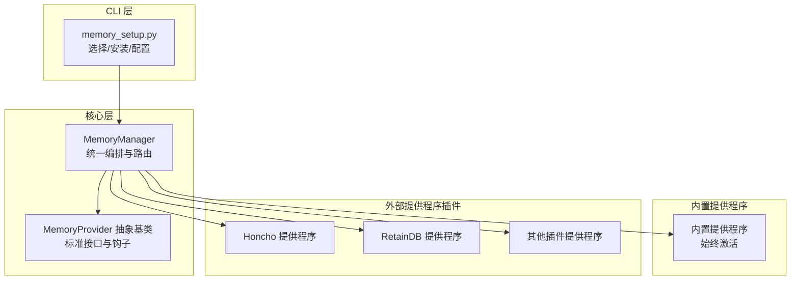
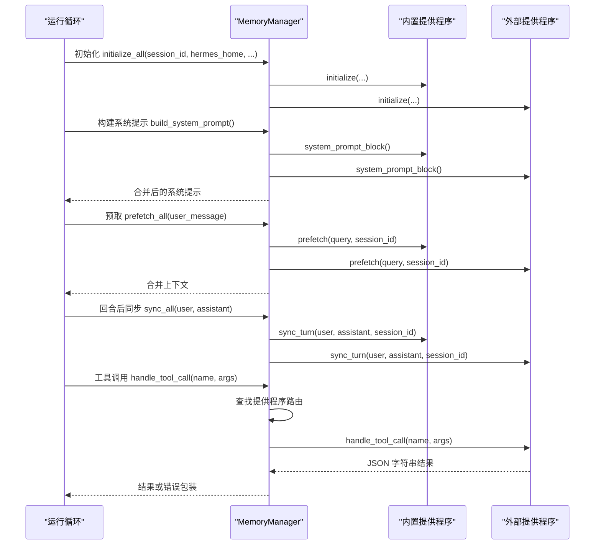
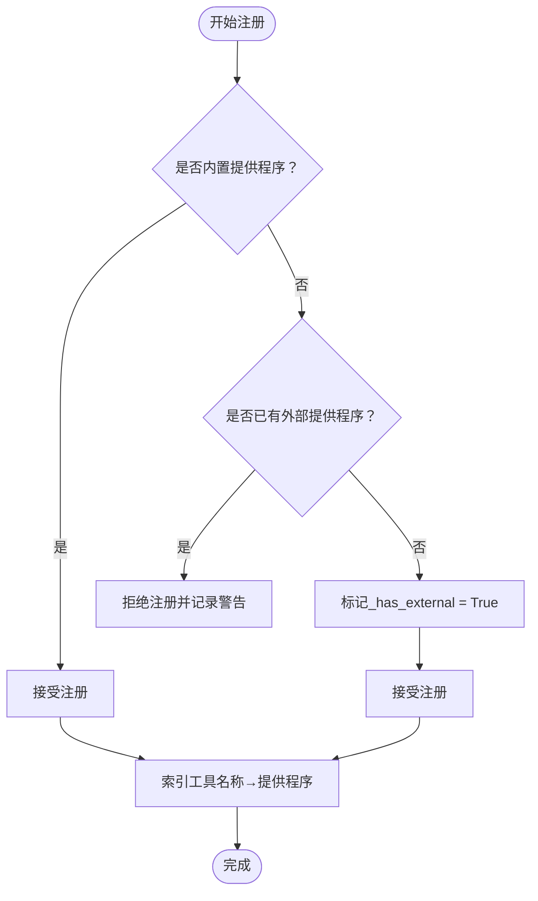
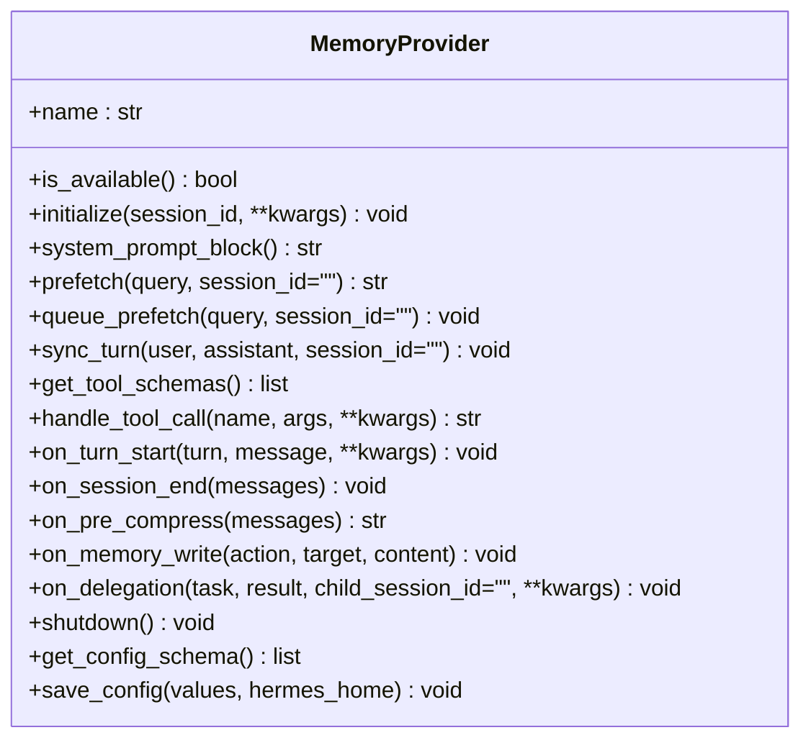
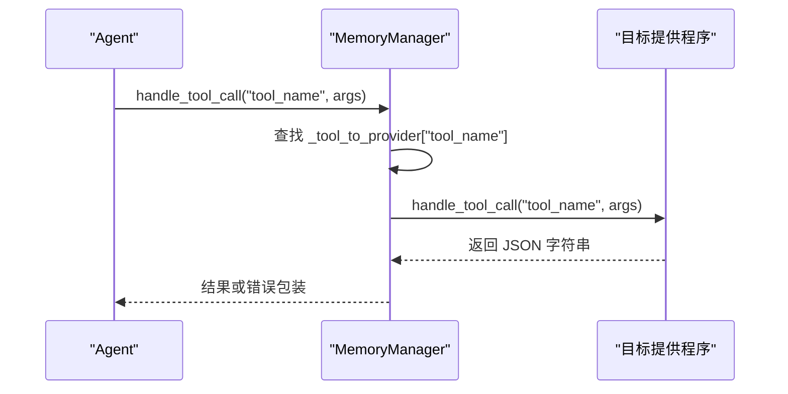
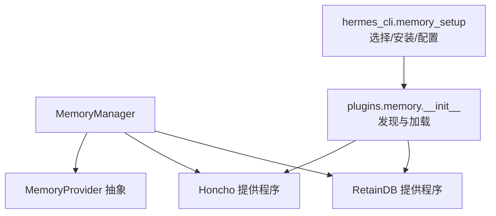

# 记忆提供程序架构

<cite>
**本文档引用的文件**
- [agent/memory_manager.py](file://agent/memory_manager.py)
- [agent/memory_provider.py](file://agent/memory_provider.py)
- [plugins/memory/__init__.py](file://plugins/memory/__init__.py)
- [plugins/memory/honcho/__init__.py](file://plugins/memory/honcho/__init__.py)
- [plugins/memory/retaindb/__init__.py](file://plugins/memory/retaindb/__init__.py)
- [hermes_cli/memory_setup.py](file://hermes_cli/memory_setup.py)
- [tests/agent/test_memory_provider.py](file://tests/agent/test_memory_provider.py)
</cite>

## 目录
1. [简介](#简介)
2. [项目结构](#项目结构)
3. [核心组件](#核心组件)
4. [架构总览](#架构总览)
5. [详细组件分析](#详细组件分析)
6. [依赖关系分析](#依赖关系分析)
7. [性能考量](#性能考量)
8. [故障排查指南](#故障排查指南)
9. [结论](#结论)
10. [附录](#附录)

## 简介
本文件系统性阐述 Hermes Agent 的记忆提供程序（Memory Provider）架构，重点覆盖以下主题：
- MemoryManager 的设计理念与架构模式：统一编排内置与外部提供程序，限制外部提供程序数量，提供工具路由与生命周期管理。
- 提供程序注册机制：内置提供程序始终存在且不可移除；仅允许一个外部提供程序，重复注册会被拒绝并记录警告。
- 工具路由系统：基于工具名称到提供程序的映射进行路由，冲突时保留先注册者。
- 生命周期管理：初始化、系统提示块生成、预取/回放、回合同步、会话结束处理、压缩前提取、委托观察、写入镜像、关闭等钩子。
- 内置与外部提供程序差异：内置提供程序为“Always On”，外部提供程序为“按需叠加”，二者并存但互不替代。
- 隔离机制与故障隔离策略：异常隔离、非阻塞调用、后台线程、反向关闭顺序等。
- 自定义记忆提供程序开发指南与最佳实践。

## 项目结构
围绕记忆提供程序的关键目录与文件如下：
- agent/memory_manager.py：记忆管理器，负责注册、路由、生命周期协调与错误隔离。
- agent/memory_provider.py：抽象基类，定义提供程序标准接口与可选钩子。
- plugins/memory：插件式外部提供程序集合，每个子目录实现一个 MemoryProvider。
- hermes_cli/memory_setup.py：提供程序选择、安装依赖与配置写入的 CLI 流程。
- tests/agent/test_memory_provider.py：对 MemoryManager 行为的单元测试，验证注册、路由、错误隔离等。

**图表来源**
- [agent/memory_manager.py:72-131](file://agent/memory_manager.py#L72-L131)
- [agent/memory_provider.py:42-232](file://agent/memory_provider.py#L42-L232)
- [plugins/memory/honcho/__init__.py:119-158](file://plugins/memory/honcho/__init__.py#L119-L158)
- [plugins/memory/retaindb/__init__.py:452-476](file://plugins/memory/retaindb/__init__.py#L452-L476)
- [hermes_cli/memory_setup.py:219-261](file://hermes_cli/memory_setup.py#L219-L261)

**章节来源**
- [agent/memory_manager.py:1-131](file://agent/memory_manager.py#L1-L131)
- [agent/memory_provider.py:1-110](file://agent/memory_provider.py#L1-L110)
- [plugins/memory/__init__.py:1-110](file://plugins/memory/__init__.py#L1-L110)
- [hermes_cli/memory_setup.py:186-261](file://hermes_cli/memory_setup.py#L186-L261)

## 核心组件
- MemoryProvider 抽象基类
  - 必须实现：name、is_available、initialize、get_tool_schemas、handle_tool_call。
  - 可选钩子：system_prompt_block、prefetch、queue_prefetch、sync_turn、on_session_end、on_pre_compress、on_memory_write、on_delegation、shutdown、get_config_schema、save_config。
- MemoryManager
  - 注册与路由：add_provider、get_all_tool_schemas、has_tool、handle_tool_call。
  - 生命周期：initialize_all、shutdown_all、on_turn_start、on_session_end、on_pre_compress、on_memory_write、on_delegation。
  - 预取与同步：prefetch_all、queue_prefetch_all、sync_all。
  - 异常隔离：所有调用均 try/catch，失败日志记录但不阻断其他提供程序。
- 外部提供程序发现与加载
  - plugins/memory/__init__.py 扫描 plugins/memory/<name>/ 目录，读取 plugin.yaml 元数据，支持 register(ctx) 或直接实例化类两种方式。
  - hermes_cli/memory_setup.py 负责交互式选择与配置写入，设置 config.yaml 中的 memory.provider。

**章节来源**
- [agent/memory_provider.py:42-232](file://agent/memory_provider.py#L42-L232)
- [agent/memory_manager.py:72-363](file://agent/memory_manager.py#L72-L363)
- [plugins/memory/__init__.py:32-196](file://plugins/memory/__init__.py#L32-L196)
- [hermes_cli/memory_setup.py:219-261](file://hermes_cli/memory_setup.py#L219-L261)

## 架构总览
MemoryManager 作为单一集成点，串联内置与外部提供程序，统一注入系统提示、预取上下文、回合同步与工具调用路由。内置提供程序始终在前，外部提供程序最多一个，二者通过独立的生命周期与错误隔离机制协同工作。

**图表来源**
- [agent/memory_manager.py:146-208](file://agent/memory_manager.py#L146-L208)
- [agent/memory_manager.py:238-257](file://agent/memory_manager.py#L238-L257)
- [agent/memory_manager.py:345-363](file://agent/memory_manager.py#L345-L363)

## 详细组件分析

### MemoryManager 设计与行为
- 注册与路由
  - add_provider：内置提供程序总是接受；外部提供程序仅允许一个，重复注册被拒绝并记录警告。
  - 工具路由：根据工具 schema 的 name 建立 provider 映射，冲突时保留先注册者。
- 生命周期
  - initialize_all：自动注入 hermes_home，依次调用各 provider.initialize。
  - shutdown_all：逆序关闭，确保资源清理顺序正确。
  - on_turn_start/on_session_end/on_pre_compress/on_memory_write/on_delegation：提供程序间事件广播，失败被记录但不影响其他提供程序。
- 预取与同步
  - prefetch_all/queue_prefetch_all/sync_all：对所有提供程序执行对应操作，异常被记录但不阻断。
- 上下文注入
  - build_system_prompt：收集各提供程序的静态提示块，失败被记录。
  - build_memory_context_block/sanitize_context：对预取结果进行围栏包装，防止模型误判为用户输入。

**图表来源**
- [agent/memory_manager.py:86-131](file://agent/memory_manager.py#L86-L131)

**章节来源**
- [agent/memory_manager.py:72-131](file://agent/memory_manager.py#L72-L131)
- [agent/memory_manager.py:146-208](file://agent/memory_manager.py#L146-L208)
- [agent/memory_manager.py:238-257](file://agent/memory_manager.py#L238-L257)
- [agent/memory_manager.py:345-363](file://agent/memory_manager.py#L345-L363)
- [tests/agent/test_memory_provider.py:149-157](file://tests/agent/test_memory_provider.py#L149-L157)

### MemoryProvider 接口规范
- 必须实现
  - name：提供程序标识（如 "builtin"、"honcho"、"retaindb"）。
  - is_available：轻量检查（不发起网络请求），决定是否激活。
  - initialize：建立连接、创建资源、启动后台线程等。
  - get_tool_schemas：返回工具 schema 列表（OpenAI 函数调用格式）。
  - handle_tool_call：处理工具调用，返回 JSON 字符串。
- 可选钩子
  - system_prompt_block：静态提示块。
  - prefetch/prefetch：零延迟回放与异步预取。
  - sync_turn：回合后异步持久化。
  - on_session_end/on_pre_compress/on_memory_write/on_delegation：事件通知。
  - shutdown：清理。
  - get_config_schema/save_config：配置声明与保存。

**图表来源**
- [agent/memory_provider.py:42-232](file://agent/memory_provider.py#L42-L232)

**章节来源**
- [agent/memory_provider.py:42-232](file://agent/memory_provider.py#L42-L232)

### 内置提供程序与外部提供程序
- 内置提供程序
  - 总是注册且不可移除，作为 Always-On 存储。
  - 通常包含 MEMORY.md/USER.md 等本地持久化能力。
- 外部提供程序
  - 插件式实现，位于 plugins/memory/<name>/，通过 config.yaml 的 memory.provider 激活。
  - 仅允许一个外部提供程序同时运行，避免工具 schema 冲突与后端冲突。
  - 支持 get_config_schema/save_config，便于 hermes memory setup 完成配置。

**章节来源**
- [agent/memory_manager.py:1-27](file://agent/memory_manager.py#L1-L27)
- [plugins/memory/__init__.py:32-110](file://plugins/memory/__init__.py#L32-L110)
- [hermes_cli/memory_setup.py:219-261](file://hermes_cli/memory_setup.py#L219-L261)

### 工具路由系统
- 工具 schema 去重与冲突处理
  - MemoryManager 在注册阶段将工具名映射到提供程序，若冲突则保留先注册者并记录警告。
- 运行时路由
  - handle_tool_call 根据工具名查找提供程序并调用其 handle_tool_call，异常被包装为错误响应。

**图表来源**
- [agent/memory_manager.py:238-257](file://agent/memory_manager.py#L238-L257)

**章节来源**
- [agent/memory_manager.py:112-131](file://agent/memory_manager.py#L112-L131)
- [agent/memory_manager.py:238-257](file://agent/memory_manager.py#L238-L257)
- [tests/agent/test_memory_provider.py:262-277](file://tests/agent/test_memory_provider.py#L262-L277)

### 生命周期管理与隔离机制
- 初始化与关闭
  - initialize_all：自动注入 hermes_home 并逐个初始化。
  - shutdown_all：逆序关闭，减少资源泄漏风险。
- 错误隔离
  - 所有对外调用（prefetch、sync、hooks、tool 调用）均 try/catch，失败仅记录日志，不阻断其他提供程序。
- 后台线程与非阻塞
  - 外部提供程序普遍使用后台线程执行网络请求与写入，保证主流程快速返回。
- 上下文围栏
  - 对预取结果进行围栏包装，避免模型将回忆内容误判为新用户输入。

**章节来源**
- [agent/memory_manager.py:167-208](file://agent/memory_manager.py#L167-L208)
- [agent/memory_manager.py:258-333](file://agent/memory_manager.py#L258-L333)
- [agent/memory_manager.py:334-363](file://agent/memory_manager.py#L334-L363)
- [agent/memory_manager.py:49-70](file://agent/memory_manager.py#L49-L70)

### 典型提供程序实现要点

#### Honcho 提供程序
- 特性
  - dialectic 查询、语义搜索、peer 卡片、持久化结论。
  - 支持 recall_mode、injection_frequency、cadence 等成本控制参数。
  - 使用后台线程执行预取与同步，支持消息分片以满足 API 限制。
- 关键方法
  - prefetch：消费缓存结果并按预算截断。
  - queue_prefetch：触发后台 dialectic 与 context 预取。
  - sync_turn：分片写入对话历史。
  - on_memory_write：将内置 user 写入镜像为 Honcho 结论。

**章节来源**
- [plugins/memory/honcho/__init__.py:432-476](file://plugins/memory/honcho/__init__.py#L432-L476)
- [plugins/memory/honcho/__init__.py:477-523](file://plugins/memory/honcho/__init__.py#L477-L523)
- [plugins/memory/honcho/__init__.py:573-621](file://plugins/memory/honcho/__init__.py#L573-L621)

#### RetainDB 提供程序
- 特性
  - 语义检索、用户画像、对话合成、共享文件存储、Agent 自模型。
  - 异步写队列（SQLite）保障崩溃安全与异步摄入。
  - 后台线程聚合 context、dialectic、agent_model 预取结果。
- 关键方法
  - queue_prefetch：并发启动 context、dialectic、agent_model 预取。
  - prefetch：消费缓存并拼接为上下文块。
  - sync_turn：入队异步写入。
  - get_config_schema/save_config：配置声明与保存。

**章节来源**
- [plugins/memory/retaindb/__init__.py:452-539](file://plugins/memory/retaindb/__init__.py#L452-L539)
- [plugins/memory/retaindb/__init__.py:542-624](file://plugins/memory/retaindb/__init__.py#L542-L624)
- [plugins/memory/retaindb/__init__.py:627-640](file://plugins/memory/retaindb/__init__.py#L627-L640)

## 依赖关系分析
- MemoryManager 依赖 MemoryProvider 抽象接口，不依赖具体实现细节。
- 外部提供程序通过 plugins/memory/<name>/ 目录组织，遵循统一接口即可被发现与加载。
- hermes_cli/memory_setup.py 与 plugins/memory/__init__.py 协作，完成提供程序选择、依赖安装与配置写入。

**图表来源**
- [agent/memory_manager.py:72-131](file://agent/memory_manager.py#L72-L131)
- [plugins/memory/__init__.py:32-110](file://plugins/memory/__init__.py#L32-L110)
- [hermes_cli/memory_setup.py:219-261](file://hermes_cli/memory_setup.py#L219-L261)

**章节来源**
- [agent/memory_manager.py:72-131](file://agent/memory_manager.py#L72-L131)
- [plugins/memory/__init__.py:32-110](file://plugins/memory/__init__.py#L32-L110)
- [hermes_cli/memory_setup.py:219-261](file://hermes_cli/memory_setup.py#L219-L261)

## 性能考量
- 零延迟预取与后台线程
  - 外部提供程序普遍采用后台线程在回合结束时触发预取，在回合开始时消费缓存，显著降低响应延迟。
- 成本与频率控制
  - 通过 injection_frequency、cadence、context_tokens 预算等参数控制调用频率与上下文长度，平衡质量与成本。
- 线程累积防护
  - RetainDB 提供程序在 queue_prefetch 中等待旧线程结束再启动新线程，避免线程堆积导致资源耗尽。
- 非阻塞写入
  - 外部提供程序的 sync_turn 通常非阻塞，写入通过后台队列或线程完成。

**章节来源**
- [plugins/memory/honcho/__init__.py:477-523](file://plugins/memory/honcho/__init__.py#L477-L523)
- [plugins/memory/honcho/__init__.py:573-621](file://plugins/memory/honcho/__init__.py#L573-L621)
- [plugins/memory/retaindb/__init__.py:542-558](file://plugins/memory/retaindb/__init__.py#L542-L558)
- [plugins/memory/retaindb/__init__.py:627-640](file://plugins/memory/retaindb/__init__.py#L627-L640)

## 故障排查指南
- 外部提供程序重复注册
  - 现象：添加第二个外部提供程序被拒绝并记录警告。
  - 处理：确认 config.yaml 中 memory.provider 设置正确，仅启用一个外部提供程序。
- 工具调用失败
  - 现象：handle_tool_call 返回错误包装。
  - 处理：检查工具名是否存在、提供程序是否已正确注册、提供程序内部实现是否抛出异常。
- 预取失败不阻断
  - 现象：某提供程序 prefetch 抛错但不会影响其他提供程序。
  - 处理：查看日志中的调试信息，定位具体提供程序与问题原因。
- 关闭顺序问题
  - 现象：进程退出时资源未完全释放。
  - 处理：确认 shutdown_all 是否被调用，且外部提供程序实现了正确的清理逻辑。

**章节来源**
- [agent/memory_manager.py:86-131](file://agent/memory_manager.py#L86-L131)
- [agent/memory_manager.py:167-208](file://agent/memory_manager.py#L167-L208)
- [agent/memory_manager.py:238-257](file://agent/memory_manager.py#L238-L257)
- [agent/memory_manager.py:334-363](file://agent/memory_manager.py#L334-L363)

## 结论
Hermes Agent 的记忆提供程序架构通过 MemoryManager 实现了“内置 Always-On + 外部可插拔”的双层设计。该架构以 MemoryProvider 抽象为标准，统一了注册、路由、生命周期与错误隔离，既保证了系统的稳定性，又为扩展外部记忆后端提供了清晰的路径。限制外部提供程序数量的设计有效避免了工具 schema 与后端冲突，配合后台线程与成本控制参数，兼顾了性能与成本。

## 附录

### 自定义记忆提供程序开发指南与最佳实践
- 继承 MemoryProvider 并实现必须方法
  - name、is_available、initialize、get_tool_schemas、handle_tool_call。
- 提供配置能力
  - get_config_schema：声明需要的配置字段（含 secret、required、choices、env_var 等）。
  - save_config：将非敏感配置写入提供程序的原生位置。
- 实现可选钩子
  - system_prompt_block：提供静态提示块。
  - prefetch/queue_prefetch：零延迟回放与后台预取。
  - sync_turn：回合后异步持久化。
  - on_session_end/on_pre_compress/on_memory_write/on_delegation：事件通知。
  - shutdown：清理资源。
- 最佳实践
  - 不要发起网络请求于 is_available；仅做轻量检查。
  - 将网络调用与写入放入后台线程，保证 initialize 与 sync_turn 非阻塞。
  - 对外暴露的工具 schema 应遵循 OpenAI 函数调用格式。
  - 在 handle_tool_call 中返回 JSON 字符串，必要时包装错误。
  - 使用 hermes_home 参数解析配置路径，避免硬编码用户目录。
  - 通过 get_config_schema 与 save_config 与 hermes memory setup 协作，提升用户体验。

**章节来源**
- [agent/memory_provider.py:50-232](file://agent/memory_provider.py#L50-L232)
- [plugins/memory/honcho/__init__.py:159-187](file://plugins/memory/honcho/__init__.py#L159-L187)
- [plugins/memory/retaindb/__init__.py:477-486](file://plugins/memory/retaindb/__init__.py#L477-L486)