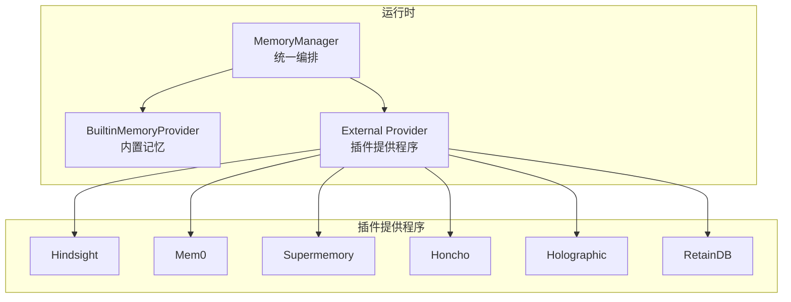
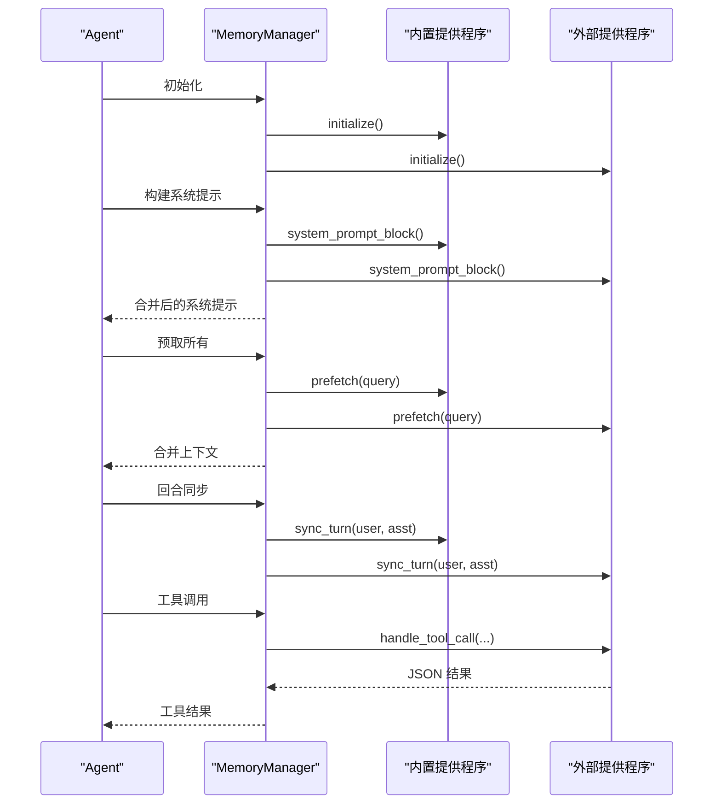
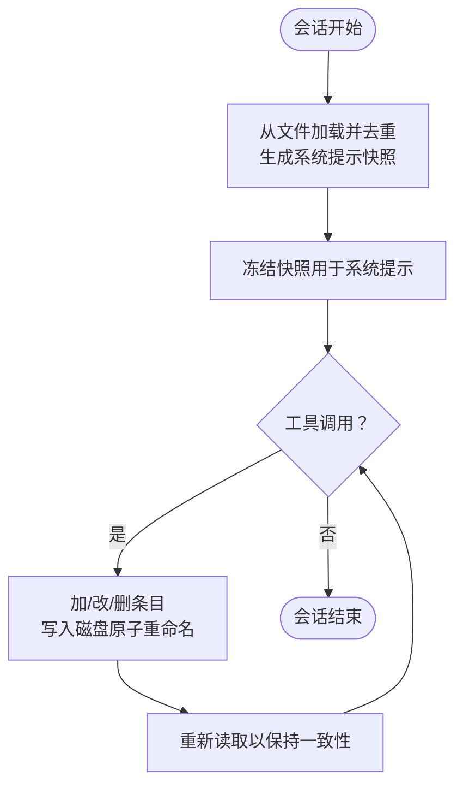
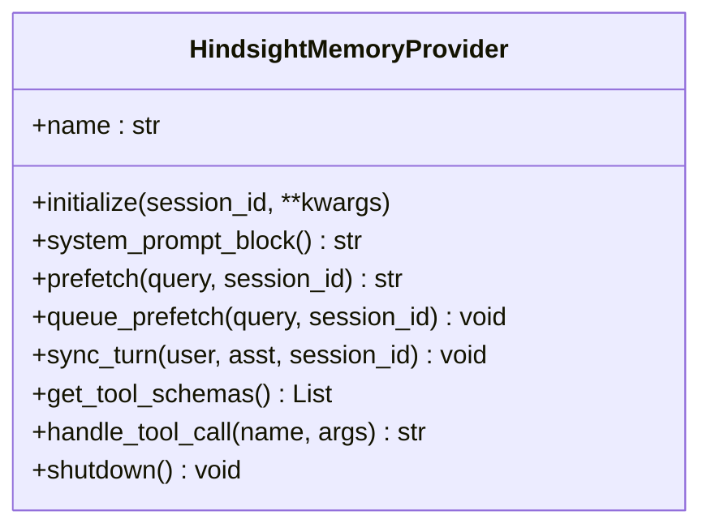
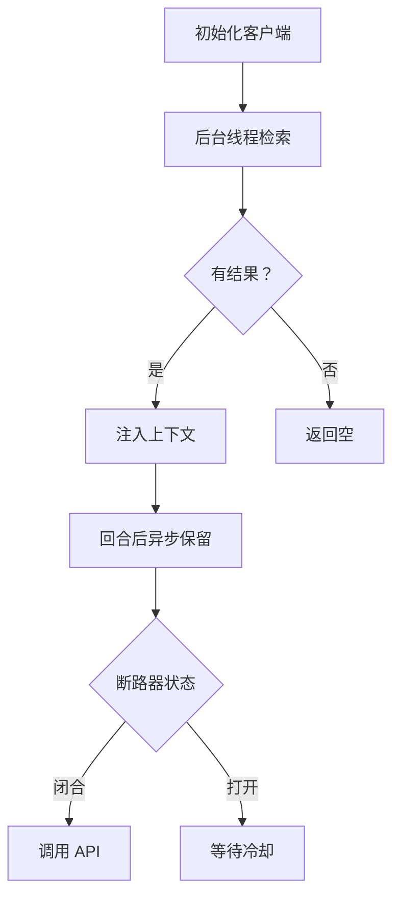
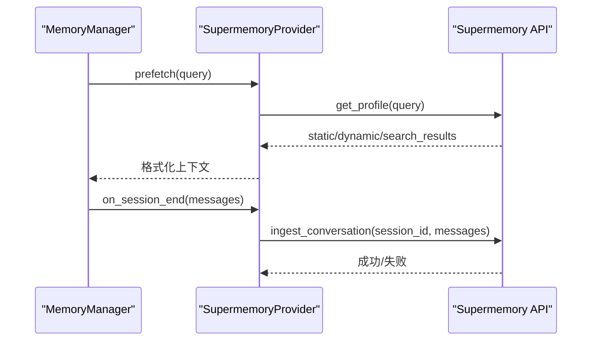
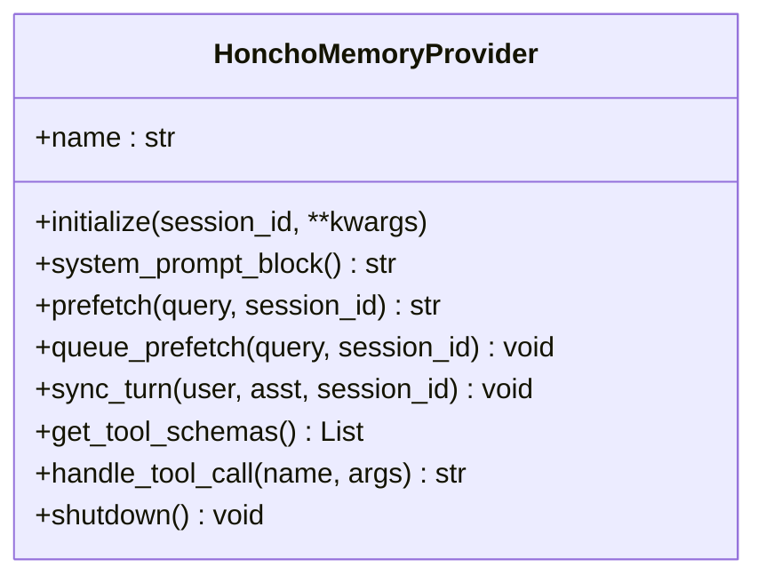
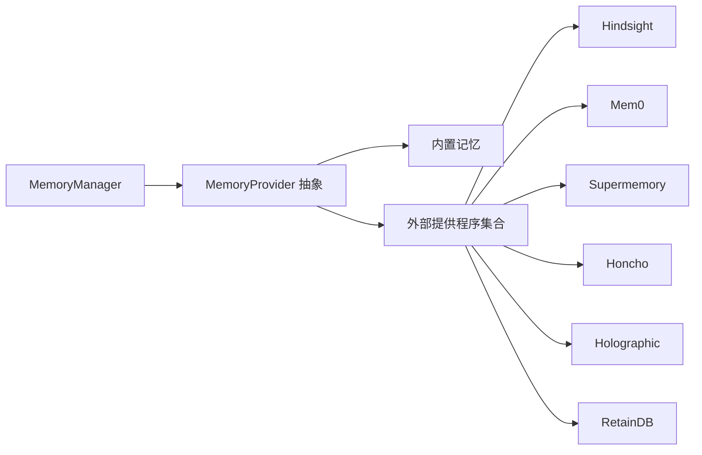

# 记忆管理系统

<cite>
**本文档引用的文件**
- [agent/memory_manager.py](file://agent/memory_manager.py)
- [agent/memory_provider.py](file://agent/memory_provider.py)
- [plugins/memory/hindsight/__init__.py](file://plugins/memory/hindsight/__init__.py)
- [plugins/memory/mem0/__init__.py](file://plugins/memory/mem0/__init__.py)
- [plugins/memory/supermemory/__init__.py](file://plugins/memory/supermemory/__init__.py)
- [plugins/memory/honcho/__init__.py](file://plugins/memory/honcho/__init__.py)
- [plugins/memory/holographic/__init__.py](file://plugins/memory/holographic/__init__.py)
- [plugins/memory/retaindb/__init__.py](file://plugins/memory/retaindb/__init__.py)
- [hermes_cli/memory_setup.py](file://hermes_cli/memory_setup.py)
- [tools/memory_tool.py](file://tools/memory_tool.py)
</cite>

## 目录
1. [简介](#简介)
2. [项目结构](#项目结构)
3. [核心组件](#核心组件)
4. [架构总览](#架构总览)
5. [详细组件分析](#详细组件分析)
6. [依赖关系分析](#依赖关系分析)
7. [性能考量](#性能考量)
8. [故障排除指南](#故障排除指南)
9. [结论](#结论)
10. [附录](#附录)

## 简介
本文件系统性阐述 Hermes Agent 的记忆管理系统，涵盖架构设计、持久化机制、检索优化与多类型记忆提供程序（hindsight、mem0、supermemory、honcho、holographic、retaindb）的特性与使用场景。文档同时提供配置最佳实践、性能调优建议、安全与隐私保护以及数据治理考虑，并给出自定义记忆提供程序的开发指导。

## 项目结构
记忆系统由以下层次构成：
- 内置记忆：基于本地文件的持久化存储，作为 always-on 提供程序始终激活。
- 外部记忆提供程序：通过插件系统注册，最多仅允许一个外部提供程序与内置提供程序并存。
- 记忆管理器：统一编排内置与外部提供程序，负责系统提示构建、预取、同步、工具路由与生命周期钩子。

**图表来源**
- [agent/memory_manager.py:72-363](file://agent/memory_manager.py#L72-L363)
- [agent/memory_provider.py:42-232](file://agent/memory_provider.py#L42-L232)

**章节来源**
- [agent/memory_manager.py:1-363](file://agent/memory_manager.py#L1-L363)
- [agent/memory_provider.py:1-232](file://agent/memory_provider.py#L1-L232)

## 核心组件
- MemoryManager：负责注册与编排提供程序；提供系统提示构建、预取/召回、回合同步、工具路由与生命周期钩子。
- MemoryProvider 抽象基类：定义提供程序生命周期与可选钩子，约束外部提供程序实现。
- 内置记忆工具：提供文件级持久化、内容扫描与原子写入，确保会话前缀缓存稳定。
- 外部提供程序：各具特色，覆盖云/本地模式、知识图谱、实体解析、语义搜索、对话式合成、结构化事实存储与共享文件能力。

**章节来源**
- [agent/memory_manager.py:72-363](file://agent/memory_manager.py#L72-L363)
- [agent/memory_provider.py:42-232](file://agent/memory_provider.py#L42-L232)
- [tools/memory_tool.py:100-561](file://tools/memory_tool.py#L100-L561)

## 架构总览
记忆系统采用“内置提供程序 + 最多一个外部提供程序”的双提供程序模型。MemoryManager 在运行期统一调度，确保失败不阻断、并发安全、上下文注入稳定。

**图表来源**
- [agent/memory_manager.py:146-320](file://agent/memory_manager.py#L146-L320)
- [agent/memory_provider.py:83-141](file://agent/memory_provider.py#L83-L141)

**章节来源**
- [agent/memory_manager.py:146-320](file://agent/memory_manager.py#L146-L320)
- [agent/memory_provider.py:83-141](file://agent/memory_provider.py#L83-L141)

## 详细组件分析

### 内置记忆（BuiltinMemoryProvider）
- 存储位置：每个配置档案下的 memories 目录，分别维护 MEMORY.md 与 USER.md。
- 持久化策略：采用原子重命名写入，避免竞态；文件锁保障读改写一致性。
- 上下文注入：在会话开始时冻结快照注入系统提示，中段变更不影响前缀缓存。
- 安全扫描：对注入到系统提示的内容进行威胁模式检测与不可见字符过滤。
- 工具接口：memory 工具支持 add/replace/remove/read，严格限制字符配额与重复条目。

**图表来源**
- [tools/memory_tool.py:119-136](file://tools/memory_tool.py#L119-L136)
- [tools/memory_tool.py:171-175](file://tools/memory_tool.py#L171-L175)
- [tools/memory_tool.py:204-241](file://tools/memory_tool.py#L204-L241)

**章节来源**
- [tools/memory_tool.py:100-561](file://tools/memory_tool.py#L100-L561)

### Hindsight 记忆提供程序
- 特点：长程记忆、知识图谱、实体解析、多策略检索（语义、关键词、实体图遍历、重排序）。
- 模式：云（API Key）或本地（embedded/external），支持预算控制与内存模式（context/tools/hybrid）。
- 自动化：自动保留对话回合、自动召回；支持异步保留与标签过滤。
- 工具：hindsight_retain、hindsight_recall、hindsight_reflect。

**图表来源**
- [plugins/memory/hindsight/__init__.py:185-800](file://plugins/memory/hindsight/__init__.py#L185-L800)

**章节来源**
- [plugins/memory/hindsight/__init__.py:185-800](file://plugins/memory/hindsight/__init__.py#L185-L800)

### Mem0 记忆提供程序
- 特点：服务端事实抽取、语义搜索与重排序、自动去重。
- 可靠性：电路断路器（连续失败后冷却），避免雪崩。
- 工具：mem0_profile、mem0_search、mem0_conclude。

**图表来源**
- [plugins/memory/mem0/__init__.py:119-374](file://plugins/memory/mem0/__init__.py#L119-L374)

**章节来源**
- [plugins/memory/mem0/__init__.py:119-374](file://plugins/memory/mem0/__init__.py#L119-L374)

### Supermemory 记忆提供程序
- 特点：语义长程记忆、用户画像与近期上下文、显式记忆工具、会话末尾对话抽取、容器化多容器支持。
- 检索：混合/记忆/文档三种搜索模式；实体上下文长度限制；去重与相似度展示。
- 工具：supermemory_store、supermemory_search、supermemory_forget、supermemory_profile。

**图表来源**
- [plugins/memory/supermemory/__init__.py:420-616](file://plugins/memory/supermemory/__init__.py#L420-L616)

**章节来源**
- [plugins/memory/supermemory/__init__.py:420-616](file://plugins/memory/supermemory/__init__.py#L420-L616)

### Honcho 记忆提供程序
- 特点：AI 原生跨会话用户建模、对话式问答、语义搜索、同伴卡片、结论持久化。
- 成本感知：按轮次频率、上下文/对话式调用间隔、推理级别上限控制成本。
- 模式：context、tools、hybrid；支持懒初始化与工具模式延迟会话创建。

**图表来源**
- [plugins/memory/honcho/__init__.py:119-723](file://plugins/memory/honcho/__init__.py#L119-L723)

**章节来源**
- [plugins/memory/honcho/__init__.py:119-723](file://plugins/memory/honcho/__init__.py#L119-L723)

### Holographic 记忆提供程序
- 特点：结构化事实存储、实体解析、信任评分、HRR 组合检索、事实反馈训练。
- 自动提取：会话末尾根据模式自动抽取偏好与决策类事实。
- 工具：fact_store（add/search/probe/related/reason/contradict/update/remove/list）、fact_feedback。

**章节来源**
- [plugins/memory/holographic/__init__.py:114-408](file://plugins/memory/holographic/__init__.py#L114-L408)

### RetainDB 记忆提供程序
- 特点：云端 API、崩溃安全的 SQLite 异步写队列、语义搜索、用户画像、对话式合成、代理自我模型、共享文件工具。
- 容错：写队列持久化，重启后重放；网络异常自动重试。
- 工具：profile/search/context/remember/forget 与文件上传/列表/读取/索引/删除。

**章节来源**
- [plugins/memory/retaindb/__init__.py:452-767](file://plugins/memory/retaindb/__init__.py#L452-L767)

## 依赖关系分析
- MemoryManager 依赖 MemoryProvider 抽象，确保不同提供程序的一致接口。
- 外部提供程序通过插件系统注册，受 MemoryManager 限制：最多一个非内置提供程序。
- 内置记忆工具与外部提供程序通过工具 schema 共享给模型，避免冲突。
- 各提供程序内部依赖第三方 SDK 或本地进程（如 Hindsight 本地嵌入、RetainDB 写队列）。

**图表来源**
- [agent/memory_manager.py:72-143](file://agent/memory_manager.py#L72-L143)
- [agent/memory_provider.py:42-82](file://agent/memory_provider.py#L42-L82)

**章节来源**
- [agent/memory_manager.py:72-143](file://agent/memory_manager.py#L72-L143)
- [agent/memory_provider.py:42-82](file://agent/memory_provider.py#L42-L82)

## 性能考量
- 并发与线程安全
  - 外部提供程序普遍采用后台线程执行预取与同步，避免阻塞主流程。
  - 内置记忆使用独立 .lock 文件与原子重命名，避免竞态与部分写入。
- 资源隔离
  - Hindsight 使用专用事件循环与线程，防止 aiohttp 会话泄漏。
  - RetainDB 写队列使用线程局部连接缓存，减少数据库开销。
- 成本控制
  - Honcho 支持推理级别上限、上下文/对话式调用间隔与首次轮次注入策略。
  - Mem0 采用断路器，连续失败后冷却，降低无效调用。
- 缓存与预取
  - MemoryManager 对提供程序失败进行非致命处理，保证其他提供程序正常工作。
  - 各提供程序在回合结束后排队预取，下一回合直接消费结果。

**章节来源**
- [plugins/memory/hindsight/__init__.py:53-85](file://plugins/memory/hindsight/__init__.py#L53-L85)
- [plugins/memory/retaindb/__init__.py:330-408](file://plugins/memory/retaindb/__init__.py#L330-L408)
- [plugins/memory/mem0/__init__.py:30-34](file://plugins/memory/mem0/__init__.py#L30-L34)
- [plugins/memory/honcho/__init__.py:138-146](file://plugins/memory/honcho/__init__.py#L138-L146)
- [tools/memory_tool.py:138-154](file://tools/memory_tool.py#L138-L154)

## 故障排除指南
- 提供程序不可用
  - 检查环境变量与配置文件是否正确设置（API Key、URL、模式）。
  - 使用 hermes memory status 查看当前配置与可用性。
- 外部提供程序冲突
  - 确保仅启用一个外部提供程序；重复注册会被拒绝并记录警告。
- 线程堆积或阻塞
  - 关注提供程序后台线程 join 超时日志；必要时调整 cadence 或预算参数。
- 断路器触发（Mem0）
  - 连续失败后会进入冷却期，等待自动恢复；检查网络与凭据。
- 内置记忆写入失败
  - 检查磁盘权限与文件锁定；确认原子写入未被中断。

**章节来源**
- [hermes_cli/memory_setup.py:382-437](file://hermes_cli/memory_setup.py#L382-L437)
- [agent/memory_manager.py:95-108](file://agent/memory_manager.py#L95-L108)
- [plugins/memory/mem0/__init__.py:190-202](file://plugins/memory/mem0/__init__.py#L190-L202)

## 结论
Hermes 记忆系统通过“内置 + 外部”双提供程序模型，在保证稳定性的同时提供了丰富的记忆能力。内置记忆确保基础持久化与上下文注入的可靠性；外部提供程序则按需扩展至云/本地知识库、实体解析、语义搜索与对话式合成等高级能力。通过 MemoryManager 的统一编排与生命周期钩子，系统实现了高可用、可扩展与可维护的记忆体系。

## 附录

### 记忆配置最佳实践
- 选择单一外部提供程序：避免工具 schema 冲突与资源竞争。
- 分环境分配置：使用 HERMES_HOME 下的配置文件与 .env 管理密钥与路径。
- 成本与预算：Honcho 设置推理级别上限与调用间隔；Hindsight 控制预算与召回长度。
- 数据治理：内置记忆对注入内容进行威胁扫描；外部提供程序遵循最小化原则收集与保留。

**章节来源**
- [hermes_cli/memory_setup.py:183-351](file://hermes_cli/memory_setup.py#L183-L351)
- [tools/memory_tool.py:85-98](file://tools/memory_tool.py#L85-L98)

### 自定义记忆提供程序开发指导
- 实现 MemoryProvider 抽象方法：name、is_available、initialize、system_prompt_block、prefetch、queue_prefetch、sync_turn、get_tool_schemas、handle_tool_call、shutdown。
- 可选钩子：on_turn_start、on_session_end、on_pre_compress、on_memory_write、on_delegation。
- 注册与激活：通过插件系统注册，使用 hermes memory setup 完成配置与激活。
- 注意事项：避免阻塞主线程；处理网络异常与超时；确保线程安全与资源释放。

**章节来源**
- [agent/memory_provider.py:42-232](file://agent/memory_provider.py#L42-L232)
- [hermes_cli/memory_setup.py:183-351](file://hermes_cli/memory_setup.py#L183-L351)