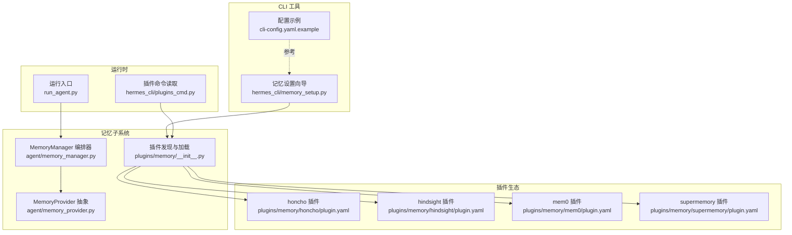
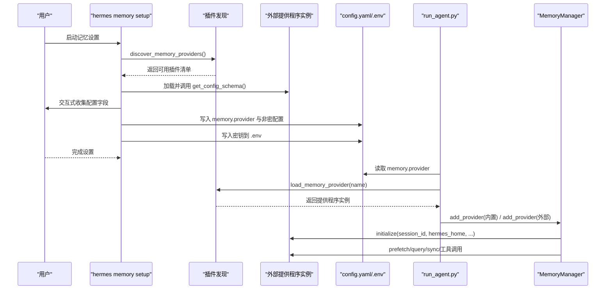
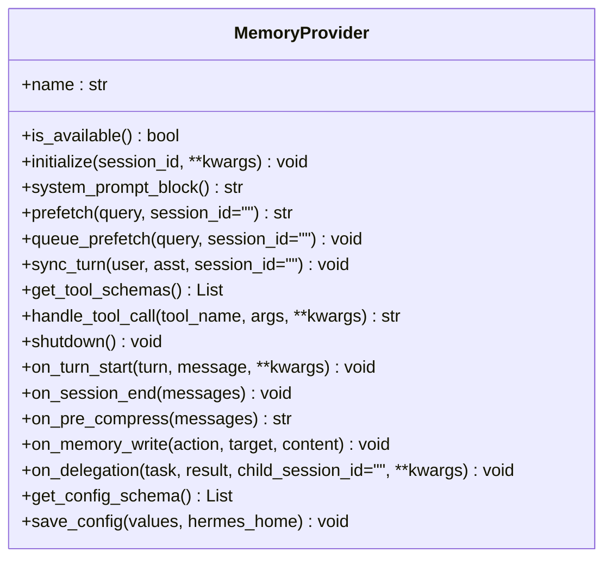
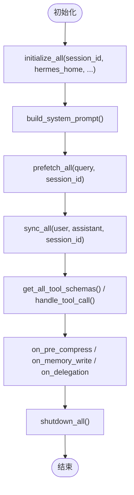
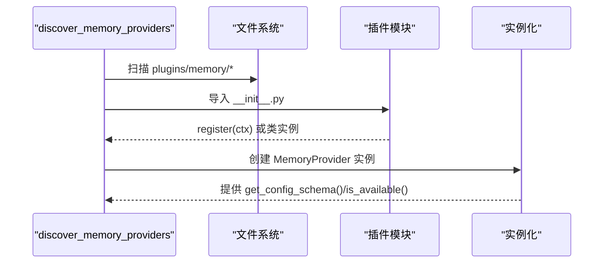
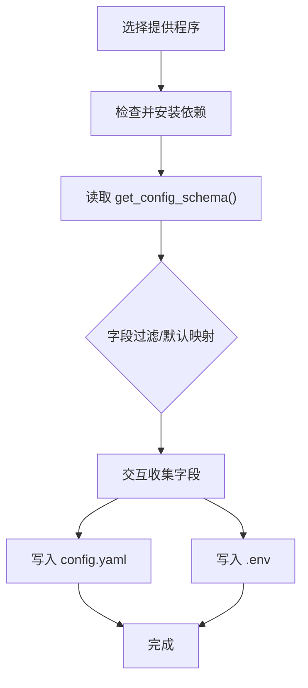
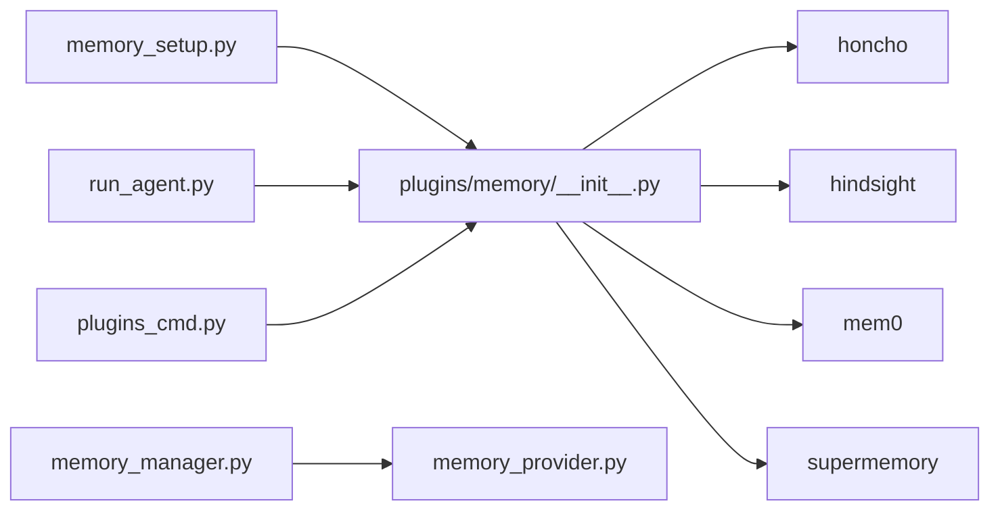

# 记忆配置管理

<cite>
**本文引用的文件**
- [agent/memory_manager.py](file://agent/memory_manager.py)
- [agent/memory_provider.py](file://agent/memory_provider.py)
- [hermes_cli/memory_setup.py](file://hermes_cli/memory_setup.py)
- [plugins/memory/__init__.py](file://plugins/memory/__init__.py)
- [plugins/memory/honcho/plugin.yaml](file://plugins/memory/honcho/plugin.yaml)
- [plugins/memory/hindsight/plugin.yaml](file://plugins/memory/hindsight/plugin.yaml)
- [plugins/memory/mem0/plugin.yaml](file://plugins/memory/mem0/plugin.yaml)
- [plugins/memory/supermemory/plugin.yaml](file://plugins/memory/supermemory/plugin.yaml)
- [cli-config.yaml.example](file://cli-config.yaml.example)
- [run_agent.py](file://run_agent.py)
- [hermes_cli/plugins_cmd.py](file://hermes_cli/plugins_cmd.py)
- [tests/agent/test_memory_provider.py](file://tests/agent/test_memory_provider.py)
</cite>

## 目录
1. [简介](#简介)
2. [项目结构](#项目结构)
3. [核心组件](#核心组件)
4. [架构总览](#架构总览)
5. [详细组件分析](#详细组件分析)
6. [依赖分析](#依赖分析)
7. [性能考虑](#性能考虑)
8. [故障排除指南](#故障排除指南)
9. [结论](#结论)
10. [附录](#附录)

## 简介
本文件系统性阐述 Hermes Agent 的记忆配置管理，覆盖以下方面：
- 记忆系统的配置选项与参数设置
- 不同记忆提供程序（内置与外部插件）的配置流程与认证信息
- 存储路径与连接参数的解析与注入
- 性能调优（缓存策略、批量处理、并发）
- 安全配置（数据加密、访问控制、隐私保护）
- 配置模板与示例、配置验证与故障排除
- 多用户环境下的配置管理与权限分配

## 项目结构
围绕记忆配置的关键模块与文件如下：
- 内置记忆与外部插件提供程序的抽象与注册：agent/memory_provider.py、plugins/memory/__init__.py
- 记忆管理编排器：agent/memory_manager.py
- CLI 配置向导与状态查看：hermes_cli/memory_setup.py
- 插件元数据与依赖声明：各插件目录下的 plugin.yaml
- 全局配置示例（含 memory 段落）：cli-config.yaml.example
- 运行时加载与激活逻辑：run_agent.py、hermes_cli/plugins_cmd.py
- 测试用例（字段过滤、默认值映射等）：tests/agent/test_memory_provider.py

图表来源
- [agent/memory_manager.py:1-363](file://agent/memory_manager.py#L1-L363)
- [agent/memory_provider.py:1-232](file://agent/memory_provider.py#L1-L232)
- [plugins/memory/__init__.py:1-318](file://plugins/memory/__init__.py#L1-L318)
- [hermes_cli/memory_setup.py:1-452](file://hermes_cli/memory_setup.py#L1-L452)
- [plugins/memory/honcho/plugin.yaml:1-8](file://plugins/memory/honcho/plugin.yaml#L1-L8)
- [plugins/memory/hindsight/plugin.yaml:1-9](file://plugins/memory/hindsight/plugin.yaml#L1-L9)
- [plugins/memory/mem0/plugin.yaml:1-6](file://plugins/memory/mem0/plugin.yaml#L1-L6)
- [plugins/memory/supermemory/plugin.yaml:1-6](file://plugins/memory/supermemory/plugin.yaml#L1-L6)
- [cli-config.yaml.example:379-398](file://cli-config.yaml.example#L379-L398)
- [run_agent.py:1116-1123](file://run_agent.py#L1116-L1123)
- [hermes_cli/plugins_cmd.py:620-640](file://hermes_cli/plugins_cmd.py#L620-L640)

章节来源
- [agent/memory_manager.py:1-363](file://agent/memory_manager.py#L1-L363)
- [agent/memory_provider.py:1-232](file://agent/memory_provider.py#L1-L232)
- [hermes_cli/memory_setup.py:1-452](file://hermes_cli/memory_setup.py#L1-L452)
- [plugins/memory/__init__.py:1-318](file://plugins/memory/__init__.py#L1-L318)
- [cli-config.yaml.example:379-398](file://cli-config.yaml.example#L379-L398)
- [run_agent.py:1116-1123](file://run_agent.py#L1116-L1123)
- [hermes_cli/plugins_cmd.py:620-640](file://hermes_cli/plugins_cmd.py#L620-L640)

## 核心组件
- MemoryProvider 抽象类：定义提供程序生命周期钩子、工具模式、可选配置模式与保存机制。支持静态系统提示块、预取、回合同步、工具模式暴露、关闭清理等。
- MemoryManager 编排器：统一注册与调度内置与外部提供程序；负责初始化、系统提示拼装、预取合并、回合同步、工具路由、生命周期回调与关闭。
- 插件发现与加载：扫描 plugins/memory/<name>/ 目录，读取 plugin.yaml 获取描述与依赖，动态加载提供程序实例。
- CLI 设置向导：交互式选择提供程序、安装依赖、收集配置字段、写入 config.yaml 与 .env，显示当前状态。

章节来源
- [agent/memory_provider.py:42-232](file://agent/memory_provider.py#L42-L232)
- [agent/memory_manager.py:72-363](file://agent/memory_manager.py#L72-L363)
- [plugins/memory/__init__.py:32-318](file://plugins/memory/__init__.py#L32-L318)
- [hermes_cli/memory_setup.py:183-452](file://hermes_cli/memory_setup.py#L183-L452)

## 架构总览
记忆系统采用“内置优先 + 单外部提供程序”的组合架构：
- 内置提供程序始终激活，不可移除
- 外部提供程序最多一个，通过 config.yaml 中的 memory.provider 指定
- 运行时由 run_agent.py 读取配置并激活对应插件
- MemoryManager 负责在每个生命周期阶段调用所有已注册提供程序

图表来源
- [hermes_cli/memory_setup.py:219-351](file://hermes_cli/memory_setup.py#L219-L351)
- [plugins/memory/__init__.py:32-97](file://plugins/memory/__init__.py#L32-L97)
- [run_agent.py:1116-1123](file://run_agent.py#L1116-L1123)
- [agent/memory_manager.py:86-131](file://agent/memory_manager.py#L86-L131)

## 详细组件分析

### MemoryProvider 抽象与生命周期
- 必需实现：name、is_available、initialize、get_tool_schemas
- 可选扩展：system_prompt_block、prefetch、queue_prefetch、sync_turn、shutdown
- 可选钩子：on_turn_start、on_session_end、on_pre_compress、on_memory_write、on_delegation
- 配置模式：get_config_schema 返回字段描述（含 secret、required、default、choices、env_var、url 等），save_config 将非密配置写入提供程序原生位置

图表来源
- [agent/memory_provider.py:42-232](file://agent/memory_provider.py#L42-L232)

章节来源
- [agent/memory_provider.py:42-232](file://agent/memory_provider.py#L42-L232)

### MemoryManager 编排与工具路由
- 注册限制：内置提供程序总是第一个且不可移除；仅允许一个外部提供程序
- 生命周期：initialize_all、build_system_prompt、prefetch_all、queue_prefetch_all、sync_all、on_pre_compress、on_memory_write、on_delegation、shutdown_all
- 工具路由：根据工具名映射到具体提供程序，统一错误处理

图表来源
- [agent/memory_manager.py:345-363](file://agent/memory_manager.py#L345-L363)
- [agent/memory_manager.py:146-209](file://agent/memory_manager.py#L146-L209)
- [agent/memory_manager.py:212-257](file://agent/memory_manager.py#L212-L257)
- [agent/memory_manager.py:285-333](file://agent/memory_manager.py#L285-L333)

章节来源
- [agent/memory_manager.py:72-363](file://agent/memory_manager.py#L72-L363)

### 插件发现与加载
- discover_memory_providers：扫描目录、读取 plugin.yaml、轻量可用性检查
- load_memory_provider：导入模块、尝试 register(ctx) 或直接实例化子类
- discover_plugin_cli_commands：仅对当前激活的外部提供程序注册 CLI 命令

图表来源
- [plugins/memory/__init__.py:32-197](file://plugins/memory/__init__.py#L32-L197)

章节来源
- [plugins/memory/__init__.py:32-318](file://plugins/memory/__init__.py#L32-L318)

### CLI 设置向导与状态
- 交互式选择：支持“仅内置”与多个外部提供程序
- 依赖安装：读取 plugin.yaml 的 pip_dependencies 并通过 uv 安装
- 字段收集：支持 choices、secret、when 条件、default_from 映射
- 写入策略：memory.provider 写入 config.yaml；secret 写入 .env；非密配置写入提供程序原生位置（若实现 save_config）

图表来源
- [hermes_cli/memory_setup.py:219-351](file://hermes_cli/memory_setup.py#L219-L351)

章节来源
- [hermes_cli/memory_setup.py:183-452](file://hermes_cli/memory_setup.py#L183-L452)

### 外部提供程序配置要点
- Honcho：跨会话用户建模，需要 honcho-ai 依赖，支持 on_session_end 钩子
- Hindsight：长期记忆与知识图谱，需要 hindsight-client 依赖，支持 on_session_end
- Mem0：服务端事实抽取与去重，需要 mem0ai 依赖
- Supermemory：语义长期记忆与显式工具，需要 supermemory 依赖

章节来源
- [plugins/memory/honcho/plugin.yaml:1-8](file://plugins/memory/honcho/plugin.yaml#L1-L8)
- [plugins/memory/hindsight/plugin.yaml:1-9](file://plugins/memory/hindsight/plugin.yaml#L1-L9)
- [plugins/memory/mem0/plugin.yaml:1-6](file://plugins/memory/mem0/plugin.yaml#L1-L6)
- [plugins/memory/supermemory/plugin.yaml:1-6](file://plugins/memory/supermemory/plugin.yaml#L1-L6)

### 运行时激活与配置读取
- run_agent.py 在启动时读取 memory.provider 并加载对应插件
- hermes_cli/plugins_cmd.py 提供读取/持久化 memory.provider 的辅助函数

章节来源
- [run_agent.py:1116-1123](file://run_agent.py#L1116-L1123)
- [hermes_cli/plugins_cmd.py:620-640](file://hermes_cli/plugins_cmd.py#L620-L640)

## 依赖分析
- 组件耦合
  - MemoryManager 强依赖 MemoryProvider 接口契约，弱依赖具体实现细节
  - CLI 设置向导依赖插件发现与配置模式（get_config_schema/save_config）
  - 运行时依赖 run_agent.py 与 hermes_cli/plugins_cmd.py 对 memory.provider 的读取
- 外部依赖
  - 各插件通过 plugin.yaml 声明 pip_dependencies，CLI 使用 uv 自动安装
- 循环依赖
  - 发现与加载模块为单向：CLI/运行时 → 插件发现 → 插件实例
- 接口契约
  - 所有新插件必须实现 get_config_schema/save_config 或完全使用环境变量

图表来源
- [hermes_cli/memory_setup.py:183-351](file://hermes_cli/memory_setup.py#L183-L351)
- [plugins/memory/__init__.py:32-197](file://plugins/memory/__init__.py#L32-L197)
- [run_agent.py:1116-1123](file://run_agent.py#L1116-L1123)
- [hermes_cli/plugins_cmd.py:620-640](file://hermes_cli/plugins_cmd.py#L620-L640)
- [agent/memory_manager.py:72-131](file://agent/memory_manager.py#L72-L131)
- [agent/memory_provider.py:188-232](file://agent/memory_provider.py#L188-L232)

章节来源
- [plugins/memory/__init__.py:32-197](file://plugins/memory/__init__.py#L32-L197)
- [hermes_cli/memory_setup.py:183-351](file://hermes_cli/memory_setup.py#L183-L351)
- [agent/memory_manager.py:72-131](file://agent/memory_manager.py#L72-L131)
- [agent/memory_provider.py:188-232](file://agent/memory_provider.py#L188-L232)

## 性能考虑
- 缓存策略
  - prefetch 与 queue_prefetch：在每轮开始前进行背景召回，返回缓存结果以减少延迟
  - MemoryManager 合并来自多个提供程序的上下文，避免重复检索
- 批量处理
  - 外部提供程序应在 sync_turn 中采用非阻塞异步写入，队列化后台处理
- 并发设置
  - 提供程序内部应使用线程池或异步任务管理并发召回与写入
- 上下文压缩协作
  - on_pre_compress 可提取关键洞察用于压缩摘要，保留重要信息
- 配置参考
  - 全局压缩阈值、目标比例、最近消息保护数等参数位于 cli-config.yaml.example 的 compression 段落

章节来源
- [agent/memory_manager.py:167-209](file://agent/memory_manager.py#L167-L209)
- [agent/memory_provider.py:92-120](file://agent/memory_provider.py#L92-L120)
- [agent/memory_provider.py:163-173](file://agent/memory_provider.py#L163-L173)
- [cli-config.yaml.example:292-321](file://cli-config.yaml.example#L292-L321)

## 故障排除指南
- 无法安装依赖
  - 现象：uv 未找到或安装失败
  - 处理：按提示安装 uv；手动执行 uv pip install --python <path> <deps>
- 配置缺失
  - 现象：状态显示 not available
  - 处理：检查 .env 中的 env_var 是否存在；根据 url 获取凭据
- 工具冲突
  - 现象：工具名冲突警告
  - 处理：确保不同提供程序的工具名不重复
- 外部提供程序过多
  - 现象：仅允许一个外部提供程序
  - 处理：在 config.yaml 中设置正确的 memory.provider

章节来源
- [hermes_cli/memory_setup.py:58-141](file://hermes_cli/memory_setup.py#L58-L141)
- [hermes_cli/memory_setup.py:412-428](file://hermes_cli/memory_setup.py#L412-L428)
- [agent/memory_manager.py:86-131](file://agent/memory_manager.py#L86-L131)
- [agent/memory_manager.py:96-108](file://agent/memory_manager.py#L96-L108)

## 结论
Hermes Agent 的记忆配置管理通过统一的 MemoryProvider 抽象与 MemoryManager 编排，实现了“内置优先 + 单外部提供程序”的稳健架构。CLI 设置向导提供了标准化的配置流程，结合插件发现与依赖安装机制，使得外部提供程序的接入与维护变得简单可控。配合全局压缩与上下文管理策略，系统在功能与性能之间取得平衡。

## 附录

### 配置文件模板与示例
- 全局配置示例（含 memory 段落）：cli-config.yaml.example
- 内置记忆开关与字符限制、周期提醒与刷新策略等

章节来源
- [cli-config.yaml.example:379-398](file://cli-config.yaml.example#L379-L398)

### 多用户环境下的配置管理与权限分配
- 用户标识与会话隔离
  - MemoryProvider.initialize 接收 session_id、user_id、agent_identity 等参数，用于区分用户与会话
  - gateway 层面 group_sessions_per_user 控制群组聊天是否按用户分会话
- 权限与访问控制
  - 外部提供程序的凭据通过 .env 管理，避免泄露
  - 插件仅在激活时加载 CLI 命令，降低攻击面
- 最佳实践
  - 为不同用户或工作区设置独立的 HERMES_HOME，实现配置与存储隔离
  - 仅启用必要的外部提供程序，减少工具模式冲突
  - 定期检查 .env 中密钥的有效性与过期时间

章节来源
- [agent/memory_provider.py:61-81](file://agent/memory_provider.py#L61-L81)
- [cli-config.yaml.example:421-430](file://cli-config.yaml.example#L421-L430)
- [plugins/memory/__init__.py:250-318](file://plugins/memory/__init__.py#L250-L318)

### 配置验证与测试要点
- 字段过滤与默认映射
  - when 条件与 default_from 映射在 setup 向导中生效，测试用例覆盖该行为
- 状态检查
  - cmd_status 输出当前 provider、插件安装状态与可用性

章节来源
- [tests/agent/test_memory_provider.py:509-532](file://tests/agent/test_memory_provider.py#L509-L532)
- [hermes_cli/memory_setup.py:382-437](file://hermes_cli/memory_setup.py#L382-L437)