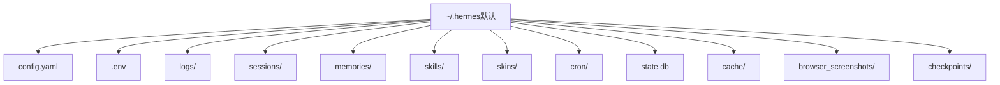
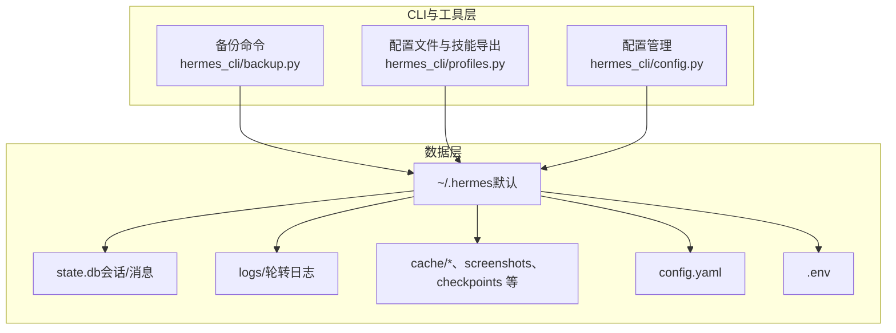
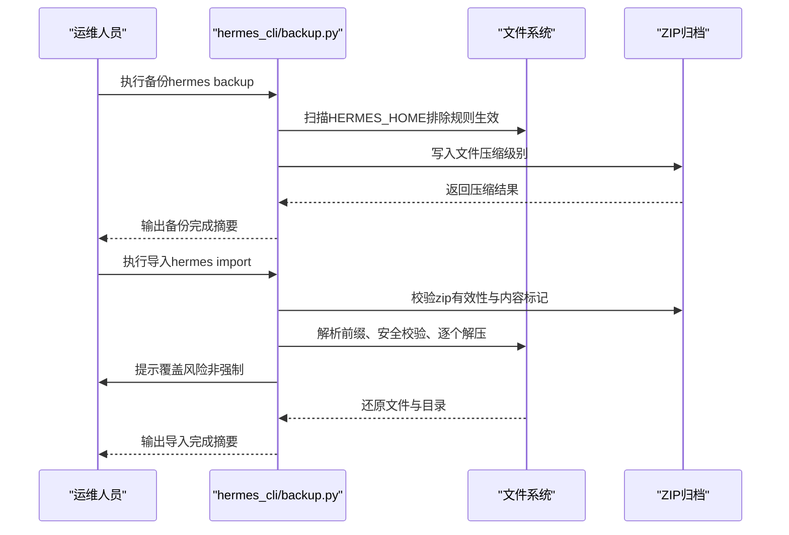
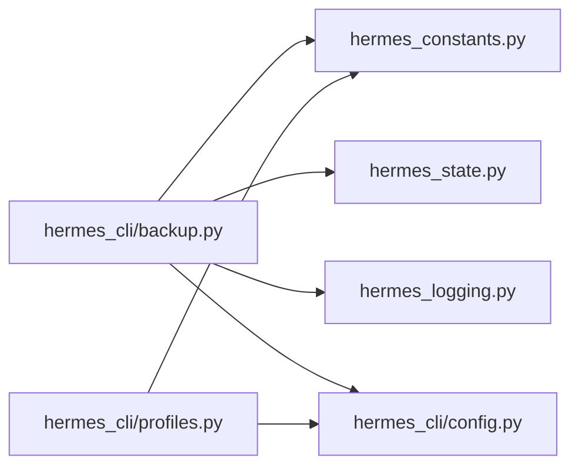

# 备份与恢复

<cite>
**本文引用的文件**
- [hermes_cli/backup.py](file://hermes_cli/backup.py)
- [hermes_constants.py](file://hermes_constants.py)
- [hermes_state.py](file://hermes_state.py)
- [hermes_logging.py](file://hermes_logging.py)
- [hermes_cli/config.py](file://hermes_cli/config.py)
- [hermes_cli/profiles.py](file://hermes_cli/profiles.py)
- [tests/hermes_cli/test_backup.py](file://tests/hermes_cli/test_backup.py)
- [tests/hermes_cli/test_profiles.py](file://tests/hermes_cli/test_profiles.py)
</cite>

## 目录
1. [简介](#简介)
2. [项目结构](#项目结构)
3. [核心组件](#核心组件)
4. [架构总览](#架构总览)
5. [详细组件分析](#详细组件分析)
6. [依赖分析](#依赖分析)
7. [性能考虑](#性能考虑)
8. [故障排查指南](#故障排查指南)
9. [结论](#结论)
10. [附录](#附录)

## 简介
本指南面向IT管理人员，提供Hermes Agent的备份与恢复专业方案。内容覆盖：
- 数据备份策略：完整备份、增量/差异备份建议与落地方法
- 备份频率与存储位置配置
- 配置文件、用户数据、日志文件的备份与恢复步骤
- 灾难恢复计划、业务连续性保障
- 备份验证、恢复测试与故障切换操作指南

## 项目结构
Hermes Agent的数据主要位于默认的Hermes主目录（默认为~/.hermes），关键子目录包括：
- 配置与密钥：config.yaml、.env
- 日志：logs/
- 会话与记忆：sessions/、memories/
- 技能与皮肤：skills/、skins/
- 计划任务：cron/
- 状态数据库：state.db（SQLite）
- 缓存与截图等：cache/*、browser_screenshots、checkpoints 等

图表来源
- [hermes_constants.py:226-247](file://hermes_constants.py#L226-L247)
- [hermes_cli/config.py:280-286](file://hermes_cli/config.py#L280-L286)

章节来源
- [hermes_constants.py:11-112](file://hermes_constants.py#L11-L112)
- [hermes_cli/config.py:265-286](file://hermes_cli/config.py#L265-L286)

## 核心组件
- 备份与导入命令：提供zip打包与还原能力，自动排除临时/缓存/代码库等目录，并进行安全校验与路径清理。
- 路径与常量：统一管理HERMES_HOME、日志目录、状态数据库路径等，确保备份范围一致。
- 日志系统：支持按大小轮转与备份数量控制，便于灾备时保留关键审计线索。
- 状态数据库：SQLite持久化会话与消息历史，支持导出/清理/修剪，是恢复重点对象之一。
- 配置与密钥：config.yaml承载运行配置；.env承载敏感密钥，二者均需纳入备份。

章节来源
- [hermes_cli/backup.py:79-187](file://hermes_cli/backup.py#L79-L187)
- [hermes_cli/backup.py:245-399](file://hermes_cli/backup.py#L245-L399)
- [hermes_constants.py:226-247](file://hermes_constants.py#L226-L247)
- [hermes_state.py:32-91](file://hermes_state.py#L32-L91)
- [hermes_logging.py:166-201](file://hermes_logging.py#L166-L201)

## 架构总览
下图展示备份与恢复在系统中的交互关系：

图表来源
- [hermes_cli/backup.py:79-187](file://hermes_cli/backup.py#L79-L187)
- [hermes_cli/profiles.py:780-800](file://hermes_cli/profiles.py#L780-L800)
- [hermes_cli/config.py:265-286](file://hermes_cli/config.py#L265-L286)
- [hermes_state.py:32-91](file://hermes_state.py#L32-L91)
- [hermes_logging.py:166-201](file://hermes_logging.py#L166-L201)

## 详细组件分析

### 备份与导入组件（hermes_cli/backup.py）
- 备份策略
  - 自动扫描HERMES_HOME，排除代码库、缓存、临时文件、进程锁等目录与文件，避免冗余与不必要数据进入备份。
  - 输出zip压缩包，默认以时间戳命名，便于归档与检索。
  - 支持输出到指定目录或用户家目录。
- 导入策略
  - 校验zip是否为空、是否包含典型配置标记（如config.yaml、.env、state数据库）。
  - 自动识别并剥离可能存在的顶层目录前缀（兼容不同打包方式）。
  - 对目标环境已存在配置进行确认提示，防止误覆盖；支持强制模式跳过确认。
  - 安全检查：拒绝绝对路径与路径穿越尝试；对权限错误/IO错误进行汇总提示。
  - 恢复后尝试重建profile别名脚本，提升可用性。
- 错误处理
  - 文件不存在、非zip文件、权限不足、路径穿越、中断等场景均有明确提示与退出码。

图表来源
- [hermes_cli/backup.py:79-187](file://hermes_cli/backup.py#L79-L187)
- [hermes_cli/backup.py:245-399](file://hermes_cli/backup.py#L245-L399)

章节来源
- [hermes_cli/backup.py:46-63](file://hermes_cli/backup.py#L46-L63)
- [hermes_cli/backup.py:79-187](file://hermes_cli/backup.py#L79-L187)
- [hermes_cli/backup.py:194-218](file://hermes_cli/backup.py#L194-L218)
- [hermes_cli/backup.py:221-243](file://hermes_cli/backup.py#L221-L243)
- [hermes_cli/backup.py:245-399](file://hermes_cli/backup.py#L245-L399)

### 路径与常量（hermes_constants.py）
- 统一获取HERMES_HOME与各子目录路径，保证备份范围一致性。
- 提供显示友好路径字符串，便于日志与提示信息输出。
- 用于定位state.db、logs、skills、env等关键位置。

章节来源
- [hermes_constants.py:11-112](file://hermes_constants.py#L11-L112)
- [hermes_constants.py:226-247](file://hermes_constants.py#L226-L247)

### 状态数据库（hermes_state.py）
- SQLite持久化会话与消息历史，支持全文检索（FTS5）与令牌统计。
- 提供导出/清理/修剪接口，便于离线备份与空间治理。
- WAL模式与写重试机制降低并发写入冲突，提升稳定性。

章节来源
- [hermes_state.py:32-91](file://hermes_state.py#L32-L91)
- [hermes_state.py:1142-1161](file://hermes_state.py#L1142-L1161)
- [hermes_state.py:1199-1239](file://hermes_state.py#L1199-L1239)

### 日志系统（hermes_logging.py）
- 支持按大小轮转与备份数量控制，便于灾备时保留关键审计线索。
- 可通过config.yaml调整日志级别、单文件最大大小与备份数量。

章节来源
- [hermes_logging.py:166-201](file://hermes_logging.py#L166-L201)
- [hermes_logging.py:374-394](file://hermes_logging.py#L374-L394)
- [hermes_cli/config.py:688-694](file://hermes_cli/config.py#L688-L694)

### 配置与密钥（hermes_cli/config.py）
- 默认创建并维护HERMES_HOME目录结构，设置安全权限。
- 提供默认配置模板与迁移逻辑，确保备份中包含可恢复的配置骨架。
- .env文件存放API密钥等敏感信息，必须纳入备份但需注意访问控制。

章节来源
- [hermes_cli/config.py:265-286](file://hermes_cli/config.py#L265-L286)
- [hermes_cli/config.py:311-706](file://hermes_cli/config.py#L311-L706)
- [hermes_cli/config.py:203-209](file://hermes_cli/config.py#L203-L209)

### 配置文件与技能导出（hermes_cli/profiles.py）
- 提供profile导出/导入能力，支持仅导出配置与记忆等关键数据，避免基础设施冗余。
- 导出时排除代码库、工作树、其他profile、二进制、数据库、缓存、日志等，确保归档体积合理。

章节来源
- [hermes_cli/profiles.py:78-100](file://hermes_cli/profiles.py#L78-L100)
- [hermes_cli/profiles.py:756-777](file://hermes_cli/profiles.py#L756-L777)
- [hermes_cli/profiles.py:780-800](file://hermes_cli/profiles.py#L780-L800)
- [tests/hermes_cli/test_profiles.py:534-580](file://tests/hermes_cli/test_profiles.py#L534-L580)

## 依赖分析
- 备份命令依赖路径常量模块确定HERMES_HOME与各子目录，确保扫描范围一致。
- 日志系统与配置模块共同决定日志轮转策略，影响灾备时日志保留策略。
- 状态数据库作为核心数据源，其导出/修剪接口为离线备份与容量治理提供支撑。

图表来源
- [hermes_cli/backup.py:18-18](file://hermes_cli/backup.py#L18-L18)
- [hermes_cli/profiles.py:141-142](file://hermes_cli/profiles.py#L141-L142)
- [hermes_cli/config.py:201-201](file://hermes_cli/config.py#L201-L201)

章节来源
- [hermes_cli/backup.py:18-18](file://hermes_cli/backup.py#L18-L18)
- [hermes_cli/profiles.py:141-142](file://hermes_cli/profiles.py#L141-L142)
- [hermes_cli/config.py:201-201](file://hermes_cli/config.py#L201-L201)

## 性能考虑
- 备份压缩：使用标准zip压缩，压缩级别适中，兼顾速度与体积。
- 扫描优化：在os.walk阶段即剔除应排除的目录，减少无效遍历。
- IO吞吐：分批进度提示（每500文件），便于监控与评估耗时。
- 并发写入：状态数据库采用WAL与随机抖动重试，降低锁竞争影响。

章节来源
- [hermes_cli/backup.py:151-163](file://hermes_cli/backup.py#L151-L163)
- [hermes_state.py:132-136](file://hermes_state.py#L132-L136)

## 故障排查指南
- 常见问题与处理
  - 备份文件不存在：检查HERMES_HOME与输出路径权限。
  - 非zip文件：确认输入为有效zip格式。
  - 导入覆盖风险：未使用强制参数时，遇到已有配置会提示确认；可使用强制参数跳过确认。
  - 权限错误/路径穿越：命令内置安全检查与错误汇总，修复权限或调整目标路径后重试。
  - profile别名无法创建：检查~/.local/bin是否在PATH中，必要时添加。
- 测试用例参考
  - 备份导入流程、确认提示、强制覆盖、文件不存在、键盘中断、权限错误、profiles模块缺失等场景均有测试覆盖。

章节来源
- [tests/hermes_cli/test_backup.py:392-447](file://tests/hermes_cli/test_backup.py#L392-L447)
- [tests/hermes_cli/test_backup.py:762-781](file://tests/hermes_cli/test_backup.py#L762-L781)
- [tests/hermes_cli/test_backup.py:920-935](file://tests/hermes_cli/test_backup.py#L920-L935)
- [hermes_cli/backup.py:280-292](file://hermes_cli/backup.py#L280-L292)
- [hermes_cli/backup.py:314-328](file://hermes_cli/backup.py#L314-L328)
- [hermes_cli/backup.py:377-386](file://hermes_cli/backup.py#L377-L386)

## 结论
Hermes Agent提供了开箱即用的备份与恢复能力：通过CLI命令即可完成系统级完整备份与安全导入；配合profile导出、日志轮转与状态数据库导出/修剪，可构建完善的灾备与业务连续性体系。建议结合实际业务需求制定备份策略与恢复演练计划，确保在发生故障时快速、准确地恢复服务。

## 附录

### 备份策略与频率建议
- 完整备份
  - 周期：每周一次完整备份
  - 触发：系统变更窗口或业务低峰期
  - 存储：本地+异地（至少两处不同物理位置）
- 增量/差异备份
  - 建议：基于文件级差异工具（如rsync+硬链接快照）每日执行，保留多代快照
  - 注意：Hermes CLI当前提供完整zip备份，若需严格增量/差异，建议结合外部工具实现
- 日志与状态
  - 日志：按大小轮转，保留最近N份；灾备时优先保留最近一周的轮转日志
  - 状态数据库：定期导出（如每日）作为独立快照，便于快速恢复

章节来源
- [hermes_logging.py:166-201](file://hermes_logging.py#L166-L201)
- [hermes_state.py:1142-1161](file://hermes_state.py#L1142-L1161)

### 备份存储位置配置
- 默认位置：~/.hermes（可通过HERMES_HOME环境变量自定义）
- 输出位置：hermes backup支持指定输出目录或使用默认用户家目录
- 建议：将备份归档集中到专用卷/对象存储，开启版本控制与生命周期策略

章节来源
- [hermes_constants.py:11-17](file://hermes_constants.py#L11-L17)
- [hermes_cli/backup.py:87-103](file://hermes_cli/backup.py#L87-L103)

### 具体备份步骤
- 配置文件与密钥
  - 使用hermes backup生成完整zip；或使用hermes profile export导出profile归档
- 用户数据
  - 包含sessions/、memories/、skills/、skins/、cron/等；CLI已自动排除缓存与临时文件
- 日志文件
  - 由hermes_logging按配置轮转；灾备时保留最近N份

章节来源
- [hermes_cli/backup.py:245-399](file://hermes_cli/backup.py#L245-L399)
- [hermes_cli/profiles.py:780-800](file://hermes_cli/profiles.py#L780-L800)
- [hermes_logging.py:166-201](file://hermes_logging.py#L166-L201)

### 恢复步骤
- 完整恢复
  - 准备新的Hermes环境，设置HERMES_HOME
  - 执行hermes import，按提示确认覆盖（如需）
  - 如有profile归档，使用hermes profile import导入
- 业务连续性
  - 启动网关与相关服务；如需要，重建profile别名脚本

章节来源
- [hermes_cli/backup.py:245-399](file://hermes_cli/backup.py#L245-L399)
- [hermes_cli/profiles.py:924-933](file://hermes_cli/profiles.py#L924-L933)

### 灾难恢复计划（DRP）
- 目标
  - RTO/RPO目标：根据业务SLA设定（如RPO=1d，RTO=4h）
- 角色与职责
  - IT团队负责备份与恢复操作；业务方负责验证恢复结果
- 恢复流程
  - 识别故障类型（磁盘损坏/误删除/配置破坏）
  - 选择最近可用备份（优先完整备份+最近增量）
  - 执行恢复并进行功能与数据一致性验证
- 业务连续性
  - 保持最小停机窗口；必要时启用热备节点或容器编排恢复

[本节为通用流程说明，不直接分析具体文件]

### 备份验证与恢复测试
- 备份验证
  - 校验zip完整性与内容标记（包含config.yaml/.env/state数据库）
  - 检查输出文件大小与扫描文件数是否合理
- 恢复测试
  - 在隔离环境中执行导入，验证配置加载、日志生成、状态数据库可读
  - 验证profile别名脚本可用性与PATH配置
- 故障切换
  - 制定切换清单（停止旧实例、启动新实例、更新DNS/负载均衡）
  - 回滚预案：保留上一个稳定版本的备份，以便快速回滚

章节来源
- [tests/hermes_cli/test_backup.py:392-447](file://tests/hermes_cli/test_backup.py#L392-L447)
- [tests/hermes_cli/test_backup.py:762-781](file://tests/hermes_cli/test_backup.py#L762-L781)
- [hermes_cli/backup.py:194-218](file://hermes_cli/backup.py#L194-L218)
- [hermes_cli/backup.py:377-386](file://hermes_cli/backup.py#L377-L386)