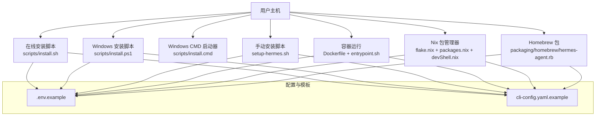
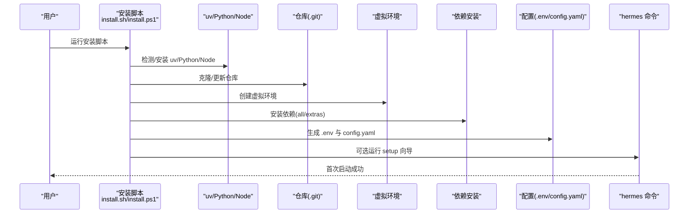
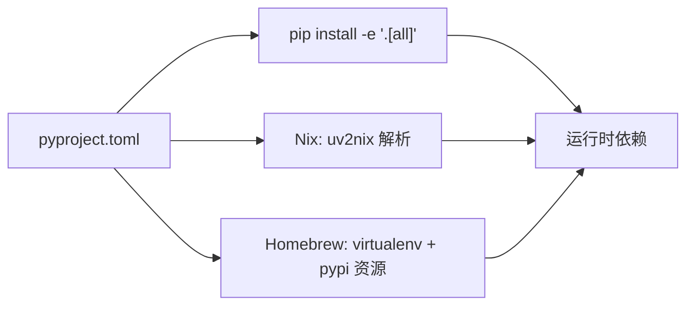

# 安装与配置

<cite>
**本文引用的文件**
- [README.md](file://README.md)
- [scripts/install.sh](file://scripts/install.sh)
- [scripts/install.cmd](file://scripts/install.cmd)
- [scripts/install.ps1](file://scripts/install.ps1)
- [setup-hermes.sh](file://setup-hermes.sh)
- [Dockerfile](file://Dockerfile)
- [docker/entrypoint.sh](file://docker/entrypoint.sh)
- [cli-config.yaml.example](file://cli-config.yaml.example)
- [.env.example](file://.env.example)
- [pyproject.toml](file://pyproject.toml)
- [flake.nix](file://flake.nix)
- [nix/packages.nix](file://nix/packages.nix)
- [nix/devShell.nix](file://nix/devShell.nix)
- [requirements.txt](file://requirements.txt)
- [packaging/homebrew/hermes-agent.rb](file://packaging/homebrew/hermes-agent.rb)
</cite>

## 目录
1. [简介](#简介)
2. [项目结构](#项目结构)
3. [核心组件](#核心组件)
4. [架构总览](#架构总览)
5. [详细组件分析](#详细组件分析)
6. [依赖关系分析](#依赖关系分析)
7. [性能考虑](#性能考虑)
8. [故障排除指南](#故障排除指南)
9. [结论](#结论)
10. [附录](#附录)

## 简介
本指南面向在多平台（Linux、macOS、Android/Termux、Windows）上安装与配置 Hermes Agent 的用户，覆盖传统安装、Docker 容器安装、Nix 包管理器安装以及 Windows 安装路径，并提供系统要求、前置依赖、环境准备、配置文件示例与参数说明、首次运行配置、认证设置与基础环境变量配置，以及常见问题的排查建议。

## 项目结构
Hermes Agent 提供了多条安装路径与工具脚本：
- 在线安装脚本：支持 Linux/macOS/Android/Termux 的一键安装。
- Windows 安装：提供 PowerShell 脚本与 CMD 启动器。
- 手动安装：通过本地克隆仓库执行 setup-hermes.sh。
- 容器化部署：使用官方 Dockerfile 构建镜像并在容器中运行。
- 包管理器：Homebrew 与 Nix 均提供安装入口。
- 配置模板：提供 .env 与 cli-config.yaml 示例，便于快速开始。

图表来源
- [scripts/install.sh:1-1378](file://scripts/install.sh#L1-L1378)
- [scripts/install.ps1:1-920](file://scripts/install.ps1#L1-L920)
- [scripts/install.cmd:1-29](file://scripts/install.cmd#L1-L29)
- [setup-hermes.sh:1-400](file://setup-hermes.sh#L1-L400)
- [Dockerfile:1-47](file://Dockerfile#L1-L47)
- [docker/entrypoint.sh:1-65](file://docker/entrypoint.sh#L1-L65)
- [cli-config.yaml.example:1-886](file://cli-config.yaml.example#L1-L886)
- [.env.example:1-379](file://.env.example#L1-L379)
- [flake.nix:1-36](file://flake.nix#L1-L36)
- [nix/packages.nix:1-55](file://nix/packages.nix#L1-L55)
- [nix/devShell.nix:1-52](file://nix/devShell.nix#L1-L52)
- [packaging/homebrew/hermes-agent.rb:1-49](file://packaging/homebrew/hermes-agent.rb#L1-L49)

章节来源
- [README.md:30-63](file://README.md#L30-L63)
- [scripts/install.sh:1-1378](file://scripts/install.sh#L1-L1378)
- [scripts/install.ps1:1-920](file://scripts/install.ps1#L1-L920)
- [scripts/install.cmd:1-29](file://scripts/install.cmd#L1-L29)
- [setup-hermes.sh:1-400](file://setup-hermes.sh#L1-L400)
- [Dockerfile:1-47](file://Dockerfile#L1-L47)
- [docker/entrypoint.sh:1-65](file://docker/entrypoint.sh#L1-L65)
- [cli-config.yaml.example:1-886](file://cli-config.yaml.example#L1-L886)
- [.env.example:1-379](file://.env.example#L1-L379)
- [pyproject.toml:1-129](file://pyproject.toml#L1-L129)
- [flake.nix:1-36](file://flake.nix#L1-L36)
- [nix/packages.nix:1-55](file://nix/packages.nix#L1-L55)
- [nix/devShell.nix:1-52](file://nix/devShell.nix#L1-L52)
- [requirements.txt:1-37](file://requirements.txt#L1-L37)
- [packaging/homebrew/hermes-agent.rb:1-49](file://packaging/homebrew/hermes-agent.rb#L1-L49)

## 核心组件
- 在线安装脚本：自动检测平台、安装 uv、Python 3.11、可选系统依赖（ripgrep、ffmpeg），克隆仓库，创建虚拟环境，安装依赖，生成 .env 与 config.yaml，可选运行 setup 向导。
- Windows 安装脚本：支持 PowerShell 一键安装，自动处理 uv、Python、Git、Node.js、系统包（winget/choco/scoop），初始化仓库与依赖，设置 PATH 与 HERMES_HOME。
- 手动安装脚本：适用于已克隆仓库的开发者，自动选择 uv 或 Python stdlib venv，安装依赖，同步技能，可选运行 setup。
- 容器安装：Dockerfile 使用 uv 与 gosu，预装系统依赖，复制 Node 依赖与 Playwright 浏览器，以非 root 用户运行，entrypoint 自动挂载 /opt/data 并生成配置。
- Nix 包管理器：flake.nix 汇聚 nixpkgs、pyproject-nix、uv2nix 等输入，packages.nix 打包默认包，devShell.nix 提供开发环境与 stamp 文件优化。
- Homebrew 包：formula 将 Python 3.14 与依赖打包到虚拟环境，注入环境变量指向内置技能目录。

章节来源
- [scripts/install.sh:1-1378](file://scripts/install.sh#L1-L1378)
- [scripts/install.ps1:1-920](file://scripts/install.ps1#L1-L920)
- [setup-hermes.sh:1-400](file://setup-hermes.sh#L1-L400)
- [Dockerfile:1-47](file://Dockerfile#L1-L47)
- [docker/entrypoint.sh:1-65](file://docker/entrypoint.sh#L1-L65)
- [flake.nix:1-36](file://flake.nix#L1-L36)
- [nix/packages.nix:1-55](file://nix/packages.nix#L1-L55)
- [nix/devShell.nix:1-52](file://nix/devShell.nix#L1-L52)
- [packaging/homebrew/hermes-agent.rb:1-49](file://packaging/homebrew/hermes-agent.rb#L1-L49)

## 架构总览
下图展示从安装到首次运行的关键流程与交互点：

图表来源
- [scripts/install.sh:1-1378](file://scripts/install.sh#L1-L1378)
- [scripts/install.ps1:1-920](file://scripts/install.ps1#L1-L920)
- [Dockerfile:1-47](file://Dockerfile#L1-L47)
- [docker/entrypoint.sh:1-65](file://docker/entrypoint.sh#L1-L65)
- [cli-config.yaml.example:1-886](file://cli-config.yaml.example#L1-L886)
- [.env.example:1-379](file://.env.example#L1-L379)

## 详细组件分析

### 传统安装（Linux/macOS/Android/Termux）
- 支持平台：Linux、macOS、Android/Termux；Windows 建议使用 WSL2 或 PowerShell 安装脚本。
- 关键步骤：
  - 检测平台与终端类型（Termux 专用路径）。
  - 安装/定位 uv，若无则自动安装。
  - 检查/安装 Python 3.11（Termux 使用 pkg 安装）。
  - 检查/安装 Git、Node.js（按需自动安装）。
  - 可选安装系统依赖：ripgrep、ffmpeg（Termux 通过 pkg 安装，其他平台通过包管理器或 cargo）。
  - 克隆/更新仓库，创建虚拟环境，安装依赖（优先使用 uv.lock，否则回退 pip）。
  - 生成 .env 与 config.yaml，同步内置技能，可选运行 setup 向导。
- 环境变量与 PATH：
  - Termux：自动将 ~/.local/bin 加入 PATH。
  - 非 Termux：向 shell 配置文件追加 PATH，确保 hermes 命令可用。

章节来源
- [README.md:30-63](file://README.md#L30-L63)
- [scripts/install.sh:1-1378](file://scripts/install.sh#L1-L1378)
- [setup-hermes.sh:1-400](file://setup-hermes.sh#L1-L400)

### Windows 安装（PowerShell/WSL2/CMD）
- 支持方式：PowerShell 一键安装；CMD 启动器调用 PowerShell。
- 关键步骤：
  - 检测/安装 uv，定位 Python 3.11（回退到系统 Python 3.10+）。
  - 检查/安装 Git、Node.js（winget/choco/scoop/fallback）。
  - 可选安装系统依赖（ripgrep、ffmpeg）。
  - 克隆/更新仓库（失败时尝试 ZIP 下载），初始化子模块。
  - 创建虚拟环境，安装依赖（含可选 tinker-atropos）。
  - 设置 PATH 与 HERMES_HOME，生成 .env 与 config.yaml，同步技能。
  - 可选运行 setup 向导；如检测到消息平台令牌，提示配对（如 WhatsApp）。

章节来源
- [scripts/install.ps1:1-920](file://scripts/install.ps1#L1-L920)
- [scripts/install.cmd:1-29](file://scripts/install.cmd#L1-L29)
- [docker/entrypoint.sh:1-65](file://docker/entrypoint.sh#L1-L65)

### Docker 容器安装
- 基础镜像：基于 uv 与 gosu，Debian 13.4，预装 build-essential、nodejs、npm、python3、ripgrep、ffmpeg、gcc、python3-dev、libffi-dev、procps。
- 非 root 用户：默认以 UID/GID 10000 的 hermes 用户运行，可通过 HERMES_UID/HERMES_GID 调整。
- 依赖安装：先安装 Node 依赖与 Playwright 浏览器，再切换到 hermes 用户安装 Python 依赖。
- 卷挂载：/opt/data 作为数据卷，entrypoint 自动创建必要目录、复制 .env 与 config.yaml、同步技能后启动 hermes。
- 环境变量：PLAYWRIGHT_BROWSERS_PATH、PYTHONUNBUFFERED、HERMES_HOME。

章节来源
- [Dockerfile:1-47](file://Dockerfile#L1-L47)
- [docker/entrypoint.sh:1-65](file://docker/entrypoint.sh#L1-L65)

### Nix 包管理器安装
- flake.nix：定义 nixpkgs、flake-parts、pyproject-nix、uv2nix 输入，输出包含 packages、nixosModules、checks、devShell。
- packages.nix：使用 uv2nix 构建 Python 依赖，打包 hermes、hermes-agent、hermes-acp 三个可执行程序，注入运行时 PATH 与技能目录。
- devShell.nix：提供 Python 3.11 开发环境，stamp 文件避免重复安装，自动安装 npm 依赖。

章节来源
- [flake.nix:1-36](file://flake.nix#L1-L36)
- [nix/packages.nix:1-55](file://nix/packages.nix#L1-L55)
- [nix/devShell.nix:1-52](file://nix/devShell.nix#L1-L52)

### Homebrew 包安装
- formula：指定 Python 3.14 与依赖，使用 virtualenv 创建隔离环境，安装包并写入可执行脚本，注入环境变量指向内置技能目录。
- 测试：验证版本输出与“由 Homebrew 管理”的提示。

章节来源
- [packaging/homebrew/hermes-agent.rb:1-49](file://packaging/homebrew/hermes-agent.rb#L1-L49)

### 配置文件与参数说明
- .env 示例：集中存放各类 API 密钥与平台配置，如 OpenRouter、Google AI Studio、z.ai、Kimi/Moonshot、MiniMax、Hugging Face、Honcho、Browserbase、Slack、Telegram、WhatsApp、邮件等。
- cli-config.yaml 示例：模型提供方与路由、智能路由、终端后端（local/ssh/docker/singularity/modal）、容器资源限制、安全扫描、浏览器工具、上下文压缩、辅助模型、持久记忆、会话重置策略、流式传输、技能、MCP 服务器、语音转录、显示与日志等。
- 环境变量优先级：.env 中的环境变量优先于 cli-config.yaml 的同名字段。

章节来源
- [.env.example:1-379](file://.env.example#L1-L379)
- [cli-config.yaml.example:1-886](file://cli-config.yaml.example#L1-L886)

### 首次运行配置与认证
- 在线安装完成后，建议运行 hermes setup 进入交互式配置，或直接 hermes model 选择模型与提供方。
- 常见认证：
  - OpenRouter：OPENROUTER_API_KEY。
  - Google AI Studio：GOOGLE_API_KEY 或 GEMINI_API_KEY。
  - z.ai/GLM：GLM_API_KEY。
  - Kimi/Moonshot：KIMI_API_KEY，必要时设置 KIMI_BASE_URL。
  - MiniMax：MINIMAX_API_KEY 或 MINIMAX_CN_API_KEY，必要时设置 BASE_URL。
  - Hugging Face：HF_TOKEN。
  - Browserbase：BROWSERBASE_API_KEY 与可选 BROWSERBASE_PROJECT_ID。
  - Slack/Telegram/WhatsApp/邮件：对应令牌与配置项。
- 消息平台配对：如启用 WhatsApp，首次运行 hermes whatsapp 完成配对。

章节来源
- [README.md:42-63](file://README.md#L42-L63)
- [.env.example:1-379](file://.env.example#L1-L379)
- [cli-config.yaml.example:1-886](file://cli-config.yaml.example#L1-L886)

### 系统要求与前置依赖
- Python：3.11（部分平台允许 3.10+ 回退）。
- Node.js：用于浏览器工具（可选，自动安装）。
- Git：仓库克隆与更新。
- 可选系统依赖：
  - Linux/macOS：ripgrep（更快文件搜索）、ffmpeg（TTS 语音消息）。
  - Termux：clang、rust、make、pkg-config、libffi、openssl、ripgrep、ffmpeg。
- Windows：Git、Node.js（winget/choco/scoop/fallback），必要时安装 winget/choco/scoop。

章节来源
- [scripts/install.sh:252-655](file://scripts/install.sh#L252-L655)
- [scripts/install.ps1:132-406](file://scripts/install.ps1#L132-L406)
- [Dockerfile:12-16](file://Dockerfile#L12-L16)

## 依赖关系分析
- 依赖来源：
  - 核心依赖：openai、anthropic、httpx、rich、tenacity、pyyaml、requests、jinja2、pydantic、prompt_toolkit 等。
  - 可选依赖：messaging（Telegram/Discord/Slack）、cron、cli、tts-premium、voice、pty、honcho、mcp、homeassistant、sms、acp、mistral、dingtalk、feishu、rl 等。
  - all 组合：聚合上述所有可选依赖。
- 安装方式：
  - pip install -e ".[all]"（推荐）。
  - requirements.txt（仅作参考，实际以 pyproject.toml 为准）。
  - Nix：通过 uv2nix 解析 pyproject.toml。
  - Homebrew：virtualenv + pypi 资源。

图表来源
- [pyproject.toml:1-129](file://pyproject.toml#L1-L129)
- [requirements.txt:1-37](file://requirements.txt#L1-L37)
- [nix/packages.nix:1-55](file://nix/packages.nix#L1-L55)
- [packaging/homebrew/hermes-agent.rb:1-49](file://packaging/homebrew/hermes-agent.rb#L1-L49)

章节来源
- [pyproject.toml:1-129](file://pyproject.toml#L1-L129)
- [requirements.txt:1-37](file://requirements.txt#L1-L37)
- [nix/packages.nix:1-55](file://nix/packages.nix#L1-L55)
- [packaging/homebrew/hermes-agent.rb:1-49](file://packaging/homebrew/hermes-agent.rb#L1-L49)

## 性能考虑
- 上下文压缩：当接近模型上下文窗口阈值时自动压缩中间轮对话，保留最近若干轮与尾部预算，减少 token 使用并保持连贯性。
- 智能模型路由：在简单请求使用低成本模型，在复杂请求使用主模型，平衡成本与质量。
- 浏览器工具：Browserbase 提供远程浏览器执行，可配置代理与隐身模式提升成功率。
- 容器后端：Docker/Singularity/Modal/Daytona 提供隔离与可复现环境，合理设置 CPU/内存/磁盘与持久化策略。
- 日志与调试：会话轨迹自动保存，便于回放与调试；可开启调试开关定位问题。

章节来源
- [cli-config.yaml.example:275-321](file://cli-config.yaml.example#L275-L321)
- [cli-config.yaml.example:98-110](file://cli-config.yaml.example#L98-L110)
- [.env.example:200-232](file://.env.example#L200-L232)

## 故障排除指南
- uv 未找到或安装失败：
  - 在线安装脚本会自动安装 uv；若失败，检查 ~/.local/bin 是否加入 PATH。
- Python 版本不匹配：
  - 在线安装脚本会自动安装/查找 Python 3.11；Termux 需要 pkg 安装 python。
- Git 克隆失败：
  - 在线安装脚本优先尝试 SSH，失败后回退 HTTPS；Windows 安装脚本支持 ZIP 下载回退。
- 系统依赖缺失：
  - ripgrep/ffmpeg 缺失时，脚本会提示安装；Windows 推荐 winget/choco/scoop。
- Windows 权限与 PATH：
  - 安装脚本会修改用户 PATH 并设置 HERMES_HOME；重启终端或重新加载配置。
- 容器权限与卷：
  - entrypoint 支持通过 HERMES_UID/HERMES_GID 映射宿主用户；确保 /opt/data 挂载正确且有写权限。
- Homebrew 管理：
  - update 输出提示“由 Homebrew 管理”，按提示使用 brew upgrade hermes-agent。

章节来源
- [scripts/install.sh:195-346](file://scripts/install.sh#L195-L346)
- [scripts/install.ps1:72-287](file://scripts/install.ps1#L72-L287)
- [docker/entrypoint.sh:11-30](file://docker/entrypoint.sh#L11-L30)
- [packaging/homebrew/hermes-agent.rb:41-48](file://packaging/homebrew/hermes-agent.rb#L41-L48)

## 结论
Hermes Agent 提供了覆盖主流平台的安装与配置方案：一键在线安装、Windows 专用脚本、容器化部署、Nix 与 Homebrew 包管理器。通过 .env 与 cli-config.yaml 的组合，用户可以灵活配置模型提供方、工具集、终端后端与消息平台。建议在首次安装后运行 setup 向导完成认证与基础配置，并根据需要启用上下文压缩、智能路由与容器后端以获得更佳体验。

## 附录
- 快速开始命令（Linux/macOS/Termux）：
  - curl -fsSL https://raw.githubusercontent.com/NousResearch/hermes-agent/main/scripts/install.sh | bash
  - source ~/.bashrc 或 ~/.zshrc
  - hermes
- Windows（WSL2 或 PowerShell）：
  - irm https://raw.githubusercontent.com/NousResearch/hermes-agent/main/scripts/install.ps1 | iex
  - hermes
- 手动安装（已克隆仓库）：
  - ./setup-hermes.sh
  - hermes setup
- Docker：
  - docker build -t hermes-agent .
  - docker run -v /opt/data:/opt/data hermes-agent
- Nix：
  - nix develop
  - hermes
- Homebrew：
  - brew tap NousResearch/hermes-agent
  - brew install hermes-agent
  - hermes

章节来源
- [README.md:30-63](file://README.md#L30-L63)
- [scripts/install.sh:1-1378](file://scripts/install.sh#L1-L1378)
- [scripts/install.ps1:1-920](file://scripts/install.ps1#L1-L920)
- [setup-hermes.sh:1-400](file://setup-hermes.sh#L1-L400)
- [Dockerfile:1-47](file://Dockerfile#L1-L47)
- [docker/entrypoint.sh:1-65](file://docker/entrypoint.sh#L1-L65)
- [flake.nix:1-36](file://flake.nix#L1-L36)
- [nix/devShell.nix:1-52](file://nix/devShell.nix#L1-L52)
- [packaging/homebrew/hermes-agent.rb:1-49](file://packaging/homebrew/hermes-agent.rb#L1-L49)